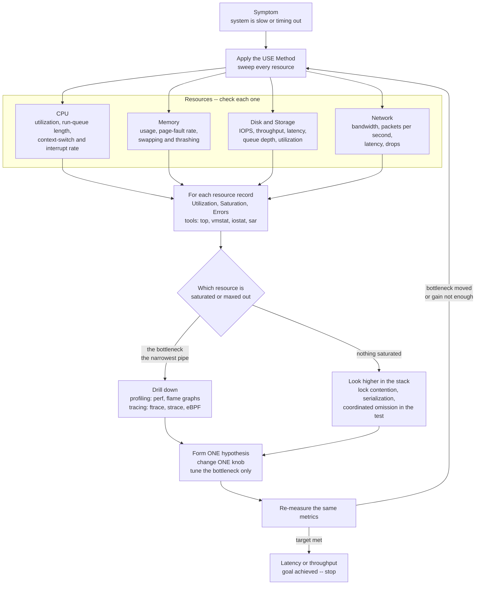

# 🔬 Performance Analysis and OS Tuning

> [!abstract] TL;DR
> Performance work is **empirical detective work, not guessing**. Every system has exactly one resource that limits throughput at any moment — the **bottleneck**, the narrowest pipe — and optimizing anything else is wasted effort (Amdahl's Law makes this mathematically brutal). The discipline is a loop: **measure** utilization, saturation, and errors across CPU, memory, disk, and network with observability tools; **identify** the saturated resource; **drill down** with profiling and tracing (increasingly eBPF); form a hypothesis; **change one thing**; and **re-measure**. Queueing theory explains *why* you must leave headroom: response time explodes non-linearly as any resource approaches 100 percent utilization, so systems that run "hot" fall off a cliff under the smallest extra load.

---

## Intuition

**Analogy:** A good doctor does not prescribe a drug the moment you walk in. She takes your **vitals first** — temperature, blood pressure, pulse, oxygen — because the *symptom* ("I feel awful") tells her almost nothing about the *cause*. Only after measurement does she form a hypothesis, run one targeted test, treat the actual problem, and then re-check the vitals to confirm the treatment worked. Prescribing antibiotics for a viral infection is worse than useless: it costs money, has side effects, and leaves the real illness untouched.

Diagnosing a slow computer is the same. "The website is slow" is a symptom, not a diagnosis. Somewhere in the stack, **one resource is the constraint** — maybe the disk is saturated servicing random reads, maybe a single lock is serializing every request, maybe the CPU is pinned by a runaway thread. That one resource is the *narrowest pipe*: water (work) can only flow through the system as fast as the tightest constriction allows. Widening any *other* pipe changes nothing. So you measure the vitals of every resource, find the pipe that is actually full, widen *that* one, and measure again — because the bottleneck usually *moves* to a new resource once you fix the first. Guessing, tuning at random, or "optimizing" the code you happen to understand best is medicine without a diagnosis.

---

## How It Works

### The philosophy: measure, don't guess

Three principles govern all serious performance work:

1. **Measure, don't guess.** Human intuition about where time goes is famously wrong — the hot spot is almost never where you expect. Instrument first; hypothesize from data. Donald Knuth's warning against "premature optimization" is really a warning against *un-measured* optimization.
2. **Find the bottleneck before optimizing.** Throughput is capped by the single most-constrained resource. Improving a non-bottleneck yields **zero** end-to-end gain — the classic mistake of speeding up a function that was never the limit. **Amdahl's Law** formalizes the ceiling: if a fraction *s* of the work is serial (or bound to the bottleneck), the maximum speedup from parallelizing/optimizing everything else is `1 / s`, no matter how many cores you throw at it. A 5 percent serial section caps you at a 20x speedup forever.
3. **Latency and throughput are different, and averages lie.** A system can have great *average* latency while 1 percent of requests time out. You must look at **percentiles** — p95, p99, p99.9 — because tail latency is what users and downstream services actually feel. The mean hides the very outliers that page you at 3 a.m.

### The key resources and their vital signs

Every performance problem lives in one of four resources. For each, you watch a small set of metrics:

- **CPU** — *utilization* (busy fraction per core), *run-queue length* (threads ready but waiting for a core; saturation), and *context-switch* and *interrupt* rates (high rates signal thrashing between too many runnable threads or an interrupt storm). The scheduler that arbitrates all this is covered in [[CPU_Scheduling_Algorithms]].
- **Memory** — *usage / availability*, *page-fault rate* (especially major faults that hit disk), and *swapping / thrashing* (when the working set exceeds RAM the system spends all its time paging and collapses). The demand-paging machinery behind these numbers is in [[Virtual_Memory_and_Demand_Paging]], and locality — the reason caches work at all — is in [[Memory_Hierarchy_and_Caching]].
- **Disk / storage** — *IOPS*, *throughput* (MB per second), *latency* (per-request service time), *queue depth* (requests in flight; saturation), and *utilization* (fraction of time the device is busy). The elevator algorithms and request ordering are in [[Disk_Scheduling_and_IO_Management]].
- **Network** — *bandwidth*, *packets per second*, *latency / round-trip time*, and *drops / retransmits* (errors and saturation). The kernel networking stack and socket path are covered in [[Networking_in_the_Operating_System]].

### The USE method — a checklist, not a hunch

Brendan Gregg's **USE method** turns bottleneck hunting into a mechanical sweep. For **every resource**, check three things:

- **U**tilization — what fraction of time is it busy?
- **S**aturation — how much extra work is *queued* because the resource cannot keep up?
- **E**rrors — are there error events (disk errors, dropped packets, ECC faults)?

Sweep all resources this way and the saturated one reveals itself — you stop hunting where the light is good and start looking where the data points. Complementary methods include **workload characterization** (who is generating the load and why) and **drill-down analysis** (start at a high-level metric, then descend layer by layer into the responsible subsystem).

### The observability tool landscape

Tools come in three tiers of increasing depth and cost:

1. **Counters (cheap, always-on):** `top` / `htop`, `vmstat`, `iostat`, `mpstat`, `sar`, `ps`, `free`, `netstat`/`ss`. These read kernel counters — near-zero overhead, perfect for the USE sweep.
2. **Profiling (sampling):** `perf`, CPU flame graphs. Sample the stack thousands of times per second to build a statistical picture of *where CPU time goes* without instrumenting every call.
3. **Tracing (event-level):** `strace` and `ftrace` for syscall and kernel-function tracing, and the modern **eBPF** tools — `bcc`, `bpftrace`, and raw BPF programs — that safely run sandboxed code *inside the kernel* to trace almost anything (block I/O latency distributions, scheduler run-queue latency, TCP retransmits) at very low overhead. eBPF is the biggest shift in Linux observability in a decade; the same kernel-programmability trend powers the fast data paths discussed in the forthcoming *Kernel Bypass and Modern IO* note.

### Queueing theory — why you must leave headroom

Model any resource (a CPU, a disk) as a **queue**: requests arrive at rate *lambda*, the server handles them at rate *mu*, and **utilization** is `rho = lambda / mu`. For a simple **M/M/1 queue**, average response time is:

```
R = S / (1 - rho)      where S is the service time of one request
```

As `rho -> 1` (utilization approaching 100 percent), `1 - rho -> 0` and **R blows up toward infinity** — the "hockey-stick" or **knee** curve. A resource at 50 percent utilization has ~2x its base latency; at 90 percent, ~10x; at 99 percent, ~100x. This is why you **provision for headroom** and treat sustained utilization above ~70-80 percent as a red flag: a system running "hot" has no slack to absorb a burst and tips over. **Little's Law** ties the picture together universally: `L = lambda * W` — the average number of requests in the system equals arrival rate times average time-in-system — letting you infer concurrency, throughput, or latency when you can measure the other two.

### Flow / Architecture: the bottleneck-hunting loop



The loop reads left-as-a-cycle: the bottleneck almost always **moves** after each fix (relieve the disk and the CPU becomes the limit), so you re-sweep rather than assuming you are done. The exit condition is a *goal met*, not "the code looks fast."

---

## Key Concepts

### Secondary (intuition level)
- **Bottleneck:** the single slowest link that caps the whole system's speed; the narrowest pipe. Fixing anything else does nothing.
- **Measure first:** run a tool to see what is actually busy before touching anything — like taking a temperature before prescribing.
- **Headroom:** never run a resource near 100 percent busy; leave slack so bursts don't cause meltdown.
- **Latency vs throughput:** latency is how long *one* request takes; throughput is how *many* per second. Optimizing one can hurt the other.

### Undergraduate (mechanism level)
- **The USE method:** for every resource, check **U**tilization, **S**aturation, **E**rrors — a complete, mechanical checklist that beats guessing.
- **Amdahl's Law:** speedup is capped by the serial fraction *s* at `1 / (s + (1-s)/N)`; the un-parallelizable part dominates as core count grows. This is why bottleneck identification matters more than raw parallelism.
- **The four resource groups and metrics:** CPU (utilization, run-queue, context switches), memory (page faults, swap, thrashing), disk (IOPS, latency, queue depth, utilization), network (bandwidth, PPS, RTT, drops).
- **Percentiles over averages:** report p95/p99/p99.9 tail latency; the mean hides the outliers that dominate user pain and cascade through microservices.
- **The tool tiers:** counters (`top`, `vmstat`, `iostat`, `mpstat`, `sar`) → profiling (`perf`, flame graphs) → tracing (`strace`, `ftrace`, eBPF).

### Graduate (design and tension level)
- **Queueing theory in practice:** M/M/1 gives `R = S / (1 - rho)` — the non-linear knee that mandates headroom; **Little's Law** `L = lambda * W` connects concurrency, throughput, and latency and underpins capacity planning (see [[Capacity_Estimation_Reference]] and [[Performance_vs_Scalability]]).
- **Universal Scalability Law (USL):** Gunther's refinement of Amdahl adds a **coherency/crosstalk** term (`kappa`), so throughput not only *plateaus* but can *decline* past an optimal concurrency — the reason adding threads or nodes sometimes makes a system *slower* (lock contention, cache-coherence traffic).
- **Bottleneck taxonomy and diagnosis:** distinguishing **CPU-bound** (high util, high run-queue), **I/O-bound** (low CPU, high iowait, deep disk queues), and **memory-bound** (high page-fault/swap, or stalled on cache/DRAM misses) workloads — each demands a different fix.
- **Micro-architectural bottlenecks:** cache misses and poor locality ([[Memory_Hierarchy_and_Caching]], [[Cache_Hierarchy]]), **false sharing** and cache-line ping-pong under weak memory ordering ([[Memory_Consistency_and_Concurrent_Data_Structures]], [[Cache_Coherence_MESI]]), **TLB misses** solved with huge pages ([[Segmentation_and_the_TLB]], [[Virtual_Memory_and_TLB]]), and **NUMA** locality effects ([[NUMA_and_Memory_Bandwidth]]).
- **Observability-driven performance engineering:** the SRE discipline of continuous measurement, error budgets, and hypothesis-driven change — one variable at a time, always re-measured — connecting OS tuning to [[Monitoring]] and [[Distributed_Tracing]].

---

## Python Demo

This demo makes three core ideas quantitative with **numpy + matplotlib only**: (1) the **M/M/1 knee** — response time exploding as utilization approaches 100 percent, explaining why we provision headroom; (2) **Little's Law** turning a utilization/latency curve into queue length; (3) **Amdahl vs the Universal Scalability Law** — diminishing (and eventually negative) returns; and (4) **identifying the bottleneck resource** from a USE-style utilization snapshot.

```python
# Performance analysis toolkit: queueing knee, Little's Law,
# scalability limits, and bottleneck identification.
# numpy + matplotlib only.
import numpy as np
import matplotlib.pyplot as plt

# ---------------------------------------------------------------
# 1) M/M/1 KNEE: normalized response time R/S = 1 / (1 - rho)
# ---------------------------------------------------------------
rho = np.linspace(0.01, 0.97, 400)          # utilization 1% .. 97%
R_over_S = 1.0 / (1.0 - rho)                 # response time in units of service time
L = rho / (1.0 - rho)                        # avg number in system (M/M/1)

# ---------------------------------------------------------------
# 2) SCALABILITY: Amdahl vs Universal Scalability Law (USL)
# ---------------------------------------------------------------
N = np.arange(1, 65)                         # number of cores / workers
s = 0.05                                     # 5% serial fraction (the bottleneck)
amdahl = 1.0 / (s + (1.0 - s) / N)           # speedup ceiling = 1/s = 20x

sigma, kappa = 0.05, 0.015                   # contention + coherency/crosstalk
usl = N / (1.0 + sigma * (N - 1) + kappa * N * (N - 1))
peak_N = N[np.argmax(usl)]                   # optimal concurrency before decline

# ---------------------------------------------------------------
# 3) BOTTLENECK ID: a USE-style utilization snapshot
# ---------------------------------------------------------------
resources = ["CPU", "Memory", "Disk", "Network"]
utilization = np.array([0.62, 0.55, 0.94, 0.40])   # measured busy-fraction
bottleneck = np.argmax(utilization)                # narrowest pipe = highest util

# ---------------------------------------------------------------
# Plot
# ---------------------------------------------------------------
fig, ax = plt.subplots(2, 2, figsize=(13, 9))

# Panel A: the hockey-stick / knee curve
ax[0, 0].plot(rho * 100, R_over_S, color="#d9534f", lw=2.2)
ax[0, 0].axvline(80, ls="--", color="gray")
ax[0, 0].annotate("headroom limit\n~80% util",
                  xy=(80, 1 / (1 - 0.80)), xytext=(45, 18),
                  arrowprops=dict(arrowstyle="->"))
ax[0, 0].set_xlabel("Utilization (%)")
ax[0, 0].set_ylabel("Response time  (x service time)")
ax[0, 0].set_title("M/M/1 knee: latency explodes near saturation")
ax[0, 0].set_ylim(0, 35)

# Panel B: Little's Law -- queue length grows the same way
ax[0, 1].plot(rho * 100, L, color="#0275d8", lw=2.2)
ax[0, 1].set_xlabel("Utilization (%)")
ax[0, 1].set_ylabel("Avg requests in system  L")
ax[0, 1].set_title("Little's Law:  L = lambda * W  grows without bound")
ax[0, 1].set_ylim(0, 35)

# Panel C: Amdahl vs USL -- diminishing and negative returns
ax[1, 0].plot(N, amdahl, color="#5cb85c", lw=2.2, label="Amdahl (s=0.05, cap=20x)")
ax[1, 0].plot(N, usl,    color="#f0ad4e", lw=2.2, label="USL (contention+coherency)")
ax[1, 0].axhline(1 / s, ls=":", color="#5cb85c")
ax[1, 0].axvline(peak_N, ls="--", color="#f0ad4e")
ax[1, 0].annotate(f"USL peak at N={peak_N}\nthen it gets WORSE",
                  xy=(peak_N, usl.max()), xytext=(peak_N + 6, usl.max() - 3),
                  arrowprops=dict(arrowstyle="->"))
ax[1, 0].set_xlabel("Cores / workers  N")
ax[1, 0].set_ylabel("Speedup")
ax[1, 0].set_title("Scalability limits: bottleneck caps every gain")
ax[1, 0].legend()

# Panel D: identify the bottleneck from utilization
colors = ["#5cb85c"] * len(resources)
colors[bottleneck] = "#d9534f"
ax[1, 1].bar(resources, utilization * 100, color=colors)
ax[1, 1].axhline(80, ls="--", color="gray", label="headroom limit")
ax[1, 1].set_ylabel("Utilization (%)")
ax[1, 1].set_title(f"USE sweep -> bottleneck is {resources[bottleneck]} "
                   f"({utilization[bottleneck]*100:.0f}% busy)")
ax[1, 1].set_ylim(0, 100)
ax[1, 1].legend()

plt.tight_layout()
plt.savefig("perf_analysis_demo.png", dpi=110)
print(f"Amdahl ceiling with s={s}: {1/s:.0f}x   |   USL peaks at N={peak_N}")
print(f"Bottleneck resource: {resources[bottleneck]} "
      f"at {utilization[bottleneck]*100:.0f}% utilization")
print("saved perf_analysis_demo.png")
```

**What you see:** Panels A and B share the same brutal shape — both response time and queue length are fine up to ~70 percent and then rocket toward infinity, which is the mathematical reason for the "always leave headroom" rule. Panel C shows Amdahl flattening at the `1/s = 20x` ceiling while the USL curve actually **peaks and then declines** — the empirical fact that a saturated bottleneck (contention, coherency traffic) can make *more* workers *slower*. Panel D is the USE method in one glance: Disk at 94 percent is the narrowest pipe, so it is the only thing worth tuning right now — speeding up the 40 percent-idle network would change nothing.

---

## Real-World Applications

> **Example — Netflix and the FlameScope / eBPF era.** Netflix runs one of the largest fleets on the planet and popularized **flame graphs** (via Brendan Gregg) and **eBPF-based observability** to diagnose CPU, disk, and network bottlenecks across thousands of instances *without* restarting services. When a service regresses, engineers pull a CPU flame graph to see exactly which stack frames burn cycles, then use `bpftrace` one-liners to trace block-I/O latency or scheduler run-queue delay in production at negligible overhead — the modern embodiment of "measure, don't guess."

- **Cloud capacity planning (SRE):** Little's Law and the M/M/1 knee directly drive autoscaling thresholds. Teams scale out at ~70 percent utilization precisely because the knee curve says latency will explode if they wait for 95 percent (see [[Capacity_Estimation_Reference]], [[Performance_vs_Scalability]]).
- **Database tuning:** diagnosing a slow query engine is USE in practice — is it CPU-bound (poor plans), I/O-bound (buffer-pool misses forcing disk reads), or lock-bound (contention serializing writers)? Postgres/MySQL tuning of buffer pools, `work_mem`, and I/O schedulers is textbook bottleneck-driven work.
- **Linux kernel tuning knobs:** `sysctl` parameters (`vm.swappiness`, `vm.dirty_ratio`, `net.core.rmem_max`, `net.ipv4.tcp_*` congestion settings), **cgroup** CPU/memory/I/O limits, pluggable **I/O schedulers** (`mq-deadline`, `bfq`, `none` for NVMe — see [[IO_Scheduling_and_io_uring]]), **CPU frequency governors** (`performance` vs `powersave`), **interrupt affinity** (pinning NIC IRQs to specific cores), **huge pages** to cut TLB misses ([[Segmentation_and_the_TLB]]), and **NUMA** pinning to keep memory local ([[NUMA_and_Memory_Bandwidth]]).
- **High-frequency trading & low-latency systems:** here tail latency *is* the product — engineers pin threads, disable frequency scaling, isolate cores, use huge pages, and often bypass the kernel entirely (kernel-bypass networking) to shave microseconds off the p99.9.

---

## Common Pitfalls

- **Optimizing a non-bottleneck.** The most common and most wasteful mistake — speeding up the code you understand instead of the resource that is actually saturated. Amdahl's Law guarantees zero end-to-end gain. Always confirm the bottleneck with a USE sweep first.
- **Trusting averages over percentiles.** A great mean latency can hide a p99 that times out. Distributed systems amplify tails: if every service has a 1-in-100 slow request, a request touching 100 services almost *always* hits at least one. Watch p95/p99/p99.9.
- **Running resources near 100 percent "for efficiency."** The M/M/1 knee makes this catastrophic — a resource at 95 percent has ~20x its base latency and no slack for bursts. High utilization looks efficient right up until it collapses.
- **Coordinated omission in benchmarks.** A load tester that waits for each response before sending the next silently *stops the clock* during stalls, so it never records the pileup a real open-load system would suffer — under-reporting tail latency by orders of magnitude. Use open-model load generation and correct for it.
- **Microbenchmarks that lie.** No warmup (JIT/cache cold), a loop the compiler optimizes away, an unrealistic working set that fits in L1, or measuring a single run so variance is invisible. Benchmark the real workload, warm up, run many iterations, and report the distribution.
- **Observer effect and tool overhead.** Heavy tracing (`strace` on a hot path, verbose logging) can itself become the bottleneck and change the very behavior you are measuring. Prefer low-overhead counters and eBPF for production.
- **Changing multiple knobs at once.** If you tune five `sysctl` values together and latency improves, you have learned nothing about *which* helped — and one may have hurt. Change one variable, re-measure, keep or revert.

---

## Related Concepts

- [[Operating_Systems_Overview]] — the resource-manager view of the OS; performance tuning is arbitrating those same CPU, memory, storage, and I/O resources under load.
- [[CPU_Scheduling_Algorithms]] — the run-queue, context-switch, and interrupt metrics you watch for CPU bottlenecks come straight from the scheduler; Amdahl's serial fraction is the scheduling analogue of the bottleneck.
- [[Virtual_Memory_and_Demand_Paging]] — page-fault rate, swapping, and thrashing are the memory vital signs; a thrashing system is the pathological memory bottleneck.
- [[Memory_Hierarchy_and_Caching]] — cache misses and locality are micro-architectural bottlenecks; AMAT is the same "hit fast / miss slow" queue at the hardware level.
- [[Segmentation_and_the_TLB]] — TLB misses are a hidden bottleneck fixed by huge-page tuning.
- [[Disk_Scheduling_and_IO_Management]] — IOPS, latency, queue depth, and utilization for the storage resource; I/O-scheduler choice is a core tuning knob.
- [[Page_Replacement_Algorithms]] — eviction policy quality shows up directly as page-fault rate and thrashing in your measurements.
- [[Networking_in_the_Operating_System]] — the kernel network stack whose bandwidth, PPS, RTT, and drop metrics form the fourth USE resource; TCP tuning lives here.
- [[Process_Synchronization_and_Race_Conditions]] — lock contention and serialization are the "nothing is saturated but it's still slow" bottleneck the USL penalizes.
- [[Memory_Consistency_and_Concurrent_Data_Structures]] — false sharing and cache-line ping-pong under weak ordering turn added cores into *negative* scaling.
- [[Cache_Coherence_MESI]] — the coherence protocol whose crosstalk is the USL's `kappa` term.
- [[NUMA_and_Memory_Bandwidth]] — memory locality tuning; remote-node access is a bandwidth bottleneck.
- [[IO_Scheduling_and_io_uring]] — modern batched I/O submission that amortizes syscall cost, a direct throughput tuning lever.
- [[Interrupts_and_DMA]] — interrupt rates and IRQ affinity tuning for network/disk-heavy workloads.
- [[Distributed_Operating_Systems]] — where bottleneck analysis and Little's Law scale from one node to a coordinated fleet.
- [[Performance_vs_Scalability]] — the system-design framing of the same knee and headroom ideas at fleet scale.
- [[Latency_vs_Throughput]] — the two metrics whose tension defines every tuning trade-off.
- [[Capacity_Estimation_Reference]] — Little's Law and utilization targets applied to provisioning.
- [[Monitoring]] and [[Performance_Monitoring]] — the production, always-on side of measurement.
- [[Distributed_Tracing]] and [[Prometheus_and_Alertmanager]] — the observability stack that carries USE-style metrics across services.

*Forthcoming sibling note referenced above (not yet written): Kernel Bypass and Modern IO.*

---

## Review Questions

1. **(Conceptual)** Explain, using the M/M/1 formula `R = S / (1 - rho)`, why a team that keeps a database CPU at a steady 95 percent utilization "to save money" is making a false economy. What utilization would you target instead, and what does Little's Law let you predict about queue length at each?
2. **(Scenario)** A web service has p50 latency of 20 ms but p99 of 4 seconds. `top` shows CPU at 40 percent, `iostat` shows the disk at 30 percent utilization, and `free` shows plenty of RAM. Nothing is saturated — yet requests stall. Walk through your next diagnostic steps and name at least two likely causes the USE method's "Errors/Saturation but not Utilization" branch points to.
3. **(Trade-off)** You have a workload that is 90 percent parallelizable. Amdahl's Law caps your speedup at 10x, but your measured throughput actually *peaks at 24 cores and then declines*. Explain what Amdahl misses that the Universal Scalability Law captures, identify the physical mechanism causing the decline, and describe one OS/architecture-level tuning change that could push the peak higher.

---

## Sources

- Brendan Gregg — *Systems Performance: Enterprise and the Cloud*, 2nd ed. (Addison-Wesley, 2020); and "The USE Method." [https://www.brendangregg.com/usemethod.html](https://www.brendangregg.com/usemethod.html)
- Brendan Gregg — *BPF Performance Tools: Linux System and Application Observability* (Addison-Wesley, 2019). [https://www.brendangregg.com/bpf-performance-tools-book.html](https://www.brendangregg.com/bpf-performance-tools-book.html)
- Neil J. Gunther — *Guerrilla Capacity Planning* (Springer, 2007), on the Universal Scalability Law. [https://www.perfdynamics.com/Manifesto/USLscalability.html](https://www.perfdynamics.com/Manifesto/USLscalability.html)
- Raj Jain — *The Art of Computer Systems Performance Analysis* (Wiley, 1991), queueing theory and benchmarking methodology. [https://www.cse.wustl.edu/~jain/books/perfbook.htm](https://www.cse.wustl.edu/~jain/books/perfbook.htm)
- Gil Tene — "How NOT to Measure Latency" (coordinated omission), Strange Loop / QCon talk. [https://www.youtube.com/watch?v=lJ8ydIuPFeU](https://www.youtube.com/watch?v=lJ8ydIuPFeU)

---

#operating-systems #performance #observability #profiling #queueing-theory
