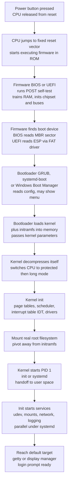

# 🥾 The Boot Process and System Initialization

> [!abstract] TL;DR
> **Booting** is how a computer climbs from cold, powered-off silicon to a running operating system with a login prompt. It solves the **bootstrap problem** — a chicken-and-egg puzzle where you need a program to load the OS, but *loading programs is the OS's job* — by running a **chain of progressively more capable loaders**, each small and simple enough to be found by the previous stage. Power-on forces the CPU to a fixed **reset address** in ROM where **firmware (BIOS or UEFI)** runs a self-test, initializes hardware, and locates a boot device; the firmware loads a **bootloader** (GRUB, systemd-boot, Windows Boot Manager); the bootloader loads and decompresses the **kernel** plus an initramfs into memory; the kernel sets up memory management, the scheduler, interrupts, and drivers, mounts the root filesystem, then starts **PID 1** — `init` or **systemd** — which brings up user-space services and hands you a shell. Modern init systems parallelize service startup, and a **trust chain** (Secure Boot, TPM measurements) can verify each stage's signature before running it.

---

## Intuition

**Analogy:** Booting is a **bucket brigade of ever-more-capable helpers**. A tiny, hardwired chip wakes up first. It is almost stupid — it knows only enough to reach a fixed spot and find a slightly smarter program. That program is still small, but it knows enough to find a smarter one still. That third helper is big enough to locate and load the *full* operating system. No single stage is powerful enough to do the whole job from a standing start, and none has to be: **each stage bootstraps the next**, and the machine literally pulls itself up "by its own bootstraps" — which is exactly where the word **boot** comes from.

The puzzle this solves is genuinely circular. To run a program you normally ask the OS to load it from disk into memory. But at power-on there *is* no OS in memory yet — so who loads the loader? The trick is to make the very first loader so small it can be **baked into hardware (ROM)** and **found at a fixed address the CPU is wired to jump to**. From that one hardwired seed, the chain grows: 512 bytes of firmware-found boot code, then a real bootloader, then a multi-megabyte kernel, then a full user space. Small finds bigger finds biggest.

---

## How It Works

### Core Mechanics

**1. The reset vector — the hardwired seed.** When power stabilizes, the CPU is released from **reset** with its registers in a defined state and its instruction pointer set to a **fixed physical reset address** (on x86, near the top of the address space, `0xFFFFFFF0`). This address is wired by the chipset to point at **firmware in ROM/flash**, not RAM — because RAM is not even initialized yet. The CPU has no choice: it *must* execute whatever sits there. This deterministic starting point is what breaks the chicken-and-egg cycle. (The mode/privilege machinery that governs what runs here is covered in [[Interrupts_Traps_and_Dual_Mode_Operation]].)

**2. Firmware — POST and hardware bring-up.** The firmware is the first real software. It runs **POST (Power-On Self-Test)**: sizing and training DRAM, initializing the memory controller, chipset, buses (PCIe), and enough of the CPU to run C code, and sanity-checking core hardware. It then enumerates devices and consults a configured **boot order** to find a boot device (disk, USB, network). Two generations exist:
   - **Legacy BIOS** — 16-bit real-mode firmware. It reads the first 512-byte sector of the disk, the **MBR (Master Boot Record)**, and jumps to the tiny boot code inside it. The MBR partition scheme caps disks at 2 TiB and holds only a handful of partitions.
   - **UEFI (Unified Extensible Firmware Interface)** — modern 32/64-bit firmware. It understands the **GPT (GUID Partition Table)**, contains a real **FAT filesystem driver**, and loads bootloaders as ordinary **`.efi` executable files** from the **EFI System Partition (ESP)**. It has a built-in **boot manager**, runtime services, and — crucially — **Secure Boot**, which verifies each loaded image's cryptographic signature before executing it (see the trust chain below and the planned *OS_Security_and_Isolation* note).

**3. The bootloader — find and load the kernel.** Firmware hands control to a **bootloader** (GRUB2, systemd-boot, Windows Boot Manager, U-Boot on embedded). Its job is narrow but essential: **locate the OS kernel on disk, load it into memory, optionally present a menu, pass kernel command-line parameters, and load the initramfs.** Bootloaders are often **multi-stage** precisely because of size limits: a legacy MBR gives you only 446 usable bytes of boot code — far too little to parse a filesystem — so *stage 1* just loads a slightly bigger *stage 1.5/2* that has filesystem drivers and can find the real kernel. This is the bootstrap chain in miniature.

**4. initramfs — the temporary root.** The kernel often needs drivers to *reach* its real root filesystem — but those drivers live *on* that filesystem (another chicken-and-egg). The fix is the **initramfs (initial RAM filesystem)**: a small compressed archive the bootloader loads into RAM alongside the kernel. The kernel mounts it as a temporary root, runs its scripts to load storage/RAID/LVM/crypto drivers and (for encrypted disks) to unlock the volume, then **`pivot_root`** onto the real root and discards the initramfs.

**5. Kernel initialization.** The loaded kernel image is typically **self-decompressing** (e.g. `bzImage`): a small stub decompresses the real kernel in place, then switches the CPU from the legacy 16-bit real mode up through protected mode to **64-bit long mode**. The decompressed kernel then initializes its core subsystems, roughly in order:
   - **Memory management** — build the kernel page tables, set up the physical page allocator and virtual address space (see [[Memory_Management_and_Allocation]] and [[Paging_and_Page_Tables]]).
   - **Interrupt handling** — install the **IDT (Interrupt Descriptor Table)** and program the interrupt controller and timer, the linchpin of preemption (see [[Interrupts_Traps_and_Dual_Mode_Operation]]).
   - **The scheduler** — initialize run queues so multiple tasks can be time-shared (see [[CPU_Scheduling_Algorithms]]).
   - **Device drivers** — probe and initialize buses and devices (see [[IO_Systems_and_Device_Drivers]]).
   - **Root filesystem** — mount the real root and prepare the VFS (see [[File_Systems_and_Abstractions]]).

**6. The first process — PID 1.** With the kernel alive, it starts exactly **one** user-space process: **PID 1**, historically `/sbin/init`, today usually **systemd**. This is the *handoff from kernel to user space* and the moment the machine stops being "firmware plus kernel" and becomes a real running system. PID 1 is the **ancestor of every other process** — everything you ever run is a descendant (the process model is covered in [[Processes_and_the_Process_Model]]). PID 1 is special: it can never be killed like a normal process, and it **reaps orphaned processes**. The system-call boundary that user space now uses to talk to the kernel is the subject of [[System_Calls_and_the_Kernel_Interface]].

**7. Init systems — bringing up user space.** PID 1 orchestrates the rest of the boot:
   - **Classic SysV init** — runs shell scripts **sequentially** through numbered **runlevels** (0 = halt, 3 = multi-user text, 5 = graphical, 6 = reboot). Simple and predictable, but slow: each service waits for the previous script to finish even when they are independent.
   - **systemd** — the modern default on most Linux distributions. It models the system as a graph of **units** (services, sockets, mounts, devices, timers) grouped into **targets** (the rough analog of runlevels, e.g. `multi-user.target`, `graphical.target`). It reads the **dependency graph** and starts everything it can **in parallel**, only serializing where a real dependency forces it. It adds **socket activation** (create a service's listening socket first, start the daemon lazily on first connection, and let dependents begin immediately) and on-demand/lazy start. The result is dramatically faster boots on multi-core machines — at the cost of a large, controversial, tightly-integrated ecosystem (journald, udev, logind, networkd, resolved).
   - **Others** — **Upstart** (event-driven, Ubuntu's bridge era), **OpenRC** (Gentoo/Alpine, dependency-based but scriptable), and minimal PID-1s like **runit**/**s6**.

**8. The trust chain — Secure and Measured Boot.** Security-conscious boot makes every stage **verify the next before running it**, forming a chain rooted in hardware:
   - **Secure Boot** — firmware holds trusted public keys and refuses to execute a bootloader whose signature does not verify; the bootloader in turn verifies the kernel (signature verification is the domain of [[Asymmetric_Cryptography_and_PKI]]).
   - **Measured Boot** — each stage **hashes the next** and extends the hash into a **TPM (Trusted Platform Module) PCR** *before* transferring control. The final PCR values are a tamper-evident fingerprint of exactly what booted; a remote party can **attest** it, or a disk can be sealed to unlock only if the measurements match. Together these define the **root of trust** (the planned *OS_Security_and_Isolation* note goes deeper).

**9. Shutdown — the reverse process.** Halting cleanly runs the chain **backwards**: init stops services in reverse dependency order, unmounts filesystems (flushing dirty caches so no data is lost — related to journaling and crash consistency), the kernel quiesces devices, and finally firmware/ACPI powers off. A crash that skips this ordered teardown is exactly why unclean shutdowns risk filesystem inconsistency and slow, fsck-heavy next boots.

### Flow / Architecture



---

## Key Concepts

**Secondary (explain to a curious beginner).**
- **Boot** = the whole trip from "power off" to "login screen." The word comes from *bootstrap* — lifting yourself with no outside help.
- The **firmware chip** wakes first and does a hardware **self-test (POST)**, then finds the disk.
- A **bootloader** finds and starts the **operating system kernel**; the kernel then starts everything else.
- The chain matters because **each helper is bigger than the last** — a tiny one finds a medium one finds the whole OS.

**Undergraduate (CS background).**
- The **reset vector** is a fixed physical address the CPU is hardwired to execute at power-on; it points into ROM, breaking the load-the-loader circularity.
- **BIOS vs UEFI:** 16-bit BIOS + MBR (512-byte boot sector, 2 TiB cap) versus 32/64-bit UEFI + GPT with a FAT driver, a boot manager, and Secure Boot.
- **Multi-stage bootloaders** exist because early stages have too little room for filesystem code.
- **initramfs** provides drivers needed to reach the real root, then `pivot_root` swaps to it.
- **Kernel init order:** decompress → protected/long mode → memory management → IDT/interrupts → scheduler → drivers → mount root → start **PID 1**.
- **SysV runlevels (sequential) vs systemd targets/units (parallel, dependency-driven, socket activation).**

**Graduate (systems thinking).**
- Boot is a **critical-path scheduling problem** on a dependency DAG: parallel init cannot beat the **longest chain**, so the serial firmware+kernel prefix bounds the achievable speedup (an Amdahl's-law ceiling on `systemd-analyze` numbers).
- **Socket activation** is a dependency-inversion trick: creating the socket eagerly lets dependents proceed while the daemon starts lazily, shortening the critical path.
- The **root of trust**: Secure Boot enforces a *chain of signature verification*, while Measured Boot builds a *transitive hash* into TPM PCRs enabling remote attestation and sealed secrets; the security guarantee is only as strong as the immutable hardware/firmware root.
- **Boot as distributed startup**: in clusters and unikernels the same DAG-scheduling and dependency-ordering ideas reappear (relevant to the planned *Distributed_Operating_Systems* and *Real_Time_and_Embedded_Operating_Systems* notes, where deterministic, bounded boot latency is a hard requirement).

---

## Python Demo

We model the boot as a **dependency DAG of initialization units** (systemd-style targets/services), each with a duration and prerequisites. We then compute the **sequential** boot time (naive SysV-style: run everything one after another) versus the **dependency-parallel** boot time (systemd-style: run everything you can at once), recover the **critical path**, and identify which slow unit dominates. numpy + matplotlib only.

```python
# Model the boot sequence as a dependency DAG and compare
# sequential (SysV-style) vs dependency-parallel (systemd-style) boot time.
import numpy as np
import matplotlib.pyplot as plt

# --- Boot units: name, duration (ms), and prerequisite unit indices ---
names = ["firmware_POST", "bootloader", "kernel_load", "kernel_init", "udev",
         "mount_root", "fsck_disk", "mount_other", "network_DHCP", "dbus",
         "journald", "cryptsetup", "user_login"]
dur = np.array([2500, 800, 400, 900, 700, 300, 1200, 250, 1500, 200, 150, 1000, 300],
               dtype=float)
deps = [[], [0], [1], [2], [3], [3], [5], [6], [4], [3], [3], [4], [7, 8, 9, 11]]
N = len(names)

# --- Topological order via Kahn's algorithm ---
succ = [[] for _ in range(N)]
for j, ds in enumerate(deps):
    for i in ds:
        succ[i].append(j)
indeg = np.array([len(d) for d in deps])
queue = [i for i in range(N) if indeg[i] == 0]
order = []
while queue:
    n = queue.pop(0)
    order.append(n)
    for s in succ[n]:
        indeg[s] -= 1
        if indeg[s] == 0:
            queue.append(s)

# --- Earliest start/finish under unlimited parallelism (respect deps only) ---
start = np.zeros(N)
crit_pred = [-1] * N          # predecessor that determined this unit's start
for n in order:
    for p in deps[n]:
        if start[p] + dur[p] > start[n]:
            start[n] = start[p] + dur[p]
            crit_pred[n] = p
finish = start + dur

serial   = dur.sum()          # SysV: strictly one after another
makespan = finish.max()       # systemd: dependency-parallel wall-clock
speedup  = serial / makespan

# --- Recover the critical path by backtracking from the last finisher ---
end = int(np.argmax(finish))
path = [end]
while crit_pred[path[-1]] != -1:
    path.append(crit_pred[path[-1]])
path = path[::-1]
on_crit = np.zeros(N, dtype=bool)
on_crit[path] = True
dominant = path[int(np.argmax(dur[path]))]

print(f"Sequential (SysV-style):   {serial:6.0f} ms")
print(f"Parallel  (systemd-style): {makespan:6.0f} ms")
print(f"Speedup:                   {speedup:5.2f}x")
print("Critical path: " + " -> ".join(names[i] for i in path))
print(f"Dominant unit on critical path: {names[dominant]} ({dur[dominant]:.0f} ms)")

# --- Plot: Gantt of the parallel boot + sequential-vs-parallel comparison ---
fig, (ax1, ax2) = plt.subplots(1, 2, figsize=(14, 6),
                               gridspec_kw={"width_ratios": [2, 1]})

y_order = np.argsort(start)   # draw bars in start-time order
for row, i in enumerate(y_order):
    color = "crimson" if on_crit[i] else "steelblue"
    ax1.barh(row, dur[i], left=start[i], color=color, edgecolor="black")
    ax1.text(start[i] + dur[i] + 40, row, f"{dur[i]:.0f}", va="center", fontsize=8)
ax1.set_yticks(range(N))
ax1.set_yticklabels([names[i] for i in y_order])
ax1.invert_yaxis()
ax1.axvline(makespan, ls="--", color="green")
ax1.text(makespan, N - 0.5, f" boot done\n {makespan:.0f} ms", color="green", fontsize=9)
ax1.set_xlabel("Time since power-on (ms)")
ax1.set_title("Boot Gantt  |  red = critical path (systemd parallel init)")

ax2.bar(["Sequential\n(SysV init)", "Parallel\n(systemd)"], [serial, makespan],
        color=["gray", "seagreen"], edgecolor="black")
for x, v in enumerate([serial, makespan]):
    ax2.text(x, v + 80, f"{v:.0f} ms", ha="center", fontsize=10)
ax2.set_ylabel("Total boot time (ms)")
ax2.set_title(f"Boot time: {speedup:.2f}x speedup")

plt.tight_layout()
plt.savefig("boot_sequence.png", dpi=120)
plt.show()
```

**What it shows.** The Gantt chart makes the **critical path** obvious in red: `firmware_POST -> bootloader -> kernel_load -> kernel_init -> udev -> network_DHCP -> user_login`. Parallelizing everything else (fsck, cryptsetup, dbus, journald run *concurrently*) drops wall-clock boot time from the sequential sum to the length of that longest chain — the concrete systemd speedup. The analysis also reveals the sobering ceiling: because **firmware POST and the serial kernel prefix cannot be parallelized**, they dominate the path and cap the speedup (an Amdahl's-law limit). Among the *parallelizable* user-space units, the **network DHCP wait** is the critical-path bottleneck — which is exactly why `systemd-analyze critical-chain` so often fingers network waits, and why "don't block boot on the network" is standard tuning advice.

---

## Real-World Applications

- **Linux on x86 (the canonical path):** UEFI → the ESP loads GRUB2 or systemd-boot → kernel `vmlinuz` + `initramfs` → systemd as PID 1 → `graphical.target`. Engineers profile this with **`systemd-analyze`** (total time and firmware/loader/kernel/userspace breakdown), **`systemd-analyze blame`** (slowest units), and **`systemd-analyze critical-chain`** (the dependency critical path) — the real-world version of the demo above (see the planned *Performance_Analysis_and_OS_Tuning* note).
- **Cloud fast-boot:** Firecracker microVMs and unikernels strip firmware/bootloader stages and boot a minimal kernel in **tens of milliseconds** to make serverless cold-starts viable.
- **Containers skip firmware entirely:** a container "boot" has **no firmware, no bootloader, and no kernel load** — it shares the host kernel and simply starts an isolated PID 1 in new namespaces. That is *why* containers start in milliseconds versus a VM's full boot (see [[Containers_and_OS_Level_Virtualization]]).
- **Network boot (PXE):** diskless machines fetch the bootloader and kernel over TFTP/HTTP from the network — the backbone of data-center provisioning and thin clients.
- **Secure/Measured Boot in production:** enterprise laptops and cloud confidential-computing images use TPM measurements to attest boot integrity and to unlock disk encryption only on a known-good boot chain.

---

## Common Pitfalls

- **Bricking Secure Boot with unsigned kernels/modules.** Enabling Secure Boot and then installing an out-of-tree driver (e.g. a GPU or VPN module) that is not signed makes the kernel refuse to load it — or the machine refuses to boot at all. Fix: enroll a Machine Owner Key (MOK) and sign your modules, or disable Secure Boot deliberately.
- **Blocking boot on the network.** Enabling `network-online.target` as a hard dependency of a service makes every boot wait for DHCP/DNS, often adding many seconds (or a 90-second timeout when the link is down). This is the single most common `systemd-analyze blame` offender.
- **Confusing `network.target` with `network-online.target`.** The first means "networking has *started*," the second means "a route is *actually up*." Depending on the wrong one causes services to start before connectivity exists.
- **A wrong `root=` or missing initramfs driver → unbootable.** If the initramfs lacks the storage/RAID/LVM/crypto driver needed to reach the root filesystem, the kernel panics with "unable to mount root." Always regenerate the initramfs after changing storage layout.
- **MBR/BIOS vs GPT/UEFI mismatch.** Installing a GPT disk expecting legacy BIOS boot (or vice versa) leaves no bootable code where firmware looks. UEFI needs an EFI System Partition; legacy BIOS needs a BIOS boot partition for GRUB on GPT.
- **Unclean shutdown ⇒ slow, fsck-heavy next boot.** Skipping the ordered teardown leaves dirty caches and a filesystem marked inconsistent, forcing a full check that can dominate the next boot's critical path.
- **Assuming parallel init is "free."** systemd cannot parallelize the serial firmware+kernel prefix, so past a point, tuning userspace yields diminishing returns — the critical path, not the total unit count, is what to optimize.

---

## Related Concepts

- [[Operating_Systems_Overview]] — booting is the process that *creates* the running OS this note describes.
- [[OS_Structure_and_Kernel_Architectures]] — whether the kernel is monolithic or a microkernel shapes what the boot chain must load and initialize.
- [[Interrupts_Traps_and_Dual_Mode_Operation]] — kernel init installs the IDT and arms the timer; boot begins at the CPU's reset vector, the hardwired seed.
- [[Memory_Management_and_Allocation]] — one of the first subsystems the kernel brings up during initialization.
- [[Paging_and_Page_Tables]] — the kernel builds its page tables and switches to protected/long mode early in boot.
- [[CPU_Scheduling_Algorithms]] — the scheduler is initialized before PID 1 so multiple processes can be time-shared.
- [[IO_Systems_and_Device_Drivers]] — device probing and driver init are a major, parallelizable part of boot.
- [[File_Systems_and_Abstractions]] — mounting the root filesystem (after `pivot_root` from initramfs) is the gateway to user space.
- [[Processes_and_the_Process_Model]] — PID 1 is the first process and ancestor of all others, created at the kernel-to-user handoff.
- [[System_Calls_and_the_Kernel_Interface]] — once PID 1 runs, user space talks to the kernel exclusively through system calls.
- [[Containers_and_OS_Level_Virtualization]] — a container "boot" skips firmware/bootloader/kernel entirely and just starts an isolated PID 1.
- [[Asymmetric_Cryptography_and_PKI]] — Secure Boot's signature verification of each stage relies on public-key cryptography.
- [[Interrupts_and_DMA]] — the firmware and drivers configure interrupt controllers and DMA during hardware bring-up.
- [[Linux_Fundamentals]] — the practical Linux boot chain (GRUB, initramfs, systemd) in day-to-day operation.

---

## Review Questions

1. **(Secondary)** In plain terms, what is the "bootstrap problem," and how does a chain of progressively larger loaders solve it? Why is the word "boot" appropriate?
2. **(Undergraduate)** Contrast BIOS+MBR with UEFI+GPT across four dimensions: address mode, partition scheme, how the firmware locates the bootloader, and what security feature UEFI adds. Then explain why legacy bootloaders are multi-stage.
3. **(Graduate)** A team parallelizes every user-space service with systemd but `systemd-analyze` still reports a boot time barely lower than before. Using the idea of a dependency DAG and critical path, explain why, identify which stages likely dominate, and describe two concrete changes (one architectural, one config) that could actually shorten the critical path.

---

## Sources

- Silberschatz, Galvin, Gagne — *Operating System Concepts*, 10th ed., ch. 1–2 (system boot, bootstrap program, the first process).
- Arpaci-Dusseau & Arpaci-Dusseau — *Operating Systems: Three Easy Pieces* (process creation, limited direct execution, kernel/user boundary). [https://pages.cs.wisc.edu/~remzi/OSTEP/](https://pages.cs.wisc.edu/~remzi/OSTEP/)
- The Linux Kernel documentation — *The boot process / x86 boot protocol*. [https://docs.kernel.org/arch/x86/boot.html](https://docs.kernel.org/arch/x86/boot.html)
- systemd manual — *bootup(7)* and *systemd-analyze(1)*. [https://www.freedesktop.org/software/systemd/man/latest/bootup.html](https://www.freedesktop.org/software/systemd/man/latest/bootup.html)
- UEFI Forum — *UEFI Specification* (boot manager, EFI System Partition, Secure Boot). [https://uefi.org/specifications](https://uefi.org/specifications)

---

#operating-systems #boot-process #uefi #bootloader #systemd
