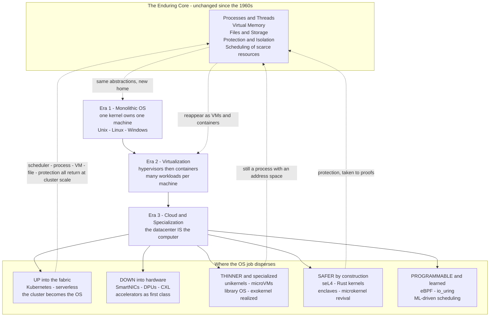

# 🔭 The Future of Operating Systems

> [!abstract] TL;DR
> For fifty years an operating system was the single all-powerful **resource manager and abstraction layer** for **one machine** — handing out **processes**, **threads**, **virtual memory**, **file systems**, and **protection**. Those abstractions are so fundamental they have survived every hardware revolution and are **not going away**. What is changing is *where the OS job lives*. The "computer" is now a **whole datacenter**, and the OS is being **unbundled**: some duties move **up** into the cloud fabric (Kubernetes, serverless), some move **down** into the hardware (SmartNICs, DPUs, CXL, accelerators), some collapse into **tiny specialized kernels** (unikernels, microVMs), some are being **re-secured by construction** (seL4, Rust kernels, enclaves), and some become **programmable and learned** (eBPF, io_uring, ML-driven scheduling). The landlord of a single machine is becoming a **distributed property-management company** — and the same old problems, concurrency, security, and the hardware-software gap, reappear at every scale.

## Intuition

**Analogy:** Picture the operating system as the **landlord of a single building**. For decades it owned everything about that one machine: it decided who got which room (memory), whose turn it was to use the kitchen (the CPU), it kept a locked mailbox for each tenant (protection), and it gave everyone the *illusion* of a private mansion even though they shared one cramped structure (virtual memory and processes). One landlord, one building, total control.

Now the "building" is not a building anymore — it is a **whole city of thousands of buildings**: a datacenter. And the tenants are no longer polite office workers; they are **AI training jobs** that want a hundred GPUs at once and **microservices** that are born and die in milliseconds. No single landlord can micromanage a city. So the landlord's job is being **split into a property-management company**. A **city-level dispatcher** (Kubernetes, serverless) decides which building a tenant goes in. **Smart appliances in each unit** (SmartNICs, DPUs) now handle their own plumbing without bothering the landlord. Some tenants get a **prefab pod** shipped with only the exact fixtures they need and nothing else (unikernels) so it can be dropped in and booted in a blink. And because the city is a bigger target, some units are built as **vaults with cryptographic locks** (enclaves, formally verified kernels). The landlord is not obsolete — the *job* of allocating scarce shared resources safely is eternal. It has simply **dispersed** across hardware, tiny kernels, and the cloud fabric. Learn to see it, and you will spot the operating system everywhere: in your phone, in a smartwatch, in a SmartNIC, and in the scheduler that runs a hyperscaler.

---

## How It Works

### First, the enduring core — the job that never changes

Before looking forward, recap the timeless mandate that ties this whole vault together. An operating system does two things, and it has done them since the 1960s:

1. **It is a resource manager.** Scarce, shared hardware — CPU time, RAM, disk, network — must be divided among competing programs *fairly, safely, and efficiently*. That is [[CPU_Scheduling_Algorithms]] for the CPU, [[Memory_Management_and_Allocation]] and [[Virtual_Memory_and_Demand_Paging]] for RAM, [[Disk_Scheduling_and_IO_Management]] for storage.
2. **It is an abstraction layer.** It hides ugly, heterogeneous hardware behind a handful of clean, portable ideas: the **process** and **thread** ([[Processes_and_the_Process_Model]], [[Threads_and_Concurrency_Models]]), the **virtual address space** ([[Paging_and_Page_Tables]], [[Segmentation_and_the_TLB]]), the **file** as a stream of bytes ([[File_Systems_and_Abstractions]]), and the **protection boundary** between trusted and untrusted code ([[Protection_and_Access_Control]], [[Interrupts_Traps_and_Dual_Mode_Operation]]).

These five ideas — process, thread, virtual memory, file, protection — are the **invariants**. Every trend below is a debate about *who implements them and where*, never about *whether* they are needed. Read [[Operating_Systems_Overview]] as the "before" bookend to this "after."

### The forces reshaping the OS

The comfortable era of one kernel per machine ended for structural reasons:

- **The end of easy single-core scaling.** Dennard scaling stopped; clock speeds plateaued around 2005. Performance now comes from **many cores** and **heterogeneous** silicon (CPU + GPU + TPU + FPGA + DPU). The OS must schedule and coordinate a zoo of processing elements, not one CPU. See [[Memory_Hierarchy_and_Caching]] for why cache coherence and NUMA make this hard.
- **The datacenter is "the computer."** Applications no longer run on *a* server; they run on *a fleet*. The unit of deployment became the container and then the function, and resource management became a **cluster-wide** problem.
- **AI/ML workloads dominate.** Training and serving huge models is now a first-class workload with its own needs: GPU/accelerator scheduling, gang scheduling, high-bandwidth interconnects, and enormous memory. The OS is being specialized to feed accelerators.
- **Security threats escalated.** Multi-tenancy, supply-chain attacks, and hardware side channels (Spectre/Meltdown) made **isolation** the headline feature, pushing designs toward verified and capability-based kernels.
- **Specialization beats generality for performance.** A general-purpose OS carries features 99% of a given workload never uses. Stripping the OS down to exactly what one app needs unlocks speed and shrinks the attack surface.

### Where the OS job is going — five directions at once

1. **Up into the fabric — the cloud as the new OS.** [[Kubernetes_for_SD|Kubernetes]] and serverless platforms are the **datacenter operating system**. Every classic OS abstraction reappears at cluster scale: the *scheduler* becomes the pod scheduler, the *process* becomes the container/pod, *virtual memory* becomes cluster resource quotas, the *file system* becomes distributed storage ([[Distributed_File_Systems]]), *protection* becomes network policy and RBAC. The abstractions did not vanish — they **moved up a level**. (See the forthcoming *Distributed_Operating_Systems* note.)
2. **Down into the hardware — offload and co-design.** Jobs the kernel used to do in software now run on dedicated silicon. **SmartNICs and DPUs** run the network stack, encryption, and even storage virtualization off the main CPU. **Computational storage** pushes filtering into the SSD. **CXL** enables disaggregated, pooled memory across a rack. **Accelerators** (GPUs/TPUs) become first-class schedulable citizens. The OS increasingly *orchestrates* heterogeneous hardware rather than doing the work itself — a theme rooted in [[IO_Systems_and_Device_Drivers]].
3. **Thinner and specialized — unikernels and library OSes.** Instead of a general kernel plus an app, you **compile the application together with only the OS pieces it needs** into one tiny, single-address-space image that boots in milliseconds with a minimal attack surface. This is the 1990s **exokernel/library-OS** idea (MIT) finally realized: specialization over generality. Related in spirit to lean [[OS_Structure_and_Kernel_Architectures|microkernels]] and to embedded/real-time systems (forthcoming *Real_Time_and_Embedded_Operating_Systems* note).
4. **Safer by construction — security-driven kernels.** **Confidential computing** runs workloads inside hardware **enclaves** (Intel SGX/TDX, AMD SEV, Arm CCA) so even the host OS and hypervisor cannot read your memory. **Formally verified kernels** like **seL4** carry mathematical proofs of correctness. **Rust-based kernels** (Redox, and Rust landing in Linux) eliminate whole classes of memory-safety bugs. The **microkernel** is having a resurgence because a smaller trusted computing base is easier to isolate and prove. (See the forthcoming *OS_Security_and_Isolation* note and cross-link to [[Container_and_Kubernetes_Security]].)
5. **Programmable and learned — the kernel evolves.** **eBPF** turns the Linux kernel into a **safe, extensible platform**: you load verified sandboxed programs into the running kernel for networking, observability, and security without recompiling or crashing it. **io_uring** modernizes async I/O with shared ring buffers, letting the *in-kernel* path compete with user-space kernel-bypass (DPDK/SPDK) frameworks (forthcoming *Kernel_Bypass_and_Modern_IO* note; see [[IO_Scheduling_and_io_uring]]). And **ML-driven management** — learned schedulers, learned page-replacement, self-tuning databases and kernels — lets the OS *adapt* instead of relying on fixed heuristics.

### The arc, visualized



---

## Key Concepts

**Secondary (foundational intuition):**
- The OS is a **resource manager + abstraction layer** — that job is eternal; only its *location* changes.
- **Five invariant abstractions** survive every revolution: process, thread, virtual memory, file, protection.
- A **container** shares one kernel; a **VM** carries its own kernel. Everything modern lives on the spectrum between them.
- **Serverless** means you write a function and never see the server — the OS abstraction moved into the cloud fabric.
- **Kubernetes is a "datacenter operating system"**: it schedules, isolates, stores, and networks at cluster scale.

**Undergraduate (mechanism-level):**
- The **isolation-vs-density-vs-startup** trade space: bare metal → VM → microVM → gVisor → container → unikernel → serverless, each trading isolation strength for lower startup time and higher density.
- **Unikernels / library OSes** and the **exokernel** principle: link only the OS code the single application uses; single address space; boot in milliseconds; tiny attack surface.
- **microVMs** (Firecracker) reconcile the trade: VM-grade hardware isolation with container-like ~125 ms boot and a few MB overhead — the engine behind AWS Lambda/Fargate.
- **eBPF**: a verifier-checked bytecode VM *inside* the kernel for safe extension (XDP networking, tracing, LSM security) without kernel modules.
- **io_uring**: shared submission/completion ring buffers that batch async syscalls, cutting per-op overhead and closing the gap to user-space bypass.
- **Hardware assist history**: software binary translation (2000) → Intel VT-x / AMD-V CPU virtualization (2006) → EPT/NPT nested paging (2008) → SR-IOV device passthrough (2010) drove virtualization overhead from ~30% down to low single digits.

**Graduate (systems and research-level):**
- **Confidential computing / TEEs**: SGX/TDX, SEV-SNP, Arm CCA — memory encryption + attestation so the workload trusts *neither* the host OS *nor* the hypervisor; the trust boundary inverts.
- **Formal verification**: seL4's machine-checked proof that the kernel's C implementation matches its spec (functional correctness, integrity, confidentiality) — and why proof cost scales with kernel size, favoring microkernels.
- **Memory-safe kernels**: Rust for Linux and Redox eliminate use-after-free/buffer-overflow classes that dominate kernel CVEs; the trade is a steeper build and a smaller unsafe TCB.
- **Hardware/OS disaggregation**: CXL memory pooling, DPU-offloaded hypervisors (AWS Nitro), and computational storage break the assumption that one CPU owns all resources — the OS becomes a distributed control plane over a rack.
- **Learned systems**: ML-driven schedulers, cache/eviction policies, and index structures (learned indexes) replacing fixed heuristics; the open question is safety, worst-case bounds, and distribution shift.
- **OS for AI and AI for OS**: gang/topology-aware GPU scheduling and KV-cache-aware memory management for model serving on one side; reinforcement-learned resource managers on the other.

---

## Python Demo

```python
# The modern OS "abstraction spectrum" and the historical trend that created it.
# Two synthesis views, numpy + matplotlib only:
#
#   PANEL 1 - the historical force: virtualization OVERHEAD shrinking as
#             hardware assist matured (software translation -> VT-x -> EPT ->
#             SR-IOV). This is WHY dense virtualization became free enough to
#             build the cloud on.
#
#   PANEL 2 - the design trade space TODAY: every deployment model plotted on
#             isolation-strength (y) vs startup-time (x, log). Bubble area =
#             per-instance memory overhead. This is the map modern systems
#             navigate: bare metal -> VM -> microVM -> gVisor -> container ->
#             unikernel -> serverless function.
#
#   PANEL 3 - startup time as bars (log scale): the "cold start" axis.
#
#   PANEL 4 - the eternal trade-off: isolation strength vs achievable DENSITY
#             (instances per 128 GB host). You cannot maximize both; each
#             approach picks a point on this frontier.

import numpy as np
import matplotlib.pyplot as plt

# ---------------------------------------------------------------------------
# PANEL 1 : historical virtualization overhead vs the arrival of HW assist
# ---------------------------------------------------------------------------
years = np.array([2000, 2003, 2006, 2008, 2010, 2013, 2016, 2019, 2022, 2025])
# approximate CPU+memory virtualization overhead (percent of native throughput lost)
overhead_pct = np.array([32.0, 18.0, 11.0, 6.5, 4.0, 3.0, 2.2, 1.8, 1.5, 1.2])
milestones = {
    2000: "SW binary\ntranslation",
    2006: "Intel VT-x /\nAMD-V",
    2008: "EPT / NPT\nnested paging",
    2010: "SR-IOV\npassthrough",
    2019: "microVMs\n(Firecracker)",
}

# ---------------------------------------------------------------------------
# PANELS 2-4 : the deployment spectrum
# name, startup_ms, isolation_strength(1-10), mem_overhead_MB
# isolation = strength of the boundary between mutually distrusting tenants
# ---------------------------------------------------------------------------
models = [
    # name,               startup_ms, isolation, mem_MB
    ("Bare metal",          30000.0,   10.0,      0.0),
    ("VM",                  25000.0,    9.0,   1024.0),
    ("microVM\n(Firecracker)", 125.0,   8.0,      5.0),
    ("Unikernel",              20.0,    7.0,      8.0),
    ("gVisor\nsandbox",       100.0,    6.0,     15.0),
    ("Container",              50.0,    4.0,     40.0),
    ("Serverless\nfunction",  200.0,    5.0,     30.0),
]
names      = [m[0] for m in models]
startup    = np.array([m[1] for m in models])
isolation  = np.array([m[2] for m in models])
mem_mb     = np.array([m[3] for m in models])

host_ram_gb = 128.0
# bare metal = 1 tenant; others limited by their memory footprint (floor 1 MB)
density = np.where(mem_mb < 1.0, 1.0, (host_ram_gb * 1024.0) / np.maximum(mem_mb, 1.0))
density[0] = 1.0  # bare metal is a single dedicated tenant

colors = plt.cm.viridis(np.linspace(0.1, 0.9, len(models)))

# ---------------------------------------------------------------------------
# Figure
# ---------------------------------------------------------------------------
fig, ax = plt.subplots(2, 2, figsize=(14, 10))

# PANEL 1 -------------------------------------------------------------------
ax[0, 0].plot(years, overhead_pct, "o-", color="tab:red", lw=2, ms=6)
ax[0, 0].fill_between(years, overhead_pct, alpha=0.15, color="tab:red")
for yr, label in milestones.items():
    i = np.where(years == yr)[0][0]
    ax[0, 0].annotate(label, (years[i], overhead_pct[i]),
                      textcoords="offset points", xytext=(6, 14),
                      fontsize=8, ha="left",
                      arrowprops=dict(arrowstyle="->", color="gray", lw=0.8))
ax[0, 0].set_title("(1) Virtualization overhead collapsed as HW assist matured",
                   fontsize=11, fontweight="bold")
ax[0, 0].set_xlabel("year")
ax[0, 0].set_ylabel("overhead lost vs native  [percent]")
ax[0, 0].grid(alpha=0.3)
ax[0, 0].set_ylim(0, 36)

# PANEL 2 : isolation vs startup, bubble = memory overhead --------------------
sizes = 60 + mem_mb * 1.2  # bubble area scales with memory footprint
sc = ax[0, 1].scatter(startup, isolation, s=sizes, c=colors,
                      edgecolors="black", linewidths=0.8, alpha=0.85, zorder=3)
for i, n in enumerate(names):
    ax[0, 1].annotate(n, (startup[i], isolation[i]),
                      textcoords="offset points", xytext=(8, 6), fontsize=8)
ax[0, 1].set_xscale("log")
ax[0, 1].set_title("(2) Design trade space: isolation vs startup\nbubble area = memory overhead",
                   fontsize=11, fontweight="bold")
ax[0, 1].set_xlabel("startup time  [ms, log scale]")
ax[0, 1].set_ylabel("isolation strength  [1 weak .. 10 strong]")
ax[0, 1].grid(alpha=0.3)
ax[0, 1].set_ylim(2, 11)
ax[0, 1].annotate("stronger isolation\ncosts startup + memory",
                  (23000, 9.6), fontsize=8, color="gray")

# PANEL 3 : startup times (log bars) -----------------------------------------
order = np.argsort(startup)
bars = ax[1, 0].bar(np.arange(len(models)), startup[order], color=colors[order])
ax[1, 0].set_yscale("log")
ax[1, 0].set_xticks(np.arange(len(models)))
ax[1, 0].set_xticklabels([names[i].replace("\n", " ") for i in order],
                         rotation=35, ha="right", fontsize=8)
ax[1, 0].set_title("(3) Cold-start latency spans 6 orders of magnitude",
                   fontsize=11, fontweight="bold")
ax[1, 0].set_ylabel("startup time  [ms, log scale]")
ax[1, 0].grid(alpha=0.3, axis="y")
for b, v in zip(bars, startup[order]):
    ax[1, 0].text(b.get_x() + b.get_width() / 2, v * 1.3,
                  f"{v:.0f}", ha="center", fontsize=7)

# PANEL 4 : the eternal trade-off, isolation vs density ----------------------
ax[1, 1].scatter(density, isolation, s=sizes, c=colors,
                 edgecolors="black", linewidths=0.8, alpha=0.85, zorder=3)
for i, n in enumerate(names):
    ax[1, 1].annotate(n, (density[i], isolation[i]),
                      textcoords="offset points", xytext=(6, 6), fontsize=8)
ax[1, 1].set_xscale("log")
ax[1, 1].set_title("(4) The eternal trade-off: isolation vs density\n(instances per 128 GB host)",
                   fontsize=11, fontweight="bold")
ax[1, 1].set_xlabel("achievable density  [instances / host, log]")
ax[1, 1].set_ylabel("isolation strength  [1 .. 10]")
ax[1, 1].grid(alpha=0.3)
ax[1, 1].set_ylim(2, 11)
ax[1, 1].annotate("Pareto frontier:\npick your point", (5, 4),
                  fontsize=8, color="gray")

plt.suptitle("The Future of Operating Systems: the abstraction spectrum and the trend that built it",
             fontsize=13, fontweight="bold")
plt.tight_layout(rect=[0, 0, 1, 0.96])
plt.savefig("future_of_os_spectrum.png", dpi=110)
print("Saved future_of_os_spectrum.png")
for i, n in enumerate(names):
    print(f"{n.replace(chr(10),' '):22s}  startup={startup[i]:8.0f} ms  "
          f"isolation={isolation[i]:4.1f}  density~{density[i]:,.0f}/host")
```

**What it shows.** Panel 1 is the *cause*: virtualization overhead fell from ~32% (pure software translation, 2000) to low single digits as each hardware milestone — VT-x, EPT nested paging, SR-IOV — moved a virtualization job into silicon. That collapse is *why* dense multi-tenancy became cheap enough to build the entire cloud on. Panels 2–4 are the *consequence*: a continuous **trade space** every modern system navigates. There is no single "best" OS deployment — a VM buys hardware-grade isolation at seconds of startup and a gigabyte of overhead; a container buys thousands-per-host density and millisecond startup at the price of a shared-kernel boundary; a **unikernel** boots in ~20 ms with a tiny attack surface; a **microVM** and **serverless function** deliberately sit in the middle to get *both* good isolation and fast startup. Panel 4 makes the eternal law explicit: **isolation and density trade against each other**, and each approach simply picks a different point on that frontier — the exact same resource-management dilemma the OS has always faced, now spread across a whole menu of implementations.

---

## Real-World Applications

- **AWS Lambda / Fargate on Firecracker** — serverless functions run inside **microVMs** that boot in ~125 ms, delivering VM-grade isolation with container-like density for safe multi-tenant execution; the OS abstraction is fully hidden behind "upload a function."
- **Kubernetes as datacenter OS** — [[Kubernetes_for_SD|Kubernetes]] schedules pods, enforces resource quotas and network policy, provides distributed storage and service discovery: every classic OS duty, re-implemented at cluster scale for [[Microservices|microservice]] fleets.
- **Cilium and eBPF in production** — cloud networking, load balancing, and security observability run as **eBPF** programs loaded into the live Linux kernel at Google, Meta, and across managed Kubernetes, replacing iptables and kernel modules.
- **AWS Nitro / DPUs** — the hypervisor, networking, and storage virtualization are **offloaded to dedicated hardware cards**, freeing the main CPU for customer workloads — the OS's own duties moving *down* into silicon.
- **Confidential computing** — Azure and GCP offer VMs backed by **AMD SEV-SNP / Intel TDX** enclaves so tenants run sensitive workloads where even the cloud provider's host OS cannot read their memory (see [[Container_and_Kubernetes_Security]]).
- **seL4 in safety-critical systems** — the formally verified microkernel underpins defense, automotive, and aerospace stacks where a mathematically proven isolation boundary is a hard requirement.
- **Unikernels for edge and network functions** — MirageOS and Unikraft compile network appliances and edge functions into tiny single-purpose images that boot in milliseconds with minimal attack surface.
- **AI training clusters** — GPU-aware, topology-aware gang schedulers (Kubernetes device plugins, Slurm, Ray) feed [[GPU_Architecture_and_CUDA|accelerators]] for [[Distributed_Training_Overview|large-model training]] — the OS specializing for the workload that now dominates the datacenter.

---

## Common Pitfalls

- **"The OS is obsolete / dead."** The opposite: its abstractions are so fundamental they *reappear at every scale*. A cluster scheduler, a unikernel, and a SmartNIC are all doing OS jobs. The kernel did not disappear; it dispersed.
- **Assuming a container gives VM-grade isolation.** Containers share one kernel — a single kernel CVE escapes *all* of them. For hostile multi-tenancy you need a microVM (Firecracker), a syscall sandbox (gVisor), or a TEE. See [[Containers_and_OS_Level_Virtualization]].
- **Chasing serverless / unikernels for everything.** Serverless cold starts, execution-time limits, and statelessness make it wrong for long-lived, stateful, or latency-critical services. Unikernels are hard to debug (no shell, no psql, single address space) and lack a general driver ecosystem.
- **Forgetting the CAP-style tax of "up into the fabric."** Moving the OS to the cluster inherits *distributed-systems* failure modes — partial failure, partitions, consistency — that a single machine never had. The forthcoming *Distributed_Operating_Systems* note covers this.
- **Trusting hardware offload blindly.** DPUs, SmartNICs, and firmware are themselves complex computers with their own bugs and attack surface; offload moves the problem, it does not delete it.
- **Believing "learned = better."** ML-driven schedulers can beat fixed heuristics on average but may lack worst-case guarantees and degrade under distribution shift; production systems need safe fallbacks.
- **Treating enclaves as magic.** TEEs shrink the trusted computing base but remain vulnerable to side channels, require careful attestation, and impose performance costs; they change the trust model, they are not a free-pass.
- **Ignoring the enduring core.** New engineers who learn Kubernetes but not [[Processes_and_the_Process_Model|processes]], [[Virtual_Memory_and_Demand_Paging|virtual memory]], or [[CPU_Scheduling_Algorithms|scheduling]] cannot reason about the failures the fabric inherits from the machine underneath it.

---

## Related Concepts

**The enduring core (this vault's foundation):**
- [[Operating_Systems_Overview]] — the "before" bookend; the timeless definition of the OS as resource manager and abstraction layer that this note synthesizes forward.
- [[Processes_and_the_Process_Model]] — the process abstraction that reappears as containers, unikernel images, and cluster pods.
- [[Threads_and_Concurrency_Models]] — concurrency, the eternal problem that only gets harder with many cores and heterogeneity.
- [[Virtual_Memory_and_Demand_Paging]] — the memory illusion that CXL disaggregation and cluster quotas re-imagine at rack and datacenter scale.
- [[File_Systems_and_Abstractions]] — the file abstraction that becomes distributed storage in the cloud fabric.
- [[Protection_and_Access_Control]] — protection, the ancestor of enclaves, capabilities, RBAC, and verified kernels.
- [[CPU_Scheduling_Algorithms]] — scheduling, which reappears as the pod scheduler, GPU gang scheduler, and learned schedulers.
- [[Memory_Hierarchy_and_Caching]] — the cache/NUMA reality that heterogeneous, multicore, disaggregated hardware forces the OS to manage.
- [[IO_Systems_and_Device_Drivers]] — the I/O path being reshaped by io_uring, kernel bypass, and hardware offload.

**The mechanisms driving the change:**
- [[OS_Structure_and_Kernel_Architectures]] — monolithic vs microkernel vs exokernel; the structural debate behind unikernels, seL4, and Rust kernels.
- [[Virtualization_and_Hypervisors]] — the hypervisor foundation on which VMs, microVMs, and confidential VMs are built.
- [[Containers_and_OS_Level_Virtualization]] — the shared-kernel model at the center of the isolation-vs-density spectrum.
- [[Paging_and_Page_Tables]] / [[Segmentation_and_the_TLB]] — the address-translation machinery that EPT/NPT nested paging accelerated for virtualization.
- [[Memory_Management_and_Allocation]] — allocation and reclaim that cgroups, CXL pooling, and learned managers extend.

**Cross-vault synthesis:**
- [[Kubernetes_for_SD]] — the concrete "datacenter operating system" that hosts the up-into-the-fabric direction.
- [[Serverless_Architecture]] — the FaaS model where the OS is fully abstracted behind a function.
- [[Microservices]] / [[Monolith_vs_Microservices]] — the application architecture that container/serverless OS trends made economical.
- [[Distributed_File_Systems]] — storage abstraction re-implemented at cluster scale.
- [[Container_and_Kubernetes_Security]] — the security view of the shared-kernel and cloud-native attack surface, and confidential computing.
- [[GPU_Architecture_and_CUDA]] / [[NUMA_and_Memory_Bandwidth]] / [[Cache_Coherence_MESI]] — the heterogeneous, multicore hardware the modern OS must orchestrate.
- [[IO_Scheduling_and_io_uring]] — the modern async-I/O interface closing the gap with kernel bypass.
- [[Distributed_Training_Overview]] / [[Kubernetes_for_ML]] — the AI workload driving OS specialization for accelerators.

> Not yet in the vault (referenced in prose, link once created): *Distributed_Operating_Systems*, *OS_Security_and_Isolation*, *Kernel_Bypass_and_Modern_IO*, *Performance_Analysis_and_OS_Tuning*, *Real_Time_and_Embedded_Operating_Systems*.

---

## Review Questions

**Tier 1 — Conceptual (explain to a peer):**
1. Name the five "enduring core" abstractions an OS provides and argue why each one *survives* the shift to cloud, unikernels, and hardware offload rather than being replaced.
2. Explain the sentence "Kubernetes is a datacenter operating system" by mapping at least four classic single-machine OS duties to their cluster-scale equivalents.

**Tier 2 — Applied (reason about a scenario):**
3. A startup must run **untrusted customer code** with strong isolation, fast cold starts, and high density per host. Place plain containers, gVisor, Firecracker microVMs, and unikernels on the isolation-vs-startup-vs-density trade space and justify your pick.
4. Your team wants to add custom packet filtering and per-request tracing to a busy Linux fleet **without rebooting or shipping a kernel module**. Which modern kernel mechanism fits, how does it stay safe inside the kernel, and what are its limits?

**Tier 3 — Systems / trade-off (design judgment):**
5. Explain the historical causal chain: why did *hardware virtualization assist* (VT-x, EPT, SR-IOV) have to mature before the modern cloud — containers, serverless, dense multi-tenancy — could exist? Use the overhead trend to make the argument concrete.
6. Confidential computing claims a workload can distrust *even the host OS and hypervisor*. Explain how a TEE inverts the classic trust model, what new guarantees attestation provides, and why enclaves are still not a security silver bullet.
7. Argue for or against: "In ten years, general-purpose monolithic kernels will be a niche, and most workloads will run on specialized kernels (unikernels/microVMs) orchestrated by a cloud fabric." What forces support this, and what forces resist it?

---

## Sources

- Dawson Engler, M. Frans Kaashoek, James O'Toole, "Exokernel: An Operating System Architecture for Application-Level Resource Management," *ACM SOSP 1995* — https://pdos.csail.mit.edu/papers/exo-sosp95/exo-sosp95.pdf
- Anil Madhavapeddy et al., "Unikernels: Library Operating Systems for the Cloud," *ACM ASPLOS 2013* — https://dl.acm.org/doi/10.1145/2451116.2451167
- Alexandru Agache et al., "Firecracker: Lightweight Virtualization for Serverless Applications," *USENIX NSDI 2020* — https://www.usenix.org/conference/nsdi20/presentation/agache
- Gerwin Klein et al., "seL4: Formal Verification of an OS Kernel," *ACM SOSP 2009* — https://sel4.systems/Info/Docs/seL4-sosp09.pdf
- Brendan Gregg, "BPF Performance Tools" and the eBPF documentation — https://ebpf.io/what-is-ebpf/
- Jens Axboe, "Efficient IO with io_uring" — https://kernel.dk/io_uring.pdf

---

#operating-systems #future-of-os #unikernels #serverless #capstone
