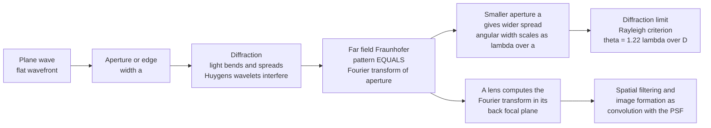

# 🌀 Diffraction and Fourier Optics

> [!abstract] TL;DR
> **Diffraction** is the bending and spreading of light waves around edges and after apertures — the smaller the opening, the *more* the light spreads (angular width $\sim \lambda/a$). This sets a hard **diffraction limit**: no lens can focus light to a spot smaller than about a wavelength, so the finest detail any instrument resolves is $\theta \approx 1.22\,\lambda/D$ (Rayleigh) for aperture $D$. The deep payoff is **Fourier optics**: the far-field (Fraunhofer) diffraction pattern of an aperture is its **Fourier transform**, and a lens physically computes that transform in its focal plane — turning every optical system into a linear system with a point-spread function and transfer function. This single idea underpins spectrometers, microscope and telescope resolution, EUV lithography, spatial filtering, and holography.

## Intuition

**Analogy:** Ray optics tells you light travels in perfectly straight lines and casts razor-sharp shadows. But look *closely* at the edge of any shadow and it is fuzzy — fringed with faint light-and-dark bands. That fringing is **diffraction**: because light is a wave, it bends around edges and spreads out after squeezing through a small gap, refusing to stay perfectly confined. The tighter you squeeze it — a narrower slit — the *more* it fans out afterward. It behaves like water waves passing through a harbour mouth: a wide entrance lets the waves march straight through, but a narrow gap makes them spray out in a wide arc on the far side.

That trade-off has a profound consequence. Because light always spreads by at least $\sim\lambda/D$, no lens — however perfect — can concentrate it to a point smaller than roughly its wavelength. That is why visible-light microscopes cannot see individual molecules, and why bigger telescopes see sharper. The astonishing deeper truth: the far-field diffraction pattern of an object *is* its **Fourier transform** — a lens computes a Fourier transform at the speed of light — which is the mathematical foundation of modern imaging, optical signal processing, and holography.

---

## How It Works

Every point on a wavefront re-radiates a spherical wavelet (**Huygens' principle**); the wave downstream is the interference sum of all those wavelets. An aperture simply chops the wavefront, and the surviving wavelets interfere to build the diffraction pattern.

1. **Wavelets and interference.** A plane wave hits an aperture of width $a$. Each point across the opening emits a wavelet. On a distant screen the wavelets from different parts of the slit travel slightly different path lengths, so they add constructively in some directions and cancel in others.
2. **Near vs far field.** Close to the aperture the pattern is complex and range-dependent — **Fresnel (near-field)** diffraction, with quadratic phase curvature. Far away (or in a lens focal plane) the curvature flattens and the pattern stops changing shape — **Fraunhofer (far-field)** diffraction, which is exactly the Fourier transform of the aperture.
3. **Single slit → sinc².** The far-field intensity of a slit of width $a$ is $I(\theta)=I_0\,\mathrm{sinc}^2\!\big(a\sin\theta/\lambda\big)$, with its first dark fringe at $\sin\theta = \lambda/a$. Narrow the slit and the central lobe gets *wider* — the inverse relationship at the heart of the diffraction limit.
4. **Many slits → grating.** With $N$ equally spaced slits (spacing $d$), the wavelets reinforce only at sharp **orders** $d\sin\theta = m\lambda$. Each order lands at a wavelength-dependent angle, so a grating fans white light into a spectrum — the engine of spectrometers.
5. **Circular aperture → Airy disk.** A round lens or pupil gives a bright central **Airy disk** ringed by faint halos. Two point sources are "just resolved" when one's peak sits on the other's first dark ring: $\theta_{\min}=1.22\,\lambda/D$ (**Rayleigh criterion**).
6. **Lens = Fourier engine.** Place an object one focal length in front of a lens; its Fourier transform appears in the back focal plane. Block or reshape spatial frequencies there (**spatial filtering**), then a second lens transforms back — the **4f system**. Image formation becomes convolution of the object with the lens **point-spread function (PSF)**.



---

## Key Concepts

### Secondary Level

- **Diffraction** = waves bending around obstacles and spreading through openings. It is obvious for sound and water waves; for light it is subtle only because $\lambda \sim 500$ nm is tiny compared with everyday objects.
- **The core trade-off:** narrower slit → *wider* spread. Central-lobe half-angle $\approx \lambda/a$. This is why a laser pointer stays tight (large beam vs $\lambda$) but light through a pinhole flares out.
- **Diffraction grating:** a ruled surface with thousands of fine lines splits white light into a rainbow via $d\sin\theta=m\lambda$. Each colour (wavelength) bends by a different angle — this is how a spectrometer measures what light is made of.
- **Why microscopes have a limit:** because light spreads by at least $\sim\lambda$, you cannot see detail much finer than the wavelength of the light you use. Visible light ($\sim 0.5\,\mu\text{m}$) cannot resolve individual atoms or viruses' fine structure.

### Undergraduate Level

**Single-slit (Fraunhofer) intensity**

$$I(\theta) = I_0\left[\frac{\sin\beta}{\beta}\right]^2, \qquad \beta = \frac{\pi a \sin\theta}{\lambda}$$

Minima (dark) at $a\sin\theta = m\lambda,\ m=\pm1,\pm2,\dots$; central-lobe full width $\Delta\theta \approx 2\lambda/a$.

**Grating equation and resolving power**

$$d\sin\theta = m\lambda, \qquad R = \frac{\lambda}{\Delta\lambda} = mN$$

$N$ illuminated lines at order $m$ set the spectral resolving power. A $10{,}000$-line grating at $m=2$ gives $R=20{,}000$ — separating lines $0.025$ nm apart in the visible.

**Airy disk and the Rayleigh criterion**

A circular aperture of diameter $D$ produces the Airy pattern $I \propto [2J_1(x)/x]^2$ with $x=\pi D\sin\theta/\lambda$. First dark ring at $\sin\theta = 1.22\,\lambda/D$, giving the angular resolution

$$\boxed{\theta_{\min} = 1.22\,\frac{\lambda}{D}}$$

Human eye ($D\approx3$ mm, $\lambda=550$ nm): $\theta_{\min}\approx0.8'$ of arc. Hubble ($D=2.4$ m): $\theta_{\min}\approx0.05''$. **Bigger aperture and shorter wavelength both sharpen the image** — the design pressure behind giant telescopes and UV/electron microscopes.

**Microscope (Abbe) limit**

For imaging with numerical aperture $\mathrm{NA}=n\sin\alpha$, the smallest resolvable feature is

$$d_{\min} \approx \frac{\lambda}{2\,\mathrm{NA}}$$

Oil-immersion objectives push $\mathrm{NA}\to1.4$, giving $d_{\min}\approx\lambda/2.8\approx200$ nm for green light — the classical wall that super-resolution microscopy (STED, PALM/STORM) later broke by clever tricks, not by beating diffraction directly.

### Graduate Level

**Fraunhofer diffraction is a Fourier transform.** For an aperture field $A(x,y)$, the far-field amplitude is

$$U(f_x,f_y) \propto \iint A(x,y)\,e^{-i2\pi(f_x x + f_y y)}\,dx\,dy = \mathcal{F}\{A\},\qquad f_x = \frac{\sin\theta_x}{\lambda}$$

So: rect $\to$ sinc, two deltas $\to$ cosine fringes under a sinc envelope, disk $\to$ Airy ($J_1$). The Fresnel (near-field) integral adds a quadratic phase $e^{i\pi(x^2+y^2)/\lambda z}$; a converging lens supplies exactly the *conjugate* quadratic phase, cancelling it so the **back focal plane displays the pure Fourier transform**.

**Linear-systems / transfer-function view.** An optical system is linear and shift-invariant (isoplanatic), so image = object $\ast$ **PSF**, where the PSF is $|\mathcal{F}\{\text{pupil}\}|^2$. In the frequency domain the image spectrum is the object spectrum times the **Optical Transfer Function (OTF)** — the autocorrelation of the pupil. The pupil's finite size makes the OTF vanish beyond a cutoff spatial frequency $f_c = D/(\lambda z)$ (incoherent: $2\mathrm{NA}/\lambda$): a hard **low-pass filter**. That cutoff *is* the diffraction limit, restated in signal-processing language.

**Spatial filtering and the 4f processor.** Two lenses spaced by $4f$ put the object spectrum in the shared focal plane. A physical mask there removes spatial frequencies: a low-pass pinhole cleans laser beams; a high-pass block gives edge enhancement (phase contrast, dark-field); matched filters do optical pattern recognition. Computer-generated holograms and Fourier ptychography extend the same math to encode and reconstruct full complex wavefronts.

---

## Python Demo

```python
# Diffraction & Fourier optics:
#   (a) single-slit sinc^2 (narrow slit spreads MORE) and the diffraction grating
#   (b) far field as the FFT of the aperture (a lens computing a Fourier transform)
#   (c) the Airy disk (2D FFT of a circular pupil) + the Rayleigh resolution limit
import numpy as np
import matplotlib.pyplot as plt

lam = 500e-9  # wavelength (m), green light
theta = np.linspace(-0.06, 0.06, 4000)  # observation angle (rad)
s = np.sin(theta)

# ---- (a1) SINGLE-SLIT: I = sinc^2(a sin(theta)/lam); first zero at sin(theta)=lam/a ----
#      np.sinc(x) = sin(pi x)/(pi x), so argument is a*sin(theta)/lam directly.
fig, ax = plt.subplots(2, 2, figsize=(12, 9))

for a, col in [(20e-6, "C0"), (40e-6, "C3")]:
    I = np.sinc(a * s / lam) ** 2
    ax[0, 0].plot(np.degrees(theta), I, col, lw=1.8,
                  label=f"slit a = {a*1e6:.0f} um  (first zero at {np.degrees(lam/a):.2f} deg)")
ax[0, 0].set_title("(a) Single-slit diffraction: narrower slit spreads MORE")
ax[0, 0].set_xlabel("angle (deg)"); ax[0, 0].set_ylabel("intensity (norm.)")
ax[0, 0].legend(fontsize=8)

# ---- (a2) DIFFRACTION GRATING: N slits, spacing d -> sharp orders at d sin(theta)=m*lam ----
N, d, a = 6, 100e-6, 20e-6
env = np.sinc(a * s / lam) ** 2                       # single-slit envelope
gamma = np.pi * d * s / lam
grating = (np.sin(N * gamma) / (N * np.sin(gamma) + 1e-12)) ** 2
ax[0, 1].plot(np.degrees(theta), env * grating, "C2", lw=1.0)
for m in range(-2, 3):                                # mark principal orders d sin=m*lam
    ang = np.degrees(np.arcsin(m * lam / d))
    ax[0, 1].axvline(ang, color="k", ls=":", lw=0.7)
    ax[0, 1].text(ang, 1.02, f"m={m}", ha="center", fontsize=7)
ax[0, 1].set_title(f"(b) Grating ({N} slits): sharp orders d*sin = m*lam  (spectrometer)")
ax[0, 1].set_xlabel("angle (deg)"); ax[0, 1].set_ylabel("intensity (norm.)")

# ---- (c) FAR FIELD AS FFT OF THE APERTURE: a lens computes the Fourier transform ----
Nx = 8192
x = np.linspace(-2e-3, 2e-3, Nx)          # aperture-plane coordinate (m)
dx = x[1] - x[0]
a_fft = 40e-6
aperture = (np.abs(x) < a_fft / 2).astype(float)      # single slit, width a_fft
field = np.fft.fftshift(np.fft.fft(np.fft.ifftshift(aperture)))
I_fft = np.abs(field) ** 2; I_fft /= I_fft.max()
fx = np.fft.fftshift(np.fft.fftfreq(Nx, d=dx))         # spatial frequency (1/m)
sin_th = lam * fx                                      # far-field angle mapping
I_analytic = np.sinc(a_fft * sin_th / lam) ** 2
mask = np.abs(np.degrees(np.arcsin(np.clip(sin_th, -1, 1)))) < 6
ax[1, 0].plot(np.degrees(np.arcsin(np.clip(sin_th[mask], -1, 1))), I_fft[mask],
              "C0", lw=2.5, label="FFT of aperture (numerical)")
ax[1, 0].plot(np.degrees(np.arcsin(np.clip(sin_th[mask], -1, 1))), I_analytic[mask],
              "C1--", lw=1.2, label="analytic sinc^2")
ax[1, 0].set_title("(c) Far field = Fourier transform of the aperture")
ax[1, 0].set_xlabel("angle (deg)"); ax[1, 0].set_ylabel("intensity (norm.)")
ax[1, 0].legend(fontsize=8)

# ---- (d) AIRY DISK from 2D FFT of a circular pupil; annotate Rayleigh limit ----
Ng = 512
g = np.linspace(-1, 1, Ng)
XX, YY = np.meshgrid(g, g)
pupil = (np.sqrt(XX**2 + YY**2) < 0.14).astype(float)  # circular aperture
psf = np.abs(np.fft.fftshift(np.fft.fft2(np.fft.ifftshift(pupil)))) ** 2
psf /= psf.max()
c = Ng // 2; w = 40                                     # crop to the central lobe + rings
im = ax[1, 1].imshow(np.log10(psf[c-w:c+w, c-w:c+w] + 1e-6),
                     cmap="inferno", extent=[-w, w, -w, w])
ax[1, 1].set_title("(d) Airy disk (log): the diffraction-limited spot")
ax[1, 1].set_xlabel("pixels"); ax[1, 1].set_ylabel("pixels")
fig.colorbar(im, ax=ax[1, 1], label="log10 intensity")

plt.tight_layout(); plt.savefig("diffraction_fourier_optics.png", dpi=110)
print("Saved diffraction_fourier_optics.png")

# ---- Rayleigh angular resolution theta = 1.22 * lam / D for real instruments ----
print("\nRayleigh limit  theta = 1.22 * lambda / D   (lambda = 550 nm):")
for name, D in [("human eye pupil", 3e-3), ("50 mm camera lens", 50e-3),
                ("Hubble", 2.4), ("Keck 10 m", 10.0)]:
    theta_min = 1.22 * 550e-9 / D
    print(f"  {name:18s} D={D:>6.3g} m  ->  {np.degrees(theta_min)*3600:7.3f} arcsec")
```

Panels (a)–(b) show the inverse slit-width relation and the grating's sharp orders; panel (c) confirms the far field is literally the FFT of the aperture (numerical FFT lands exactly on the analytic sinc²); panel (d) renders the Airy disk, and the printout gives the Rayleigh resolution that shrinks with larger $D$ and shorter $\lambda$.

---

## Real-World Applications

- **Spectrometers and astronomy.** Diffraction gratings ($d\sin\theta=m\lambda$) disperse light into spectra in everything from lab UV-Vis instruments to telescope spectrographs that measure the composition and redshift of galaxies.
- **Telescope and camera resolution.** $\theta=1.22\,\lambda/D$ dictates why observatories build ever-larger mirrors and why phone cameras with tiny apertures are fundamentally diffraction-limited at small f-numbers.
- **EUV semiconductor lithography.** The relentless push to smaller chip features is a fight against the diffraction limit: the industry moved from 193 nm deep-UV to **13.5 nm extreme-UV** light precisely because minimum feature size scales with $\lambda/\mathrm{NA}$.
- **Optical microscopy and super-resolution.** The Abbe limit $\lambda/2\mathrm{NA}\approx200$ nm bounds conventional microscopes; STED and PALM/STORM (Nobel Prize 2014) engineer around it while acknowledging diffraction sets the baseline.
- **Fourier processing and holography.** 4f spatial-filtering systems clean laser beams and enhance edges; holograms and computer-generated holograms store and reconstruct full wavefronts using the aperture-to-Fourier-transform relationship directly.

---

## Common Pitfalls

- **Single-slit formula gives *minima*, not maxima.** $a\sin\theta=m\lambda$ locates the *dark* fringes; the bright central lobe sits at $\theta=0$ and is twice as wide as the side lobes. Confusing it with the grating equation (which locates *bright* orders) is the classic mix-up.
- **Grating vs single slit both look like "$d\sin\theta=m\lambda$".** For a grating $d$ is the slit spacing and the relation gives sharp bright orders; for one slit the same-looking $a\sin\theta=m\lambda$ (using width $a$) gives dark minima. Track whether the symbol is spacing or width.
- **Assuming "far-field = FFT" everywhere.** The clean Fourier relationship holds only in the Fraunhofer regime ($a^2/\lambda z \ll 1$) or a lens focal plane. In the near field you need the full Fresnel integral with its quadratic phase.
- **Thinking a bigger aperture always sharpens the real image.** Diffraction improves with larger $D$, but aberrations and atmospheric seeing then dominate; ground telescopes need adaptive optics to actually reach the diffraction limit.
- **Believing super-resolution "beats diffraction."** Techniques like STED/STORM do not violate the diffraction limit of the collected light — they exploit fluorophore switching and nonlinearity to localize emitters below it. The optical PSF is still diffraction-limited.
- **Ignoring the intensity cost of high orders.** A grating's resolving power $R=mN$ rises with order $m$, but energy spreads across more orders so each is dimmer — high $m$ trades brightness for resolution.

---

## Related Concepts

- [[Interference_and_Diffraction]] — the physics-vault companion deriving Young's fringes, the sinc² pattern, gratings, and Bragg's law; this note builds the Fourier-optics and diffraction-limit framework on top of it.
- [[Geometric_and_Wave_Optics]] — ray optics is the $\lambda\to0$ limit where diffraction vanishes and shadows become sharp; diffraction is exactly what geometric optics omits.
- [[Wave_Motion_and_Properties]] — Huygens' principle and superposition, the wave machinery every diffraction pattern is built from.
- [[Fourier_Transform]] — the mathematical core: the Fraunhofer pattern of an aperture is its Fourier transform, and a lens evaluates that transform in its focal plane.
- [[CT_Convolution]] — image formation as convolution of the object with the point-spread function; the linear-systems view of optics.
- [[Impulse_Response]] — the PSF is the optical system's impulse response; the OTF is its frequency response.
- [[DFT_and_FFT]] — the discrete transform used in the Python demo to compute far-field patterns and the Airy disk numerically.
- [[Image_Representations]] — 2D-DFT frequency decomposition of images, the discrete analog of optical spatial filtering.

Sibling notes in this section (planned): Wave_Optics_and_Interference, Geometric_Optics_and_Ray_Tracing, Optical_Imaging_and_Microscopy, Spectroscopy_and_Optical_Analysis, and Holography_and_Wavefront_Engineering all lean on the diffraction limit and Fourier-optics ideas developed here.

---

## Review Questions

1. **Secondary:** A slit is made narrower. Does the central bright band on the screen get wider or narrower, and why does this feel backwards compared to how a bigger *hole* lets more light "through"? Explain using the wave picture.
2. **Undergraduate:** Green light ($\lambda=550$ nm) enters two telescopes with mirror diameters $D=0.2$ m and $D=2.0$ m. Compute the Rayleigh angular resolution of each in arcseconds, and state how much finer detail the larger one resolves. If you instead switched the small telescope to $\lambda=275$ nm UV, would it match the large one?
3. **Undergraduate/Graduate:** A diffraction grating has $d=1\,\mu\text{m}$ spacing and $N=5000$ illuminated lines. At what angle does the $m=1$ order appear for $\lambda=600$ nm, and what is the smallest wavelength difference it can resolve at that order?
4. **Graduate:** Explain, in linear-systems terms, why a finite lens aperture acts as a low-pass spatial filter. Define the OTF cutoff frequency, connect it to the Abbe limit $\lambda/2\mathrm{NA}$, and describe what a 4f system would do to an image if you placed a small opaque disk at the center of its Fourier plane.

---

## Sources

- Goodman, J. W. — *Introduction to Fourier Optics*, 4th ed. (2017)
- Hecht, E. — *Optics*, 5th ed. (2016), Ch. 10–11
- Born, M. & Wolf, E. — *Principles of Optics*, 7th ed. (1999), Ch. 8–9
- Saleh, B. E. A. & Teich, M. C. — *Fundamentals of Photonics*, 3rd ed. (2019), Ch. 4

---

#optics #diffraction #fourier-optics #diffraction-limit #resolution
