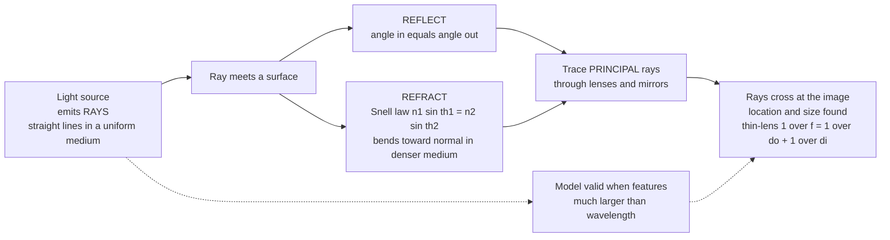

# 🔦 Geometric Optics and Ray Tracing

> [!abstract] TL;DR
> When light's wavelength is tiny compared to the lenses, mirrors, and apertures it meets, its wave nature becomes irrelevant and it can be modeled as **rays** — straight lines that reflect (angle in = angle out) and refract (Snell's law, $n_1\sin\theta_1 = n_2\sin\theta_2$) at surfaces. Tracing a few special **principal rays** through a lens or mirror tells you exactly where an image forms, how big it is, and whether it is upside down, via the thin-lens equation $1/f = 1/d_o + 1/d_i$. This is the practical, geometry-only foundation of every telescope, camera, microscope, and pair of glasses ever built.

---

## Intuition

**Analogy:** For most everyday purposes light behaves with beautiful simplicity — it travels in straight lines, and when it hits a surface it bounces or bends by fixed rules. So forget that light is a wave: just draw it as arrows (rays) shooting through space, and you can design a telescope, a camera, or a pair of glasses with nothing more than geometry and a couple of rules.

The magic trick is that you never have to trace *every* ray. Trace a **handful of special rays** through a lens — one that comes in parallel to the axis, one that sails straight through the center undeviated — and the point where they cross tells you where the image forms, how tall it is, and whether it is inverted. This is the optics of shadows, pinholes, and magnifying glasses: light as tidy geometry, powerful enough to have built every telescope until the 20th century.

---

## How It Works

### Core Mechanics

1. **Light travels as rays.** In a uniform medium a ray is a straight line pointing along the direction of energy flow. This is the short-wavelength (eikonal) limit of the full wave theory — valid whenever the features light interacts with are much larger than its wavelength.
2. **At a surface a ray reflects or refracts.** Reflection: the angle of incidence equals the angle of reflection, both measured from the surface normal. Refraction: the ray bends according to Snell's law, $n_1\sin\theta_1 = n_2\sin\theta_2$, tilting *toward* the normal when it enters a denser (higher-$n$) medium and *away* when it leaves.
3. **Total internal reflection** occurs when a ray tries to leave a denser medium beyond the critical angle $\sin\theta_c = n_2/n_1$: none of it escapes, all of it reflects. This traps light inside optical fibers.
4. **Imaging is ray crossing.** A lens or mirror redirects the fan of rays leaving each object point so they reconverge at one image point. Trace two or three principal rays and their intersection locates the image; the sign of the result tells you real vs virtual and upright vs inverted.
5. **Systems cascade.** Real instruments stack many surfaces. The paraxial (small-angle) approximation turns each element into a simple 2x2 **ABCD ray-transfer matrix**, so an entire lens assembly becomes a single matrix product.

### Flow / Architecture



---

## Key Concepts

### Secondary Level

**The three laws of geometric optics**

- **Rectilinear propagation:** light travels in straight lines in a uniform medium (why shadows and pinhole images form).
- **Reflection:** $\theta_r = \theta_i$, measured from the normal.
- **Refraction (Snell's law):** $n_1\sin\theta_1 = n_2\sin\theta_2$, where $n = c/v$ is the refractive index (air $\approx 1.00$, water $= 1.33$, glass $\approx 1.5$, diamond $= 2.42$).

**Thin-lens and mirror equation**

$$\frac{1}{f} = \frac{1}{d_o} + \frac{1}{d_i}, \qquad m = -\frac{d_i}{d_o} = \frac{h_i}{h_o}$$

For a spherical mirror, $f = R/2$. The **sign conventions** carry the physics: a **real image** ($d_i > 0$) forms where light actually converges and is inverted ($m < 0$); a **virtual image** ($d_i < 0$) only appears to come from a point and is upright ($m > 0$). A converging lens has $f > 0$; a diverging lens has $f < 0$.

**Principal rays** (the tracing recipe, from an off-axis object tip):

1. Parallel ray: comes in parallel to the axis, leaves through the far focal point $F'$.
2. Chief ray: passes through the lens center undeviated (a straight line).
3. Focal ray: passes through the near focal point $F$, leaves parallel to the axis.

Where any two cross is the image of that tip.

### Undergraduate Level

**Fermat's principle** ties the laws together: light takes the path of *stationary* optical path length, $\delta\int n\,ds = 0$. Straight-line travel, the reflection law, and Snell's law all fall out of this one variational statement (see the sibling note *Reflection_Refraction_and_Fermats_Principle*).

**Lensmaker's equation** connects focal length to glass shape:

$$\frac{1}{f} = (n-1)\left(\frac{1}{R_1} - \frac{1}{R_2}\right)$$

**Paraxial approximation:** for rays making small angles with the axis, $\sin\theta \approx \tan\theta \approx \theta$. All the clean Gaussian-optics formulas above are exact only in this limit; departures from it are **aberrations**.

**Stops, pupils, and f-number:** the aperture stop limits which rays get through. The **f-number** $N = f/D$ (focal length over aperture diameter) sets both light-gathering power and **depth of field** — a smaller aperture (larger $N$) yields a deeper zone of acceptable focus.

### Graduate Level

**Seidel (third-order) aberrations** — the five ways a real lens deviates from ideal paraxial imaging: **spherical** (marginal rays focus short), **coma** (off-axis comet blur), **astigmatism** (tangential vs sagittal foci differ), **field curvature** (flat object maps to a curved image surface), and **distortion** (magnification varies across the field). Plus **chromatic aberration**: because $n(\lambda)$ varies (dispersion), each color focuses at a different point — corrected with **achromatic doublets** and aspheric elements (see sibling *Chromatic_Aberration*).

**ABCD ray-transfer matrices** — a paraxial ray is the vector $[y, \theta]^\mathsf{T}$ (height, slope). Each element is a 2x2 matrix:

| Element | Matrix |
|---------|--------|
| Free propagation, distance $d$ | $\begin{pmatrix}1 & d \\ 0 & 1\end{pmatrix}$ |
| Thin lens, focal length $f$ | $\begin{pmatrix}1 & 0 \\ -1/f & 1\end{pmatrix}$ |
| Curved mirror, radius $R$ | $\begin{pmatrix}1 & 0 \\ -2/R & 1\end{pmatrix}$ |
| Flat interface $n_1 \to n_2$ | $\begin{pmatrix}1 & 0 \\ 0 & n_1/n_2\end{pmatrix}$ |

A whole system is the ordered product $M = M_n \cdots M_2 M_1$ (rightmost matrix acts first). For an object-to-image system the off-diagonal element $B = 0$ is the **imaging condition**, and the top-left element $A$ equals the transverse magnification — the same result the thin-lens equation gives, but now composable across arbitrarily many elements (the basis of computerized lens design).

---

## Python Demo

```python
# Geometric optics: (a) trace the three principal rays through a converging lens
# to locate the image and verify 1/f = 1/do + 1/di and m = -di/do;
# (b) plot the image-distance vs object-distance curve (real/virtual regimes);
# (c) cross-check the image with an ABCD ray-transfer matrix.
import numpy as np
import matplotlib.pyplot as plt

# --- Optical setup (all lengths in cm) ---
f  = 10.0    # converging lens focal length
do = 30.0    # object distance (left of lens, at x = -do)
ho = 4.0     # object height

# --- (a) Thin-lens solution ---
di = f * do / (do - f)      # image distance from 1/f = 1/do + 1/di
m  = -di / do               # transverse magnification
hi = m * ho                 # image height (sign => inverted if < 0)

print("THIN-LENS RESULT")
print(f"  image distance di = {di:.2f} cm  (>0 real, <0 virtual)")
print(f"  magnification  m  = {m:+.3f}  ->  {'inverted' if m < 0 else 'upright'}, "
      f"{'reduced' if abs(m) < 1 else 'enlarged'}")
print(f"  image height   hi = {hi:+.2f} cm")
# sanity check of the lens equation
lhs, rhs = 1.0 / f, 1.0 / do + 1.0 / di
print(f"  check 1/f = 1/do + 1/di :  {lhs:.5f} = {rhs:.5f}\n")

# --- (c) ABCD cross-check:  M = T(di) . Lens(f) . T(do) ---
def T(d):    return np.array([[1.0, d], [0.0, 1.0]])   # free propagation
def L(fl):   return np.array([[1.0, 0.0], [-1.0/fl, 1.0]])  # thin lens
M = T(di) @ L(f) @ T(do)
print("ABCD CROSS-CHECK")
print(f"  B element (imaging condition, should be ~0): {M[0,1]:+.3e}")
print(f"  A element (should equal magnification m):    {M[0,0]:+.3f}\n")

# --- Principal-ray geometry for the diagram ---
# All three rays leave the object tip (-do, ho) and cross at the image tip (di, hi).
x_end = di + 14.0
ray1 = ([-do, 0.0, x_end], [ho, ho, ho + (hi - ho) / di * x_end])      # parallel -> thru F'
ray2 = ([-do, 0.0, x_end], [ho, 0.0, hi / di * x_end])                 # chief thru center
ray3 = ([-do, 0.0, x_end], [ho, hi, hi])                              # thru F -> parallel

# --- Plot ---
fig, (axL, axR) = plt.subplots(1, 2, figsize=(13, 5))

# (a) ray diagram
axL.axhline(0, color='k', lw=0.8)                     # optical axis
axL.plot([0, 0], [-6.5, 6.5], color='steelblue', lw=3, alpha=0.6)  # lens
axL.plot([-f, f], [0, 0], 'k+', ms=12, mew=1.5)       # focal points F and F'
axL.annotate("F", (-f, 0), textcoords="offset points", xytext=(-4, 6))
axL.annotate("F'", (f, 0), textcoords="offset points", xytext=(2, 6))
axL.annotate("", xy=(-do, ho), xytext=(-do, 0),
             arrowprops=dict(arrowstyle="->", color='green', lw=2))   # object
axL.annotate("", xy=(di, hi), xytext=(di, 0),
             arrowprops=dict(arrowstyle="->", color='red', lw=2))     # image
for (xs, ys), c in zip([ray1, ray2, ray3], ['darkorange', 'purple', 'teal']):
    axL.plot(xs, ys, color=c, lw=1.3)
axL.plot(di, hi, 'ko', ms=5)
axL.set(xlim=(-35, x_end + 2), ylim=(-7, 7),
        xlabel="x (cm)", ylabel="height (cm)",
        title=f"Principal-ray trace: f={f:g}, do={do:g}  ->  di={di:.1f}, m={m:+.2f}")
axL.text(-do, ho + 0.4, "object", color='green', ha='center')
axL.text(di, hi - 0.6, "image", color='red', ha='center')

# (b) image distance vs object distance
d = np.linspace(0.1, 60, 4000)
img = f * d / (d - f)
img[np.abs(d - f) < 0.15] = np.nan                    # mask the asymptote at do = f
axR.axhline(0, color='k', lw=0.6)
axR.axvline(f, color='gray', ls='--', lw=1, label='do = f  (image at infinity)')
axR.axhline(f, color='gray', ls=':', lw=1)
axR.plot(d, img, color='crimson', lw=2)
axR.plot(2 * f, 2 * f, 'ko', ms=6)                    # do=2f -> di=2f, m=-1
axR.annotate("do = 2f, di = 2f\n(m = -1)", (2 * f, 2 * f),
             textcoords="offset points", xytext=(10, -4), fontsize=9)
axR.axvspan(0, f, alpha=0.08, color='blue')
axR.axvspan(f, 60, alpha=0.08, color='red')
axR.text(f / 2, -45, "do < f\nvirtual, upright,\nmagnified", ha='center', fontsize=9)
axR.text(40, 45, "do > f\nreal, inverted", ha='center', fontsize=9)
axR.set(xlim=(0, 60), ylim=(-60, 60),
        xlabel="object distance do (cm)", ylabel="image distance di (cm)",
        title="Lens equation:  di = f*do / (do - f)")
axR.legend(loc='lower right', fontsize=9)

plt.tight_layout()
plt.savefig("geometric_optics_ray_trace.png", dpi=130)
print("Saved geometric_optics_ray_trace.png")
```

Running it prints `di = 15.00 cm`, `m = -0.500` (real, inverted, half-size), confirms `1/f = 1/do + 1/di`, and shows the ABCD matrix giving `B ~ 0` with `A = -0.5` — the same magnification the ray diagram produces where the three principal rays cross.

---

## Real-World Applications

> **Example — camera and telescope lenses.** A modern camera zoom stacks 15+ glass elements whose curvatures, spacings, and glass types are optimized (in software such as Zemax or Code V) to drive the five Seidel aberrations and chromatic aberration toward zero simultaneously. Every element is still just a surface obeying Snell's law; the design is pure geometric ray tracing at scale. Reflecting telescopes go a step further and replace the objective lens with a parabolic mirror, which is inherently free of chromatic aberration because reflection does not depend on wavelength.

Other everyday systems built entirely on ray optics: **eyeglasses and contact lenses** (a thin lens that shifts the eye's focal point onto the retina), **microscopes** (objective + eyepiece, total magnification $M_{obj} \times M_{eye}$), **projectors and the pinhole camera**, **rear-view mirrors** (convex, always-virtual reduced image for a wide field), and the **collimating and focusing optics** in front of essentially every laser.

---

## Common Pitfalls

- **Sign-convention drift** — Mixing conventions mid-problem is the number-one error. Fix one scheme (real-is-positive: real object $d_o>0$, real image $d_i>0$, converging lens $f>0$) and apply it to every quantity, including magnification sign.
- **Assuming the thin-lens equation always holds** — It is a *paraxial, thin* approximation. Thick lenses need principal planes; wide apertures and steep angles need aberration analysis. A "perfect" thin-lens answer can be far from what a real fat lens does.
- **Forgetting the object-at-focus singularity** — At $d_o = f$ the image goes to infinity (rays leave parallel) and $1/d_i \to 0$. Numerically this blows up; conceptually it is the collimator regime, not an error.
- **Reversing ABCD matrix order** — The first element the light hits is the *rightmost* matrix in the product, $M = M_n\cdots M_1$. Writing them left-to-right silently gives the wrong system.
- **Using rays where wavelength matters** — Near apertures comparable to $\lambda$, at focus, or for resolution limits, geometric optics breaks down and you must switch to wave optics (diffraction sets the true resolution, not ray crossing).

---

## Related Concepts

- [[Geometric_and_Wave_Optics]] — the Physics-vault companion; shows geometric optics as the $\lambda \to 0$ limit of the full wave treatment, with Gaussian beams and evanescent waves.
- [[Interference_and_Diffraction]] — the wave regime that takes over exactly where the ray model fails (aperture-scale features, the diffraction-limited resolution of any imaging system).
- [[Ray_Tracing_and_Path_Tracing]] — the computer-graphics application of the same idea: casting geometric rays through a scene, reflecting and refracting them to render images.
- [[Euclidean_Geometry]] — the straight-lines-and-angles substrate that makes principal-ray construction a pure geometry exercise.
- [[Projective_Geometry]] — the mathematics of perspective and vanishing points that formalizes how a lens maps object space onto image space.

Sibling notes in this section (to be created): *Optics_and_Photonics_Overview*, *Reflection_Refraction_and_Fermats_Principle*, *Lenses_Mirrors_and_Imaging*, *Wave_Optics_and_Interference*, and *Optical_Imaging_and_Microscopy* extend total internal reflection, Fermat's principle, imaging systems, and diffraction-limited resolution.

---

## Review Questions

1. **Secondary:** A converging lens of focal length 20 cm images an object placed 30 cm in front of it. Compute the image distance and magnification, and state whether the image is real or virtual, inverted or upright, enlarged or reduced.
2. **Undergraduate:** Starting from Fermat's principle, minimize the optical path length for a ray crossing a flat interface between media $n_1$ and $n_2$ and derive Snell's law. Why does the same principle give a *straight* line in a uniform medium?
3. **Graduate:** Using ABCD matrices, build the system matrix $M = T(d_i)\,L(f)\,T(d_o)$ for a single thin lens. Show that setting the $B$ element to zero reproduces the thin-lens equation and that the $A$ element then equals the transverse magnification.

---

## Sources

- Hecht, E. — *Optics*, 5th ed. (Pearson) — Ch. 4–6, geometric optics and thin lenses.
- Pedrotti, Pedrotti & Pedrotti — *Introduction to Optics*, 3rd ed. (Pearson) — ray tracing, matrix methods, aberrations.
- Jenkins, F. A. & White, H. E. — *Fundamentals of Optics*, 4th ed. (McGraw-Hill) — classical treatment of lenses, mirrors, and instruments.
- Smith, W. J. — *Modern Optical Engineering*, 4th ed. (McGraw-Hill) — practical lens design, stops, pupils, and aberration control.

---

#optics #geometric-optics #ray-tracing #snells-law #thin-lens
