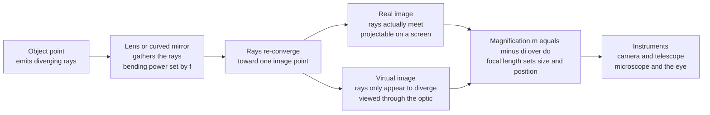

# 🔍 Lenses, Mirrors, and Imaging

> [!abstract] TL;DR
> A lens or curved mirror takes the light spraying outward from each point on an object and re-converges it to a matching point, painting an **image**. The **focal length** $f$ (set by curvature and refractive index via the lensmaker's equation) is the bending power; the imaging equation $1/f = 1/d_o + 1/d_i$ and magnification $m = -d_i/d_o$ tell you where the image lands and how big it is. Images are **real** (rays truly meet, projectable on a screen — camera, projector) or **virtual** (rays only appear to diverge from a point — magnifying glass, flat mirror, eyepiece). Stack these elements and you get the workhorses of applied optics: the eye, the camera, the microscope, and the telescope.

---

## Intuition

**Analogy:** A lens is a device for **herding light**. A beam of parallel rays from a distant star hits a converging lens, and every ray is bent by just the right amount to funnel them all to a single point — the focus. That is the whole trick behind every camera, telescope, microscope, and your own eye: shape a piece of glass so it gathers the light spreading from a point on an object and re-converges it to a matching point on a screen (or your retina).

The art is entirely in the **shaping**. A fatter, more strongly curved lens bends light more sharply, so its rays cross sooner — a **shorter focal length**. A distant object's rays arrive nearly parallel and converge right at the focus (a small inverted image, as in a camera). Slide the object closer, past the focal point, and the image swells and marches away from the lens (a projector). Push the object inside the focal length and the rays never actually cross — they only *appear* to fan out from an enlarged, upright image behind the object (a magnifying glass). Combine lenses and you can magnify, correct, and control exactly how the image forms.

---

## How It Works

### Core mechanics

1. **Every object point is a source.** Light leaves each point on the object as an expanding cone of rays.
2. **The element bends the rays.** A converging lens (or concave mirror) refracts/reflects each ray so the diverging cone becomes a **converging** cone aimed at one image point. The bending strength is the **focal length** $f$; its reciprocal is the **power** $P = 1/f$ in **diopters** (1/metres).
3. **The imaging equation locates the image.** For a thin lens or mirror, $\dfrac{1}{f} = \dfrac{1}{d_o} + \dfrac{1}{d_i}$, so $d_i = \dfrac{d_o f}{d_o - f}$.
4. **Magnification sets the size (and orientation).** $m = -\dfrac{d_i}{d_o}$. Negative $m$ means inverted; $|m|>1$ means enlarged.
5. **Real vs virtual.** If $d_i>0$ the rays physically converge — a **real** image you can catch on a screen. If $d_i<0$ they only *seem* to come from behind the lens — a **virtual** image you can only view through the optic.
6. **Curvature makes the power.** The **lensmaker's equation** $\dfrac{1}{f} = (n-1)\!\left(\dfrac{1}{R_1} - \dfrac{1}{R_2}\right)$ ties $f$ to the glass index $n$ and the surface radii — this is the "shaping" knob.
7. **Instruments stack elements.** A telescope pairs a big light-gathering objective with a short eyepiece; a microscope pairs a short high-power objective with an eyepiece — each stage's image becomes the next stage's object.



---

## Key Concepts

### Secondary — the working picture
- **Converging (convex) vs diverging (concave) lenses.** Convex lenses bring parallel rays *together* to a real focus; concave lenses spread them so they *seem* to come from a virtual focus.
- **Mirrors do the same by reflection.** A **concave** mirror converges (makeup/shaving mirror, telescope mirror); a **convex** mirror diverges (wide-angle car and shop mirrors).
- **Focal length and focal point.** Parallel light converges at the focal point, a distance $f$ from the lens. A *fatter* lens has a *shorter* $f$ and bends light more.
- **Real vs virtual, upright vs inverted.** A camera makes a small **inverted real** image on the sensor; a magnifying glass makes an enlarged **upright virtual** image; a flat mirror makes a same-size virtual image.
- **The three everyday regimes.** Object far away → tiny inverted image (camera, eye). Object just past the focus → big inverted image (projector). Object inside the focus → enlarged upright image (magnifier).

### Undergraduate — the equations
- **Thin-lens / mirror equation** $1/f = 1/d_o + 1/d_i$ with a consistent **sign convention** (real object $d_o>0$; real image $d_i>0$; converging lens $f>0$; diverging $f<0$).
- **Transverse magnification** $m = -d_i/d_o = h_i/h_o$; **longitudinal** magnification scales as $m^2$.
- **Lensmaker's equation** and **power in diopters**; thin lenses in contact add powers, $P = P_1 + P_2$ — the arithmetic behind bifocals and doublets.
- **The eye and vision correction.** The cornea + crystalline lens focus onto the retina; **accommodation** changes $f$ to focus near objects. **Myopia** (image forms in front of the retina) is fixed with a **diverging** (negative) lens; **hyperopia** with a **converging** (positive) lens.
- **The camera.** Lens + sensor; **f-number** $N = f/D$ (focal length over aperture diameter). Small $N$ (wide aperture) = more light + **shallow depth of field**; large $N$ = dim but **deep** focus.
- **Telescope** angular magnification $M = f_{\text{obj}}/f_{\text{eye}}$; the objective aperture sets the **light-gathering** power. **Microscope** angular magnification is the objective's transverse magnification times the eyepiece's angular magnification, $M \approx \dfrac{L}{f_{\text{obj}}}\cdot\dfrac{25\,\text{cm}}{f_{\text{eye}}}$.
- **Aberrations, qualitatively.** Real lenses blur: **spherical** (edge rays focus differently from central), **chromatic** (different colors, different $f$), **coma**, **astigmatism**, **field curvature**, **distortion**.

### Graduate — the design layer
- **Ray-transfer (ABCD) matrices.** Every element (free space, refraction, thin lens, mirror) is a $2\times2$ matrix acting on $(y,\theta)$; a system is the ordered product. A **thin lens** is $\begin{psmallmatrix}1 & 0\\ -1/f & 1\end{psmallmatrix}$; imaging occurs when the system's $B$ element vanishes.
- **Stops and pupils.** The **aperture stop** limits the cone of accepted light; its images in object and image space are the **entrance** and **exit pupils**. **Chief** and **marginal** rays define field and aperture; **étendue** (throughput) is conserved.
- **Aberration theory.** Third-order **Seidel** coefficients quantify the five monochromatic aberrations; **achromats** and **apochromats** cement crown + flint glasses to null chromatic (and some spherical) error; **aspheres** kill spherical aberration with a shaped surface.
- **Numerical aperture and resolution.** $\text{NA} = n\sin\theta$; a microscope's resolving power scales as $\lambda/(2\,\text{NA})$.
- **The diffraction limit.** Geometry says a point images to a point, but wave optics caps it: the point-spread function is an **Airy disk** of angular radius $\theta \approx 1.22\,\lambda/D$. This is where geometric optics hands off to **Fourier optics** (sibling note *Diffraction_and_Fourier_Optics*): the pupil's Fourier transform *is* the PSF.

---

## Python Demo

```python
# Imaging systems from the thin-lens equation, plus two instrument trade-offs:
#   (a) where the image forms and how big it is vs object distance
#   (b) telescope angular magnification  M = f_obj / f_eye
#   (c) the f-number trade-off: diffraction-limited spot vs depth of field
import numpy as np
import matplotlib.pyplot as plt

# ------------------------------------------------------------------
# (a) IMAGING & MAGNIFICATION for a thin converging lens
#     1/f = 1/do + 1/di   ->   di = do*f/(do - f);   m = -di/do
# ------------------------------------------------------------------
f = 50.0                                  # focal length (mm), a "50 mm" lens

do = np.linspace(0.3 * f, 5.0 * f, 800)   # object distances
do = do[np.abs(do - f) > 0.5]             # skip the singularity right at do = f
di = do * f / (do - f)                    # image distance (mm); < 0 => virtual
m  = -di / do                             # magnification; < 0 inverted, > 0 upright

fig, ax = plt.subplots(2, 2, figsize=(13, 9))

# --- where the image forms ---
ax[0, 0].axhline(0, color='k', lw=0.8)
ax[0, 0].axvline(f,     color='grey',  ls=':',  label='object at f')
ax[0, 0].axvline(2 * f, color='green', ls='--', label='object at 2f')
ax[0, 0].plot(do, di, lw=2)
ax[0, 0].set_ylim(-600, 600)
ax[0, 0].set_xlabel('object distance  do  (mm)')
ax[0, 0].set_ylabel('image distance  di  (mm)')
ax[0, 0].set_title('Where the image forms  (di > 0 real, di < 0 virtual)')
ax[0, 0].legend(); ax[0, 0].grid(alpha=0.3)

# --- magnification regimes ---
ax[0, 1].axhline(0,  color='k', lw=0.8)
ax[0, 1].axhline(-1, color='green', ls='--', label='m = -1 at do = 2f')
ax[0, 1].axvline(f,  color='grey',  ls=':',  label='object at f')
ax[0, 1].plot(do, m, lw=2, color='crimson')
ax[0, 1].set_ylim(-6, 6)
ax[0, 1].set_xlabel('object distance  do  (mm)')
ax[0, 1].set_ylabel('magnification  m')
ax[0, 1].set_title('Magnification regimes')
ax[0, 1].legend(); ax[0, 1].grid(alpha=0.3)
ax[0, 1].text(4.2 * f, -0.6, 'distant object\nsmall inverted image\n(camera / eye)',
              fontsize=8, ha='center')
ax[0, 1].text(1.15 * f, -4.6, 'just outside f\nlarge inverted real image\n(projector)',
              fontsize=8)
ax[0, 1].text(0.55 * f, 3.4, 'inside f\nupright virtual image\n(magnifier)', fontsize=8)

# ------------------------------------------------------------------
# (b) TELESCOPE angular magnification:  M = f_obj / f_eye
# ------------------------------------------------------------------
f_obj = 1000.0                            # objective focal length (mm)
f_eye = np.linspace(4, 40, 200)           # eyepiece focal length (mm)
M_ang = f_obj / f_eye

ax[1, 0].plot(f_eye, M_ang, lw=2, color='navy')
for fe in [25, 10, 6]:
    ax[1, 0].plot(fe, f_obj / fe, 'o', color='navy')
    ax[1, 0].annotate(f'{fe} mm -> {f_obj / fe:.0f}x', (fe, f_obj / fe),
                      textcoords='offset points', xytext=(6, 6), fontsize=8)
ax[1, 0].set_xlabel('eyepiece focal length  f_eye  (mm)')
ax[1, 0].set_ylabel('angular magnification  M')
ax[1, 0].set_title(f'Telescope  (f_obj = {f_obj:.0f} mm):  M = f_obj / f_eye')
ax[1, 0].grid(alpha=0.3)

# ------------------------------------------------------------------
# (c) f-NUMBER trade-off:  Airy spot ~ 1.22*lambda*N  vs  depth of field ~ N
# ------------------------------------------------------------------
lam = 550e-6                              # wavelength 550 nm, in mm
N = np.linspace(1.4, 22, 200)             # f-number  (f/1.4 ... f/22)
airy = 1.22 * lam * N * 1000.0            # diffraction spot radius, micrometres
dof_rel = N / N.min()                     # relative depth of field (grows with N)

axb = ax[1, 1]
l1, = axb.plot(N, airy, lw=2, color='darkorange', label='diffraction spot (um)')
axb.set_xlabel('f-number  N = f / D')
axb.set_ylabel('Airy-disk radius (um)', color='darkorange')
axb.tick_params(axis='y', labelcolor='darkorange')
axb.set_title('Aperture trade-off: sharpness vs depth of field')
axb.grid(alpha=0.3)
axt = axb.twinx()
l2, = axt.plot(N, dof_rel, lw=2, color='teal', label='relative depth of field')
axt.set_ylabel('relative depth of field', color='teal')
axt.tick_params(axis='y', labelcolor='teal')
axb.legend(handles=[l1, l2], loc='upper center', fontsize=8)

plt.tight_layout()
plt.savefig('lenses_imaging.png', dpi=110)
plt.show()

# ---- console sanity checks ----
i2f = 2 * f * f / (2 * f - f)
print(f"Object at 2f -> di = {i2f:.0f} mm, m = {-i2f / (2 * f):+.2f}  (same size, inverted)")
dfar = 100 * f
ifar = dfar * f / (dfar - f)
print(f"Distant object -> di = {ifar:.1f} mm (~ f = {f:.0f}), m = {-ifar / dfar:+.3f}")
```

Running it shows the three imaging regimes, the inverse telescope relation (shorter eyepiece → higher power), and the aperture dilemma: opening up shrinks the diffraction spot but also collapses depth of field, so "sharpest" and "everything in focus" pull in opposite directions.

---

## Real-World Applications

- **The human eye** — cornea (most of the power) + adjustable crystalline lens focus a small inverted real image on the retina; **accommodation** re-shapes the lens for near work. Corrective lenses restore focus for **billions** of people (diverging lenses for myopia, converging for hyperopia, cylindrical for astigmatism).
- **Cameras and phones** — a multi-element lens projects a real image onto a sensor; the **f-number**, aperture, and shutter set exposure and **depth of field**. Phone "portrait mode" fakes the shallow depth of field a large aperture would give.
- **Telescopes** — a large objective (mirror in big instruments, to dodge chromatic aberration and weight) gathers faint light and an eyepiece sets angular magnification $f_{\text{obj}}/f_{\text{eye}}$; aperture dictates both brightness and the diffraction-limited resolution.
- **Microscopes** — a very short-$f$ objective plus eyepiece deliver huge angular magnification; **numerical aperture** governs the finest detail resolvable.
- **Projectors, binoculars, endoscopes, machine-vision lenses, lithography optics** — all are lens/mirror systems engineered around the same imaging equation, aberration budget, and diffraction limit.

---

## Common Pitfalls

- **Forgetting the sign convention.** A negative $d_i$ (virtual image) or negative $f$ (diverging lens) is not an error — it is information. Mixing conventions mid-problem produces images on the wrong side.
- **Confusing real and virtual images.** Only **real** images ($d_i>0$) land on a screen or sensor. A magnifying glass held far from a page suddenly shows an inverted image — you have crossed from the virtual (inside $f$) to the real (outside $f$) regime.
- **Assuming bigger magnification means a better instrument.** Beyond the **diffraction limit** extra magnification just enlarges blur ("empty magnification"). Resolution is set by aperture/NA and $\lambda$, not by cranking $M$.
- **Ignoring chromatic aberration in refractors.** A single lens focuses blue and red at different points; uncorrected, this fringes every edge. Achromatic doublets or reflective (mirror) designs fix it — the reason large telescopes use mirrors.
- **Treating the f-number as free brightness.** Opening the aperture to gather light shrinks depth of field and can *worsen* off-axis aberrations, while stopping down eventually hits the diffraction wall. There is an optimum, not a monotonic win.
- **Applying the thin-lens equation to thick or fast systems.** For thick lenses and wide angles you need principal planes and ray-transfer matrices; the thin-lens formula is a first-order approximation.

---

## Related Concepts

- [[Geometric_and_Wave_Optics]] — the parent physics of ray tracing, Snell's law, Fermat's principle, and the $\lambda\to0$ limit that image formation lives in.
- [[Wave_Motion_and_Properties]] — the wave nature of light behind focal points, phase, and why diffraction ultimately limits every lens (via [[Interference_and_Diffraction]]).
- [[Interference_and_Diffraction]] — the diffraction limit (Airy disk, Rayleigh criterion) that caps the resolution any lens or mirror can achieve.
- [[Telescopes_and_Detectors]] — how the objective-plus-eyepiece and aperture ideas here scale up to gather cosmic light and beat atmospheric blur.
- [[Visual_System_and_Visual_Cortex]] — the eye as the biological imaging system whose optics feed the retina and cortex.
- [[Image_Representations]] — the digital sensor/pixel side of imaging, where the optically formed image becomes data for computer vision.

Sibling notes in this section (build these next): *Geometric_Optics_and_Ray_Tracing* (the ray formalism and matrices), *Reflection_Refraction_and_Fermats_Principle* (why rays bend), *Diffraction_and_Fourier_Optics* (the wave-optics resolution limit and the pupil-to-PSF Fourier transform), *Optical_Imaging_and_Microscopy* (NA, resolution, and modern microscope design), and *Adaptive_Optics_and_Telescopes* (correcting aberrations in real instruments).

---

## Review Questions

1. **(Secondary)** You hold a magnifying glass over a book and see an enlarged, upright letter. Now you slowly lift the glass away until the image suddenly flips upside-down and shrinks. In terms of the focal point, what changed, and why did the image invert?
2. **(Undergraduate)** A 50 mm converging lens photographs an object 2 m away. Using $1/f = 1/d_o + 1/d_i$, where does the image form and what is the magnification? Repeat for an object 55 mm away — classify each image as real/virtual and upright/inverted.
3. **(Graduate)** A photographer wants both a sharp point image and deep focus. Explain, using the f-number, why these goals conflict: how do the diffraction-limited spot size and the depth of field each depend on aperture, and where does the "sweet spot" come from? How would going to a shorter wavelength shift it?

---

## Sources

- Hecht, E. *Optics*, 5th ed. — Chapters on geometrical optics, imaging, and aberrations.
- Pedrotti, Pedrotti & Pedrotti. *Introduction to Optics*, 3rd ed. — lenses, mirrors, and optical instruments.
- Jenkins, F. A. & White, H. E. *Fundamentals of Optics*, 4th ed. — classical image formation and aberration theory.
- Greivenkamp, J. E. *Field Guide to Geometrical Optics* (SPIE) — ray-transfer matrices, stops, pupils, and f-number.

---

#optics #lenses #imaging #magnification #telescope-microscope
