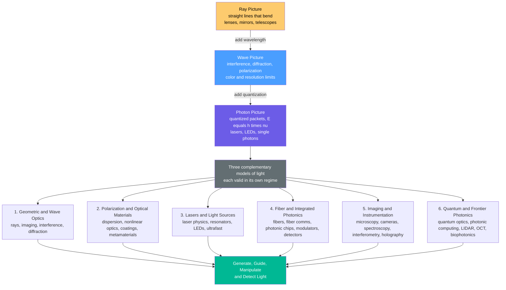

# 🔦 Optics and Photonics — Overview

> [!abstract] TL;DR
> **Optics** is the science of **light** — electromagnetic radiation (visible, infrared, ultraviolet) and how it interacts with matter — while **photonics** is the technology of **generating, guiding, manipulating, and detecting** that light (the "electronics of light": lasers, fibers, detectors, photonic chips). The whole field rests on a **ladder of three complementary pictures** — light as **rays** (travels straight, bends: enough to design lenses and telescopes), as **waves** (interferes and diffracts: explains color and resolution limits), and as **photons** (quantized packets $E = h\nu$: explains lasers, LEDs, and quantum technology). This vault's six pillars — geometric/wave optics, polarization/materials, lasers/sources, fiber/integrated photonics, imaging/instrumentation, and quantum/frontier photonics — all converge on one goal: putting light to work, from the eye to the laser to the quantum computer.

## Intuition — analogy FIRST

**Light is the universe's most versatile tool.** It lets us **see**; it carries the entire internet across oceans as pulses in hair-thin glass threads; it **cuts steel** and reshapes the cornea in eye surgery; it reads barcodes, DVDs, and QR codes; and it may **compute** the future. Almost everything you know about the world arrived through your eyes as light — and almost everything you send to a friend on another continent leaves as light too.

The way to understand light is to climb a **ladder of ever-deeper pictures**, each one a better lens than the last:

- **Rung 1 — light as RAYS.** Picture light as arrows shooting in straight lines. They reflect off mirrors like a ball off a wall and bend ("refract") when they cross into glass or water — which is why a straw looks broken in a glass and why a lens can gather rays to a point. This picture is *enough* to design eyeglasses, cameras, microscopes, and telescopes.
- **Rung 2 — light as WAVES.** Zoom in and rays are really ripples, like waves on a pond. Two overlapping wave-trains can **add** (bright) or **cancel** (dark) — this "interference" is why soap bubbles and oil slicks shimmer with color, and why no microscope can ever see a detail much smaller than the wavelength of the light it uses. The wave picture explains color, sharpness limits, and polarization.
- **Rung 3 — light as PHOTONS.** Zoom in further and the wave comes in indivisible **packets** of energy, $E = h\nu$ — photons. This is the only picture that explains how a **laser** pours out perfectly synchronized light, how an **LED** turns electricity straight into color, how a solar cell turns light into power, and how a **single photon** can carry an unbreakable quantum key.

**Optics** is the science that built this ladder; **photonics** is the engineering that puts every rung to work — making light (lasers, LEDs), steering it (fibers, chips), bending and splitting it (lenses, gratings, modulators), and catching it (detectors, cameras). From the eye to the laser to the quantum computer, **it's all light.**

---

## How It Works

No single picture of light is "the truth" — each is the *right* tool in its regime, and the deeper one always contains the shallower as a limiting case (the physicist's **correspondence principle**). **Ray optics** is the short-wavelength limit of **wave optics**, which is in turn the many-photon limit of **quantum optics**. You reach for rays when the objects are much bigger than the wavelength (designing a telescope mirror), for waves when features approach the wavelength (a diffraction grating, a microscope's resolution), and for photons when energy comes in countable lumps (a laser, a single-photon detector).

The six pillars of this vault all draw on those three pictures and funnel toward one unifying mission — **generate, guide, manipulate, and detect light**:



Every note in this vault is a specialisation of that flow. **Pillar 1** (this section) covers the workhorse of everyday optics — rays, image formation, interference, and diffraction — including the sibling notes on `Geometric_Optics_and_Ray_Tracing` and the wave phenomena that set resolution limits. **Pillar 2** studies how light's *vector* nature and its interaction with materials are engineered — see `Polarization_of_Light`, dispersion, nonlinear optics, and metamaterials. **Pillar 3** is where light is *created* coherently — `Laser_Physics_and_Stimulated_Emission`, resonators, LEDs, and ultrafast pulses. **Pillar 4** *guides* light for information — `Optical_Fibers_and_Waveguides`, fiber communications, photonic chips, modulators, and detectors. **Pillar 5** turns light into *information about the world* — `Optical_Imaging_and_Microscopy`, spectroscopy, interferometry, holography, and telescopes. **Pillar 6** pushes the frontier — `Quantum_Optics_and_Photons`, photonic computing, LIDAR/OCT, biophotonics, and optical tweezers — closing with the capstone `The_Reach_and_Future_of_Optics_and_Photonics`.

Whichever pillar you are in, five parameters describe the light itself: its **wavelength/frequency** (position on the *spectrum*), its **speed** $c$ (and slower speed $v = c/n$ in matter), the **energy per photon** $E = h\nu$, its **polarization** (the direction the wave oscillates), and its **coherence** (how "in step" the waves are — the property that separates a laser from a light bulb).

---

## Key Concepts

### Secondary Level

- **Light is electromagnetic radiation** that travels in straight lines called **rays** and moves at the fastest speed in nature, $c \approx 3 \times 10^{8}$ m/s in vacuum.
- **Reflection** — light bounces off a mirror with the **angle of incidence equal to the angle of reflection**.
- **Refraction** — light **bends** when it passes from one material into another (air to glass, glass to water); this is why a straw looks bent in a glass and how a lens works.
- **The spectrum** — different **wavelengths** are different **colors** (red is long, violet is short: ROYGBIV), and beyond the visible lie invisible **infrared** (longer, felt as heat) and **ultraviolet** (shorter, causes sunburn).
- **Lenses form images** — a convex lens bends rays to a point (**focus**); this is how eyes, glasses, cameras, magnifiers, and telescopes work.
- **White light is a mixture** — a prism splits it into a rainbow because each color bends by a different amount.

### Undergraduate Level

- **Refractive index** $n = c/v$ — how much a material slows light; **Snell's law** $n_1 \sin\theta_1 = n_2 \sin\theta_2$ governs refraction, and beyond a critical angle you get **total internal reflection** (the trick that traps light inside an optical fiber).
- **Imaging equations** — the thin-lens/mirror relation $\tfrac{1}{f} = \tfrac{1}{s_o} + \tfrac{1}{s_i}$, focal length, f-number, magnification, and the aberrations that limit real lenses.
- **Wave optics** — superposition and **interference** (Young's double slit, thin films), **diffraction** (bending around edges and through apertures), and **coherence** (the degree to which waves stay in step).
- **The diffraction limit** — you cannot resolve detail much finer than the wavelength: Abbe/Rayleigh give resolution $d \approx \lambda / (2\,\mathrm{NA})$, which is *why* shorter wavelengths (and high numerical aperture) buy sharper images.
- **Polarization** — the direction of the field's oscillation; **Malus's law** $I = I_0 \cos^2\theta$ describes light through a polarizer (sunglasses, LCD screens, 3D glasses).
- **Dispersion** — $n$ depends on wavelength, $n(\lambda)$, causing prisms to split colors and lenses to suffer chromatic aberration.
- **The photon** — light delivers energy in quanta, $E = h\nu = hc/\lambda$; the **photoelectric effect** is the classic proof that light is granular.

### Graduate Level

- **Electromagnetic foundation** — light *is* a solution of **Maxwell's equations**; the wave equation, the **Fresnel equations** (reflection/transmission amplitudes), and **Jones/Mueller calculus** for polarization all flow from them.
- **Fourier optics and beams** — diffraction as a Fourier transform of the aperture, **Gaussian beams**, and **ABCD ray-transfer matrices** for propagating beams through optical systems.
- **Laser physics** — **stimulated emission**, **population inversion**, optical gain, cavity/longitudinal modes, and the temporal + spatial **coherence** that make laser light unique.
- **Nonlinear optics** — at high intensity the material response is nonlinear: **second-harmonic generation**, the **Kerr effect**, and four-wave mixing (green laser pointers, frequency combs, supercontinua).
- **Guided-wave and integrated photonics** — **modes** in fibers and waveguides, dispersion management, modulators, and photonic integrated circuits that do on a chip what lasers-on-a-bench once did.
- **Quantum optics** — quantization of the field, **coherent / squeezed / Fock states**, single-photon sources and detectors, entanglement, Hong–Ou–Mandel interference, and cavity QED — the substrate of photonic quantum computing and quantum communication.

---

## Python Demo

```python
# Optics & Photonics in one figure — the three pictures and a signature relation:
#   (a) THE ELECTROMAGNETIC SPECTRUM  — where visible light, IR/UV, and the
#       1550 nm fiber-optic communication band sit (wavelength, log scale)
#   (b) PHOTON ENERGY  E = h*c/lambda  vs wavelength (the "photon picture")
#   (c) THE DIFFRACTION LIMIT  d = lambda / (2*NA)  — the "wave picture" sets the
#       finest detail optics can resolve (why shorter wavelength = sharper)
import numpy as np
import matplotlib.pyplot as plt

# --- Physical constants (SI) ---
h  = 6.62607015e-34    # Planck constant [J s]
c  = 2.99792458e8      # speed of light  [m/s]
eV = 1.602176634e-19   # one electron-volt [J]

fig, ax = plt.subplots(1, 3, figsize=(16, 4.8))

# ---- (a) The electromagnetic spectrum (wavelength, log axis) ----
# (name, lambda_min [m], lambda_max [m])
bands = [
    ("Gamma",     1e-13, 1e-11),
    ("X-ray",     1e-11, 1e-8),
    ("UV",        1e-8,  3.8e-7),
    ("Visible",   3.8e-7, 7.5e-7),
    ("IR",        7.5e-7, 1e-3),
    ("Microwave", 1e-3,  1e-1),
    ("Radio",     1e-1,  1e3),
]
for name, lo, hi in bands:
    ax[0].axvspan(lo, hi, alpha=0.25)
    ax[0].text(np.sqrt(lo * hi), 0.5, name, rotation=90,
               ha="center", va="center", fontsize=8)
ax[0].axvline(1550e-9, color="red", lw=2, ls="--")
ax[0].text(1550e-9, 0.96, "1550 nm fiber band", color="red",
           ha="center", va="top", fontsize=8)
ax[0].set_xscale("log")
ax[0].set_xlim(1e-13, 1e3)
ax[0].set_ylim(0, 1)
ax[0].set_yticks([])
ax[0].set_xlabel("wavelength lambda  [m]")
ax[0].set_title("The Electromagnetic Spectrum")

# ---- (b) Photon energy  E = h*c/lambda  (the photon picture) ----
lam  = np.linspace(200e-9, 2000e-9, 600)     # 200 nm (UV) -> 2000 nm (near-IR)
E_eV = (h * c / lam) / eV
ax[1].plot(lam * 1e9, E_eV, lw=2)
ax[1].axvspan(380, 750, alpha=0.20, color="green", label="visible")
ax[1].axvline(1550, color="red", ls="--", label="1550 nm telecom")
ax[1].set_xlabel("wavelength lambda  [nm]")
ax[1].set_ylabel("photon energy E  [eV]")
ax[1].set_title("Photon Energy:  E = h*c / lambda")
ax[1].legend(); ax[1].grid(True, alpha=0.3)

# ---- (c) Diffraction limit  d = lambda / (2*NA)  (the wave picture) ----
lam2 = np.linspace(200e-9, 1000e-9, 400)
for NA in [0.25, 0.50, 0.95, 1.40]:         # dry lens -> oil-immersion objective
    d = lam2 / (2 * NA)
    ax[2].plot(lam2 * 1e9, d * 1e9, lw=2, label=f"NA = {NA:.2f}")
ax[2].set_xlabel("wavelength lambda  [nm]")
ax[2].set_ylabel("smallest resolvable detail d  [nm]")
ax[2].set_title("Diffraction Limit:  d = lambda / (2*NA)")
ax[2].legend(); ax[2].grid(True, alpha=0.3)

plt.tight_layout()
plt.savefig("optics_photonics_overview.png", dpi=120)
plt.show()

# ---- Numerical checks: photon energy at signature wavelengths ----
for name, lam_nm in [("UV 250 nm", 250), ("green 550 nm", 550),
                     ("telecom 1550 nm", 1550)]:
    E = (h * c / (lam_nm * 1e-9)) / eV
    print(f"{name:16s}:  E = {E:5.3f} eV")
# -> UV 250 nm: 4.96 eV,  green 550 nm: 2.25 eV,  telecom 1550 nm: 0.80 eV
```

The three panels *are* the three pictures. Panel (a) locates our tiny visible "octave" (about 380–750 nm) inside a spectrum spanning 16 orders of magnitude, with the fiber-optic **1550 nm** band — where glass is most transparent — sitting just into the infrared. Panel (b) shows why a UV photon (about 5 eV) can break chemical bonds and cause sunburn while a telecom photon (about 0.8 eV) cannot — same $E = hc/\lambda$, different rung of the energy ladder. Panel (c) is the wave picture biting back: no matter how perfect the glass, resolution is capped near $\lambda/(2\,\mathrm{NA})$, which is exactly why microscopes chase shorter wavelengths and oil-immersion (high-NA) objectives, and why EUV lithography exists.

---

## Real-World Applications

- **The internet runs on light.** Nearly all long-haul and undersea data travels as **1550 nm** infrared pulses down optical fibers, amplified by erbium-doped fiber amplifiers and multiplexed by wavelength (WDM) to carry terabits per second per fiber — the single largest deployment of photonics on Earth.
- **Vision and imaging.** Cameras, microscopes, telescopes, endoscopes, and medical modalities like **OCT** (optical coherence tomography of the retina) all turn light into images — from a phone selfie to the James Webb Space Telescope.
- **Manufacturing and medicine.** Lasers **cut, weld, and mark** metal and plastic; **LASIK** reshapes the cornea; and **EUV photolithography** (13.5 nm light) prints the nanometer features of every advanced computer chip.
- **Sensing and ranging.** **LIDAR** gives self-driving cars a 3D map, **spectroscopy** identifies molecules by their color fingerprint, and laser scanners read every **barcode** and QR code.
- **Displays and lighting.** **LEDs** and **OLEDs** turn electricity directly into efficient light for screens and rooms; **LCDs** exploit polarization to switch pixels.
- **Energy.** **Solar photovoltaic cells** convert sunlight's photons directly into electricity — photonics at planetary scale.
- **The quantum frontier.** **Photonic quantum computers** and **quantum key distribution** use single photons and entanglement, tying optics to the emerging quantum-information stack.

---

## Common Pitfalls

- **Thinking one picture "replaces" the others.** Rays, waves, and photons are not rival theories — each is correct in its regime, and the deeper picture contains the shallower one (correspondence). Reaching for photons to design a telescope, or for rays to explain a hologram, is using the wrong tool, not a wrong theory.
- **"Frequency changes when light enters glass."** It does **not**. When light slows in a medium ($v = c/n$), its **frequency stays fixed** (set by the source) while the **wavelength shrinks** ($\lambda_{\text{medium}} = \lambda_0 / n$). Frequency (hence photon energy and color) is the invariant; wavelength and speed are what change.
- **Confusing magnification with resolution.** Cranking up magnification past the **diffraction limit** just yields a bigger blur ("empty magnification"). Real sharpness comes from **wavelength and numerical aperture** ($d \approx \lambda/2\mathrm{NA}$), not from more zoom — the reason electron microscopes and EUV exist.
- **Blurring "optics" and "photonics."** **Optics** is the *science* of light (the physics of rays, waves, photons, and their interaction with matter); **photonics** is the *technology* that generates, guides, and detects light for information and energy. Most of this vault is both, but the words are not synonyms.
- **Vacuum vs medium wavelength.** Quoting "1550 nm" without noting it is the **vacuum** wavelength causes errors in fibers, where the guided wavelength is $\lambda_0/n$. Always track whether a wavelength is in vacuum or in the material.
- **Assuming color equals a single wavelength.** Most real colors (white, brown, magenta) are *mixtures*, and perceived color is a property of your **three cone types**, not of the light alone — spectral radiance and perceived color are different things.
- **Ignoring polarization.** Light is a *vector* wave; forgetting polarization breaks LCD displays, glare-reducing sunglasses, stress analysis, and fiber-optic links (polarization-mode dispersion). "Just intensity" is often not enough.

---

## Related Concepts

**Physics foundations (the science underneath):**

- [[Wave_Motion_and_Properties]] — the general physics of waves (frequency, wavelength, superposition) that the wave picture of light specialises.
- [[Interference_and_Diffraction]] — the two signature wave phenomena that set color effects and the resolution limit of every optical instrument.
- [[Geometric_and_Wave_Optics]] — the physics-vault treatment of rays, lenses, and the transition to wave optics that this pillar builds on.
- [[Polarization_and_Dispersion]] — the vector nature of light and its wavelength-dependent speed, central to Pillar 2 of this vault.
- [[Electromagnetic_Waves_and_Radiation]] — light *as* an electromagnetic wave; where the fields, speed $c$, and radiation come from.
- [[Maxwells_Equations]] — the four equations from which all of classical optics (Fresnel, propagation, polarization) is derived.
- [[Photoelectric_Effect_and_Compton]] — the experiments that forced the photon picture and gave us $E = h\nu$.
- [[Wave_Particle_Duality_and_Uncertainty]] — the deeper quantum statement that light (and matter) is both wave and particle.
- [[Laser_Physics]] — stimulated emission, population inversion, and cavities: the physics behind Pillar 3's coherent sources.
- [[Quantum_Optics_and_Cavity_QED]] — quantized light, single photons, and light–matter coupling underpinning Pillar 6.
- [[Semiconductors_and_Devices]] — the band physics behind LEDs, laser diodes, solar cells, and photodetectors.

**Cross-vault engineering and frontier:**

- [[Photonics_and_Optoelectronics]] — the electrical-engineering view of light-based devices (lasers, modulators, detectors, links).
- [[Optical_Properties_and_Photonic_Materials]] — how materials absorb, emit, and shape light: the materials-science side of Pillar 2.
- [[Photonic_Quantum_Computing]] — using single photons and interference as qubits, the flagship of frontier photonics.
- [[Quantum_Computing_Overview]] — the broader quantum-information context that photonic hardware plugs into.

*Sibling notes across this vault's six pillars (to be built): Geometric_Optics_and_Ray_Tracing, Polarization_of_Light, Laser_Physics_and_Stimulated_Emission, Optical_Fibers_and_Waveguides, Optical_Imaging_and_Microscopy, Quantum_Optics_and_Photons, and the capstone The_Reach_and_Future_of_Optics_and_Photonics.*

---

## Review Questions

1. **(Secondary)** Climb the "three pictures" ladder in your own words: give one everyday phenomenon that the **ray** picture explains, one that needs the **wave** picture, and one that needs the **photon** picture. Why can't a single picture do all three jobs?
2. **(Undergraduate)** A microscope using 550 nm green light cannot resolve two features 150 nm apart. Using $d \approx \lambda/(2\,\mathrm{NA})$, explain two independent changes you could make to resolve them, and state the physical cost or limit of each. Why doesn't simply increasing the eyepiece magnification help?
3. **(Graduate)** Fiber-optic communication uses 1550 nm light rather than visible light. Justify this choice on at least three grounds — material transparency/loss, photon energy, and the availability of amplifiers/sources — and explain which "picture" of light (ray, wave, or photon) you invoke for each argument.

---

## Sources

- Hecht, E. — *Optics* (Pearson) — the standard undergraduate text spanning geometrical, wave, and modern optics.
- Saleh, B. E. A. & Teich, M. C. — *Fundamentals of Photonics* (Wiley) — the canonical photonics reference: beams, lasers, fibers, detectors, quantum optics.
- Born, M. & Wolf, E. — *Principles of Optics* (Cambridge) — the rigorous classical-optics treatise on electromagnetic and wave theory.
- Pedrotti, F., Pedrotti, L. & Pedrotti, L. — *Introduction to Optics* (Cambridge) — a clear engineering-oriented survey from rays to lasers and fibers.
- Fox, M. — *Quantum Optics: An Introduction* (Oxford) — accessible bridge from classical light to photons and quantum photonics.

---

#optics #photonics #light #electromagnetic-spectrum #lasers
