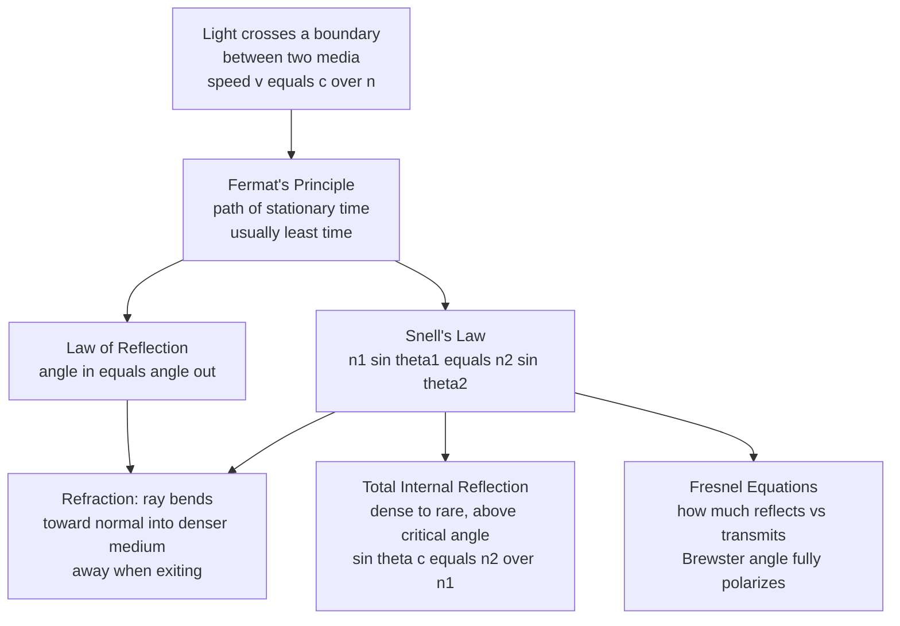

# 🔦 Reflection, Refraction, and Fermat's Principle

> [!abstract] TL;DR
> Light **reflects** so the angle in equals the angle out, and **refracts** (bends) when it crosses between media of different **refractive index** $n = c/v$, following **Snell's law** $n_1\sin\theta_1 = n_2\sin\theta_2$. Both laws fall out of one deep idea — **Fermat's principle**: light takes the path of **stationary (usually least) time**. Going from a dense to a rare medium beyond the **critical angle** gives **total internal reflection**, the physics behind optical fibers and diamond sparkle.

## Intuition — analogy FIRST

Look at a straw standing in a glass of water: it appears **snapped in half** at the surface. Nothing bent the straw — the *light* bent on its way from the underwater part of the straw to your eye, and your brain, assuming light travels in straight lines, draws the straw where the ray *seems* to come from. But **why does light bend at all** when it crosses from water into air, or from air into glass?

The deepest answer is astonishingly elegant: **light is lazy — it takes the path of least time.** Picture a **lifeguard** on a beach who must reach a drowning swimmer offshore. The lifeguard runs fast on sand but swims slowly in water. The quickest route is *not* the straight line to the swimmer — it is a **bent path** that spends more distance on the fast sand and less in the slow water, kinking at the waterline. Light does exactly this. It travels *slower* in glass than in air, so to get from a point in air to a point in glass in minimum time it **bends at the surface**, trading slow-glass distance for fast-air distance.

From this single "least time" idea, both the **law of reflection** (bounce) and **Snell's law** (bend) drop out automatically — you never have to postulate them. Light finds the fastest route, and *that* is why it bends.

---

## How It Works

### Core mechanics

1. **Refractive index.** Every transparent medium slows light: $n = c/v$, where $v$ is the light speed in the medium. Vacuum $n=1$, air $\approx 1.0003$, water $1.33$, glass $\approx 1.5$, diamond $2.42$. A higher $n$ means "optically denser" — light crawls more slowly.
2. **Reflection.** At a surface, part of the light bounces off. The **angle of incidence equals the angle of reflection**, both measured from the **normal** (the perpendicular to the surface). *Specular* reflection (smooth mirror) preserves the image; *diffuse* reflection (rough wall) scatters rays in all directions — which is why you *see* most objects at all.
3. **Refraction.** The transmitted part bends. **Snell's law:** $n_1\sin\theta_1 = n_2\sin\theta_2$. Entering a denser medium ($n_2 > n_1$) the ray bends **toward** the normal; exiting to a rarer medium it bends **away**.
4. **Total internal reflection (TIR).** Going dense → rare ($n_1 > n_2$), the refracted ray bends away from the normal until, at the **critical angle** $\sin\theta_c = n_2/n_1$, it grazes the surface. Beyond $\theta_c$ there is **no** transmitted ray — *all* the light reflects. This is what traps light inside an optical fiber.
5. **Fermat's principle (the unifier).** Define the **optical path length** $\text{OPL} = \int n\,ds$; travel time is $\text{OPL}/c$. Light follows the path for which OPL is **stationary**, $\delta\!\int n\,ds = 0$. Setting the derivative to zero at a flat interface *gives* Snell's law; at a mirror it *gives* the reflection law. Reflection and refraction are not separate rules — they are the same least-time principle applied to two geometries.
6. **How much reflects vs. transmits.** The **Fresnel equations** give the reflected/transmitted *fractions* as a function of angle and **polarization**. At one special angle — **Brewster's angle** $\theta_B = \arctan(n_2/n_1)$ — the reflected light is **fully polarized** (the parallel-polarized component reflects zero). This is why polarized sunglasses kill glare off water and roads.

### Flow / architecture



---

## Key Concepts / Details

### Secondary Level

**Law of reflection.** $\theta_r = \theta_i$, angles measured from the normal. Mirrors are specular; paper is diffuse. Both obey the same law locally — a rough surface is just many tiny mirrors pointing every which way.

**Snell's law and bending.**
$$n_1\sin\theta_1 = n_2\sin\theta_2$$
Into denser glass, light **bends toward the normal**; back out into air it **bends away**. This is why a straw looks broken and a pool looks shallower than it is.

**Critical angle and TIR.** Going dense → rare, at
$$\sin\theta_c = \frac{n_2}{n_1}$$
the refracted ray lies flat along the surface; beyond it, everything reflects. For a glass–air interface ($n_1=1.5$), $\theta_c \approx 41.8°$. Diamonds sparkle because their huge $n = 2.42$ gives $\theta_c \approx 24.4°$ — light entering is trapped by TIR and bounces many times before escaping.

### Undergraduate Level

**Deriving Snell's law from Fermat's principle.** A ray goes from $A=(0,a)$ in medium $n_1$ to $B=(d,-b)$ in medium $n_2$, crossing the flat interface at $(x,0)$. The optical path length is
$$L(x) = n_1\sqrt{x^2 + a^2} + n_2\sqrt{(d-x)^2 + b^2}.$$
Setting $dL/dx = 0$:
$$\frac{n_1 x}{\sqrt{x^2+a^2}} = \frac{n_2 (d-x)}{\sqrt{(d-x)^2+b^2}} \;\Longrightarrow\; n_1\sin\theta_1 = n_2\sin\theta_2.$$
The stationarity condition of least time **is** Snell's law. (The same setup with $B$ on the *same* side yields $\theta_i = \theta_r$, the reflection law.)

**Fresnel equations.** For an interface $n_1 \to n_2$ with incidence $\theta_i$ and transmission $\theta_t$ (from Snell), the reflected power fractions are
$$R_s = \left(\frac{n_1\cos\theta_i - n_2\cos\theta_t}{n_1\cos\theta_i + n_2\cos\theta_t}\right)^2,\qquad
R_p = \left(\frac{n_1\cos\theta_t - n_2\cos\theta_i}{n_1\cos\theta_t + n_2\cos\theta_i}\right)^2,$$
for $s$- (perpendicular) and $p$- (parallel) **polarization**. At **normal incidence** both reduce to $R = \left(\frac{n_1-n_2}{n_1+n_2}\right)^2$ — about **4%** per air–glass surface (why lens coatings exist). At **Brewster's angle** $\theta_B = \arctan(n_2/n_1)$, $R_p = 0$: the reflection is 100% $s$-polarized.

**Dispersion (a sibling topic).** $n$ actually depends on wavelength, $n(\lambda)$, so blue bends more than red. That splits white light — the reason a **prism** makes a spectrum and raindrops make rainbows. This wavelength dependence is developed in the sibling note on dispersion and optical properties of materials.

### Graduate Level

**Fermat as a variational principle.** $\delta\!\int n\,ds = 0$ is a **calculus-of-variations** statement identical in form to **Hamilton's principle of stationary action** $\delta\!\int L\,dt = 0$ in mechanics. Geometric optics is thus the "classical mechanics" of light: rays are trajectories, the **eikonal equation** $|\nabla S|^2 = n^2$ is the optical Hamilton–Jacobi equation, and the short-wavelength limit $\lambda \to 0$ of the wave equation reproduces ray optics — the exact analog of the $\hbar \to 0$ classical limit of quantum mechanics. Fermat's principle is a *precursor* of the least-action principles at the heart of all physics.

**"Stationary," not merely "least."** Fermat's principle is often stated as least time, but the correct statement is **stationary** OPL — a minimum, maximum, or saddle. Reflection in a concave mirror can trace a path of *maximum* time among nearby paths; both still satisfy $\delta\!\int n\,ds = 0$. The stationarity, not the minimality, is fundamental.

**Evanescent wave at TIR.** Even under total internal reflection the field does not vanish abruptly in medium 2 — an **evanescent wave** decays exponentially over $\sim\lambda/2\pi$ beyond the interface. Bring a second surface within that range and light "tunnels" across (frustrated TIR) — the optical analog of quantum tunneling, exploited in TIRF microscopy and beam-splitter cubes.

**Metamaterials and negative $n$.** Engineered media can have **negative refractive index**, bending light to the "wrong" side of the normal — Snell's law still holds with $n_2 < 0$, enabling flat superlenses and cloaking research. Fermat's principle survives, but "least time" must be read as stationary phase.

---

## Python Demo

```python
# Fermat's least-time principle and its consequences (Snell, critical angle, Brewster).
# (a) The refracted ray IS the minimum-time crossing point.
# (b) Snell's law, the critical angle, and Fresnel reflectance vs incidence angle.
import numpy as np
import matplotlib.pyplot as plt

# ---------- (a) FERMAT: least-time crossing across an air -> glass interface ----------
n1, n2 = 1.0, 1.5                 # air above (y>0), glass below (y<0); boundary at y=0
A = np.array([0.0,  2.0])         # source in air
B = np.array([4.0, -3.0])         # target in glass

x = np.linspace(-1.0, 5.0, 4001)  # candidate crossing points on the boundary
# Travel time is proportional to optical path length L = sum of n * geometric length
L = n1*np.sqrt((x - A[0])**2 + A[1]**2) + n2*np.sqrt((x - B[0])**2 + B[1]**2)
i_min = int(np.argmin(L))
x_star = x[i_min]

# Angles from the normal (vertical) at the least-time crossing point
theta1 = np.arctan2(x_star - A[0],  A[1])   # incidence in air
theta2 = np.arctan2(B[0] - x_star, -B[1])   # refraction in glass
print("Fermat least-time crossing x* = %.4f" % x_star)
print("Snell check:  n1*sin(th1) = %.4f   n2*sin(th2) = %.4f"
      % (n1*np.sin(theta1), n2*np.sin(theta2)))   # should match

# ---------- (b) SNELL + CRITICAL ANGLE: glass -> air (dense to rare) ----------
n_dense, n_rare = 1.5, 1.0
thi = np.linspace(0, np.pi/2, 500)
s = n_dense*np.sin(thi)/n_rare
tht = np.where(s <= 1.0, np.arcsin(np.clip(s, 0, 1)), np.nan)  # NaN beyond critical
theta_c = np.arcsin(n_rare/n_dense)

# ---------- (c) FRESNEL REFLECTANCE + BREWSTER: air -> glass (rare to dense) ----------
na, ng = 1.0, 1.5
thi2 = np.linspace(0, np.pi/2, 500)
tht2 = np.arcsin(na*np.sin(thi2)/ng)
Rs = ((na*np.cos(thi2) - ng*np.cos(tht2))/(na*np.cos(thi2) + ng*np.cos(tht2)))**2
Rp = ((na*np.cos(tht2) - ng*np.cos(thi2))/(na*np.cos(tht2) + ng*np.cos(thi2)))**2
brewster = np.arctan(ng/na)

# ---------- plots ----------
fig, ax = plt.subplots(1, 3, figsize=(15, 4.2))

ax[0].plot(x, L, lw=2, color="#4a9eff")
ax[0].plot(x_star, L[i_min], "o", color="crimson", ms=9,
           label="least-time path\n= refracted ray")
ax[0].axvline(x_star, color="crimson", ls="--", lw=0.8)
ax[0].set_xlabel("crossing point x on boundary")
ax[0].set_ylabel("travel time  (proportional to optical path length)")
ax[0].set_title("(a) Fermat: light picks the minimum-time crossing")
ax[0].legend(fontsize=8)
ax[0].grid(alpha=0.3)

ax[1].plot(np.degrees(thi), np.degrees(tht), lw=2, color="#51cf66")
ax[1].axvline(np.degrees(theta_c), color="red", ls="--",
              label="critical angle = %.1f deg" % np.degrees(theta_c))
ax[1].axvspan(np.degrees(theta_c), 90, color="red", alpha=0.12,
              label="total internal reflection")
ax[1].set_xlabel("incidence angle theta1  (deg)")
ax[1].set_ylabel("refraction angle theta2  (deg)")
ax[1].set_title("(b) Snell + critical angle (glass n=1.5 -> air)")
ax[1].legend(fontsize=8)
ax[1].grid(alpha=0.3)

ax[2].plot(np.degrees(thi2), Rs, lw=2, label="Rs (perpendicular)", color="#845ef7")
ax[2].plot(np.degrees(thi2), Rp, lw=2, label="Rp (parallel)", color="#ff922b")
ax[2].axvline(np.degrees(brewster), color="k", ls=":",
              label="Brewster = %.1f deg (Rp=0)" % np.degrees(brewster))
ax[2].set_xlabel("incidence angle  (deg)")
ax[2].set_ylabel("reflectance R")
ax[2].set_title("(c) Fresnel reflectance (air -> glass n=1.5)")
ax[2].legend(fontsize=8)
ax[2].grid(alpha=0.3)

plt.tight_layout()
plt.show()

# Expected: (a) minimum sits exactly where Snell's law is satisfied;
# (b) refraction angle diverges to 90 deg at the critical angle, then TIR;
# (c) Rs rises monotonically, Rp dips to zero at Brewster's angle (~56.3 deg).
```

Running it prints matching values for `n1*sin(th1)` and `n2*sin(th2)` — numerical proof that the **least-time crossing is precisely the refracted ray**. Panel (b) shows the refraction angle shooting to 90° at $\theta_c \approx 41.8°$; panel (c) shows $R_p$ touching zero at Brewster's angle $\approx 56.3°$.

---

## Real-World Applications

- **Optical fibers (the internet's backbone).** A glass core ($n \approx 1.48$) surrounded by lower-index cladding ($n \approx 1.46$) traps light by **total internal reflection**: rays strike the core–cladding boundary above the critical angle and bounce down the fiber for kilometers with tiny loss. Every transoceanic data cable is TIR in action.
- **Polarized sunglasses and camera filters.** Glare off water, snow, and roads is light reflected near **Brewster's angle**, hence strongly polarized. A polarizing filter aligned to block that axis removes the glare — a direct use of the Fresnel equations.
- **Prisms in binoculars and diamonds.** Porro prisms in binoculars use TIR (not silvered mirrors) to fold and erect the image with almost no loss. A cut diamond's facets are angled so that entering light undergoes repeated TIR before escaping — the source of "fire" and sparkle.
- **Lens anti-reflection coatings.** Each air–glass surface reflects ~4% at normal incidence (Fresnel). A camera lens with 15 elements would lose over half its light and flare badly; quarter-wave coatings use thin-film interference to cancel that reflection.
- **Mirages and atmospheric bending.** Hot air near a road has slightly lower $n$; light from the sky bends (continuous refraction / near-TIR) and appears as a shimmering "puddle" — Snell's law applied to a smoothly varying index.

---

## Common Pitfalls

- **Measuring angles from the surface instead of the normal.** Every angle in reflection and Snell's law is taken from the **normal** (perpendicular), not the surface. Using the grazing angle silently flips $\sin$ and $\cos$ and breaks every calculation.
- **Expecting TIR going into a denser medium.** Total internal reflection *only* happens **dense → rare** ($n_1 > n_2$). Going air → glass, $\sin\theta_2 = (n_1/n_2)\sin\theta_1 \le 1$ always — there is no critical angle. Beginners apply $\theta_c$ in the wrong direction.
- **Confusing "which way it bends."** Into a **denser** ($n$ up) medium the ray bends **toward** the normal (smaller angle); into a **rarer** medium it bends **away**. Memorize with the lifeguard: light "spends less time" in the slow (dense) medium, so it turns to cross it more steeply.
- **Thinking Fermat means strictly minimum time.** The rigorous statement is **stationary** OPL, $\delta\!\int n\,ds = 0$ — it can be a minimum, maximum, or saddle. Concave-mirror geometries give maximum-time paths that are perfectly valid rays.
- **Ignoring polarization in reflectance.** "How much reflects" depends on **polarization and angle**, not just the indices. Using the normal-incidence 4% figure at a steep angle (or near Brewster) gives wildly wrong numbers.
- **Forgetting $n$ depends on wavelength.** Treating $n$ as one constant hides **dispersion**: the same interface bends blue and red by different amounts, causing chromatic aberration and rainbows.

---

## Related Concepts

- [[Geometric_and_Wave_Optics]] — the Physics companion: ray optics, thin lenses, and the $\lambda \to 0$ limit where these bending laws live.
- [[Wave_Motion_and_Properties]] — reflection and refraction are boundary behaviors of the underlying wave; the wave picture explains *why* $v$ and thus $n$ change between media.
- [[Electromagnetic_Waves_and_Radiation]] — light is an EM wave, and $n = c/v$ comes from how the medium's permittivity slows that wave; the Fresnel equations derive from EM boundary conditions.
- [[Lagrangian_Mechanics]] — Fermat's least-time principle is the optical twin of Hamilton's principle of stationary action; both are calculus-of-variations statements.
- [[Polarization_and_Dispersion]] — Fresnel reflectance depends on polarization (Brewster's angle), and the refractive index depends on wavelength (dispersion).
- [[Interference_and_Diffraction]] — when features approach the wavelength, ray bending gives way to wave effects; anti-reflection coatings combine Fresnel reflection with interference.
- [[Hamiltonian_Mechanics]] — the eikonal equation $|\nabla S|^2 = n^2$ is the optical Hamilton–Jacobi equation, making rays the "particle trajectories" of light.

*Sibling notes in this Optics and Photonics section (referenced in prose above): geometric optics and ray tracing; lenses, mirrors, and imaging; polarization of light; dispersion and optical properties of materials; and optical fibers and waveguides.*

---

## Review Questions

1. **Secondary.** Light travels from water ($n = 1.33$) into air ($n = 1.00$), striking the surface at $40°$ from the normal. Does it bend toward or away from the normal, and roughly what is the critical angle for this interface? Would a $50°$ ray escape?
2. **Undergraduate.** Starting from the optical path length $L(x) = n_1\sqrt{x^2+a^2} + n_2\sqrt{(d-x)^2+b^2}$, set $dL/dx = 0$ and show that the least-time condition is exactly Snell's law. Explain physically why the crossing point shifts toward the medium where light is *faster*.
3. **Graduate.** Fermat's principle is usually stated as "least time," yet its correct form is "stationary optical path length." Give a concrete geometry where the physical ray is a path of *maximum* time among nearby paths, and explain why the variational condition $\delta\!\int n\,ds = 0$ still selects it. How does this parallel Hamilton's principle in mechanics?

---

## Sources

- Hecht, E. — *Optics*, 5th ed. (Reflection, refraction, Fresnel equations, Fermat's principle).
- Born, M. & Wolf, E. — *Principles of Optics*, 7th ed. (Foundations of geometrical optics; the eikonal equation).
- Feynman, Leighton & Sands — *The Feynman Lectures on Physics*, Vol. I, Ch. 26 (The principle of least time).
- Pedrotti, Pedrotti & Pedrotti — *Introduction to Optics*, 3rd ed. (Snell's law, TIR, polarization by reflection).

---

#optics #refraction #snells-law #fermats-principle #total-internal-reflection
