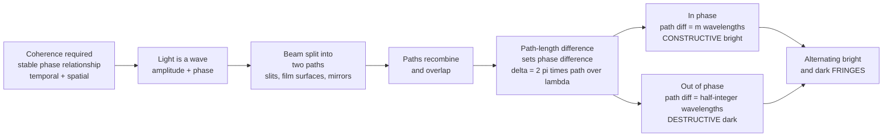

# 🌈 Wave Optics and Interference

> [!abstract] TL;DR
> Ray optics cannot explain the shimmering colors of a soap bubble — for that you must remember light is an electromagnetic **wave** with amplitude and **phase**. When two coherent light waves overlap, their **path-length difference** sets their **phase difference**: in phase (difference = integer wavelengths) they add to a bright fringe; out of phase (half-integer) they cancel to a dark one. This is **interference**, proven historically by Young's double-slit experiment ($\Delta y = \lambda L/d$) and requiring **coherence** (temporal = monochromatic, spatial = point-like). Because a fringe shifts by a full cycle for every wavelength of path change, interference turns light into a ruler precise to a fraction of a wavelength — the basis of anti-reflection coatings, thin-film color, holography, and interferometers from Michelson to LIGO.

## Intuition

**Analogy:** Ray optics — light as straight arrows that reflect and refract — cannot explain the rainbow sheen on a soap bubble or an oil slick on wet asphalt. For that you have to remember that light is a **wave**, and waves can add up or cancel out. Drop two stones in a pond and where the ripples meet they sometimes pile crest-on-crest into a taller wave, and sometimes crest-on-trough into flat water. Light does exactly the same thing.

That piling-up-and-cancelling is **interference**. A soap film glows with color because light reflecting off its **front** surface and its **back** surface travels slightly different distances. For some colors the two reflections reinforce (bright), for others they cancel (dark) — the film literally sorts white light into colors by wavelength, and the color you see tells you the film's thickness. The famous proof that light is a wave was **Young's double-slit experiment**: shine light through two tiny slits and instead of two bright lines you get a striped pattern of bright and dark bands — the fingerprint of waves adding and subtracting. Interference is what turns light into a ruler precise to a fraction of a wavelength.

---

## How It Works

### Core Mechanics

1. **The wave model.** Light is an electromagnetic wave: an oscillating field $E(x,t) = E_0\cos(kx - \omega t + \phi)$ with amplitude $E_0$, wavelength $\lambda$, frequency $f$, and crucially a **phase** $\phi$. What our eyes and detectors register is **intensity** $I \propto |E|^2$, not amplitude — this squaring is why interference effects are so dramatic.
2. **Superposition.** Because the wave equation is linear, when two waves overlap the total field is simply the sum: $E = E_1 + E_2$. The intensity, however, is *not* the sum: $I \propto |E_1 + E_2|^2 = I_1 + I_2 + 2\sqrt{I_1 I_2}\cos\delta$, where $\delta$ is the phase difference. That last **cross term** is interference.
3. **Path difference sets phase.** Two coherent beams that travel path lengths differing by $\Delta$ acquire a phase difference $\delta = \tfrac{2\pi}{\lambda}\Delta$. So the geometry of the two paths — slit separation, film thickness, mirror position — directly controls whether they add or cancel.
4. **Constructive vs destructive.** When $\Delta = m\lambda$ (integer), $\delta = 2\pi m$ and the waves are in phase → **constructive**, a bright fringe. When $\Delta = (m+\tfrac12)\lambda$ (half-integer), the waves are exactly opposed → **destructive**, a dark fringe. The alternating bright/dark bands are **fringes**.
5. **Coherence is required.** Fringes only appear if the two waves keep a **stable phase relationship**. **Temporal coherence** means a narrow wavelength spread (monochromatic) — quantified by coherence length $\ell_c = \lambda^2/\Delta\lambda$. **Spatial coherence** means a small or point-like source. A laser has meters of coherence length and interferes beautifully; sunlight has micrometers and barely interferes, which is why you don't see fringes from a window's two panes.

For two equal beams, intensity collapses to the clean form $I = I_0\cos^2(\delta/2)$ — maxima at $\delta = 2\pi m$, zeros at $\delta = (2m+1)\pi$.

### Flow / Architecture



---

## Key Concepts

### Secondary Level

**Young's double slit — the historic proof.** Two slits a distance $d$ apart, screen a distance $L \gg d$ away. Bright fringes appear where the path difference $d\sin\theta = m\lambda$; using $\sin\theta \approx y/L$:

$$y_m = \frac{m\lambda L}{d}, \qquad \text{fringe spacing } \Delta y = \frac{\lambda L}{d}.$$

Wider slit separation → **finer** fringes; longer wavelength (red) → **wider** fringes. White light gives a white central fringe flanked by colored ones, because each wavelength has its own spacing. This striped pattern is inexplicable for particles but automatic for waves — decisive evidence, Young 1801.

**Thin-film interference — why soap bubbles glow.** Light reflects off both surfaces of a film of thickness $t$ and index $n$. The extra path inside the film is $2nt$ (near normal incidence). Add a $\pi$ phase flip that happens whenever light reflects off a denser medium, and the reflected colors that survive satisfy $2nt = (m+\tfrac12)\lambda$ (bright). As $t$ varies across a bubble, different colors brighten — that's the swirling rainbow. The same physics with a controlled thickness gives **anti-reflection coatings**: choose $t = \lambda/(4n)$ so reflections cancel and more light transmits (every camera lens and pair of glasses).

### Undergraduate Level

**Amplitude vs intensity; the phasor method.** Detectors respond to $I \propto |E|^2$, so we track complex amplitudes $\tilde E = E_0 e^{i\phi}$ (**phasors**) and add them as vectors in the complex plane. For $N$ equal sources with constant phase step $\delta$ between neighbors, the summed amplitude is a geometric series giving $I = I_0\left[\frac{\sin(N\delta/2)}{\sin(\delta/2)}\right]^2$ — which for $N=2$ reduces to the two-beam $\cos^2$ law and for large $N$ becomes the sharp bright lines of a diffraction grating.

**Coherence, made quantitative.** Temporal coherence length $\ell_c = \lambda^2/\Delta\lambda = c/\Delta\nu$: a sodium lamp gives $\ell_c \sim 1$ mm; a stabilized laser gives kilometers. Interference visibility (fringe contrast) falls to zero once the path difference exceeds $\ell_c$. Spatial coherence is set by source size and distance (van Cittert–Zernike): a smaller or more distant source is more spatially coherent — the reason a distant star, though incoherent, can still be resolved interferometrically.

**Newton's rings.** A convex lens on a flat plate traps a wedge of air whose thickness grows outward, producing concentric circular fringes — a direct map of a curved surface to a fraction of a wavelength, and the ancestor of optical surface metrology.

### Graduate Level

**The interferometer as a precision ruler.** A **Michelson interferometer** splits one beam in two, sends each to a mirror, and recombines them. Moving one mirror by $\Delta x$ changes the path difference by $2\Delta x$, so the detector cycles through one full bright-dark fringe every half wavelength of mirror travel. Counting fringes measures displacement to $\lambda/2 \approx 250$ nm directly, and sub-fringe phase estimation pushes this to picometers. This is the engine of Fourier-transform spectroscopy (scanning the mirror and Fourier-transforming the fringe record recovers the spectrum — see [[Fourier_Transform]]) and of gravitational-wave detection.

**Complex coherence and the mutual coherence function.** The full statistical-optics treatment replaces "coherent/incoherent" with the mutual coherence function $\Gamma_{12}(\tau) = \langle E_1(t+\tau)E_2^*(t)\rangle$; its normalized modulus is exactly the fringe visibility. Temporal coherence is the Fourier transform of the source spectrum (Wiener–Khinchin), and spatial coherence is the Fourier transform of the source intensity distribution (van Cittert–Zernike) — coherence and interference are, at bottom, Fourier partners.

**From standing waves to structural color.** Two counter-propagating coherent waves form a **standing wave** — a fixed pattern of nodes and antinodes — which is the recording medium of holography and the origin of structural color in butterfly wings and opals (periodic nanostructures interfering reflected light). Interference is also the seed of the wave phenomena (diffraction) that ultimately set the resolution limit of every imaging system.

---

## Python Demo

```python
# Wave optics & interference:
#   (a) Young's double-slit fringe pattern I = I0*cos^2(pi*d*sin(theta)/lambda)
#       -> how fringe spacing depends on slit separation d and on wavelength lambda
#   (b) Thin-film (soap film) reflectance vs wavelength -> the colored fringes
#       that make a bubble glow, from |r1 + r2*exp(i*delta)|^2
# numpy + matplotlib only (self-contained, no scipy).

import numpy as np
import matplotlib.pyplot as plt

# ---------------------------------------------------------------
# (a) Young's double-slit two-beam interference
# ---------------------------------------------------------------
L = 1.0                       # screen distance (m)
y = np.linspace(-15e-3, 15e-3, 4000)   # screen position (m)
theta = np.arctan(y / L)               # small-angle geometry

def double_slit(d, lam, I0=1.0):
    """Two-beam interference intensity vs screen position."""
    delta = 2 * np.pi * d * np.sin(theta) / lam   # phase difference
    return I0 * np.cos(delta / 2) ** 2            # I = I0 cos^2(delta/2)

lam_green = 550e-9
d1, d2 = 0.20e-3, 0.40e-3     # doubling d halves the fringe spacing
lam_red = 650e-9              # longer lambda -> wider fringes

# Analytic fringe spacing  dy = lambda*L/d  (mm) for the labels
def spacing_mm(d, lam):
    return lam * L / d * 1e3

# ---------------------------------------------------------------
# (b) Thin-film (soap film) reflectance vs wavelength
#     Two reflections: top (air->film, pi phase flip) and bottom (film->air).
#     Amplitude = r*(exp(i*delta) - 1),  delta = 4*pi*n*t/lambda
#     => R proportional to sin^2(2*pi*n*t/lambda)
# ---------------------------------------------------------------
wl = np.linspace(400e-9, 700e-9, 3000)   # visible band
n_film = 1.33                            # soapy water

def film_reflectance(t):
    return np.sin(2 * np.pi * n_film * t / wl) ** 2

t_thin, t_thick = 320e-9, 550e-9         # two film thicknesses

# ---------------------------------------------------------------
# Plot
# ---------------------------------------------------------------
fig, ax = plt.subplots(1, 3, figsize=(16, 4.2))

# Panel 1: effect of slit separation d
ax[0].plot(y * 1e3, double_slit(d1, lam_green),
           lw=1.2, label=f"d = 0.20 mm  (dy = {spacing_mm(d1, lam_green):.2f} mm)")
ax[0].plot(y * 1e3, double_slit(d2, lam_green),
           lw=1.0, alpha=0.8, label=f"d = 0.40 mm  (dy = {spacing_mm(d2, lam_green):.2f} mm)")
ax[0].set_title("Double slit: wider d -> finer fringes (green 550 nm)")
ax[0].set_xlabel("screen position (mm)"); ax[0].set_ylabel("intensity")
ax[0].legend(fontsize=8); ax[0].set_xlim(-15, 15)

# Panel 2: effect of wavelength lambda
ax[1].plot(y * 1e3, double_slit(d1, lam_green),
           lw=1.2, color="green", label=f"550 nm (dy = {spacing_mm(d1, lam_green):.2f} mm)")
ax[1].plot(y * 1e3, double_slit(d1, lam_red),
           lw=1.2, color="red", alpha=0.8, label=f"650 nm (dy = {spacing_mm(d1, lam_red):.2f} mm)")
ax[1].set_title("Double slit: longer lambda -> wider fringes (d = 0.20 mm)")
ax[1].set_xlabel("screen position (mm)"); ax[1].set_ylabel("intensity")
ax[1].legend(fontsize=8); ax[1].set_xlim(-15, 15)

# Panel 3: thin-film colored fringes (reflectance vs wavelength)
ax[2].plot(wl * 1e9, film_reflectance(t_thin), lw=1.6,
           label=f"t = 320 nm")
ax[2].plot(wl * 1e9, film_reflectance(t_thick), lw=1.6, alpha=0.8,
           label=f"t = 550 nm")
ax[2].set_title(f"Soap film (n = {n_film}): which colors reflect brightly")
ax[2].set_xlabel("wavelength (nm)"); ax[2].set_ylabel("reflectance (a.u.)")
ax[2].legend(fontsize=8)

plt.tight_layout()
plt.savefig("wave_optics_interference.png", dpi=120)
print("Saved wave_optics_interference.png")

# Quick numeric sanity check: fringe spacing should follow lambda*L/d
print(f"550 nm, d=0.20 mm -> dy = {spacing_mm(d1, lam_green):.3f} mm")
print(f"550 nm, d=0.40 mm -> dy = {spacing_mm(d2, lam_green):.3f} mm (halved)")
print(f"650 nm, d=0.20 mm -> dy = {spacing_mm(d1, lam_red):.3f} mm (wider)")
```

Running it prints the fringe spacings (halving $d$ halves $\Delta y$; going from 550 to 650 nm widens it) and plots the two double-slit families beside the soap-film reflectance, whose peaks shift with thickness — the quantitative version of a bubble changing color as it thins.

---

## Real-World Applications

- **Anti-reflection and high-reflection coatings.** Every camera lens, eyeglass, laser mirror, and solar cell carries quarter-wave thin films that use destructive (or constructive) interference to kill reflections or build near-perfect mirrors — a multibillion-dollar industry built on $2nt = \lambda/2$.
- **LIGO gravitational-wave detection.** A 4 km Michelson interferometer senses arm-length changes of $\sim 10^{-19}$ m — one-thousandth of a proton — as a passing gravitational wave shifts the interference fringe. This is interference used as the most sensitive ruler ever built (see [[Gravitational_Waves]]).
- **Fourier-transform infrared (FTIR) spectroscopy.** Scanning a Michelson mirror records an interferogram; its Fourier transform is the sample's full spectrum, the workhorse of chemistry labs.
- **Structural color in nature and design.** Butterfly wings, peacock feathers, opals, and the colors on a soap bubble or oil slick are all thin-film / multilayer interference — pigment-free color that never fades.
- **Holography and optical testing.** Holograms record the interference between object and reference beams to store full 3D wavefronts; interferometric surface tests (Newton's rings, Fizeau interferometers) certify telescope mirrors to nanometers.

---

## Common Pitfalls

- **Adding intensities instead of amplitudes.** Interference lives in the cross term $2\sqrt{I_1 I_2}\cos\delta$. You must sum the complex **amplitudes** first and square afterward; summing intensities erases the effect entirely.
- **Forgetting coherence.** With a broadband or extended source, fringes wash out once the path difference exceeds the coherence length $\ell_c = \lambda^2/\Delta\lambda$. "It should interfere but doesn't" almost always means the coherence budget was blown.
- **Dropping the reflection phase flip.** Thin-film math is wrong if you ignore the $\pi$ shift on reflection from a denser medium. It flips every bright condition to dark and is why a very thin soap film ($t \to 0$) looks **black** in reflection, not bright.
- **Confusing fringe-spacing dependence.** $\Delta y = \lambda L/d$: spacing grows with wavelength and screen distance but **shrinks** as slits separate. Students routinely invert the $d$ dependence.
- **Assuming brighter always means more light.** Interference redistributes energy — bright fringes are brighter than the sum of the two beams precisely because dark fringes are darker. Total energy is conserved; it is merely resorted in space.

---

## Related Concepts

Glob-verified cross-vault wikilinks:

- [[Interference_and_Diffraction]] — the Physics-vault companion; diffraction (the sibling wave phenomenon) is interference from a continuum of Huygens sources and sets imaging resolution
- [[Wave_Motion_and_Properties]] — the superposition principle and phase/amplitude language that interference is built on
- [[Electromagnetic_Waves_and_Radiation]] — establishes that light is a transverse EM wave with the field $E$ whose phase interferes
- [[Maxwells_Equations]] — the deeper origin of the light wave and of why $I \propto |E|^2$
- [[Fourier_Transform]] — coherence and interferometric spectroscopy are Fourier relationships (Wiener–Khinchin, van Cittert–Zernike)
- [[Gravitational_Waves]] — detected by kilometer-scale interferometers, interference used as an ultra-precise ruler
- [[Geometric_and_Wave_Optics]] — ray optics is the $\lambda \to 0$ limit where interference becomes unobservable
- [[Polarization_and_Dispersion]] — interference visibility depends on matched polarization; orthogonally polarized beams do not interfere

Within this Optics and Photonics vault, this note is the gateway from ray optics to the full wave picture. It leads into the sibling notes Optics_and_Photonics_Overview (the map of the whole vault), Diffraction_and_Fourier_Optics (interference from continuous apertures and the resolution limit), Thin_Films_and_Optical_Coatings (engineered multilayer interference), Interferometry_and_Optical_Metrology (interference as precision measurement, from Michelson to LIGO), and Polarization_of_Light (the vector nature of the interfering field).

---

## Review Questions

1. **Secondary:** In a Young's double-slit setup, slits are 0.25 mm apart and the screen is 1.5 m away. For green light ($\lambda = 546$ nm), what is the fringe spacing? Qualitatively, how does the pattern change if you (a) move the slits closer together, or (b) switch to red light?
2. **Undergraduate:** A soap film ($n = 1.33$) appears bright red ($\lambda \approx 650$ nm) in reflected light. Using $2nt = (m+\tfrac12)\lambda$ and accounting for the reflection phase flip, find the two smallest possible film thicknesses. Then explain why the very thinnest part of a draining bubble appears black.
3. **Graduate:** A Michelson interferometer is illuminated by a source with coherence length $\ell_c = 0.5$ mm. As you scan one mirror, describe how the fringe **visibility** evolves and relate it quantitatively to the source's spectral width $\Delta\lambda$. Given $\lambda = 633$ nm, what maximum $\Delta\lambda$ still yields visible fringes at a path difference of 0.4 mm?

---

## Sources

- Hecht, E. — *Optics*, 5th ed., Ch. 7 (superposition), Ch. 9 (interference), Ch. 12 (coherence)
- Born, M. & Wolf, E. — *Principles of Optics*, 7th ed., Ch. 7 (interference), Ch. 10 (partial coherence)
- Pedrotti, Pedrotti & Pedrotti — *Introduction to Optics*, 3rd ed., Ch. 7–9
- Goodman, J. W. — *Statistical Optics*, 2nd ed. (coherence theory, mutual coherence function)

---

#optics #wave-optics #interference #double-slit #coherence
