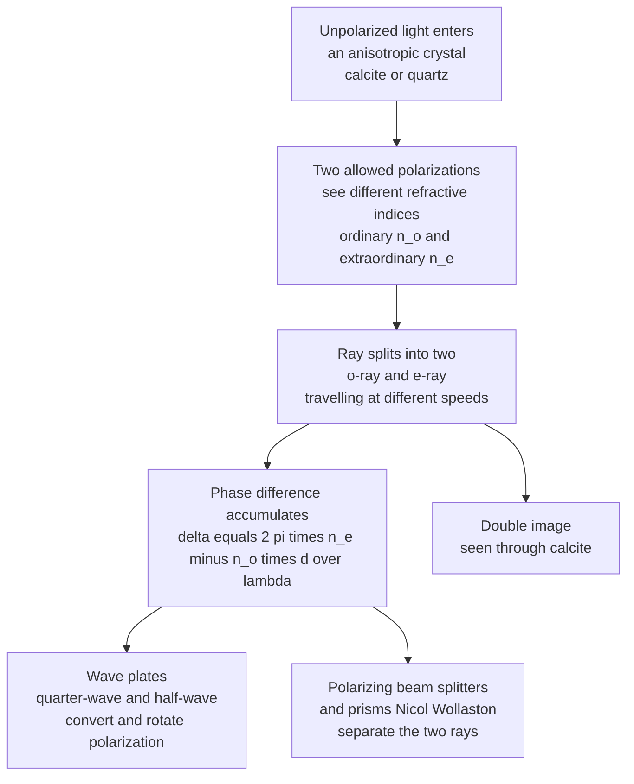

# 💎 Crystal Optics and Birefringence

> [!abstract] TL;DR
> In **anisotropic** materials — crystals like **calcite** and **quartz**, or any stressed/aligned solid — the refractive index depends on the light's **polarization** and **propagation direction**. A single ray splits into an **ordinary** ray (index $n_o$, obeys Snell's law) and an **extraordinary** ray (index $n_e(\theta)$, walks off sideways): this is **birefringence**, and it makes calcite show a *doubled* image. Because the two rays travel at different speeds, a birefringent plate accumulates a controllable **phase retardance** $\delta = 2\pi(n_e-n_o)d/\lambda$ — the physics behind **quarter-wave** and **half-wave plates**, **polarizing prisms**, **electro-optic modulators**, and the **liquid-crystal switch inside every LCD**.

## Intuition — analogy FIRST

Place a clear crystal of **calcite** on a printed page and something magical happens: you see the text **doubled** — two overlapping images floating at slightly different depths. Rotate the crystal and one image *orbits* around the other while the other stays put. Nothing about the ink changed; the **crystal split each ray of light in two**.

Here is the picture. Ordinary glass or water is **isotropic** — it looks the same in every direction, so light of any polarization sees the *same* refractive index and there is a single refracted ray. But calcite's atoms are stacked in a way that gives the crystal a **"grain,"** like the grain in a plank of wood. Light whose electric field oscillates *along* the grain sees a different world — a different speed, a different index — than light oscillating *across* the grain. Since ordinary light is a mix of all polarizations, the crystal sorts it into **two beams**: one polarization bends the normal way (the **ordinary** ray), the other bends by a different amount and slides sideways (the **extraordinary** ray). Two rays, two images.

This "double vision" is not a curiosity — it is the **workhorse of polarization control**. By cutting these crystals to precise thicknesses, engineers build **wave plates** that turn linear light into circular light or rotate its polarization, **polarizing beam splitters** that cleanly separate the two polarizations, and the **liquid-crystal cells** whose birefringence flips under voltage to darken or brighten each pixel of a screen. Anisotropy — where light's behavior depends on *direction* — hands optical engineers a whole extra dimension of control that isotropic materials simply cannot offer.

---

## How It Works

### Core mechanics

1. **Isotropic vs. anisotropic.** In glass or water the refractive index $n$ is a single number, the same for every direction and polarization. In an **anisotropic** crystal the index is a **tensor**: it depends on how the light is polarized relative to the crystal axes.
2. **The optic axis.** A **uniaxial** crystal (calcite, quartz) has one special direction, the **optic axis**, along which birefringence vanishes. **Biaxial** crystals (mica, topaz) have two such axes and three principal indices.
3. **Ordinary and extraordinary rays.** Light entering a uniaxial crystal splits into two:
   - the **ordinary (o) ray** — polarization perpendicular to the plane containing the optic axis; sees a fixed index $n_o$ and **obeys Snell's law** normally;
   - the **extraordinary (e) ray** — polarization in that plane; sees an index $n_e(\theta)$ that **varies with the angle $\theta$** between the ray and the optic axis, and generally **walks off** to the side even at normal incidence.
4. **Birefringence.** The magnitude of the effect is $\Delta n = n_e - n_o$. **Positive** uniaxial ($n_e > n_o$, e.g. quartz); **negative** uniaxial ($n_e < n_o$, e.g. calcite, a strong $\Delta n \approx -0.17$).
5. **The index ellipsoid (indicatrix).** Geometrically, the allowed indices for any propagation direction are read off an **ellipsoid** $x^2/n_o^2 + y^2/n_o^2 + z^2/n_e^2 = 1$ (optic axis along $z$). Slice it perpendicular to the propagation vector and the ellipse's two semi-axes give the two indices. The extraordinary index at angle $\theta$ from the optic axis obeys $1/n_e(\theta)^2 = \cos^2\theta/n_o^2 + \sin^2\theta/n_e^2$.
6. **Phase retardance.** Because the o- and e-waves travel at different speeds, after a thickness $d$ they emerge with a **phase difference** $\delta = 2\pi(n_e-n_o)d/\lambda$. Choosing $d$ so that $\delta = \pi/2$ gives a **quarter-wave plate** (linear $\leftrightarrow$ circular); $\delta = \pi$ gives a **half-wave plate** (rotates linear polarization). This is the bridge from crystal physics to practical polarization devices.

### Flow / architecture



---

## Key Concepts / Details

### Secondary Level

**Double refraction.** Calcite splits one ray into two because it has **two refractive indices**. The **ordinary ray** passes straight through (bends the usual amount), while the **extraordinary ray** bends differently and shifts sideways — so a dot becomes two dots. Each ray is **polarized**, and the two are polarized at right angles to each other, which you can prove by rotating a polarizing filter over the crystal: one image fades while the other brightens.

**Fast and slow axes.** A birefringent plate has a **fast axis** (lower index, higher speed) and a **slow axis** (higher index). Light polarized along the slow axis lags behind — the accumulated lag is what a **wave plate** exploits.

**Wave plates in one line.** A **quarter-wave plate** turns straight-line (linear) light into corkscrew (circular) light; a **half-wave plate** rotates the direction of linear polarization. They are just birefringent crystals cut to the right thickness.

### Undergraduate Level

**Retardance and wave-plate thickness.** The phase difference between the two polarizations after thickness $d$ is
$$\delta = \frac{2\pi}{\lambda}\,(n_e - n_o)\,d = \frac{2\pi}{\lambda}\,\Delta n\, d.$$
A **zero-order quarter-wave plate** needs $|\Delta n|\,d = \lambda/4$; a **half-wave plate** needs $|\Delta n|\,d = \lambda/2$. For calcite ($|\Delta n|\approx 0.172$) at $\lambda = 633$ nm, a true zero-order QWP is only $d \approx 0.9\ \mu\text{m}$ thick — impractically thin, which is why real plates are **multi-order** (thick, $\delta = 2\pi m + \pi/2$) or made from weakly birefringent quartz/mica, or two plates subtracted.

**Jones calculus.** With fast axis along $x$, a retarder is the Jones matrix
$$W(\delta) = \begin{pmatrix} 1 & 0 \\ 0 & e^{i\delta}\end{pmatrix}.$$
Feed in linear light at $45^\circ$, $\mathbf{J}_{\text{in}} = \tfrac{1}{\sqrt2}\begin{pmatrix}1\\1\end{pmatrix}$. A **QWP** ($\delta = \pi/2$) outputs $\tfrac{1}{\sqrt2}\begin{pmatrix}1\\ i\end{pmatrix}$ — **circular** polarization. A **HWP** ($\delta = \pi$) outputs $\tfrac{1}{\sqrt2}\begin{pmatrix}1\\ -1\end{pmatrix}$ — linear light rotated to $-45^\circ$ (a $90^\circ$ swing). In general a HWP with its axis at angle $\alpha$ reflects the polarization about that axis, rotating an incoming linear state by $2\alpha$.

**Extraordinary index vs. angle.** The extraordinary ray's index depends on the angle $\theta$ between the propagation direction and the optic axis:
$$\frac{1}{n_e(\theta)^2} = \frac{\cos^2\theta}{n_o^2} + \frac{\sin^2\theta}{n_e^2}.$$
At $\theta = 0$ (along the optic axis) $n_e(\theta) = n_o$ — **no birefringence**; at $\theta = 90^\circ$ it reaches the principal value $n_e$. This is why the cut of the crystal matters as much as its material.

**Polarizing prisms.** Cemented calcite prisms exploit the index difference at an internal interface: a **Nicol** or **Glan–Thompson** prism sends the e-ray through and totally-internally-reflects the o-ray away, delivering one clean linear polarization; a **Wollaston** prism deflects the two polarizations into a diverging pair of beams.

### Graduate Level

**The dielectric tensor.** Anisotropy lives in the **permittivity tensor** $\varepsilon_{ij}$. In principal axes it is diagonal with $\varepsilon_x, \varepsilon_y, \varepsilon_z$; the principal indices are $n_i = \sqrt{\varepsilon_i/\varepsilon_0}$. Uniaxial means two are equal ($n_x = n_y = n_o$, $n_z = n_e$); biaxial means all three differ. Solving Maxwell's equations in such a medium yields **Fresnel's equation of wave normals**, a quartic whose two roots are the two allowed phase velocities for each propagation direction.

**Walk-off (Poynting-vector deviation).** For the e-ray, $\mathbf{D} \perp \mathbf{k}$ but $\mathbf{E}$ is **not** parallel to $\mathbf{D}$, so the energy flow $\mathbf{S} = \mathbf{E}\times\mathbf{H}$ points in a *different* direction from the wave-normal $\mathbf{k}$. The angle between them, the **walk-off angle** $\rho$, obeys
$$\tan\rho = \frac{n_e(\theta)^2}{2}\left(\frac{1}{n_o^2}-\frac{1}{n_e^2}\right)\sin 2\theta,$$
peaking near $\theta = 45^\circ$. Walk-off limits how tightly you can focus in a birefringent crystal and matters critically for nonlinear frequency-conversion phase matching.

**Electro-optic effect (Pockels).** An applied electric field perturbs the index ellipsoid: $\Delta(1/n^2)_i = r_{ij}E_j$, where $r_{ij}$ is the **linear electro-optic (Pockels) tensor**. In crystals like LiNbO₃ this makes the birefringence — and hence the retardance $\delta$ — a **voltage-controlled** quantity, turning a crystal into a GHz-bandwidth **phase or amplitude modulator**.

**Liquid crystals.** Nematic liquid crystals are fluids of rod-like molecules with long-range orientational order; they are **birefringent** because the aligned rods define an optic axis. A modest voltage **reorients** the rods, sweeping $\delta$ continuously — combined with crossed polarizers, this is the pixel-level shutter inside every LCD. See the condensed-matter treatment of the nematic-to-isotropic transition.

**Photoelasticity.** Mechanical **stress** induces birefringence in normally isotropic glass and plastic ($\Delta n \propto$ stress difference, the stress-optic law). Viewed between crossed polarizers, stressed transparent models and tempered glass reveal colored **fringe patterns** that map the internal stress field — a classic experimental stress-analysis tool.

---

## Python Demo

```python
# Crystal optics: birefringent retardance, wave-plate polarization conversion,
# the optical indicatrix (index ellipsoid), and o/e double-refraction walk-off.
# numpy + matplotlib only.
import numpy as np
import matplotlib.pyplot as plt

# ---- Material: calcite (negative uniaxial) at ~589 nm ----
n_o, n_e = 1.658, 1.486          # ordinary and (principal) extraordinary indices
dn       = n_e - n_o             # birefringence (negative for calcite)
lam      = 589e-9                # wavelength (m)

# ============================================================
# (a) RETARDANCE vs plate thickness, marking QWP and HWP points
# ============================================================
d = np.linspace(0, 4e-6, 800)                     # thickness 0..4 microns
delta = 2*np.pi*np.abs(dn)*d/lam                  # accumulated phase retardance
d_qwp = (lam/4)/np.abs(dn)                         # quarter-wave thickness
d_hwp = (lam/2)/np.abs(dn)                         # half-wave thickness

# ============================================================
# (b) POLARIZATION CONVERSION via Jones calculus
#     Input: linear at 45 deg.  Plate fast axis along x.
#     W(delta) = diag(1, exp(i*delta)).  Trace E(t) over one optical cycle.
# ============================================================
def output_ellipse(delta):
    Jin = np.array([1, 1]) / np.sqrt(2)            # 45-degree linear input
    Jout = np.array([Jin[0], Jin[1]*np.exp(1j*delta)])
    t = np.linspace(0, 2*np.pi, 400)               # one cycle
    Ex = np.real(Jout[0]*np.exp(-1j*t))
    Ey = np.real(Jout[1]*np.exp(-1j*t))
    return Ex, Ey

cases = [(0.0, "delta = 0  (no plate): linear 45deg"),
         (np.pi/2, "delta = pi/2 (QWP): circular"),
         (np.pi, "delta = pi (HWP): rotated to -45deg")]

# ============================================================
# (c) OPTICAL INDICATRIX cross-section + extraordinary index n_e(theta)
# ============================================================
th = np.linspace(0, np.pi/2, 400)
ne_theta = 1.0/np.sqrt(np.cos(th)**2/n_o**2 + np.sin(th)**2/n_e**2)  # varies n_o -> n_e
phi = np.linspace(0, 2*np.pi, 400)                 # indicatrix ellipse (x=perp, z=optic axis)
xe, ze = n_o*np.cos(phi), n_e*np.sin(phi)

# ============================================================
# (d) DOUBLE REFRACTION schematic: o-ray straight, e-ray walks off
# ============================================================
theta_cut = np.radians(45)                          # optic axis at 45deg -> strong walk-off
ne_c = 1.0/np.sqrt(np.cos(theta_cut)**2/n_o**2 + np.sin(theta_cut)**2/n_e**2)
rho = np.arctan((ne_c**2/2)*(1/n_o**2 - 1/n_e**2)*np.sin(2*theta_cut))  # walk-off angle (rad)

# ---------------- plots ----------------
fig, ax = plt.subplots(2, 2, figsize=(12, 9.5))

# (a) retardance vs thickness
ax[0,0].plot(d*1e6, delta, lw=2, color="#4a9eff")
ax[0,0].axhline(np.pi/2, color="#51cf66", ls="--", lw=1)
ax[0,0].axhline(np.pi,   color="#ff922b", ls="--", lw=1)
ax[0,0].plot(d_qwp*1e6, np.pi/2, "o", color="#51cf66", ms=9, label="QWP  delta = pi/2")
ax[0,0].plot(d_hwp*1e6, np.pi,   "o", color="#ff922b", ms=9, label="HWP  delta = pi")
ax[0,0].set_xlabel("plate thickness d  (microns)")
ax[0,0].set_ylabel("retardance delta  (rad)")
ax[0,0].set_title("(a) Retardance grows with thickness")
ax[0,0].legend(fontsize=8); ax[0,0].grid(alpha=0.3)

# (b) polarization ellipses
colors = ["#845ef7", "#51cf66", "#ff922b"]
for (dlt, lbl), c in zip(cases, colors):
    Ex, Ey = output_ellipse(dlt)
    ax[0,1].plot(Ex, Ey, lw=2, color=c, label=lbl)
ax[0,1].set_aspect("equal"); ax[0,1].grid(alpha=0.3)
ax[0,1].set_xlabel("E_x"); ax[0,1].set_ylabel("E_y")
ax[0,1].set_title("(b) Wave-plate polarization conversion")
ax[0,1].legend(fontsize=7, loc="upper right")

# (c) indicatrix ellipse + n_e(theta)
ax[1,0].plot(xe, ze, lw=2, color="#4a9eff", label="index ellipsoid cross-section")
ax[1,0].plot(np.degrees(th)/90*n_o*0, np.degrees(th)*0, alpha=0)  # keep autoscale sane
ax[1,0].axhline(0, color="gray", lw=0.6); ax[1,0].axvline(0, color="gray", lw=0.6)
ax[1,0].annotate("n_o (ordinary)", xy=(n_o, 0), xytext=(n_o*0.35, 0.25),
                 fontsize=8, color="#c92a2a")
ax[1,0].annotate("n_e (extraordinary,\noptic axis)", xy=(0, n_e), xytext=(-1.3, n_e*0.6),
                 fontsize=8, color="#2b8a3e")
ax[1,0].set_aspect("equal"); ax[1,0].grid(alpha=0.3)
ax[1,0].set_xlabel("index perpendicular to optic axis")
ax[1,0].set_ylabel("index along optic axis")
ax[1,0].set_title("(c) Optical indicatrix: n depends on direction")

# (d) double refraction schematic
ax[1,1].set_aspect("equal"); ax[1,1].axis("off")
ax[1,1].add_patch(plt.Rectangle((0,-1.2), 3, 2.4, fc="#e7f5ff", ec="#4a9eff"))
ax[1,1].text(1.5, 1.35, "birefringent crystal", ha="center", fontsize=9, color="#1971c2")
ax[1,1].annotate("", xy=(0,0), xytext=(-1.4,0),
                 arrowprops=dict(arrowstyle="-|>", color="black", lw=2))
ax[1,1].text(-1.4, 0.15, "unpolarized in", fontsize=8)
# o-ray straight through
ax[1,1].plot([0,3],[0,0], color="#c92a2a", lw=2)
ax[1,1].text(3.05, 0.02, "o-ray (n_o, straight)", color="#c92a2a", fontsize=8, va="center")
# e-ray walks off by angle rho, then exits parallel but offset
ye = 3*np.tan(rho)
ax[1,1].plot([0,3],[0,ye], color="#2b8a3e", lw=2)
ax[1,1].text(3.05, ye, "e-ray (n_e, walk-off)", color="#2b8a3e", fontsize=8, va="center")
ax[1,1].plot(3.4, 0, "o", color="#c92a2a", ms=8)
ax[1,1].plot(3.4, ye, "o", color="#2b8a3e", ms=8)
ax[1,1].text(3.4, -0.35, "double image", ha="center", fontsize=8)
ax[1,1].set_title("(d) Double refraction: walk-off = %.1f deg" % np.degrees(rho))
ax[1,1].set_xlim(-1.8, 5.2); ax[1,1].set_ylim(-1.6, 1.7)

plt.tight_layout()
plt.show()

# Console summary
print("Calcite  n_o=%.3f  n_e=%.3f  birefringence dn=%.3f" % (n_o, n_e, dn))
print("Zero-order QWP thickness = %.3f microns" % (d_qwp*1e6))
print("Zero-order HWP thickness = %.3f microns" % (d_hwp*1e6))
print("e-ray walk-off at 45deg cut = %.2f deg" % np.degrees(rho))
```

Panel (a) shows retardance climbing linearly with thickness, hitting the QWP and HWP conditions at sub-micron depths (why real calcite plates are multi-order). Panel (b) is the payoff: a $45^\circ$ linear input emerges **circular** after a quarter-wave plate and **rotated to $-45^\circ$** after a half-wave plate. Panel (c) draws the **indicatrix** — an ellipse whose two semi-axes are $n_o$ and $n_e$, the visual statement that "the index depends on direction." Panel (d) shows the o-ray boring straight through while the e-ray **walks off** and exits offset, producing the doubled image.

---

## Real-World Applications

- **Liquid-crystal displays (every phone, monitor, TV).** Each pixel is a **birefringent** nematic liquid-crystal cell between crossed polarizers. With no voltage the twisted molecules rotate polarization and light passes (bright); a voltage untwists them, killing the rotation so the second polarizer blocks the light (dark). Grey levels come from partial reorientation — birefringence dialed by voltage.
- **Wave plates in every laser lab.** Zero-order and achromatic **quarter-** and **half-wave plates** (quartz or polymer) set and rotate laser polarization, build variable attenuators (HWP + polarizer), and convert linear to circular for optical pumping and ellipsometry.
- **Electro-optic modulators for fiber comms.** LiNbO₃ and thin-film-lithium-niobate **Pockels-cell** modulators encode data onto light at tens of GHz by voltage-tuning the crystal's birefringence — the transmitters of the long-haul internet. See the sibling note on optical modulators and switches.
- **Polarizing prisms and beam splitters.** **Glan–Thompson**, **Nicol**, and **Wollaston** prisms use calcite's index difference to separate or select polarizations in microscopy, spectroscopy, and quantum-optics setups.
- **Photoelastic stress analysis.** Transparent plastic models (and tempered car/phone glass) viewed between crossed polarizers reveal **colored fringe maps** of internal stress, because stress induces birefringence — a direct experimental readout of the stress field.
- **Optical isolators.** Combining a **Faraday rotator** with birefringent polarizers builds a one-way valve for light that protects lasers from back-reflections.

---

## Common Pitfalls

- **Assuming a wave plate works at any wavelength.** Retardance $\delta = 2\pi\Delta n\, d/\lambda$ is **wavelength-dependent**: a quarter-wave plate designed for 633 nm is *not* a quarter-wave plate at 532 nm. Use **achromatic** (compound) plates when you need broadband operation.
- **Ignoring multi-order plate temperature sensitivity.** A thick **multi-order** plate ($\delta = 2\pi m + \pi/2$) drifts strongly with temperature because $\Delta n$ and $d$ both change; the large $m$ amplifies the error. **Zero-order** (or two subtracted plates) is far more stable.
- **Expecting the extraordinary ray to obey Snell's law.** The **o-ray** does; the **e-ray** generally does **not** — it walks off sideways even at normal incidence. Ray-tracing a birefringent element with a single Snell's-law step is simply wrong.
- **Confusing positive and negative uniaxial (sign of $\Delta n$).** Calcite is **negative** ($n_e < n_o$), quartz **positive** ($n_e > n_o$). Getting the sign wrong swaps the fast and slow axes and inverts the sense of circular polarization a QWP produces.
- **Aligning the input polarization carelessly.** A half-wave plate only *rotates* polarization when the input makes an angle with its axis; input aligned *with* an axis passes unchanged. A QWP produces perfect circular light **only** for a $45^\circ$ input — other angles give elliptical states.
- **Forgetting unintended birefringence.** Injection-molded plastic optics, stressed cover glass, and even strained lens mounts are accidentally birefringent (photoelasticity), scrambling polarization in precision instruments where you assumed an isotropic medium.

---

## Related Concepts

- [[Polarization_and_Dispersion]] — the polarization states (linear, circular, elliptical) and Jones/Mueller calculus that wave plates manipulate; birefringence is the physical mechanism that *creates* the phase retardance.
- [[Wave_Motion_and_Properties]] — birefringence is two waves with different phase velocities; the o/e splitting is a boundary and propagation effect of the underlying wave.
- [[Optical_Properties_and_Photonic_Materials]] — the materials-science view of how refractive index, absorption, and anisotropy arise from a solid's structure and electronic response.
- [[Crystal_Systems_and_Space_Groups]] — a crystal's symmetry class determines whether it is optically isotropic, uniaxial, or biaxial; the optic axis follows from the lattice.
- [[Liquid_Crystals_and_Colloids]] — nematic liquid crystals are voltage-switchable birefringent media; their reorientation is the shutter mechanism inside LCDs.
- [[Crystal_Structure_and_Band_Theory]] — the condensed-matter foundation for anisotropic optical response and the nematic ordering transition.
- [[Electromagnetic_Waves_and_Radiation]] — Maxwell's equations in an anisotropic dielectric tensor give the two allowed waves, the index ellipsoid, and walk-off.

*Sibling notes in this Optics and Photonics section (referenced in prose above, to be linked as the section fills out): polarization of light; dispersion and optical properties of materials; nonlinear optics (phase matching needs birefringence walk-off); optical modulators and switches (the electro-optic effect); and thin films and optical coatings.*

---

## Review Questions

1. **Secondary.** Looking through a calcite crystal at a single dot, you see **two** dots. Explain in your own words why, and describe what happens to each dot as you rotate a polarizing filter placed on top of the crystal. Which ray, if either, stays fixed as you rotate the crystal itself?
2. **Undergraduate.** A quartz plate has $\Delta n = 0.009$ and is used at $\lambda = 500$ nm. (a) What thickness makes a zero-order **half-wave** plate? (b) A linear input polarized at $30^\circ$ to the fast axis passes through it — at what angle does it emerge, and why? (c) Why would you prefer this plate to a $10\times$-thicker multi-order version in a temperature-varying environment?
3. **Graduate.** Starting from the index ellipsoid $x^2/n_o^2 + y^2/n_o^2 + z^2/n_e^2 = 1$, derive the extraordinary index $n_e(\theta)$ for propagation at angle $\theta$ to the optic axis. Then explain physically why the extraordinary ray exhibits **walk-off** — i.e., why $\mathbf{S}$ and $\mathbf{k}$ diverge — and identify the angle $\theta$ where walk-off is largest. Why does this matter for phase matching in nonlinear frequency conversion?

---

## Sources

- Hecht, E. — *Optics*, 5th ed. (Polarization, birefringence, wave plates, and polarizing prisms).
- Born, M. & Wolf, E. — *Principles of Optics*, 7th ed. (Crystal optics, the index ellipsoid, and Fresnel's equation of wave normals).
- Yariv, A. & Yeh, P. — *Optical Waves in Crystals* (Propagation in anisotropic and electro-optic media; walk-off and modulators).
- Saleh, B. E. A. & Teich, M. C. — *Fundamentals of Photonics*, 3rd ed. (Anisotropic media, retarders, liquid crystals, and electro-optics).

---

#optics #birefringence #crystal-optics #wave-plate #liquid-crystal
