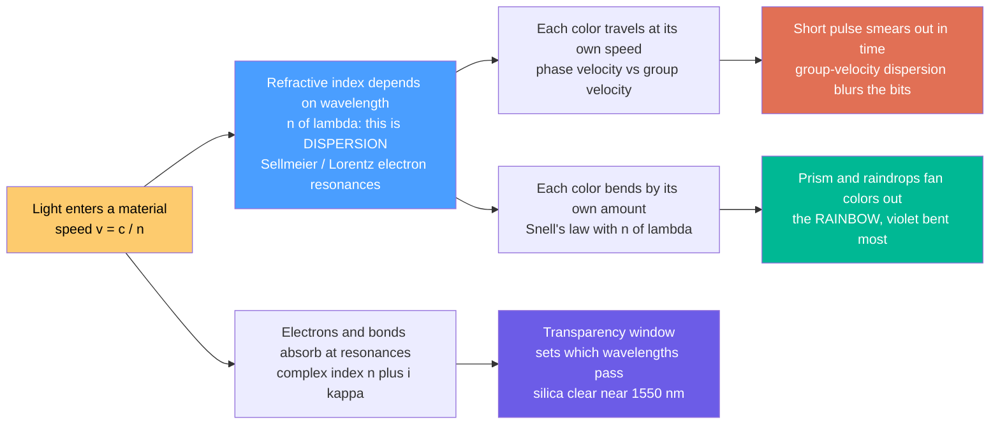

# 🌈 Dispersion and Optical Properties of Materials

> [!abstract] TL;DR
> A material's **refractive index** $n = c/v$ measures how much it slows light — but crucially $n$ depends on **wavelength**, $n(\lambda)$, because the material's electrons respond differently to different frequencies. This wavelength dependence is **dispersion**: it splits white light into a rainbow (a prism, a raindrop, a diamond) and, less romantically, it **smears optical pulses** in a fiber because the colors inside a pulse travel at slightly different speeds (group-velocity dispersion). Combined with **absorption** (which carves out the transparency windows that decide what a material passes) and **reflection**, these optical properties determine what every lens, fiber, window, prism, and coating can actually do.

---

## Intuition

**Analogy — Newton's prism.** White light looks colorless, but Isaac Newton's prism revealed it is a secret mixture of every color. The prism separates them because glass bends each color by a slightly *different* amount — violet most, red least — fanning white light into a rainbow. That is **dispersion**: the amount a material bends and slows light depends on the light's color (its wavelength). The same effect makes raindrops paint rainbows across the sky and makes a cut diamond throw colored sparkles.

But dispersion has a hidden cost in technology. A short pulse of laser light in a fiber-optic cable is not a single pure color — it is a small *spread* of wavelengths bundled together. If each wavelength travels at a slightly different speed, the pulse **smears out** as it races down the glass, blurring the crisp ones and zeros that carry the internet. Engineers spend enormous effort fighting this smear. So the very same physics that makes a rainbow beautiful is what limits how fast a fiber can carry data: a material's optical properties — how it transmits, absorbs, reflects, and disperses light — set the ground rules for every optical device.

---

## How It Works

### The chain from electrons to rainbows and blurred bits

1. **Light slows in matter.** In vacuum light moves at $c$; in a material it slows to $v = c/n$, where the **refractive index** $n$ counts how strongly the material's bound electrons are dragged into oscillation by the passing electromagnetic wave.
2. **The response is frequency-dependent.** Electrons are like tiny masses on springs with natural resonances. Drive them near a resonance and they respond strongly; drive them far away and they barely move. So $n$ depends on the driving frequency — i.e. on **wavelength**, $n(\lambda)$. This is dispersion, and the **Sellmeier** / **Lorentz oscillator** models capture it.
3. **Normal dispersion** (the everyday case for transparent glass in the visible): $n$ *decreases* as wavelength increases, so violet sees a higher index than red. Higher index means more slowing and, by Snell's law, more bending — hence violet bends most and the prism fans out a spectrum.
4. **Two consequences of $n(\lambda)$ diverge.** Different colors *bend* by different amounts (the prism / rainbow) **and** they *travel at different speeds* (the fiber pulse spreads). The second effect is quantified by **group-velocity dispersion (GVD)** acting on the pulse's envelope.
5. **Absorption sets the stage.** Independently, the material absorbs strongly near its electronic (UV) and vibrational (IR) resonances. Between those resonances lies a **transparency window** — the band of wavelengths the material actually passes. Glass is clear in the visible but opaque in UV and far-IR; silica fiber has its ultra-low-loss window near **1550 nm**; silicon is opaque to visible light yet transparent in the infrared.



---

## Key Concepts

### Secondary Level

- **Refractive index** $n = c/v$ — how much a material slows light. Vacuum $n = 1$; water $\approx 1.33$; glass $\approx 1.5$; diamond $\approx 2.42$. The bigger $n$, the slower the light and the more a ray bends when it enters.
- **Dispersion is color-dependent bending.** In glass, $n$ is a little larger for violet than for red, so violet bends more. A prism therefore spreads white light into a rainbow — and so does a spherical raindrop, giving the sky's rainbow.
- **Diamonds sparkle** because their large index *and* strong dispersion fling the colors far apart, producing the fiery flashes ("fire") jewelers prize.
- **Materials have colors and clear windows.** A red filter absorbs everything but red. Ordinary glass is transparent to visible light but blocks ultraviolet (why you don't tan through a window) and much infrared.
- **Not all light gets through or in.** Some reflects off the surface, some is absorbed inside, and the rest is transmitted. Those three fractions — reflect, absorb, transmit — always add up to the incoming light.

### Undergraduate Level

- **Snell's law with dispersion.** $n_1\sin\theta_1 = n_2\sin\theta_2$, but $n_2 = n_2(\lambda)$, so the refraction angle is color-dependent — the mathematical root of the rainbow.
- **Sellmeier equation** — the workhorse empirical model for $n(\lambda)$ in a transparent material:

$$n^2(\lambda) = 1 + \sum_j \frac{B_j\,\lambda^2}{\lambda^2 - C_j}$$

For N-BK7 glass, three terms fit $n$ to $\pm 10^{-5}$ across roughly 0.3–2.5 µm. The **Cauchy equation** $n(\lambda) \approx A + B/\lambda^2$ is a simpler visible-band approximation.

- **Normal vs anomalous dispersion.** *Normal:* $dn/d\lambda < 0$ (index falls with wavelength) — the usual case in a transparency window. *Anomalous:* $dn/d\lambda > 0$, which happens only *near an absorption band*, where the index does strange things.
- **Abbe number** $V_d = \dfrac{n_d - 1}{n_F - n_C}$ quantifies how *little* a glass disperses (measured at the F, d, C spectral lines, 486 / 587.6 / 656 nm). **High $V_d$ = low dispersion.** Crown glasses ($V_d \gtrsim 55$) disperse little; flint glasses ($V_d \lesssim 35$) disperse a lot. Low $V_d$ causes **chromatic aberration**: a simple lens focuses blue and red at different points, giving colored fringes.
- **Phase vs group velocity.** The **phase velocity** $v_p = c/n$ is the speed of individual wave crests. The **group velocity** $v_g = c/n_g$ is the speed of the pulse/energy envelope, with the **group index**

$$n_g = n - \lambda\,\frac{dn}{d\lambda}.$$

These differ whenever $dn/d\lambda \ne 0$ — i.e. whenever there is dispersion.

- **Absorption and the complex index.** Write $\tilde{n} = n + i\kappa$. The real part $n$ sets speed and refraction; the imaginary part $\kappa$ (the **extinction coefficient**) sets absorption. The **Beer–Lambert law** gives intensity decay $I(x) = I_0 e^{-\alpha x}$ with $\alpha = 4\pi\kappa/\lambda_0$.
- **Rayleigh scattering** $\propto \lambda^{-4}$ — short wavelengths scatter far more than long ones. It makes the sky blue, sunsets red, and is the dominant intrinsic loss floor of a silica fiber (favoring the long-wavelength 1550 nm window).

### Graduate Level

- **Lorentz oscillator model** — the physical origin of $n(\lambda)$. Electrons bound with resonance $\omega_0$ and damping $\gamma$ give a complex permittivity

$$\varepsilon(\omega) = 1 + \frac{Ne^2/\varepsilon_0 m}{\omega_0^2 - \omega^2 - i\gamma\omega},\qquad \tilde{n} = \sqrt{\varepsilon}.$$

Far below resonance $n$ rises gently with frequency (normal dispersion); *across* the resonance $n$ dips sharply (anomalous dispersion) while $\kappa$ peaks (the absorption band). Summing many oscillators reproduces the Sellmeier form.

- **Kramers–Kronig relations** — causality (a medium cannot respond before the field arrives) rigidly links the real and imaginary parts of $\tilde{n}(\omega)$: knowing the full absorption spectrum $\kappa(\omega)$ determines $n(\omega)$ everywhere, and vice versa. Absorption and dispersion are two faces of one causal response.

- **Group-velocity dispersion (GVD).** Expand the propagation constant $\beta(\omega) = n(\omega)\omega/c$ about a center frequency $\omega_0$:

$$\beta(\omega) = \beta_0 + \beta_1(\omega-\omega_0) + \tfrac{1}{2}\beta_2(\omega-\omega_0)^2 + \cdots$$

$\beta_1 = 1/v_g$ is the inverse group velocity; **$\beta_2 = d^2\beta/d\omega^2$ is the GVD parameter** that broadens pulses. An unchirped Gaussian of half-width $T_0$ broadens after length $L$ as

$$T(L) = T_0\sqrt{1 + \left(\tfrac{L}{L_D}\right)^2},\qquad L_D = \frac{T_0^2}{|\beta_2|}\ \ (\text{dispersion length}).$$

The engineering **dispersion parameter** $D = -\dfrac{2\pi c}{\lambda^2}\beta_2$ is quoted in ps/(nm·km); standard SMF has $D \approx +17$ ps/(nm·km) at 1550 nm.

- **Total fiber dispersion = material + waveguide.** Material dispersion comes from $n(\lambda)$ of the glass; **waveguide dispersion** comes from how the guided mode's confinement shifts with wavelength. They partly cancel near 1310 nm (the zero-dispersion wavelength of standard SMF), and dispersion-shifted / dispersion-compensating fibers deliberately engineer the balance.

- **Bandgap sets the absorption edge.** In a semiconductor, photons with $h\nu \ge E_g$ are absorbed by exciting electrons across the gap; below $E_g$ the crystal is transparent. This is why **silicon** ($E_g \approx 1.12$ eV, edge near 1100 nm) is opaque to visible light but transparent in the near-IR, and why the choice of material fixes a detector's or window's spectral range.

- **Reflection: the Fresnel equations.** At an interface the reflected amplitude depends on $\tilde{n}$, angle, and polarization; at normal incidence $R = \left|\dfrac{\tilde{n}-1}{\tilde{n}+1}\right|^2$. High-index materials reflect more (bare silicon loses ~35% at its surface), which is why anti-reflection coatings and index-matching matter.

---

## Python Demo

```python
# Dispersion and material optics in three panels:
#   (a) DISPERSION CURVE  n(lambda) for BK7 glass via the Sellmeier equation
#   (b) PRISM DEVIATION   minimum-deviation angle vs wavelength (why violet bends most)
#   (c) PULSE BROADENING  a short optical pulse spreading after a dispersive fiber (GVD)
import numpy as np
import matplotlib.pyplot as plt

# ---------- (a) Sellmeier dispersion of N-BK7 borosilicate crown glass ----------
def sellmeier_bk7(lam_um):
    """Refractive index of Schott N-BK7 vs wavelength in micrometres."""
    l2 = lam_um**2
    n2 = (1.0
          + 1.03961212 * l2 / (l2 - 0.00600069867)
          + 0.231792344 * l2 / (l2 - 0.0200179144)
          + 1.01046945 * l2 / (l2 - 103.560653))
    return np.sqrt(n2)

lam_nm = np.linspace(380, 750, 400)          # visible band, nm
n_glass = sellmeier_bk7(lam_nm / 1000.0)

# Abbe number V_d using the F (486), d (587.6), C (656) nm spectral lines
n_d, n_F, n_C = sellmeier_bk7(0.5876), sellmeier_bk7(0.4861), sellmeier_bk7(0.6563)
abbe = (n_d - 1.0) / (n_F - n_C)

# ---------- (b) Prism minimum-deviation angle for an equilateral prism ----------
A = np.radians(60.0)                          # apex angle of the prism
delta_deg = np.degrees(2.0 * np.arcsin(n_glass * np.sin(A / 2.0)) - A)

# ---------- (c) Group-velocity dispersion broadening a Gaussian pulse ----------
T0    = 10.0                                   # input pulse half-width (1/e), ps
beta2 = -21.7                                  # GVD of standard SMF at 1550 nm, ps^2/km
L_D   = T0**2 / abs(beta2)                     # dispersion length, km
t         = np.linspace(-150, 150, 800)        # time axis, ps
distances = [0.0, 10.0, 20.0, 40.0]            # fiber length, km

fig, ax = plt.subplots(1, 3, figsize=(16, 4.6))

# (a) refractive index vs wavelength
ax[0].plot(lam_nm, n_glass, lw=2, color="navy")
ax[0].scatter([656, 486],
              [sellmeier_bk7(0.656), sellmeier_bk7(0.486)],
              color=["red", "violet"], zorder=5)
ax[0].annotate("red: n small, bends least", (656, sellmeier_bk7(0.656)),
               textcoords="offset points", xytext=(-8, 12), color="red")
ax[0].annotate("violet: n large, bends most", (486, sellmeier_bk7(0.486)),
               textcoords="offset points", xytext=(6, -18), color="violet")
ax[0].set_xlabel("wavelength  [nm]")
ax[0].set_ylabel("refractive index  n")
ax[0].set_title(f"(a) Normal dispersion of BK7 glass\nAbbe number V_d = {abbe:.1f}")
ax[0].grid(True, alpha=0.3)

# (b) prism deviation angle vs wavelength  -> the rainbow
ax[1].plot(lam_nm, delta_deg, lw=2, color="darkgreen")
ax[1].set_xlabel("wavelength  [nm]")
ax[1].set_ylabel("prism deviation angle  [deg]")
ax[1].set_title("(b) Prism fans white light into a rainbow\nshorter wavelength = larger deviation")
ax[1].grid(True, alpha=0.3)

# (c) pulse broadening from group-velocity dispersion
for L in distances:
    Tz = T0 * np.sqrt(1.0 + (L / L_D)**2)      # broadened 1/e half-width
    intensity = (T0 / Tz) * np.exp(-t**2 / Tz**2)   # energy-conserving envelope
    ax[2].plot(t, intensity, lw=2, label=f"L = {L:.0f} km")
ax[2].set_xlabel("time  [ps]")
ax[2].set_ylabel("normalized pulse intensity")
ax[2].set_title("(c) Group-velocity dispersion smears the pulse\nstandard fiber near 1550 nm")
ax[2].legend()
ax[2].grid(True, alpha=0.3)

plt.tight_layout()
plt.savefig("dispersion_and_material_optics.png", dpi=120)
plt.show()

# ---- Numerical checks ----
print(f"BK7 index:  n(656 nm red) = {sellmeier_bk7(0.656):.4f},  "
      f"n(486 nm violet) = {sellmeier_bk7(0.486):.4f}")
print(f"Abbe number V_d = {abbe:.2f}   (higher = less dispersion)")
print(f"Dispersion length L_D = {L_D:.2f} km; a 10 ps pulse broadens to "
      f"{T0*np.sqrt(1+(40/L_D)**2):.1f} ps after 40 km")
# -> n(red) = 1.5143, n(violet) = 1.5220  (violet index higher -> bends more)
# -> V_d ~ 64.2 (BK7 is a low-dispersion crown glass)
# -> L_D ~ 4.6 km; 10 ps -> ~87 ps after 40 km
```

Panel **(a)** is the dispersion curve: $n$ falls smoothly with wavelength (normal dispersion), and violet sits at a higher index than red — the numerical reason violet bends more. Panel **(b)** turns that into the **prism deviation angle**, which is largest at the blue-violet end: white light in, rainbow out. Panel **(c)** is the same physics wearing its industrial face — a clean 10 ps pulse launched into standard fiber spreads to tens of picoseconds after only tens of kilometers, because the band of wavelengths inside it travels at slightly different group velocities. Beautiful on the sky, costly on the wire.

---

## Real-World Applications

- **Fiber-optic internet.** The 1550 nm band is chosen because silica's Rayleigh-scattering loss ($\propto \lambda^{-4}$) and OH⁻ absorption together bottom out there at ~0.17 dB/km — a **transparency window** set by the material's absorption spectrum. Chromatic (material + waveguide) dispersion then limits how densely bits can be packed; long-haul links use dispersion-compensating fiber and dispersion-shifted fiber to keep pulses from overlapping.
- **Achromatic lenses (achromats).** Chromatic aberration from $n(\lambda)$ is cancelled by cementing a low-dispersion **crown** element (high $V_d$) to a high-dispersion **flint** element (low $V_d$) so the two color errors subtract. Every quality camera lens, microscope, and telescope objective is a descendant of this trick.
- **Prisms and spectrometers.** Dispersing prisms and gratings spread light by wavelength to read the spectral "fingerprints" of stars, chemicals, and gases — dispersion turned into a measuring instrument.
- **Diamond and gemstone "fire."** A gem's high index and strong dispersion are literally the design spec cutters optimize; the flashes of color are $n(\lambda)$ made visible.
- **Ultrafast lasers.** A femtosecond pulse contains a wide band of wavelengths, so material dispersion badly stretches it inside any glass. Prism pairs, chirped mirrors, and grating compressors apply *negative* dispersion to re-compress the pulse — dispersion management is the heart of ultrafast optics.
- **Infrared optics.** Ordinary glass absorbs beyond ~2.5 µm, so thermal-imaging and CO₂-laser systems use **germanium, ZnSe, or silicon** windows and lenses, chosen precisely for their IR transparency windows even though they are opaque to the eye.

---

## Common Pitfalls

- **Confusing phase index $n$ with group index $n_g$.** Refraction, Snell's law, and phase-matching use the phase index $n$; **pulse arrival time and dispersion** use the group index $n_g = n - \lambda\,dn/d\lambda$. Near a resonance the two can differ enormously. Using $n$ where $n_g$ belongs mis-predicts pulse delay and broadening.
- **Thinking higher wavelength always means lower index.** That is true only in a *transparency window* (normal dispersion). Cross an absorption band and dispersion goes **anomalous** ($dn/d\lambda > 0$); the Sellmeier fit, valid only between resonances, simply breaks there.
- **"Superluminal group velocity breaks relativity."** In anomalous-dispersion regions $v_g$ can exceed $c$ or go negative, but no information travels faster than $c$: the signal (front) velocity stays at $c$, and the effect is pulse *reshaping*, not faster-than-light signaling.
- **Treating the refractive index as a single number.** Quoting "$n = 1.5$" hides the wavelength dependence that *is* dispersion. For any color-sensitive design (lenses, fibers, prisms) you need the full $n(\lambda)$ curve, not one value.
- **Applying Beer–Lambert to scattering media.** $I = I_0 e^{-\alpha x}$ assumes pure absorption. In tissue, fog, frosted glass, or nanoparticle suspensions, **scattering** dominates; the total attenuation is $\mu_a + \mu_s$, and ignoring $\mu_s$ badly underestimates loss.
- **Forgetting the surface.** Reflection (Fresnel) removes light before it ever enters the material — several percent per air–glass interface, ~35% for bare silicon. Transmission, absorption, and reflection must all be accounted for; they are not the same thing.
- **Vacuum vs in-medium wavelength.** When light enters a medium its **frequency is fixed** but its wavelength shrinks to $\lambda_0/n$. Dispersion formulas and "1550 nm" almost always refer to the **vacuum** wavelength — track which one you mean.

---

## Related Concepts

**Within this vault (Optics and Photonics):**

- [[Optics_and_Photonics_Overview]] — the parent map of the field; this note deepens its dispersion and refractive-index threads under Pillar 2 (Polarization and Optical Materials).

**Physics foundations:**

- [[Polarization_and_Dispersion]] — the physics-vault companion covering the vector nature of light plus dispersion, Sellmeier, group vs phase velocity, and Kramers–Kronig.
- [[Wave_Motion_and_Properties]] — where phase velocity, group velocity, and wave packets are defined; dispersion is what makes a wave packet spread.
- [[Electromagnetic_Waves_and_Radiation]] — light as an electromagnetic wave; the permittivity $\varepsilon(\omega)$ and $\tilde{n} = \sqrt{\varepsilon}$ from which all of this follows.
- [[Geometric_and_Wave_Optics]] — Snell's law and refraction, the ray-level rules that dispersion makes color-dependent.
- [[Fourier_Transform]] — a short pulse is a Fourier superposition of many wavelengths; dispersion acts on that spectrum and re-assembles a broadened pulse.

**Materials science (the same physics from the materials side):**

- [[Optical_Properties_and_Photonic_Materials]] — the complex refractive index $\tilde{n} = n + i\kappa$, Drude/Lorentz models, reflectance, and luminescence: the materials-science counterpart to this optics-first treatment.
- [[Semiconductors_Intrinsic_and_Extrinsic]] — the bandgap $E_g$ that sets the absorption edge and hence the transparency window of a semiconductor.
- [[Electronic_Band_Structure]] — the quantum origin of $\varepsilon(\omega)$, the resonances that make $n$ wavelength-dependent, and the absorption edge.

*Sibling notes in this section (to be built): Polarization_of_Light (the vector nature of light), Reflection_Refraction_and_Fermats_Principle (the ray rules dispersion modifies), Thin_Films_and_Optical_Coatings (anti-reflection and dispersion-managing mirrors), Optical_Fibers_and_Waveguides (where chromatic dispersion limits data rate), and Ultrafast_and_Pulsed_Lasers (where dispersion management compresses femtosecond pulses).*

---

## Review Questions

1. **(Secondary)** A prism spreads sunlight into a rainbow with violet at one end and red at the other. Using the idea that a material's refractive index depends on color, explain **why violet is bent the most** and red the least. What everyday sky phenomenon is produced by the exact same effect in raindrops?
2. **(Undergraduate)** A camera lens shows faint colored fringes around high-contrast edges (chromatic aberration). Explain the origin in terms of $n(\lambda)$ and the **Abbe number**, and describe how an **achromatic doublet** (crown + flint glass) cancels it. Which glass should have the higher $V_d$, and why does pairing high- and low-dispersion glasses work?
3. **(Graduate)** A 10 ps unchirped Gaussian pulse at 1550 nm is launched into standard single-mode fiber with $\beta_2 = -21.7\ \text{ps}^2/\text{km}$. (a) Compute the dispersion length $L_D$ and the pulse width after 40 km. (b) Explain why the pulse broadens even though every wavelength stays within the fiber's low-loss transparency window. (c) Distinguish the roles of **material** and **waveguide** dispersion, and describe one way engineers push the zero-dispersion wavelength or compensate the residual dispersion.

---

## Sources

- Hecht, E. — *Optics*, 5th ed. (Pearson) — Ch. 3–4 on refractive index, dispersion, and the Sellmeier/Cauchy models.
- Fox, M. — *Optical Properties of Solids*, 2nd ed. (Oxford) — Lorentz oscillator model, complex refractive index, and absorption edges.
- Saleh, B. E. A. & Teich, M. C. — *Fundamentals of Photonics*, 3rd ed. (Wiley) — group velocity, group-velocity dispersion, and fiber pulse broadening.
- Born, M. & Wolf, E. — *Principles of Optics*, 7th ed. (Cambridge) — rigorous dispersion theory and the Kramers–Kronig relations.
- Agrawal, G. P. — *Fiber-Optic Communication Systems*, 4th ed. (Wiley) — chromatic dispersion, the dispersion parameter $D$, and dispersion management in fibers.

---

#optics #dispersion #refractive-index #group-velocity #optical-materials
