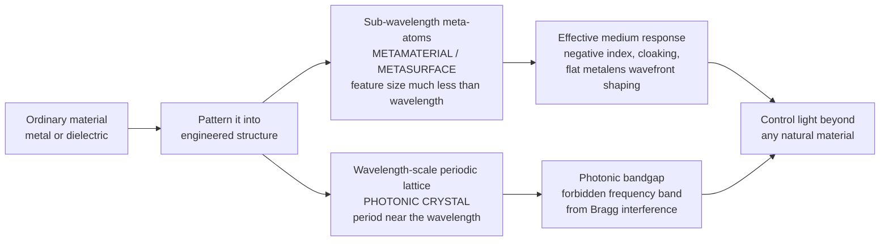

# 🔬 Metamaterials and Photonic Crystals

> [!abstract] TL;DR
> Ordinary materials get their optical properties from their **atoms**; metamaterials and photonic crystals get theirs from **structure**. Pattern metal or dielectric into artificial "atoms" much smaller than a wavelength and you build a **metamaterial** with an *effective* response nature never offered — a **negative refractive index** (light bends the "wrong" way), a **cloak** that steers light around an object, or a flat **metalens** that focuses with one nanostructured surface instead of curved glass. Arrange transparent material into a **wavelength-scale periodic lattice** and you get a **photonic crystal** with a **photonic bandgap** — a band of colors it simply forbids, the optical twin of a semiconductor's electronic bandgap, produced by Bragg interference. Butterfly wings and opals already do this. We are learning to write light's rules from scratch, and the payoff — shrunken cameras, on-chip photonics, sub-diffraction plasmonics — is optics' structural frontier.

## Intuition

**Analogy:** Every natural material draws its optical personality from its chemistry — the atoms it is made of decide whether it is transparent glass, yellow gold, or a red tomato. But suppose you could ignore chemistry and instead **build your own artificial "atoms"**: tiny structures far smaller than the wavelength of light, machined into precise shapes and packed together. Light, which cannot resolve anything much smaller than its wavelength, would see not the individual structures but their **average** effect — an *effective* material whose behavior you designed rather than inherited. That is a **metamaterial**: a designer material whose properties come from its geometry, not its ingredients.

By patterning metal or dielectric into the right nanoscale shapes, engineers have made materials with a **negative refractive index** — light refracts to the *same* side of the normal, the opposite of everyday glass — and **invisibility cloaks** that guide light smoothly around a hidden region and out the other side, as if it were never there. Flatten the idea into a single patterned surface and you get a **metalens**: a wafer-thin sheet of phase-shifting nanopillars that focuses light like a lens carved from glass, but a thousand times thinner. A close cousin is the **photonic crystal**: stack transparent layers (or drill a lattice of holes) with a spacing near the wavelength of light, and interference forbids a whole range of colors from passing — a **photonic bandgap**, exactly analogous to the way a semiconductor forbids a range of electron energies. Nature discovered this first: a Morpho butterfly's shimmering blue and an opal's fire are **structural color**, generated by natural photonic crystals rather than any pigment. Metamaterials and photonic crystals are our attempt to design light's rules deliberately.

---

## How It Works

### Core Mechanics

1. **Structure replaces chemistry.** In both families, the optical response is set by a *geometric* length scale — the size, shape, and spacing of engineered features — rather than by electronic transitions in atoms. The decisive question is how that feature size compares to the wavelength $\lambda$.
2. **Metamaterials — the sub-wavelength regime ($a \ll \lambda$).** When the building blocks ("meta-atoms") are much smaller than $\lambda$, light cannot resolve them individually and instead experiences a **homogenized effective medium** with an effective permittivity $\varepsilon_\text{eff}(\omega)$ and permeability $\mu_\text{eff}(\omega)$. Designing resonant meta-atoms (split-ring resonators, metal rods, dielectric pillars) lets you dial these to values unavailable in nature — including *both* negative at once.
3. **Negative index.** The refractive index is $n = \pm\sqrt{\varepsilon_\text{eff}\,\mu_\text{eff}}$. When **both** $\varepsilon_\text{eff}<0$ and $\mu_\text{eff}<0$, the physically correct branch is the **negative** root: $n<0$. Now the phase velocity runs *backward* relative to energy flow — a left-handed medium — so Snell's law bends refracted rays to the *same* side of the normal, and the Doppler and Cherenkov effects reverse.
4. **Metasurfaces — 2D metamaterials.** Collapse the meta-atoms onto a single patterned plane and each element imprints a designed **local phase shift** $\phi(x,y)$ on the transmitted (or reflected) wavefront. Choosing $\phi(x,y)$ to match a lens, a hologram, or a beam-steerer molds the wavefront in one flat sheet — the basis of the **metalens**.
5. **Photonic crystals — the wavelength-scale regime ($a \sim \lambda$).** When the lattice period is comparable to $\lambda$, the structure cannot be homogenized; instead **Bragg interference** among the periodic layers opens a **photonic bandgap** — a frequency range in which no propagating mode exists and light is totally reflected. This is Bloch's theorem for photons, mathematically identical to the electron bands of a crystal (see [[Crystal_Structure_and_Band_Theory]]).
6. **Bandgap engineering.** The gap's center is set by the period ($\lambda_\text{gap}\approx 2\bar{n}a$, the Bragg condition) and its **width grows with the refractive-index contrast** between the layers. Introducing a deliberate *defect* into the lattice creates a localized mode inside the gap — a high-$Q$ cavity or a waveguide that routes light around sharp bends with almost no loss.

### Flow / Architecture



---

## Key Concepts

### Secondary Level

**Structural color — nature's photonic crystals.** A Morpho butterfly wing has no blue pigment; its scales are stacked nanoscale ridges spaced near the wavelength of blue light. Blue reflects strongly while other colors interfere away, so the wing shines iridescent blue and shifts hue with viewing angle. Opals do the same with a lattice of silica spheres; some beetles use it too. This is **color from structure, not chemistry** — it never fades, because there is no dye to bleach. It is exactly the effect engineers exploit in a photonic crystal.

**A one-dimensional photonic crystal is a mirror stack.** Alternate two transparent materials of different refractive index in thin quarter-wavelength layers (a **Bragg stack** or dielectric mirror). Each interface reflects a little; when the layers are tuned to a color, all those small reflections add up **in phase** and that color is reflected almost perfectly, while neighboring colors pass through. The reflected band is the **photonic bandgap** — a range of colors the stack forbids. High-reflectivity laser mirrors, the shiny coating inside a thermos, and anti-glare coatings all use this idea.

**Flat lenses.** A normal lens is thick and curved because it must retard the middle of a wavefront more than the edges. A **metalens** achieves the same delay with a flat array of nanopillars of varying width — each pillar adds a precisely designed phase shift, so the flat sheet bends a wavefront to a focus while being thinner than a sheet of paper.

### Undergraduate Level

**The effective-medium picture and negative index.** For meta-atoms with period $a \ll \lambda$, homogenization gives effective $\varepsilon_\text{eff}(\omega)$ and $\mu_\text{eff}(\omega)$. Veselago (1968) analyzed the untried quadrant where **both are negative**: causality then forces the negative branch $n = -\sqrt{\varepsilon\mu}$, so the wavevector $\mathbf{k}$, field $\mathbf{E}$, and field $\mathbf{H}$ form a **left-handed** triad and the phase velocity opposes the Poynting (energy) flow. Snell's law $n_1\sin\theta_1 = n_2\sin\theta_2$ still holds, but a negative $n_2$ sends the refracted ray to the **same side** of the normal as the incident ray. A flat slab of $n=-1$ then acts as a lens, and reversed Doppler and Cherenkov shifts follow.

**Photonic bands from Bloch's theorem.** Maxwell's equations in a periodic $\varepsilon(\mathbf{r})$ form a Hermitian eigenproblem for the magnetic field,
$$\nabla\times\!\left(\frac{1}{\varepsilon(\mathbf{r})}\nabla\times\mathbf{H}\right) = \left(\frac{\omega}{c}\right)^{2}\mathbf{H},$$
whose solutions are Bloch modes $\mathbf{H}_{\mathbf{k}}(\mathbf{r}) = e^{i\mathbf{k}\cdot\mathbf{r}}\mathbf{u}_{\mathbf{k}}(\mathbf{r})$ with a **band structure** $\omega_n(\mathbf{k})$. Gaps open at Brillouin-zone boundaries where counter-propagating Bragg reflections hybridize — the photonic analog of the electronic bandgap (compare [[Electronic_Band_Structure]]). Unlike electrons, the equations are scale-invariant: shrink the lattice by ten and every gap frequency scales up by ten.

**Metasurface phase design.** A transmissive metalens of focal length $f$ needs the flat-plane phase profile
$$\phi(r) = -\frac{2\pi}{\lambda}\left(\sqrt{r^{2}+f^{2}} - f\right)\ (\bmod\ 2\pi),$$
so that every ray arrives at the focus in phase. Each nanostructure supplies its target $\phi$ either by a **resonant/geometric (Pancharatnam–Berry)** mechanism — rotating an anisotropic element imparts a phase $2\theta$ on circularly polarized light — or by a **truncated-waveguide** mechanism where pillar width tunes the accumulated phase. Wrapping modulo $2\pi$ keeps the sheet flat.

### Graduate Level

**The perfect lens and its limits.** Pendry (2000) showed a slab of $n=-1$ not only focuses propagating waves but *amplifies* the **evanescent** components that carry sub-wavelength detail, in principle restoring an image beyond the diffraction limit — a **superlens**. In practice, unavoidable **Ohmic loss** in the metal and finite bandwidth of the negative-index resonance damp the evanescent amplification, so real superlenses only modestly beat $\lambda/2$. Loss and narrow bandwidth are the central engineering constraints of all resonant metamaterials.

**Transformation optics and cloaking.** Because Maxwell's equations are form-invariant under coordinate transformations, a spatial coordinate stretch that opens a hole in space is equivalent to a prescribed spatial map of $\varepsilon(\mathbf{r})$ and $\mu(\mathbf{r})$. Realizing that anisotropic, graded material with metamaterials **bends light around a region** so rays exit undeflected — a cloak. Perfect broadband cloaking is forbidden (the required speeds exceed $c$ and the design is narrowband), but the framework also yields lenses, concentrators, and illusion optics.

**Plasmonics and the diffraction limit.** At a metal–dielectric interface, light couples to collective electron oscillations to form **surface plasmon polaritons**, whose wavevector far exceeds the free-space value. This squeezes optical energy into deep sub-wavelength volumes — enabling nanoscale waveguides, single-molecule sensing, and field enhancement — at the cost of strong absorption in the metal. Plasmonic meta-atoms are also how many negative-index and metasurface devices obtain their strong, compact resonances.

**Photonic-crystal cavities and emission control.** A point defect in a full photonic bandgap traps light in a mode volume near $(\lambda/n)^3$ with quality factors $Q$ exceeding $10^{6}$. Because the crystal reshapes the local density of optical states, it modifies the **spontaneous-emission rate** (the Purcell effect) — the basis of low-threshold and "thresholdless" lasers, single-photon sources, and cavity quantum electrodynamics used in [[Photonic_Quantum_Computing]].

---

## Python Demo

```python
# Engineered optical materials, two demonstrations:
#   (a) PHOTONIC BANDGAP of a 1D photonic crystal (Bragg / quarter-wave stack)
#       via the transfer-matrix method -> a band of frequencies that is TOTALLY
#       reflected (forbidden), and how the gap WIDENS with index contrast.
#   (b) NEGATIVE REFRACTION (Snell's law with n < 0, ray bending to the SAME side
#       of the normal) and a flat METALENS phase profile that focuses a wavefront.
# numpy + matplotlib only (self-contained, no scipy).

import numpy as np
import matplotlib.pyplot as plt

# =====================================================================
# (a) 1D photonic crystal: reflectance vs frequency (transfer matrix)
# =====================================================================
# Quarter-wave stack: N bilayers of (n1, d1) and (n2, d2) with optical
# thickness n*d = lambda0/4 for each, giving a bandgap centered at f0.

f0 = 1.0                       # normalized center frequency (lambda0 = c/f0 = 1)
c  = 1.0
lam0 = c / f0
N_bilayers = 12

def layer_matrix(n, d, f):
    """Characteristic (Abeles) matrix of one layer at normal incidence."""
    delta = 2 * np.pi * n * d * f / c          # phase thickness = 2*pi*n*d/lambda
    Y = n                                       # optical admittance (normal incidence)
    return np.array([[np.cos(delta), 1j * np.sin(delta) / Y],
                     [1j * Y * np.sin(delta), np.cos(delta)]])

def stack_reflectance(n1, n2, f_array, N=N_bilayers, n_in=1.0, n_out=1.0):
    """Reflectance of an N-bilayer quarter-wave stack in air."""
    d1 = lam0 / (4 * n1)                        # quarter-wave thicknesses
    d2 = lam0 / (4 * n2)
    R = np.empty_like(f_array)
    for i, f in enumerate(f_array):
        M = np.eye(2, dtype=complex)
        for _ in range(N):                      # one bilayer = layer1 then layer2
            M = M @ layer_matrix(n1, d1, f) @ layer_matrix(n2, d2, f)
        m11, m12, m21, m22 = M[0, 0], M[0, 1], M[1, 0], M[1, 1]
        r = ((n_in * m11 + n_in * n_out * m12 - m21 - n_out * m22) /
             (n_in * m11 + n_in * n_out * m12 + m21 + n_out * m22))
        R[i] = np.abs(r) ** 2
    return R

f = np.linspace(0.3, 1.7, 1400)                 # frequency in units of f0
R_low  = stack_reflectance(1.45, 2.10, f)       # low contrast  (glass / TiO2-ish)
R_high = stack_reflectance(1.45, 3.50, f)       # high contrast (glass / Si-ish)

# =====================================================================
# (b) Negative refraction: Snell's law for n2 > 0 vs n2 < 0
# =====================================================================
n1 = 1.0
theta_i = np.deg2rad(35.0)                       # incidence angle
def refract(n2):
    s = n1 * np.sin(theta_i) / n2                 # sin(theta_t); sign follows n2
    return np.arctan2(s, np.sqrt(max(0.0, 1 - s ** 2)))
theta_pos = refract(+1.5)                         # ordinary glass  -> opposite side
theta_neg = refract(-1.5)                         # negative index  -> SAME side

# =====================================================================
# (c) Flat metalens: hyperbolic phase profile focusing a plane wave
# =====================================================================
lam = 0.55                                        # wavelength (um)
f_lens = 40.0                                     # focal length (um)
x = np.linspace(-30, 30, 1600)                    # aperture coordinate (um)
phi = -(2 * np.pi / lam) * (np.sqrt(x ** 2 + f_lens ** 2) - f_lens)
phi_wrapped = np.mod(phi, 2 * np.pi)              # fabricated phase is mod 2*pi

# =====================================================================
# Plot
# =====================================================================
fig, ax = plt.subplots(1, 3, figsize=(16, 4.4))

# Panel 1: photonic bandgap
ax[0].plot(f, R_low, lw=1.6, label="contrast 1.45 / 2.10 (narrow gap)")
ax[0].plot(f, R_high, lw=1.6, alpha=0.85, label="contrast 1.45 / 3.50 (wide gap)")
ax[0].axvspan(0.75, 1.25, color="grey", alpha=0.12)
ax[0].set_title("Photonic bandgap: forbidden (fully reflected) band")
ax[0].set_xlabel("frequency  f / f0"); ax[0].set_ylabel("reflectance R")
ax[0].set_ylim(0, 1.02); ax[0].legend(fontsize=8)

# Panel 2: negative refraction ray diagram
ax[1].axhline(0, color="k", lw=1)                 # interface
ax[1].axvline(0, color="grey", lw=0.8, ls="--")   # normal
# incident ray (upper-left -> origin)
ax[1].plot([-np.sin(theta_i), 0], [np.cos(theta_i), 0], "b-", lw=2, label="incident")
# ordinary refraction (n=+1.5): opposite side of normal, into lower-right
ax[1].plot([0, np.sin(theta_pos)], [0, -np.cos(theta_pos)], "g-", lw=2,
           label=f"n = +1.5  (theta_t = {np.rad2deg(theta_pos):.1f} deg)")
# negative refraction (n=-1.5): SAME side of normal, into lower-left
ax[1].plot([0, -np.sin(abs(theta_neg))], [0, -np.cos(abs(theta_neg))], "r-", lw=2,
           label=f"n = -1.5  (same side, {np.rad2deg(theta_neg):.1f} deg)")
ax[1].set_title("Negative refraction: ray bends to the SAME side")
ax[1].set_xlim(-1.1, 1.1); ax[1].set_ylim(-1.1, 1.1)
ax[1].set_aspect("equal"); ax[1].legend(fontsize=8, loc="lower left")
ax[1].set_xlabel("air above / medium below")

# Panel 3: metalens phase profile
ax[2].plot(x, phi_wrapped, lw=1.4, color="purple")
ax[2].set_title(f"Flat metalens phase profile (f = {f_lens:.0f} um)")
ax[2].set_xlabel("aperture position x (um)")
ax[2].set_ylabel("imprinted phase (mod 2*pi)")

plt.tight_layout()
plt.savefig("metamaterials_photonic_crystals.png", dpi=120)
print("Saved metamaterials_photonic_crystals.png")

# Numeric readout of the bandgap edges (R > 0.99) for the high-contrast stack
in_gap = f[R_high > 0.99]
if in_gap.size:
    print(f"High-contrast gap spans f/f0 in "
          f"[{in_gap.min():.3f}, {in_gap.max():.3f}] (centered near 1.0)")
print(f"Ordinary refraction angle: {np.rad2deg(theta_pos):+.1f} deg")
print(f"Negative-index refraction: {np.rad2deg(theta_neg):+.1f} deg (same side)")
```

Running it plots (1) the photonic bandgap as a plateau where reflectance saturates at 1 — a band of frequencies the crystal totally forbids — and shows the gap **widening** as the index contrast grows; (2) the negative-index ray flipping to the same side of the normal that ordinary glass sends it to the other; and (3) the wrapped hyperbolic phase profile that lets a flat metalens focus a plane wave.

---

## Real-World Applications

- **Flat metalenses for consumer optics.** Nanostructured metasurface lenses focus and image with a single wafer-thin layer instead of a stack of curved elements — a fast-moving commercial frontier (Metalenz, and research at Harvard/MIT) for miniaturizing phone cameras, endoscopes, AR/VR optics, and depth sensors. Fabricated with the same nanolithography used for chips (see [[Nanofabrication_and_Self_Assembly]]).
- **Photonic-crystal fibers.** Optical fibers with a lattice of air holes running along their length guide light in ways solid glass cannot — endlessly single-mode operation, hollow cores that carry light in air, and engineered dispersion for supercontinuum generation.
- **Dielectric mirrors and VCSEL lasers.** 1D photonic crystals (Bragg stacks) form >99.99% reflectors for laser cavities, and stacked distributed Bragg reflectors are the mirrors of the vertical-cavity surface-emitting lasers inside data-center transceivers, computer mice, and face-ID projectors.
- **On-chip integrated photonics.** Photonic-crystal waveguides route light around sharp bends with low loss, and high-$Q$ photonic-crystal cavities make compact filters, modulators, and single-photon sources for optical interconnects and [[Photonic_Quantum_Computing]].
- **Sensing and superlens imaging.** Plasmonic metamaterials concentrate light into nanoscale hotspots for single-molecule (SERS) sensing and biosensors, while near-field superlens concepts push imaging past the diffraction limit.
- **Structural color and coatings.** Pigment-free structural color inspired by butterflies and opals is used in anti-counterfeiting inks, durable displays, and paints, and metasurface holograms encode images in flat films.

---

## Common Pitfalls

- **Thinking negative index means "faster than light."** In a negative-index medium the *phase* velocity runs backward and can seem superluminal, but the **energy/group velocity (Poynting flow)** stays forward and sub-luminal. Choosing the wrong sign of $n = \pm\sqrt{\varepsilon\mu}$ — the negative root is mandatory only when both $\varepsilon$ and $\mu$ are negative — is the classic error.
- **Ignoring loss and bandwidth.** Every resonant metamaterial buys its exotic response near a sharp resonance, where **absorption is high and bandwidth is narrow**. Idealized negative-index and cloaking demos that omit Ohmic loss vastly overstate real performance; loss is *the* limiting factor.
- **Confusing a metamaterial with a photonic crystal.** They live in different regimes: metamaterials are **sub-wavelength** ($a \ll \lambda$) and are *homogenized* into an effective medium; photonic crystals are **wavelength-scale** ($a \sim \lambda$) and work by *Bragg diffraction and band structure*. Homogenizing a photonic crystal, or invoking bands for a true metamaterial, gives wrong physics.
- **Expecting a broadband, omnidirectional cloak.** Transformation-optics cloaks are inherently **narrowband and lossy**, and perfect broadband cloaking violates causality. Impressive lab cloaks work over a limited band, angle, or polarization.
- **Forgetting the modulo-$2\pi$ (and dispersion) in metasurface design.** A metalens phase profile must be wrapped to $[0,2\pi)$ to stay flat, and because each nanostructure's phase is wavelength-dependent, a naive single-wavelength design suffers strong **chromatic aberration** unless dispersion-engineered.
- **Assuming a bandgap blocks all directions.** A 1D Bragg stack only forbids frequencies near normal incidence and shifts with angle; a **complete** (omnidirectional, all-polarization) bandgap requires a carefully designed 3D lattice with high index contrast, which is far harder to fabricate.

---

## Related Concepts

Glob-verified cross-vault wikilinks:

- [[Optical_Properties_and_Photonic_Materials]] — the Materials-Science companion on refractive index, photonic band gaps, and how electronic structure sets a material's optical response
- [[Electronic_Band_Structure]] — the electronic bandgap that the photonic bandgap is directly analogous to; periodicity opening forbidden bands is the shared physics
- [[Crystal_Structure_and_Band_Theory]] — Bloch's theorem and Brillouin zones for electrons, transplanted to photons to give photonic band structure
- [[X_Ray_Diffraction_and_Braggs_Law]] — the Bragg interference condition ($\lambda \approx 2\bar{n}a$) that sets where a photonic bandgap opens
- [[Nanofabrication_and_Self_Assembly]] — the nanolithography and self-assembly that physically build meta-atoms, metasurfaces, and photonic lattices
- [[Photonic_Quantum_Computing]] — uses photonic-crystal cavities and waveguides to confine and route single photons for quantum information
- [[Wave_Optics_and_Interference]] — the interference/phase machinery underlying both Bragg bandgaps and metasurface wavefront shaping
- [[Diffraction_and_Fourier_Optics]] — the diffraction limit that superlenses and plasmonics aim to beat, and the Fourier/phase view of how a metalens focuses

Within this Optics and Photonics vault, this note is the structural-optics anchor of the Optical Materials section. It connects in prose to the sibling notes Thin_Films_and_Optical_Coatings (a 1D photonic crystal *is* an engineered multilayer film), Dispersion_and_Optical_Properties_of_Materials (effective $\varepsilon_\text{eff}(\omega)$, $\mu_\text{eff}(\omega)$ and negative index are extreme dispersion engineering), Optical_Fibers_and_Waveguides (photonic-crystal fibers and low-loss photonic-crystal waveguides), Integrated_Photonics_and_Silicon_Photonics (photonic-crystal cavities and metasurfaces on chip), and Nonlinear_Optics (photonic-crystal and metasurface field enhancement boosting nonlinear conversion).

---

## Review Questions

1. **Secondary:** A Morpho butterfly wing looks brilliant blue but contains no blue pigment, and the exact hue shifts as you tilt it. Explain, in terms of structure and interference, where the color comes from and why it changes with viewing angle. What everyday engineered device works on the same principle?
2. **Undergraduate:** You design a quarter-wave Bragg stack centered at 600 nm. (a) Roughly where does the photonic bandgap sit and what determines its width? (b) If you replace the low-index layers to *increase* the index contrast, does the forbidden band get wider or narrower, and why? (c) A student says the same structure will block 600 nm light coming in at 45 degrees — are they right?
3. **Graduate:** Contrast the physical regimes of a metamaterial and a photonic crystal (feature size vs $\lambda$, homogenization vs band structure). Then explain why a Pendry $n=-1$ "perfect lens" cannot, in a real metal-based implementation, actually deliver unlimited sub-diffraction resolution — identify the two dominant physical limitations and the quantity they degrade.

---

## Sources

- Joannopoulos, J. D., Johnson, S. G., Winn, J. N. & Meade, R. D. — *Photonic Crystals: Molding the Flow of Light*, 2nd ed. (Princeton Univ. Press)
- Cai, W. & Shalaev, V. — *Optical Metamaterials: Fundamentals and Applications* (Springer)
- Saleh, B. E. A. & Teich, M. C. — *Fundamentals of Photonics*, 3rd ed., chapters on photonic crystals and metamaterials (Wiley)
- Novotny, L. & Hecht, B. — *Principles of Nano-Optics*, 2nd ed. (plasmonics and near-field optics) (Cambridge Univ. Press)
- Pendry, J. B. — "Negative Refraction Makes a Perfect Lens," *Phys. Rev. Lett.* **85**, 3966 (2000)

---

#optics #metamaterials #photonic-crystals #metalens #photonic-bandgap
