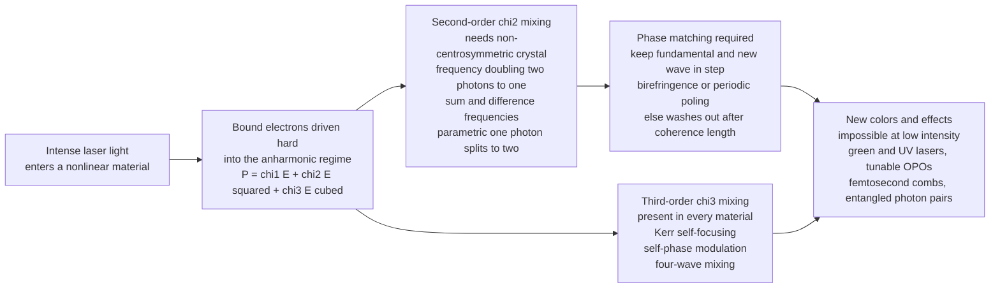

# 🔆 Nonlinear Optics

> [!abstract] TL;DR
> At everyday brightness a material's **polarization** responds **linearly** to light's electric field ($P = \varepsilon_0 \chi E$) — the basis of ordinary refraction, where beams pass through glass and through each other untouched. Crank the intensity up to **laser** levels and higher-order terms wake up: $P = \varepsilon_0(\chi^{(1)}E + \chi^{(2)}E^2 + \chi^{(3)}E^3 + \dots)$, and these nonlinear terms **mix frequencies**. Second-order $\chi^{(2)}$ processes (only in non-centrosymmetric crystals) give **second-harmonic generation** (two photons of $\omega$ fuse into one of $2\omega$ — the green laser pointer), sum/difference-frequency mixing, optical parametric amplification, and the electro-optic (Pockels) effect. Efficient conversion demands **phase matching** so the fundamental and generated waves stay in step. Third-order $\chi^{(3)}$ (in every material) gives the **Kerr effect** (self-focusing, self-phase modulation — the engine of femtosecond pulses and supercontinuum) and four-wave mixing. Impossible before the 1961 laser, nonlinear optics now creates colors no laser makes directly, the shortest events humans produce, and — through parametric down-conversion — the **entangled-photon** sources at the heart of quantum photonics.

## Intuition

**Analogy:** Shine two flashlights across a room and the beams cross without a flicker — light passes straight through light, and through a window, as if nothing were there. That is the ordinary, **linear** world: the glass's electrons wiggle gently in step with the light's field, re-radiating the same colors, which is all that refraction and lenses ever need.

Now imagine pushing on those electrons *enormously* harder — with the field of a focused **laser**. Push a swing gently and it tracks your hand faithfully; shove it violently and it starts responding in a distorted, non-proportional way, generating motion at *new rhythms* the original push never contained. Electrons driven this hard do the same: they radiate not only the original color but **new colors born from mixing**. Two red photons can fuse into one blue photon (frequency **doubling**), one photon can split into two, and two beams can bend each other's paths. The most familiar trick lives in your pocket: a "green laser pointer" is secretly an **infrared** laser whose invisible light is frequency-doubled into visible green by a tiny nonlinear crystal. This is **nonlinear optics** — the physics that was impossible until the laser gave us light intense enough to make matter mix light, and that today lets us build colors no laser emits, the fastest flashes we can create, and the machinery of quantum light.

---

## How It Works

### Core Mechanics

1. **Polarization is the material's response.** An electric field $E$ pulls a material's bound charges apart, creating a **polarization** $P$ (dipole moment per volume). *All* of optics — refractive index, dispersion, absorption — comes from how $P$ responds to $E$. In ordinary light the response is **linear**: $P = \varepsilon_0 \chi^{(1)} E$, so the re-radiated wave has exactly the input frequency and only the *amount* of light matters, never new colors.
2. **Strong fields expose the nonlinearity.** The restoring force on a bound electron is only spring-like (linear) for small displacements. A laser field can rival the atom's own internal field ($\sim 10^{10}\,\text{V/m}$), pushing electrons into the **anharmonic** part of their potential. We expand the response as a power series: $P = \varepsilon_0\left(\chi^{(1)}E + \chi^{(2)}E^2 + \chi^{(3)}E^3 + \dots\right)$. The coefficients $\chi^{(2)}, \chi^{(3)}$ are the **nonlinear susceptibilities**; they are tiny, so their terms only compete when $E$ is huge.
3. **A square-law term mixes frequencies.** Feed in $E = E_0\cos\omega t$. The $\chi^{(2)}E^2$ term becomes $\chi^{(2)}E_0^2\cos^2\omega t = \tfrac12\chi^{(2)}E_0^2\left(1 + \cos 2\omega t\right)$ — a **DC** part (optical rectification) plus a term oscillating at $2\omega$. That $2\omega$ polarization radiates a new wave at **twice the frequency**: second-harmonic generation. Two input frequencies $\omega_1, \omega_2$ likewise produce **sum** ($\omega_1+\omega_2$) and **difference** ($\omega_1-\omega_2$) frequencies. Photon energy is conserved: $\hbar\omega_1 + \hbar\omega_2 = \hbar\omega_3$.
4. **Symmetry gates $\chi^{(2)}$.** In a **centrosymmetric** medium (glass, gas, liquid), flipping $E \to -E$ must flip $P \to -P$, which forbids any even-power term — so $\chi^{(2)} = 0$. Second-order effects require **non-centrosymmetric crystals** (KDP, BBO, lithium niobate, KTP). Every material, symmetric or not, has a nonzero $\chi^{(3)}$.
5. **Phase matching decides whether it survives.** The generated wave is launched continuously along the crystal. It only builds up if it stays **in phase** with the driving polarization, i.e. the wavevector mismatch $\Delta k = k_{2\omega} - 2k_\omega \to 0$. Because dispersion normally makes $n(2\omega) \neq n(\omega)$, the two waves slip out of step after a **coherence length** $L_c = \pi/\Delta k$ and the conversion washes out. Engineers restore matching with **birefringence** (angle-tune a crystal so one polarization at $2\omega$ has the same index as the fundamental) or **quasi-phase-matching** (periodically flip the crystal's sign — *periodic poling* — to reset the phase every coherence length).
6. **Third-order effects reshape the beam itself.** The $\chi^{(3)}E^3$ term makes the refractive index depend on intensity, $n = n_0 + n_2 I$ (the **Kerr effect**). A bright beam then focuses itself (**self-focusing**), a short pulse phase-modulates itself and broadens its spectrum (**self-phase modulation** → supercontinuum), and beams exchange energy through **four-wave mixing** and **stimulated Raman/Brillouin** scattering.

### Flow / Architecture



---

## Key Concepts

### Secondary Level

**Why you need a laser.** Sunlight or a lamp is far too weak: its field nudges electrons only in the linear regime, so no new colors appear. A focused laser concentrates enough field to reach the nonlinear terms. This is exactly why nonlinear optics did not exist until **1961** — one year after the first laser — when Franken and colleagues focused a ruby laser into quartz and saw a faint spot of ultraviolet at **twice** the frequency: the first second-harmonic generation.

**The green laser pointer, decoded.** Inside the pen, a cheap infrared diode pumps a crystal that lases at **1064 nm** (invisible). That beam passes through a nonlinear crystal (KTP) that **doubles** its frequency to **532 nm** — bright green. The color you see is manufactured entirely by nonlinear optics; no green light existed inside the device. Frequency doubling is the standard way to reach green, blue, and ultraviolet where good lasers are scarce.

**Fusing and splitting photons.** Think in photons. Doubling = **two** low-energy (red/IR) photons combine into **one** higher-energy (green/blue) photon. The reverse, **parametric down-conversion**, splits **one** high-energy photon into **two** lower-energy ones — and those two are born as a **linked (entangled) pair**, the workhorse source for quantum experiments.

### Undergraduate Level

**The susceptibility expansion.** Writing the scalar response,
$$P = \varepsilon_0\left(\chi^{(1)}E + \chi^{(2)}E^2 + \chi^{(3)}E^3 + \dots\right),$$
each order encodes a family of processes. $\chi^{(2)}$ (units m/V) drives three-wave mixing: **SHG** ($\omega+\omega\to2\omega$), **sum-frequency** ($\omega_1+\omega_2\to\omega_3$), **difference-frequency** ($\omega_1-\omega_2$), **optical rectification** (the DC term), and **optical parametric amplification/oscillation**, where a strong pump amplifies a weak "signal" and creates an "idler," conserving energy $\omega_p=\omega_s+\omega_i$ — the basis of **tunable** light sources (OPOs). $\chi^{(3)}$ (units m²/V²) drives **third-harmonic generation**, the **Kerr** index $n=n_0+n_2I$, and **four-wave mixing**.

**Phase matching quantitatively.** For a crystal of length $L$, the second-harmonic intensity grows as
$$I_{2\omega} \propto \left(\chi^{(2)}\right)^2 L^2\,\operatorname{sinc}^2\!\left(\frac{\Delta k\, L}{2}\right),\qquad \Delta k = k_{2\omega} - 2k_\omega = \frac{4\pi}{\lambda}\left[n(2\omega)-n(\omega)\right].$$
When **phase-matched** ($\Delta k=0$) the sinc² equals 1 and power grows **quadratically** with length. When mismatched, power oscillates with period $2\pi/\Delta k$, peaking at the coherence length $L_c=\pi/\Delta k$ — typically only microns to tens of microns, which is why unmatched crystals convert almost nothing. **Birefringent phase matching** exploits a crystal's ordinary/extraordinary indices, angle-tuning so $n_e(2\omega)=n_o(\omega)$; see [[Polarization_and_Dispersion]] and [[Crystal_Optics_and_Birefringence]].

**The Pockels effect.** A special case of $\chi^{(2)}$: applying a DC voltage (one "field" at $\omega\!\approx\!0$) mixes with an optical field to change the refractive index **linearly** with voltage. This is how **electro-optic modulators** encode gigabits per second onto a laser for fiber telecom — a bias voltage rotates or phase-shifts the light in lithium niobate (see [[Optical_Modulators_and_Switches]]).

**The intensity-scaling signature.** Because the second-harmonic *field* is proportional to $E_0^2$, its *power* scales as $E_0^4$, i.e. as the **square of the input intensity**. Doubling the input power quadruples the green output — the experimental fingerprint that distinguishes true SHG from linear fluorescence.

### Graduate Level

**Coupled-wave equations and the parametric picture.** Under the slowly-varying-envelope approximation, the fundamental and harmonic amplitudes obey coupled equations $\frac{dA_{2\omega}}{dz}=i\kappa A_\omega^2 e^{-i\Delta k z}$ (and its complex conjugate for the pump). In the undepleted-pump limit these integrate to the sinc² law; with depletion they give the elegant result that SHG conversion follows $\tanh^2$ in the field, so 100% conversion is possible in principle. The same machinery, run "backward," describes **optical parametric amplification** — signal and idler grow exponentially from the pump — and its cavity version, the **OPO**, is the most broadly **tunable** coherent source in existence.

**Quasi-phase-matching (QPM).** Rather than making $\Delta k=0$, periodically **reverse the sign of $\chi^{(2)}$** with a poling period $\Lambda = 2L_c = 2\pi/\Delta k$. Each time the generated wave would start to back-convert, the flipped domain re-phases it, so power ratchets upward. **Periodically-poled lithium niobate (PPLN)** made high-efficiency green/IR conversion and low-power OPOs commercial, and lets you engineer the fastest-growing nonlinear coefficient ($d_{33}$) that birefringent matching cannot access.

**The Kerr effect as the ultrafast engine.** With $n=n_0+n_2I$, a pulse's peak experiences a different phase velocity than its wings, generating new frequencies (**self-phase modulation**) that, balanced against dispersion, form **solitons** and, driven hard in microstructured fiber, explode into a **supercontinuum** — a coherent rainbow spanning an octave. Spatially, self-focusing enables **Kerr-lens mode-locking**, the trick that made sub-100-fs Ti:sapphire lasers routine (see [[Ultrafast_and_Pulsed_Lasers]]). Stabilizing the octave-spanning comb yields the **optical frequency comb** — a "ruler for light" that won the 2005 Nobel Prize and underpins optical clocks and precision spectroscopy.

**Down-conversion and quantum photonics.** Spontaneous parametric down-conversion (SPDC) in a $\chi^{(2)}$ crystal splits pump photons into **signal–idler pairs** that are energy- and momentum-correlated and, with the right geometry, polarization-**entangled** (see [[Entanglement_and_Bell_States]]). SPDC is the standard heralded single-photon and entangled-pair source for Bell tests, quantum key distribution, and **photonic quantum computing** ([[Photonic_Quantum_Computing]], [[Quantum_Photonics_and_Photonic_Computing]]). Nonlinear optics is thus the bridge from classical laser engineering to quantum information.

---

## Python Demo

```python
# Nonlinear optics: how a square-law (chi2) response generates new frequencies,
# and why efficient conversion needs PHASE MATCHING.
#
#   (a) SECOND-HARMONIC GENERATION by spectral analysis:
#       model P = eps0*(chi1*E + chi2*E^2 + chi3*E^3) for a strong sinusoidal
#       field E0*cos(2*pi*f0*t). The FFT of P shows a DC term + fundamental f0
#       + SECOND HARMONIC 2*f0 (+ a small third harmonic from chi3) that were
#       NOT present in the input spectrum of E (single line at f0).
#   (b) PHASE MATCHING: SHG power vs crystal length, phase-matched (L^2 growth)
#       vs mismatched (oscillates, capped at one coherence length); and the
#       sinc^2 phase-mismatch acceptance curve.
#   (c) INTENSITY SCALING: SHG power grows as the SQUARE of input intensity.
#
# numpy + matplotlib only (self-contained, no scipy).

import numpy as np
import matplotlib.pyplot as plt

# ---------------------------------------------------------------
# (a) Spectrum of the nonlinear polarization -> harmonic generation
# ---------------------------------------------------------------
N  = 4096
t  = np.linspace(0.0, 1.0, N, endpoint=False)   # 1 s window (normalized units)
f0 = 40.0                                        # fundamental lands exactly on an FFT bin
E0 = 1.0

chi1, chi2, chi3 = 1.0, 0.30, 0.08               # susceptibilities (demo units)

E = E0 * np.cos(2 * np.pi * f0 * t)              # strong input field
P = chi1 * E + chi2 * E**2 + chi3 * E**3         # nonlinear polarization (drop eps0 scale)

freq   = np.fft.rfftfreq(N, d=(t[1] - t[0]))     # frequency axis
spec_E = np.abs(np.fft.rfft(E)) / N              # input spectrum (single line at f0)
spec_P = np.abs(np.fft.rfft(P)) / N              # output spectrum (DC + f0 + 2f0 + 3f0)
order  = freq / f0                               # x-axis in units of harmonic order

# ---------------------------------------------------------------
# (b) Phase matching: SHG intensity vs crystal length and vs mismatch
# ---------------------------------------------------------------
def sinc2(x):                                    # (sin x / x)^2, safe at x = 0
    return np.sinc(x / np.pi)**2

L   = np.linspace(0, 20, 500)                    # crystal length (coherence lengths)
dk0 = 0.0                                         # phase-matched
dk1 = np.pi / 2.0                                 # a fixed mismatch (Lc = pi/dk1 = 2 units)

def shg_vs_length(dk):
    return (L**2) * sinc2(dk * L / 2.0)          # I_2w proportional to L^2 * sinc^2(dk L/2)

I_matched  = shg_vs_length(dk0)
I_mismatch = shg_vs_length(dk1)
Lc = np.pi / dk1                                  # coherence length for the mismatched case

x  = np.linspace(-3 * np.pi, 3 * np.pi, 800)      # acceptance curve: efficiency vs dk*L/2
accept = sinc2(x)

# ---------------------------------------------------------------
# (c) Intensity scaling: SHG power ~ (input intensity)^2
# ---------------------------------------------------------------
E_amp   = np.linspace(0.05, 1.0, 60)              # input field amplitude
I_in    = E_amp**2                                # input intensity ~ E0^2
# second-harmonic field amplitude ~ chi2 * E0^2  ->  power ~ (chi2 E0^2)^2 ~ I_in^2
P_2w    = (chi2 * E_amp**2)**2

# ---------------------------------------------------------------
# Plot: 2 x 2 grid
# ---------------------------------------------------------------
fig, ax = plt.subplots(2, 2, figsize=(14, 9))

# Panel (0,0): input vs output spectrum
ax[0, 0].stem(order, spec_E, linefmt="C0-", markerfmt="C0o", basefmt=" ",
              label="input field E: only fundamental")
ax[0, 0].stem(order, spec_P, linefmt="C3-", markerfmt="C3s", basefmt=" ",
              label="nonlinear P: DC + f0 + 2f0 + 3f0")
ax[0, 0].set_xlim(-0.3, 3.6)
ax[0, 0].set_xlabel("frequency in units of f0 (harmonic order)")
ax[0, 0].set_ylabel("spectral amplitude")
ax[0, 0].set_title("(a) chi2 E^2 births a 2nd harmonic + DC (chi3 adds 3rd)")
ax[0, 0].legend(fontsize=8)
for k, lab in [(0, "DC"), (1, "f0"), (2, "2 f0"), (3, "3 f0")]:
    ax[0, 0].annotate(lab, (k, spec_P[np.argmin(np.abs(order - k))]),
                      textcoords="offset points", xytext=(4, 6), fontsize=8)

# Panel (0,1): SHG power vs crystal length
ax[0, 1].plot(L, I_matched, lw=2, color="C2",
              label="phase-matched (dk = 0): grows as L^2")
ax[0, 1].plot(L, I_mismatch, lw=2, color="C1",
              label="mismatched: oscillates, capped")
ax[0, 1].axvline(Lc, ls="--", color="gray", lw=1)
ax[0, 1].annotate("coherence length Lc", (Lc, 0.5), rotation=90,
                  va="bottom", ha="right", fontsize=8, color="gray")
ax[0, 1].set_xlabel("crystal length (coherence lengths)")
ax[0, 1].set_ylabel("second-harmonic intensity (a.u.)")
ax[0, 1].set_title("(b) Phase matching lets SHG accumulate over the crystal")
ax[0, 1].legend(fontsize=8)

# Panel (1,0): sinc^2 phase-mismatch acceptance curve
ax[1, 0].plot(x / np.pi, accept, lw=2, color="C4")
ax[1, 0].axvline(0, ls=":", color="gray", lw=1)
ax[1, 0].set_xlabel("phase mismatch  dk*L/2  (units of pi)")
ax[1, 0].set_ylabel("relative SHG efficiency")
ax[1, 0].set_title("(b') sinc^2 acceptance: efficiency collapses off phase match")

# Panel (1,1): quadratic intensity scaling (log-log -> slope 2)
ax[1, 1].loglog(I_in, P_2w, "o-", color="C3", ms=4, label="SHG power vs input intensity")
ref = P_2w[0] * (I_in / I_in[0])**2               # slope-2 reference
ax[1, 1].loglog(I_in, ref, "k--", lw=1, label="slope = 2 reference")
ax[1, 1].set_xlabel("input intensity  I_in ~ E0^2")
ax[1, 1].set_ylabel("second-harmonic power")
ax[1, 1].set_title("(c) SHG power ~ (input intensity)^2")
ax[1, 1].legend(fontsize=8)

plt.tight_layout()
plt.savefig("nonlinear_optics.png", dpi=120)
print("Saved nonlinear_optics.png")

# Numeric sanity checks
bin2 = np.argmin(np.abs(order - 2.0))
bin1 = np.argmin(np.abs(order - 1.0))
print(f"2nd-harmonic amplitude in P : {spec_P[bin2]:.4f}  (fundamental {spec_P[bin1]:.4f})")
print(f"input spectrum at 2 f0      : {spec_E[bin2]:.2e}  (should be ~0)")
slope = np.polyfit(np.log(I_in), np.log(P_2w), 1)[0]
print(f"log-log slope of SHG vs I_in: {slope:.3f}  (theory = 2)")
```

Running it prints a near-zero input amplitude at $2f_0$ but a clear second-harmonic line in the nonlinear polarization, confirms the log-log SHG-versus-intensity slope is 2, and plots four panels: the input-versus-output spectra (new harmonics appearing), SHG power accumulating as $L^2$ only when phase-matched, the sinc² acceptance curve, and the quadratic intensity scaling.

---

## Real-World Applications

- **Green, blue, and UV lasers (frequency doubling/tripling).** Green laser pointers, DPSS show lasers, and 355 nm UV micromachining lasers are IR lasers frequency-converted in KTP, LBO, or BBO. Doubling and tripling reach wavelengths where no efficient direct laser exists — essential for laser projectors, bioimaging, and semiconductor inspection.
- **Tunable light and quantum sources (OPO / SPDC).** Optical parametric oscillators deliver continuously tunable coherent light from the visible to the mid-IR for spectroscopy. The same $\chi^{(2)}$ crystals, run as **spontaneous parametric down-converters**, are the standard **entangled-photon** and heralded single-photon sources for quantum key distribution, Bell tests, and photonic quantum computing.
- **Electro-optic modulators for telecom.** Lithium-niobate Pockels-effect modulators impress data at 100+ Gb/s onto laser carriers in fiber-optic networks — the nonlinear component that puts the internet's traffic onto light.
- **Ultrafast lasers, supercontinuum, and frequency combs.** The Kerr effect enables Kerr-lens mode-locking (femtosecond Ti:sapphire), self-phase modulation broadens pulses into octave-spanning **supercontinuum** ("white-light lasers"), and stabilizing that comb gives the Nobel-winning **optical frequency comb** behind optical atomic clocks, LIDAR, and precision metrology.
- **Nonlinear microscopy and materials probing.** Two-photon and second-harmonic-generation microscopy image live tissue with deep penetration and intrinsic optical sectioning; SHG is a label-free contrast for collagen and other non-centrosymmetric biological structures. Stimulated Raman and CARS microscopy add chemical specificity.

---

## Common Pitfalls

- **Expecting nonlinearity at low intensity.** $\chi^{(2)}, \chi^{(3)}$ terms are minuscule; without focused laser fields (often MW–GW/cm²) nothing happens. Trying to double a flashlight or a weak LED is hopeless — the effect scales with intensity, and you need the intensity.
- **Ignoring phase matching.** A perfect nonlinear crystal at the wrong angle/temperature converts almost nothing: mismatched light back-converts every coherence length. Efficient SHG requires birefringent angle/temperature tuning or quasi-phase-matched periodic poling, not just a "nonlinear crystal."
- **Forgetting the centrosymmetry rule.** People try to get SHG from glass fiber, water, or gases — all centrosymmetric, so bulk $\chi^{(2)}=0$. Second-order effects need non-centrosymmetric crystals (or surfaces/interfaces, where symmetry is broken). $\chi^{(3)}$ effects, by contrast, occur everywhere.
- **Confusing the scaling laws.** SHG power scales as input intensity **squared**; sum-frequency as the **product** of the two input intensities; three-photon/third-harmonic even more steeply. Misreading the slope leads to wrong conclusions about which process you are seeing (a slope-1 signal is linear fluorescence, not SHG).
- **Overdriving into damage or unwanted nonlinearity.** Pushing intensity to boost conversion invites self-focusing, filamentation, and optical damage. Real designs balance conversion efficiency against damage threshold and against competing Kerr/self-phase-modulation effects.

---

## Related Concepts

Glob-verified cross-vault wikilinks:

- [[Laser_Physics]] — nonlinear optics is impossible without the intense coherent fields that stimulated emission provides; the 1961 SHG demo came one year after the laser
- [[Wave_Optics_and_Interference]] — phase matching is fundamentally an interference/coherence condition, requiring the fundamental and generated waves to add constructively over the crystal
- [[Polarization_and_Dispersion]] — birefringent phase matching exploits polarization-dependent indices, and dispersion is precisely what causes the phase mismatch that must be overcome
- [[Interference_and_Diffraction]] — the coherent build-up of the harmonic wave is coherent superposition; the sinc² acceptance is the same math as a diffraction envelope
- [[Wave_Motion_and_Properties]] — the coupled-wave picture builds on wave superposition, phase velocity, and wavevectors
- [[Electromagnetic_Waves_and_Radiation]] — the driven nonlinear polarization is an oscillating dipole source that radiates the new-frequency EM wave
- [[Optical_Properties_and_Photonic_Materials]] — the crystals (lithium niobate, KTP, BBO) and their engineered nonlinear coefficients are materials-science objects
- [[Dielectrics_Piezoelectrics_and_Ferroelectrics]] — non-centrosymmetric ferroelectrics (lithium niobate) host both the Pockels effect and the strongest $\chi^{(2)}$; poling reverses their domains for quasi-phase-matching
- [[Quantum_Optics_and_Cavity_QED]] — parametric down-conversion generates the squeezed and entangled light studied in quantum optics
- [[Photonic_Quantum_Computing]] — SPDC in $\chi^{(2)}$ crystals is a standard entangled- and single-photon source for photonic qubits
- [[Entanglement_and_Bell_States]] — polarization-entangled photon pairs from down-conversion are the experimental realization of Bell states

Within this Optics and Photonics vault, this note connects in prose to its sibling topics: Crystal_Optics_and_Birefringence (the birefringence that enables phase matching), Laser_Physics_and_Stimulated_Emission (the source of the intense light), Ultrafast_and_Pulsed_Lasers (Kerr-lens mode-locking and supercontinuum), Optical_Modulators_and_Switches (the electro-optic Pockels effect), and Quantum_Photonics_and_Photonic_Computing (down-conversion as an entangled-photon source).

---

## Review Questions

1. **Secondary:** A green (532 nm) laser pointer is built around an infrared laser. What is the wavelength of that hidden infrared light, and what physical process in the crystal converts it to green? Why can this trick only work with a *laser*, not a flashlight?
2. **Undergraduate:** A nonlinear crystal is oriented for phase-matched SHG. (a) If you double the input laser power, by what factor does the green output change, and why? (b) You now tilt the crystal slightly so $\Delta k \neq 0$. Explain, using the sinc² relation, why the output collapses, and define the coherence length in terms of $\Delta k$.
3. **Graduate:** Compare **birefringent phase matching** and **quasi-phase-matching (periodic poling)** for second-harmonic generation in lithium niobate. Why does QPM let you use the larger $d_{33}$ coefficient, and how does the poling period relate to the coherence length? Then explain how the *same* $\chi^{(2)}$ crystal, operated as a spontaneous parametric down-converter, becomes a source of polarization-entangled photon pairs.

---

## Sources

- Boyd, R. W. — *Nonlinear Optics*, 4th ed. (Academic Press) — the standard graduate text; susceptibility formalism, coupled-wave equations, phase matching
- Saleh, B. E. A. & Teich, M. C. — *Fundamentals of Photonics*, 3rd ed. (Wiley), Ch. 21 (nonlinear optics)
- Shen, Y. R. — *The Principles of Nonlinear Optics* (Wiley) — rigorous treatment of nonlinear susceptibilities and processes
- New, G. — *Introduction to Nonlinear Optics* (Cambridge University Press) — accessible undergraduate-to-graduate introduction

---

#optics #nonlinear-optics #second-harmonic #phase-matching #kerr-effect
