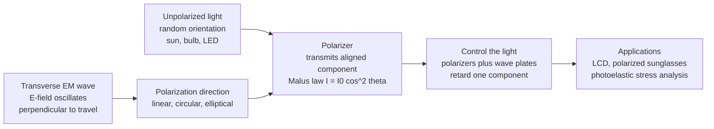

# 🕶️ Polarization of Light

> [!abstract] TL;DR
> Light is a **transverse** electromagnetic wave whose electric field oscillates perpendicular to its direction of travel — and the *orientation* of that oscillation is its **polarization** (linear, circular, or elliptical). A **polarizer** transmits only the field component along its axis, so linearly polarized light hitting a polarizer at angle $\theta$ emerges with intensity $I = I_0\cos^2\theta$ (**Malus's law**), reaching total extinction at $90°$. By generating and rotating polarization with polarizers, Brewster-angle reflection, birefringent crystals, and **wave plates**, we get a controllable, information-rich property of light that powers polarized sunglasses, every LCD screen, photoelastic stress analysis, 3D cinema, fiber telecom, and photon qubits.

---

## Intuition

**Analogy — the picket fence.** A light wave *wiggles* — but in which direction? Its electric field oscillates side to side, perpendicular to where the beam is going, and that wiggle direction is its polarization. Ordinary light from the sun or a bulb wiggles in every direction at once (**unpolarized**). A **polarizer** is like a picket fence with vertical slots: it only lets through the wiggles aligned with its slots and blocks the rest. Stack two fences at right angles and *nothing* gets through — the first passes only vertical wiggles, the second demands horizontal, and no wiggle can satisfy both.

That invisible orientation, once you learn to control it, becomes a powerful on/off switch. Polarized sunglasses kill the horizontally-polarized glare bouncing off water and roads; every LCD pixel is a tiny polarization switch turning light on and off; photographers rotate a filter to darken a blue sky. Light carries a hidden handle, and this note is about grabbing it.

---

## How It Works

### Core mechanics

1. **A transverse wave.** Maxwell's equations force the electric field $\vec{E}$ of a light wave to point perpendicular to the propagation direction $\hat{k}$. There are two independent transverse directions — call them $x$ and $y$ — so any polarization is a superposition $\vec{E} = E_x\hat{x} + E_y\hat{y}$.
2. **The state is set by amplitude ratio and phase.** If $E_x$ and $E_y$ oscillate *in phase*, the tip of $\vec{E}$ traces a straight line → **linear** polarization. If they are equal in amplitude and $90°$ out of phase, the tip traces a circle → **circular**. Any other combination traces an **ellipse** → **elliptical** (the general case).
3. **Unpolarized light** is a rapid, random scramble of these states — the field orientation changes faster than any detector can follow (thermal sources: the Sun, incandescent bulbs, LEDs).
4. **A polarizer projects.** It transmits only the field component along its transmission axis, discarding the perpendicular part. Projecting an amplitude scales it by $\cos\theta$; intensity goes as amplitude squared, giving **Malus's law** $I = I_0\cos^2\theta$.
5. **Generation and control.** Polarization can be *created* from unpolarized light by absorption (dichroic/Polaroid film, wire-grid), by **reflection at Brewster's angle**, or by scattering (the blue sky). It is *transformed* by **birefringent** crystals and **wave plates** that retard one component relative to the other, converting linear ↔ circular ↔ rotated-linear.

### Flow / architecture



---

## Key Concepts

### Secondary Level

**What polarization is.** Light is a transverse wave; its electric field points sideways relative to travel. The *direction* of that sideways oscillation is the polarization. **Unpolarized** light (sunlight, a bulb) has no fixed direction; **polarized** light has one.

**Polarizers and Malus's law.** A polarizer only passes the component of the field along its axis. If linearly polarized light of intensity $I_0$ meets a polarizer whose axis makes angle $\theta$ with the polarization:

$$I = I_0\cos^2\theta$$

- $\theta = 0°$ → full transmission ($I_0$)
- $\theta = 45°$ → half ($I_0/2$)
- $\theta = 90°$ → **extinction** (zero) — this is **crossed polarizers**

**Unpolarized in, half out.** Unpolarized light through *any* single polarizer loses exactly half its intensity ($I_0 \to I_0/2$) and comes out linearly polarized along the axis.

**Everyday examples.** Polarized sunglasses are vertical polarizers that block the horizontally-polarized glare off roads and water. Rotating a polarizing filter on a camera darkens the sky. Twist a second pair of polarized sunglasses in front of the first and the view goes black at $90°$.

### Undergraduate Level

**The three polarization states.** Writing $E_x = A_x\cos(\omega t)$ and $E_y = A_y\cos(\omega t - \delta)$:

| State | Condition | E-field tip traces |
|-------|-----------|--------------------|
| Linear | $\delta = 0$ or $\pi$ | a line |
| Circular | $A_x = A_y$, $\delta = \pm\pi/2$ | a circle (left/right handed) |
| Elliptical | general $A_x, A_y, \delta$ | an ellipse |

**Polarization by reflection — Brewster's angle.** When unpolarized light reflects off a dielectric at $\theta_B = \arctan(n_2/n_1)$, the reflected beam is **completely** polarized perpendicular to the plane of incidence (s-polarized). Glare off horizontal surfaces is therefore mostly horizontal — which is exactly what vertically-oriented polarized sunglasses reject.

**Polarization by scattering.** Rayleigh scattering polarizes light: the blue sky at $90°$ from the Sun is strongly polarized, which is why a polarizing camera filter can deepen a blue sky and cut haze.

**Birefringence.** In an anisotropic crystal (calcite, quartz) the refractive index depends on polarization direction: the **ordinary** ray sees $n_o$, the **extraordinary** ray sees $n_e$. The two travel at different speeds and accumulate a phase difference — the basis of wave plates and the double-image of calcite.

**Wave plates (retarders).** A birefringent plate of thickness $d$ imposes a retardation $\Gamma = \dfrac{2\pi d (n_e - n_o)}{\lambda}$ between components:

| Plate | Retardation | Effect |
|-------|-------------|--------|
| Quarter-wave (QWP) | $\Gamma = \pi/2$ | linear at $45°$ ↔ circular |
| Half-wave (HWP) | $\Gamma = \pi$ | rotates linear polarization by $2\alpha$ (fast axis at $\alpha$) |
| Full-wave | $\Gamma = 2\pi$ | no net change |

**Optical activity.** Chiral media (sugar solutions, quartz) rotate the plane of linear polarization by $\beta = \alpha_s\, l$ (specific rotation $\times$ path length). Polarimetry uses this to measure sugar concentration — the historical link between polarization and chirality.

### Graduate Level

**Jones calculus** (fully polarized, coherent light). The state is a complex 2-vector and each element is a $2\times2$ matrix:

$$\vec{J} = \begin{pmatrix} A_x e^{i\phi_x} \\ A_y e^{i\phi_y}\end{pmatrix}, \qquad
\text{H} = \begin{pmatrix}1&0\\0&0\end{pmatrix},\;
\text{QWP} = \begin{pmatrix}1&0\\0&i\end{pmatrix},\;
\text{HWP} = \begin{pmatrix}1&0\\0&-1\end{pmatrix}$$

with rotation $R(\theta)=\begin{pmatrix}\cos\theta&-\sin\theta\\\sin\theta&\cos\theta\end{pmatrix}$. A cascade multiplies right-to-left: $\vec{J}_{out} = M_N \cdots M_2 M_1\,\vec{J}_{in}$.

**Stokes parameters and the Poincaré sphere** (handles *partial* polarization, which Jones cannot). Measure four intensities:

$$S_0 = I_{tot},\quad S_1 = I_x - I_y,\quad S_2 = I_{45} - I_{135},\quad S_3 = I_R - I_L$$

The **degree of polarization** is $\text{DOP} = \sqrt{S_1^2+S_2^2+S_3^2}/S_0 \in [0,1]$. Normalized $(S_1,S_2,S_3)$ map onto the **Poincaré sphere**: poles are circular states, the equator is linear, and every optical element is a rotation of the sphere. Depolarizing and incoherent elements use the $4\times4$ **Mueller matrix** $\vec{S}_{out} = M\,\vec{S}_{in}$, which — unlike Jones — is directly measurable with intensity detectors.

**Photon polarization as a qubit.** A single photon's two polarization basis states $|H\rangle, |V\rangle$ form a perfect two-level system; wave plates implement arbitrary single-qubit rotations, and polarizing beam splitters implement measurement. This underlies BB84 quantum key distribution and photonic quantum computing — the Jones/Poincaré formalism is literally the Bloch sphere in disguise.

---

## Python Demo

```python
# Polarization control, visualized:
#  (a) Malus's law + the three-polarizer paradox (crossed pair passes light
#      once a third polarizer is inserted between them)
#  (b) Linear / circular / elliptical states, and a quarter-wave plate
#      turning linear light into circular by retarding one component.
import numpy as np
import matplotlib.pyplot as plt

# ------------------------------------------------------------------
# (a) MALUS'S LAW and the three-polarizer paradox
# ------------------------------------------------------------------
theta = np.linspace(0, np.pi, 400)          # analyzer angle (rad)
I_malus = np.cos(theta)**2                   # I / I0 for incident linear light

# Crossed polarizers P1(0 deg) and P2(90 deg) alone -> zero output.
# Insert a THIRD polarizer at angle phi between them:
#   unpolarized -> P1(0): I0/2, polarized along 0
#   -> Pmid(phi): (I0/2) cos^2(phi)
#   -> P2(90):    (I0/2) cos^2(phi) cos^2(90-phi) = (I0/8) sin^2(2 phi)
phi = np.linspace(0, np.pi/2, 400)
I_three = 0.125 * np.sin(2 * phi)**2         # I / I0 through all three

# ------------------------------------------------------------------
# (b) POLARIZATION STATES and a QUARTER-WAVE PLATE
# ------------------------------------------------------------------
wt = np.linspace(0, 2 * np.pi, 400)          # one optical cycle

def efield(Ax, Ay, delta):
    """E-field tip traced over one cycle; delta = phase lag of Ey behind Ex."""
    return Ax * np.cos(wt), Ay * np.cos(wt - delta)

Ex_lin, Ey_lin = efield(1.0, 1.0, 0.0)        # linear at 45 deg
Ex_cir, Ey_cir = efield(1.0, 1.0, np.pi / 2)  # circular
Ex_ell, Ey_ell = efield(1.0, 0.6, np.pi / 4)  # elliptical

# Quarter-wave plate: fast axis along x retards Ey by 90 deg.
# Feed it linear light at 45 deg -> output becomes circular.
Ex_in,  Ey_in  = efield(1.0, 1.0, 0.0)        # input:  linear 45 deg
Ex_out, Ey_out = efield(1.0, 1.0, np.pi / 2)  # output: circular after QWP

# ------------------------------------------------------------------
# Plot
# ------------------------------------------------------------------
fig, ax = plt.subplots(2, 2, figsize=(11, 9))

ax[0, 0].plot(np.degrees(theta), I_malus, lw=2, color="tab:blue")
ax[0, 0].axvline(90, ls="--", color="crimson", alpha=0.7)
ax[0, 0].set_title("Malus's Law:  I = I0 cos^2(theta)")
ax[0, 0].set_xlabel("Analyzer angle theta (deg)")
ax[0, 0].set_ylabel("Transmitted  I / I0")
ax[0, 0].annotate("extinction\nat 90 deg", xy=(90, 0), xytext=(58, 0.35),
                  arrowprops=dict(arrowstyle="->"))
ax[0, 0].grid(alpha=0.3)

ax[0, 1].plot(np.degrees(phi), I_three, lw=2, color="tab:green")
ax[0, 1].axhline(0, ls="--", color="grey", alpha=0.7)
ax[0, 1].set_title("Three-polarizer paradox\ncrossed pair passes light with a 3rd inserted")
ax[0, 1].set_xlabel("Middle polarizer angle phi (deg)")
ax[0, 1].set_ylabel("Transmitted  I / I0")
ax[0, 1].annotate("peak I0/8\nat 45 deg", xy=(45, 0.125), xytext=(50, 0.075),
                  arrowprops=dict(arrowstyle="->"))
ax[0, 1].grid(alpha=0.3)

ax[1, 0].plot(Ex_lin, Ey_lin, lw=2, label="linear (delta = 0)")
ax[1, 0].plot(Ex_cir, Ey_cir, lw=2, label="circular (delta = 90)")
ax[1, 0].plot(Ex_ell, Ey_ell, lw=2, label="elliptical (delta = 45)")
ax[1, 0].set_title("Polarization states: E-field trajectory")
ax[1, 0].set_xlabel("Ex"); ax[1, 0].set_ylabel("Ey")
ax[1, 0].set_aspect("equal"); ax[1, 0].legend(fontsize=8); ax[1, 0].grid(alpha=0.3)

ax[1, 1].plot(Ex_in, Ey_in, lw=2, label="input: linear 45 deg")
ax[1, 1].plot(Ex_out, Ey_out, lw=2, ls="--", label="output: circular")
ax[1, 1].set_title("Quarter-wave plate\nretards Ey by 90 deg: linear -> circular")
ax[1, 1].set_xlabel("Ex"); ax[1, 1].set_ylabel("Ey")
ax[1, 1].set_aspect("equal"); ax[1, 1].legend(fontsize=8); ax[1, 1].grid(alpha=0.3)

plt.tight_layout()
plt.show()

# Numeric sanity check of Malus's law at a few angles
for deg in (0, 30, 45, 60, 90):
    print(f"theta = {deg:3d} deg  ->  I/I0 = {np.cos(np.radians(deg))**2:.3f}")
```

The Malus curve dips to zero at $90°$; the three-polarizer panel peaks at $I_0/8$ when the inserted polarizer sits at $45°$ — light appears out of a "black" crossed pair, because each polarizer *re-projects* the field onto a new axis rather than merely filtering. Panels (c) and (d) show the field tracing a line, circle, and ellipse, and a quarter-wave plate converting a $45°$ line into a circle.

---

## Real-World Applications

> **LCD/LED displays.** Every liquid-crystal pixel sits between **crossed polarizers**. With no voltage, the twisted liquid crystal rotates the light's polarization by $90°$ so it passes the second polarizer (bright); apply a voltage and the twist relaxes, the polarization is no longer rotated, and the pixel goes dark. The liquid crystal is a *voltage-tunable wave plate* — polarization is the physical on/off switch behind billions of screens.

> **Polarized sunglasses & camera filters.** Vertical polarizers block the horizontally-polarized glare that Brewster-angle reflection produces off roads, water, and snow. A rotatable polarizer on a camera does the same for reflections and deepens the scattered-polarized blue sky.

> **Photoelastic stress analysis.** Mechanical stress makes transparent plastics **birefringent**. Viewed between crossed polarizers, stress concentrations light up as colored fringe patterns — engineers use this to find stress hotspots in models of bridges, gears, and dental crowns before building them.

> **3D cinema, telecom, and quantum.** RealD 3D encodes left/right eye images in opposite **circular** polarizations. Fiber telecom exploits polarization-division multiplexing (two data streams on orthogonal polarizations) while fighting polarization-mode dispersion. And a single photon's polarization is a **qubit** for BB84 quantum key distribution.

---

## Common Pitfalls

- **"A polarizer just blocks light" — it *projects*.** The three-polarizer paradox trips people up: inserting a third polarizer between crossed ones *increases* transmission from zero to $I_0/8$. Each polarizer re-establishes a new field component along its own axis; the next one measures relative to *that*, not the original.
- **QWP orientation matters.** A quarter-wave plate converts linear to circular **only** when the incident linear polarization is at $45°$ to the plate's fast axis. At $0°$ or $90°$ it does nothing to a linear state. Getting circular light requires aligning the input correctly.
- **Malus's law needs *polarized* input.** $I = I_0\cos^2\theta$ applies to *linearly polarized* incident light. Unpolarized light through a single polarizer always gives $I_0/2$ regardless of angle — the $\cos^2$ only appears once the light is already polarized.
- **Jones vs Stokes/Mueller.** Jones calculus assumes fully polarized, coherent light and cannot represent partial polarization or depolarization. For thermal/partially-polarized light or depolarizing elements, you must use Stokes parameters and Mueller matrices.
- **Confusing "polarization" of light with material polarization.** In optics, polarization = orientation of the light's $\vec{E}$ field. In dielectrics, "polarization" $\vec{P}$ means induced dipole density. Same word, different quantity — context disambiguates.
- **Sign/handedness conventions.** Right- vs left-circular and the sign of Stokes $S_3$ differ between the physics ("from the receiver's view") and optics/engineering conventions. Always state which you use before comparing results.

---

## Related Concepts

Within this **Polarization & Optical Materials** section, polarization is the foundation for the sibling notes on the *Optics_and_Photonics_Overview* (where it sits among light's core properties), *Crystal_Optics_and_Birefringence* (which explains the anisotropic crystals that make wave plates and photoelastic effects work), *Dispersion_and_Optical_Properties_of_Materials* (the frequency-dependent partner property), *Reflection_Refraction_and_Fermats_Principle* (Brewster's angle and polarization-by-reflection), and *Quantum_Optics_and_Photons* (where photon polarization becomes a qubit).

Cross-vault, verified notes:

- [[Polarization_and_Dispersion]] — the Physics/Waves treatment of the same topic, with Jones calculus, Sellmeier dispersion, and Kramers-Kronig at the graduate level
- [[Electromagnetic_Waves_and_Radiation]] — why light is transverse in the first place; polarization is a property of the EM wave's field
- [[Maxwells_Equations]] — the source equations that force $\vec{E}\perp\hat{k}$ and permit two transverse polarization degrees of freedom
- [[Optical_Properties_and_Photonic_Materials]] — how real materials (dichroic films, birefringent crystals, liquid crystals) implement polarizers and retarders
- [[Photonics_and_Optoelectronics]] — engineering use of polarization in optical isolators, modulators, and fiber links

---

## Review Questions

1. **Secondary.** Vertically polarized light of intensity $I_0$ passes through a polarizer at $30°$ from vertical, then a second polarizer at $90°$ from vertical (horizontal). What fraction of $I_0$ emerges? Why would the answer be zero if the middle polarizer were removed?
2. **Undergraduate.** Explain physically why the reflected light at Brewster's angle is completely polarized, and derive $\theta_B = \arctan(n_2/n_1)$ from the condition that the reflected and refracted rays are perpendicular. How does this justify the orientation of polarized sunglasses?
3. **Graduate.** A beam is described by Stokes vector $(1, 0.6, 0, 0.4)^T$. Compute its degree of polarization, locate it on the Poincaré sphere, and state which single wave plate (specify type and fast-axis angle) would move it to a purely linear state on the equator. Why can Jones calculus not represent this beam if $\text{DOP} < 1$?

---

## Sources

- Hecht, E. — *Optics*, 5th ed., Ch. 8 (Polarization)
- Born, M. & Wolf, E. — *Principles of Optics*, 7th ed., Ch. 1 & 15
- Goldstein, D. H. — *Polarized Light*, 3rd ed.
- Saleh, B. E. A. & Teich, M. C. — *Fundamentals of Photonics*, 3rd ed., Ch. 6

---

#optics #polarization #malus-law #polarizer #wave-plate
