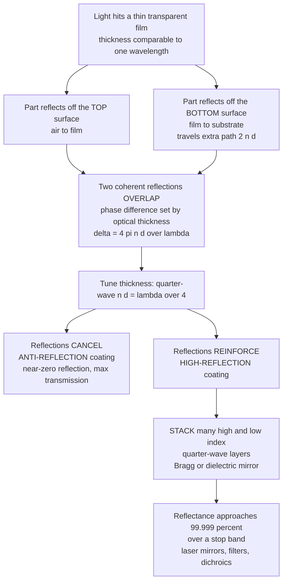

# 🪞 Thin Films and Optical Coatings

> [!abstract] TL;DR
> The shimmering colors on a soap bubble come from a film thinner than a wavelength of light — and engineers have turned that accident of physics into precision technology. When light hits a thin transparent film, part reflects off the top surface and part off the bottom, and these two reflections **interfere**. Tune the film's optical thickness to a **quarter-wave** ($n_f d = \lambda/4$) and the two reflections can be made to **cancel** — an **anti-reflection (AR)** coating that lets nearly all the light through (why quality lenses look purple-tinted). Stack alternating high- and low-index quarter-wave layers and every reflection adds **in phase** — a **dielectric (Bragg) mirror** reflecting 99.999% of one exact color with zero absorption, far exceeding any metal. The same interference, sharpened, builds bandpass and dichroic **filters**. Thin-film coatings sit on nearly every optical surface on Earth, controlling light not with the shape of glass but with layers a few atoms thick.

## Intuition

**Analogy:** Look at a soap bubble in sunlight, or an oil slick on wet asphalt. The swirling rainbow you see is not pigment — the soapy water is colorless. It is **interference**: light bounces off the *top* of the film and off the *bottom* of the film, and because the bottom reflection travels a tiny bit farther (twice the film thickness), the two waves arrive slightly out of step. For some colors they line up crest-on-crest and reflect brightly; for others they line up crest-on-trough and cancel. The film sorts white light into colors, and the exact color tells you the thickness.

Now imagine you could set that thickness *on purpose*. Make it just right and the two reflections cancel for the color you care about — almost **no light reflects**, so almost all of it passes through. That is an **anti-reflection coating**, the reason a good camera lens looks faintly purple and your glasses cut glare. Or stack dozens of alternating layers so that *every* reflection reinforces the others — you get a **mirror that reflects 99.999%** of one exact wavelength while letting everything else pass, the ultra-precise mirrors inside every laser. Same physics as the soap bubble, engineered to the atom.

---

## How It Works

### Core Mechanics

1. **Two reflections from one film.** A transparent film of index $n_f$ and thickness $d$ sits on a substrate of index $n_s$, surrounded by air ($n_0 = 1$). Incoming light partly reflects at the **top** interface (air→film) and partly at the **bottom** interface (film→substrate). These are two coherent beams born from the same wave.
2. **Thickness sets the path difference.** The bottom reflection travels an extra distance $2 n_f d$ inside the film (near normal incidence), giving a phase difference $\delta = \dfrac{2\pi}{\lambda}\,(2 n_f d) = \dfrac{4\pi n_f d}{\lambda}$. So the film thickness and index directly control whether the two reflections add or cancel — this is engineered [[Interference_and_Diffraction|thin-film interference]].
3. **Cancel → anti-reflection.** Choose the **quarter-wave** condition, optical thickness $n_f d = \lambda_0/4$. At $\lambda_0$ the round trip is a half-wave, the two reflections are exactly out of phase, and they cancel. Reflection drops toward zero; transmission rises. Bare glass reflects about 4% per surface — AR coatings cut this to a fraction of a percent.
4. **The magic index.** Perfect cancellation needs the two reflection *amplitudes* equal, which requires $n_f = \sqrt{n_s}$. For glass ($n_s \approx 1.52$) the ideal is $n_f \approx 1.23$; the durable real-world choice, magnesium fluoride ($n_f = 1.38$), gets close and still slashes reflection by roughly a factor of three.
5. **Reinforce → high reflection.** Now alternate **high-index** and **low-index** quarter-wave layers. At each interface a reflection is launched, and the quarter-wave spacing plus the reflection phase flips arrange all of them to arrive **in phase**. They add coherently, and the total reflectance climbs toward 100% across a band of wavelengths — a **Bragg mirror** / **distributed Bragg reflector (DBR)**.
6. **More layers, better mirror.** Each added high/low pair multiplies the reflected amplitude by the index-contrast ratio $(n_H/n_L)^2$, so reflectance approaches 99.99%+ with a couple dozen layers — and because dielectrics do not absorb, the light that is not reflected is *transmitted*, not lost as heat (unlike a metal mirror).
7. **Sharpen it → filters.** By stacking spacer and mirror layers you build interference **filters**: bandpass, long/short-pass edge, dichroic beamsplitters, notch, and Fabry–Perot cavities that pass one narrow line and reject the rest.

### Flow / Architecture



---

## Key Concepts

### Secondary Level

**Why bare glass loses light — the 4% problem.** At any air–glass surface, the Fresnel reflectance at normal incidence is $R = \left(\dfrac{n_s - 1}{n_s + 1}\right)^2 \approx \left(\dfrac{0.52}{2.52}\right)^2 \approx 4\%$. A camera lens with a dozen elements has two dozen surfaces; uncoated, that is a huge cumulative loss plus internal ghost reflections that wash out contrast. AR coatings exist because that 4% per surface is unacceptable in real instruments.

**The quarter-wave anti-reflection coating.** Deposit a single layer whose *optical* thickness is a quarter of the design wavelength, $n_f d = \lambda_0/4$. The reflection off the bottom of the film comes back exactly a half-wave behind the reflection off the top, so they cancel. Pick $\lambda_0$ in the green (≈550 nm, the eye's peak sensitivity), and reflection is killed there while red and blue leak a little — which is exactly why coated lenses and glasses show a faint **purple/magenta** residual tint.

**The dielectric mirror beats metal.** A polished aluminum mirror reflects ~90%, silver ~95–98%, and both *absorb* the rest as heat. A stack of alternating clear layers (no metal, no absorption) can reflect **99.99%+** of a chosen color — better than any metal, and it does not burn up under an intense laser because the missing light is transmitted, not soaked up. This is why laser cavities and precision instruments use dielectric coatings, not metal.

### Undergraduate Level

**Single-layer AR, quantitatively.** For a film between air ($n_0$) and substrate ($n_s$), the amplitude reflection combines the two interface coefficients:

$$r = \frac{r_{01} + r_{12}\,e^{-i2\beta}}{1 + r_{01} r_{12}\,e^{-i2\beta}}, \quad r_{01} = \frac{n_0 - n_f}{n_0 + n_f},\ \ r_{12} = \frac{n_f - n_s}{n_f + n_s},\ \ \beta = \frac{2\pi n_f d}{\lambda}.$$

At the quarter-wave point $e^{-i2\beta} = -1$, so $r = \dfrac{r_{01} - r_{12}}{1 - r_{01}r_{12}}$, which vanishes exactly when $r_{01} = r_{12}$, i.e. $n_f = \sqrt{n_0 n_s} = \sqrt{n_s}$. Real coatings compromise: MgF₂ ($n = 1.38$) on crown glass leaves a residual $R \approx 1.3\%$ (down from 4.3%), and **broadband** or **V-coat** performance needs two, three, or more layers to flatten the dip across the visible.

**The quarter-wave high-reflector stack.** Alternate high index $n_H$ and low index $n_L$, each a quarter-wave. At the center wavelength, each quarter-wave layer transforms the running admittance $Y \to n^2/Y$, so each $HL$ pair multiplies the equivalent admittance by $(n_H/n_L)^2$. After $N$ pairs the mirror's admittance is enormously mismatched from air, giving peak reflectance

$$R_{\max} = \left(\frac{n_0 - Y_N}{n_0 + Y_N}\right)^2, \qquad Y_N \propto \left(\frac{n_H}{n_L}\right)^{2N}.$$

Bigger index contrast and more pairs → higher, sharper reflectance. The high-reflectance **stop band** has fractional width set by the contrast:

$$\frac{\Delta\lambda_0}{\lambda_0} = \frac{4}{\pi}\arcsin\!\left(\frac{n_H - n_L}{n_H + n_L}\right),$$

so a TiO₂/SiO₂ stack ($2.35/1.46$) reflects strongly over roughly a 30% wide band around $\lambda_0$.

**Interference filters.** A **Fabry–Perot filter** sandwiches a half-wave *spacer* (cavity) between two dielectric mirrors — only wavelengths resonant in the cavity transmit, giving a narrow passband (down to <1 nm). Stacking modified quarter-wave blocks yields **edge filters** (long-pass / short-pass), **dichroic** beamsplitters that reflect one band and transmit another, and **notch** filters that reject a single laser line — the everyday tools of fluorescence microscopy, spectroscopy, and WDM telecom.

### Graduate Level

**The transfer-matrix (characteristic-matrix) method.** The industrial workhorse for arbitrary stacks. Each layer $j$ (index $n_j$, thickness $d_j$) at wavelength $\lambda$ and normal incidence has phase thickness $\delta_j = 2\pi n_j d_j/\lambda$ and admittance $\eta_j = n_j$, with characteristic matrix

$$M_j = \begin{bmatrix} \cos\delta_j & \dfrac{i}{\eta_j}\sin\delta_j \\[4pt] i\,\eta_j \sin\delta_j & \cos\delta_j \end{bmatrix}.$$

Multiply the layer matrices in order, $M = M_1 M_2 \cdots M_N$, apply the substrate admittance to get $\begin{bmatrix}B\\C\end{bmatrix} = M\begin{bmatrix}1\\ \eta_s\end{bmatrix}$, and read off

$$r = \frac{\eta_0 B - C}{\eta_0 B + C}, \qquad R = |r|^2, \qquad T = \frac{4\,\eta_0\,\mathrm{Re}(\eta_s)}{|\eta_0 B + C|^2}.$$

This single recursion computes AR coatings, HR stacks, and complex filters at any wavelength and angle (extend $\eta_j$ to the oblique s- and p-admittances), and is the kernel inside every coating-design optimizer.

**Design and fabrication reality.** Coatings are grown by **thermal/e-beam evaporation**, **ion-assisted deposition**, or **magnetron sputtering** (denser, more stable films) — see [[Nanofabrication_and_Self_Assembly]]. Real designs juggle **thickness-monitoring errors**, **absorption/scatter** in the films, **laser-induced damage threshold** (LIDT), **thermal drift**, and **environmental durability**. Angle and polarization shift the stop band (the "blue shift" of interference filters at oblique incidence), which must be engineered around. Modern optimizers use needle/gradient synthesis to place dozens of non-quarter-wave layers.

**Nature got there first — structural color.** Butterfly wings (*Morpho*), jewel-beetle elytra, peacock feathers, and opals produce brilliant, non-fading color from multilayer or photonic-crystal interference rather than pigment — biological Bragg stacks. This connects thin films to the broader physics of periodic dielectric media and [[Optical_Properties_and_Photonic_Materials|photonic band gaps]]: a 1D quarter-wave stack *is* a one-dimensional photonic crystal whose stop band is a photonic band gap.

---

## Python Demo

```python
# Thin-film optical coatings via the transfer-matrix (characteristic-matrix) method.
#   (a) SINGLE-LAYER ANTI-REFLECTION: reflectance vs wavelength for a quarter-wave AR
#       coating on glass -- ideal n_f = sqrt(n_s) drives the dip to ~0 at the design
#       wavelength; real MgF2 gets close. Compared against bare glass (~4.3%).
#   (b) MULTILAYER BRAGG / DIELECTRIC MIRROR: reflectance vs wavelength for an
#       alternating high/low-index quarter-wave stack, showing the high-reflectance
#       "stop band" deepening toward 99.99%+ as the number of layer pairs grows.
# numpy + matplotlib only (self-contained; no scipy).

import numpy as np
import matplotlib.pyplot as plt

# ---------------------------------------------------------------
# Transfer-matrix reflectance at normal incidence.
#   Each layer: delta = 2*pi*n*d/lambda ; eta = n (normal incidence).
#   M_j = [[cos d, (i/eta) sin d], [i*eta sin d, cos d]]  ; M = prod(M_j)
#   [B, C]^T = M @ [1, n_s]^T ;  r = (n0*B - C)/(n0*B + C) ; R = |r|^2
# ---------------------------------------------------------------
def stack_reflectance(wl, n_layers, d_layers, n0, ns):
    """Reflectance vs wavelength array wl for a stack (incident side first)."""
    R = np.empty_like(wl, dtype=float)
    for i, lam in enumerate(wl):
        M = np.eye(2, dtype=complex)
        for n, d in zip(n_layers, d_layers):
            delta = 2.0 * np.pi * n * d / lam
            eta = n
            m = np.array([[np.cos(delta),        1j * np.sin(delta) / eta],
                          [1j * eta * np.sin(delta), np.cos(delta)]], dtype=complex)
            M = M @ m
        B, C = M @ np.array([1.0, ns], dtype=complex)
        r = (n0 * B - C) / (n0 * B + C)
        R[i] = np.abs(r) ** 2
    return R

wl = np.linspace(400e-9, 750e-9, 1400)   # visible band
lam0 = 550e-9                            # design wavelength (green)
n0, ns = 1.0, 1.52                       # air and crown glass

# ---- (a) Single-layer AR coatings (quarter-wave: n*d = lam0/4) ----
n_ideal = np.sqrt(ns)                    # ideal index ~1.233 -> perfect null
n_mgf2  = 1.38                           # real magnesium fluoride
R_bare  = np.full_like(wl, ((ns - 1) / (ns + 1)) ** 2)          # uncoated glass
R_ideal = stack_reflectance(wl, [n_ideal], [lam0 / (4 * n_ideal)], n0, ns)
R_mgf2  = stack_reflectance(wl, [n_mgf2],  [lam0 / (4 * n_mgf2)],  n0, ns)

# ---- (b) Bragg / dielectric mirror: alternating H,L quarter-wave pairs ----
nH, nL = 2.35, 1.46                      # TiO2 (high) and SiO2 (low)
dH, dL = lam0 / (4 * nH), lam0 / (4 * nL)
pair_counts = [3, 7, 15]                 # more pairs -> deeper, flatter stop band
bragg = {}
for N in pair_counts:
    n_layers = [nH, nL] * N
    d_layers = [dH, dL] * N
    bragg[N] = stack_reflectance(wl, n_layers, d_layers, n0, ns)

# ---------------------------------------------------------------
# Plot
# ---------------------------------------------------------------
fig, ax = plt.subplots(1, 2, figsize=(14, 5))

# Panel (a): AR coatings
ax[0].plot(wl * 1e9, R_bare * 100, "k--", lw=1.5,
           label=f"bare glass ~ {R_bare[0]*100:.1f}%")
ax[0].plot(wl * 1e9, R_mgf2 * 100, color="#1f77b4", lw=2.0,
           label=f"MgF2 n=1.38 (min {R_mgf2.min()*100:.2f}%)")
ax[0].plot(wl * 1e9, R_ideal * 100, color="#d62728", lw=2.0,
           label=f"ideal n=sqrt(ns)={n_ideal:.2f} (min {R_ideal.min()*100:.2f}%)")
ax[0].axvline(lam0 * 1e9, color="gray", ls=":", lw=1)
ax[0].set_title("(a) Single-layer anti-reflection coating\nquarter-wave, design 550 nm")
ax[0].set_xlabel("wavelength (nm)"); ax[0].set_ylabel("reflectance (%)")
ax[0].set_ylim(0, 5); ax[0].legend(fontsize=9); ax[0].grid(alpha=0.3)

# Panel (b): Bragg mirror
for N in pair_counts:
    peak = bragg[N].max()
    ax[1].plot(wl * 1e9, bragg[N] * 100, lw=2.0,
               label=f"{N} pairs  (peak {peak*100:.3f}%)")
ax[1].axvline(lam0 * 1e9, color="gray", ls=":", lw=1)
ax[1].set_title("(b) Dielectric / Bragg mirror stop band\nTiO2 + SiO2 quarter-wave stack")
ax[1].set_xlabel("wavelength (nm)"); ax[1].set_ylabel("reflectance (%)")
ax[1].set_ylim(0, 101); ax[1].legend(fontsize=9); ax[1].grid(alpha=0.3)

plt.tight_layout()
plt.savefig("thin_films_coatings.png", dpi=120)
print("Saved thin_films_coatings.png")

# Numeric sanity checks
print(f"Bare glass reflectance      : {R_bare[0]*100:.2f}%")
print(f"MgF2 AR minimum             : {R_mgf2.min()*100:.2f}%")
print(f"Ideal quarter-wave AR min   : {R_ideal.min()*100:.4f}%")
for N in pair_counts:
    print(f"Bragg mirror {N:2d} pairs peak : {bragg[N].max()*100:.4f}%")
```

Running it confirms the story numerically: bare glass sits flat at ~4.3%, the MgF₂ coating dips to ~1.3% at 550 nm, and the ideal $\sqrt{n_s}$ film drives the null essentially to zero. The Bragg-mirror panel shows the stop band centered on 550 nm climbing from ~86% at 3 pairs to ~99.1% at 7 pairs to ~99.9998% at 15 pairs — the reflectance deepening and its top flattening as layers are added, exactly the trend that makes laser-grade mirrors possible.

---

## Real-World Applications

> **Camera lenses and eyeglasses (AR coatings).** Every modern multi-element lens carries multilayer AR coatings; without them a 10-element zoom would lose a third of its light and drown in ghost reflections. The faint purple/green sheen you see is the residual reflection outside the design wavelength. Anti-glare eyeglasses use the same quarter-wave physics.

> **Laser mirrors and cavities (dielectric HR).** The mirrors that define a laser resonator are dielectric Bragg stacks reflecting 99.9%+ at the lasing wavelength — impossible with metal, which would absorb and melt. Distributed Bragg reflectors are grown epitaxially inside VCSELs (vertical-cavity surface-emitting lasers) as the top and bottom mirrors.

> **LIGO's ultra-low-loss mirrors.** Gravitational-wave detection needs test-mass mirrors reflecting ~99.999% with parts-per-million absorption and scatter. These are ion-beam-sputtered tantala/silica ($\text{Ta}_2\text{O}_5/\text{SiO}_2$) quarter-wave stacks — arguably the most perfect mirrors ever made, and their residual thermal (Brownian) coating noise is a leading limit on detector sensitivity.

> **Solar cells (AR coatings).** Bare silicon reflects ~35% of sunlight. A single quarter-wave silicon-nitride ($\text{SiN}_x$, $n \approx 2.0$) layer cuts that to a few percent, and every recovered percent of light is recovered efficiency — see [[Renewable_Energy_Integration]]. The blue color of solar panels is the residual reflection of this AR layer.

> **Spectroscopy, microscopy, and telecom filters.** Thin-film bandpass, edge, dichroic, and notch filters select excitation/emission bands in fluorescence microscopy, isolate spectral lines in spectrometers, and slice the 1550 nm band into dozens of DWDM channels for fiber telecom. Interference filters are why a fluorescence microscope can see a dim glow against a bright excitation laser.

---

## Common Pitfalls

- **Forgetting the reflection phase flip.** Reflection off a *denser* medium adds a $\pi$ phase shift; ignoring it inverts every bright/dark condition and mispredicts whether a film is AR or HR. It is also why a vanishingly thin film ($d \to 0$) looks **black** in reflection, not bright.
- **Confusing optical thickness with physical thickness.** The quarter-wave condition is on the *optical* path $n_f d = \lambda_0/4$, not the physical $d$. A quarter-wave MgF₂ layer at 550 nm is ~100 nm thick, not 137 nm; using $\lambda/4$ directly forgets the index.
- **Expecting the ideal AR index to be available.** Perfect cancellation needs $n_f = \sqrt{n_s} \approx 1.23$ for glass, but no durable coating material has that index (MgF₂ at 1.38 is the practical floor). Single-layer AR therefore never truly reaches zero — broadband nulls require multilayer designs.
- **Assuming a coating works at every wavelength and angle.** A quarter-wave design is exact only at $\lambda_0$ and normal incidence. Tilt the part and the whole stop band **blue-shifts** and splits for s- vs p-polarization; this angle sensitivity is a feature for dichroics but a bug for wide-field lenses.
- **Ignoring absorption, scatter, and damage.** Ideal-dielectric math predicts 100% reflection or transmission, but real films have ppm-level absorption/scatter that set the true performance ceiling — and a high-power laser will destroy a coating above its laser-induced damage threshold no matter how clean the design.
- **Adding intensities instead of amplitudes.** Like all interference, thin-film response comes from summing complex *amplitudes* (the transfer matrix does this) and squaring at the end. Summing layer reflectances independently erases the interference that makes coatings work.

---

## Related Concepts

Glob-verified cross-vault wikilinks:

- [[Interference_and_Diffraction]] — the Physics-vault foundation; thin-film coatings are two-beam (single film) and multi-beam (stack) interference engineered on purpose
- [[Optical_Properties_and_Photonic_Materials]] — supplies the complex refractive index that sets each layer's reflection, and frames a quarter-wave stack as a 1D photonic crystal with a photonic band gap
- [[Nanofabrication_and_Self_Assembly]] — the deposition and patterning methods (evaporation, sputtering, ALD) that grow durable nanometer-thick coating layers
- [[Renewable_Energy_Integration]] — solar cells rely on quarter-wave AR coatings to cut silicon's ~35% reflection loss and boost light capture

Within this Optics and Photonics vault, this note is the applied payoff of wave interference. It builds directly on the sibling note Wave_Optics_and_Interference (the soap-film and quarter-wave physics introduced there), connects to Dispersion_and_Optical_Properties_of_Materials (the wavelength dependence of each layer's index that limits broadband coatings), extends into Metamaterials_and_Photonic_Crystals (a 1D quarter-wave stack generalized to 2D/3D periodic media), enables Laser_Resonators_and_Gaussian_Beams (whose cavity mirrors are dielectric HR coatings), and provides the bandpass/dichroic/notch filters used throughout Spectroscopy_and_Optical_Analysis.

---

## Review Questions

1. **Secondary:** A single-layer AR coating is designed for green light (550 nm). Explain in plain terms why a coated camera lens still shows a faint purple/magenta reflection, and why the reflection is weakest at green. What everyday consequence does this have for eyeglasses?
2. **Undergraduate:** You need an AR coating on a glass substrate ($n_s = 1.52$) that nulls reflection at 500 nm. (a) What film index would give exactly zero reflection, and (b) what physical thickness of that ideal film is required? (c) If you instead use MgF₂ ($n = 1.38$), estimate the residual reflectance at 500 nm and explain why it is not zero.
3. **Graduate:** A dielectric mirror uses alternating quarter-wave TiO₂ ($n_H = 2.35$) and SiO₂ ($n_L = 1.46$) layers on glass. (a) Estimate the fractional width $\Delta\lambda_0/\lambda_0$ of the high-reflectance stop band. (b) Using the admittance argument, explain how many $HL$ pairs are needed to exceed 99.99% peak reflectance, and (c) why the same coating cannot maintain that reflectance if the beam hits it at 45° instead of normal incidence.

---

## Sources

- [H. A. Macleod, *Thin-Film Optical Filters*, 5th ed., CRC Press (2017) — the definitive engineering reference; transfer-matrix design of AR, HR, and filter coatings](https://www.routledge.com/Thin-Film-Optical-Filters/Macleod/p/book/9781138198241)
- [E. Hecht, *Optics*, 5th ed., Pearson (2017) — Ch. 9, thin-film interference, AR coatings, and multilayer stacks](https://www.pearson.com/en-us/subject-catalog/p/optics/P200000006793)
- [M. Born & E. Wolf, *Principles of Optics*, 7th ed., Cambridge University Press (1999) — Ch. 1 and Ch. 7, characteristic-matrix theory of stratified media](https://www.cambridge.org/core/books/principles-of-optics/D12868B8AE26B83D6D3C2193E94FFC32)
- [B. E. A. Saleh & M. C. Teich, *Fundamentals of Photonics*, 3rd ed., Wiley (2019) — thin films, Bragg gratings, dielectric mirrors, and interference filters](https://www.wiley.com/en-us/Fundamentals+of+Photonics%2C+3rd+Edition-p-9781119506874)

---

#optics #thin-films #anti-reflection #dielectric-mirror #optical-coatings
