# 🔦 Laser Physics and Stimulated Emission

> [!abstract] TL;DR
> A **laser** (Light Amplification by Stimulated Emission of Radiation) turns disordered energy into a torrent of light waves marching in perfect lockstep — one **color**, one **direction**, one **phase**. The engine is **stimulated emission** (Einstein, 1917): a passing photon triggers an excited atom to emit an *identical* clone photon, so one becomes two, two become four — an optical avalanche. Because ground-state atoms normally *absorb* instead, you must first **pump** energy in to force a **population inversion** (more atoms excited than in the ground state), then wrap the amplifying **gain medium** in an **optical cavity** that feeds light back through again and again. Above a sharp **threshold** — where round-trip gain exceeds loss — the device "turns on," and gain saturates to clamp itself exactly to the loss. The result is light that is **coherent, monochromatic, directional, and brilliant** — the property set behind fiber telecom, LIDAR, LASIK, laser cutting, barcode readers, and quantum technology.

---

## Intuition

**Analogy — a random crowd versus a marching band.** Ordinary light from the Sun or a bulb is a chaotic mob: each atom shouts out a light wave at a random *time*, in a random *direction*, at a random *color*, all hopelessly out of step. That is **spontaneous emission** — incoherent noise. A **laser** is the opposite: a torrent of light waves all marching in lockstep — same color, same direction, same phase, like a marching band where every drum strikes on the identical beat.

What forces the crowd into a band is **stimulated emission**, Einstein's 1917 insight: when a passing light wave sweeps by an already-excited atom, it can trigger that atom to emit a *perfect clone* wave — same frequency, same direction, same phase. So one photon becomes two, two become four, an avalanche of identical photons. But there is a catch. Normally most atoms sit in their ground state and *absorb* light rather than amplify it, so the avalanche dies. To win, you must first **pump** energy in to flip the majority of atoms into the excited state — a **population inversion**, an unnatural, non-equilibrium condition — and then let a pair of mirrors feed the light back through the excited atoms again and again until the avalanche dominates. That is the whole trick: **L**ight **A**mplification by **S**timulated **E**mission of **R**adiation.

---

## How It Works

### Core Mechanics

1. **Three light–matter processes (Einstein).** Between two atomic energy levels, light interacts in exactly three ways. **Absorption:** a photon is swallowed, lifting an atom from the lower to the upper level. **Spontaneous emission:** an excited atom decays on its own at a random time into a random direction — this is ordinary, incoherent light. **Stimulated emission:** a passing photon induces an excited atom to emit a second photon that is a *clone* of the first — identical frequency, phase, and direction. Only stimulated emission builds coherence.
2. **The obstacle: absorption usually wins.** The stimulated-emission and absorption rates are equal per atom, so which process dominates depends purely on populations. In thermal equilibrium the **Boltzmann distribution** guarantees the lower level is always more populated ($N_2/N_1 = e^{-h\nu/k_BT} < 1$), so a beam is net *absorbed*, not amplified.
3. **Population inversion — the unnatural state.** To make the medium *amplify*, you need **more atoms in the upper level than the lower** ($N_2 > N_1$). This inversion cannot exist at any positive temperature; it must be forced by **pumping** (optical, electrical, or chemical energy) using a **3- or 4-level** atomic scheme so the upper level fills faster than it empties.
4. **Gain and the avalanche.** An inverted medium has positive **gain**: a beam grows exponentially as it propagates, $I(z) = I_0\,e^{g z}$, because every clone photon can clone again. A non-inverted medium has negative gain — plain Beer–Lambert absorption.
5. **The three ingredients of a laser.** (1) a **gain medium** (atoms, ions, molecules, or a semiconductor providing stimulated-emission gain), (2) a **pump** to create and sustain the inversion, and (3) an **optical resonator / cavity** — two mirrors that feed the light back through the gain medium for *regenerative* amplification.
6. **Threshold and saturation.** Lasing starts only when round-trip **gain exceeds loss** (mirror transmission, scattering, absorption) — a razor-sharp **threshold**. Above it, the growing intracavity intensity drives **gain saturation** that clamps the gain to exactly equal the loss; extra pump power then flows out as beam power rather than raising the gain.
7. **The payoff.** The surviving field is a single self-consistent wave: **coherent** (temporally and spatially in phase), **monochromatic** (narrow linewidth), **directional** (a tight, near-diffraction-limited beam), and enormously **bright**.

### Flow / Architecture

```mermaid
graph LR
    P["Pump energy in<br/>optical, electrical, chemical"]
    G["Gain medium<br/>atoms, ions, semiconductor"]
    I["Population inversion<br/>more atoms excited than ground<br/>non-equilibrium"]
    S["Stimulated emission<br/>one photon clones into two<br/>same phase, frequency, direction"]
    C["Optical cavity<br/>mirrors feed light back<br/>through the gain medium"]
    T["Lasing threshold<br/>round-trip gain exceeds loss<br/>then gain saturates to loss"]
    B["Coherent laser beam out<br/>monochromatic, directional, in phase"]

    P --> G
    G --> I
    I --> S
    S --> C
    C --> T
    T -->|"above threshold"| B
    C -->|"regenerative feedback"| S
```



---

## Key Concepts

### Secondary Level

**The three things light can do to an atom.** Picture an atom with a low rung and a high rung. **Absorption:** a photon knocks it up. **Spontaneous emission:** it falls back on its own, spitting out a photon in a random direction at a random time — this is how bulbs and the Sun glow. **Stimulated emission:** a passing photon *triggers* the fall and gets an exact twin photon out — same color, same direction, same phase. Lasers live entirely on this third process.

**Why a laser needs a "trick."** Left alone, most atoms are on the low rung and simply *absorb* light. To amplify, you must first **pump** in energy to push most atoms up onto the high rung — a **population inversion**. Then two mirrors bounce the light back and forth through the pumped atoms so the twin-making avalanche can build. Turn the pump up past the **threshold** and the laser suddenly "switches on."

**What makes laser light special (four properties):**
- **Coherence** — all the waves are in step (this is *the* defining feature).
- **Monochromaticity** — essentially a single pure color / very narrow linewidth.
- **Directionality** — a pencil-thin beam that barely spreads, even over long distances.
- **Brightness** — enormous intensity packed into that tiny beam.

**Everyday lasers.** Red barcode scanners and laser pointers (~650 nm), the invisible diode in laser printers and DVD/Blu-ray drives, the 1550 nm pulses carrying the internet through optical fiber, surgical and LASIK lasers, LIDAR on self-driving cars, and construction laser levels.

### Undergraduate Level

**Einstein's rate picture (1917).** For two levels with populations $N_1, N_2$ in a radiation field of spectral energy density $\rho(\nu)$:

| Process | Rate | Effect |
|---------|------|--------|
| Absorption | $B_{12}\,\rho(\nu)\,N_1$ | removes photons |
| Stimulated emission | $B_{21}\,\rho(\nu)\,N_2$ | adds *coherent* photons |
| Spontaneous emission | $A_{21}\,N_2$ | adds *incoherent* photons |

Requiring this two-level model to reproduce Planck's blackbody law at equilibrium forces the famous relations

$$B_{12} = B_{21}, \qquad \frac{A_{21}}{B_{21}} = \frac{8\pi h\nu^3}{c^3}.$$

The equality $B_{12}=B_{21}$ is the crux: absorption and stimulated emission are equally likely *per atom*, so amplification hinges entirely on which level is more populated. The $\nu^3$ scaling of $A_{21}/B_{21}$ explains why spontaneous emission dominates at optical frequencies — hence a laser needs a *cavity* to build up the stimulated rate.

**Population inversion is non-equilibrium.** Boltzmann gives $N_2/N_1 = e^{-h\nu/k_BT} < 1$ for every finite positive temperature — the upper level is *always* the minority. Inversion ($N_2 > N_1$) corresponds formally to a *negative temperature* and can only be maintained by pumping:
- **Two-level system — impossible.** Since $B_{12}=B_{21}$, pumping a two-level system can at best equalize the populations; you can never invert it.
- **Three-level laser** (ruby, Maiman 1960): the ground state *is* the lower laser level, so you must pump more than half the atoms up — high threshold.
- **Four-level laser** (Nd:YAG, HeNe): the lower laser level sits above the ground state and empties rapidly, so even weak pumping creates inversion — low threshold, the workhorse design.

**Gain and Beer–Lambert with a sign flip.** The intensity through the medium obeys $I(z) = I_0\,e^{g z}$, where the **gain coefficient** $g = (N_2 - N_1)\,\sigma(\nu)$ and $\sigma$ is the stimulated-emission cross-section. Inversion makes $g>0$ (exponential *growth*); a normal medium has $g<0$ (exponential *decay* — ordinary absorption). Amplification is quite literally absorption run in reverse.

**The threshold condition.** In a cavity of length $\ell$ with mirror reflectivities $R_1, R_2$, a round trip multiplies the field intensity by $R_1 R_2\,e^{2 g \ell}$. Lasing requires this to reach unity:

$$g_{\text{th}} = \frac{1}{2\ell}\ln\!\frac{1}{R_1 R_2} + \alpha_{\text{loss}}.$$

Below threshold the output is weak amplified spontaneous emission; above threshold it climbs steeply — a hallmark "kink" in the light-vs-pump curve.

**Coherence quantified.** A narrow emission linewidth $\Delta\nu$ implies a long **coherence time** $\tau_c \sim 1/\Delta\nu$ and **coherence length** $L_c = c\,\tau_c$ — the distance over which the beam stays in step with itself (meters to kilometers for good lasers, versus microns for a bulb).

### Graduate Level

**Rate equations and gain clamping.** For upper-level population (inversion) $N$ and intracavity photon number $\phi$ in a four-level laser:

$$\frac{dN}{dt} = R_p - \frac{N}{\tau} - B N\phi, \qquad \frac{d\phi}{dt} = B N\phi - \frac{\phi}{\tau_c} + \text{(spont. seed)}.$$

In steady state above threshold, the second equation pins $N = N_{\text{th}} = 1/(B\tau_c)$: the inversion **clamps** at its threshold value no matter how hard you pump, and all additional pump power $R_p - R_{p,\text{th}}$ converts into output photons. This *gain clamping / gain saturation* — $g = g_0 / (1 + I/I_{\text{sat}})$ — is why a laser's inversion (and small-signal gain) stops rising the instant it turns on.

**Line broadening and its consequences.** **Homogeneous** broadening (lifetime, collisions) means every atom shares one Lorentzian response — a saturating beam suppresses gain uniformly and a single mode can grab all the energy. **Inhomogeneous** broadening (Doppler in gases, site disorder in glasses) lets different atoms serve different frequencies, enabling **spatial hole burning** and multimode operation. The gain *bandwidth* sets the shortest possible mode-locked pulse; it is **not** the laser's emission linewidth.

**The Schawlow–Townes limit.** Even a perfect laser has a residual linewidth from unavoidable spontaneous emission into the lasing mode, $\Delta\nu_{ST} \propto (\Delta\nu_c)^2/P_{\text{out}}$ (cavity linewidth squared over output power). Real lasers reach sub-Hz linewidths — the basis of optical clocks and gravitational-wave interferometry.

**Brightness (radiance) is the true figure of merit.** Radiance $B = P/(A\,\Omega)$ cannot be increased by any passive optic (conservation of étendue). A laser wins not by raw power but by squeezing power into a near-diffraction-limited solid angle ($M^2 \to 1$ for a pure $\text{TEM}_{00}$ Gaussian mode) and a narrow bandwidth — that is what lets a modest-wattage beam cut steel or reach the Moon.

**Historical arc.** Einstein's 1917 stimulated-emission paper → the **maser** (Townes, Gordon, Zeiger 1954, microwave) → Schawlow & Townes' optical-maser proposal (1958) → **Maiman's ruby laser** (1960), the first working optical laser → semiconductor diode lasers (1962) that now dominate by unit count.

---

## Python Demo

```python
# Laser fundamentals, visualized with numpy + matplotlib:
#   (a) POPULATION INVERSION & THRESHOLD  -- steady-state laser rate equations:
#         output power vs pump shows the sharp turn-on at threshold, and the
#         inversion CLAMPING (pinning gain to loss) once lasing begins.
#   (b) STIMULATED EMISSION as GAIN  -- I(z) = I0 * exp(g*z): inverted medium
#         amplifies exponentially, ordinary medium absorbs (Beer-Lambert).
#   (c) COHERENCE / MONOCHROMATICITY  -- narrow laser line vs a broad thermal
#         source spectrum.
import numpy as np
import matplotlib.pyplot as plt

# ------------------------------------------------------------------
# (a) THRESHOLD from steady-state laser rate equations (dimensionless).
#     Normalized inversion n in (0,1), photon number p, pump r, with a
#     small spontaneous-emission fraction beta smoothing the turn-on:
#         photons:     p = beta * n / (1 - n)
#         population:  r = n + beta * n**2 / (1 - n)
#     As n -> 1 the inversion clamps and p grows ~ linearly with r.
# ------------------------------------------------------------------
beta = 1e-3
n = np.linspace(1e-4, 0.9995, 4000)          # normalized inversion (< 1)
p = beta * n / (1.0 - n)                      # normalized output photon number
r = n + beta * n**2 / (1.0 - n)               # normalized pump rate (threshold ~ r=1)

# Idealized beta -> 0 limit: sharp piecewise turn-on for comparison.
r_ideal = np.linspace(0, r.max(), 400)
p_ideal = np.clip(r_ideal - 1.0, 0, None)
n_ideal = np.where(r_ideal < 1.0, r_ideal, 1.0)

# ------------------------------------------------------------------
# (b) STIMULATED EMISSION -> EXPONENTIAL GAIN vs ABSORPTION
# ------------------------------------------------------------------
z = np.linspace(0, 4.0, 200)                  # distance through medium (a.u.)
gains = {"inverted g=+1.0 (amplify)": 1.0,
         "inverted g=+0.5 (amplify)": 0.5,
         "normal   g=-1.0 (absorb)":  -1.0}

# ------------------------------------------------------------------
# (c) COHERENCE: laser line vs thermal source (normalized spectra)
# ------------------------------------------------------------------
detuning = np.linspace(-10, 10, 4000)         # frequency offset (a.u.)
def lorentz(x, w): return 1.0 / (1.0 + (2*x/w)**2)
laser_line   = lorentz(detuning, 0.05)        # very narrow -> monochromatic
thermal_line = np.exp(-(detuning/4.0)**2)     # broad thermal emission

# ------------------------------------------------------------------
# Plot
# ------------------------------------------------------------------
fig, ax = plt.subplots(2, 2, figsize=(11, 9))

# (a1) output power vs pump -> the laser threshold "kink"
ax[0, 0].plot(r, p, lw=2, color="tab:red", label="rate-eq (beta=1e-3)")
ax[0, 0].plot(r_ideal, p_ideal, "--", color="grey", label="ideal (beta->0)")
ax[0, 0].axvline(1.0, ls=":", color="k", alpha=0.6)
ax[0, 0].set_xlim(0, r.max()); ax[0, 0].set_ylim(0, p_ideal.max())
ax[0, 0].set_title("Laser threshold: output vs pump")
ax[0, 0].set_xlabel("pump rate  r  (r=1 is threshold)")
ax[0, 0].set_ylabel("output photon number  p")
ax[0, 0].annotate("turn-on\nat threshold", xy=(1.0, 0.15),
                  xytext=(1.6, 0.9), arrowprops=dict(arrowstyle="->"))
ax[0, 0].legend(fontsize=8); ax[0, 0].grid(alpha=0.3)

# (a2) inversion clamps once above threshold (gain pinned to loss)
ax[0, 1].plot(r, n, lw=2, color="tab:blue", label="rate-eq")
ax[0, 1].plot(r_ideal, n_ideal, "--", color="grey", label="ideal")
ax[0, 1].axhline(1.0, ls=":", color="crimson", alpha=0.7)
ax[0, 1].axvline(1.0, ls=":", color="k", alpha=0.6)
ax[0, 1].set_xlim(0, r.max()); ax[0, 1].set_ylim(0, 1.15)
ax[0, 1].set_title("Population inversion CLAMPS at threshold")
ax[0, 1].set_xlabel("pump rate  r")
ax[0, 1].set_ylabel("inversion  n  (clamped near 1)")
ax[0, 1].legend(fontsize=8); ax[0, 1].grid(alpha=0.3)

# (b) exponential gain (stimulated emission) vs absorption
for label, g in gains.items():
    ax[1, 0].plot(z, np.exp(g * z), lw=2, label=label)
ax[1, 0].axhline(1.0, ls=":", color="k", alpha=0.5)
ax[1, 0].set_title("Stimulated emission -> gain:  I(z) = I0 exp(g z)")
ax[1, 0].set_xlabel("distance through medium  z (a.u.)")
ax[1, 0].set_ylabel("intensity  I / I0")
ax[1, 0].set_yscale("log"); ax[1, 0].legend(fontsize=8); ax[1, 0].grid(alpha=0.3)

# (c) coherence / monochromaticity: narrow laser line vs broad thermal
ax[1, 1].plot(detuning, laser_line, lw=2, color="tab:red",
              label="laser: narrow line")
ax[1, 1].fill_between(detuning, thermal_line, alpha=0.4, color="tab:orange",
                      label="thermal source: broad")
ax[1, 1].set_title("Monochromaticity: laser vs thermal spectrum")
ax[1, 1].set_xlabel("frequency detuning (a.u.)")
ax[1, 1].set_ylabel("normalized intensity")
ax[1, 1].legend(fontsize=8); ax[1, 1].grid(alpha=0.3)

plt.tight_layout()
plt.show()

# Numeric sanity checks
print(f"Threshold pump  ~ r = 1.0   (spont. fraction beta = {beta})")
print("Below threshold example: r={:.3f} -> output p={:.2e}".format(r[500], p[500]))
print("Above threshold example: r={:.3f} -> output p={:.3f}".format(r[-1], p[-1]))
print("Gain g=+1 over z=4 amplifies intensity by exp(4) = {:.1f}x".format(np.exp(4)))
```

Panel (a1) shows the defining **threshold kink**: below $r=1$ the output is a faint spontaneous floor; above it, power rises almost linearly. Panel (a2) shows the companion effect — the **inversion clamps** at its threshold value and refuses to rise further, because the extra pump is siphoned off as output rather than into more gain. Panel (b) is stimulated emission made visible: an inverted medium ($g>0$) *amplifies* exponentially while a normal medium ($g<0$) *absorbs* — same equation, opposite sign. Panel (c) contrasts the razor-narrow laser line with a broad thermal spectrum, the essence of **monochromaticity** and coherence.

---

## Real-World Applications

> **Fiber-optic communication.** A tiny 1550 nm **DFB diode laser** injects coherent, monochromatic pulses into a single-mode fiber; its narrow linewidth minimizes chromatic dispersion so bits stay crisp over thousands of kilometers, and coherence enables dense wavelength-division multiplexing (dozens of independent lasers on one fiber). Stimulated emission — from electron–hole recombination in the semiconductor gain medium — is the physical act that writes every bit of the internet's backbone.

> **LIDAR and rangefinding.** Self-driving cars, surveying, and spacecraft docking fire short pulses and time the round trip, $\Delta r = c\,\Delta t / 2$. The laser's **directionality** (a pencil beam that barely diverges) gives millimeter angular resolution; its **brightness** returns a detectable echo from a low-reflectivity target hundreds of meters away.

> **Materials processing and medicine.** Multi-kilowatt fiber and CO₂ lasers cut, weld, and mark metal because their **brightness** concentrates enough power density to vaporize steel at a focal spot. The same coherence-and-focus story, dialed down, lets an ArF excimer laser reshape a cornea in **LASIK** with sub-micron, minimally-thermal precision, and a Nd:YAG laser coagulate tissue in surgery.

> **Barcode/disc readers, printing, spectroscopy, and quantum tech.** Supermarket scanners and Blu-ray pickups exploit a laser's tight focus to read micron-scale features; laser printers scan a modulated beam across a photoconductor; the **monochromaticity** of tunable lasers underlies precision spectroscopy, atomic clocks, and trace-gas sensing; and single-mode lasers are the indispensable tool for cooling atoms and driving qubits in quantum computing and communication.

---

## Common Pitfalls

- **"You can build a two-level laser."** You cannot. Because $B_{12}=B_{21}$, absorption and stimulated emission are equally likely per atom, so pumping a two-level system saturates at equal populations — never an inversion. Real lasers use 3- or 4-level schemes so a metastable upper level fills faster than it empties.
- **"Just heat the medium to invert it."** Heating raises the *temperature* but the Boltzmann distribution keeps the upper level in the minority at any positive $T$. Inversion is a *non-equilibrium* (formally negative-temperature) state that requires active pumping, not thermal energy.
- **Confusing spontaneous with stimulated emission.** Spontaneous emission is random in time, direction, and phase (incoherent) — it is the *seed noise* that ultimately limits laser linewidth, not the amplification mechanism. Only stimulated emission clones photons and builds coherence.
- **"More pump always means more gain / more inversion."** Above threshold the inversion **clamps** — gain saturates to exactly match the round-trip loss. Extra pump power converts into output beam power, not into higher gain. Missing this is the classic misreading of the light-vs-pump curve.
- **Equating gain bandwidth with the laser linewidth.** The gain medium may be broad (nanometers), yet the emitted line can be sub-Hz. The broad bandwidth sets the *shortest mode-locked pulse*; the *narrow* emission linewidth comes from cavity mode selection and the Schawlow–Townes limit.
- **Thinking a laser beats a lamp on raw power.** A laser wins on **brightness (radiance)** — power per unit area per unit solid angle — by concentrating into a near-diffraction-limited beam and narrow bandwidth. A 5 mW pointer is dazzling; a 100 W bulb is not, because étendue cannot be squeezed by passive optics.

---

## Related Concepts

This is the opening note of the **Lasers & Light Sources** section (S03). It grounds the sibling notes that follow: the *Optics_and_Photonics_Overview* places lasers among light's core phenomena; *Laser_Resonators_and_Gaussian_Beams* develops the optical cavity, longitudinal/transverse modes, and the $\text{TEM}_{00}$ Gaussian output that gives a laser its beam quality; *Optical_Amplifiers_and_Gain_Media* zooms into the gain medium and stimulated-emission amplification without a cavity (as in EDFAs); *Types_of_Lasers* surveys how gas, solid-state, fiber, and semiconductor media realize the same three ingredients; and *Quantum_Optics_and_Photons* revisits stimulated emission at the single-photon, quantized-field level.

Cross-vault, Glob-verified notes:

- [[Laser_Physics]] — the Physics/AMO companion: Einstein A/B coefficients, rate equations, mode-locking, Q-switching, and frontier techniques (chirped-pulse amplification, frequency combs). This photonics note is the engineering-framed entry point; that one goes deeper on the atomic physics.
- [[Classical_Statistical_Mechanics]] — the Boltzmann distribution $N_2/N_1 = e^{-h\nu/k_BT}$ that makes population inversion a *non-equilibrium* state impossible without pumping.
- [[Schrodinger_Equation]] — the source of the discrete, quantized atomic energy levels between which absorption, spontaneous, and stimulated transitions occur.
- [[Quantum_Optics_and_Cavity_QED]] — stimulated and spontaneous emission as processes of the *quantized* electromagnetic field, and the cavity that shapes them.
- [[Photonics_and_Optoelectronics]] — the electrical-engineering view of laser diodes, LEDs, and optoelectronic devices built on these principles.

---

## Review Questions

1. **(Secondary)** In your own words, what is the difference between *spontaneous* and *stimulated* emission, and why does a laser depend on the second one? Name the four properties that make laser light different from the light of a flashlight.
2. **(Undergraduate)** Using Einstein's relation $B_{12}=B_{21}$ and the Boltzmann distribution, explain why (a) a two-level system can never be inverted, and (b) inversion corresponds to a formally *negative* temperature. Why does a four-level scheme have a lower threshold than a three-level scheme?
3. **(Graduate)** Starting from the steady-state laser rate equations, show that above threshold the inversion clamps at $N_{\text{th}} = 1/(B\tau_c)$ and the output power rises linearly with pump. Explain physically what "gain saturation clamping gain to loss" means, and contrast how homogeneous versus inhomogeneous broadening affects single-mode versus multimode operation.

---

## Sources

- Svelto, O. — *Principles of Lasers*, 5th ed. (Springer) — population inversion, rate equations, threshold, laser types.
- Siegman, A. E. — *Lasers* (University Science Books) — the definitive graduate reference on gain, saturation, and resonator mode theory.
- Saleh, B. E. A. & Teich, M. C. — *Fundamentals of Photonics*, 3rd ed., Chs. 14–16 (laser amplifiers and lasers).
- Milonni, P. W. & Eberly, J. H. — *Laser Physics* (Wiley) — Einstein coefficients, coherence, and quantum treatment of stimulated emission.
- Einstein, A. — "Zur Quantentheorie der Strahlung," *Physikalische Zeitschrift* 18, 121 (1917) — the original derivation of stimulated emission.

---

#optics #lasers #stimulated-emission #population-inversion #coherence
