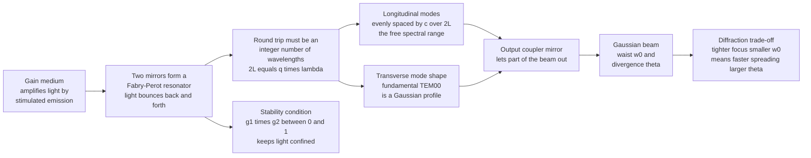

# 🔵 Laser Resonators and Gaussian Beams

> [!abstract] TL;DR
> A gain medium only *amplifies* light — to build a laser you trap that light between two mirrors, an **optical resonator** (Fabry–Pérot cavity), so it passes the gain medium hundreds of times and builds up. Like a guitar string of fixed length that rings only at certain notes, a cavity of length $L$ resonates only at frequencies where a round trip is an integer number of wavelengths, giving evenly spaced **longitudinal modes** separated by the free spectral range $\Delta\nu = c/2L$ — the reason laser light is so spectrally pure. Mirror curvatures and length must satisfy the **stability condition** $0 \le g_1 g_2 \le 1$ to keep light confined. The beam that emerges is not a plane wave but a **Gaussian beam**: intensity $\propto e^{-2r^2/w^2}$, pinched to a minimum **waist** $w_0$, staying roughly collimated over the **Rayleigh range** $z_R = \pi w_0^2/\lambda$, then fanning out at a **divergence** $\theta \approx \lambda/\pi w_0$. That last relation is an unavoidable diffraction trade-off — *tight focus and low divergence cannot coexist* — and it governs every laser cutter, fiber coupler, and laser pointer.

## Intuition

**Analogy:** A gain medium on its own is just an amplifier shouting into empty space — the light streaks through once and is gone. A laser puts *mirrors on both ends* so the light **bounces back and forth**, sweeping through the gain medium again and again, each pass gathering more identical photons until a torrent of coherent light builds up. That mirror sandwich is the **optical resonator**, and one mirror is deliberately made slightly leaky (the output coupler) so a fraction of the trapped beam escapes as the laser output.

Now here is the twist that gives lasers their razor-pure color. A guitar string of fixed length can only ring at certain notes — its fundamental and overtones — because only waves that fit an exact number of half-wavelengths between the two fixed ends survive; everything else cancels itself out. A cavity of fixed length $L$ does the same thing to light: only frequencies whose round trip is an exact whole number of wavelengths reinforce, so the laser can emit only at a comb of discrete, ultra-narrow frequencies — its **modes**.

And the beam that comes out is not a uniform cylinder of light. It is a **Gaussian beam** — brightest in the center, fading smoothly toward the edges — and it obeys a beautiful, unavoidable rule rooted in the same wave uncertainty that limits everything wavelike: *you cannot make a beam both perfectly narrow and perfectly parallel.* Squeeze it to a tiny spot and it sprays outward right afterward; keep it pencil-straight over a long distance and it must be fat. This one trade-off quietly sets the spot size of a cutting laser, the depth of focus of a lithography stepper, and how efficiently you can pour a beam into a hair-thin optical fiber.

---

## How It Works

The resonator does two jobs at once: it **feeds light back** through the gain medium (so weak spontaneous emission grows into a strong coherent beam) and it **selects modes** (only self-reproducing field patterns survive a round trip). A field pattern is a *mode* if, after one complete round trip, it returns to itself in both amplitude profile and phase.

1. **Feedback and buildup.** Two mirrors face each other around the gain medium. Light reflects, re-enters the gain, is amplified, reflects again — a positive-feedback loop. Lasing starts when round-trip gain finally exceeds round-trip loss (the threshold), and a partially transmitting **output coupler** taps off the beam.
2. **The round-trip phase condition → longitudinal modes.** For a wave to reinforce itself, one round trip ($2L$) must contain a whole number $q$ of wavelengths: $2L = q\lambda$, i.e. $\nu_q = q\,c/2L$. Successive modes are spaced by the **free spectral range** $\Delta\nu = c/2L$. Only modes falling under the gain bandwidth can oscillate — giving a laser one line (**single-mode**) or a few closely spaced lines (**multi-mode**).
3. **Transverse modes → beam shape.** Across the beam cross-section the field also has discrete allowed patterns, the **TEM$_{mn}$** modes (Hermite–Gaussian in rectangular symmetry). The lowest, **TEM$_{00}$**, is a clean **Gaussian** spot — the mode almost every application wants.
4. **Stability keeps the light in.** After each bounce off curved mirrors the beam must refocus back onto itself rather than walk out sideways. In terms of the mirror $g$-parameters $g_i = 1 - L/R_i$, the cavity is **stable** only when $0 \le g_1 g_2 \le 1$. Length and curvatures also fix the mode size at each mirror.
5. **The output is a Gaussian beam.** Its radius follows a hyperbola $w(z) = w_0\sqrt{1 + (z/z_R)^2}$: minimum $w_0$ at the waist, roughly collimated within the **Rayleigh range** $z_R = \pi w_0^2/\lambda$, then diverging at half-angle $\theta \approx \lambda/\pi w_0$. Because $\theta \propto 1/w_0$, a smaller waist *always* means faster spreading — the diffraction trade-off.
6. **Focusing and coupling.** A lens transforms one Gaussian waist into another; the Gaussian **ABCD law** predicts the new spot size and position, which is how you focus a beam to a machining spot or **mode-match** it into a single-mode fiber.



---

## Key Concepts

### Secondary Level

- **Resonator = mirror sandwich.** Two mirrors around the gain medium trap light so it passes the amplifier many times. One mirror leaks a little — that leak *is* the laser beam.
- **Modes are like a string's notes.** A cavity of fixed length only "rings" at certain exact frequencies, just as a guitar string of fixed length plays only certain notes. That is a big reason laser light is such a pure single color.
- **A laser beam is a Gaussian, not a cylinder.** It is brightest in the middle and fades toward the edges. Its narrowest point is the **waist**.
- **The unbreakable trade-off.** Focus a beam to a tiny spot and it spreads out fast afterward; keep it narrow and parallel over a long way and it has to be wide. You cannot have both — a laser pointer that stays a small dot on a distant wall must start out as a fairly wide beam.

### Undergraduate Level

**Longitudinal modes and free spectral range.** The round-trip resonance $2L = q\lambda$ gives allowed frequencies and their spacing:

$$\nu_q = q\,\frac{c}{2L}, \qquad \Delta\nu_{\text{FSR}} = \frac{c}{2L}$$

For a $30\,\text{cm}$ HeNe cavity, $\Delta\nu = 500\,\text{MHz}$; with a $\sim1.5\,\text{GHz}$ Doppler gain width, about three modes can oscillate at once. Shortening the cavity spreads the modes apart until only one fits under the gain — a route to single-frequency operation.

**Gaussian beam propagation.** The fundamental TEM$_{00}$ mode has intensity and radius

$$I(r,z) = I_0\left[\frac{w_0}{w(z)}\right]^2 e^{-2r^2/w^2(z)}, \qquad w(z) = w_0\sqrt{1 + \left(\frac{z}{z_R}\right)^2}, \qquad z_R = \frac{\pi w_0^2}{\lambda}$$

At $z = z_R$ the beam has grown to $\sqrt{2}\,w_0$ (area doubled); the span $-z_R$ to $+z_R$ (confocal parameter $b = 2z_R$) is the usable **depth of focus**. Far away the radius grows linearly with **half-angle divergence**

$$\boxed{\theta = \frac{\lambda}{\pi w_0}}$$

so waist and divergence trade inversely: halving the spot doubles the spread, and the depth of focus $b = 2z_R \propto w_0^2$ shrinks fourfold.

**Resonator stability.** With mirror radii $R_1, R_2$ and length $L$, define $g_i = 1 - L/R_i$. Light stays confined (a bounded, self-refocusing mode exists) only when

$$0 \le g_1 g_2 \le 1$$

Landmark cavities sit on the boundaries: **plane-parallel** ($g_1=g_2=1$) and **concentric** ($g_1=g_2=-1$) are marginally stable and alignment-critical; the **confocal** cavity ($R_1=R_2=L$, $g_1=g_2=0$) sits safely in the middle; the **hemispherical** cavity ($R_1=\infty, R_2=L$, so $(1,0)$) is a popular robust choice.

### Graduate Level

**Complex beam parameter and the ABCD law.** All of Gaussian-beam propagation compresses into one complex number $q(z)$:

$$\frac{1}{q(z)} = \frac{1}{R(z)} - i\,\frac{\lambda}{\pi w^2(z)}, \qquad q(z) = z + i z_R$$

where $R(z) = z\,[1 + (z_R/z)^2]$ is the wavefront radius of curvature. Any paraxial optical element with ray matrix $\left(\begin{smallmatrix}A&B\\C&D\end{smallmatrix}\right)$ transforms it by the **Kogelnik ABCD law**:

$$q_2 = \frac{A q_1 + B}{C q_1 + D}$$

A thin lens ($A=1, B=0, C=-1/f, D=1$) therefore focuses one waist to another — the design equation for machining spots and fiber coupling. **Self-consistency** ($q$ reproduces itself after a round trip, $q = (Aq+B)/(Cq+D)$) recovers the resonator's mode size and the stability condition directly.

**Higher-order transverse modes and Gouy phase.** The full mode set is **Hermite–Gaussian** TEM$_{mn}$ (rectangular) or **Laguerre–Gaussian** (cylindrical, carrying orbital angular momentum $\ell\hbar$). Each acquires a mode-number-dependent **Gouy phase** $\psi(z) = (m+n+1)\arctan(z/z_R)$, which shifts the resonance frequency of each transverse family — so TEM$_{01}$ does not lase at the same frequency as TEM$_{00}$. An aperture that clips higher-order modes forces clean single-transverse-mode (Gaussian) output.

**Beam quality $M^2$.** Real beams are never perfectly Gaussian. The $M^2$ factor generalizes the trade-off to

$$w_0\,\theta = M^2\,\frac{\lambda}{\pi}, \qquad M^2 \ge 1$$

An ideal TEM$_{00}$ has $M^2 = 1$; multimode or aberrated beams have $M^2 > 1$, meaning a *larger* focal spot for the same divergence. $M^2$ is the single number that tells you how tightly a real laser can be focused and how well it will couple into a fiber — the currency of practical beam engineering.

---

## Python Demo

```python
# Laser resonators & Gaussian beams:
#   (a) Gaussian-beam radius w(z): the hyperbolic waist, Rayleigh range, and
#       far-field divergence for a TIGHT vs a LOOSE waist (the diffraction trade-off)
#   (b) waist w0 vs divergence theta AND depth of focus b = 2*zR (inverse trade-off)
#   (c) longitudinal cavity modes: a comb spaced by the free spectral range c/2L,
#       shaped by the gain bandwidth (which modes actually lase)
#   (d) resonator STABILITY diagram: the region 0 <= g1*g2 <= 1
import numpy as np
import matplotlib.pyplot as plt

lam = 632.8e-9          # HeNe wavelength (m)
c   = 2.99792458e8      # speed of light (m/s)

def w_of_z(z, w0, lam):
    zR = np.pi * w0**2 / lam
    return w0 * np.sqrt(1.0 + (z / zR)**2), zR

fig, ax = plt.subplots(2, 2, figsize=(12, 9))

# ---- (a) BEAM PROPAGATION w(z): tight waist spreads fast, loose waist stays collimated ----
z = np.linspace(-1.5, 1.5, 800)
for w0, col in [(0.2e-3, "C3"), (1.0e-3, "C0")]:
    w, zR = w_of_z(z, w0, lam)
    theta = lam / (np.pi * w0)                       # far-field half-angle divergence
    ax[0, 0].plot(z, w * 1e3, col, lw=2.0,
                  label=f"w0 = {w0*1e3:.1f} mm  ->  zR = {zR:.2f} m,  theta = {theta*1e3:.2f} mrad")
    ax[0, 0].plot(z, -w * 1e3, col, lw=2.0)
    ax[0, 0].axvline(zR, color=col, ls=":", lw=0.8)  # Rayleigh range marker
    ax[0, 0].plot(z, np.abs(z) * theta * 1e3, col, ls="--", lw=0.9)  # far-field asymptote
ax[0, 0].set_title("(a) Gaussian beam w(z): tight waist diverges fast")
ax[0, 0].set_xlabel("z (m)"); ax[0, 0].set_ylabel("beam radius w (mm)")
ax[0, 0].legend(fontsize=8, loc="upper center")

# ---- (b) THE TRADE-OFF: divergence falls as 1/w0, depth of focus grows as w0^2 ----
w0 = np.linspace(0.05e-3, 2.0e-3, 400)
theta = lam / (np.pi * w0)                            # rad
b = 2.0 * np.pi * w0**2 / lam                         # confocal parameter = 2*zR (m)
axb = ax[0, 1]
l1 = axb.plot(w0 * 1e3, theta * 1e3, "C3", lw=2.0, label="divergence theta (mrad)")
axb.set_xlabel("waist w0 (mm)"); axb.set_ylabel("divergence theta (mrad)", color="C3")
axb.tick_params(axis="y", labelcolor="C3")
axt = axb.twinx()
l2 = axt.plot(w0 * 1e3, b, "C0", lw=2.0, label="depth of focus b = 2*zR (m)")
axt.set_ylabel("depth of focus b (m)", color="C0")
axt.tick_params(axis="y", labelcolor="C0")
axb.set_title("(b) Trade-off: small spot -> big divergence, tiny depth of focus")
axb.legend(l1 + l2, [h.get_label() for h in l1 + l2], fontsize=8, loc="upper center")

# ---- (c) LONGITUDINAL MODES: comb at n*FSR under the gain envelope ----
L = 0.30                                              # cavity length (m)
fsr = c / (2 * L)                                     # free spectral range (Hz) = 500 MHz
gain_fwhm = 1.5e9                                     # Doppler gain bandwidth (Hz)
sigma = gain_fwhm / (2 * np.sqrt(2 * np.log(2)))
f = np.linspace(-2.5e9, 2.5e9, 2000)                 # frequency offset from line center (Hz)
gain = np.exp(-0.5 * (f / sigma)**2)                 # Gaussian gain profile
n = np.arange(-6, 7)
f_modes = n * fsr                                    # longitudinal mode frequencies
g_modes = np.exp(-0.5 * (f_modes / sigma)**2)
ax[1, 0].plot(f / 1e9, gain, "C0", lw=1.5, label=f"gain bandwidth ~ {gain_fwhm/1e9:.1f} GHz")
ax[1, 0].vlines(f_modes / 1e9, 0, g_modes, colors="C3", lw=2.0)
ax[1, 0].plot(f_modes / 1e9, g_modes, "C3o", ms=5,
              label=f"cavity modes  (FSR = c/2L = {fsr/1e6:.0f} MHz)")
ax[1, 0].set_title(f"(c) Longitudinal modes under the gain (L = {L*100:.0f} cm)")
ax[1, 0].set_xlabel("frequency offset (GHz)"); ax[1, 0].set_ylabel("relative gain")
ax[1, 0].legend(fontsize=8)

# ---- (d) STABILITY DIAGRAM: the region 0 <= g1*g2 <= 1 ----
g = np.linspace(-2.2, 2.2, 700)
G1, G2 = np.meshgrid(g, g)
stable = ((G1 * G2 >= 0) & (G1 * G2 <= 1)).astype(float)
ax[1, 1].contourf(G1, G2, stable, levels=[0.5, 1.5], colors=["#9ecae1"])
xh = np.linspace(0.46, 2.2, 300)                     # g1*g2 = 1 hyperbola branches
ax[1, 1].plot(xh, 1 / xh, "k-", lw=1.0); ax[1, 1].plot(-xh, -1 / xh, "k-", lw=1.0)
ax[1, 1].axhline(0, color="k", lw=0.8); ax[1, 1].axvline(0, color="k", lw=0.8)
for (x, y, name) in [(1, 1, "plane-parallel"), (0, 0, "confocal"),
                     (-1, -1, "concentric"), (1, 0, "hemispherical")]:
    ax[1, 1].plot(x, y, "C3o", ms=7)
    ax[1, 1].annotate(name, (x, y), textcoords="offset points",
                      xytext=(6, 6), fontsize=8)
ax[1, 1].set_xlim(-2.2, 2.2); ax[1, 1].set_ylim(-2.2, 2.2)
ax[1, 1].set_title("(d) Resonator stability: shaded 0 <= g1*g2 <= 1")
ax[1, 1].set_xlabel("g1 = 1 - L/R1"); ax[1, 1].set_ylabel("g2 = 1 - L/R2")

plt.tight_layout(); plt.savefig("laser_resonators_gaussian_beams.png", dpi=110)
print("Saved laser_resonators_gaussian_beams.png")

# ---- quick numbers: focusing a beam to a spot (the diffraction trade-off in action) ----
print("\nFocus a collimated beam (radius w = 2 mm) with lenses of different f:")
w_in = 2e-3
for f_lens in [10e-3, 50e-3, 200e-3]:
    w0_focus = lam * f_lens / (np.pi * w_in)          # Gaussian focused spot radius
    zR_focus = np.pi * w0_focus**2 / lam
    print(f"  f = {f_lens*1e3:5.0f} mm  ->  spot w0 = {w0_focus*1e6:6.2f} um,"
          f"  depth of focus 2*zR = {2*zR_focus*1e6:8.1f} um")
```

Panel (a) shows the hyperbolic waist: the $0.2\,\text{mm}$ beam has a short Rayleigh range and diverges steeply, while the $1\,\text{mm}$ beam stays nearly collimated far downstream. Panel (b) plots the inverse trade-off directly — divergence falls as $1/w_0$ while depth of focus climbs as $w_0^2$. Panel (c) drops the cavity's $500\,\text{MHz}$ mode comb under the gain envelope, showing why only a few longitudinal modes lase. Panel (d) maps the stability region and where classic cavities sit. The printout shows a shorter-focal-length lens making a tighter spot but with a dramatically shorter depth of focus — exactly the constraint a laser-cutting or lithography engineer must budget.

---

## Real-World Applications

- **Laser cutting, welding, and marking.** The focused Gaussian spot size $w_0 = \lambda f/\pi w_{\text{in}}$ sets the kerf width and power density, while the depth of focus $2z_R$ sets how thick a part can be cut in one pass without refocusing — a direct application of the waist-vs-divergence trade-off.
- **Fiber and photonic-chip coupling.** Efficient launch into a single-mode fiber requires **mode matching**: shaping the incoming Gaussian (via the ABCD law) so its waist size and position match the fiber's mode field. Mismatch is the dominant coupling loss in every optical transceiver.
- **Spectrally pure and single-frequency lasers.** Choosing cavity length $L$ sets the mode spacing $c/2L$; shortening the cavity or adding an intracavity etalon forces **single-longitudinal-mode** operation, essential for interferometry, LIDAR, atomic clocks, and coherent optical communication.
- **Interferometry and gravitational-wave detection.** LIGO's kilometre-scale arms are high-finesse Fabry–Pérot resonators; TEM$_{00}$ Gaussian mode purity and cavity stability directly limit the strain sensitivity, and higher-order-mode contamination is a real noise source.
- **Laser scanning, printing, and materials processing.** Barcode scanners, laser printers, and lithography steppers all live and die by controlling *where* and *how tightly* a Gaussian beam focuses, and how far it stays in focus — the beam-quality factor $M^2$ is the spec sheet's headline number.

---

## Common Pitfalls

- **Treating a laser beam as a plane wave or a uniform cylinder.** Real output is a Gaussian that expands with distance; using geometric-ray or top-hat intensity assumptions gives wrong spot sizes and wrong coupling efficiencies. Always propagate with $w(z)$ or the $q$-parameter.
- **Believing you can focus tight *and* stay collimated.** $\theta \propto 1/w_0$ is a hard diffraction limit — a small waist necessarily has a short Rayleigh range. Depth of focus $2z_R \propto w_0^2$ collapses quadratically as you tighten the spot.
- **Confusing longitudinal with transverse modes.** Longitudinal modes ($c/2L$ spacing) are *different frequencies* along the axis; transverse modes (TEM$_{mn}$) are *different spatial patterns* across the beam. A "multimode" laser can mean either — always ask which.
- **Assuming any mirror pair makes a working cavity.** If $g_1 g_2$ falls outside $[0,1]$ the resonator is **unstable** and no confined Gaussian mode exists (useful sometimes, but usually a misalignment failure). Plane-parallel and concentric cavities sit *on* the boundary and are punishingly alignment-sensitive.
- **Forgetting $M^2$ for real beams.** Textbook formulas assume ideal $M^2 = 1$. A beam with $M^2 = 3$ focuses to a spot three times larger (and couples far worse into a fiber) than the ideal prediction. Design to the measured $M^2$, not the wavelength alone.
- **Measuring waist by the "edge" of the beam.** The Gaussian has no edge; $w$ is the $1/e^2$-intensity radius (13.5% of peak), and $\approx 86\%$ of the power lies within it. Mixing $1/e$, $1/e^2$, and FWHM definitions introduces factor-of-$\sqrt{2}$ and factor-of-1.7 errors.

---

## Related Concepts

- [[Laser_Physics]] — the gain-medium side of the story: stimulated emission, population inversion, and threshold. The resonator is what turns that amplifier into an actual laser by supplying feedback and mode selection.
- [[Quantum_Optics_and_Cavity_QED]] — the same optical cavity, pushed to the single-photon regime where the resonator mode structure controls atom–field coupling and the Purcell effect.
- [[Interference_and_Diffraction]] — the round-trip resonance condition is standing-wave interference, and the beam-waist-vs-divergence trade-off is the diffraction limit; both mechanisms live here.
- [[Wave_Motion_and_Properties]] — standing waves and boundary conditions on a bounded medium, the direct physical analog of a string's notes and a cavity's longitudinal modes.
- [[Oscillations_and_SHM]] — resonance and normal modes of a bounded system; the guitar-string intuition for why only discrete frequencies survive.
- [[Wave_Particle_Duality_and_Uncertainty]] — the waist-divergence product $w_0\theta \gtrsim \lambda/\pi$ is a position–momentum uncertainty relation for the transverse photon, the same wave uncertainty that limits all focusing.
- [[Fourier_Transform]] — the Gaussian is its own Fourier transform, which is exactly why a Gaussian beam keeps its shape as it propagates and focuses; near/far field are a Fourier pair.
- [[Eigenvalues_and_Eigenvectors]] — resonator modes are eigenfunctions of the round-trip propagation operator, and the stability condition is a statement about that operator's eigenvalues.

Sibling notes in this section (prose-only): this note is the beam-and-cavity companion to **Laser_Physics_and_Stimulated_Emission** (how gain and inversion arise), **Types_of_Lasers** (how gas, solid-state, diode, and fiber lasers realize these cavities), **Ultrafast_and_Pulsed_Lasers** (mode-locking phase-locks the longitudinal modes into ultrashort pulses), **Optical_Fibers_and_Waveguides** (where Gaussian-beam mode matching couples free-space beams into guided modes), and **Diffraction_and_Fourier_Optics** (the diffraction framework underlying the divergence trade-off).

---

## Review Questions

1. **Secondary:** A laser has two mirrors around its gain medium, one of which leaks a little light. Explain in plain terms why the mirrors are essential (what would happen with none?) and why a cavity of fixed length, like a guitar string of fixed length, can only emit light at certain exact frequencies.
2. **Undergraduate:** A HeNe laser has a $25\,\text{cm}$ cavity and a $1.4\,\text{GHz}$ Doppler gain bandwidth. Compute the free spectral range and estimate how many longitudinal modes can oscillate. How short would you have to make the cavity to guarantee single-longitudinal-mode operation?
3. **Undergraduate:** A $\lambda = 1064\,\text{nm}$ beam is focused to a waist of $w_0 = 10\,\mu\text{m}$. Compute its Rayleigh range and far-field divergence half-angle. If you instead needed the beam collimated (Rayleigh range $> 1\,\text{m}$), what minimum waist would that require, and what does that imply for the beam diameter at the lens?
4. **Graduate:** Using $g_i = 1 - L/R_i$, show where the confocal ($R_1 = R_2 = L$) and concentric ($R_1 = R_2 = L/2$) cavities land on the stability diagram, and argue why the confocal design is far more forgiving of mirror misalignment than either boundary case.
5. **Graduate:** A real beam has $M^2 = 2.5$. Explain quantitatively how much larger its focused spot is than an ideal Gaussian of the same wavelength and input diameter, and why $M^2$ — not wavelength alone — is the figure of merit for fiber coupling and micromachining.

---

## Sources

- Siegman, A. E. — *Lasers* (1986), Ch. 16–21 (resonators, Gaussian beams, ABCD analysis)
- Svelto, O. — *Principles of Lasers*, 5th ed. (2010), Ch. 4–5
- Saleh, B. E. A. & Teich, M. C. — *Fundamentals of Photonics*, 3rd ed. (2019), Ch. 3 & 10
- Kogelnik, H. & Li, T. — "Laser Beams and Resonators," *Applied Optics* 5(10), 1550–1567 (1966)

---

#optics #laser-resonator #gaussian-beam #cavity-modes #beam-divergence
