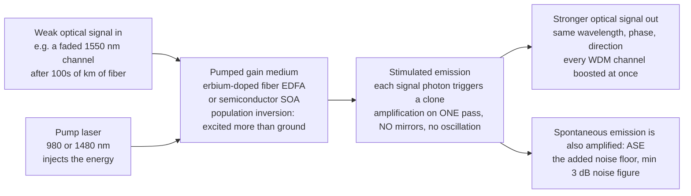

# 🔦 Optical Amplifiers and Gain Media

> [!abstract] TL;DR
> A **laser** is an amplifier wrapped in mirrors that feed its own light back on itself. Take the mirrors away and you keep the essential half: a **gain medium** that, once **pumped** into a **population inversion**, boosts a weak input beam *directly by stimulated emission* — an **optical amplifier**. It makes light stronger without ever converting it to electricity and back. The physics is compact: **small-signal exponential gain** ($P_\text{out}=G\,P_\text{in}$, $G=e^{gL}$), **gain saturation** (a strong signal drains the inversion, so gain falls and output power is capped), a finite **gain bandwidth**, and an unavoidable noise floor — **amplified spontaneous emission (ASE)**, whose best-case **noise figure** is the 3 dB quantum limit. The headline device is the **erbium-doped fiber amplifier (EDFA)**: erbium ions in a stretch of fiber, pumped at 980 or 1480 nm, providing gain across the ~1530–1565 nm **C-band**. Because it amplifies *every wavelength channel at once, all-optically and transparently*, the EDFA replaced electrical repeaters, unleashed **WDM**, and is one of the enabling technologies of the modern internet. Cousins include **Raman amplifiers** (distributed gain in the transmission fiber itself) and **semiconductor optical amplifiers (SOAs)** (a laser-diode gain region without feedback — compact, integrable, also usable as fast switches). Broader **gain media** — rare-earth-doped fibers and crystals (Er, Yb, Nd, Tm) and semiconductor gain — also power high-energy and ultrafast **laser amplifier chains** (MOPA, CPA).

## Intuition

**Analogy:** Picture a stadium wave. In an ordinary laser, mirrors at each end bounce the wave back and forth until it grows into a roaring, self-sustaining oscillation — that feedback loop is what makes it a *laser*. Now rip out the mirrors. The crowd (the excited atoms) is still primed to join in; a wave that rolls through *once* still gets amplified as it passes, section by section, coming out the far side far bigger than it went in — but it never loops, never oscillates, never turns into a self-running roar. That is an **optical amplifier**: a gain medium doing its one job — making a passing beam stronger by stimulated emission — without the ego of becoming a full laser.

Why this matters is not obvious until you follow a photon across an ocean. Every long-haul fiber-optic cable — the strands crossing the seafloor to carry the internet — bleeds signal strength as light crawls through hundreds of kilometres of glass. Before optical amplifiers you had to stop every ~40 km, convert the fading light *back into an electrical signal*, amplify it electronically, and re-transmit it as fresh light — one repeater per wavelength, slow and ruinously expensive. The **erbium-doped fiber amplifier** ended that: a short spliced-in length of special fiber that boosts the light *while it stays light*, and boosts **every wavelength channel simultaneously**. Suddenly you could pump dozens of colours down one fiber and re-amplify them all in a single transparent box. The global internet's capacity exploded. The optical amplifier is, quietly, one of the most important inventions of the modern age.

---

## How It Works

### Core Mechanics

1. **Gain = population inversion + stimulated emission.** Any material can be an optical amplifier if you invert it. **Pump** energy into the medium so that *more* atoms sit in an excited state than in the lower state (a **population inversion**, a non-equilibrium condition — see [[Laser_Physics]]). A signal photon of the right wavelength passing an excited atom triggers **stimulated emission**: the atom drops down and emits a *clone* photon — identical frequency, phase, and direction. One photon becomes two, two become four; the beam is amplified coherently as it travels.
2. **No mirrors, no oscillation — just a single pass.** A laser adds a resonator so this gain feeds back and self-oscillates. Remove the feedback and the same pumped medium simply *amplifies an externally injected beam on one pass through*. That is the whole distinction: **laser = gain medium + feedback**; **amplifier = gain medium alone, pumped**.
3. **Small-signal exponential gain.** For a weak input the inversion is barely disturbed, so gain per unit length $g$ is constant and power grows exponentially: $P_\text{out}=G\,P_\text{in}$ with $G=e^{gL}$ over a medium of length $L$. Expressed logarithmically, gain in decibels adds linearly with length — 30 dB means $1000\times$.
4. **Gain saturation caps the output.** As the signal grows, each amplified photon consumes one unit of inversion faster than the pump can replenish it. The inversion — and therefore $g$ — **drops**. Gain is high only for small signals and falls as the input rises; the *added* power tops out at a **saturation output power** set by how fast you pump. An amplifier cannot supply unlimited power; it can only hand over the energy the pump stores.
5. **Finite gain bandwidth.** Gain exists only over the range of wavelengths the medium's transition can amplify. Erbium's relevant transition gives useful gain across roughly **1530–1565 nm** (the telecom **C-band**), which is exactly why erbium — and not some other ion — sits at the heart of fiber telecom.
6. **Noise is unavoidable: ASE.** Not every excited atom waits for a signal photon; some decay by **spontaneous emission**, which then gets amplified along the way as **amplified spontaneous emission (ASE)**. ASE is broadband optical noise added on top of the signal. Quantified as a **noise figure**, even a perfect, fully inverted amplifier degrades the signal-to-noise ratio by a fundamental **3 dB quantum limit** — a hard floor no engineering can beat (this is why ASE ties directly to channel noise, see [[The_Gaussian_Channel_and_Shannon_Hartley]]).

### Flow / Architecture



---

## Key Concepts

### Secondary Level

**Boosting light without turning it into electricity.** The old way to fight signal loss in a long cable was a **repeater**: detect the light, turn it into a voltage, amplify that electrically, then drive a new laser to send fresh light. That works but it is expensive, slow, and — crucially — you need *one repeater per colour of light*. An **optical amplifier** skips the round trip entirely: the light stays light and just gets stronger. It is "transparent," meaning it does not care what data or how many channels ride on the beam.

**The one device that scaled the internet.** The **erbium-doped fiber amplifier (EDFA)** is a coil of special glass fiber with a trace of the rare-earth element **erbium** mixed in. A small pump laser keeps the erbium atoms "charged up." When your signal light passes through, the charged erbium dumps its energy into your beam, amplifying it — and it does this across a whole band of wavelengths at once, so *dozens of separate data channels get boosted in a single box*. That single trick is a big part of why one strand of undersea fiber can now carry terabits per second.

**Amplifier, not laser.** A laser needs mirrors to make light bounce back and forth and build up. An optical amplifier is what you get if you keep the "gain" part but throw away the mirrors: it just strengthens light passing straight through.

### Undergraduate Level

**Small-signal gain and its decibels.** Over an inverted medium the signal grows as $P(z)=P_\text{in}\,e^{gz}$, so $G=P_\text{out}/P_\text{in}=e^{gL}$. Because loss and gain in fiber systems compound multiplicatively, engineers work in **dB**: $G_\text{dB}=10\log_{10}G$. A distributed link with $-0.2$ dB/km fiber loss over 100 km loses 20 dB; a 20 dB EDFA restores it exactly. Gains and losses in dB simply add and subtract along the link — the reason the whole industry thinks in decibels.

**Gain saturation, quantitatively.** A homogeneously broadened traveling-wave amplifier obeys the transcendental relation
$$G = G_0 \, \exp\!\left[-(G-1)\,\frac{P_\text{in}}{P_\text{sat}}\right],$$
where $G_0$ is the **unsaturated (small-signal) gain** and $P_\text{sat}$ the **saturation power**. For $P_\text{in}\ll P_\text{sat}$, $G\to G_0$; as $P_\text{in}$ grows, $G$ falls toward 1. A tidy consequence: the **added power** is $P_\text{out}-P_\text{in}=P_\text{sat}\ln(G_0/G)$, which climbs toward a hard ceiling $P_\text{sat}\ln G_0$ as the amplifier is driven into deep saturation — the maximum power the stored inversion can hand over. The **3 dB saturation input power** (where gain has dropped by half) is a standard datasheet spec.

**Gain bandwidth and WDM.** The gain spectrum $g(\lambda)$ has a finite width. Erbium's C-band (1530–1565 nm) spans several THz — wide enough to hold **dozens of Wavelength-Division-Multiplexed channels** on the ITU 100 GHz (~0.8 nm) grid. One EDFA amplifies them all at once, which is *the* property that made dense WDM economical. Because the raw erbium spectrum is not flat (a sharp peak near 1531 nm, a broad shoulder near 1550 nm), real systems add **gain-flattening filters** so every channel emerges with nearly equal power.

**Noise figure and ASE.** Spontaneous emission seeds broadband **ASE** that the amplifier then amplifies. The **noise figure** $F$ measures SNR degradation. For a high-gain amplifier $F \approx 2 n_\text{sp}$, where the **spontaneous-emission factor** $n_\text{sp}\ge 1$ measures how completely inverted the medium is. Even at ideal full inversion ($n_\text{sp}=1$) the noise figure bottoms out at $F=2$, i.e. **3 dB** — the quantum-limited price of phase-insensitive amplification.

**Pumping schemes.** EDFAs are pumped by compact diode lasers at **980 nm** (best noise figure, pumps to a higher level that decays into the metastable state) or **1480 nm** (higher power efficiency, pumps directly). The pump and signal co-propagate (or counter-propagate) in the same doped fiber, coupled by a wavelength combiner.

### Graduate Level

**Rate-equation picture and the metastable state.** Erbium's amplifying transition is $^4I_{13/2}\!\to\,^4I_{15/2}$ near 1.5 µm. Its upper level is **metastable** (millisecond lifetime), so modest pump power builds a large inversion; the long lifetime also means the gain responds slowly (kHz), which is a *feature* for WDM — the amplifier cannot follow fast per-bit intensity swings, so it does **not** impose cross-gain crosstalk between high-speed channels. This slow response is exactly why the EDFA amplifies many independent channels transparently, whereas a fast-responding SOA can suffer inter-channel crosstalk.

**Distributed vs lumped gain — Raman amplification.** Instead of a doped section, **Raman amplifiers** pump the *transmission fiber itself* with a high-power laser (~100 nm below the signal) and exploit **stimulated Raman scattering** (a $\chi^{(3)}$ nonlinearity, see [[Nonlinear_Optics]]) to transfer pump energy to the signal *distributed along the span*. Because the gain is spread over the fiber where the signal is still relatively strong, the **effective noise figure is lower** than a lumped amplifier — often combined with EDFAs in hybrid Raman/EDFA links to extend unrepeatered reach. The Raman gain peak follows the pump wavelength, so it can amplify bands (e.g. the L- and S-bands) that erbium cannot.

**Semiconductor optical amplifiers (SOAs).** An SOA is a laser-diode active region (a forward-biased p-n junction providing gain by electron-hole recombination) with **anti-reflection facets** to suppress feedback. It is compact, electrically pumped, and **photonic-integrable** on the same chips as lasers and modulators (see [[Photonics_and_Optoelectronics]]). Its fast (~ns) gain dynamics make it a poor multi-channel booster (cross-gain modulation) but an excellent **all-optical switch, wavelength converter, and logic element** — the nonlinearity that is a bug for amplification is a feature for signal processing.

**Gain media broadly and power amplifier chains.** Rare-earth ions define the accessible bands: **Er** (~1.5 µm, telecom), **Yb** (~1.0 µm, high-power industrial lasers, superb efficiency), **Nd** (~1.06 µm), **Tm/Ho** (~2 µm, eye-safer, medical). Semiconductor gain spans near-IR to visible by bandgap engineering. High-energy and ultrafast systems use the **MOPA** architecture (**M**aster **O**scillator **P**ower **A**mplifier): a low-power, spectrally clean seed laser sets the beam quality and linewidth, and one or more gain stages boost power without corrupting it. For femtosecond pulses, **chirped-pulse amplification (CPA)** — stretch the pulse in time before amplifying, then recompress — keeps peak intensity below the damage/nonlinearity threshold in the gain medium (the technique behind the 2018 Nobel Prize). Integrated **erbium/ytterbium waveguide amplifiers** now bring gain onto photonic chips.

**Why it is a cornerstone.** The EDFA converted long-haul fiber from a chain of costly electrical repeaters into a **transparent optical pipe**: amplify all channels at once, all-optically, and let the bandwidth ride. That single change made dense WDM, undersea cables, and the bandwidth explosion of the internet possible — while the same gain-media physics simultaneously powers the world's most energetic and shortest laser pulses.

---

## Python Demo

```python
# Optical amplification: gain, saturation, EDFA bandwidth, and the noise floor.
#
#   (a) POWER TRANSFER: output vs input power for a saturable amplifier.
#       Small signals see the full small-signal gain (Pout = G0 * Pin);
#       strong signals drive the medium into GAIN SATURATION (gain -> 1).
#   (b) GAIN SATURATION CURVE: gain in dB vs input power, flat at 10*log10(G0)
#       then rolling off; mark the 3 dB saturation input power.
#   (c) EDFA GAIN SPECTRUM: gain vs wavelength across the ~1530-1565 nm C-band,
#       with a dense WDM channel grid overlaid (many channels boosted at once).
#   (d) NOISE FIGURE: noise figure vs gain approaching the 3 dB quantum limit.
#
# numpy + matplotlib only (self-contained, no scipy).

import numpy as np
import matplotlib.pyplot as plt

# ---------------------------------------------------------------
# (a),(b) Saturable traveling-wave amplifier, solved parametrically.
#   Model:  G = G0 * exp[ -(G-1) * Pin / Psat ]   (homogeneous broadening)
#   Sweeping G from just below G0 down toward 1 gives Pin explicitly:
#           Pin  = Psat * ln(G0 / G) / (G - 1)
#           Pout = G * Pin
#   (Added power Pout - Pin = Psat * ln(G0/G) -> ceiling Psat*ln(G0).)
# ---------------------------------------------------------------
G0_dB = 30.0                      # small-signal gain (dB)
G0    = 10.0 ** (G0_dB / 10.0)    # = 1000x
Psat  = 1.0                       # saturation power (mW, normalized)

G   = np.linspace(1.001, 0.9995 * G0, 5000)   # sweep saturated gain, near-1 .. near-G0
Pin = Psat * np.log(G0 / G) / (G - 1.0)       # required input power (mW)
Pout = G * Pin                                # output power (mW)
gain_dB = 10.0 * np.log10(G)                  # actual (saturated) gain in dB

# 3 dB saturation input power: where gain has fallen to G0_dB - 3
target = G0_dB - 3.0
i3 = np.argmin(np.abs(gain_dB - target))
Pin_3dB = Pin[i3]

# ---------------------------------------------------------------
# (c) EDFA gain spectrum across the C-band (erbium's characteristic shape:
#     a sharp peak near 1531 nm plus a broad shoulder near 1552 nm).
# ---------------------------------------------------------------
lam = np.linspace(1520.0, 1575.0, 800)        # wavelength (nm)
shape = (1.00 * np.exp(-0.5 * ((lam - 1531.0) / 3.0) ** 2)
         + 0.82 * np.exp(-0.5 * ((lam - 1552.0) / 9.0) ** 2))
gain_spectrum_dB = 30.0 * shape / shape.max()  # scale peak to ~30 dB

# Dense WDM channel grid: ITU 100 GHz spacing ~ 0.8 nm across the C-band.
wdm_channels = np.arange(1530.0, 1565.0 + 0.1, 0.8)

# ---------------------------------------------------------------
# (d) Noise figure vs gain: F = (2*nsp*(G-1) + 1) / G  ->  2*nsp at high gain.
#     nsp = 1 is the fully-inverted quantum limit (F -> 2 = 3 dB).
# ---------------------------------------------------------------
Gn      = np.logspace(0.05, 3.0, 400)         # gain from ~1.1x to 1000x
Gn_dB   = 10.0 * np.log10(Gn)
def noise_figure_dB(nsp):
    F = (2.0 * nsp * (Gn - 1.0) + 1.0) / Gn
    return 10.0 * np.log10(F)
NF_ideal = noise_figure_dB(1.0)               # quantum limit -> 3 dB
NF_real  = noise_figure_dB(1.4)               # realistic partial inversion

# ---------------------------------------------------------------
# Plot: 2 x 2 grid
# ---------------------------------------------------------------
fig, ax = plt.subplots(2, 2, figsize=(14, 9))

# (a) Power transfer: output vs input
ax[0, 0].loglog(Pin, Pout, color="C0", lw=2, label="amplifier output")
ax[0, 0].loglog(Pin, G0 * Pin, "k--", lw=1, label="small-signal Pout = G0 x Pin")
ax[0, 0].loglog(Pin, Pin, color="gray", ls=":", lw=1, label="no gain Pout = Pin")
ax[0, 0].axvline(Psat, color="C1", ls="--", lw=1)
ax[0, 0].annotate("Psat", (Psat, Pout.min() * 3), color="C1", fontsize=9)
ax[0, 0].set_xlabel("input power Pin (mW)")
ax[0, 0].set_ylabel("output power Pout (mW)")
ax[0, 0].set_title("(a) Power transfer: gain saturates at high input")
ax[0, 0].legend(fontsize=8, loc="upper left")

# (b) Gain (dB) vs input power
ax[0, 1].semilogx(Pin, gain_dB, color="C3", lw=2)
ax[0, 1].axhline(G0_dB, color="gray", ls=":", lw=1)
ax[0, 1].annotate(f"small-signal gain = {G0_dB:.0f} dB", (Pin.min() * 2, G0_dB - 1.4),
                  fontsize=8, color="gray")
ax[0, 1].axhline(target, color="C1", ls="--", lw=1)
ax[0, 1].plot([Pin_3dB], [target], "o", color="C1")
ax[0, 1].annotate(f"3 dB sat. input\n~ {Pin_3dB:.1f} mW", (Pin_3dB, target - 6.0),
                  fontsize=8, color="C1", ha="center")
ax[0, 1].set_xlabel("input power Pin (mW)")
ax[0, 1].set_ylabel("gain (dB)")
ax[0, 1].set_title("(b) Gain saturation curve")

# (c) EDFA gain spectrum + WDM channels
ax[1, 0].plot(lam, gain_spectrum_dB, color="C2", lw=2, zorder=3, label="EDFA gain")
ax[1, 0].axvspan(1530.0, 1565.0, color="C2", alpha=0.10, label="C-band 1530-1565 nm")
for wc in wdm_channels:
    ax[1, 0].axvline(wc, color="C0", lw=0.6, alpha=0.45, zorder=1)
ax[1, 0].plot([], [], color="C0", lw=0.8, label="WDM channels (0.8 nm grid)")
ax[1, 0].set_xlabel("wavelength (nm)")
ax[1, 0].set_ylabel("gain (dB)")
ax[1, 0].set_title("(c) EDFA gain spectrum: many WDM channels at once")
ax[1, 0].legend(fontsize=8, loc="upper right")

# (d) Noise figure vs gain approaching the 3 dB quantum limit
ax[1, 1].plot(Gn_dB, NF_real, color="C4", lw=2, label="realistic (nsp = 1.4)")
ax[1, 1].plot(Gn_dB, NF_ideal, color="C0", lw=2, label="fully inverted (nsp = 1)")
ax[1, 1].axhline(3.0, color="C3", ls="--", lw=1)
ax[1, 1].annotate("3 dB quantum limit", (Gn_dB[10], 3.25), color="C3", fontsize=9)
ax[1, 1].set_xlabel("gain (dB)")
ax[1, 1].set_ylabel("noise figure (dB)")
ax[1, 1].set_title("(d) Noise figure floors at the 3 dB quantum limit")
ax[1, 1].set_ylim(2.0, 12.0)
ax[1, 1].legend(fontsize=8, loc="upper right")

plt.tight_layout()
plt.savefig("optical_amplifiers.png", dpi=120)
print("Saved optical_amplifiers.png")

# Numeric sanity checks
print(f"unsaturated gain           : {G0_dB:.1f} dB  ({G0:.0f}x)")
print(f"3 dB saturation input power: {Pin_3dB:.2f} mW")
print(f"max added power ceiling     : {Psat*np.log(G0):.3f} mW  (= Psat*ln G0)")
print(f"high-gain NF (nsp=1)        : {NF_ideal[-1]:.2f} dB  (theory 3.01)")
print(f"high-gain NF (nsp=1.4)      : {NF_real[-1]:.2f} dB  (theory 4.47)")
```

Running it prints the 3 dB saturation input power and the max-added-power ceiling $P_\text{sat}\ln G_0$, confirms the high-gain noise figure lands at the 3.01 dB quantum limit for full inversion, and plots four panels: the input-versus-output power transfer rolling from small-signal gain into saturation, the gain-in-dB saturation curve with its 3 dB point, the EDFA C-band gain spectrum with a dense WDM channel grid, and the noise figure asymptoting to 3 dB.

---

## Real-World Applications

- **Long-haul and undersea fiber (EDFA + WDM).** Trans-oceanic cables place an EDFA every ~50–100 km to boost *all* WDM channels transparently in one box, replacing per-channel electrical repeaters. This is the backbone technology of the global internet; without the EDFA, dense WDM and terabit-per-second submarine links would be economically impossible.
- **Metro and access networks, and pre/post/in-line amplification.** EDFAs serve as **booster** amplifiers right after the transmitter, **in-line** repeaters along the span, and low-noise **pre-amplifiers** just before the receiver to lift a faint signal above detector noise — three distinct roles set by the noise-figure/output-power trade-off.
- **Raman amplification for reach.** High-power Raman pumps turn the transmission fiber itself into a distributed amplifier, lowering effective noise and extending unrepeatered spans; hybrid Raman/EDFA designs push undersea and terrestrial reach further and open the L- and S-bands beyond erbium's C-band window.
- **Semiconductor optical amplifiers as integrated gain and switches.** SOAs provide compact, electrically pumped gain on photonic integrated circuits, and their fast nonlinearity is exploited for **all-optical wavelength conversion, switching, and regeneration** in datacenter and access photonics.
- **High-power and ultrafast laser systems (MOPA / CPA).** Ytterbium- and erbium-doped fiber amplifiers and rod/slab amplifier chains boost clean seed lasers to kilowatt industrial-cutting powers, while chirped-pulse amplification produces the petawatt and attosecond-driving pulses used in laser machining, LASIK, particle acceleration, and fundamental physics.

---

## Common Pitfalls

- **Confusing an amplifier with a laser.** The gain medium is the same; the difference is **feedback**. An amplifier has (ideally) no resonant feedback and amplifies an *injected* beam on one pass. If parasitic reflections (bad splices, facets) let gain feed back, an amplifier can break into unwanted lasing or self-pulsing — which is why SOAs need anti-reflection facets and EDFAs use isolators.
- **Expecting unlimited output power.** Gain is not free power. A strong signal saturates the inversion, so the *added* power is capped by the pump-set saturation power. Pushing more input past $P_\text{sat}$ buys you almost no extra output — it just collapses the gain. Size the pump, not the wish.
- **Ignoring ASE and the noise figure.** Every amplifier adds ASE and degrades SNR by at least 3 dB (quantum limit); cascading many amplifiers accumulates ASE and eventually limits reach. A "high-gain" amplifier with a poor noise figure can be worse for a weak-signal pre-amp than a lower-gain, low-noise one. Optimize noise figure, not just gain.
- **Assuming a flat gain band.** Erbium's raw gain spectrum is peaked and uneven, so across a WDM comb some channels are over-amplified and others starved; without **gain-flattening filters** and per-channel power management, channel-to-channel SNR spreads badly, especially after many cascaded EDFAs.
- **Using an SOA where an EDFA belongs (and vice versa).** The SOA's fast gain dynamics cause cross-gain modulation between fast channels — great for all-optical switching, bad for multi-channel WDM amplification. The EDFA's slow, millisecond metastable lifetime makes it transparent to per-bit dynamics — great for WDM, useless as a fast switch. Match the gain dynamics to the job.
- **Forgetting the pump-band and wavelength match.** An EDFA only amplifies where erbium has gain (C-band); trying to boost 1310 nm or the L-band with a standard C-band EDFA yields nothing. The gain medium's transition dictates the usable window.

---

## Related Concepts

Glob-verified wikilinks:

- [[Laser_Physics]] — an optical amplifier is a laser's gain medium *without* the feedback resonator; population inversion, stimulated emission, and pumping are shared foundations
- [[Photonics_and_Optoelectronics]] — semiconductor optical amplifiers are laser-diode gain regions, and integrated waveguide amplifiers are core photonic-IC building blocks
- [[Nonlinear_Optics]] — Raman amplification is a $\chi^{(3)}$ stimulated-scattering process, and SOA/self-phase-modulation nonlinearities enable all-optical switching
- [[Dispersion_and_Optical_Properties_of_Materials]] — the gain medium's transition sets its bandwidth and center wavelength, and material dispersion shapes both gain flatness and the fibers being amplified
- [[Physical_Layer]] — inline optical amplifiers are the physical-layer components that keep long fiber links viable without electrical regeneration
- [[The_Gaussian_Channel_and_Shannon_Hartley]] — ASE noise is exactly the additive noise that degrades SNR and bounds a fiber channel's capacity via Shannon-Hartley

Within this Optics and Photonics vault, this note connects in prose to its sibling topics: **Laser_Physics_and_Stimulated_Emission** (the inversion-and-gain physics an amplifier borrows), **Types_of_Lasers** (the same rare-earth and semiconductor media used as oscillators), **Optical_Fibers_and_Waveguides** (the doped fiber that hosts EDFA gain), **Fiber_Optic_Communication** (the links EDFAs made transparent), and **Wavelength_Division_Multiplexing_and_Networks** (the many-channel comb an EDFA boosts in one pass).

---

## Review Questions

1. **Secondary:** Before optical amplifiers, boosting a long fiber link required converting the light to an electrical signal, amplifying it, and re-transmitting it — once *per channel*. Explain in plain terms what an erbium-doped fiber amplifier does differently, and why "amplifying every wavelength at once, all-optically" was such a big deal for the internet.
2. **Undergraduate:** An EDFA has 30 dB of small-signal gain and a saturation power $P_\text{sat}=1$ mW. (a) Using $P_\text{out}-P_\text{in}=P_\text{sat}\ln(G_0/G)$, what is the maximum *added* power the amplifier can deliver deep in saturation? (b) A colleague wants "more output" and keeps raising the input power well past $P_\text{sat}$ — explain, in terms of the inversion, why the gain collapses and the output barely rises. (c) Why do WDM systems add a gain-flattening filter after the EDFA?
3. **Graduate:** Compare an **EDFA**, a **Raman amplifier**, and an **SOA** for a dense-WDM long-haul link. Address (i) why the EDFA's millisecond metastable lifetime prevents inter-channel cross-gain crosstalk while the SOA's nanosecond dynamics do not, (ii) why distributed Raman gain achieves a lower effective noise figure than a lumped amplifier, and (iii) what the 3 dB quantum-limited noise figure implies for how many amplifiers you can cascade before the accumulated ASE limits reach.

---

## Sources

- Becker, P. C., Olsson, N. A. & Simpson, J. R. — *Erbium-Doped Fiber Amplifiers: Fundamentals and Technology* (Academic Press) — the definitive EDFA reference
- Desurvire, E. — *Erbium-Doped Fiber Amplifiers: Principles and Applications* (Wiley) — rigorous treatment of gain, saturation, and ASE noise
- Saleh, B. E. A. & Teich, M. C. — *Fundamentals of Photonics*, 3rd ed. (Wiley) — chapters on laser amplifiers, gain saturation, and photonic amplification
- Agrawal, G. P. — *Fiber-Optic Communication Systems*, 4th ed. (Wiley) — optical amplifiers, WDM, Raman gain, and system noise budgets
- Agrawal, G. P. — *Nonlinear Fiber Optics* (Academic Press) — stimulated Raman/Brillouin scattering behind distributed fiber amplification

---

#optics #optical-amplifier #EDFA #gain-medium #fiber-optics
