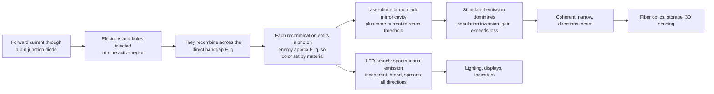

# 💡 Semiconductor Light Sources: LEDs and Laser Diodes

> [!abstract] TL;DR
> An **LED** and a **laser diode** turn electricity *directly* into light inside a sliver of semiconductor — no filament, no gas, just electrons dropping into holes across a **p-n junction** and releasing their energy as **photons** (electroluminescence). The photon energy is set by the material's **bandgap** $E_g$, so the emission wavelength $\lambda = hc/E_g$ — and therefore the **color** — is chosen by picking the material (why the blue LED needed a wide-gap crystal and a Nobel Prize). An **LED** emits *spontaneous*, incoherent light in all directions (lighting, displays, indicators); add an optical **cavity** and enough current to reach **lasing threshold** and the same junction becomes a **laser diode** emitting a *coherent* beam (fiber optics, disc players, 3D sensing). These are the most numerous light sources ever built — made by the trillions per year.

---

## Intuition

**Analogy — a crowd rushing down a staircase.** Picture two floors of a building packed with people. The upper floor (the **conduction band**) has a few energetic people milling about; the lower floor (the **valence band**) has empty spots — **holes** — where someone could stand. Run an electric current through the junction and you *pump* energetic electrons up onto the top floor while opening holes on the floor below. Each electron then "falls down the stairs" into an empty hole, and the energy it loses on the way down doesn't disappear — it comes out as a flash of light, a **photon**. The *height of the staircase* — the **bandgap** — sets exactly how much energy each fall releases, and that energy *is* the color of the light. A tall staircase gives energetic blue photons; a short one gives lazy red or infrared ones.

Change the building material and you change the staircase height, so you change the color. That is literally why the **blue LED** took decades to invent and won the 2014 Nobel Prize: engineers needed a *wide-bandgap* crystal (gallium nitride) that could make electrons fall far enough to release blue light — and blue was the missing ingredient for **white** LED lighting and every full-color screen. If the electrons simply fall on their own, at random, you get an **LED**: cheap, efficient light sprayed in every direction, perfect for a light bulb or a status indicator. But stand two mirrors on either side of the staircase and crank up the current, and the falling electrons start to *march in lockstep* — each photon triggering the next in perfect step. Now the junction is a **laser diode**, firing a tight, coherent beam. Same sliver of semiconductor; add mirrors and current, and light-bulb becomes laser.

---

## How It Works

### Core mechanics

1. **Forward-bias a p-n junction.** In a diode of a *direct-bandgap* semiconductor, applying a forward voltage pushes **electrons** from the n-side and **holes** from the p-side into a common **active region**. (See the junction physics in the EE and Materials semiconductor notes.)
2. **Recombination emits photons (electroluminescence).** When an injected electron in the conduction band meets a hole in the valence band, it **recombines**, dropping across the gap. In a direct-gap material the electron and hole have the same crystal momentum, so the energy comes out cleanly as a **photon** rather than as heat (lattice vibrations).
3. **The bandgap sets the color.** The emitted photon energy is $h\nu \approx E_g$, so the wavelength is
$$\lambda = \frac{hc}{E_g} \approx \frac{1240\ \text{nm}\cdot\text{eV}}{E_g\,[\text{eV}]}.$$
Engineering $E_g$ — by alloy composition (e.g. more indium in InGaN) or by **quantum wells** — tunes the emission from ultraviolet through visible to infrared.
4. **Direct vs indirect gap.** GaAs, InGaN, and InGaAsP are **direct-gap** and emit efficiently. **Silicon** is **indirect-gap**: recombination needs a phonon to conserve momentum, so it barely emits light — which is why the light-source industry is built on III-V compounds, not silicon.
5. **LED = spontaneous emission.** Left to itself, each electron falls at a random time and direction, so an LED emits **incoherent**, spectrally **broad** ($\sim$20-40 nm), **multidirectional** light. Efficient, cheap, robust.
6. **Laser diode = stimulated emission in a cavity.** Surround the active region with an optical **cavity** (cleaved-facet mirrors, or a grating) and drive it hard enough that more states are excited than empty — a **population inversion**. Now an existing photon can *stimulate* an electron to emit a clone photon (same phase, direction, wavelength). Above the **threshold current** where round-trip **gain exceeds loss**, this runs away into **coherent lasing**: a narrow, directional, monochromatic beam.

### Flow / Architecture



---

## Key Concepts

### Secondary Level

- **Electricity straight to light.** An LED has no glowing filament and no gas — current flows through a solid crystal and light comes out. That makes it efficient (little wasted heat), long-lived, and tiny.
- **The material picks the color.** Red, green, blue, and infrared LEDs are made of *different* semiconductor materials, because the color depends on the material's internal energy "step" (the bandgap). You cannot just filter a red LED to get blue — you must change the crystal.
- **Blue was the hard one.** Red and green LEDs existed for decades, but a bright **blue** LED needed a special material (gallium nitride) and won a **Nobel Prize in 2014**. Blue was the last piece needed to make **white** LEDs — a blue LED with a yellow **phosphor** coating looks white.
- **The lighting revolution.** White LEDs use a fraction of the energy of incandescent bulbs for the same brightness and last far longer, which is why they have replaced old bulbs almost everywhere and cut a big slice of the world's lighting electricity.
- **LED vs laser.** An LED sprays soft light everywhere (good for lamps and screens). A **laser diode** is the same idea plus mirrors and more current — it makes a thin, intense, precise beam (laser pointers, disc players, the light in fiber-optic internet).

### Undergraduate Level

- **The emission-wavelength law.** $\lambda\,[\text{nm}] \approx 1240 / E_g\,[\text{eV}]$. Memorize the "1240" shortcut: $E_g = 1.42$ eV (GaAs) gives $\approx 873$ nm (near-IR); $E_g = 2.7$ eV (InGaN blue) gives $\approx 460$ nm; $E_g \approx 0.8$ eV (InGaAsP) gives $\approx 1550$ nm (the telecom band).
- **Material families and their colors.** **AlGaInP** → red/amber; **InGaN / GaN** → green, blue, violet, UV; **GaAs / AlGaAs** → red and near-IR; **InGaAsP / InGaAs** → the 1310 nm and 1550 nm fiber-telecom windows. Composition (the alloy fraction $x$) slides $E_g$ continuously.
- **Direct vs indirect bandgap.** Radiative recombination is fast and efficient only when the conduction-band minimum sits directly above the valence-band maximum in momentum space (**direct** gap). Silicon and germanium are **indirect**, so they waste recombination as heat — hence III-V semiconductors dominate photonics.
- **Heterostructures and quantum wells.** A **double heterostructure** sandwiches a thin low-gap active layer between higher-gap cladding, *confining* both carriers and light in the same tiny volume — the key to efficient LEDs and low-threshold lasers. Shrinking the active layer to a few nm makes a **quantum well**, whose confinement energy adds to $E_g$ and further tunes the color.
- **White-light strategies.** (1) **Phosphor conversion**: a blue LED pumps a yellow (or red+green) phosphor; part of the blue passes through and mixes to white. (2) **RGB mixing**: separate red, green, and blue emitters. Phosphor-white dominates general lighting for cost.
- **Efficiency and the "green gap".** LED wall-plug efficiency is measured in **lumens per watt** (lm/W); good white LEDs exceed $150\text{-}200$ lm/W. Efficiency is high for blue (InGaN) and red (AlGaInP) but sags in the **green** — the "green gap" — because neither material system is ideal there.
- **The laser L-I curve.** Plot optical output power $P$ vs drive current $I$. Below the **threshold current** $I_{th}$ the device is a weak LED (spontaneous emission only). Above $I_{th}$, output climbs steeply and linearly; the **slope efficiency** $dP/dI$ (W/A) measures how well extra current becomes coherent light.
- **Laser-diode types.** **Edge-emitting Fabry-Pérot** (cleaved-facet mirrors, multi-mode) for pump/industrial use; **DFB / DBR** (built-in Bragg grating) for a *single-frequency* beam essential to long-haul telecom; **VCSEL** (Vertical-Cavity Surface-Emitting Laser) — emits from the top surface, cheap, testable on-wafer, array-able, low-threshold — the workhorse of optical mice, datacom links, and face-ID/LiDAR dot projectors.

### Graduate Level

- **Rate equations and threshold.** Coupled carrier–photon rate equations,
$$\frac{dN}{dt} = \frac{I}{qV} - \frac{N}{\tau_n} - v_g\,g(N)\,S,\qquad \frac{dS}{dt} = \Gamma v_g\,g(N)\,S - \frac{S}{\tau_p} + \Gamma\beta\frac{N}{\tau_n},$$
give the threshold condition: lasing begins when the **modal gain** equals the total cavity loss, $\Gamma g_{th} = \alpha_i + \frac{1}{2L}\ln\!\frac{1}{R_1 R_2}$ (internal loss plus mirror loss). Here $\Gamma$ is the optical confinement factor, $v_g$ the group velocity, $S$ the photon density, $\beta$ the spontaneous-emission coupling factor that softens the L-I "knee."
- **Gain from population inversion.** Optical gain requires the **Bernard–Duraffourg condition** $E_{Fc} - E_{Fv} > h\nu > E_g$: the quasi-Fermi-level separation (set by injection) must exceed the photon energy for stimulated emission to outrun absorption. This is the semiconductor analogue of population inversion.
- **Internal, extraction, and wall-plug efficiency.** For an LED, external quantum efficiency $\eta_{EQE} = \eta_{IQE}\cdot\eta_{extraction}$. Internal efficiency battles **non-radiative Shockley–Read–Hall** (defect) and **Auger** recombination; extraction battles **total internal reflection** at the high-index ($n\!\approx\!2.4\text{-}3.5$) semiconductor surface (critical angle $\sim16°$ for GaN), fought with textured surfaces, encapsulant domes, and photonic structures.
- **Efficiency droop.** InGaN LED efficiency *falls* at high current density (droop), attributed largely to **Auger recombination** and carrier leakage — a central obstacle to high-power solid-state lighting and a reason lamps run many LEDs at modest current rather than few at high current.
- **Cavity and spectral control.** Fabry-Pérot facets ($R\approx0.3$ from the index step) give multiple longitudinal modes; a **DFB** grating provides distributed feedback selecting one mode with high **side-mode suppression ratio** (SMSR) and narrow linewidth — required so chromatic dispersion doesn't smear telecom bits. **VCSELs** use two epitaxial **DBR** mirror stacks (tens of quarter-wave pairs) around a sub-wavelength cavity, giving a single longitudinal mode and a circular, low-divergence beam.
- **Direct modulation and chirp.** Diode lasers can be current-modulated into the GHz range; the carrier-density swing modulates the refractive index, producing **frequency chirp** (linewidth-enhancement factor $\alpha_H$) that interacts with fiber dispersion — motivating external modulators at the highest bit rates.
- **Why silicon light emission is hard.** Silicon's indirect gap makes radiative recombination a slow, phonon-assisted second-order process, easily outcompeted by non-radiative paths; silicon photonics therefore imports gain by **heterogeneous integration** of III-V material or explores strained-Ge / quantum-dot / Raman approaches.

---

## Python Demo

```python
# Semiconductor light sources in two panels:
#   (a) BANDGAP -> COLOR : emission wavelength lambda = h c / E_g across real
#       materials, with the visible band and the fiber telecom windows marked.
#   (b) LED vs LASER-DIODE L-I CURVE : optical output power vs drive current,
#       showing the LED's roughly linear output against the laser diode's sharp
#       THRESHOLD (weak spontaneous below, coherent lasing above).
import numpy as np
import matplotlib.pyplot as plt

# ---------- (a) Bandgap sets the emission wavelength ----------
# lambda[nm] = h*c/E_g ; using h*c = 1239.84 eV*nm
HC = 1239.84  # eV*nm

# (material label, bandgap E_g in eV, plotting color)
materials = [
    ("GaN (UV)",            3.40, "#8000ff"),
    ("InGaN (blue)",        2.75, "#0040ff"),
    ("InGaN (green)",       2.30, "#00b000"),
    ("AlGaInP (red)",       1.90, "#e00000"),
    ("GaAs (near-IR)",      1.42, "#800000"),
    ("InGaAsP (1310 nm)",   0.95, "#603030"),
    ("InGaAsP (1550 nm)",   0.80, "#302020"),
]
labels = [m[0] for m in materials]
Eg     = np.array([m[1] for m in materials])
cols   = [m[2] for m in materials]
lam    = HC / Eg  # emission wavelength in nm

# smooth reference curve lambda(E_g)
Eg_fine  = np.linspace(0.6, 3.6, 400)
lam_fine = HC / Eg_fine

fig, ax = plt.subplots(1, 2, figsize=(15, 5.6))

ax[0].plot(Eg_fine, lam_fine, color="gray", lw=1.5, alpha=0.6,
           label=r"$\lambda = hc/E_g$")
ax[0].scatter(Eg, lam, c=cols, s=90, zorder=5, edgecolor="k")
for lbl, e, l, c in zip(labels, Eg, lam, cols):
    ax[0].annotate(f"{lbl}\n{l:.0f} nm", (e, l),
                   textcoords="offset points", xytext=(8, 0),
                   fontsize=8, color=c, va="center")
# visible band (380-750 nm) and telecom windows (1310, 1550 nm)
ax[0].axhspan(380, 750, color="yellow", alpha=0.18, label="visible band")
ax[0].axhline(1310, ls="--", color="teal", lw=1, alpha=0.8)
ax[0].axhline(1550, ls="--", color="purple", lw=1, alpha=0.8)
ax[0].text(3.2, 1330, "1310 nm telecom", color="teal", fontsize=8)
ax[0].text(3.2, 1570, "1550 nm telecom", color="purple", fontsize=8)
ax[0].set_xlabel("bandgap  E_g   [eV]")
ax[0].set_ylabel("emission wavelength  [nm]")
ax[0].set_title("(a) Material bandgap sets the color\nwider gap = shorter wavelength")
ax[0].set_xlim(0.6, 4.1)
ax[0].grid(True, alpha=0.3)
ax[0].legend(loc="upper right", fontsize=8)

# ---------- (b) LED vs laser-diode light-output vs current (L-I) ----------
I = np.linspace(0, 60, 600)     # drive current, mA

# LED: output roughly proportional to current (spontaneous emission)
eta_led = 0.9                   # mW per mA (illustrative)
P_led = eta_led * I

# Laser diode: weak spontaneous below threshold, steep coherent lasing above
I_th   = 15.0                   # threshold current, mA
slope  = 0.7                    # slope efficiency above threshold, mW/mA
spont  = 0.02                   # tiny spontaneous slope below threshold, mW/mA
P_ld = np.where(I < I_th,
                spont * I,
                spont * I_th + slope * (I - I_th))

ax[1].plot(I, P_led, lw=2.5, color="#e08000", label="LED (spontaneous, ~linear)")
ax[1].plot(I, P_ld,  lw=2.5, color="#c00000", label="Laser diode (threshold)")
ax[1].axvline(I_th, ls="--", color="gray", lw=1)
ax[1].annotate("threshold current  I_th",
               (I_th, 2), textcoords="offset points", xytext=(8, 30),
               arrowprops=dict(arrowstyle="->", color="gray"), fontsize=9)
ax[1].annotate("below: weak LED-like\nspontaneous emission",
               (7, 0.3), fontsize=8, color="dimgray")
ax[1].annotate("above: coherent lasing\nturns on (steep slope)",
               (34, 22), fontsize=8, color="#c00000")
ax[1].set_xlabel("drive current  I   [mA]")
ax[1].set_ylabel("optical output power  P   [mW]")
ax[1].set_title("(b) L-I curve: LED vs laser diode\nlaser has a sharp lasing threshold")
ax[1].set_ylim(0, 40)
ax[1].grid(True, alpha=0.3)
ax[1].legend(loc="upper left", fontsize=9)

plt.tight_layout()
plt.savefig("semiconductor_light_sources.png", dpi=120)
plt.show()

# ---- Numerical checks ----
for lbl, e in zip(labels, Eg):
    print(f"{lbl:22s} E_g = {e:.2f} eV  ->  lambda = {HC/e:6.0f} nm")
print(f"\nLaser diode threshold I_th = {I_th:.0f} mA, "
      f"slope efficiency = {slope:.2f} mW/mA")
print(f"At 60 mA:  LED = {P_led[-1]:.1f} mW,  laser diode = {P_ld[-1]:.1f} mW")
# -> InGaN(blue) 2.75 eV -> 451 nm ; GaAs 1.42 eV -> 873 nm ;
#    InGaAsP 0.80 eV -> 1550 nm (the low-loss fiber window)
```

Panel **(a)** is the master dial of optoelectronics: the emission wavelength traces $\lambda = hc/E_g$, so a *wide*-gap crystal (GaN, InGaN) lands in the blue-violet, a *medium* gap (AlGaInP, GaAs) lands in the red and near-IR, and a *narrow* gap (InGaAsP) is engineered to hit the **1310 nm and 1550 nm** windows where glass fiber is most transparent — the reason those exact materials carry the internet. Panel **(b)** is the defining difference between the two devices: an **LED**'s output rises roughly linearly with current (random spontaneous emission), while a **laser diode** loafs along as a feeble LED until the current crosses **threshold**, where round-trip gain overtakes loss and the output snaps into a steep, coherent lasing regime. Same junction — the cavity and the threshold are what separate a lamp from a laser.

---

## Real-World Applications

- **Solid-state lighting.** Phosphor-converted **white LEDs** (a blue InGaN die + yellow phosphor) have displaced incandescent and most fluorescent lamps, cutting lighting energy use dramatically — the practical payoff of the blue-LED Nobel and one of the largest energy-efficiency wins of the century.
- **Displays.** Every phone, laptop, TV, and monitor is lit by semiconductor emitters: LED-backlit LCDs, self-emissive **OLED** panels, and emerging **microLED** displays built from vast arrays of tiny inorganic LEDs.
- **Fiber-optic communication.** **DFB and VCSEL laser diodes** are the light source of the internet, launching modulated 1310/1550 nm beams into single-mode fiber; their coherence and single-frequency spectrum keep bits crisp over long, dispersive spans. (Their receivers are the photodetector notes' subject.)
- **Optical storage.** **CD (780 nm), DVD (650 nm), and Blu-ray (405 nm)** each used a shorter-wavelength laser diode to focus a smaller spot and pack more data — a direct application of bandgap-tuned emission (the Blu-ray blue-violet diode is a GaN cousin of the white-LED die).
- **3D sensing and LiDAR.** **VCSEL** arrays project structured-light or time-of-flight dot patterns for smartphone **face recognition**, and drive automotive/consumer **LiDAR** — cheap, array-able, and eye-safe at the chosen wavelength.
- **Everyday laser diodes.** Laser pointers, barcode and QR scanners, laser printers (the photoconductor-writing beam), optical computer mice (VCSEL), and high-power **pump diodes** that energize fiber and solid-state lasers — including the pumps behind industrial and medical laser systems.
- **Indicators, sensing, and horticulture.** Status LEDs, IR remote controls and proximity sensors, pulse-oximetry (red + IR LEDs), and tuned red/blue **grow-light** arrays that match plant absorption bands.

---

## Common Pitfalls

- **Assuming you can filter one LED into another color.** The color is set by the **bandgap of the material**, not by a coating you add afterward. You cannot make a blue LED by filtering a red one; you must grow a wider-gap crystal. (Phosphor *down*-conversion only goes from short to long wavelength, e.g. blue → yellow, never the reverse.)
- **Expecting silicon to make a good LED.** Silicon is **indirect-gap**, so radiative recombination is inefficient and it barely emits. General-purpose emitters are III-V compounds (GaN, GaAs, InP families); "silicon photonics" gets its light by bonding III-V material onto the silicon.
- **Confusing an LED with a laser diode.** Below threshold a laser diode *is* just a poor LED — incoherent and broad. Coherence, narrow linewidth, and a directional beam appear only **above threshold**. Driving a laser diode below $I_{th}$ (or letting temperature push $I_{th}$ above the drive current) yields LED-like junk, not a beam.
- **Ignoring temperature.** Bandgap shrinks and threshold current rises as the junction heats; an under-cooled laser diode red-shifts, loses power, and can stop lasing. LEDs droop and shift color with temperature too. Thermal management (heat sinking, drive derating) is not optional.
- **Driving LEDs with constant voltage.** An LED's current rises steeply and non-linearly with voltage (diode I-V), so a tiny voltage error causes a huge current swing and thermal runaway. **Drive LEDs with a current source / current limiting**, never a bare voltage.
- **Staring down a laser diode / IR emitter.** A coherent, collimated beam concentrates power onto the retina, and many high-power diodes emit **invisible** near-IR (no blink reflex). Respect the laser class and wavelength; "I can't see it" is not "it's safe."
- **Forgetting light-extraction losses.** A high internal quantum efficiency is wasted if photons are trapped by **total internal reflection** at the high-index semiconductor surface. Real LED design spends enormous effort (surface texturing, domes, photonic structures) just getting the light *out*.

---

## Related Concepts

**Within this vault (Optics and Photonics):**

- [[Optics_and_Photonics_Overview]] — the parent map of the field; this note sits under Pillar 3 (Lasers and Light Sources) as the *electrically pumped, semiconductor* branch of light generation.
- [[Optical_Properties_and_Photonic_Materials]] — the complex refractive index, absorption edge, and luminescence of materials — the materials-side view of the same emission and absorption processes.

**Semiconductor physics and devices (the junction underneath the light):**

- [[Semiconductor_Devices_and_Diodes]] — the forward-biased p-n diode whose carrier injection *is* the LED/laser-diode mechanism, from the electrical-engineering side.
- [[p_n_Junctions_and_Diodes]] — depletion regions, injection, and recombination at the junction, from the materials side.
- [[Semiconductors_Intrinsic_and_Extrinsic]] — doping (n-type/p-type) that builds the junction, and the carrier populations that recombine to make light.
- [[Electronic_Band_Structure]] — the origin of the bandgap $E_g$, and the crucial **direct vs indirect** distinction that decides whether a material can emit efficiently.
- [[Semiconductors_and_Devices]] — the condensed-matter physics of bands, carriers, and junction devices that this note applies to optics.

**Photonics and optics context:**

- [[Laser_Physics]] — stimulated emission, population inversion, gain, and optical cavities in general; a laser diode is the semiconductor realization of exactly these principles.
- [[Photonics_and_Optoelectronics]] — the broader engineering picture of light sources, modulators, waveguides, and detectors in which these emitters are the first stage.

*Sibling notes in this section (Lasers and Light Sources): **Laser_Physics_and_Stimulated_Emission** (the gain and inversion physics behind lasing), **Types_of_Lasers** (where diode lasers sit among gas, solid-state, and fiber lasers), **Photodetectors_and_Optical_Receivers** (the p-n junction run in reverse to *catch* these photons), **Fiber_Optic_Communication** (where DFB/VCSEL diodes launch the beam these devices generate), and **Optical_Modulators_and_Switches** (how the laser-diode output is imprinted with data at the highest bit rates).*

---

## Review Questions

1. **(Secondary)** LEDs of different colors are made from *different materials*, and a bright blue LED was so hard to invent that it earned a Nobel Prize. Using the idea of an internal energy "step" (the bandgap), explain **why the material determines the color** and why blue was the hardest — and why blue was the key that finally unlocked **white** LED lighting.
2. **(Undergraduate)** You are handed two forward-biased semiconductor emitters that look identical. One is an LED and one is a laser diode. Sketch and compare their **light-output-vs-current (L-I) curves**, define the **threshold current** and **slope efficiency**, and describe two physical ingredients a laser diode has that an LED lacks. Then compute the emission wavelength of a device with $E_g = 0.80$ eV and state which real-world system uses it and why.
3. **(Graduate)** (a) State the threshold condition for a Fabry-Pérot diode laser in terms of modal gain, internal loss, mirror reflectivities, and cavity length, and explain what physically happens to the photon density as current crosses threshold. (b) Explain the **Bernard–Duraffourg condition** and why it is the semiconductor analogue of population inversion. (c) Silicon is abundant and cheap yet is *not* used as a light emitter — explain why in terms of band structure and momentum conservation, and name one strategy silicon photonics uses to get light anyway.

---

## Sources

- Saleh, B. E. A. & Teich, M. C. — *Fundamentals of Photonics*, 3rd ed. (Wiley) — LEDs, semiconductor optical amplifiers, and laser diodes; electroluminescence, gain, and the L-I curve.
- Sze, S. M. & Ng, K. K. — *Physics of Semiconductor Devices*, 3rd ed. (Wiley) — p-n junction injection, LEDs, and semiconductor lasers from the device-physics side.
- Coldren, L. A., Corzine, S. W. & Mašanović, M. L. — *Diode Lasers and Photonic Integrated Circuits*, 2nd ed. (Wiley) — rate equations, threshold, DFB and VCSEL design, modulation.
- Schubert, E. F. — *Light-Emitting Diodes*, 2nd ed. (Cambridge) — LED physics, heterostructures, phosphor white light, extraction efficiency, and droop.
- Nakamura, S., Pearton, S. & Fasol, G. — *The Blue Laser Diode* (Springer) — the GaN/InGaN materials story behind the blue LED and blue laser diode.

---

#optics #LED #laser-diode #semiconductor #optoelectronics
