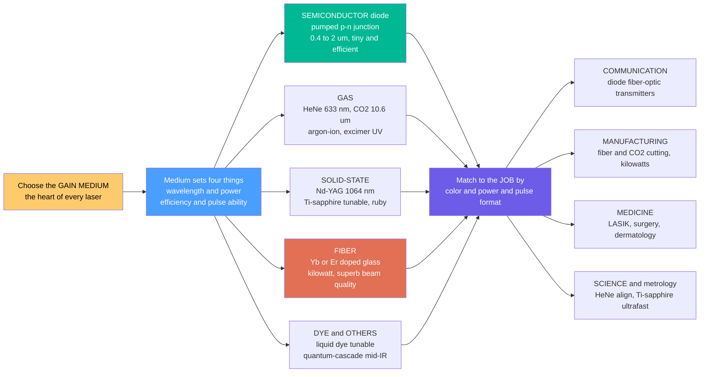

# 🌟 Types of Lasers

> [!abstract] TL;DR
> Every laser is built from the same three ingredients — a **gain medium**, a **pump**, and a **resonator** (mirrors) — but the **choice of gain medium** decides almost everything else: the **wavelength** (color, which sets what the beam interacts with), the achievable **power** (from a microwatt pointer to a multi-kilowatt cutter), the **efficiency**, and whether it can fire ultrashort **pulses**. That single choice sorts lasers into families — **semiconductor/diode**, **gas** (HeNe, CO₂, argon-ion, excimer), **solid-state** (Nd:YAG, Ti:sapphire, ruby), **fiber** (Yb, Er), and **dye** — spanning roughly twelve orders of magnitude in power and the whole spectrum from UV to far-infrared. Picking a laser is picking a tool: match wavelength, power, and pulse format to the job.

---

## Intuition

**Analogy — one recipe, many beasts.** Imagine every laser follows the same three-ingredient recipe: a **gain medium** (the stuff that amplifies light), a **pump** (the energy source that excites it), and two **mirrors** (a resonator that bounces light back and forth to build a beam). Swap out just the first ingredient — the gain medium — and you get wildly different animals, each with its own color, size, power, and temperament. The tiny **semiconductor diode** in your barcode scanner or fiber-optic transmitter is smaller than a grain of rice and sips a trickle of electricity. A **fiber laser** wound from a spool of glass can weld steel with a kilowatt beam. A **CO₂ gas laser** pours out invisible far-infrared that slices through inches of metal. A **solid-state Nd:YAG** handles industrial and medical jobs, and exotic **dye** or **Ti:sapphire** lasers paint every color of the rainbow or hammer out femtosecond pulses.

Picking a laser is exactly like picking a tool from a workshop. You match three things to the job: the **wavelength** — which decides what the light interacts with (glass, tissue, metal, air) — the **power** (a whisper to read a disc, a firehose to cut plate steel), and the **pulse behavior** (a steady continuous beam or a rapid-fire hammer of pulses). The whole zoo of laser types is what makes lasers useful *everywhere*, because no single type does everything. Knowing the zoo — each family's strengths — is how you choose the right light source.

---

## How It Works

### Core mechanics: the gain medium sets the personality

1. **Start from the shared skeleton.** All lasers need a gain medium that provides **optical gain** via stimulated emission, a **pump** to create the population inversion, and a **resonator** to provide feedback (see *Laser_Physics_and_Stimulated_Emission* and *Laser_Resonators_and_Gaussian_Beams*). What differs between families is entirely *what you put in the middle*.
2. **The medium fixes the wavelength.** The color comes from the medium's quantum transitions — a semiconductor's **bandgap**, a gas atom's **electronic levels**, a CO₂ molecule's **vibrational-rotational levels**, or a rare-earth ion's **4f levels** in a crystal or glass. You cannot freely dial the wavelength; you choose a medium that emits near the color you need.
3. **The medium fixes the power and efficiency.** How you can pump it, how it sheds heat, and how efficiently pump energy becomes photons all follow from the medium and its geometry. A thin **fiber** has enormous surface area to cool itself and guides its own beam, so it scales to kilowatts with superb beam quality; a **diode** converts electricity straight to light with no intermediate lamp, so it is the most efficient of all.
4. **The medium fixes the pulse capability.** A **broad gain bandwidth** (Ti:sapphire, ~650–1100 nm) can support femtosecond pulses; a **narrow** one (HeNe) gives an exquisitely pure but essentially continuous line. Bandwidth and pulse duration are linked by the time-bandwidth product (see *Ultrafast_and_Pulsed_Lasers*).
5. **Match medium to application.** Finally you pair the resulting wavelength + power + pulse format to the task: diode lasers for **communications**, fiber and CO₂ for **manufacturing**, Nd:YAG and excimer for **medicine**, HeNe and Ti:sapphire for **science and metrology**.

### Flow — from gain medium to the matched application



---

## Key Concepts

### Secondary Level

- **The three ingredients are always the same.** Gain medium (amplifies light), pump (feeds it energy), mirrors (build the beam). Change the **gain medium** and you change the laser's color, size, and power — that is how we sort lasers into families.
- **Color decides what the beam does.** A **red** diode reads a barcode; **green** Nd:YAG is easy to see and used in shows and medicine; **invisible infrared** from a CO₂ laser is absorbed by metal and water, so it cuts steel and does surgery; **ultraviolet** from an excimer laser reshapes the eye's cornea in LASIK.
- **Power spans an incredible range.** A laser pointer is about 1 milliwatt; an industrial fiber laser can be 10,000 watts — a factor of ten million. Same physics, hugely different scale.
- **Steady beam vs pulses.** Some lasers shine a **continuous** beam (a pointer, an alignment laser). Others fire **pulses** — brief, intense flashes — which are better for cutting cleanly, marking, or ultrafast science.
- **Lasers are everywhere.** Barcode scanners, DVD/Blu-ray players, fiber internet, laser printers, eye surgery, tattoo removal, metal cutting, laser levels, and light shows all use *different* laser types chosen for the job.

### Undergraduate Level

The organizing principle is **classification by gain medium**, because the medium determines wavelength, power, efficiency, and pulse capability.

- **Semiconductor / diode lasers** — a forward-biased **p-n junction** where electrons and holes recombine across the **bandgap** and emit photons; the crystal facets act as mirrors. Electrically pumped, so they turn electricity *directly* into light with the highest efficiency of any laser (30–60% wall-plug). Tiny, cheap, mass-produced, and tunable in wavelength by material choice (0.4–2 µm and beyond). They are the workhorses of **fiber-optic transmitters, barcode and disc readers, laser pointers, and laser printers**, and they **pump** most modern solid-state and fiber lasers. (See *Semiconductor_Light_Sources_LEDs_and_Laser_Diodes*.)
- **Gas lasers** — the gain medium is a gas or gas mixture, excited by an electric discharge:
  - **HeNe** (helium-neon, 632.8 nm red): low power (~1–10 mW), extremely stable and coherent — the classic **alignment and metrology** laser.
  - **CO₂** (10.6 µm far-infrared): very high power (up to ~10 kW) and efficient for a gas laser (~10–15%). Strongly absorbed by organic material and non-metals; the standard for **industrial cutting/welding/engraving and laser surgery**.
  - **Argon-ion** (488/514 nm blue-green): bright visible output but inefficient and power-hungry — historically used in displays, printing, and science.
  - **Excimer** (ArF 193 nm, KrF 248 nm, UV): pulsed, high-energy ultraviolet from a noble-gas-halide molecule that exists only in the excited state. Essential for **LASIK eye surgery** and **semiconductor photolithography**.
- **Solid-state lasers** — a crystal or glass **host** doped with active **rare-earth or transition-metal ions**, optically pumped by lamps or (now) diodes:
  - **Nd:YAG** (neodymium in yttrium-aluminum-garnet, 1064 nm): rugged, high-power, everywhere in **industrial and medical** work; often **frequency-doubled** to 532 nm green.
  - **Ti:sapphire** (titanium-doped sapphire, ~650–1100 nm): enormous gain bandwidth makes it **broadly tunable** and the **ultrafast-pulse workhorse** (femtosecond science).
  - **Ruby** (chromium in sapphire, 694 nm): the **first laser ever** (Maiman, 1960); mostly historical now.
  - **Yb** and **Er** doped crystals: also used, and dominant in fiber form.
- **Fiber lasers** — the gain medium is a **rare-earth-doped optical fiber** (Yb near 1 µm, Er near 1.5 µm), pumped by diodes through the cladding. The long thin geometry gives huge cooling area and a **built-in waveguide**, so fiber lasers reach kilowatts with **excellent beam quality and 30–40% efficiency**. They now **dominate industrial cutting, welding, and marking**. (See *Optical_Amplifiers_and_Gain_Media* — the same doped fiber amplifies telecom signals.)
- **Dye lasers** — the gain medium is a **liquid organic dye** with very broad emission, giving **wide tunability** across the visible. Historically vital for spectroscopy and the first tunable/ultrafast work; now largely displaced by solid-state and diode sources.
- **Key selection parameters** — beyond family, you compare: **wavelength** (interaction with the target material), **power and brightness**, **CW vs pulsed**, **beam quality** (how tightly it focuses), **efficiency**, **cost**, and **size**.

### Graduate Level

- **Why the medium sets the wavelength.** The emission photon energy equals the transition energy: a semiconductor's bandgap $E_g$ ($\lambda \approx 1240/E_g$ nm), a gas atom's electronic gap, a CO₂ molecule's asymmetric-stretch vibrational transition, or a rare-earth ion's shielded 4f–4f transition. Host and dopant fine-tune it (crystal-field splitting, Stark levels).
- **Three-level vs four-level systems.** Ruby is a hard-to-pump **three-level** system (the lower laser level is the ground state, so you must invert more than half the ions). Nd:YAG is an efficient **four-level** system (the lower laser level is nearly empty), which is why Nd:YAG easily lases continuously while ruby is naturally pulsed.
- **Brightness / radiance and beam quality.** What a laser can *do* at a workpiece is set by **brightness** (power per unit area per unit solid angle), captured by the **beam parameter product** and the $M^2$ factor. Fiber and diode-pumped solid-state lasers win partly because their brightness is high; a diode *bar* has high power but poor brightness, which is why bars are used to **pump** better-quality media rather than used directly.
- **Why fiber lasers scale.** The doped fiber has an enormous **surface-area-to-volume ratio** (efficient heat removal) and the core is a **single-mode waveguide** (beam quality set by the fiber, not by thermal lensing). **Double-clad pumping** couples cheap multimode diode light into the cladding, which the core absorbs over meters. Power scaling is ultimately limited by nonlinearities (SBS, SRS) and transverse mode instability.
- **Bandwidth and ultrafast capability.** The minimum pulse duration is set by the gain bandwidth through the time-bandwidth product ($\Delta\nu\,\Delta t \gtrsim 0.44$ for a Gaussian). Ti:sapphire's ~100 THz bandwidth supports sub-10 fs pulses; HeNe's ~1.5 GHz Doppler-broadened line supports only nanosecond-and-longer structure. This is the core reason Ti:sapphire and Yb (broad) dominate ultrafast work.
- **Frequency conversion extends the palette.** Nonlinear crystals **frequency-double** Nd:YAG 1064 nm to 532 nm green (and to 355/266 nm UV), and **optical parametric oscillators** driven by these lasers reach otherwise-inaccessible wavelengths — effectively multiplying the number of usable "colors" without new gain media.
- **Newer families.** **Quantum-cascade lasers (QCLs)** use engineered **intersubband** transitions in semiconductor superlattices to emit in the mid-IR to terahertz — wavelength set by layer thickness, not bandgap. **VCSELs** emit vertically for cheap arrays (data centers, 3D sensing). **On-chip / integrated photonic** lasers are an active frontier.
- **The historical/practical trend.** The field has moved decisively from lamp-pumped solid-state, gas, and dye lasers toward **diode**, **diode-pumped solid-state (DPSS)**, and **fiber** lasers — driven by efficiency, compactness, reliability, and beam quality. Gas and dye lasers survive where their specific wavelengths (CO₂ far-IR, excimer UV, dye tunability) remain hard to replace.

---

## Python Demo

```python
# The "laser zoo" in three panels:
#   (a) WAVELENGTH-POWER MAP : major laser families placed by wavelength (x) and
#       typical output power (y), both log scale -- the landscape of lasers
#   (b) WALL-PLUG EFFICIENCY : bar chart, why diode & fiber are replacing gas & dye
#   (c) GAIN BANDWIDTH       : narrow HeNe vs broad Ti:sapphire -> ultrafast capability
import numpy as np
import matplotlib.pyplot as plt

# ---------- (a) laser landscape: (name, wavelength_nm, power_W, family) ----------
lasers = [
    ("ArF excimer\n(LASIK, litho)",   193,   20.0,   "gas"),
    ("HeCd UV",                        442,   0.05,   "gas"),
    ("HeNe\n(alignment)",              633,   0.002,  "gas"),
    ("Diode pointer",                  650,   0.005,  "diode"),
    ("Argon-ion",                      488,   5.0,    "gas"),
    ("Dye (tunable)",                  590,   1.0,    "dye"),
    ("Ti:sapphire\n(ultrafast)",       800,   2.0,    "solid"),
    ("Diode pump bar",                 940,   1000.0, "diode"),
    ("Nd:YAG\n(industrial)",           1064,  500.0,  "solid"),
    ("Yb fiber\n(cutting)",            1070,  5000.0, "fiber"),
    ("Er fiber\n(telecom)",            1550,  0.01,   "fiber"),
    ("CO2\n(metal cutting)",           10600, 4000.0, "gas"),
]
fam_color = {"diode": "#e74c3c", "gas": "#3498db", "solid": "#2ecc71",
             "fiber": "#e67e22", "dye": "#9b59b6"}

fig, ax = plt.subplots(1, 3, figsize=(18, 5.2))

for name, wl, pw, fam in lasers:
    ax[0].scatter(wl, pw, s=90, color=fam_color[fam], edgecolor="k", zorder=5)
    ax[0].annotate(name, (wl, pw), textcoords="offset points",
                   xytext=(6, 6), fontsize=8)
# shade the visible band 380-750 nm
ax[0].axvspan(380, 750, color="yellow", alpha=0.12, label="visible band")
ax[0].set_xscale("log"); ax[0].set_yscale("log")
ax[0].set_xlabel("wavelength  [nm]  (UV  ->  visible  ->  infrared)")
ax[0].set_ylabel("typical output power  [W]")
ax[0].set_title("(a) The laser zoo:  wavelength vs power\n"
                "12 orders of magnitude in power, whole spectrum")
ax[0].grid(True, which="both", alpha=0.25)
handles = [plt.Line2D([0], [0], marker="o", ls="", color=c, label=f)
           for f, c in fam_color.items()]
ax[0].legend(handles=handles, title="gain-medium family", loc="lower left", fontsize=8)

# ---------- (b) wall-plug (electrical-to-optical) efficiency ----------
eff_names = ["Diode", "Yb fiber", "Nd:YAG\n(DPSS)", "CO2",
             "Nd:YAG\n(lamp)", "Excimer", "Ti:sapphire\n(wall-plug)",
             "Dye", "HeNe", "Argon-ion"]
eff_vals  = [55, 35, 20, 12, 3, 2, 1.0, 0.5, 0.1, 0.03]  # percent
eff_fam   = ["diode", "fiber", "solid", "gas", "solid", "gas",
             "solid", "dye", "gas", "gas"]
colors    = [fam_color[f] for f in eff_fam]
ax[1].barh(range(len(eff_names)), eff_vals, color=colors, edgecolor="k")
ax[1].set_yticks(range(len(eff_names)))
ax[1].set_yticklabels(eff_names, fontsize=8)
ax[1].set_xscale("log")
ax[1].set_xlabel("wall-plug efficiency  [percent, log scale]")
ax[1].set_title("(b) Efficiency: why diode & fiber win\n"
                "gas & dye are being displaced")
ax[1].invert_yaxis()
ax[1].grid(True, axis="x", which="both", alpha=0.25)

# ---------- (c) gain bandwidth: narrow HeNe vs broad Ti:sapphire ----------
wl = np.linspace(550, 1150, 2000)  # nm
def gauss(x, x0, fwhm):
    sig = fwhm / 2.3548
    return np.exp(-0.5 * ((x - x0) / sig) ** 2)
hene   = gauss(wl, 632.8, 2.0)     # HeNe ~ effectively a line (widened here to be visible)
ndyag  = gauss(wl, 1064.0, 8.0)    # Nd:YAG moderately narrow
tisapp = gauss(wl, 800.0, 230.0)   # Ti:sapphire very broad -> femtosecond pulses
ax[2].plot(wl, hene,   lw=2, color="#e74c3c", label="HeNe 633 nm (narrow -> CW)")
ax[2].plot(wl, ndyag,  lw=2, color="#2ecc71", label="Nd:YAG 1064 nm (moderate)")
ax[2].fill_between(wl, tisapp, color="#3498db", alpha=0.35)
ax[2].plot(wl, tisapp, lw=2, color="#2c3e50",
           label="Ti:sapphire ~800 nm (broad -> femtosecond)")
ax[2].set_xlabel("wavelength  [nm]")
ax[2].set_ylabel("normalized gain / emission")
ax[2].set_title("(c) Gain bandwidth sets pulse limit\n"
                "broad bandwidth = shorter pulses")
ax[2].legend(fontsize=8)
ax[2].grid(True, alpha=0.25)

plt.tight_layout()
plt.savefig("laser_zoo_landscape.png", dpi=120)
plt.show()

# ---- Numerical readouts ----
powers = np.array([p for _, _, p, _ in lasers])
print(f"Power span of the zoo: {powers.min():.0e} W  ->  {powers.max():.0e} W  "
      f"= {powers.max()/powers.min():.0e}x")
# Minimum pulse duration from time-bandwidth product (Gaussian: dnu*dt >= 0.44)
c = 3e8
for name, wl0, dl in [("HeNe", 632.8e-9, 0.002e-9),
                      ("Ti:sapphire", 800e-9, 230e-9)]:
    dnu = c * dl / wl0**2          # bandwidth in Hz from wavelength FWHM
    dt_min = 0.441 / dnu           # transform-limited Gaussian pulse
    print(f"{name:12s}: bandwidth ~ {dnu:.2e} Hz  ->  min pulse ~ {dt_min*1e15:.1f} fs")
# -> Power span ~ 2e-3 W to 5e3 W  = ~2e6x across the zoo
# -> HeNe bandwidth ~1.5e9 Hz -> ~0.3 ns floor;  Ti:sapphire ~1e14 Hz -> a few fs
```

Panel **(a)** is the map of the laser zoo: each family plotted by **wavelength** (from 193 nm ArF excimer in the UV, through the visible diodes and HeNe, out to the 10.6 µm CO₂ far-IR) and **power** (from milliwatt HeNe and pointers up to the multi-kilowatt Yb fiber and CO₂ cutters). The colored regions show that no single family covers the whole landscape — you pick your spot on the map to match the application. Panel **(b)** ranks **wall-plug efficiency**: diode and fiber lasers convert 30–55% of electricity into light, while gas and dye lasers waste 99%+ — the quantitative reason the industry has migrated to diode/DPSS/fiber. Panel **(c)** shows why **gain bandwidth** matters: HeNe's razor-thin line makes a superbly pure continuous beam but cannot form short pulses, whereas Ti:sapphire's enormous bandwidth supports transform-limited femtosecond pulses — the same physics that makes it the ultrafast workhorse.

---

## Real-World Applications

- **Fiber-optic communication (diode + Er-fiber).** Every strand of the internet backbone is fed by **semiconductor diode lasers** modulating light at 1310/1550 nm, and **erbium-doped fiber amplifiers** boost it across oceans — the exact wavelengths chosen for silica's low-loss transparency windows.
- **Industrial manufacturing (fiber + CO₂).** **Yb fiber lasers** (1 µm) now dominate metal **cutting, welding, and marking** thanks to kilowatt power and superb beam quality; **CO₂ lasers** (10.6 µm) still rule for non-metals like acrylic, wood, textiles, and glass because those materials absorb far-IR strongly.
- **Medicine (excimer, Nd:YAG, diode, CO₂).** **Excimer** UV reshapes the cornea in **LASIK** and drives photolithography; **frequency-doubled Nd:YAG** (532 nm green) treats the retina and vascular lesions; **diode and Nd:YAG** power dermatology (hair/tattoo removal); **CO₂** is a precise surgical scalpel that cauterizes as it cuts.
- **Consumer technology (diode).** **Semiconductor diode lasers** read **barcodes**, play **CD/DVD/Blu-ray** discs (780/650/405 nm — shorter wavelength packs more data), drive **laser printers**, and make **pointers** and **optical mice**.
- **Science and metrology (HeNe, Ti:sapphire, Nd:YAG).** **HeNe** lasers align machines and interferometers; **Ti:sapphire** femtosecond lasers underpin ultrafast spectroscopy, frequency combs, and multiphoton microscopy; frequency-doubled **Nd:YAG** pumps countless lab systems.
- **Defense and sensing.** High-power **fiber and slab solid-state lasers** are the basis of directed-energy weapons and rangefinders; **diode and fiber** lasers drive LIDAR for autonomous vehicles and mapping.

---

## Common Pitfalls

- **Thinking "a laser is a laser."** The family determines what is even *possible*. You cannot cut steel with a HeNe or align an interferometer with a raw kilowatt diode bar. Always start from **wavelength + power + pulse format**, then pick the family.
- **Ignoring wavelength-material interaction.** Beam-to-target coupling depends on **absorption at that wavelength**: 1 µm fiber/Nd:YAG light couples well to metals; 10.6 µm CO₂ light is reflected by shiny metals but devoured by plastics, glass, and tissue (water). Choosing the wrong color wastes most of the power.
- **Confusing power with brightness.** A diode *bar* can output kilowatts but focuses poorly (low brightness), so it is used to **pump** better media, not to cut directly. Beam quality ($M^2$) matters as much as raw watts for what happens at the focus.
- **Assuming any laser can be pulsed short.** Pulse duration is bounded by **gain bandwidth**. A narrow-line HeNe or single-frequency source cannot make femtosecond pulses; that needs a broadband medium (Ti:sapphire, Yb) plus mode-locking.
- **Underrating diode and fiber lasers because they are small.** Their compactness hides the fact that they are the **most efficient and highest-brightness** options and have displaced the bulky gas/lamp systems in most modern applications.
- **Forgetting laser safety scales with type.** A milliwatt pointer and a kilowatt fiber laser are both "lasers" but sit in wildly different **hazard classes**; invisible IR (CO₂, fiber, Nd:YAG) is especially dangerous because you get no blink reflex, and reflections can injure at a distance.
- **Treating "tunable" as free.** Only certain media (Ti:sapphire, dye, some diodes, OPOs) tune over a range; most lasers emit essentially fixed wavelengths set by their transitions, and reaching new colors requires **nonlinear frequency conversion**, not a knob.

---

## Related Concepts

**Within this vault (Optics and Photonics):**

- [[Optics_and_Photonics_Overview]] — the parent map of the field; this note is the applied heart of the lasers-and-light-sources pillar, cataloguing the families that later notes analyze in depth.

**Physics foundations:**

- [[Laser_Physics]] — stimulated emission, population inversion, three- vs four-level systems, and resonators: the shared skeleton that every family in this note is built on.

**Electrical engineering (the device and systems view):**

- [[Photonics_and_Optoelectronics]] — how laser diodes, LEDs, detectors, and modulators are engineered and integrated into communication and sensing systems.

**Materials science (where the gain and the color come from):**

- [[Semiconductors_Intrinsic_and_Extrinsic]] — the bandgap physics that fixes a diode laser's wavelength and makes electrical pumping possible.
- [[p_n_Junctions_and_Diodes]] — the junction whose electron-hole recombination *is* the gain mechanism of a semiconductor laser.
- [[Optical_Properties_and_Photonic_Materials]] — the rare-earth-doped hosts, absorption/emission spectra, and refractive properties behind solid-state and fiber gain media.

**Manufacturing (the biggest industrial application):**

- [[Manufacturing_Processes]] — where fiber and CO₂ laser cutting, welding, drilling, and marking fit among conventional processes.
- [[Additive_and_Subtractive_Manufacturing]] — laser cutting/ablation (subtractive) and laser powder-bed fusion / sintering (additive), both powered by fiber and CO₂ lasers.

*Sibling notes in this section (to be built): Laser_Physics_and_Stimulated_Emission (the gain and inversion mechanism), Laser_Resonators_and_Gaussian_Beams (the mirrors and beam shape shared by all types), Semiconductor_Light_Sources_LEDs_and_Laser_Diodes (the diode family in depth), Ultrafast_and_Pulsed_Lasers (Q-switching and mode-locking that turn broadband media into pulse hammers), and Optical_Amplifiers_and_Gain_Media (the doped fiber/crystal gain shared by fiber lasers and telecom amplifiers).*

---

## Review Questions

1. **(Secondary)** All lasers share three ingredients — a gain medium, a pump, and mirrors — yet a laser pointer, a metal-cutting laser, and a LASIK laser behave completely differently. Which single ingredient is mostly responsible for those differences, and name the three things it decides about the beam. Why can't you cut steel with a red laser pointer?
2. **(Undergraduate)** You must choose a laser for (a) transmitting data down an optical fiber, (b) cutting 5 mm steel plate, and (c) engraving acrylic and wood. For each, name a suitable laser family and its wavelength, and justify the choice in terms of wavelength-material interaction, power, and efficiency. Why has the industry largely replaced CO₂ lasers with **fiber** lasers for the *metal*-cutting job but not for the acrylic job?
3. **(Graduate)** Ti:sapphire and HeNe both lase in/near the visible, yet only Ti:sapphire produces femtosecond pulses while HeNe is prized for its ultra-pure continuous line. (a) Explain the trade-off using gain bandwidth and the time-bandwidth product. (b) Explain why **fiber** lasers scale to kilowatts with excellent beam quality where a bulk rod struggles, referring to thermal management and the waveguide. (c) A customer needs 200 W of clean 532 nm green light; outline a realistic architecture (gain medium, pump, and any frequency conversion) and say why you would not simply buy a "532 nm laser medium."

---

## Sources

- Svelto, O. — *Principles of Lasers*, 5th ed. (Springer) — comprehensive survey of laser types, gain media, and pumping.
- Siegman, A. E. — *Lasers* (University Science Books) — authoritative treatment of resonators, gain, and laser physics across families.
- Saleh, B. E. A. & Teich, M. C. — *Fundamentals of Photonics*, 3rd ed. (Wiley) — semiconductor, gas, solid-state, and fiber lasers within a unified photonics framework.
- Silfvast, W. T. — *Laser Fundamentals*, 2nd ed. (Cambridge) — clear physical development of each laser class and its applications.
- Paschotta, R. — *RP Photonics Encyclopedia* (rp-photonics.com) — practical reference on fiber, diode, DPSS, and specialty lasers.

---

#optics #lasers #laser-types #gain-medium #fiber-laser
