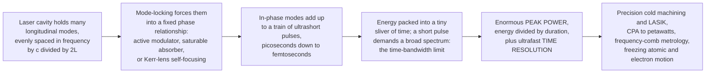

# ⚡ Ultrafast and Pulsed Lasers

> [!abstract] TL;DR
> Instead of pouring out a steady stream of light, a laser can concentrate its energy in **time**, firing pulses as short as a few **femtoseconds** ($10^{-15}\,\text{s}$ — light itself crosses less than a hair's width in that time). This buys two superpowers. First, cramming even a modest energy into so brief a sliver yields an **enormous peak power** ($P_\text{peak}=U/\tau$: a nanojoule in a femtosecond is a **megawatt**), driving nonlinear physics and **cold, clean ablation** that machines materials before heat can spread — the basis of femtosecond LASIK. Second, the pulse is the world's fastest **strobe**, freezing the motion of atoms and electrons so we can film chemical reactions (**femtochemistry**) and electron dynamics (**attosecond science**). Short pulses come from **Q-switching** (dump stored energy in a giant nanosecond spike) and, for the shortest, **mode-locking** (force the cavity's many longitudinal modes into a fixed phase so they interfere into a train of ultrashort pulses). Because short pulses demand broad spectra (the **time-bandwidth** / Fourier limit), ultrafast lasers are inherently broadband (Ti:sapphire, fiber); **chirped-pulse amplification** (2018 Nobel) stretches–amplifies–recompresses them to petawatts, and a stabilized mode-locked spectrum becomes an **optical frequency comb** (2005 Nobel) — a ruler for light.

## Intuition

**Analogy:** A normal laser is like a garden hose running a steady jet of water. An ultrafast laser is like taking that same water and squeezing it into a machine that fires it in unimaginably brief, violent **bursts** — flashes lasting femtoseconds, millionths of a billionth of a second. In one femtosecond, light — the fastest thing there is — travels less than the width of a human hair.

Squeezing energy into so tiny a moment of time does two magical things. **First**, because all the energy is crammed into such a sliver, even a modest amount of energy becomes an *enormous instantaneous power* — enough to cut, ablate, and machine materials so fast that the heat has no time to spread into the surroundings. The result is a clean **cold cut**, which is exactly how a femtosecond laser reshapes your cornea in LASIK without cooking the neighbouring tissue. **Second**, the pulse acts as the world's fastest **strobe light**: just as a strobe freezes a hummingbird's wings, a femtosecond flash freezes the motion of atoms mid-reaction and even electrons mid-leap — letting scientists film events faster than anything else humans can observe. The trick to *making* such pulses (**mode-locking**) is to get all of the laser's colours marching in phase, so that for one brief instant they stack up into a towering spike, then cancel, then spike again — a train of flashes.

---

## How It Works

### Core Mechanics

1. **Why concentrate light in time?** A laser stores or emits some **energy** $U$. Spread it over a long time and you get modest power; squeeze it into a duration $\tau$ and the **peak power** $P_\text{peak}\approx U/\tau$ explodes. A 1 nJ pulse (tiny — a green LED emits far more per second) compressed into 1 fs delivers $10^{-9}/10^{-15}=10^{6}\,\text{W}$, a **megawatt**, for that instant. This concentration is the whole point: it unlocks (1) high-intensity and **nonlinear** processes and precision machining, and (2) ultrafast **time resolution**, because a probe can only resolve events longer than its own duration.
2. **Q-switching — the giant nanosecond spike.** The cavity's quality factor $Q$ (how well it stores light) is deliberately **spoiled** (a shutter, an acousto-optic cell) so the gain medium keeps absorbing pump energy without lasing — building a huge **population inversion**. Then $Q$ is suddenly **restored**; the stored energy dumps in one intense **nanosecond** pulse. Simple and energetic — this is the workhorse of laser marking, engraving, rangefinding, and LIDAR.
3. **Mode-locking — the femtosecond route.** A laser cavity of length $L$ supports many **longitudinal modes**, evenly spaced in frequency by the free spectral range $\Delta f = c/2L$. Normally each mode oscillates with a random, drifting phase and they wash out into a noisy continuous-wave average. **Mode-locking** forces them all into a **fixed phase relationship**. In-phase modes interfere constructively at one instant per round trip and destructively elsewhere, producing a **train of ultrashort pulses** spaced by the round-trip time $1/\Delta f$.
4. **Active vs passive locking.** *Active* mode-locking drives an intracavity modulator at exactly $\Delta f$, gating the light into pulses. *Passive* mode-locking is faster and self-organising: a **saturable absorber** (a SESAM, or a real dye) absorbs weak light but bleaches transparent for intense spikes, so the cavity favours a single tall pulse; **Kerr-lens mode-locking** uses the intensity-dependent self-focusing of the gain crystal itself (a nonlinear-optics effect) as an artificial fast absorber — the trick behind sub-100-fs Ti:sapphire lasers.
5. **The time-bandwidth product (the Fourier limit).** A short pulse in time *requires* a broad spectrum in frequency: $\Delta t \cdot \Delta \nu \gtrsim K$ (order unity; $K\approx0.44$ for a Gaussian). This is the same Fourier/uncertainty relation as $\Delta E\,\Delta t\gtrsim\hbar$. So ultrafast lasers are inherently **broadband** — a 10 fs pulse spans hundreds of nanometres — which is why Ti:sapphire (huge gain bandwidth) and broadband fibre are the classic ultrafast media.
6. **Propagation: dispersion stretches, chirp corrects.** In glass and air, red and blue travel at slightly different speeds (**group-velocity dispersion**, GVD). A short pulse, being broadband, therefore **broadens** and becomes **chirped** (colours arrive at different times) as it propagates. Ultrafast systems fight this with **chirped mirrors**, prism pairs, and grating compressors that impose the opposite delay.
7. **Chirped-pulse amplification (CPA).** To reach extreme energies you cannot simply amplify a femtosecond pulse — its peak intensity would destroy the amplifier. CPA (Strickland & Mourou, **2018 Nobel Prize**) first **stretches** the pulse in time by $10^3$–$10^4\times$ with a grating (dropping the peak power), safely **amplifies** the now-long pulse, then **recompresses** it — reaching terawatt to **petawatt** powers.
8. **Nonlinear pulse effects and the frequency comb.** At high peak intensity, **self-phase modulation** (the Kerr effect) generates new colours; driven in microstructured fibre this becomes an octave-spanning **supercontinuum**. A stabilized mode-locked spectrum is a **frequency comb**: a picket fence of perfectly evenly spaced, razor-sharp lines at $f_n = f_\text{ceo} + n\,\Delta f$ — a "ruler for light" (Hänsch & Hall, **2005 Nobel Prize**) that underpins optical atomic clocks and precision metrology.

### Flow / Architecture



---

## Key Concepts

### Secondary Level

**A steady beam vs a train of flashes.** An ordinary laser pointer emits light continuously (called *continuous-wave*, CW). An ultrafast laser instead emits its light as a rapid **train of extremely short pulses**. The total average power can be modest, but because each flash is squeezed into so short a time, the power *during* the flash is gigantic.

**Why short pulses are so powerful.** Power is energy divided by time. Keep the energy the same but make the time thousands of times shorter, and the power during the pulse becomes thousands of times larger. This is why a femtosecond laser can vaporise a pinpoint of material instantly, before the heat has time to spread — giving a clean, **cold** cut. Femtosecond **LASIK** eye surgery uses exactly this to sculpt the cornea without burning the tissue around it.

**Why short pulses freeze motion.** A camera with a very fast shutter freezes a fast-moving object into a sharp photo. A femtosecond pulse is a shutter a *billion* times faster than the best mechanical camera — fast enough to catch atoms rearranging during a chemical reaction. Scientists won Nobel Prizes for using these flashes to "film" molecules and electrons in motion.

**How you make them: get the colours in step.** A laser actually contains many closely spaced colours (frequencies). Normally they are jumbled and average out. If you force them all to peak at the same instant — **mode-locking** — they briefly stack into a towering spike of light, then cancel out, then spike again: a train of ultrashort pulses.

### Undergraduate Level

**Peak power, average power, and duty cycle.** For a pulse train with repetition rate $f_\text{rep}$, pulse energy $U$, and duration $\tau$:
$$P_\text{avg}=U\,f_\text{rep},\qquad P_\text{peak}\approx\frac{U}{\tau}=\frac{P_\text{avg}}{\tau f_\text{rep}}.$$
The ratio $P_\text{peak}/P_\text{avg}=1/(\tau f_\text{rep})$ can be $10^{5}$–$10^{6}$: a 1 W-average, 100 MHz, 100 fs oscillator has $\sim100\,\text{kW}$ peaks. This is why a "1 watt" ultrafast laser routinely triggers nonlinear effects a 1 W CW laser never could — nonlinear response scales with *instantaneous* intensity.

**Q-switching vs mode-locking — two different jobs.** *Q-switching* stores energy in the gain medium, then releases it as **one** big **nanosecond** pulse at kHz rates (high pulse energy, moderate speed — marking, ranging). *Mode-locking* produces a continuous **train** of **pico- to femtosecond** pulses at MHz–GHz rates (shortest duration, highest peak power). They can be combined (Q-switched mode-locking) but answer different needs.

**The mode-locking picture, quantitatively.** Sum $N$ equal-amplitude modes with spacing $\Delta f$ and locked phases:
$$E(t)=\sum_{n} e^{\,i2\pi(f_0+n\Delta f)t}\;\Rightarrow\; I(t)\propto\left[\frac{\sin(N\pi\Delta f\,t)}{\sin(\pi\Delta f\,t)}\right]^2.$$
This is a pulse train with period $1/\Delta f$, **peak intensity $\propto N^2$** (versus $\propto N$ for the CW average — the concentration), and pulse width $\approx 1/(N\Delta f)$ = one over the total locked **bandwidth**. More locked modes (wider spectrum) → shorter pulse.

**The time-bandwidth product.** $\Delta t\,\Delta\nu\gtrsim K$ ($K\approx0.315$ for a $\operatorname{sech}^2$ pulse, $0.441$ for a Gaussian). A **transform-limited** pulse hits the equality; excess bandwidth "wasted" as **chirp** makes the pulse longer than necessary. Reaching 5 fs at 800 nm needs a spectrum spanning most of the visible-to-near-IR — hence Ti:sapphire, whose $\sim$400 nm gain bandwidth is the enabler.

**Dispersion management.** Group-velocity dispersion (GVD), quantified by the group-delay dispersion in $\text{fs}^2$, stretches a transform-limited pulse. Positive-GVD material (glass) is compensated by negative-GVD elements — **prism pairs**, **grating pairs**, or **chirped mirrors** whose layers reflect different colours at different depths — so the pulse recompresses at the target. See the sibling note on Dispersion_and_Optical_Properties_of_Materials.

### Graduate Level

**Kerr-lens mode-locking (KLM).** The gain crystal's intensity-dependent index $n=n_0+n_2I$ makes an intense beam **self-focus**; a well-placed aperture (hard or "soft", via gain overlap) then favours the high-intensity spatial mode — an **artificial saturable absorber** with femtosecond response. KLM in Ti:sapphire, balanced against intracavity dispersion so that self-phase modulation and GVD form a **soliton-like** steady state, produces sub-two-cycle pulses. The interplay of Kerr nonlinearity and dispersion is where ultrafast optics meets the sibling topic Nonlinear_Optics.

**Chirped-pulse amplification, in detail.** Stretch by a factor $S$ ($\sim10^3$–$10^4$) with a grating stretcher; the reduced peak intensity keeps the amplifier below its damage fluence and below the critical **B-integral** (accumulated nonlinear phase) that would otherwise wreck beam quality. Amplify in Ti:sapphire, Yb, or Nd media; recompress in a grating compressor whose dispersion exactly cancels the stretcher plus material. CPA scaled peak powers from gigawatts to the **petawatt** class (e.g. tens of joules in tens of femtoseconds), enabling relativistic laser–plasma physics, laser wakefield electron acceleration, and high-harmonic generation. Awarded half the **2018 Nobel Prize in Physics** (Strickland, Mourou).

**Supercontinuum and self-phase modulation.** With $n=n_0+n_2I$, the time-varying intensity of a pulse imprints a time-varying phase $\phi(t)=-\,\omega_0 n_2 I(t) L/c$, whose derivative is an **instantaneous frequency shift** — new colours on the leading (redshifted) and trailing (blueshifted) edges. In photonic-crystal fibre, SPM plus dispersion, four-wave mixing, and soliton fission explode a pulse into an **octave-spanning supercontinuum**, the coherent "white-light laser" that makes the frequency comb self-referenceable.

**The frequency comb and $f$–$2f$ self-referencing.** A mode-locked spectrum is $f_n=f_\text{ceo}+n\,\Delta f$, where $\Delta f=f_\text{rep}$ (the pulse repetition rate) and $f_\text{ceo}$ is the **carrier-envelope offset** frequency arising from the difference between phase and group velocity in the cavity. Measuring $\Delta f$ is easy (a photodiode); pinning $f_\text{ceo}$ uses **$f$–$2f$ interferometry**: frequency-double the red end of an octave-spanning comb and beat it against the blue end, yielding $f_\text{ceo}$ directly. Stabilising both makes every one of the $\sim10^5$–$10^6$ comb lines an absolute optical-frequency reference — the mechanism behind optical atomic clocks and the **2005 Nobel Prize** (Hänsch, Hall). The comb *is* the gear train linking optical ($\sim10^{14}$ Hz) frequencies to countable microwave rates.

**Attosecond science.** Focusing a few-cycle femtosecond pulse into a gas drives **high-harmonic generation**; the recolliding electron emits a burst of extreme-UV light lasting **attoseconds** ($10^{-18}\,\text{s}$) — short enough to resolve electron motion inside atoms. Recognised by the **2023 Nobel Prize in Physics** (Agostini, Krausz, L'Huillier). Ultrafast optics is thus the tool that pushed time resolution from chemistry (femto) to electron dynamics (atto).

---

## Python Demo

```python
# Ultrafast & pulsed lasers, visualized:
#   (a) MODE-LOCKING: sum many equally spaced cavity modes (a frequency comb).
#       IN PHASE (locked) -> a clean TRAIN of ultrashort pulses whose peak
#       intensity scales as N^2. RANDOM phases (not locked) -> noise with the
#       SAME average power but no clean pulses.
#   (b) TIME-BANDWIDTH LIMIT: more locked modes / wider bandwidth -> SHORTER
#       pulse, with pulse-width * bandwidth ~ constant (the Fourier limit).
#   (c) PEAK POWER: for a fixed pulse energy, peak power = energy / duration,
#       so a shorter pulse means an astronomically higher peak power
#       (1 nJ in 1 fs is 1 MW; the same nJ in 1 ns is only 1 W).
#
# numpy + matplotlib only (self-contained, no scipy).

import numpy as np
import matplotlib.pyplot as plt

rng = np.random.default_rng(0)

# ---------------------------------------------------------------
# (a) Mode-locking: sum of N equally spaced longitudinal modes
# ---------------------------------------------------------------
df = 1.0                                   # mode spacing = free spectral range (a.u.)
N  = 21                                    # number of longitudinal modes
n  = np.arange(N) - N // 2                 # mode indices, centered on f0
t  = np.linspace(-2.0, 2.0, 4000)          # time in units of the round-trip 1/df

def intensity(phases):
    # coherent sum of N modes at frequencies n*df with the given phases
    E = np.exp(1j * (2 * np.pi * np.outer(t, n) * df + phases)).sum(axis=1)
    return np.abs(E) ** 2

I_locked = intensity(np.zeros(N))                       # all in phase  -> pulses
I_random = intensity(rng.uniform(0, 2 * np.pi, N))      # random phases -> noise

# ---------------------------------------------------------------
# (b) Time-bandwidth: pulse width vs number of locked modes
#     use the Dirichlet-kernel intensity of N in-phase modes (peak = 1)
# ---------------------------------------------------------------
def norm_pulse(tt, Nk, df):
    num = np.sin(Nk * np.pi * df * tt)
    den = Nk * np.sin(np.pi * df * tt)
    out = np.ones_like(tt)                              # limit -> 1 where den -> 0
    ok = np.abs(den) > 1e-9
    out[ok] = (num[ok] / den[ok]) ** 2
    return out

Ns   = np.arange(3, 81, 2)                              # try many mode counts
tt   = np.linspace(-0.5, 0.5, 40001)                    # one period, one central pulse
fwhm = np.empty(Ns.size)
for i, Nk in enumerate(Ns):
    I = norm_pulse(tt, Nk, df)
    above = tt[I >= 0.5]                                # full width at half maximum
    fwhm[i] = above.max() - above.min()

bandwidth = Ns * df                                     # total spectral width ~ N*df
tb_product = fwhm * bandwidth                           # ~ constant (Fourier limit)

# ---------------------------------------------------------------
# (c) Peak power vs pulse duration for a FIXED pulse energy
# ---------------------------------------------------------------
U      = 1e-9                                           # 1 nanojoule per pulse
dur    = np.logspace(-15, -9, 200)                      # 1 fs ... 1 ns
P_peak = U / dur                                        # peak power = energy / duration

# ---------------------------------------------------------------
# Plot: 2 x 2 grid
# ---------------------------------------------------------------
fig, ax = plt.subplots(2, 2, figsize=(14, 9))

# (0,0) mode-locked pulse train
ax[0, 0].plot(t, I_locked, color="C3", lw=1.5)
ax[0, 0].axhline(N, ls=":", color="gray", lw=1)
ax[0, 0].annotate("CW average ~ N", (t[0], N), textcoords="offset points",
                  xytext=(6, 4), fontsize=8, color="gray")
ax[0, 0].set_title(f"(a) MODE-LOCKED: {N} modes in phase -> pulse train, peak ~ N^2")
ax[0, 0].set_xlabel("time (round-trip periods 1/df)")
ax[0, 0].set_ylabel("intensity (a.u.)")

# (0,1) random phases -> noise, same average power
ax[0, 1].plot(t, I_random, color="C0", lw=1.0)
ax[0, 1].axhline(N, ls=":", color="gray", lw=1)
ax[0, 1].set_title("(a') NOT locked: random phases -> noise, no clean pulses")
ax[0, 1].set_xlabel("time (round-trip periods 1/df)")
ax[0, 1].set_ylabel("intensity (a.u.)")
ax[0, 1].set_ylim(ax[0, 0].get_ylim())                 # same scale to compare peaks

# (1,0) time-bandwidth: FWHM shrinks as 1/N; product ~ const
ax[1, 0].plot(Ns, fwhm, "o-", color="C2", ms=4, label="pulse FWHM (~ 1/N)")
ax[1, 0].set_xlabel("number of locked modes N  (~ bandwidth)")
ax[1, 0].set_ylabel("pulse FWHM (periods)")
ax[1, 0].set_title("(b) More modes / wider bandwidth -> shorter pulse")
axb = ax[1, 0].twinx()
axb.plot(Ns, tb_product, "s--", color="C1", ms=3, label="FWHM * bandwidth")
axb.set_ylabel("time-bandwidth product", color="C1")
axb.set_ylim(0, 2 * tb_product.mean())
axb.axhline(tb_product.mean(), ls=":", color="C1", lw=1)
ax[1, 0].legend(loc="upper right", fontsize=8)

# (1,1) peak power vs duration for fixed energy
ax[1, 1].loglog(dur, P_peak, color="C3", lw=2)
for tau, tag in [(1e-15, "1 fs -> 1 MW"), (1e-12, "1 ps -> 1 kW"),
                 (1e-9, "1 ns -> 1 W")]:
    ax[1, 1].plot(tau, U / tau, "ko", ms=5)
    ax[1, 1].annotate(tag, (tau, U / tau), textcoords="offset points",
                      xytext=(8, -2), fontsize=8)
ax[1, 1].set_xlabel("pulse duration (s)")
ax[1, 1].set_ylabel("peak power (W)")
ax[1, 1].set_title("(c) Fixed 1 nJ energy: shorter pulse = higher peak power")
ax[1, 1].grid(True, which="both", alpha=0.3)

plt.tight_layout()
plt.savefig("ultrafast_pulsed_lasers.png", dpi=120)
print("Saved ultrafast_pulsed_lasers.png")

# --- Numeric sanity checks ---
print(f"locked peak / average    : {I_locked.max() / N:6.1f}  (theory = N = {N})")
print(f"random peak / average    : {I_random.max() / N:6.1f}  (much smaller)")
print(f"time-bandwidth product   : {tb_product.mean():.3f} +/- {tb_product.std():.3f} (near-constant)")
print(f"peak power, 1 nJ in 1 fs : {U / 1e-15:.2e} W")
```

Running it confirms the mechanism: the in-phase modes stack into a sharp pulse train whose peak is $\sim N$ times the CW average (peak intensity $\propto N^2$), while the *same* modes with random phases give featureless noise of equal average power. Panel (b) shows the pulse FWHM shrinking as $1/N$ while the time-bandwidth product stays essentially constant — the Fourier limit that forces ultrafast lasers to be broadband. Panel (c) is the peak-power payoff: holding the energy at 1 nJ, compressing from a nanosecond to a femtosecond lifts the peak power from **1 W to 1 MW**, six orders of magnitude, purely by concentrating the same energy in time.

---

## Real-World Applications

- **Precision cold micromachining and femtosecond LASIK.** Femtosecond pulses ablate material by nonlinear (multiphoton) ionisation faster than heat can diffuse, giving burr-free "cold" cuts with sub-micron precision. This drives femtosecond **LASIK** and cataract surgery (a femtosecond laser cuts the corneal flap), medical-stent cutting, and micromachining of glass, polymers, and semiconductors.
- **Chirped-pulse-amplification high-field science.** CPA petawatt lasers reach focused intensities above $10^{22}\,\text{W/cm}^2$, enabling laser–plasma **wakefield accelerators** (GeV electrons in centimetres), laser-driven ion sources for radiotherapy research, inertial-confinement fusion drivers, and studies of matter under extreme fields.
- **Femtochemistry and attosecond science.** Pump–probe experiments with femtosecond pulses record the making and breaking of chemical bonds in real time (Zewail's 1999 Nobel), while attosecond extreme-UV bursts from high-harmonic generation resolve electron motion — a direct probe of the fast dynamics studied in reaction kinetics.
- **Multiphoton and second-harmonic microscopy.** Two-photon excitation requires the huge peak intensity of femtosecond pulses; because absorption happens only at the tight focus, these microscopes image deep into living tissue with intrinsic optical sectioning and minimal out-of-focus damage — a mainstay of neuroscience imaging.
- **Optical frequency combs: clocks, metrology, and LIDAR.** Stabilised mode-locked combs are the gear-train of **optical atomic clocks** (accurate to $\sim10^{-18}$), enable dual-comb molecular spectroscopy, calibrate astronomical spectrographs hunting exoplanets, and power precision ranging and coherent LIDAR.
- **Telecommunications and fibre lasers.** Mode-locked fibre lasers generate the picosecond pulse trains and comb sources used in high-bit-rate optical communications and as robust, turnkey ultrafast sources for industry.

---

## Common Pitfalls

- **Confusing average power with peak power.** A "2 W" ultrafast laser can carry megawatt peaks; the average number says nothing about the damage, nonlinearity, or ablation it can drive. Always ask for pulse energy, duration, and repetition rate — peak power is $U/\tau$, not the average.
- **Expecting an arbitrarily short pulse from a narrowband laser.** The time-bandwidth product forbids it: a 10 fs pulse *needs* a spectrum hundreds of nm wide. A narrow-linewidth laser can never be ultrafast, no matter the mode-locking scheme; you are limited by the gain bandwidth.
- **Ignoring dispersion between source and target.** A transform-limited pulse at the laser is *not* transform-limited after metres of fibre, a microscope objective, or even air — GVD stretches and chirps it. Sub-100 fs work demands explicit dispersion compensation (chirped mirrors, prism/grating compressors) right up to the sample plane.
- **Amplifying femtosecond pulses directly.** Trying to boost a femtosecond pulse without stretching first drives self-focusing, filamentation, and optical damage (a large B-integral). Chirped-pulse amplification exists precisely because you must stretch, amplify, then recompress.
- **Assuming a mode-locked spectrum is automatically a metrology-grade comb.** The comb lines are evenly spaced, but their absolute position depends on the **carrier-envelope offset** $f_\text{ceo}$; without stabilising both $f_\text{rep}$ and $f_\text{ceo}$ (via $f$–$2f$ self-referencing) the "ruler" has an unknown, drifting zero.
- **Overlooking nonlinear damage from the pulse itself.** High peak intensity that is wonderful for ablation is disastrous for delicate optics: coatings, fibres, and modulators have peak-intensity (not just average-power) damage thresholds. Ultrafast systems live near those limits by design.

---

## Related Concepts

Glob-verified cross-vault wikilinks:

- [[Laser_Physics]] — ultrafast lasers are built on stimulated emission, population inversion, gain bandwidth, and longitudinal cavity modes; mode-locking and Q-switching are ways of shaping *when* that gain is released
- [[Fourier_Transform]] — the pulse and its spectrum are a Fourier pair, so the time-bandwidth product ($\Delta t\,\Delta\nu\gtrsim K$) and the mode-sum-to-pulse-train picture are direct consequences of Fourier analysis
- [[Wave_Particle_Duality_and_Uncertainty]] — the time-bandwidth limit is the classical face of the energy-time uncertainty relation $\Delta E\,\Delta t\gtrsim\hbar$; the same mathematics bounds how short and how spectrally pure a pulse can simultaneously be
- [[Chemical_Kinetics]] — femtosecond pump-probe spectroscopy (femtochemistry) resolves reaction dynamics on the timescale of bond breaking and formation, letting kinetics be watched directly rather than inferred from rates

Within this Optics and Photonics vault, this note connects in prose to its sibling topics: Laser_Physics_and_Stimulated_Emission (the coherent gain and cavity that ultrafast operation is layered onto), Laser_Resonators_and_Gaussian_Beams (the longitudinal-mode structure and free spectral range that mode-locking exploits), Nonlinear_Optics (Kerr-lens mode-locking, self-phase modulation, and supercontinuum generation), Dispersion_and_Optical_Properties_of_Materials (group-velocity dispersion that stretches pulses and the chirped mirrors and gratings that compensate it), and Types_of_Lasers (Ti:sapphire and fibre as the broadband media that make femtosecond pulses possible).

---

## Review Questions

1. **(Secondary)** A femtosecond laser and a laser pointer can have the *same* average power, yet only the femtosecond laser can cut steel or reshape a cornea. In your own words, explain how the same amount of light energy can be so much more powerful "during" a femtosecond pulse — and why the cut is "cold."
2. **(Undergraduate)** A mode-locked oscillator has 1 W average power, an 80 MHz repetition rate, and 100 fs pulses. (a) Compute the pulse energy and the approximate peak power. (b) You want to halve the pulse duration; using the time-bandwidth product, what must happen to the spectrum, and name a gain medium that supports it. (c) Why can you not simply pass this pulse through 1 metre of glass without changing its duration?
3. **(Graduate)** Explain **chirped-pulse amplification**: why direct amplification of a femtosecond pulse fails, what stretching accomplishes physically (relate it to peak intensity and the B-integral), and how the compressor's dispersion is chosen. Then explain how an octave-spanning mode-locked spectrum is turned into an absolute optical **frequency comb** via $f$–$2f$ self-referencing, and why both $f_\text{rep}$ and $f_\text{ceo}$ must be stabilised.

---

## Sources

- Diels, J.-C. & Rudolph, W. — *Ultrashort Laser Pulse Phenomena*, 2nd ed. (Academic Press) — generation, propagation, and measurement of femtosecond pulses.
- Weiner, A. M. — *Ultrafast Optics* (Wiley) — mode-locking, dispersion, amplification, and pulse shaping, at graduate level.
- Saleh, B. E. A. & Teich, M. C. — *Fundamentals of Photonics*, 3rd ed. (Wiley) — pulsed lasers, Q-switching, mode-locking, and the time-bandwidth relation.
- Siegman, A. E. — *Lasers* (University Science Books) — the definitive treatment of laser resonators, longitudinal modes, and Q-switching/mode-locking dynamics.
- Strickland, D. & Mourou, G. — "Compression of amplified chirped optical pulses," *Optics Communications* 56, 219 (1985) — the original chirped-pulse-amplification paper (2018 Nobel Prize).

---

#optics #ultrafast #femtosecond #mode-locking #frequency-comb
