# 🌐 Fiber Optic Communication

> [!abstract] TL;DR
> **Fiber-optic communication** sends information as **pulses of light** through hair-thin glass fibers, and it is the physical backbone of the internet. A **laser transmitter** blinks on and off billions of times a second — each flash a "1", each gap a "0" — encoding data onto an optical carrier by **modulation**; the pulses race down a **low-loss single-mode fiber**, are periodically re-boosted by **optical amplifiers** (EDFAs) without ever leaving the optical domain, and at the far end a **photodetector receiver** converts the flashes back into electricity and then into your webpage or video. Light in glass beats copper on every axis that matters — enormous **bandwidth** (a THz-wide optical carrier), very low **loss** (long reach), immunity to electromagnetic interference, and low weight. Its two enemies, **attenuation** and **dispersion** (pulses spreading until adjacent bits overlap), are beaten by amplifiers, single-mode fiber, dispersion management, and coherent DSP. To pack in still more traffic, **wavelength-division multiplexing (WDM)** sends many *colors* of laser light down the same fiber at once — each an independent channel — pushing a single fiber past **tens of terabits per second**.

---

## Intuition

**Analogy — the whole internet is people flashing lights at each other, very very fast.** To send your message across the world, a tiny laser blinks on and off billions of times a second. Each flash is a "1", each gap a "0", and those pulses race through a thread of glass thinner than a human hair as literal beams of light. Along the way, amplifiers give the fading light a fresh push; at the far end a light-detector catches the flashes and turns them back into electricity, then into the video or webpage on your screen.

Why light in glass instead of electricity in copper wire? Because light can carry **staggeringly more information over vastly longer distances with far less loss**. A single hair-thin fiber can carry the equivalent of every phone call ever made, simultaneously. And there is a beautiful trick to pack in even more: send many different **colors** of laser light down the same fiber at once. Each color is an independent channel — like many lanes on one highway — so the same strand of glass multiplies its capacity many times over. That is why the modern world has effectively unlimited, instant, global bandwidth: fiber-optic communication is the flagship application of photonics, and it is how the world's data actually moves.

---

## How It Works

### Core Mechanics — the anatomy of a fiber link

A fiber-optic system is four stages between the bits you send and the bits you receive:

1. **Transmitter.** A **laser diode** (or, for short cheap links, an LED) produces coherent light near **1550 nm** — the wavelength where glass is most transparent. Data is imprinted by **modulation**: the simplest is on-off keying (light on = 1, off = 0), but modern long-haul systems use advanced formats (QPSK, 16-QAM) that pack **many bits per symbol** by varying amplitude *and* phase. An external **optical modulator** switches the light far faster and cleaner than pulsing the laser itself.
2. **The fiber channel.** The light travels by **total internal reflection** inside the fiber's high-index **core**. **Single-mode fiber** (core ~9 µm) supports only one spatial path, eliminating the modal spreading that plagues fat multimode fiber and giving the longest reach. Silica's ultra-low loss (~0.2 dB/km at 1550 nm) means light can travel ~80–100 km before it needs a boost.
3. **Optical amplifiers.** Every 80–100 km an **erbium-doped fiber amplifier (EDFA)** re-boosts the signal *as light* — no conversion to electronics — and, crucially, amplifies **all WDM channels at once**. This all-optical repeater is what made trans-oceanic fiber economical: one amplifier serves dozens of wavelengths.
4. **Receiver.** A **photodetector** (a photodiode) converts the arriving light pulses back into an electrical current. Modern **coherent receivers** mix the signal with a local-oscillator laser to recover amplitude *and* phase, then **digital signal processing (DSP)** electronically un-does the dispersion and decodes the symbols back into bits.

The **figure of merit** for a link is the **bit-rate × distance product** (B·L): you can go fast, or far, and the product is what the physics caps. The two things that cap it are **attenuation** (light fades — beaten by amplifiers) and **dispersion** (pulses spread until neighboring bits overlap, called inter-symbol interference — beaten by single-mode fiber, dispersion management, and coherent DSP).

### Flow / Architecture

```mermaid
graph LR
    DATA["Input data bits<br/>ones and zeros"]
    TX["Laser transmitter<br/>modulates light on and off<br/>each flash a one, each gap a zero"]
    WDM["WDM multiplexer<br/>many wavelength channels<br/>combined into one fiber"]
    SPAN1["Fiber span<br/>low-loss glass near 1550 nm<br/>total internal reflection"]
    AMP["Optical amplifier EDFA<br/>boosts all colors at once<br/>every 80 to 100 km"]
    SPAN2["Next fiber span<br/>signal continues"]
    DEMUX["WDM demultiplexer<br/>splits the colors apart"]
    RX["Photodetector receiver<br/>converts light pulses to current"]
    DSP["Coherent detection and DSP<br/>undoes dispersion and decodes symbols"]
    OUT["Recovered data bits<br/>your video or webpage"]

    DATA --> TX --> WDM --> SPAN1 --> AMP --> SPAN2 --> DEMUX --> RX --> DSP --> OUT
```



---

## Key Concepts

### Secondary Level

- **Information travels as flashes of light.** A laser turns on and off very fast; on is a "1", off is a "0". The light zips through a thin glass fiber and a detector at the other end reads the flashes back into data.
- **Light stays trapped in the glass.** The fiber acts like a mirror-lined pipe — light bounces along inside by **total internal reflection** and cannot leak out the sides, so it can travel a very long way.
- **Why glass beats copper wire.** Light in fiber carries far more data, travels much farther before fading, weighs almost nothing, and is immune to electrical interference. That is why undersea internet cables are fiber, not copper.
- **The color trick (WDM).** You can send several colors of laser light down the *same* fiber at once, each carrying its own data stream — like putting many lanes of traffic on one road. This multiplies how much a single fiber can carry.
- **Amplifiers keep the signal strong.** Over long distances the light gets dim, so special glass amplifiers along the route give it a fresh boost — all-optical, without turning it back into electricity.
- **Fiber runs the internet.** Nearly all long-distance data — across oceans, between cities, and increasingly right to your home — travels as light in fiber.

### Undergraduate Level

- **Attenuation.** Power falls off exponentially with distance: $P(L) = P_0 \cdot 10^{-\alpha L/10}$, where $\alpha \approx 0.2$ dB/km for silica at 1550 nm (the loss minimum set by Rayleigh scattering and residual absorption). The **loss-limited reach** is where the received power drops below the receiver's sensitivity; **EDFAs** push that wall out indefinitely.
- **Chromatic dispersion.** A pulse contains a small spread of wavelengths $\Delta\lambda$; because $n(\lambda)$ varies, they travel at slightly different speeds, so the pulse broadens by $\Delta\tau = D \cdot L \cdot \Delta\lambda$, with the **dispersion parameter** $D \approx 17$ ps/(nm·km) for standard single-mode fiber at 1550 nm. When $\Delta\tau$ approaches a bit slot, neighboring bits smear together — **inter-symbol interference (ISI)** — and errors climb.
- **Single-mode vs multimode.** Multimode fiber lets light take many spatial paths of different length (**modal dispersion**), spreading pulses badly over distance; **single-mode fiber** supports only one mode and is the workhorse of long-haul links.
- **Bit-rate × distance product (B·L).** The core trade-off: you can transmit fast, or far, but dispersion/loss cap the product. It is the standard figure of merit for comparing fibers and systems.
- **The 1550 nm window and EDFAs.** The **C-band** (~1530–1565 nm) sits at silica's loss minimum *and* coincides with the gain band of erbium — a lucky alignment that made all-optical amplification of many WDM channels possible.
- **Modulation formats.** On-off keying (OOK) sends 1 bit/symbol. Coherent formats such as **QPSK** (2 bits/symbol) and **16-QAM** (4 bits/symbol) encode data in both amplitude and phase, and **polarization multiplexing** doubles it again by using the fiber's two polarization axes as independent channels.

### Graduate Level

- **The eye diagram.** Overlaying many bit-windows of the received waveform produces an **eye**: a wide-open eye means the receiver can cleanly separate 1s from 0s at the decision instant, while dispersion and noise **close the eye**, driving up the **bit-error rate (BER)**. Eye opening is the everyday diagnostic of link health.
- **Optical SNR and the Gaussian channel.** With amplifiers, the reach limit becomes **accumulated ASE noise** rather than raw power. Each span's EDFA adds amplified spontaneous emission, degrading **OSNR** roughly as the number of spans; the achievable spectral efficiency then follows a Shannon-like bound, $C = B\log_2(1+\mathrm{SNR})$ per channel (see the Shannon–Hartley companion note).
- **Dispersion management and coherent DSP.** Residual chromatic dispersion is compensated with **dispersion-compensating fiber** or, in modern coherent systems, **entirely in the digital domain**: a coherent receiver recovers the full complex field, and an FIR filter in DSP inverts the (linear, deterministic) fiber transfer function — turning dispersion from a hard reach limit into a solved problem.
- **The nonlinear Shannon limit.** At high launch power the fiber's **Kerr nonlinearity** ($n = n_0 + n_2 I$) couples channels and distorts phase (self- and cross-phase modulation, four-wave mixing), setting a *nonlinear* capacity ceiling: pushing power to fight ASE eventually makes things worse. This is why single-fiber capacity has plateaued near a few tens of Tb/s per fiber and why **space-division multiplexing** (multicore and few-mode fibers) is the next frontier.
- **Capacity scaling levers.** Aggregate capacity $C_\text{tot} = N_\lambda \times R_s \times (\text{bits/symbol}) \times (\text{polarizations})$. WDM grows $N_\lambda$ (dozens to ~100 channels in the C-band on a 50 GHz or flexible grid); coherent modulation grows bits/symbol; polarization multiplexing grows the last factor to 2. Together they take a fiber from a few Gb/s to tens of Tb/s.
- **Network hierarchy.** From **transoceanic submarine cables** and long-haul terrestrial backbones (thousands of km, coherent, densely-WDM'd) down through **metro** rings to **fiber-to-the-home** via **passive optical networks (PON)** — a power-split, unamplified access architecture that brings gigabit fiber to residences at low cost per subscriber.

---

## Python Demo

```python
# Fiber-optic link performance in four panels:
#   (a) BIT-RATE vs DISTANCE   -- the reach/speed trade-off set by ATTENUATION
#       (loss wall, beaten by amplifiers) and by DISPERSION (1/L, beaten by
#       dispersion management); the crossover defines the achievable link.
#   (b) EYE DIAGRAM (open)      -- a healthy received signal: 1s and 0s cleanly split.
#   (c) EYE DIAGRAM (closing)   -- dispersion + noise smear pulses into ISI => errors.
#   (d) WDM CAPACITY            -- aggregate Tb/s vs number of wavelength channels
#       for OOK / QPSK / 16-QAM / 64-QAM (dual-polarization).
import numpy as np
import matplotlib.pyplot as plt

# ---------- physical constants & fiber parameters ----------
h   = 6.62607015e-34        # Planck constant [J s]
c   = 2.99792458e8          # speed of light  [m/s]
lam = 1550e-9               # telecom wavelength [m]
f0  = c / lam               # optical carrier frequency ~193.4 THz
D   = 17.0                  # dispersion parameter, standard SMF [ps/(nm.km)]
alpha_db = 0.2             # fiber loss [dB/km] at 1550 nm
P_tx = 1e-3                 # launched power, 1 mW = 0 dBm [W]
Np   = 1000                 # photons/bit needed by a practical receiver
E_bit = Np * h * f0         # energy required per received bit [J]

L = np.linspace(1, 400, 400)   # link length [km]

# ---------- (a) bit-rate vs distance limits ----------
# Attenuation/noise limit (UNAMPLIFIED): available power / energy-per-bit.
B_loss = P_tx * 10**(-alpha_db * L / 10) / E_bit                 # [bit/s]
# Dispersion limit: keep dispersive spread below 1/4 of a bit slot: 4*B*D*L*dlam < 1
def B_disp(dlam_nm):
    return 1.0 / (4 * (D * 1e-12) * L * dlam_nm)                 # [bit/s]
B_disp_wide   = B_disp(0.05)    # directly-modulated source, broad spectrum
B_disp_narrow = B_disp(0.01)    # externally-modulated / managed, narrow spectrum

fig, ax = plt.subplots(2, 2, figsize=(15, 10))

ax[0, 0].loglog(L, B_loss / 1e9, lw=2, color="crimson",
                label="attenuation limit (no amplifiers)")
ax[0, 0].loglog(L, B_disp_wide / 1e9, lw=2, color="navy",
                label="dispersion limit (broad source)")
ax[0, 0].loglog(L, B_disp_narrow / 1e9, lw=2, ls="--", color="teal",
                label="dispersion limit (managed / narrow)")
ax[0, 0].axhspan(1e-3, 1e5, xmin=0, xmax=0, alpha=0)  # keep autoscale sane
ax[0, 0].fill_between(L, B_loss / 1e9, 1e5, where=(L > 100), alpha=0.08,
                      color="green")
ax[0, 0].text(140, 3e3, "amplifiers remove\nthe loss wall ->\ndispersion is the limit",
              color="green", fontsize=9)
ax[0, 0].set_xlabel("distance  L  [km]")
ax[0, 0].set_ylabel("max bit rate  B  [Gb/s]")
ax[0, 0].set_title("(a) Reach vs speed: attenuation & dispersion limits")
ax[0, 0].set_ylim(1e-2, 1e5)
ax[0, 0].legend(fontsize=8, loc="lower left")
ax[0, 0].grid(True, which="both", alpha=0.3)

# ---------- (b) & (c) eye diagrams ----------
rng = np.random.default_rng(0)
sps, nbits = 40, 300
bits = rng.integers(0, 2, nbits)
nrz  = np.repeat(bits, sps).astype(float)          # ideal NRZ levels 0/1

def received(levels, spread_frac, noise_std):
    """Pulse spreading (dispersion/ISI) via a Gaussian, plus additive noise."""
    w = max(spread_frac * sps, 1e-6)
    tk = np.arange(-4 * w, 4 * w + 1)
    kern = np.exp(-tk**2 / (2 * w**2)); kern /= kern.sum()
    sig = np.convolve(levels, kern, mode="same")
    return sig + noise_std * rng.standard_normal(sig.size)

def draw_eye(axis, sig, title, color):
    win = 2 * sps
    tw = np.linspace(-1, 1, win)                    # time in bit periods
    for s in range(sps, sig.size - win, sps):       # overlay 2-bit windows
        axis.plot(tw, sig[s:s + win], color=color, alpha=0.15, lw=0.7)
    axis.axhline(0.5, color="k", ls=":", lw=1, label="decision threshold")
    axis.set_xlabel("time  [bit periods]")
    axis.set_ylabel("received level")
    axis.set_title(title)
    axis.legend(fontsize=8, loc="upper right")
    axis.grid(True, alpha=0.3)

draw_eye(ax[0, 1], received(nrz, 0.20, 0.03),
         "(b) Open eye: short reach, low noise -> clean bits", "darkgreen")
draw_eye(ax[1, 0], received(nrz, 0.90, 0.12),
         "(c) Closed eye: dispersion + noise -> errors (ISI)", "darkred")

# ---------- (d) WDM aggregate capacity ----------
N_ch = np.arange(1, 97)         # up to 96 channels across the C-band
R_s  = 32e9                     # symbol rate per channel, 32 Gbaud
pol  = 2                        # dual-polarization multiplexing
formats = {"OOK (1 b/sym)": 1, "QPSK (2 b/sym)": 2,
           "16-QAM (4 b/sym)": 4, "64-QAM (6 b/sym)": 6}
for name, bps in formats.items():
    cap_tbps = N_ch * R_s * bps * pol / 1e12
    ax[1, 1].plot(N_ch, cap_tbps, lw=2, label=name)
ax[1, 1].set_xlabel("number of WDM wavelength channels")
ax[1, 1].set_ylabel("aggregate capacity  [Tb/s]")
ax[1, 1].set_title("(d) WDM x coherent modulation -> tens of Tb/s per fiber")
ax[1, 1].legend(fontsize=8)
ax[1, 1].grid(True, alpha=0.3)

plt.tight_layout()
plt.savefig("fiber_optic_communication.png", dpi=120)
plt.show()

# ---------- numerical checks ----------
BL_wide = (B_disp(0.05) * L)[0] / 1e9                    # B*L product [Gb/s.km]
reach_loss = 10 * np.log10(P_tx / (10e9 * E_bit)) / alpha_db   # loss reach @ 10 Gb/s
reach_disp = 1.0 / (4 * (D * 1e-12) * 10e9 * 0.05)            # disp reach @ 10 Gb/s [km]
cap_max = (96 * R_s * 6 * pol) / 1e12                          # 96ch, 64-QAM, dual-pol
print(f"Dispersion B*L product (broad source) = {BL_wide:.0f} Gb/s.km")
print(f"Unamplified loss-limited reach @ 10 Gb/s  = {reach_loss:.0f} km")
print(f"Dispersion-limited reach @ 10 Gb/s (broad) = {reach_disp:.0f} km")
print(f"Aggregate WDM capacity, 96ch 64-QAM dual-pol = {cap_max:.1f} Tb/s")
# -> Dispersion B*L product (broad source) ~ 294 Gb/s.km
# -> Unamplified loss-limited reach @ 10 Gb/s ~ 145 km
# -> Dispersion-limited reach @ 10 Gb/s (broad) ~ 29 km  (dispersion is the real wall)
# -> Aggregate WDM capacity ~ 36.9 Tb/s on a single fiber
```

Panel **(a)** is the whole game in one plot: the **attenuation** curve (red) falls off exponentially — without help, a 10 Gb/s signal fades past useful range in ~145 km — while the **dispersion** limits (blue/teal) fall only as $1/L$. Amplifiers erase the red loss wall (green region), leaving **dispersion** as the true ceiling; a broad-spectrum source is dispersion-limited to just ~29 km, but narrowing the source (or compensating dispersion) lifts the whole line. Panels **(b)** and **(c)** show what the receiver actually sees: a wide-open **eye** where 1s and 0s are cleanly separable at the decision instant, versus an eye **closed** by pulse spreading and noise — the moment the eye shuts, bit errors flood in. Panel **(d)** shows why a single fiber can carry the world: multiply ~96 wavelength channels by advanced modulation (bits per symbol) and dual polarization, and one strand of glass reaches **~37 Tb/s**.

---

## Real-World Applications

- **The internet's physical backbone.** Essentially *all* long-distance data traffic — website, video, cloud, and voice — travels as 1550 nm light in fiber. This is the single largest deployment of photonics on Earth.
- **Transoceanic submarine cables.** Coherent, densely-WDM'd fiber pairs on the seabed link continents, each cable carrying hundreds of Tb/s across thousands of kilometers with EDFA repeaters powered over the cable's copper conductor. These cables (not satellites) carry over 99% of intercontinental data.
- **Long-haul and metro backbones.** Telecom carriers move aggregated traffic between cities on coherent DWDM systems; reconfigurable optical add-drop multiplexers (ROADMs) route wavelengths optically without touching the electronics.
- **Fiber-to-the-home (FTTH / PON).** **Passive optical networks** bring gigabit fiber to residences: one feeder fiber from the exchange is passively split to many homes, using different wavelengths for downstream and upstream — low cost per subscriber, no active electronics in the field.
- **Data-center interconnect.** Hyperscale data centers use short-reach optical links (and increasingly co-packaged optics) between racks and buildings because copper cannot sustain the required bandwidth over even tens of meters at 400G/800G.
- **Cell backhaul and 5G fronthaul.** Every cell tower is fed by fiber; the light-flashes carry your "wireless" call the moment it leaves the antenna.
- **The coherent + DSP revolution.** Since ~2010, coherent receivers plus powerful DSP (which digitally undo dispersion and polarization effects) transformed the industry — the same silicon-photonics and DSP advances that scaled capacity now enable 400G/800G/1.6T pluggable transceivers.

---

## Common Pitfalls

- **Confusing attenuation with dispersion.** Attenuation makes the signal *weaker* (a power problem, fixed by amplifiers); dispersion makes pulses *wider* (a timing problem causing ISI, fixed by single-mode fiber and dispersion management). Amplifying a dispersed signal just gives you a stronger blur — more power does not fix dispersion.
- **Assuming amplifiers give unlimited reach.** EDFAs restore power but each adds **ASE noise**; over many spans the accumulating noise (falling OSNR), not power, sets the limit. And they cannot un-do dispersion or nonlinearity.
- **Thinking more launch power always helps.** Beyond an optimum, the fiber's **Kerr nonlinearity** distorts the signal faster than extra power buys SNR — the *nonlinear Shannon limit*. There is a best launch power, not a "louder is better" rule.
- **Treating multimode as just cheaper single-mode.** Multimode fiber suffers **modal dispersion** that kills reach at high bit rates; it is fine for short data-center runs but wrong for long-haul. Single-mode fiber is the standard for distance.
- **Ignoring polarization.** Fiber has two polarization axes; **polarization-mode dispersion (PMD)** and random polarization rotation degrade signals and must be tracked — coherent DSP now handles this, but "just intensity" thinking breaks polarization-multiplexed links.
- **Quoting a wavelength without saying vacuum.** "1550 nm" is the **vacuum** wavelength; inside the glass it is $\lambda_0/n$. Dispersion and phase calculations must use the right one.
- **Believing WDM channels are truly independent.** At high power they interact via cross-phase modulation and four-wave mixing; dense channel spacing trades capacity against nonlinear crosstalk. The "independent lanes" picture is a first approximation, not a law.

---

## Related Concepts

**Within this vault (Optics and Photonics):**

- [[Optics_and_Photonics_Overview]] — the parent map of the field; this note is the flagship application under Pillar 4 (Fiber and Integrated Photonics), turning the "light as information" thread into a working system.
- [[Dispersion_and_Optical_Properties_of_Materials]] — where chromatic dispersion, the dispersion parameter $D$, group-velocity dispersion, and the 1550 nm transparency window are derived; dispersion is the central reach-limiting physics reused here.
- [[Nonlinear_Optics]] — the Kerr effect ($n = n_0 + n_2 I$), self/cross-phase modulation, and four-wave mixing that set the *nonlinear* capacity ceiling of a fiber at high launch power.

**Cross-vault engineering and information theory:**

- [[Photonics_and_Optoelectronics]] — the electrical-engineering view of the components: laser diodes, external modulators, and photodetectors that make up the transmitter and receiver.
- [[Communication_Systems_Fundamentals]] — the general transmitter–channel–receiver framework, signal-to-noise, and bit-error-rate concepts that fiber links are a physical instance of.
- [[Analog_and_Digital_Modulation]] — the modulation formats (OOK, QPSK, QAM) that fiber systems apply to the optical carrier to pack more bits per symbol.
- [[The_Gaussian_Channel_and_Shannon_Hartley]] — $C = B\log_2(1+\mathrm{SNR})$, the capacity bound the amplified (ASE-noise-limited) fiber channel approaches, and why spectral efficiency matters.
- [[Channel_Capacity_and_the_Noisy_Channel_Theorem]] — the deeper information-theoretic reason a noisy channel has a hard capacity limit that coding and modulation strive to reach.
- [[Physical_Layer]] — the networking-stack layer that fiber implements: the literal medium over which bits are signaled beneath every protocol above it.
- [[WAN_and_MPLS]] — the wide-area networks and backbones that ride on top of long-haul fiber infrastructure.

*Sibling notes in this section (to be built): Optical_Fibers_and_Waveguides (the physics of guiding light by total internal reflection and single-mode design), Optical_Amplifiers_and_Gain_Media (how EDFAs and Raman amplifiers boost the signal all-optically), Optical_Modulators_and_Switches (how data is imprinted on the optical carrier), Photodetectors_and_Optical_Receivers (how light is converted back to an electrical signal and decoded), and Wavelength_Division_Multiplexing_and_Networks (how many colors share one fiber and how optical networks are built).*

---

## Review Questions

1. **(Secondary)** Explain, using the "flashing lights" picture, how your video call reaches a friend on another continent through a glass fiber. What is the "color trick" (WDM), and why does it let one fiber carry so much more data? Why is light in glass better than electricity in a copper wire for this job?
2. **(Undergraduate)** A directly-modulated 1550 nm source with spectral width $\Delta\lambda = 0.05$ nm drives standard single-mode fiber ($D = 17$ ps/(nm·km), $\alpha = 0.2$ dB/km) at 10 Gb/s. (a) Estimate the **dispersion-limited** reach and the **attenuation-limited** reach; which one is the real bottleneck? (b) Name one change to the *source* and one change to the *fiber/system* that would extend the dispersion-limited reach, and explain why each works. (c) What role do EDFAs play, and what limit do they run into over many spans?
3. **(Graduate)** A coherent DWDM system fills the C-band with 96 channels at 32 Gbaud, dual-polarization 16-QAM. (a) Compute the aggregate capacity. (b) Coherent DSP can *fully* invert chromatic dispersion, yet single-fiber capacity has plateaued near a few tens of Tb/s — explain the **nonlinear Shannon limit** and why simply raising launch power to fight ASE noise eventually backfires. (c) What is **space-division multiplexing**, and why is it the leading candidate for the next order-of-magnitude in per-fiber capacity?

---

## Sources

- Agrawal, G. P. — *Fiber-Optic Communication Systems*, 4th ed. (Wiley) — the standard reference on transmitters, fiber loss/dispersion, amplifiers, WDM, and system design.
- Keiser, G. — *Optical Fiber Communications*, 4th ed. (McGraw-Hill) — comprehensive coverage of fibers, sources, detectors, and link power/rise-time budgets.
- Saleh, B. E. A. & Teich, M. C. — *Fundamentals of Photonics*, 3rd ed. (Wiley) — the underlying photonics: guided waves, modulators, detectors, and fiber-optic systems.
- Ramaswami, R., Sivarajan, K. N. & Sasaki, G. H. — *Optical Networks: A Practical Perspective*, 3rd ed. (Morgan Kaufmann) — WDM networks, ROADMs, PON, and the architecture of optical networking.
- Essiambre, R.-J. et al. — "Capacity Limits of Optical Fiber Networks," *IEEE Journal of Lightwave Technology* (2010) — the nonlinear Shannon limit and capacity-scaling frontier.

---

#optics #fiber-optic-communication #internet #WDM #dispersion
