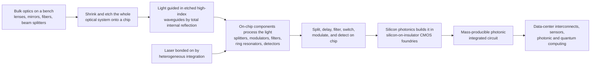

# 🔷 Integrated Photonics and Silicon Photonics

> [!abstract] TL;DR
> A **photonic integrated circuit (PIC)** does for *light* what a microchip did for *electrons*: instead of a tabletop of bulky lenses, mirrors, and fibers bolted to an optical bench, it packs whole optical systems — **waveguides**, splitters, **modulators**, filters, **ring resonators**, and detectors (and, increasingly, lasers) — onto a chip smaller than a grain of rice, guiding light through microscopic high-index waveguides etched into the surface. The killer move is **silicon photonics**: building these light-circuits in the *same* silicon-on-insulator wafers and the *same* CMOS foundries that make computer chips, so optical systems can be mass-produced as cheaply as electronics and even sit on one chip alongside transistors. The workhorse building block is the **microring resonator** — a looped waveguide that resonates at specific wavelengths and doubles as a compact filter, modulator, switch, and sensor. This matters enormously because inside **data centers and AI clusters**, moving data as light instead of electricity is faster and cooler — integrated photonics is fast becoming the plumbing that connects the world's servers and a leading hardware platform for photonic and quantum computing.

---

## Intuition

**Analogy — shrinking the optics bench onto a chip, exactly as we shrank electronics.** For sixty years the story of computing has been *miniaturization*: engineers learned to cram billions of transistors onto a fingernail of silicon, turning room-sized computers into something in your pocket. Integrated photonics tells the same story for **light**. Picture a classic optics laboratory — a heavy steel table covered in lenses, mirrors, beam-splitters, and fibers, each bolted down and painstakingly aligned so a laser beam threads through them in free space. Now imagine sweeping that entire bench up and etching it, in miniature, into the top skin of a chip: the laser beam no longer flies through air but is *trapped* inside a hair-thin channel of high-index material — a **waveguide** — and everywhere the beam needs to be split, delayed, filtered, switched, or detected, there is a microscopic component carved into the same surface. A journey that once crossed a meter of tabletop now crosses a millimeter of chip.

The truly transformative twist is **silicon photonics**. Silicon is transparent at the infrared wavelengths the internet runs on, and it bends light strongly, so light-channels in silicon can be made astonishingly small. Better still, we can pattern those channels in the *very same factories, on the very same silicon-on-insulator wafers*, that already stamp out the world's microprocessors — the trillion-dollar CMOS industry. That means optical systems that once cost a fortune to align by hand can suddenly be **mass-produced by the millions**, and light and electronics can share one chip. Why bother? Because inside a data center or a future AI supercomputer, shuttling torrents of data between chips as pulses of light is faster and runs cooler than pushing it as electrical current down copper. Integrated photonics is quietly becoming the nervous system of the cloud — the photonic analog of the microelectronic revolution, arriving right when the world's appetite for data has never been larger.

---

## How It Works

### Core Mechanics

1. **Confine light in a patterned waveguide.** Everything starts with a **waveguide**: a stripe of high-refractive-index material (silicon, $n\approx3.48$) surrounded by low-index cladding (silica, $n\approx1.44$, or air). Total internal reflection traps light inside the stripe, so the beam follows the etched pattern around bends and across the chip instead of diffracting away in free space. The huge index contrast of silicon-on-insulator lets waveguides be only ~500 nm wide and bends have micron-scale radii — thousands of times tighter than an optical fiber.
2. **Split and combine with couplers.** A **Y-junction** or **multimode-interference (MMI)** coupler splits one waveguide into two (or combines two into one); a **directional coupler** places two waveguides close enough that light *tunnels* from one to the other over a designed length, giving a controllable power split. These are the on-chip equivalents of beam-splitters.
3. **Resonate with a microring.** Curl a waveguide into a closed loop placed beside a straight bus waveguide. Only wavelengths whose round-trip optical path is an exact whole number of wavelengths ($n_\text{eff}L = m\lambda$) build up **constructively** inside the ring; at those wavelengths light couples into the loop and is *removed* from the bus, producing sharp **dips** in the transmitted spectrum. The spacing between dips is the **free spectral range (FSR)**, and their sharpness is the **quality factor $Q$**. This one device is a filter, a modulator, a switch, and a sensor depending on how you use it.
4. **Interfere with a Mach-Zehnder.** Split light into two waveguide arms, delay one arm by a controllable **phase shift** $\Delta\phi$, then recombine. The two paths interfere: when they are in phase the output is bright, when out of phase by $\pi$ the output goes dark. A **Mach-Zehnder interferometer (MZI)** thus turns a phase change into an intensity change — the heart of on-chip **modulators** and **switches**.
5. **Get light on and off the chip.** A **grating coupler** (a shallow diffraction grating etched into the waveguide) tips light up out of the plane into an optical fiber, or an **edge coupler** butts the fiber against the chip facet. Coupling to fibers efficiently is one of the central packaging challenges.
6. **Modulate and detect on-chip.** A **modulator** (a reverse-biased silicon junction inside an MZI or ring that shifts the index via free-carrier plasma dispersion) imprints electrical data onto the light; a **photodetector** (usually epitaxial germanium grown on the silicon, since silicon is transparent at these wavelengths) converts light back into current. Silicon itself cannot *emit* light efficiently (indirect bandgap), so the **laser** is bonded on — **heterogeneously integrated** III-V material — or coupled from an external source.
7. **Fabricate in a CMOS foundry.** All of the above are defined by the same deep-UV lithography, etch, doping, and deposition steps used for transistors, on **silicon-on-insulator** wafers. A foundry **process design kit (PDK)** provides pre-characterized building blocks, so designers lay out photonic circuits much as they lay out electronic ones — and can integrate the two.

### Flow / Architecture



---

## Key Concepts

### Secondary Level

- **A whole optics lab on one chip.** Instead of separate lenses, mirrors, and fibers you can hold in your hand, a photonic chip carries the entire light-handling system as tiny channels etched into its surface — smaller than a grain of rice, and impossible to knock out of alignment.
- **Light in a pipe, not through the air.** On the chip, light does not fly freely; it is trapped inside microscopic transparent channels called **waveguides** that bend and branch wherever the designer drew them, carrying the beam around the chip like water in pipes.
- **The ring that picks out colors.** A tiny loop of waveguide — a **microring** — lets only certain colors (wavelengths) of light circle around and build up. Those colors get pulled out of the passing beam. That makes the ring a superb, compact **filter**, and by nudging it electrically you can make it a fast **switch** or **modulator** that stamps data onto light.
- **Same factories as computer chips.** The big breakthrough, **silicon photonics**, is making these light-circuits out of **silicon** in the very same factories that make computer processors. That is why they can be built cheaply, by the millions, and even placed on the same chip as electronics.
- **Why it matters.** In the giant computers that run the internet and AI, sending information as flashes of **light** is faster and produces less heat than sending it as electricity down wires. Photonic chips are becoming the wiring that connects the world's servers.

### Undergraduate Level

- **The high-index-contrast waveguide.** Silicon-on-insulator gives an index step from $n\approx3.48$ (Si core) to $n\approx1.44$ (SiO$_2$ cladding). This enormous contrast confines the optical mode to a sub-micron cross-section and permits bend radii of only a few microns, so hundreds of components fit on a millimeter-scale chip. The trade-off is high sensitivity to nanometer-scale sidewall roughness (scattering loss).
- **The all-pass microring transfer function.** For a single bus waveguide coupled to a ring with self-coupling $r$ and round-trip amplitude transmission $a$ (loss), the through-port power is
$$T=\frac{a^{2}-2ar\cos\phi+r^{2}}{1-2ar\cos\phi+a^{2}r^{2}},\qquad \phi=\frac{2\pi n_\text{eff}L}{\lambda},$$
which drops to zero at resonance under **critical coupling** ($r=a$). Resonances occur at $\phi=2\pi m$.
- **Free spectral range and finesse.** Adjacent resonances are separated by $\text{FSR}=\dfrac{\lambda^{2}}{n_g L}$ (set by the *group* index $n_g$ and ring circumference $L$). The **finesse** $\mathcal{F}=\text{FSR}/\text{FWHM}$ and the **quality factor** $Q=\lambda_\text{res}/\text{FWHM}$ measure resonance sharpness; low-loss rings reach $Q>10^{5}$–$10^{6}$.
- **The Mach-Zehnder as a phase-to-intensity converter.** A balanced MZI has output $T=\cos^{2}(\Delta\phi/2)=\tfrac{1}{2}\left(1+\cos\Delta\phi\right)$. A phase shift of $\pi$ in one arm swings the output from fully bright to fully dark — the operating principle of MZI **modulators** and **switches**. The phase shift is produced electrically (carrier injection/depletion, thermal tuning, or Pockels effect in lithium niobate).
- **Getting light in and out.** **Grating couplers** diffract light vertically to a fiber (wavelength-selective, polarization-sensitive, ~1–3 dB loss, wafer-testable); **edge couplers / spot-size converters** give broadband, low-loss in-plane coupling but require diced, polished facets. Coupling and fiber packaging dominate assembly cost.
- **Material platforms and their jobs.** **Silicon (SOI)** — dense, CMOS-compatible, the volume platform, but no native light emission and free-carrier loss. **Silicon nitride (SiN)** — very low loss, broadband/visible-capable, weaker index contrast (larger devices), ideal for filters and low-loss delay. **Indium phosphide (InP)** — a *direct*-gap III-V that provides on-chip **lasers** and fast modulators. **Lithium niobate (thin-film LiNbO$_3$)** — a strong linear (Pockels) electro-optic effect for the fastest, lowest-chirp modulators.
- **Why silicon needs a bonded laser.** Silicon's **indirect bandgap** makes radiative recombination inefficient, so it is an excellent *waveguide, modulator, and (with germanium) detector* material but a poor *emitter*. Lasers are added by **heterogeneous integration** (wafer/die bonding of III-V) or coupled from an external laser source.

### Graduate Level

- **Modulation physics in silicon.** Silicon has no linear Pockels effect (it is centrosymmetric), so pure-silicon modulators rely on the **plasma-dispersion effect**: changing free-carrier density $\Delta N,\Delta P$ shifts the real index $\Delta n$ and the absorption $\Delta\alpha$ (Soref–Bennett relations). Carrier **depletion** in a reverse-biased pn junction is fast (tens of GHz) but gives small $\Delta n$, so it is deployed inside a resonant ring or a long MZI arm to accumulate enough phase. **Injection** gives larger $\Delta n$ but is speed-limited by carrier lifetime. Ring modulators are compact and low-energy but thermally sensitive; MZI modulators are broadband but larger.
- **Loss budget and Q.** Ring loaded-$Q$ combines intrinsic loss (scattering from sidewall roughness, bend radiation, material/free-carrier absorption) and coupling loss. **Under-, critical-, and over-coupling** regimes are distinguished by whether $r>a$, $r=a$, or $r<a$; critical coupling gives maximum extinction, and the through-port phase response is exploited in **coupled-resonator optical waveguides (CROWs)** and higher-order flat-top filters.
- **Thermal sensitivity and its remedies.** Silicon's large thermo-optic coefficient ($dn/dT\approx1.8\times10^{-4}\,\text{K}^{-1}$) shifts ring resonances ~80 pm/K, so wavelength-registered links need **active thermal tuning and feedback**, athermal designs (SiN or negative-$dn/dT$ cladding overlays), or wavelength-locking control loops. This is a central systems challenge for dense WDM ring arrays.
- **Wavelength-division multiplexing on chip.** **Arrayed-waveguide gratings (AWGs)**, echelle gratings, and cascaded ring filters combine/separate many wavelength channels on one waveguide, multiplying a single fiber's capacity — the architecture behind DWDM optical transceivers and co-packaged optics.
- **Design and verification flow.** PIC design mixes **electromagnetic mode/FDTD solvers** (for individual components), **circuit-level (S-parameter/scattering) simulation** for the whole chip, foundry **PDKs** of characterized primitives, and design-rule/layout-vs-schematic checks — a workflow deliberately mirroring electronic EDA. Silicon-photonics MPW (multi-project wafer) foundry runs make prototyping accessible.
- **Heterogeneous and monolithic integration.** Beyond bonded III-V lasers, **monolithic electronic-photonic integration** places modulators, detectors, and driver/CMOS logic on one die (or 3D-stacked/co-packaged), minimizing the electrical parasitics that limit bandwidth and energy-per-bit — the frontier for co-packaged optics and optical I/O next to compute.
- **Emerging directions.** **Programmable photonic processors** (meshes of MZIs implementing arbitrary linear transforms) underpin optical **neural-network accelerators**; large-scale integrated **quantum-photonic** circuits generate, route, and interfere single photons for photonic quantum computing; and **frequency-comb** microrings (Kerr solitons via [[Nonlinear_Optics]]) put many precise laser lines on one chip for spectroscopy, ranging, and massively parallel communication.

---

## Python Demo

```python
# On-chip photonics in two panels, the two workhorse building blocks of a PIC:
#   (a) MICRORING RESONATOR FILTER  -- an all-pass ring coupled to a bus waveguide.
#       Plot through-port transmission vs wavelength: sharp resonance DIPS where the
#       ring circumference matches a whole number of wavelengths, the FREE SPECTRAL
#       RANGE between dips, and the Q-FACTOR of a resonance. Two coupling conditions
#       (critical vs under-coupled) show how dip depth is controlled.
#   (b) MACH-ZEHNDER INTERFEROMETER  -- output power vs arm phase difference:
#       T = cos^2(dphi/2). A pi phase shift swings bright -> dark: the basis of
#       on-chip modulators and switches.
# numpy + matplotlib only (self-contained, no scipy).

import numpy as np
import matplotlib.pyplot as plt

# =====================================================================
# (a) All-pass microring resonator: through-port transmission spectrum
# =====================================================================
# Through-port power for a ring (self-coupling r, round-trip loss factor a):
#   T = (a^2 - 2 a r cos(phi) + r^2) / (1 - 2 a r cos(phi) + (a r)^2)
# with round-trip phase phi = 2*pi*n_eff*L / lambda.

n_eff = 2.40                     # silicon waveguide effective index
n_g   = 4.20                     # group index (sets the FSR)
R_um  = 10.0                     # ring radius (micrometers)
L     = 2 * np.pi * R_um * 1e-6  # ring circumference (m)

lam = np.linspace(1500e-9, 1600e-9, 20000)   # wavelength sweep (m)
phi = 2 * np.pi * n_eff * L / lam            # round-trip phase

def ring_through(r, a):
    num = a**2 - 2*a*r*np.cos(phi) + r**2
    den = 1 - 2*a*r*np.cos(phi) + (a*r)**2
    return num / den

a_loss = 0.96                    # round-trip amplitude transmission (loss)
T_crit = ring_through(r=a_loss, a=a_loss)   # critical coupling -> deep dips
T_under = ring_through(r=0.90, a=a_loss)    # under-coupled     -> shallow dips

# Free spectral range at 1550 nm (group index sets the spacing)
lam0 = 1550e-9
FSR = lam0**2 / (n_g * L)                    # in meters

# Q-factor of the critically coupled resonance from its analytic FWHM (in phase):
#   FWHM_phi = 2*(1 - r*a)/sqrt(r*a); convert to wavelength via dphi/dlam.
r = a = a_loss
FWHM_phi = 2 * (1 - r*a) / np.sqrt(r*a)
dphi_dlam = 2 * np.pi * n_g * L / lam0**2    # |dphi/dlambda| near lam0
FWHM_lam = FWHM_phi / dphi_dlam
Q = lam0 / FWHM_lam

# =====================================================================
# (b) Balanced Mach-Zehnder interferometer: output vs phase difference
# =====================================================================
dphi = np.linspace(0, 4*np.pi, 1000)         # phase difference between arms
T_mzi = np.cos(dphi/2)**2                     # T = 0.5*(1 + cos(dphi))

# =====================================================================
# Plot
# =====================================================================
fig, ax = plt.subplots(1, 2, figsize=(15, 5.4))

lam_nm = lam * 1e9
ax[0].plot(lam_nm, T_crit, lw=1.3, color="#c00000",
           label=f"critical coupling (r=a={a_loss}) -> deep dips")
ax[0].plot(lam_nm, T_under, lw=1.3, color="#1f77b4", alpha=0.8,
           label="under-coupled (r=0.90) -> shallow dips")
# annotate one FSR between two adjacent resonances near 1550 nm
res_center = 1550
ax[0].annotate("", xy=(res_center + FSR*1e9, 0.5),
               xytext=(res_center, 0.5),
               arrowprops=dict(arrowstyle="<->", color="green"))
ax[0].text(res_center + 0.5, 0.55, f"FSR approx {FSR*1e9:.1f} nm",
           color="green", fontsize=9)
ax[0].set_xlabel("wavelength  [nm]")
ax[0].set_ylabel("through-port transmission  T")
ax[0].set_title(f"(a) Microring filter: resonance DIPS\nradius {R_um:.0f} um,  Q approx {Q:,.0f}")
ax[0].set_ylim(-0.02, 1.05)
ax[0].grid(True, alpha=0.3)
ax[0].legend(loc="lower right", fontsize=8)

ax[1].plot(dphi/np.pi, T_mzi, lw=2.4, color="#8000c0")
ax[1].axhline(1.0, ls=":", color="gray", lw=1)
ax[1].axhline(0.0, ls=":", color="gray", lw=1)
ax[1].annotate("bright (in phase)", (0.02, 0.92), fontsize=9, color="#8000c0")
ax[1].annotate("dark (pi shift)\nlight switched OFF", (0.72, 0.06),
               fontsize=9, color="#c00000")
ax[1].axvline(1.0, ls="--", color="#c00000", lw=1)
ax[1].set_xlabel("arm phase difference  dphi  [units of pi]")
ax[1].set_ylabel("output power  T = cos^2(dphi/2)")
ax[1].set_title("(b) Mach-Zehnder: phase -> intensity\nthe on-chip modulator / switch")
ax[1].set_ylim(-0.05, 1.1)
ax[1].grid(True, alpha=0.3)

plt.tight_layout()
plt.savefig("integrated_photonics_ring_and_mzi.png", dpi=120)
plt.show()

# ---- Numerical readout ----
print(f"Ring radius            = {R_um:.1f} um  (circumference L = {L*1e6:.1f} um)")
print(f"Free spectral range    = {FSR*1e9:.2f} nm  (n_g = {n_g})")
print(f"Resonance FWHM         = {FWHM_lam*1e12:.1f} pm")
print(f"Quality factor Q       = {Q:,.0f}   (critical coupling, a = r = {a_loss})")
print(f"Finesse (FSR/FWHM)     = {FSR/FWHM_lam:,.0f}")
print("MZI: a pi phase shift takes the output from T=1 (bright) to T=0 (dark).")
# -> FSR approx 9 nm, Q ~ 1e4-1e5 for these low-loss parameters; deep dips only at
#    critical coupling where the ring loss equals the coupling (r = a).
```

Panel **(a)** is the on-chip filter in one picture: the through-port spectrum is flat near unity *except* at the wavelengths where the ring circumference is an exact whole number of guided wavelengths, where light couples into the loop and is stripped from the bus — the sharp **dips**. Their spacing is the **free spectral range** (set by the group index and ring size), and their sharpness is the **quality factor $Q$**. Crucially, the dips only reach zero at **critical coupling**, when the light coupled in per round trip exactly balances the ring's loss ($r=a$); an under-coupled ring gives shallow dips. Tune the ring's index electrically or thermally and every dip slides in wavelength — that is how the same device becomes a modulator, switch, or refractive-index **sensor**. Panel **(b)** is the on-chip modulator/switch: a **Mach-Zehnder** converts a phase difference between its two arms into an intensity, so a controllable $\pi$ phase shift snaps the output from bright to dark. Rings and MZIs — resonant and interferometric — are the two archetypes from which most PIC functions are built.

---

## Real-World Applications

- **Data-center interconnects and optical transceivers.** The dominant commercial driver: silicon-photonics transceivers (100G/400G/800G/1.6T pluggables) move data between servers and switches as light over fiber, using integrated modulators, WDM ring/AWG multiplexers, and germanium detectors. As electrical copper links hit reach and power limits, **co-packaged optics** places the photonic engine right beside the switch or GPU to cut energy-per-bit.
- **Optical I/O for AI and computing.** AI training clusters are bottlenecked by moving data between accelerators; integrated photonics supplies high-bandwidth, low-energy **optical links** (and emerging optical interposers) to feed GPUs/TPUs, and is a candidate substrate for **photonic neural-network accelerators** built from programmable MZI meshes.
- **Telecom and long-haul coherent optics.** InP and thin-film **lithium-niobate** PICs provide the fast, low-chirp modulators and integrated coherent transmitter/receiver engines behind metro and long-haul fiber networks.
- **LiDAR-on-chip and sensing.** Silicon-photonic **optical phased arrays** steer beams with no moving parts for solid-state automotive LiDAR; on-chip **frequency-comb** and FMCW engines enable compact ranging and spectroscopy.
- **Biosensors and environmental sensors.** A microring's resonance shifts when the local refractive index changes, so functionalized rings detect molecules binding to their surface — compact, label-free **biosensors and gas sensors** on a chip.
- **Quantum photonics and metrology.** Large-scale silicon and silicon-nitride PICs generate, route, and interfere single photons for photonic quantum computing and quantum communication, and microcomb PICs act as chip-scale optical clocks and precision frequency references.

---

## Common Pitfalls

- **Expecting silicon to emit light.** Silicon's **indirect bandgap** makes it a superb waveguide, modulator, and (with Ge) detector material but a poor emitter. A common misconception is that a "silicon laser" is straightforward; in practice the laser is a **bonded III-V** device or an external source, and light-source integration is one of the field's hardest problems.
- **Underestimating fiber coupling and packaging.** The optics on the chip can be flawless yet useless if you cannot get light in and out efficiently. **Grating- and edge-coupler loss, alignment tolerances, and fiber-array attach** frequently dominate total insertion loss and assembly cost — packaging, not the PIC design, is often the bottleneck.
- **Ignoring thermal sensitivity of resonators.** Silicon's large thermo-optic coefficient shifts a microring's resonance by tens of pm per kelvin, so a ring tuned at test can drift completely off-channel in operation. Dense ring links **require active thermal tuning, feedback/wavelength-locking, or athermal design** — omitting this is a classic first-design failure.
- **Confusing effective index and group index.** Resonance *positions* and phase are governed by the **effective index** $n_\text{eff}$, but the **FSR** (spacing between resonances) is set by the **group index** $n_g$. In dispersive, high-contrast silicon waveguides $n_g$ can be nearly double $n_\text{eff}$; using the wrong one badly mispredicts the spectrum.
- **Forgetting the critical-coupling condition.** A ring gives deep, useful extinction only near **critical coupling** ($r\approx a$). Design the coupling gap without accounting for the ring's loss and you get shallow, weak dips (under- or over-coupled) that ruin filter contrast or modulator extinction ratio.
- **Assuming polarization does not matter.** High-contrast silicon waveguides are strongly **birefringent** and most components (grating couplers, rings) are designed for one polarization. Unmanaged polarization from the input fiber can wander, degrading or detuning the entire circuit unless polarization-diversity or polarization-maintaining schemes are used.
- **Treating scattering loss as negligible.** Because the mode is tightly confined, nanometer-scale **sidewall roughness** from lithography/etch scatters light and sets the waveguide propagation loss and achievable $Q$. Loss is a fabrication problem as much as a design one.

---

## Related Concepts

Glob-verified wikilinks:

- [[Optics_and_Photonics_Overview]] — the parent map of the field; this note is the *integration/chip-scale* endpoint of Pillar 4 (Fiber and Integrated Photonics), where bulk optics is miniaturized onto silicon.
- [[Wave_Optics_and_Interference]] — the interference and phase physics that *is* the operating principle of ring resonances and Mach-Zehnder modulators; the on-chip devices are interference machines.
- [[Semiconductor_Light_Sources_LEDs_and_Laser_Diodes]] — the III-V laser diodes that are bonded onto silicon photonics (heterogeneous integration) because silicon cannot emit efficiently; the on-chip light source.
- [[Nonlinear_Optics]] — Kerr-nonlinear microrings generate on-chip optical **frequency combs** and enable wavelength conversion, an emerging PIC function.
- [[Dispersion_and_Optical_Properties_of_Materials]] — waveguide and material dispersion set the group index, FSR, and comb formation; index engineering is the core PIC design lever.
- [[Photonics_and_Optoelectronics]] — the Electrical-Engineering companion on light sources, modulators, waveguides, and detectors as an engineering system, of which the PIC is the integrated realization.
- [[Semiconductor_Devices_and_Diodes]] — the reverse-biased pn junctions behind silicon carrier-depletion modulators and germanium photodetectors on the chip.
- [[MOSFETs_and_CMOS]] — the CMOS transistor technology and foundries that silicon photonics reuses; the basis of monolithic electronic-photonic integration.
- [[Digital_System_Design_and_HDL]] — the electronic-IC and EDA design paradigm that PIC design (PDKs, layout, circuit-level simulation) deliberately mirrors, and the digital logic co-integrated with photonic I/O.
- [[MEMS_and_Microengineering]] — the microfabrication and MEMS techniques shared with photonic-chip fabrication, including MEMS-actuated photonic switches.
- [[Nanofabrication_and_Self_Assembly]] — the deep-UV lithography and etch that pattern nanometer-precision waveguides, whose sidewall roughness sets propagation loss.

Within this Optics and Photonics vault, this note is the chip-scale anchor of the Fiber and Integrated Photonics section. It connects in prose to the sibling notes Optical_Fibers_and_Waveguides (the same total-internal-reflection guiding, scaled from fiber down to on-chip waveguides, and the fibers that couple to the chip), Optical_Modulators_and_Switches (the ring and Mach-Zehnder modulators/switches that are the PIC's active elements), Photodetectors_and_Optical_Receivers (the germanium-on-silicon detectors that terminate on-chip links), Metamaterials_and_Photonic_Crystals (photonic-crystal cavities, waveguides, and metasurfaces as alternative on-chip light-control structures), and Quantum_Photonics_and_Photonic_Computing (the programmable-MZI and single-photon PICs that turn integrated photonics into a computing platform).

---

## Review Questions

1. **(Secondary)** A silicon photonics chip smaller than a grain of rice can replace a whole table of lenses, mirrors, and fibers. Explain in your own words (a) how light is kept trapped and guided *inside* the chip instead of flying through the air, and (b) why building these light-circuits in the same factories that make computer processors is such a big deal for cost and for connecting the world's data centers.
2. **(Undergraduate)** A silicon microring resonator of radius 10 µm ($n_\text{eff}=2.4$, $n_g=4.2$) is coupled to a bus waveguide. (a) Estimate its free spectral range near 1550 nm and state which index governs it. (b) Explain what "critical coupling" means and why a ring only produces deep transmission dips there. (c) You now want to turn this ring into a data modulator — describe how a small electrically induced index change converts it from a filter into a device that switches light on and off, and one drawback (hint: temperature).
3. **(Graduate)** Silicon has no linear electro-optic (Pockels) effect, yet silicon photonics is the volume platform for on-chip modulators. (a) Explain the physical mechanism silicon modulators actually use and its speed/index-shift trade-offs, contrasting carrier depletion vs injection. (b) Compare a ring modulator and an MZI modulator in footprint, bandwidth, energy-per-bit, and thermal sensitivity. (c) Silicon cannot lase — describe two strategies for supplying the laser to a silicon PIC and the integration trade-offs of each.

---

## Sources

- Saleh, B. E. A. & Teich, M. C. — *Fundamentals of Photonics*, 3rd ed. (Wiley) — integrated optics, waveguides, resonators, and electro-optic modulators.
- Chrostowski, L. & Hochberg, M. — *Silicon Photonics Design: From Devices to Systems* (Cambridge Univ. Press) — SOI waveguides, ring resonators, foundry PDKs, and the PIC design flow.
- Reed, G. T. & Knights, A. P. — *Silicon Photonics: An Introduction* (Wiley) — silicon waveguides, modulators, detectors, and coupling.
- Hunsperger, R. G. — *Integrated Optics: Theory and Technology*, 6th ed. (Springer) — foundational integrated-optics devices, materials, and fabrication.
- Bogaerts, W. et al. — "Silicon microring resonators," *Laser & Photonics Reviews* **6**, 47–73 (2012) — ring coupling regimes, FSR, Q, and applications.

---

#optics #integrated-photonics #silicon-photonics #ring-resonator #photonic-integrated-circuit
