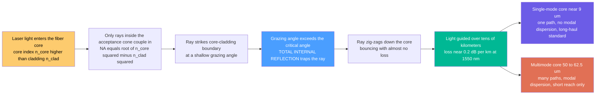

# 🔦 Optical Fibers and Waveguides

> [!abstract] TL;DR
> An **optical fiber** is a hair-thin thread of ultra-pure glass with a high-index **core** wrapped in a lower-index **cladding**; light launched into the core strikes the core–cladding boundary above the **critical angle** and undergoes **total internal reflection**, zig-zagging down the fiber for tens of kilometers with astonishingly low loss (~0.2 dB/km in silica at 1550 nm). The **numerical aperture** $\text{NA}=\sqrt{n_\text{core}^2-n_\text{clad}^2}$ sets the acceptance cone, **multimode vs single-mode** geometry sets how badly pulses smear, and **attenuation and dispersion** are the two enemies that limit reach and bit rate. These glass threads — most of them on the ocean floor — are the physical backbone of the global internet, and the same waveguide idea, shrunk onto a chip, becomes **integrated photonics**.

---

## Intuition

**Analogy — the bending light-pipe.** Shine a flashlight into one end of a curved glass rod and, astonishingly, the light comes out the *far* end, having followed the bends — it never leaks out the sides. It is trapped inside. That is an **optical fiber**: a thread of glass that pipes light along its length, around corners, for kilometers. The trick is **total internal reflection**. The fiber has a core of slightly *higher* refractive index surrounded by cladding of *lower* index, so a ray that hits the boundary at a shallow (grazing) angle bounces perfectly back into the core — over and over, zig-zagging down the fiber, unable to escape. There is no silvered mirror and almost nothing to absorb it, so the light just keeps going.

These threads are the veins of the modern world. Nearly all the internet, phone calls, and streaming video travel as pulses of laser light racing through glass fibers — most of them lying on the ocean floor as transoceanic cables. It is the humble physics of a bending light-pipe, refined to glass so pure that a block kilometers thick would still be transparent, and turned into the nervous system of civilization. The same "guide light in a high-index channel" idea, etched onto a silicon chip, is how photonics is now being built the way electronics is.

---

## How It Works

### Core Mechanics

1. **A high-index core in a low-index cladding.** The fiber is drawn from silica glass with a tiny, deliberately doped **core** ($n_\text{core}\approx1.48$) surrounded by **cladding** ($n_\text{clad}\approx1.46$) of slightly lower index. The whole structure is thinner than a human hair.
2. **Total internal reflection traps the light.** A ray propagating down the core hits the core–cladding boundary at a grazing angle. Because the ray goes from **dense → rare** glass, once its angle exceeds the **critical angle** $\sin\theta_c=n_\text{clad}/n_\text{core}$, *all* of the light reflects — there is no transmitted ray. The light is confined and guided (this is the [[Reflection_Refraction_and_Fermats_Principle|total internal reflection]] rule doing the work).
3. **The acceptance cone and numerical aperture.** Not every ray you shine in gets guided — only those entering within a cone. The half-angle of that cone is the **acceptance angle** $\theta_a$, and $\sin\theta_a = \text{NA} = \sqrt{n_\text{core}^2-n_\text{clad}^2}$. Rays steeper than $\theta_a$ hit the wall *below* the critical angle and leak into the cladding.
4. **Rays or modes.** The zig-zag "ray" picture is intuitive but approximate. Rigorously, light in a fiber travels as discrete **guided modes** — the standing-wave field patterns that solve Maxwell's equations for the waveguide. A wide core supports many modes (**multimode**); a core small enough (~9 µm) supports only one (**single-mode**).
5. **Two enemies: attenuation and dispersion.** Even guided, the signal degrades. **Attenuation** (Rayleigh scattering plus absorption) drains power with distance, carving out the low-loss **windows** near 1310 and 1550 nm. **Dispersion** (modal, chromatic, polarization) spreads each pulse in time until adjacent bits overlap. Together they cap the distance × bit-rate product of any link.
6. **From fiber to chip.** Confining light in a high-index channel is not unique to round glass threads: a **planar waveguide** — a high-index stripe on a lower-index substrate — guides light on a chip by the same principle, the foundation of integrated and silicon photonics.

### Flow / Architecture



---

## Key Concepts

### Secondary Level

- **Light trapped in glass.** A fiber has a central **core** and a surrounding **cladding** made of glass that bends light slightly less. Light bouncing along the core keeps reflecting perfectly off the boundary and cannot get out — **total internal reflection** — so it follows the fiber even around gentle bends.
- **You must aim it right.** Only light entering close to the axis (inside the **acceptance cone**) gets trapped; light coming in too steeply leaks out the side. That cone's width is described by the **numerical aperture (NA)**.
- **Why glass and not copper.** Light in fiber carries vastly more information than electricity in a wire, travels farther before needing a boost, and does not pick up electrical interference. That is why the internet's long-distance links are glass.
- **Two kinds of fiber.** **Multimode** fiber has a fat core and lets light take many overlapping paths — cheap and easy, but only good for short distances. **Single-mode** fiber has a tiny core that forces light onto one path — the standard for long-distance and high-speed links.
- **Purity matters.** Fibers are made from glass so pure that light can travel ~50 km and still keep a good fraction of its power. Even so, over long hauls the signal must be re-amplified periodically.

### Undergraduate Level

- **Critical angle and TIR.** Going core → cladding (dense → rare), total internal reflection occurs above $\sin\theta_c=n_\text{clad}/n_\text{core}$. For $n_\text{core}=1.48,\ n_\text{clad}=1.46$, $\theta_c\approx80.6°$ measured from the boundary normal — the ray must stay within ~9.4° of the fiber axis.
- **Numerical aperture and acceptance angle.** A ray entering the flat end face at angle $\theta_a$ from the axis refracts, then must exceed $\theta_c$ at the wall. Chaining Snell's law at the face with the TIR condition gives
$$\text{NA}=n_0\sin\theta_a=\sqrt{n_\text{core}^2-n_\text{clad}^2}.$$
With the numbers above, $\text{NA}\approx0.24$ and $\theta_a\approx14°$ in air. Bigger index contrast → bigger NA → easier to launch light, but (as below) more modal dispersion.
- **The relative index difference** $\Delta=\dfrac{n_\text{core}-n_\text{clad}}{n_\text{core}}$ is the master design knob. Typical fibers are **weakly guiding**, $\Delta\approx0.003$–$0.01$, so $\text{NA}\approx n_\text{core}\sqrt{2\Delta}$.
- **Step-index vs graded-index.** A **step-index** profile jumps abruptly from core to cladding. A **graded-index** profile grades $n$ smoothly (roughly parabolically), so steeper rays travel faster in the lower-index outer region and *catch up* — dramatically reducing modal dispersion in multimode fiber.
- **Modal dispersion (multimode).** In step-index multimode fiber, the axial ray and the most-grazing ray take different path lengths, arriving at different times. The intermodal spread is
$$\frac{\Delta\tau}{L}\approx\frac{n_\text{core}\,\Delta}{c},$$
which for $\Delta\approx0.01$ is tens of ns/km — enough to blur gigabit pulses within a kilometer. Single-mode fiber eliminates this entirely by supporting one mode.
- **Attenuation and the low-loss windows.** Loss (in dB/km) has three main contributions: **Rayleigh scattering** $\propto\lambda^{-4}$ (dominant at short wavelengths), an **infrared absorption tail** from Si–O bond vibrations rising past ~1.6 µm, and **OH⁻ (water) absorption peaks**, the strongest near 1383 nm. Their sum bottoms out to ~0.2 dB/km in the **1550 nm C-band** — the reason telecom lives at 1310 and 1550 nm rather than in the visible.

### Graduate Level

- **The waveguide as an eigenvalue problem.** Guided modes are solutions of the vector wave equation with the fiber's index profile, each with a propagation constant $\beta$ satisfying $n_\text{clad}k_0<\beta<n_\text{core}k_0$. For a step-index fiber the transcendental eigenvalue equation is written with Bessel functions ($J$ in the core, modified $K$ in the cladding), and modes are labeled $\text{LP}_{lm}$ in the weakly-guiding (linearly-polarized) approximation.
- **The V-number sets the mode count.** The normalized frequency
$$V=\frac{2\pi a}{\lambda}\,\text{NA}=\frac{2\pi a}{\lambda}\sqrt{n_\text{core}^2-n_\text{clad}^2}$$
(with $a$ the core radius) governs everything. **Single-mode cutoff** is $V<2.405$ (the first zero of $J_0$): only the fundamental $\text{LP}_{01}$ mode propagates. For large $V$, the number of modes $\approx V^2/2$. A 9 µm core is chosen so that $V<2.405$ at 1310 nm and above.
- **Total chromatic dispersion = material + waveguide.** Even a single mode spreads pulses because the group velocity depends on wavelength. **Material dispersion** comes from $n(\lambda)$ of silica; **waveguide dispersion** comes from how the mode's confinement (and hence effective index) shifts with $\lambda$. They cancel near **1310 nm** (the zero-dispersion wavelength of standard SMF). **Dispersion-shifted** and **dispersion-compensating** fibers engineer the waveguide term to move or undo this zero; the engineering parameter $D=-\frac{2\pi c}{\lambda^2}\beta_2$ is quoted in ps/(nm·km), ~+17 for standard SMF at 1550 nm.
- **Polarization-mode dispersion (PMD).** A real fiber's core is never perfectly circular, so the two polarization states travel at slightly different speeds. PMD accumulates as $\sqrt{L}$ (a random-walk, ps/√km) and becomes a hard limit for very high-bit-rate long-haul systems.
- **Nonlinear effects at high power.** Silica's tiny [[Nonlinear_Optics|Kerr nonlinearity]] matters over thousands of kilometers: self-phase modulation, cross-phase modulation, and four-wave mixing distort dense-WDM channels; stimulated Raman/Brillouin scattering cap launch power. These are why "just add power" fails and why coherent detection with DSP is now standard.
- **Specialty fibers.** **Photonic-crystal / microstructured fibers** guide light in a lattice of air holes (by a modified effective-index or a true photonic-bandgap mechanism), enabling endlessly-single-mode behavior, hollow cores, and supercontinuum generation. **Rare-earth-doped fibers** (erbium, ytterbium) provide gain for fiber amplifiers and fiber lasers. **Polarization-maintaining** fibers use built-in stress to lock polarization; **multicore and few-mode** fibers add spatial channels for space-division multiplexing.
- **Fabrication.** Fibers are drawn from a **preform** — a meter-scale glass rod with the index profile already built in (typically by MCVD/OVD chemical vapor deposition) — heated in a draw tower and pulled to ~125 µm outer diameter, coated on the fly. Field deployment then relies on low-loss **fusion splicing** and precision connectors.

---

## Python Demo

```python
# Optical-fiber guiding in three panels:
#   (a) TIR + ACCEPTANCE: numerical aperture / acceptance cone; a guided ray
#       zig-zags by total internal reflection while a steep ray escapes.
#   (b) ATTENUATION SPECTRUM: silica loss vs wavelength -- Rayleigh + IR tail +
#       OH water peaks -> the 1310 and 1550 nm low-loss telecom windows.
#   (c) MODAL DISPERSION: a short pulse stays crisp in single-mode fiber but
#       smears badly in step-index multimode fiber.
import numpy as np
import matplotlib.pyplot as plt

c = 3.0e8  # speed of light, m/s

# ---------- fiber parameters ----------
n_core, n_clad = 1.48, 1.46
NA = np.sqrt(n_core**2 - n_clad**2)          # numerical aperture
theta_a = np.degrees(np.arcsin(NA))          # acceptance half-angle in air (n0 = 1)
theta_c = np.degrees(np.arcsin(n_clad/n_core))  # critical angle at core-cladding wall
print("NA = %.3f   acceptance half-angle = %.1f deg   critical angle = %.1f deg"
      % (NA, theta_a, theta_c))

# ---------- (a) TIR zig-zag + acceptance cone ----------
a = 1.0            # core half-width (arbitrary units)
Lx = 12.0          # length of fiber drawn
x = np.linspace(0, Lx, 2000)

def zigzag(x, slope, a):
    """Fold a straight ray of given internal slope into a TIR zig-zag in [-a, a]."""
    yraw = slope * x
    t = (yraw + a) % (4*a)
    return np.where(t <= 2*a, t - a, 3*a - t)

# Guided ray: launch angle inside the acceptance cone -> refracts to a shallow
# internal angle -> hits the wall above the critical angle -> TIR forever.
launch_guided = 0.6 * theta_a                        # deg, inside the cone
th_r = np.degrees(np.arcsin(np.sin(np.radians(launch_guided)) / n_core))  # internal
y_guided = zigzag(x, np.tan(np.radians(th_r)), a)

# Escaping ray: launched steeper than the acceptance angle -> below critical at the
# wall -> refracts out into the cladding and is lost. We draw it until it exits.
launch_esc = 1.8 * theta_a                            # deg, outside the cone
slope_esc = np.tan(np.radians(launch_esc))            # in air; travels straight, leaks
x_hit = a / slope_esc                                 # where it first reaches the wall
xe = np.linspace(0, min(3*x_hit, Lx), 400)
y_esc = slope_esc * xe                                # crosses y = a and keeps going out

# ---------- (b) silica attenuation spectrum ----------
lam = np.linspace(800, 1700, 1000)          # wavelength, nm
lam_um = lam / 1000.0
rayleigh = 0.85 / lam_um**4                 # dB/km, ~lambda^-4 scattering floor
ir_tail  = 7.81e11 * np.exp(-48.48 / lam_um)  # dB/km, Si-O infrared absorption tail
def oh_peak(center, height, width):
    return height * np.exp(-0.5*((lam - center)/width)**2)
water = (oh_peak(1383, 2.0, 18) + oh_peak(1240, 0.5, 18) + oh_peak(950, 1.2, 18))
alpha = rayleigh + ir_tail + water          # total attenuation, dB/km

# ---------- (c) modal dispersion: single-mode vs step-index multimode ----------
L = 1000.0                                   # fiber length, m (1 km)
Delta = (n_core - n_clad) / n_core           # relative index difference
dtau = n_core * Delta / c * L                # intermodal spread, s  (step-index MM)
t = np.linspace(-5, 300, 1200) * 1e-9        # time axis, s
T_in = 1.0e-9                                # input pulse 1/e half-width, 1 ns
p_in  = np.exp(-(t/T_in)**2)                                   # launched pulse
sig_sm = T_in                                                 # SM: modal-dispersion-free
sig_mm = np.sqrt(T_in**2 + (dtau/2.0)**2)                     # MM: broadened by modes
p_sm  = (T_in/sig_sm)*np.exp(-(t/sig_sm)**2)
p_mm  = (T_in/sig_mm)*np.exp(-((t-dtau/2)/sig_mm)**2)         # delayed + smeared
print("Step-index multimode modal spread over 1 km = %.0f ns" % (dtau*1e9))

# ---------- plots ----------
fig, ax = plt.subplots(1, 3, figsize=(16.5, 4.6))

# (a) fiber cross-section with guided and escaping rays
ax[0].axhspan(-a, a, color="#cfe8ff", alpha=0.7, label="core (n_core)")
ax[0].axhspan(a, 1.6*a, color="#e9e0ff", alpha=0.8)
ax[0].axhspan(-1.6*a, -a, color="#e9e0ff", alpha=0.8, label="cladding (n_clad)")
ax[0].plot(x, y_guided, color="#00b894", lw=2, label="guided ray (TIR zig-zag)")
ax[0].plot(xe, y_esc, color="crimson", lw=2, ls="--", label="steep ray escapes")
ax[0].axhline(a, color="k", lw=0.8); ax[0].axhline(-a, color="k", lw=0.8)
ax[0].set_ylim(-1.6*a, 1.6*a)
ax[0].set_xlabel("distance along fiber")
ax[0].set_ylabel("radial position")
ax[0].set_title("(a) TIR guiding\nNA = %.2f, acceptance +/- %.0f deg" % (NA, theta_a))
ax[0].legend(fontsize=7, loc="upper right")

# (b) attenuation vs wavelength
ax[1].semilogy(lam, alpha, color="navy", lw=2, label="total loss")
ax[1].semilogy(lam, rayleigh, color="#4a9eff", lw=1, ls="--", label="Rayleigh ~1/lambda^4")
ax[1].semilogy(lam, ir_tail, color="#e17055", lw=1, ls="--", label="infrared tail")
ax[1].axvline(1310, color="green", ls=":", lw=1.2)
ax[1].axvline(1550, color="green", ls=":", lw=1.2)
ax[1].annotate("1310 nm\nO-band", (1310, 0.35), fontsize=7, ha="center", color="green")
ax[1].annotate("1550 nm\nC-band", (1550, 0.12), fontsize=7, ha="center", color="green")
ax[1].annotate("OH water peak", (1383, 2.2), fontsize=7, ha="center", color="purple")
ax[1].set_xlabel("wavelength  [nm]")
ax[1].set_ylabel("attenuation  [dB/km]")
ax[1].set_title("(b) Silica loss spectrum\nlow-loss windows set the telecom bands")
ax[1].set_ylim(0.1, 20)
ax[1].legend(fontsize=7)
ax[1].grid(True, which="both", alpha=0.25)

# (c) modal dispersion
tns = t*1e9
ax[2].plot(tns, p_in, color="gray", lw=1.5, ls=":", label="input pulse")
ax[2].plot(tns, p_sm, color="#6c5ce7", lw=2, label="single-mode out (crisp)")
ax[2].plot(tns, p_mm, color="#e17055", lw=2,
           label="multimode out (%.0f ns spread)" % (dtau*1e9))
ax[2].set_xlabel("time  [ns]")
ax[2].set_ylabel("normalized intensity")
ax[2].set_title("(c) Modal dispersion after 1 km\nstep-index multimode vs single-mode")
ax[2].set_xlim(-5, 120)
ax[2].legend(fontsize=7)
ax[2].grid(True, alpha=0.25)

plt.tight_layout()
plt.savefig("optical_fibers_and_waveguides.png", dpi=120)
plt.show()

# Expected:
#   (a) the shallow ray bounces down the core by TIR; the steep ray leaks into cladding.
#   (b) loss dips to ~0.2 dB/km near 1550 nm, with a water bump near 1383 nm.
#   (c) single-mode output ~ input; step-index multimode smears by ~50 ns over 1 km.
```

Panel **(a)** is the guiding picture: a ray launched inside the acceptance cone (NA ≈ 0.24, ±14°) zig-zags down the core by total internal reflection, while a steeper ray strikes the wall below the critical angle and leaks into the cladding — visually, the difference between a bit that survives and one that is lost. Panel **(b)** is why telecom lives at 1310 and 1550 nm: Rayleigh scattering falls as $\lambda^{-4}$ while the infrared absorption tail rises, and their sum bottoms out to ~0.2 dB/km in the C-band, interrupted by the OH⁻ water peak near 1383 nm. Panel **(c)** shows the decisive advantage of single-mode fiber: a clean 1 ns pulse stays crisp, but in step-index multimode fiber the spread of ray paths smears it across ~50 ns in a single kilometer — which is exactly why long-haul links use single-mode glass.

---

## Real-World Applications

- **The internet's physical backbone.** Virtually all long-distance data — transoceanic submarine cables, terrestrial backbone networks, and fiber-to-the-home — travels as infrared laser pulses through **single-mode fiber** in the 1550 nm C-band. A single fiber pair carries terabits per second via wavelength-division multiplexing, and undersea cables (thousands of kilometers of glass on the seabed) tie the continents together. This is the [[Physical_Layer|physical layer]] beneath essentially the entire network stack.
- **Data centers and short reach.** Inside data centers, **multimode fiber** (OM3/OM4/OM5) with cheap VCSEL transceivers carries 10–400 Gb/s over tens to hundreds of meters — short enough that modal dispersion is tolerable and the cost savings win.
- **Fiber amplifiers and fiber lasers.** Erbium-doped fiber amplifiers (EDFAs) boost signals directly in the glass every ~80 km without converting back to electronics, and high-power ytterbium fiber lasers cut and weld metal in industry — both built from rare-earth-doped fiber.
- **Sensing.** Fiber Bragg gratings and distributed sensing (Rayleigh/Brillouin backscatter) turn a fiber into a kilometers-long thermometer, strain gauge, or acoustic sensor for pipelines, bridges, and perimeter security — even repurposing dark telecom fiber to detect earthquakes.
- **Medicine and imaging.** Fiber bundles carry images and laser power inside the body (endoscopes, laser surgery, and diagnostic probes), delivering light where rigid optics cannot reach.
- **On-chip photonics.** The waveguide concept, shrunk to a high-index silicon or silicon-nitride stripe on a chip, is the substrate of **integrated photonics** — moving data optically between and within processors and powering photonic quantum and AI accelerators.

---

## Common Pitfalls

- **Expecting TIR going into the core.** Total internal reflection only happens **dense → rare** (core → cladding). Light entering the fiber first refracts *into* the denser core at the end face; the trapping happens at the *sidewall*. Applying the critical angle at the wrong interface (or with the indices swapped) is the classic first mistake.
- **Confusing acceptance angle with the propagation angle.** The acceptance half-angle $\theta_a$ (~14° in air) is the *external* launch cone; inside the glass the ray refracts to a much *shallower* internal angle. Mixing the two, or forgetting the $n_0$ in $n_0\sin\theta_a=\text{NA}$, gives wrong NA values.
- **Thinking a bigger NA is always better.** A large NA makes launching easy and tolerates tight bends, but in multimode fiber a larger NA (larger $\Delta$) means **worse modal dispersion**. It is a trade, not a free win.
- **Believing single-mode fiber has no dispersion.** Single-mode fiber removes *modal* dispersion, but **chromatic** (material + waveguide) and **polarization-mode** dispersion remain and dominate at high bit rates. "Single-mode" ≠ "dispersionless."
- **Assuming lower wavelength means lower loss.** Rayleigh scattering *falls* with wavelength ($\lambda^{-4}$), so shorter is *not* better for loss; the minimum sits at 1550 nm because the rising infrared absorption tail meets the falling scattering floor. Visible light is actually a poor choice for long fiber.
- **Ignoring the water peak.** Legacy fiber has a strong OH⁻ absorption band near 1383 nm; using that region without "low-water-peak" (G.652.D) fiber costs you an entire potential band. Modern zero-water-peak fiber opens the E-band.
- **Kinks, macrobends, and dirty connectors.** Bending a fiber too tightly lets guided light escape (the bend radius drops the effective angle below critical), and a speck of dust on a connector end face can dominate the whole link's loss. Real-world fiber loss is often mechanical, not intrinsic.

---

## Related Concepts

**Within this vault (Optics and Photonics):**

- [[Reflection_Refraction_and_Fermats_Principle]] — total internal reflection and the critical angle are the exact physics that traps light in the core; this note applies that rule down a waveguide.
- [[Dispersion_and_Optical_Properties_of_Materials]] — chromatic dispersion (material + waveguide) and the transparency window at 1550 nm are developed there; here they become the pulse-spreading and low-loss-window story for fibers.
- [[Nonlinear_Optics]] — over thousands of kilometers even silica's tiny Kerr nonlinearity (self-phase modulation, four-wave mixing) distorts dense-WDM channels and caps launch power.
- [[Metamaterials_and_Photonic_Crystals]] — photonic-crystal and microstructured fibers guide light with engineered air-hole lattices and photonic bandgaps, extending fibers beyond simple TIR.

**Cross-vault connections:**

- [[Waveguides_and_Antennas]] — the electrical-engineering treatment of guided-wave modes (metal and dielectric waveguides); an optical fiber is a dielectric waveguide obeying the same mode-eigenvalue physics at optical frequency.
- [[Transmission_Lines]] — the RF/electrical analog of a guided-signal channel, with loss and dispersion playing the same limiting roles as in fiber.
- [[Photonics_and_Optoelectronics]] — the sources (lasers, LEDs) and detectors (photodiodes) that inject and recover the light a fiber carries.
- [[Wave_Motion_and_Properties]] — the Physics foundation of phase vs group velocity and wave packets, which is what dispersion smears in a fiber.
- [[Physical_Layer]] — in the OSI model, fiber is the flagship physical-layer medium beneath the entire network stack.
- [[The_Gaussian_Channel_and_Shannon_Hartley]] — attenuation and dispersion set the effective SNR and bandwidth, so Shannon's capacity limit governs how many bits a fiber link can carry.

*Sibling notes in this Fiber and Integrated Photonics section (referenced in prose above): the Optics and Photonics overview that maps the whole field; fiber-optic communication (the systems view of transmitters, receivers, and links); integrated photonics and silicon photonics (the same waveguide idea on a chip); optical amplifiers and gain media (EDFAs and fiber lasers that re-boost the signal); and wavelength-division multiplexing and networks (packing many colors down one fiber).*

---

## Review Questions

1. **(Secondary)** A curved glass rod pipes light from one end to the other without letting it leak out the sides. Name the physical effect responsible, and explain in plain terms why the fiber needs a *core* and a *cladding* made of two slightly different glasses rather than just one uniform glass.
2. **(Undergraduate)** A step-index fiber has $n_\text{core}=1.48$ and $n_\text{clad}=1.46$. (a) Compute the numerical aperture and the acceptance half-angle in air. (b) Compute the critical angle at the core–cladding wall and state the maximum angle from the fiber axis a guided ray may take. (c) Explain qualitatively why a graded-index profile reduces modal dispersion compared with this step-index fiber.
3. **(Graduate)** Standard single-mode fiber uses a ~9 µm core with $\text{NA}\approx0.14$. (a) Using the normalized frequency $V=\frac{2\pi a}{\lambda}\text{NA}$ and the single-mode cutoff $V<2.405$, show the fiber is single-mode at 1310 nm but not at 800 nm. (b) Even as a single mode, the pulse still broadens — identify the two dispersion mechanisms that remain and explain why they cancel near 1310 nm. (c) Long-haul systems operate at 1550 nm (lowest loss) yet standard SMF has ~+17 ps/(nm·km) dispersion there; name two fiber- or system-level strategies to manage that residual dispersion.

---

## Sources

- Agrawal, G. P. — *Fiber-Optic Communication Systems*, 4th ed. (Wiley) — fiber loss, chromatic dispersion, nonlinearities, and system design.
- Saleh, B. E. A. & Teich, M. C. — *Fundamentals of Photonics*, 3rd ed. (Wiley) — waveguide modes, numerical aperture, and fiber optics from first principles.
- Keiser, G. — *Optical Fiber Communications*, 4th ed. (McGraw-Hill) — fiber structures, attenuation windows, and connectorization/splicing.
- Snyder, A. W. & Love, J. D. — *Optical Waveguide Theory* (Springer) — the rigorous modal (electromagnetic) theory of dielectric waveguides.

---

#optics #optical-fiber #total-internal-reflection #single-mode #waveguide
