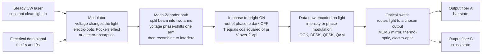

# 🎛️ Optical Modulators and Switches

> [!abstract] TL;DR
> To carry data, information must be **written onto light** — the beam's **intensity, phase, or polarization** is varied in time by an electrical signal, billions of times a second. That job belongs to a **modulator**. You *could* just switch the laser current on and off (**direct modulation** — simple, but slow and it smears the wavelength, "**chirp**"), but the telecom standard runs the laser steadily (**CW**) and puts a separate ultrafast optical "shutter" in front of it (**external modulation**). The workhorse is the **Mach-Zehnder modulator**: split the beam into two arms, apply a voltage that phase-delays one arm through the **Pockels (electro-optic) effect** in lithium niobate or silicon, then recombine — in phase the light adds (**ON**), out of phase it cancels (**OFF**). Its transfer function is $T=\cos^2\!\left(\tfrac{\pi V}{2V_\pi}\right)$, and the **half-wave voltage** $V_\pi$ is the swing needed to go full ON-to-OFF. Other flavors: **electro-absorption** modulators (voltage changes a semiconductor's absorption via the quantum-confined Stark effect — tiny, integrable with the laser) and **microring** modulators (voltage shifts a ring resonance — micron-scale, low-power, the darling of silicon photonics). A **switch** does the same electro-optic trick but for **routing** — sending light down one fiber or another, the traffic-director of optical networks. Modulators are where electronics meets photonics: every internet bit is imprinted onto a laser beam by a modulator running at **100+ Gb/s per channel**, and switches steer that light through the network.

---

## Intuition

**Analogy — a lighthouse keeper flashing Morse code.** Imagine you want to send a message across the sea using a lighthouse. The crude way is to keep switching the *lamp itself* on and off — but a big lamp is sluggish to heat and cool, and it flickers in color as it warms up. The clever way is to leave the lamp burning **steadily** and put a fast **shutter** in front of it that opens and closes on command. Now the *light source* stays calm and pure while the *shutter* does the fast blinking. That shutter is a **modulator**: it imprints your 1s and 0s onto a beam that is otherwise unchanging.

The cleverest shutter uses **interference** instead of a mechanical flap. Split the beam down two hallways, and put a "delay dial" on one hallway. When both paths are the same length, the two halves arrive **in step** and add up to a bright beam (ON). Turn the dial a little — delay one path by half a wavelength — and the two halves arrive **out of step** and cancel to darkness (OFF). A tiny voltage on the dial flips the light between bright and dark in **picoseconds**, with no moving parts. That is the **Mach-Zehnder modulator**, and the voltage that takes it from full-bright to full-dark has a name: $V_\pi$.

A **switch** is the same idea aimed at a different problem: not "bright or dark" but "**left fiber or right fiber**." Nudge the phase and the interference sends the light out one port; nudge it the other way and it comes out the other port — the traffic-director of the photonic world. Modulators and switches are, together, how electrical information gets *written onto* light and *steered through* it.

---

## How It Works

### Core Mechanics

1. **The need: put data on a carrier.** A laser alone emits a constant, featureless tone. To carry information you must **modulate** it — vary a property (intensity, phase, polarization) in time so a receiver can read the pattern back. In a network you must also **route** light between fibers: **switching**.
2. **Direct vs external modulation.** The simplest scheme modulates the **laser diode current** directly, so light output tracks the electrical signal. It is cheap but limited: it tops out at tens of GHz and, worse, the changing carrier density shifts the laser's wavelength (**chirp**), which smears pulses over dispersive fiber. **External modulation** keeps the laser in a quiet **continuous-wave (CW)** state and modulates a *separate* device downstream — higher speed, lower chirp, and cleaner spectra. This is the long-haul and high-bit-rate standard.
3. **Electro-optic modulation (Pockels effect).** In a **non-centrosymmetric** crystal (lithium niobate) or in silicon, an applied voltage changes the **refractive index**, so light in that region is **phase-delayed** by an amount you control electrically. A pure phase shift is invisible to an intensity detector — so you convert phase to intensity using interference.
4. **The Mach-Zehnder interferometer.** Split the CW light into two arms. Apply the voltage to one (or push-pull to both) so it accumulates an extra phase $\Delta\phi$. Recombine. Constructive interference ($\Delta\phi=0$) gives **bright**; destructive ($\Delta\phi=\pi$) gives **dark**. The intensity transfer function is $T=\cos^2\!\left(\tfrac{\pi V}{2V_\pi}\right)$, and $V_\pi$ — the **half-wave voltage** — is the voltage that swings the output from full ON to full OFF.
5. **Electro-absorption modulation.** Instead of bending phase, apply a voltage to a semiconductor to change how strongly it **absorbs** light — the **Franz-Keldysh** effect in bulk or the **quantum-confined Stark effect** (QCSE) in quantum wells shifts the absorption edge across the operating wavelength. These modulators are tiny and can be grown on the same chip as the laser (an **electro-absorption modulated laser**, EML).
6. **Microring modulation.** Couple the waveguide to a tiny ring resonator. A voltage shifts the ring's **resonance wavelength** slightly; on resonance the ring pulls light out (dark), off resonance it passes (bright). Because the resonance is sharp, a **small** index change flips the output — micron-scale footprint and femtojoule-per-bit energy, ideal for **silicon photonics**, at the cost of extreme temperature sensitivity.
7. **Switching = routing by interference or reflection.** Feed a 2x2 interferometer and the same controlled phase decides whether input light exits **straight through** (bar state) or **crossed over** (cross state). Larger fabrics use **MEMS micromirrors** that physically tilt to redirect beams, **thermo-optic** phase shifters (slow but low-loss), or **electro-optic** MZI switches (fast). Key metrics: **insertion loss**, **extinction ratio**, **crosstalk**, **switching speed**, and **drive voltage/power**.

### Flow / Architecture



---

## Key Concepts

### Secondary Level

- **Writing data onto light.** A laser by itself is like a lamp left on — steady and boring. To send information you have to make it **blink or vary** in time with your message. The device that does this is a **modulator**, and it can flip light on and off **billions of times per second** — far faster than any mechanical shutter.
- **Two ways to blink.** You can switch the **laser itself** on and off (simple, but the laser is sluggish and its color wobbles), or you can leave the laser **steadily on** and use a separate ultrafast **optical shutter** in front of it. High-speed systems use the second way, because a calm laser plus a fast shutter beats a frantic laser.
- **The interference trick.** The best shutter has no moving parts. Split the beam into two paths, delay one path with a **voltage**, and recombine. If the two halves line up, the light adds to **bright**; if they are offset by half a wave, they **cancel to dark**. A tiny voltage flips bright-to-dark.
- **Switches route, modulators encode.** A **switch** uses the same idea to decide *which fiber* the light goes down — like a railway switch steering a train onto one track or another. Modulators put the *message* on light; switches steer *where* the light goes.
- **This is the internet's physical layer.** Every video you stream is a stream of laser flashes created by a modulator and steered by switches through glass fibers under the oceans.

### Undergraduate Level

- **Direct modulation and chirp.** Modulating a laser diode's current is cheap and reaches into the tens of GHz, but the changing carrier density modulates the refractive index too, so the emitted **wavelength shifts during each bit** (frequency **chirp**, quantified by the linewidth-enhancement factor $\alpha_H$). Chirp interacts with fiber **chromatic dispersion** to broaden pulses — the reason external modulation wins at high bit rates and long reach.
- **The Pockels effect.** In an electro-optic material the index changes **linearly** with applied field, $\Delta n \approx -\tfrac{1}{2}n^3 r\,E$, where $r$ is the electro-optic coefficient. **Lithium niobate** ($\text{LiNbO}_3$) is the classic material; **silicon** has no Pockels effect (it is centrosymmetric) and instead uses the **plasma-dispersion** effect — injecting or depleting free carriers changes its index.
- **Mach-Zehnder transfer function.** Convert the voltage-controlled phase to intensity by interference:
$$T(V) = \cos^2\!\left(\frac{\pi V}{2 V_\pi}\right).$$
$V_\pi$, the **half-wave voltage**, is the drive that takes the device from full ON ($V=0$, $T=1$) to full OFF ($V=V_\pi$, $T=0$). For **on-off keying** you bias at **quadrature** ($V=V_\pi/2$, $T=0.5$) where the curve is steepest and most linear, then swing the data around that point.
- **Extinction ratio and insertion loss.** The **extinction ratio** (ER) is the ON/OFF power ratio — a finite ER (imperfect dark state) raises the receiver's error floor. **Insertion loss** is the light lost just passing through the modulator. Good modulators want high ER *and* low loss, which trade against each other and against $V_\pi$.
- **Electro-absorption modulators (EAM).** A reverse-biased semiconductor's absorption edge shifts with voltage (**Franz-Keldysh** in bulk, **QCSE** in quantum wells), so it goes transparent or opaque at the signal wavelength. EAMs are compact, low-drive, and monolithically integrable with the laser as an **EML** — common in short-reach 10-100G links.
- **Microring modulators.** A ring resonator has a sharp resonance; a small index change (via carrier injection/depletion) shifts it across the operating wavelength, strongly modulating the through-port. Footprint is **micron-scale** and energy is **femtojoules per bit**, but the sharp resonance drifts badly with **temperature** and needs active stabilization.
- **Modulation formats.** The simplest is **on-off keying** (OOK): light on = 1, off = 0. Coherent systems modulate **phase** (**BPSK**, **QPSK**) and both amplitude and phase (**QAM**), packing **many bits per symbol** — an **IQ modulator** (two nested MZMs in quadrature) writes the complex field directly. Adding polarization multiplexing (**DP-QAM**) is how 400G and 800G links reach their rates.
- **Optical switch types and metrics.** **MEMS micromirror** switches tilt tiny mirrors to steer beams (low loss, but **millisecond** switching); **thermo-optic** switches heat a waveguide to phase-shift it (compact, low-drive, but slow and power-hungry); **electro-optic MZI** switches flip in **nanoseconds**. Judge them by **insertion loss, extinction/crosstalk, switching time, and drive power**.

### Graduate Level

- **The $V_\pi \cdot L$ figure of merit.** For a phase shifter of length $L$ and electrode gap $d$ with overlap $\Gamma$, $V_\pi \approx \dfrac{\lambda\, d}{n^3 r\, L\, \Gamma}$. There is a fundamental trade: a **lower $V_\pi$** (easier to drive from CMOS) demands a **longer** device, which adds optical loss, RF loss, and limits bandwidth via electrode transit time. Designers quote **$V_\pi \cdot L$** (V·cm) as the material/geometry figure of merit — travelling-wave electrodes velocity-match the RF and optical waves to push bandwidth past 100 GHz.
- **Chirp control with push-pull drive.** Driving the two MZM arms in **push-pull** (equal and opposite phase) makes the residual phase modulation cancel, giving a **chirp-free** intensity modulator (chirp parameter $\alpha \approx 0$) — critical for dispersion-limited long-haul links. Single-arm drive leaves finite chirp; dual-drive lets you *dial in* chirp deliberately to pre-compensate dispersion.
- **Silicon plasma-dispersion physics.** Silicon modulates via free-carrier index and absorption changes (the **Soref** relations at 1550 nm: $\Delta n \propto -(\Delta N + \Delta P^{0.8})$). **Carrier-depletion** (reverse-biased pn junction) is fast (>50 GHz) but weak (large $V_\pi \cdot L$); **carrier-injection** (forward pin) is stronger but slower. Because plasma dispersion couples index *and* absorption, silicon modulators inherently carry **residual chirp and loss** — a key reason **thin-film lithium niobate (TFLN)** modulators, which restore a true Pockels effect on-chip, now demonstrate >100 GHz with low $V_\pi$ and near-zero chirp.
- **QCSE and EML detuning.** In a multiple-quantum-well EAM the **quantum-confined Stark effect** red-shifts and broadens the excitonic absorption edge with reverse bias. Operating-wavelength **detuning** from the exciton peak trades **insertion loss** against **extinction ratio** and residual chirp; integrating the EAM with a DFB laser (EML) requires careful thermal and optical isolation so modulator bias does not perturb the laser.
- **Microring dynamics.** A ring's response is set by its loaded quality factor $Q$, free spectral range (FSR), and resonance linewidth. High $Q$ gives strong modulation for small drive but narrows the optical bandwidth and worsens thermal sensitivity ($\sim$0.1 nm/K in silicon), so rings need integrated heaters and **feedback control loops** to lock the resonance — a systems cost that MZMs avoid. Rings also enable dense **WDM** by placing one ring per wavelength on a shared bus.
- **Coherent IQ transmitters.** A **dual-parallel (nested) MZM** encodes the in-phase and quadrature components of the optical field independently; each child MZM is biased at its null and driven push-pull, with a $\pi/2$ phase between them. Stacking amplitude+phase levels yields **16/64/256-QAM**, and **polarization-division multiplexing** doubles capacity — the basis of 400G/800G/1.6T coherent optics with DSP-based dispersion and phase recovery at the receiver.
- **Switching fabrics and architectures.** Scalable optical switches use **strictly non-blocking** topologies — crossbars, **Benes** networks of 2x2 MZI cells, or **wavelength-selective switches** (WSS) built on **LCoS** or MEMS that steer per-wavelength beams. **Reconfigurable optical add-drop multiplexers (ROADMs)** and **optical cross-connects (OXC)** use these to groom wavelengths in metro/long-haul networks; hyperscale data centers deploy **MEMS-based optical circuit switches** to reconfigure topology. Switching time (ns for EO, µs-ms for MEMS/thermo-optic) dictates whether a fabric can do **packet** vs **circuit** switching.
- **Programmable photonics.** A **mesh of MZIs**, each a tunable 2x2 unitary (a phase shifter + a splitter), can synthesize *any* linear optical transformation. This is the hardware of **photonic quantum computing** (programmable interferometers), **photonic neural-network accelerators** (matrix multiply in light), and **optical phased arrays** for LiDAR beam steering — all built from the same modulator/switch primitive.

---

## Python Demo

```python
# Optical modulators and switches, four panels:
#   (a) MACH-ZEHNDER TRANSFER CURVE : optical transmission vs applied voltage,
#       T(V) = cos^2(pi V / (2 Vpi)), marking the half-wave voltage Vpi (full
#       ON -> OFF), the quadrature bias point (T = 0.5), and the ON/OFF states.
#   (b) ELECTRICAL DRIVE : an NRZ bit sequence -> the voltage applied to the MZM
#       (bit 1 -> V = 0 = bright, bit 0 -> V = Vpi = dark, a rail-to-rail OOK swing).
#   (c) OPTICAL OUTPUT : pass the drive through the transfer curve to get the
#       modulated optical waveform (on-off keying) written onto the light.
#   (d) 2x2 OPTICAL SWITCH : bar/cross output power vs control phase, marking the
#       bar state (straight through) and cross state (routed across).
#
# numpy + matplotlib only (self-contained, no scipy).

import numpy as np
import matplotlib.pyplot as plt

# ---------------------------------------------------------------
# (a) Mach-Zehnder modulator transfer function T(V) = cos^2(pi V / (2 Vpi))
# ---------------------------------------------------------------
Vpi = 3.5                                   # half-wave voltage (volts)
V   = np.linspace(-0.6 * Vpi, 1.6 * Vpi, 800)
T   = np.cos(np.pi * V / (2.0 * Vpi))**2    # normalized transmission, 0..1

Vbias  = 0.5 * Vpi                          # quadrature bias (steepest, most linear)
T_bias = np.cos(np.pi * Vbias / (2.0 * Vpi))**2

# ---------------------------------------------------------------
# (b) Encode a bit sequence as an NRZ drive: 1 -> V=0 (bright), 0 -> V=Vpi (dark)
# ---------------------------------------------------------------
bits = np.array([1, 0, 1, 1, 0, 0, 1, 0, 1, 1, 0, 1])
spb  = 100                                  # samples per bit
t    = np.arange(len(bits) * spb) / spb     # time in bit-periods
drive   = np.repeat(np.where(bits == 1, 0.0, Vpi), spb)   # applied voltage
optical = np.cos(np.pi * drive / (2.0 * Vpi))**2          # light out of the MZM

# ---------------------------------------------------------------
# (c) already computed as 'optical' above
# (d) 2x2 optical switch: bar/cross output power vs control phase
# ---------------------------------------------------------------
phi     = np.linspace(0.0, 2.0 * np.pi, 800)
P_bar   = np.cos(phi / 2.0)**2              # input 1 -> output 1 (straight through)
P_cross = np.sin(phi / 2.0)**2             # input 1 -> output 2 (routed across)

# ---------------------------------------------------------------
# Plot: 2 x 2 grid
# ---------------------------------------------------------------
fig, ax = plt.subplots(2, 2, figsize=(14, 9))

# (a) transfer curve
ax[0, 0].plot(V, T, lw=2, color="C0")
ax[0, 0].axvline(0.0,  ls=":",  color="C2", lw=1)
ax[0, 0].axvline(Vpi,  ls=":",  color="C3", lw=1)
ax[0, 0].plot([Vbias], [T_bias], "ko", ms=7)
ax[0, 0].annotate("ON  (T=1)",  (0.0, 1.0),   xytext=(6, -14),
                  textcoords="offset points", color="C2", fontsize=9)
ax[0, 0].annotate("OFF (T=0)",  (Vpi, 0.0),   xytext=(6, 12),
                  textcoords="offset points", color="C3", fontsize=9)
ax[0, 0].annotate("quadrature bias\nV = Vpi/2, T = 0.5", (Vbias, T_bias),
                  xytext=(10, 22), textcoords="offset points", fontsize=8,
                  arrowprops=dict(arrowstyle="->", color="gray"))
ax[0, 0].annotate("", xy=(Vpi, -0.08), xytext=(0.0, -0.08),
                  arrowprops=dict(arrowstyle="<->", color="dimgray"))
ax[0, 0].text(Vpi / 2, -0.16, "half-wave voltage  Vpi", ha="center",
              color="dimgray", fontsize=9)
ax[0, 0].set_ylim(-0.2, 1.15)
ax[0, 0].set_xlabel("applied voltage  V  [V]")
ax[0, 0].set_ylabel("optical transmission  T")
ax[0, 0].set_title("(a) Mach-Zehnder transfer:  T = cos^2( pi V / 2 Vpi )")

# (b) electrical NRZ drive
ax[0, 1].plot(t, drive, lw=2, drawstyle="steps-post", color="C1")
ax[0, 1].axhline(0.0, ls=":", color="C2", lw=1)
ax[0, 1].axhline(Vpi, ls=":", color="C3", lw=1)
for i, b in enumerate(bits):
    ax[0, 1].text(i + 0.5, Vpi * 1.12, str(b), ha="center", fontsize=9,
                  color="black")
ax[0, 1].set_ylim(-0.4, Vpi * 1.3)
ax[0, 1].set_xlabel("time  [bit periods]")
ax[0, 1].set_ylabel("drive voltage  [V]")
ax[0, 1].set_title("(b) Electrical bit stream -> MZM drive (0 = bright, Vpi = dark)")

# (c) modulated optical output (OOK)
ax[1, 0].plot(t, optical, lw=2, drawstyle="steps-post", color="C0")
ax[1, 0].fill_between(t, optical, step="post", alpha=0.25, color="C0")
for i, b in enumerate(bits):
    ax[1, 0].text(i + 0.5, 1.08, str(b), ha="center", fontsize=9)
ax[1, 0].set_ylim(-0.1, 1.25)
ax[1, 0].set_xlabel("time  [bit periods]")
ax[1, 0].set_ylabel("optical intensity  (a.u.)")
ax[1, 0].set_title("(c) Data now written on the light (on-off keying)")

# (d) 2x2 optical switch
ax[1, 1].plot(phi / np.pi, P_bar,   lw=2, color="C4", label="bar  (out A, straight)")
ax[1, 1].plot(phi / np.pi, P_cross, lw=2, color="C5", label="cross (out B, routed)")
ax[1, 1].axvline(0.0, ls=":", color="C4", lw=1)
ax[1, 1].axvline(1.0, ls=":", color="C5", lw=1)
ax[1, 1].annotate("BAR state\nphi = 0", (0.0, 1.0), xytext=(12, -6),
                  textcoords="offset points", color="C4", fontsize=8)
ax[1, 1].annotate("CROSS state\nphi = pi", (1.0, 1.0), xytext=(-70, -6),
                  textcoords="offset points", color="C5", fontsize=8)
ax[1, 1].set_xlabel("control phase  phi  [units of pi]")
ax[1, 1].set_ylabel("output power fraction")
ax[1, 1].set_title("(d) 2x2 switch: phase routes light between two outputs")
ax[1, 1].legend(fontsize=8, loc="center right")

plt.tight_layout()
plt.savefig("optical_modulators_and_switches.png", dpi=120)
print("Saved optical_modulators_and_switches.png")

# ---- Numerical checks ----
print(f"Vpi = {Vpi:.2f} V")
print(f"T(V=0)     = {np.cos(0)**2:.3f}   (full ON)")
print(f"T(V=Vpi)   = {np.cos(np.pi/2)**2:.3f}   (full OFF)")
print(f"T(V=Vpi/2) = {T_bias:.3f}   (quadrature bias)")
print(f"switch bar  at phi=0  : {np.cos(0)**2:.3f} ,  cross {np.sin(0)**2:.3f}")
print(f"switch cross at phi=pi : {np.sin(np.pi/2)**2:.3f} ,  bar {np.cos(np.pi/2)**2:.3f}")
```

Panel **(a)** is the modulator's master curve: the raised-cosine $T=\cos^2(\pi V/2V_\pi)$ takes the light from full **ON** at $V=0$ to full **OFF** at the **half-wave voltage** $V_\pi$, and biasing at **quadrature** ($V_\pi/2$) sits on the steepest, most linear part of the slope. Panel **(b)** shows an electrical bit stream turned into a rail-to-rail drive, panel **(c)** passes that drive through the transfer curve to produce the **on-off-keyed optical waveform** — the data is now living on the light — and panel **(d)** shows the *same* interference physics used to **route** rather than encode: a control phase slides all the power from the **bar** output (straight through) to the **cross** output (routed across), which is a 2x2 optical switch.

---

## Real-World Applications

- **Fiber-optic telecom transmitters.** Long-haul and metro links launch a CW laser through an external **lithium-niobate or thin-film-lithium-niobate Mach-Zehnder modulator**, or a nested **IQ modulator**, to write **coherent QAM** onto the light at 100/400/800 Gb/s per wavelength. Every transoceanic internet bit passes through such a modulator — it is the literal interface where electronics becomes photonics.
- **Data-center and datacom links.** Short-reach interconnects use compact **electro-absorption modulated lasers (EML)** and **silicon-photonic microring / MZ modulators** for energy-efficient 100-800G optics between servers and switches — the modulator's femtojoule-per-bit efficiency is a first-order data-center power concern.
- **Optical switching and ROADMs.** **Wavelength-selective switches** (LCoS/MEMS) inside **reconfigurable optical add-drop multiplexers** groom individual wavelengths through metro and long-haul networks without converting to electronics; hyperscalers deploy **MEMS optical circuit switches** to reconfigure data-center network topology on the fly.
- **Microwave photonics and phased arrays.** Modulators put GHz-to-THz RF signals onto optical carriers for **radio-over-fiber**, low-loss RF distribution, and **true-time-delay beamforming** in phased-array radar and 5G/6G antennas.
- **LiDAR and beam steering.** **Optical phased arrays** — dense meshes of integrated phase shifters (mini modulators) — steer a laser beam electronically with no moving parts for automotive and consumer LiDAR.
- **Photonic and quantum computing.** Programmable **meshes of Mach-Zehnder interferometers** implement arbitrary linear transforms for **photonic quantum processors** (programmable interferometry) and **optical neural-network accelerators** that do matrix multiplication in light.
- **Lasers, displays, and instrumentation.** **Acousto-optic** and **electro-optic** modulators Q-switch and mode-lock lasers, deflect beams in laser scanners, and gate pulses; every **LCD** is a two-dimensional array of **liquid-crystal intensity modulators**; interferometric fiber sensors use modulators for phase-sensitive readout.

---

## Common Pitfalls

- **Confusing direct and external modulation.** Direct current-modulation of the laser is cheap but **chirps** the wavelength; over dispersive fiber this smears bits and caps reach. High-bit-rate/long-haul links keep the laser CW and use an **external** modulator specifically to avoid chirp — do not assume "just modulate the laser" scales.
- **Ignoring MZM bias drift.** A lithium-niobate MZM's operating point wanders with temperature, DC charge migration, and aging, so the "quadrature" bias slowly slides toward a poor extinction ratio. Real transmitters run an **automatic bias-control loop** (dithered pilot tone). Forgetting it means a modulator that works on the bench and fails in the field.
- **Misreading the $V_\pi \cdot L$ trade.** You cannot minimize drive voltage *and* device length *and* loss *and* bandwidth simultaneously. A lower $V_\pi$ generally means a **longer** electrode (more loss, more RF attenuation, transit-time bandwidth limits). Quote and compare **$V_\pi \cdot L$**, and design travelling-wave electrodes for velocity matching at high bandwidth.
- **Underestimating microring thermal sensitivity.** A silicon ring's resonance drifts $\sim$0.1 nm/K, easily more than its linewidth — a few kelvin can shove it off the operating wavelength entirely. Rings **must** have integrated heaters and a locking control loop; treating them as passive is a classic silicon-photonics failure.
- **Treating the transfer function as linear.** $T=\cos^2(\cdot)$ is nonlinear. For **digital** OOK you exploit the flat ON/OFF rails, but for **analog** microwave-photonic links the curvature creates harmonic distortion unless you bias precisely at quadrature and keep the swing small (or linearize/predistort).
- **Overlooking polarization dependence.** Many modulators (x-cut lithium niobate, EAMs) work efficiently for **one** polarization only. Feeding arbitrary fiber polarization gives fluctuating output; systems need polarization-maintaining fiber or polarization control ahead of the device.
- **Matching switch speed to the wrong job.** MEMS and thermo-optic switches take **microseconds to milliseconds** — fine for provisioning circuits or protection switching, hopeless for per-**packet** routing. Only electro-optic switches reach nanosecond speeds. Picking the wrong technology for the timescale is a common architecture error.
- **Conflating extinction ratio with insertion loss.** A modulator can have low loss yet poor extinction (weak dark state raises the error floor), or great extinction yet high loss (kills the link budget). Both must be specified; optimizing one alone is misleading.

---

## Related Concepts

Glob-verified cross-vault wikilinks:

- [[Electrical_Engineering/04_Signals_Systems_and_Control/Analog_and_Digital_Modulation|Analog and Digital Modulation]] — the AM/FM/PSK/QAM theory that optical modulators implement in the optical domain; OOK, BPSK, QPSK, and QAM are the same constellations carried on a laser carrier instead of a radio one.
- [[Electrical_Engineering/04_Signals_Systems_and_Control/Communication_Systems_Fundamentals|Communication Systems Fundamentals]] — the channel, SNR, bit-rate, and spectral-efficiency framework; a modulated fiber link is one physical layer within it, and coherent formats push toward the Shannon limit.
- [[Electrical_Engineering/05_Electromagnetics_and_RF/Photonics_and_Optoelectronics|Photonics and Optoelectronics]] — the electrical-engineering survey of light sources, modulators, waveguides, and detectors; this note is the modulator/switch stage of that transmit chain.
- [[Materials_Science/04_Electronic_Magnetic_and_Optical_Properties/Optical_Properties_and_Photonic_Materials|Optical Properties and Photonic Materials]] — the refractive index, absorption edge, and electro-optic coefficients of lithium niobate, III-V quantum wells, and silicon that make voltage-controlled index/absorption change possible.
- [[Mechanical_Engineering/06_Systems_Mechatronics_and_Frontiers/MEMS_and_Microengineering|MEMS and Microengineering]] — the tilting micromirror arrays behind MEMS optical switches, wavelength-selective switches, and data-center optical circuit switches.

Within this Optics and Photonics vault, this note connects in prose to related and sibling topics: **Nonlinear_Optics** (the Pockels electro-optic effect is a $\chi^{(2)}$ nonlinear process, the physical engine of every electro-optic modulator), **Crystal_Optics_and_Birefringence** (the birefringent, non-centrosymmetric crystals such as lithium niobate whose index responds to a field), **Fiber_Optic_Communication** (the transmit chain where a modulator writes data onto the laser launched into fiber), **Integrated_Photonics_and_Silicon_Photonics** (the chip platform hosting microring and silicon MZ modulators and MZI switches), and **Wavelength_Division_Multiplexing_and_Networks** (where per-wavelength modulators and wavelength-selective switches build reconfigurable optical networks).

---

## Review Questions

1. **(Secondary)** You want to send data over a laser beam. Explain why engineers usually leave the laser burning steadily and put a separate ultrafast "shutter" in front of it, rather than just switching the laser on and off. Then describe, using the idea of two paths and interference, how a Mach-Zehnder modulator turns a small voltage into bright-versus-dark light.
2. **(Undergraduate)** A Mach-Zehnder modulator has transfer function $T=\cos^2(\pi V/2V_\pi)$ with $V_\pi = 4$ V. (a) What output transmission do you get at $V=0$, $V=2$ V, and $V=4$ V? (b) Where should you bias it for on-off keying and why? (c) Define **extinction ratio** and explain how a finite ER hurts a receiver. (d) Give one reason external modulation is preferred over direct laser modulation for long-haul fiber.
3. **(Graduate)** Compare **lithium-niobate MZ**, **silicon microring**, and **electro-absorption** modulators across drive voltage/$V_\pi\!\cdot\!L$, footprint, bandwidth, chirp, temperature sensitivity, and integration. Explain the $V_\pi\!\cdot\!L$ trade-off and why travelling-wave electrodes and thin-film lithium niobate address it. Then describe how a **nested IQ modulator** generates 16-QAM and how the *same* 2x2 interferometer physics is reused to build a nanosecond electro-optic **switch**.

---

## Sources

- Saleh, B. E. A. & Teich, M. C. — *Fundamentals of Photonics*, 3rd ed. (Wiley) — electro-optics, the Pockels effect, Mach-Zehnder and electro-absorption modulators, acousto-optics, and switching.
- Agrawal, G. P. — *Fiber-Optic Communication Systems*, 4th ed. (Wiley) — external vs direct modulation, chirp, modulation formats, and coherent transmitters.
- Yariv, A. & Yeh, P. — *Photonics: Optical Electronics in Modern Communications*, 6th ed. (Oxford) — electro-optic modulation, the $V_\pi$ half-wave voltage, and waveguide devices.
- Chrostowski, L. & Hochberg, M. — *Silicon Photonics Design* (Cambridge) — microring and Mach-Zehnder silicon modulators, plasma dispersion, and integrated switches.

---

#optics #modulator #mach-zehnder #electro-optic #optical-switch
