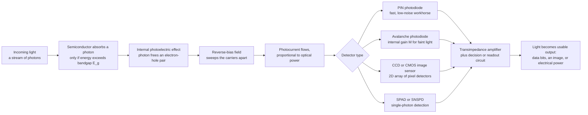

# 📷 Photodetectors and Optical Receivers

> [!abstract] TL;DR
> A **photodetector** is a sliver of semiconductor that runs a light source in reverse: instead of turning current into light, it turns light into current. Each incoming **photon** with energy above the material's **bandgap** is absorbed and knocks an **electron-hole pair** loose (the *internal photoelectric effect*); a reverse-bias field sweeps them out as a **photocurrent** proportional to the light hitting the device. Its two defining numbers are **responsivity** (amps of current per watt of light, $R = \eta q\lambda/hc$) and the **quantum efficiency** $\eta$ (electrons per photon), and it has a hard **wavelength cutoff** at $\lambda_c = hc/E_g$ — silicon detects visible/near-IR out to $\sim1.1\,\mu$m, InGaAs detects the $1.3\text{-}1.6\,\mu$m telecom bands. The same physics powers the **PIN** photodiode (the fast, low-noise workhorse), the **avalanche photodiode** (APD, with internal gain for faint light), the **CCD/CMOS image sensors** in every camera and phone, the **solar cell** that makes power, and **single-photon detectors** (SPADs, SNSPDs) for LiDAR and quantum tech. Wrap a detector in a **transimpedance amplifier** and decision circuit and you have an **optical receiver** — whose limits are set by **shot noise** and **thermal noise**, defining its sensitivity and the bit-error-rate at the end of every fiber link.

---

## Intuition

**Analogy — a bucket that turns raindrops into clicks.** After light has carried your data across an ocean of glass fiber, *something has to catch it* and turn it back into electricity — the exact reverse of the LED or laser diode that launched it. Picture a bucket sitting in the rain, except this bucket is wired so that every single raindrop that lands makes a tiny electrical *click*. Light bright rain, and the clicks blur into a steady current; drizzle, and you get a faint trickle. A **photodetector** is that bucket: a piece of semiconductor where each incoming **photon** that strikes it knocks one electron loose, and the stream of loosened electrons *is* an electrical current proportional to how hard the light is "raining." The color of the light matters, too — a photon has to carry at least a minimum punch (the **bandgap** energy) to knock an electron free at all. Too little energy per drop — light of too long a wavelength — and it patters harmlessly off the roof without making a click. That single cutoff is why a silicon detector goes blind past about a micron while a special material (InGaAs) is needed to "hear" the infrared drops that fiber-optic internet uses.

The reason this device is everywhere is that light is how we now *move* almost everything — pictures, data, energy — and a photodetector is the universal receiving end. Pack millions of these tiny buckets into a grid and you have the **image sensor** in your phone catching a selfie. Put one at the end of a fiber and you have the **receiver** turning the internet's light pulses back into bits. Spread a big one under the sun and — same physics exactly — it becomes the **solar cell** turning sunlight into power. Cool one down and sharpen it and it can register a *single* photon, the faintest possible flicker of light, for LiDAR and quantum computers. The whole art is a tug-of-war between **speed** and **sensitivity**: catch light so faint it is barely there, without your own electronics adding so much hiss that you drown the signal — and do it a billion times a second to keep pace with the data. From selfies to solar power to the receiving end of the internet, photodetection is how light becomes information and energy we can use.

---

## How It Works

### Core mechanics

1. **A photon is absorbed — if it clears the bandgap.** Light enters the semiconductor. A photon is absorbed only when its energy $h\nu$ exceeds the bandgap $E_g$; if $h\nu < E_g$ the crystal is transparent to it and *nothing happens*. This sets the **long-wavelength cutoff** $\lambda_c = hc/E_g \approx 1240/E_g[\text{eV}]$ nm — the single most important spec of a detector material.
2. **Absorption creates an electron-hole pair (internal photoelectric effect).** The absorbed photon lifts an electron from the valence band to the conduction band, leaving a **hole** behind. This is the *internal* photoelectric effect — the mirror image of the electroluminescence that makes an LED emit — and it is why a photodiode is literally a light-emitting diode run backward.
3. **A reverse-bias field sweeps the carriers out as photocurrent.** The device is a p-n (or p-i-n) junction held under **reverse bias**, so its depletion region carries a strong internal field. That field pulls the electron and hole apart before they can recombine and sweeps them to the contacts, producing a **photocurrent** $I_{ph}$ proportional to the incident optical power.
4. **Responsivity and quantum efficiency measure the conversion.** The **quantum efficiency** $\eta$ is electrons collected per photon absorbed. The **responsivity** is the practical figure — current out per watt of light in:
$$R = \frac{I_{ph}}{P_{opt}} = \frac{\eta\, q\, \lambda}{h c}\quad[\text{A/W}].$$
Because of the $\lambda$ in the numerator, responsivity *rises linearly with wavelength* (each longer-wavelength photon is lower-energy, so a given power delivers *more* photons) — right up until the bandgap cutoff, where it collapses to zero.
5. **Choose the material for the band.** Silicon ($E_g\!\approx\!1.12$ eV, $\lambda_c\!\approx\!1.1\,\mu$m) covers the visible and near-IR — cameras, solar cells, LiDAR. **InGaAs** ($E_g\!\approx\!0.75$ eV, $\lambda_c\!\approx\!1.65\,\mu$m) covers the $1310$ nm and $1550$ nm fiber-telecom windows. Germanium sits in between; wide-gap materials (GaN, SiC) make solar-blind UV detectors.
6. **Detector type trades speed against sensitivity.** A **PIN** diode adds an intrinsic layer to widen the absorption region — fast and low-noise but no gain ($\eta\le1$). An **avalanche photodiode (APD)** runs at high field so a photo-carrier triggers **impact-ionization**, an avalanche that multiplies one carrier into $M$ (internal gain), boosting weak signals at the cost of extra noise. **CCD/CMOS image sensors** are 2D arrays of tiny photodiode pixels. **SPADs** and **SNSPDs** are pushed to click on a *single* photon.
7. **The receiver adds amplification and a decision.** A bare photocurrent is tiny (µA or less), so a detector is paired with a **transimpedance amplifier** (converts current to voltage with gain) and, in comms, a **decision circuit** that judges each bit as a 1 or 0. This detector + amplifier + decision chain is the **optical receiver**, and its performance is set by **noise**.

### Flow / Architecture



---

## Key Concepts

### Secondary Level

- **Light in, electricity out.** A photodetector is the opposite of an LED. An LED takes electricity and makes light; a photodetector takes light and makes electricity. Each particle of light (a **photon**) that hits it frees one electron, and the flow of electrons is a current you can measure.
- **Brighter light means more current.** The stronger the light, the more photons per second, the bigger the current. That is how a detector "reads" how bright the light is — and it is why the sensor in a camera can tell a bright sky from a dark shadow.
- **A camera is millions of detectors.** An **image sensor** is a flat grid of millions of tiny photodetectors called **pixels**. Each pixel measures the light falling on its little square, and together they build up a picture. Your phone camera is a chip covered in these.
- **A solar panel is the same idea.** A **solar cell** works by the exact same physics — sunlight knocks electrons loose in silicon — except instead of reading a signal, it collects the electrons as usable **electric power**. Detecting light and harvesting light are two sides of one coin.
- **Some detectors can catch a single photon.** Special, ultra-sensitive detectors can register just *one* photon — the smallest possible amount of light. These are used in LiDAR (the laser "radar" in self-driving cars) and in quantum experiments.
- **The color has to be right.** A detector only responds to certain colors of light. Some materials are blind to infrared; others are made specifically to see it. The material decides what the detector can "see."

### Undergraduate Level

- **The responsivity law.** $R = \eta q\lambda/hc$ [A/W]. In convenient units, the *ideal* ($\eta=1$) responsivity is $R \approx \lambda[\mu\text{m}]/1.24$, so a perfect detector at $1550$ nm gives $1.25$ A/W. Responsivity **rises linearly with wavelength** because lower-energy photons pack more photons into the same optical power — until the cutoff kills it.
- **The cutoff wavelength.** $\lambda_c = hc/E_g \approx 1240/E_g[\text{eV}]$ nm. Photons longer than $\lambda_c$ carry less than $E_g$ and are simply not absorbed. Silicon ($1.12$ eV $\to 1.1\,\mu$m), Ge ($0.66$ eV $\to 1.85\,\mu$m), InGaAs ($0.75$ eV $\to 1.65\,\mu$m). This is why fiber telecom at $1550$ nm *requires* InGaAs, not silicon.
- **PIN photodiode.** Inserting a thick, lightly-doped **intrinsic (i)** layer between p and n widens the depletion region so nearly all light is absorbed *inside* the high-field region. Result: high $\eta$, low capacitance, fast response, low noise, unity gain — the default detector for most links and instruments.
- **Avalanche photodiode (APD).** Bias near breakdown so a single photo-carrier accelerates hard enough to knock loose more carriers (impact ionization), giving an internal **multiplication gain** $M$ (typically $\times10$ to $\times100$). This lifts the signal above the following amplifier's thermal noise — trading raw sensitivity for added **excess noise** and temperature sensitivity.
- **Image sensors — CCD vs CMOS.** Both are 2D pixel arrays of photodiodes. **CCD** shifts accumulated charge bucket-brigade style to one readout amplifier (low noise, historically high quality). **CMOS** puts an amplifier at (or near) each pixel and reads rows in parallel (fast, low-power, cheap, integrable) — now dominant in phones and most cameras.
- **The three noise floors.** (1) **Shot noise**: photocurrent (and dark current) arrive as discrete quanta, giving $\langle i_{shot}^2\rangle = 2q(I_{ph}+I_{dark})B$ — *fundamental*, grows with signal. (2) **Thermal (Johnson) noise** from the load/amplifier: $\langle i_{th}^2\rangle = 4k_BT B/R_L$ — independent of signal, usually dominant in PIN receivers. (3) **Dark current**: the small current that flows with *no* light. Bandwidth $B$ and load $R_L$ trade against noise.
- **SNR, sensitivity, and BER.** Signal-to-noise ratio $\mathrm{SNR} = I_{ph}^2/(\langle i_{shot}^2\rangle+\langle i_{th}^2\rangle)$. **Sensitivity** is the minimum optical power for a target SNR (or, in comms, a target **bit-error-rate**). For on-off-keyed digital links, $\mathrm{BER}=\tfrac12\,\mathrm{erfc}(Q/\sqrt2)$ with $Q=(I_1-I_0)/(\sigma_1+\sigma_0)$; **$Q=6$ gives BER $=10^{-9}$**, the classic sensitivity benchmark.
- **NEP and speed-vs-sensitivity.** The **noise-equivalent power** $\mathrm{NEP}=\sigma_i/R$ [W/$\sqrt{\text{Hz}}$] is the light level that equals the noise. Bigger bandwidth $B$ raises noise ($\propto\sqrt B$), so **faster detectors are less sensitive** — the central design tension of every receiver.

### Graduate Level

- **Photocurrent and transit-time bandwidth.** The primary photocurrent is $I_{ph}=\frac{\eta q}{h\nu}P_{opt}$; the total is set by drift and diffusion of carriers across the depletion width $W$. Bandwidth is limited by the **carrier transit time** $\tau_{tr}=W/v_{sat}$ and the RC time $R_L C_j$ (junction capacitance $C_j=\varepsilon A/W$). There is a **gain-bandwidth-like tradeoff**: widening $W$ improves $\eta$ (more absorption) and lowers $C_j$ but lengthens transit time — optimized with waveguide, uni-traveling-carrier (UTC), and edge-coupled designs for $>100$ GHz devices.
- **APD gain and excess noise.** The multiplied current is $I=MI_{ph}$, but multiplication is stochastic, so shot noise scales as $\langle i^2\rangle = 2q I_{ph} M^2 F(M) B$ with the **excess noise factor** $F(M)=k_A M + (1-k_A)(2-1/M)$, where $k_A$ is the electron/hole ionization ratio. Low $k_A$ (e.g. silicon; InP/InGaAs is worse) gives less excess noise. There is an **optimum gain** $M_{opt}$ that maximizes SNR: below it thermal noise dominates, above it $M^2F$ shot noise takes over.
- **Receiver sensitivity analysis.** A full receiver model sums input-referred noise (thermal from $R_L$ and amplifier, plus signal-dependent shot) to get $\sigma_1,\sigma_0$, then inverts $Q\to$ required $\bar I \to$ required $\bar P$. PIN receivers are typically **thermal-noise limited**; APD and optically-preamplified (EDFA) receivers approach the **quantum limit**, and an ideal photon-counting receiver needs only $\sim$10-20 photons/bit for $10^{-9}$ BER.
- **Coherent detection.** Instead of direct (square-law) detection, mix the incoming field $E_s$ with a strong **local-oscillator** laser $E_{LO}$ on a photodiode. The beat term gives a photocurrent $\propto 2\sqrt{P_s P_{LO}}\cos(\Delta\omega t+\phi)$ — the LO acts as a **noiseless gain**, the receiver becomes **shot-noise (quantum) limited**, and crucially the **phase** is recovered, enabling high-order modulation (QAM), polarization multiplexing, and DSP-based dispersion compensation. Coherent detection is the backbone of modern $>100$ Gb/s per-wavelength long-haul telecom.
- **Single-photon detectors.** **SPADs** bias *above* breakdown (Geiger mode): one carrier triggers a self-sustaining avalanche = a digital click, then must be **quenched** and reset (dead time). Figures of merit: photon detection efficiency (PDE), **dark count rate**, **timing jitter**, **afterpulsing**. **SNSPDs** (superconducting nanowires) offer near-unity efficiency in the IR, sub-30-ps jitter, and very low dark counts — the detectors of choice for quantum key distribution, photonic quantum computing, and deep-space optical links.
- **Photovoltaic vs photoconductive mode.** The same junction operated at **zero/forward bias with no external field** delivers power (fourth-quadrant $I$-$V$) — a **solar cell**, characterized by short-circuit current, open-circuit voltage, fill factor, and the Shockley-Queisser efficiency limit. Under **reverse bias** the identical device is a fast, linear **photodetector**. Detection and energy harvesting are one physics at two operating points.
- **Dark current and materials limits.** Dark current (thermal generation, tunneling, surface leakage) sets the noise floor at low light and worsens exponentially with temperature and narrower bandgap — why IR detectors (InGaAs, HgCdTe, InSb) are often **cooled**. Bandgap engineering, guard rings, passivation, and back-illumination all fight leakage while maximizing fill factor and $\eta$.

---

## Python Demo

```python
# Photodetection in two panels:
#   (a) RESPONSIVITY & QUANTUM EFFICIENCY vs WAVELENGTH:
#       R[A/W] = QE * lambda[nm] / 1240, rising with wavelength up to the
#       BANDGAP CUTOFF where photon energy drops below E_g and detection stops.
#       Silicon (visible/near-IR) vs InGaAs (telecom IR).
#   (b) RECEIVER SENSITIVITY: signal vs shot + thermal noise, giving SNR and
#       the bit-error-rate (BER) vs received optical power -- the minimum
#       detectable power that sets the end of every fiber link.
import numpy as np
import matplotlib.pyplot as plt
from math import erfc

# ---------- (a) Responsivity & quantum efficiency vs wavelength ----------
lam = np.linspace(300.0, 1800.0, 1500)   # wavelength, nm
HC  = 1240.0                             # h*c in eV*nm  ->  lambda_c = HC / E_g

def logistic(x, x0, w):
    return 1.0 / (1.0 + np.exp(-(x - x0) / w))

# Silicon: E_g ~ 1.12 eV -> cutoff ~ 1107 nm; responds across the visible
lam_cut_Si = HC / 1.12
QE_Si = 0.85 * logistic(lam, 360, 25) * (1 - logistic(lam, lam_cut_Si - 40, 30))
R_Si  = QE_Si * lam / 1240.0

# InGaAs: E_g ~ 0.75 eV -> cutoff ~ 1653 nm; the telecom detector
lam_cut_In = HC / 0.75
QE_In = 0.78 * logistic(lam, 920, 30) * (1 - logistic(lam, lam_cut_In - 45, 30))
R_In  = QE_In * lam / 1240.0

R_ideal = lam / 1240.0                   # ideal responsivity (QE = 1)

fig, ax = plt.subplots(1, 2, figsize=(15, 5.8))

ax[0].plot(lam, R_ideal, "k--", lw=1.2, alpha=0.6, label="ideal, QE = 1")
ax[0].plot(lam, R_Si, lw=2.5, color="#1f77b4", label="Silicon PIN")
ax[0].plot(lam, R_In, lw=2.5, color="#d62728", label="InGaAs PIN")
ax[0].axvspan(380, 750, color="yellow", alpha=0.15, label="visible band")
ax[0].axvline(1310, ls=":", color="teal",   lw=1)
ax[0].axvline(1550, ls=":", color="purple", lw=1)
ax[0].text(1300, 0.03, "1310", color="teal",   fontsize=8, rotation=90, va="bottom")
ax[0].text(1540, 0.03, "1550", color="purple", fontsize=8, rotation=90, va="bottom")
ax[0].axvline(lam_cut_Si, ls="--", color="#1f77b4", lw=1, alpha=0.6)
ax[0].axvline(lam_cut_In, ls="--", color="#d62728", lw=1, alpha=0.6)
ax[0].text(lam_cut_Si + 10, 1.02, "Si cutoff\n~1100 nm",     color="#1f77b4", fontsize=8)
ax[0].text(lam_cut_In - 300, 1.18, "InGaAs cutoff\n~1650 nm", color="#d62728", fontsize=8)
ax[0].set_xlabel("wavelength  [nm]")
ax[0].set_ylabel("responsivity  R  [A/W]")
ax[0].set_title("(a) Responsivity rises with wavelength\nthen collapses at the bandgap cutoff")
ax[0].set_ylim(0, 1.45)
ax[0].grid(True, alpha=0.3)
ax[0].legend(loc="upper left", fontsize=8)

# ---------- (b) Receiver sensitivity: SNR & BER vs received power ----------
q   = 1.602e-19    # C
kB  = 1.381e-23    # J/K
T   = 300.0        # K
B   = 10e9         # electrical bandwidth, 10 GHz  (a 10 Gb/s link)
RL  = 50.0         # load resistance, ohm
R_r = 0.9          # responsivity at 1550 nm (InGaAs PIN), A/W
Idk = 5e-9         # dark current, 5 nA

P_dBm = np.linspace(-40, -5, 400)        # received optical power, dBm
P_W   = 1e-3 * 10 ** (P_dBm / 10.0)      # dBm -> watts
Iph   = R_r * P_W                        # signal photocurrent

i2_shot = 2 * q * (Iph + Idk) * B        # shot noise variance (A^2)
i2_th   = 4 * kB * T * B / RL            # thermal noise variance (A^2)
sig_on  = np.sqrt(i2_shot + i2_th)       # noise on a "1" bit
sig_off = np.sqrt(2 * q * Idk * B + i2_th)  # noise on a "0" bit

SNR = Iph ** 2 / (i2_shot + i2_th)
Q   = Iph / (sig_on + sig_off)           # OOK Q-factor
BER = 0.5 * np.array([erfc(qi / np.sqrt(2)) for qi in Q])

ax[1].semilogy(P_dBm, SNR, lw=2.5, color="#2ca02c", label="SNR")
ax[1].set_xlabel("received optical power  [dBm]")
ax[1].set_ylabel("signal-to-noise ratio", color="#2ca02c")
ax[1].tick_params(axis="y", labelcolor="#2ca02c")
ax[1].grid(True, alpha=0.3, which="both")
ax[1].set_title("(b) Receiver sensitivity\nshot + thermal noise set the BER floor")

axb = ax[1].twinx()
axb.semilogy(P_dBm, BER, lw=2.5, color="#9467bd", label="BER")
axb.set_ylabel("bit-error-rate", color="#9467bd")
axb.tick_params(axis="y", labelcolor="#9467bd")
axb.set_ylim(1e-15, 1.0)
axb.axhline(1e-9, ls="--", color="gray", lw=1)
axb.text(-39, 1.6e-9, "BER = 1e-9 target", fontsize=8, color="gray")

idx = int(np.argmin(np.abs(BER - 1e-9)))  # sensitivity: power at BER = 1e-9
axb.axvline(P_dBm[idx], ls=":", color="k", lw=1)
axb.annotate(f"sensitivity\n{P_dBm[idx]:.1f} dBm",
             (P_dBm[idx], 1e-9), textcoords="offset points",
             xytext=(12, 45), fontsize=8,
             arrowprops=dict(arrowstyle="->", color="k"))

plt.tight_layout()
plt.savefig("photodetectors_receivers.png", dpi=120)
plt.show()

# ---- Numerical checks ----
print(f"Silicon cutoff : {lam_cut_Si:6.0f} nm  (E_g = 1.12 eV)")
print(f"InGaAs  cutoff : {lam_cut_In:6.0f} nm  (E_g = 0.75 eV)")
print(f"Ideal responsivity at 1550 nm = {1550/1240:.2f} A/W")
print(f"Thermal noise rms current = {np.sqrt(i2_th)*1e6:.2f} uA over {B/1e9:.0f} GHz")
print(f"Receiver sensitivity at BER=1e-9: {P_dBm[idx]:.1f} dBm "
      f"= {P_W[idx]*1e6:.2f} uW  ({Iph[idx]*1e6:.1f} uA photocurrent)")
# -> Silicon sees visible/near-IR; InGaAs is needed for the 1550 nm fiber window.
#    A 10 GHz PIN receiver here is THERMAL-noise limited -> ~ -16 dBm sensitivity,
#    which is exactly why faint-signal links reach for APDs, EDFA preamps, or
#    coherent detection to push the floor down toward the quantum limit.
```

Panel **(a)** is the detector's identity card: responsivity climbs steadily with wavelength — because a longer-wavelength photon is lower-energy, so the same *watt* of light delivers *more photons* and hence more electrons — right up to the **bandgap cutoff**, where photons no longer carry enough energy to be absorbed and the response falls off a cliff. Silicon's cliff at $\sim1.1\,\mu$m is why your camera and solar cells are silicon but the internet's $1550$ nm light is invisible to them; **InGaAs**, with its narrower gap, extends the response into the telecom bands. Panel **(b)** is the receiver's identity card: the signal grows as photocurrent squared while **shot noise** (fundamental, from the quantized arrival of photons) and **thermal noise** (from the load resistor and amplifier) set an unavoidable floor. The **BER** plunges once the received power lifts the signal clear of that floor, and the power at which BER hits $10^{-9}$ (the classic $Q=6$ point) is the receiver's **sensitivity**. This particular PIN receiver is thermal-noise limited — the very reason engineers reach for APD gain, optical preamplifiers, or coherent detection when the light is faint.

---

## Real-World Applications

- **Fiber-optic receivers — the end of the internet's light.** Every fiber link terminates in a photodetector: **InGaAs PIN or APD** diodes convert the modulated $1310/1550$ nm pulses back into current, feed a transimpedance amplifier and clock-and-data-recovery circuit, and hand off the bits. Datacenter and long-haul capacity is ultimately set by this receiver's sensitivity and bandwidth — the counterpart to the DFB/VCSEL sources that launched the light.
- **Image sensors — the imaging revolution.** The **CMOS sensor** in every phone and camera is an array of tens of millions of silicon photodiode **pixels**, each with a color filter and micro-lens, read out into the raw pixel grid that image-processing pipelines turn into a photograph. **CCDs** still serve scientific and astronomical imaging where lowest read noise matters. Back-illuminated, stacked-sensor designs push fill factor and low-light performance.
- **Solar cells — light to energy.** A **photovoltaic** cell is the same photon-to-carrier physics operated to deliver power instead of a signal — silicon PV for terrestrial power, high-efficiency multi-junction III-V cells for space and concentrators. Responsivity, quantum efficiency, and the bandgap-vs-spectrum tradeoff carry over directly (Shockley-Queisser).
- **LiDAR and 3D sensing.** Time-of-flight **LiDAR** in autonomous vehicles and phones times the return of laser pulses using fast **APDs** or Geiger-mode **SPAD arrays** (dToF), where single-photon sensitivity and picosecond timing set the range and resolution.
- **Scientific and medical instruments.** **Spectrometers**, fluorescence and Raman systems, **pulse oximeters** (photodiodes reading red/IR transmitted through tissue), optical **coherence tomography**, particle physics calorimetry, and astronomy all live or die by detector responsivity, dark current, and noise.
- **Quantum technology.** **SNSPDs** and **SPADs** register individual photons for quantum key distribution, photonic quantum computing, and deep-space optical communication — where every photon counts and dark counts are the enemy.
- **Everyday sensing.** Optical mice, barcode scanners, IR remote receivers, ambient-light and proximity sensors, and camera autofocus all rest on humble silicon photodiodes and phototransistors.

---

## Common Pitfalls

- **Expecting one detector material to see every wavelength.** The **bandgap cutoff** is a hard wall: silicon is *blind* beyond $\sim1.1\,\mu$m, so it cannot detect $1550$ nm telecom light no matter how bright — you need InGaAs. Always match the detector material to the wavelength band before anything else.
- **Confusing high responsivity with high sensitivity.** Responsivity (A/W) is conversion *gain*; **sensitivity** is the *minimum detectable* power, which is set by **noise**, not gain. A noisy high-responsivity detector can be *less* sensitive than a quiet low-responsivity one. Sensitivity = signal relative to noise, always.
- **Forgetting that faster means noisier.** Noise grows as $\sqrt{B}$, so cranking up bandwidth for speed *raises the noise floor* and *degrades sensitivity*. The speed-vs-sensitivity tradeoff is not optional — you cannot maximize both, and choosing bandwidth wider than your signal needs just imports noise.
- **Assuming an APD is always better.** APD internal gain helps only when the receiver is **thermal-noise limited** and the gain is near its **optimum**. Push gain too high and the multiplied ($M^2F$) shot noise and excess-noise factor *overtake* the benefit, sensitivity worsens, and the device grows exquisitely temperature- and bias-sensitive.
- **Ignoring dark current and temperature.** Dark current flows with *no light* and sets the noise floor at low signal; it rises roughly exponentially with temperature and is worse for narrow-gap IR detectors — which is why sensitive IR and single-photon detectors are **cooled**. Specifying a detector without its dark current and operating temperature is meaningless.
- **Neglecting the amplifier and load.** In most PIN receivers the dominant noise is **thermal noise from the load/TIA**, not the detector itself. Treating the photodiode in isolation and ignoring $R_L$, junction capacitance $C_j$, and amplifier noise gives wildly optimistic sensitivity. The **receiver** — detector plus front-end — is the real unit of performance.
- **Saturating or over-illuminating the detector.** Too much light drives the diode out of its linear range, floods pixels into **blooming**, or damages the device; single-photon detectors have **dead time** and **afterpulsing** that distort counts at high rates. Linearity and count-rate limits matter as much as sensitivity.

---

## Related Concepts

**Within this vault (Optics and Photonics):**

- [[Optics_and_Photonics_Overview]] — the parent map; this note is the *receiving* half of Pillar 4 (fiber and integrated photonics), the indispensable counterpart to the light-source notes that close the photonic loop.
- [[Optical_Properties_and_Photonic_Materials]] — the **absorption coefficient**, refractive index, and band edge of materials that decide *where* and *how strongly* a photon is absorbed inside a detector.

**The photon-to-carrier physics (why absorption makes current):**

- [[Photoelectric_Effect_and_Compton]] — the photoelectric effect itself; a photodiode is the *internal* photoelectric effect in a solid, absorbing a photon to free a carrier.
- [[Electronic_Band_Structure]] — the origin of the bandgap $E_g$ that sets the all-important detection **cutoff wavelength** $\lambda_c = hc/E_g$.
- [[Semiconductors_Intrinsic_and_Extrinsic]] — the doping and carrier populations of the semiconductor that absorbs the light and carries the photocurrent.

**The device and its circuit (a diode run in reverse, plus a front-end):**

- [[Semiconductor_Devices_and_Diodes]] — the p-n diode whose *reverse-biased* junction is exactly a photodiode; the LED/laser diode run backward.
- [[p_n_Junctions_and_Diodes]] — the depletion region, reverse-bias field, and junction physics that sweep out the photo-generated carriers.
- [[Operational_Amplifiers]] — the op-amp at the heart of the **transimpedance amplifier** that turns the tiny photocurrent into a usable voltage in an optical receiver.

**Where the pixels go (imaging):**

- [[Image_Representations]] — how the raw pixel array an image sensor produces becomes the digital image (channels, color, tensors) that vision systems process.

*Sibling notes in this section (Fiber and Integrated Photonics): **Semiconductor_Light_Sources_LEDs_and_Laser_Diodes** (the emitters this device catches — the same junction physics in reverse), **Fiber_Optic_Communication** (the link whose receiving end is built from these detectors), **Cameras_Sensors_and_Digital_Imaging** (image sensors as vast 2D arrays of these photodetectors), **Optical_Sensing_LIDAR_and_Optical_Coherence_Tomography** (LiDAR and OCT built on fast and single-photon detectors), and **Quantum_Optics_and_Photons** (where single-photon detectors register the faintest possible light).*

---

## Review Questions

1. **(Secondary)** A photodetector is often described as "an LED run backward." Explain in plain terms what that means — what goes *in* and what comes *out* of each device — and then explain why a **solar panel** and a camera's **image sensor** are, at heart, the same kind of device as a fiber-optic receiver. Why can brighter light produce a bigger electrical signal?
2. **(Undergraduate)** A silicon detector works beautifully for a visible-light camera but is useless for a $1550$ nm fiber link, which needs InGaAs instead. (a) Using the responsivity law $R=\eta q\lambda/hc$ and the cutoff $\lambda_c = hc/E_g$, explain *both* why responsivity **rises** with wavelength *and* why it **collapses** past a certain wavelength. (b) Compute the cutoff wavelengths of silicon ($E_g=1.12$ eV) and InGaAs ($E_g=0.75$ eV) and state which detects the $1550$ nm band. (c) Distinguish **responsivity** from **sensitivity**, and name the two noise sources that set the latter.
3. **(Graduate)** A receiver designer must hit a $10^{-9}$ BER on a faint fiber signal. (a) Write the shot- and thermal-noise variances, form the $Q$-factor, and explain why $Q=6$ corresponds to BER $=10^{-9}$. (b) The designer considers an **APD**: give the excess-noise factor $F(M)$ and explain why there is an *optimum* gain $M_{opt}$ rather than "more gain is better." (c) Alternatively they consider **coherent detection** with a local oscillator: explain how the LO provides effective gain, why the receiver becomes shot-noise (quantum) limited, and what extra information coherent detection recovers that direct detection throws away.

---

## Sources

- Saleh, B. E. A. & Teich, M. C. — *Fundamentals of Photonics*, 3rd ed. (Wiley) — photodetectors, photodiodes, APDs, responsivity and quantum efficiency, receiver noise and sensitivity.
- Sze, S. M. & Ng, K. K. — *Physics of Semiconductor Devices*, 3rd ed. (Wiley) — photodiode, PIN, avalanche photodiode, and solar-cell device physics; dark current and gain.
- Agrawal, G. P. — *Fiber-Optic Communication Systems*, 4th ed. (Wiley) — optical receivers, PIN/APD sensitivity, shot and thermal noise, BER, and coherent detection.
- Donati, S. — *Photodetectors: Devices, Circuits, and Applications* (Prentice Hall / Wiley) — detector types, transimpedance front-ends, noise analysis, and single-photon detection.
- Nakamura, S. et al. & standards refs on CMOS image sensors — Nakamura, J. (ed.), *Image Sensors and Signal Processing for Digital Still Cameras* (CRC Press) — CCD vs CMOS pixel architectures and readout noise.

---

#optics #photodetector #photodiode #image-sensor #quantum-efficiency
