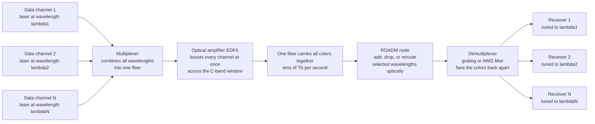

# 🌐 Wavelength-Division Multiplexing and Optical Networks

> [!abstract] TL;DR
> A single hair-thin optical fiber can already carry an astonishing amount of data — but **wavelength-division multiplexing (WDM)** multiplies that capacity *dozens of times over* with one elegant trick: send many different **colors** (wavelengths) of laser light down the same fiber at once, each color a completely independent data channel, exactly like a multi-lane highway or radio stations on different frequencies. A **multiplexer** combines the wavelengths into one fiber; a single **optical amplifier** (the EDFA's C-band gain window is the reason WDM took off) boosts *all* of them together; and a **demultiplexer** — a prism-like grating or array-waveguide filter — fans the colors back apart to separate receivers. Total capacity = channels × per-channel rate: pack **80-100+** channels at **100-400 Gb/s** each and one strand of glass suddenly carries **tens of terabits per second** — the capacity of the entire early internet. WDM is why fiber capacity keeps exploding to meet insatiable bandwidth demand, and it turned rigid point-to-point links into flexible, reconfigurable optical **networks**.

---

## Intuition

**Analogy — a multi-lane highway of colored light (or a radio dial).** Picture a single-lane road that is already full of fast traffic. You cannot make the cars go much faster, so how do you move more of them? You paint extra lanes onto the *same* road, and each lane carries its own stream of traffic without interfering with the others. WDM does exactly this to a fiber: it opens dozens of independent "lanes," and the lanes are **colors of light**. Or think of radio: hundreds of stations broadcast *simultaneously* over the same air, each on its own frequency, and your dial simply tunes in the one you want. A fiber running WDM is a bundle of radio stations made of light — many lasers of slightly different color all pouring down one glass thread at the same instant, each one an independent conversation.

At the far end sits the magic that makes it usable: a **prism-like device** (a diffraction grating or an array-waveguide grating) that fans the mixed colors back apart, sending each wavelength to its own receiver — the same way Newton's prism splits white light into a rainbow, run in reverse to *un-mix* the channels. Pack 80, 100, even more of these wavelength channels into one fiber, each running at 100+ gigabits per second, and a single strand of glass suddenly carries **tens of terabits per second** without laying one meter of new fiber. And once each color is an independent path you can *route* it: drop one wavelength off at a city, add another, send a third straight through — turning static cables into a living, reconfigurable optical **network**. That is the culmination of fiber photonics: glass threads woven into a vast, flexible information web.

---

## How It Works

### Core mechanics

1. **Assign each data stream its own wavelength.** A bank of laser diodes each emits at a slightly different, precisely controlled wavelength (an **optical carrier**), locked to a standard grid. Each laser is modulated with its own independent bitstream — this is **frequency-division multiplexing** carried out at optical frequencies, directly analogous to radio channels.
2. **Multiplex the colors into one fiber.** A passive **multiplexer** (a wavelength combiner) merges all the individual wavelengths onto a single fiber. Because the channels sit at different optical frequencies, they overlap in space and time but not in the spectrum — they pass through one another without interference.
3. **Amplify them all at once.** As the combined signal travels, it weakens. An **Erbium-Doped Fiber Amplifier (EDFA)** boosts *every* channel simultaneously in one device, because its gain window spans the whole **C-band** (~1530-1565 nm). This single fact is *why WDM became practical*: without a shared amplifier you would need one repeater per channel; with the EDFA one amplifier lifts 80+ channels together, so adding wavelengths is nearly free.
4. **Demultiplex at the far end.** A **demultiplexer** — a diffraction **grating**, an **array-waveguide grating (AWG)**, or a cascade of thin-film filters — spatially separates the wavelengths, sending each color to its own photodetector/receiver. This is a prism running in reverse: many colors in on one fiber, each color out on its own port.
5. **Capacity multiplies.** Total capacity = (number of channels) × (bit-rate per channel) × (polarizations) × (spatial modes). Eighty channels at 100 Gb/s is 8 Tb/s; push to 400 Gb/s coherent channels with dual polarization and one fiber crosses **tens of Tb/s**, with lab records reaching **petabits** using multi-core and multi-mode fiber.
6. **Route the wavelengths into a network.** Because each wavelength is an independent path (a **lightpath**), nodes can **add, drop, or reroute** individual colors *optically* — no conversion to electronics. **Optical add-drop multiplexers (OADMs)** and their reconfigurable cousins (**ROADMs**), plus **optical cross-connects**, turn point-to-point links into a switched optical mesh governed by **routing-and-wavelength-assignment (RWA)**.

### Flow / Architecture



---

## Key Concepts

### Secondary Level

- **One fiber, many colors.** A fiber does not have to carry just one beam of light. WDM sends **many colors at the same time**, and each color is a totally separate data channel — like painting many lanes onto one highway so far more traffic fits.
- **Just like radio.** Many radio stations broadcast at once because each uses a different frequency and your radio tunes in one. WDM is the same idea with light: many "stations" (colors) share one fiber, and a filter at the end tunes in each one.
- **A prism un-mixes the colors.** At the receiving end a prism-like device fans the mixed colors back apart, sending each color to its own detector — the reverse of how a prism splits sunlight into a rainbow.
- **Capacity multiplies without new cable.** If one color carries a certain amount of data, then 80 colors carry roughly 80 times as much — on the *same* fiber. This is how the internet's backbone keeps up with our ever-growing appetite for video and data without digging up the ground to lay more glass.
- **From cables to networks.** Because each color is its own path, you can send different colors to different cities and reroute them at junctions. That flexibility turns simple cables into a smart, reconfigurable **network** of light.

### Undergraduate Level

- **WDM = optical frequency-division multiplexing.** Channels are stacked in the frequency domain. The standard **ITU-T grid** places DWDM channels at fixed frequencies (e.g. 50 GHz or 100 GHz spacing) anchored to 193.1 THz; converting, 50 GHz near 1550 nm is about 0.4 nm of wavelength spacing.
- **CWDM vs DWDM.** **CWDM (coarse)** uses a *few*, *widely* spaced channels (20 nm grid, ~1270-1610 nm) with cheap, uncooled lasers and no amplifier — great for short, low-cost links. **DWDM (dense)** packs **40-100+** channels at 50/100 GHz spacing into the amplifiable C/L bands — the technology of long-haul and metro backbones.
- **The capacity equation.** Total capacity $C = N_\text{ch} \times R_\text{ch} \times P \times M$, where $N_\text{ch}$ is channel count, $R_\text{ch}$ the per-channel bit-rate, $P$ the number of polarizations (2 with polarization multiplexing), and $M$ the number of spatial modes/cores. Every factor is a multiplier — WDM attacks $N_\text{ch}$.
- **Why the C-band.** The EDFA amplifies ~1530-1565 nm (C-band) and ~1565-1625 nm (L-band). WDM channels are packed *inside these windows* precisely because one amplifier can boost them all — tying the whole scheme to optical amplifiers.
- **The mux/demux hardware.** Combiners and splitters are built from **array-waveguide gratings (AWGs)**, **thin-film interference filters**, and **diffraction gratings** — all wavelength-selective passive optics. An AWG is an integrated "spectral fan" that maps each wavelength to its own output waveguide.
- **Spectral efficiency.** Measured in **bits/s/Hz**, it says how much data you fit per unit of spectrum. Advanced **coherent modulation** (QPSK, 16-QAM, 64-QAM) plus dual-polarization pushes spectral efficiency far beyond simple on-off keying, packing more bits into each channel and each hertz of the precious amplifier window.
- **Dispersion still bites.** Because each channel is a slightly different color, **chromatic dispersion** (see the dispersion note) spreads pulses at different rates across the band, and closely spaced channels can crosstalk via fiber nonlinearity — both set practical limits on how tightly channels can be packed and how far they reach.

### Graduate Level

- **Routing and Wavelength Assignment (RWA).** Establishing a **lightpath** across a mesh network requires both choosing a route *and* assigning a wavelength on every link. Without wavelength converters, the **wavelength-continuity constraint** forces one color end-to-end, making RWA an NP-hard combinatorial problem solved by ILP formulations or heuristics (shortest-path plus first-fit / most-used coloring). Graph coloring of the path-conflict graph bounds the wavelengths needed.
- **Wavelength reuse and blocking.** The same wavelength can carry different lightpaths on link-disjoint routes (spatial reuse), so a network with $W$ wavelengths supports far more than $W$ simultaneous connections. Wavelength converters relax the continuity constraint and lower **blocking probability** at the cost of hardware.
- **ROADM architectures.** A **Reconfigurable Optical Add-Drop Multiplexer** uses **wavelength-selective switches (WSSs)** — typically MEMS or LCoS beam-steering behind a grating — to route any wavelength from any input to any output. **Colorless, directionless, contentionless (CDC)** ROADMs remove the constraints on which port/direction a given wavelength can be added or dropped, enabling fully remote, software-driven reconfiguration.
- **Coherent detection and DSP.** Modern channels use **coherent receivers**: a local-oscillator laser beats against the signal so amplitude *and* phase are recovered, enabling multi-level QAM. Digital signal processing then compensates chromatic dispersion, polarization-mode dispersion, and phase noise *electronically* — decoupling reach from fiber impairments and enabling flexible bit-rates.
- **Elastic / flexible-grid optical networks.** The rigid 50 GHz grid gives way to a **flexible grid** (12.5 GHz slots) where a **superchannel** occupies just enough spectrum for its modulation format and rate. **Bandwidth-variable transponders** trade reach against spectral efficiency (fewer bits/symbol for longer distance), and **software-defined optical networking (SDON)** orchestrates spectrum allocation dynamically.
- **The Shannon limit of fiber.** Per-channel capacity is bounded by the **nonlinear Shannon limit**: raising launch power to improve SNR eventually *worsens* performance through Kerr nonlinearity, capping spectral efficiency. This drives the move to **space-division multiplexing** (multi-core and few-mode fibers) as the next capacity axis once wavelength and modulation are saturated.
- **Network hierarchy.** Long-haul/ultra-long-haul DWDM spans continents and oceans (submarine cables); metro rings and meshes serve cities with ROADMs; the access layer reaches homes via **PON** (passive optical networks), which themselves often use coarse WDM to separate upstream/downstream and overlay wavelengths.

---

## Python Demo

```python
# WDM capacity and optical networks in three panels:
#   (a) WDM SPECTRUM: many equally-spaced channels on the 50 GHz ITU grid,
#       packed across the EDFA C-band gain window; one demux filter passband
#       selects a single channel.
#   (b) CAPACITY = channels x per-channel bit-rate: adding channels (and faster
#       coherent channels) multiplies total fiber capacity -- no new glass.
#   (c) WAVELENGTH ROUTING: lightpaths on distinct wavelengths routed across a
#       5-node optical ring, illustrating spatial WAVELENGTH REUSE.
import numpy as np
import matplotlib.pyplot as plt

c = 299792.458  # speed of light in nm*THz, so lambda[nm] = c / f[THz]

# ---------- (a) WDM channel spectrum on the ITU 50 GHz grid ----------
f_start, f_end = 191.70, 196.10          # C-band edges in THz (~1529-1564 nm)
spacing_THz = 50.0 / 1000.0              # 50 GHz channel spacing
f_ch = np.arange(f_start, f_end + 1e-9, spacing_THz)   # channel center freqs
N = f_ch.size
lam_ch = c / f_ch                        # channel wavelengths, nm

f = np.linspace(f_start - 0.1, f_end + 0.1, 6000)      # dense frequency axis
ch_width = 0.010                         # ~10 GHz optical width for drawing
spec = np.zeros_like(f)
for fc in f_ch:                          # one Gaussian bump per channel
    spec += np.exp(-((f - fc) ** 2) / (2 * ch_width ** 2))

# EDFA C-band gain window: smooth envelope over the band
fmid, fhalf = 0.5 * (f_start + f_end), 0.5 * (f_end - f_start)
gain = 1.0 - 0.35 * ((f - fmid) / fhalf) ** 2

sel = 60                                 # one demux filter selects channel 60
filt = np.exp(-((f - f_ch[sel]) ** 2) / (2 * 0.011 ** 2))

fig, ax = plt.subplots(1, 3, figsize=(18, 5.2))

ax[0].fill_between(f, gain, color="gold", alpha=0.18,
                   label="EDFA C-band gain window")
ax[0].plot(f, spec, lw=0.8, color="navy")
ax[0].plot(f, filt, lw=2.0, color="crimson",
           label=f"demux filter -> channel {sel}")
ax[0].set_xlabel("optical frequency  [THz]   (50 GHz ITU grid)")
ax[0].set_ylabel("normalized power")
ax[0].set_title(f"(a) WDM spectrum: {N} channels in ONE fiber\n"
                f"C-band {lam_ch.max():.1f}-{lam_ch.min():.1f} nm")
ax[0].set_ylim(0, 1.25)
ax[0].legend(loc="upper right", fontsize=8)
ax[0].grid(True, alpha=0.3)

# ---------- (b) total capacity = channels x per-channel rate ----------
n_ch = np.arange(1, N + 1)
for R, col in [(10, "#888888"), (100, "#0077cc"), (400, "#cc3300")]:
    ax[1].plot(n_ch, n_ch * R / 1000.0, lw=2.2, color=col,
               label=f"{R} Gb/s per channel")
ax[1].axvline(N, ls="--", color="k", lw=1, alpha=0.6)
cap_100, cap_400 = N * 100 / 1000.0, N * 400 / 1000.0
ax[1].annotate(f"{N} ch x 100 Gb/s = {cap_100:.1f} Tb/s",
               (N, cap_100), textcoords="offset points", xytext=(-158, 10),
               color="#0077cc", fontsize=9)
ax[1].annotate(f"{N} ch x 400 Gb/s = {cap_400:.1f} Tb/s",
               (N, cap_400), textcoords="offset points", xytext=(-158, 4),
               color="#cc3300", fontsize=9)
ax[1].set_xlabel("number of WDM channels")
ax[1].set_ylabel("total fiber capacity  [Tb/s]")
ax[1].set_title("(b) Capacity multiplies with channels\none fiber, no new glass")
ax[1].legend(loc="upper left", fontsize=9)
ax[1].grid(True, alpha=0.3)

# ---------- (c) wavelength routing on a 5-node optical ring ----------
names = ["A", "B", "C", "D", "E"]
ang = np.linspace(np.pi / 2, np.pi / 2 + 2 * np.pi, 6)[:5]
pos = {nm: (np.cos(a), np.sin(a)) for nm, a in zip(names, ang)}

for i in range(5):                        # physical ring links in gray
    x0, y0 = pos[names[i]]
    x1, y1 = pos[names[(i + 1) % 5]]
    ax[2].plot([x0, x1], [y0, y1], color="lightgray", lw=6, zorder=1)

# lightpaths: (node path, wavelength color, label) -- lambda1 reused twice
lightpaths = [
    (["A", "B", "C"], "red",   "lambda1: A->C"),
    (["C", "D", "E"], "red",   "lambda1 REUSED: C->E"),
    (["A", "E"],      "green", "lambda2: A->E"),
    (["B", "C", "D"], "blue",  "lambda3: B->D"),
]
offsets = [0.0, 0.0, 0.06, -0.06]
for (path, col, lbl), off in zip(lightpaths, offsets):
    for i in range(len(path) - 1):
        x0, y0 = pos[path[i]]
        x1, y1 = pos[path[i + 1]]
        dx, dy = x1 - x0, y1 - y0
        norm = np.hypot(dx, dy)
        ox, oy = -dy / norm * off, dx / norm * off   # small offset to separate
        ax[2].plot([x0 + ox, x1 + ox], [y0 + oy, y1 + oy], color=col, lw=2.4,
                   zorder=3, label=lbl if i == 0 else None)

for nm, (x, y) in pos.items():
    ax[2].scatter([x], [y], s=900, color="white", edgecolor="k", zorder=4)
    ax[2].text(x, y, nm, ha="center", va="center", fontsize=12,
               fontweight="bold", zorder=5)

ax[2].set_title("(c) Wavelength routing on a ROADM ring\n"
                "distinct wavelengths; lambda1 spatially reused")
ax[2].legend(loc="lower center", fontsize=7.5, ncol=2)
ax[2].set_xlim(-1.5, 1.5)
ax[2].set_ylim(-1.6, 1.5)
ax[2].axis("off")

plt.tight_layout()
plt.savefig("wdm_and_optical_networks.png", dpi=120)
plt.show()

# ---- Numerical checks ----
print(f"C-band 50 GHz grid: {N} channels, "
      f"{lam_ch.max():.2f}-{lam_ch.min():.2f} nm")
print(f"Total capacity @ 100 Gb/s/ch = {N * 100 / 1000:.1f} Tb/s")
print(f"Total capacity @ 400 Gb/s/ch = {N * 400 / 1000:.1f} Tb/s")
print(f"With dual polarization (x2)  = {N * 400 * 2 / 1000:.1f} Tb/s on one fiber")
# -> 89 channels across ~1529-1564 nm on the 50 GHz grid
# -> 89 x 100 Gb/s = 8.9 Tb/s ; 89 x 400 Gb/s = 35.6 Tb/s ; x2 pol = 71.2 Tb/s
```

Panel **(a)** is the whole idea in one picture: dozens of narrow channels packed shoulder-to-shoulder across the EDFA's C-band gain window, all riding one fiber, with a single **demux filter** (red) reaching in to pluck out one channel while the amplifier lifts them all at once. Panel **(b)** is why WDM matters commercially — capacity is *linear in channel count*, so adding wavelengths (and adopting faster 100 → 400 Gb/s coherent channels) multiplies a fiber's throughput into the tens of Tb/s **without laying new glass**. Panel **(c)** shows the leap from links to networks: independent **lightpaths** on different wavelengths are routed across a ring, and because the same color can serve link-disjoint paths, **λ1 is reused** on A→C and C→E — the spatial reuse that lets a handful of wavelengths support a whole mesh of connections.

---

## Real-World Applications

- **The internet backbone.** Virtually every long-haul and submarine fiber route runs **DWDM**: dozens to hundreds of wavelengths per fiber pair, each at 100-400 Gb/s coherent, delivering multi-Tb/s to tens-of-Tb/s per fiber. WDM is the reason global traffic growth has been absorbed for decades without proportionally digging new cable.
- **Metro and regional networks.** **ROADM** rings and meshes let carriers add, drop, and reroute wavelengths between cities remotely and in software, provisioning a new lightpath in minutes rather than dispatching technicians — the practical face of reconfigurable optical networking.
- **Data-center interconnect (DCI).** Hyperscalers (Google, Meta, Amazon, Microsoft) run purpose-built high-capacity DWDM between data centers, and increasingly **coherent pluggable optics** (400ZR/ZR+) put DWDM directly into router ports — WDM has moved from the backbone into the campus.
- **Passive Optical Networks (PON) to the home.** Fiber-to-the-home uses WDM to separate downstream and upstream light on one fiber; **WDM-PON** and next-gen PON assign wavelengths per subscriber or service, scaling access capacity without new fiber to each house.
- **Submarine cable systems.** Transoceanic cables pack many WDM channels per fiber pair across thousands of kilometers, with chains of EDFAs; total design capacity is now measured in hundreds of Tb/s per cable — the arteries of intercontinental data.
- **Cable-TV and mobile fronthaul/backhaul.** Cable operators overlay analog/digital services on separate wavelengths, and mobile networks use CWDM/DWDM to carry 5G fronthaul (CPRI/eCPRI) between radio units and baseband over shared fiber.
- **Record-breaking research links.** Lab demonstrations combine WDM with **space-division multiplexing** (multi-core/few-mode fiber) and dense coherent modulation to reach **petabit-per-second** transmission over a single fiber — showing where the capacity axis heads next.

---

## Common Pitfalls

- **Confusing WDM with faster bits.** WDM does *not* speed up a single channel — it adds *more channels* in parallel. It is space (spectrum) multiplication, not time compression. Per-channel rate is a separate lever (modulation/coherent DSP); real systems push both.
- **Ignoring the amplifier window.** You cannot place WDM channels just anywhere — they must sit inside the **EDFA gain band** (C/L) so one amplifier can boost them all. Channels outside the amplifiable window get no shared gain and defeat the whole economic advantage of WDM.
- **Packing channels too tightly.** Squeezing channels closer raises spectral efficiency but invites **linear crosstalk** (imperfect filters) and **nonlinear crosstalk** (four-wave mixing, cross-phase modulation), especially at high launch power. There is a nonlinear Shannon ceiling; more power is not always more capacity.
- **Forgetting chromatic dispersion across the band.** Different channels are different colors, so each accumulates dispersion at a slightly different rate. Long links need dispersion management (or coherent DSP compensation) tuned across the whole band, not just at the center wavelength.
- **Assuming any wavelength routes anywhere for free.** Without wavelength converters, a lightpath must keep the **same wavelength end-to-end** (wavelength-continuity constraint). Poor routing-and-wavelength-assignment leads to **blocking** even when spare capacity exists on individual links.
- **Overlooking laser wavelength drift.** DWDM lasers must be **temperature-stabilized and frequency-locked** to the ITU grid; a channel that drifts collides with its neighbor. Cheap uncooled lasers are fine for coarse CWDM but not for 50 GHz DWDM.
- **Treating EDFA gain as flat.** EDFA gain is wavelength-dependent, so channels at the band edges get amplified unequally; long chains accumulate **gain tilt** and unequal SNR. Real systems use **gain-flattening filters** and per-channel power equalization.

---

## Related Concepts

**Within this vault (Optics and Photonics):**

- [[Optics_and_Photonics_Overview]] — the parent map of the field; this note sits under Pillar 4 (Fiber and Integrated Photonics) as the *capacity-and-networking* capstone of fiber optics.
- [[Dispersion_and_Optical_Properties_of_Materials]] — chromatic dispersion and the low-loss 1550 nm transparency window that set which wavelengths WDM can pack and how far each channel reaches.
- [[Semiconductor_Light_Sources_LEDs_and_Laser_Diodes]] — the frequency-locked **DFB laser diodes** that generate each WDM carrier, one precise wavelength per channel.
- [[Diffraction_and_Fourier_Optics]] — the **diffraction-grating** physics behind the multiplexers and demultiplexers (and array-waveguide gratings) that fan the colors together and apart.

**Communications and information theory (why and how much):**

- [[Communication_Systems_Fundamentals]] — the multiplexing hierarchy (FDM/TDM) that WDM realizes optically, and the transmitter-channel-receiver chain each wavelength implements.
- [[Analog_and_Digital_Modulation]] — the QPSK/QAM formats that coherent WDM channels use to pack more bits into each wavelength and each hertz of the amplifier window.
- [[Channel_Capacity_and_the_Noisy_Channel_Theorem]] — Shannon's capacity bound per channel; WDM multiplies aggregate capacity by adding parallel channels, but each channel still obeys (and the fiber's nonlinear Shannon limit caps) this ceiling.

**Networking (WDM as physical-layer transport):**

- [[Physical_Layer]] — WDM is the optical physical layer beneath everything; each lightpath is a raw bit-pipe the higher layers ride on.
- [[WAN_and_MPLS]] — the wide-area transport that runs *over* DWDM lightpaths; wavelength routing and IP/MPLS routing are complementary layers of the same backbone.
- [[Network_Science_Fundamentals]] — graph models of nodes, links, routing, and reuse that underlie routing-and-wavelength-assignment in reconfigurable optical meshes.

*Sibling notes in this section (Fiber and Integrated Photonics): **Fiber_Optic_Communication** (the end-to-end link this note scales into a network), **Optical_Fibers_and_Waveguides** (the glass that guides every wavelength and sets the loss/dispersion budget), **Optical_Amplifiers_and_Gain_Media** (the EDFA whose C-band gain window makes multi-channel WDM economical), **Optical_Modulators_and_Switches** (how each carrier is imprinted with data and how wavelength-selective switches route it in a ROADM), and **Integrated_Photonics_and_Silicon_Photonics** (the chip-scale AWGs, modulators, and coherent transceivers that build modern WDM systems).*

---

## Review Questions

1. **(Secondary)** A single fiber is already carrying data as fast as one laser can send it. Using the highway-lanes or radio-stations analogy, explain how **wavelength-division multiplexing** lets that same fiber carry *many times* more data at once, and describe what the prism-like device at the far end does.
2. **(Undergraduate)** A DWDM system fills the C-band with 80 channels on a 50 GHz grid, each carrying 100 Gb/s. (a) Compute the total fiber capacity. (b) Explain why the channels must sit inside the **EDFA gain window** and what advantage that gives over amplifying each channel separately. (c) Contrast **CWDM** and **DWDM** in channel spacing, count, and cost, and say which you would deploy for a short, cheap enterprise link versus a long-haul backbone.
3. **(Graduate)** (a) Define a **lightpath** and state the **wavelength-continuity constraint**; explain why routing-and-wavelength-assignment is combinatorially hard and how **wavelength reuse** lets a network with $W$ wavelengths support far more than $W$ connections. (b) Explain how **coherent detection with DSP** decouples reach from chromatic and polarization-mode dispersion and enables higher-order QAM. (c) Describe the **nonlinear Shannon limit** of fiber and why it motivates the shift from wavelength multiplexing toward **space-division multiplexing** for the next leap in capacity.

---

## Sources

- Ramaswami, R., Sivarajan, K. N. & Sasaki, G. H. — *Optical Networks: A Practical Perspective*, 3rd ed. (Morgan Kaufmann) — WDM systems, ROADMs, routing-and-wavelength-assignment, and network architecture.
- Agrawal, G. P. — *Fiber-Optic Communication Systems*, 4th ed. (Wiley) — WDM components, EDFAs, dispersion and nonlinear limits, coherent systems.
- Keiser, G. — *Optical Fiber Communications*, 4th ed. (McGraw-Hill) — mux/demux technology (AWGs, gratings, thin-film filters), CWDM vs DWDM, and link design.
- Saleh, B. E. A. & Teich, M. C. — *Fundamentals of Photonics*, 3rd ed. (Wiley) — fiber optics, amplifiers, and the physics of wavelength multiplexing.
- ITU-T Recommendation G.694.1 — *Spectral grids for WDM applications: DWDM frequency grid* — the standardized channel grid underpinning dense WDM.

---

#optics #WDM #optical-networks #DWDM #fiber-capacity
