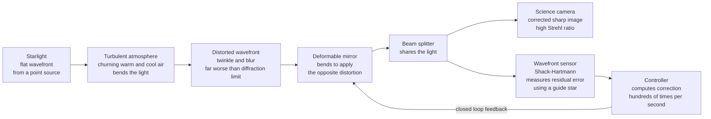

# 🔭 Adaptive Optics and Telescopes

> [!abstract] TL;DR
> A telescope's ultimate sharpness is set by **diffraction** — angular resolution $\theta \approx 1.22\,\lambda/D$, so a bigger aperture $D$ resolves finer detail. But Earth's **turbulent atmosphere** scrambles the incoming wavefront, blurring ground-based images to the arcsecond-scale "**seeing**" limit (set by the Fried parameter $r_0$) — far worse than diffraction, no matter how large the mirror. That blur is why stars **twinkle**. **Adaptive optics (AO)** is the real-time fix: a **wavefront sensor** measures the distortion hundreds-to-thousands of times a second (using a bright natural guide star, or an artificial **laser guide star** fired into the sodium layer), a controller computes the correction, and a **deformable mirror** bends to apply the *opposite* distortion — flattening the wavefront and restoring near-diffraction-limited images. The **Strehl ratio** grades the correction. The same wavefront-sense-and-correct idea now images single cells in the living retina, delivers laser beams through turbulent air, and sharpens microscopes.

## Intuition

**Analogy:** Stars twinkle — not because they flicker, but because Earth's atmosphere is a churning pool of warm and cool air that constantly bends and scrambles their light on the way down. Point a big telescope at a star and, instead of a razor-sharp dot, you get a boiling, smeared blob. For centuries this atmospheric blur capped every ground telescope, no matter how large the mirror: building a bigger aperture bought you more light but not the sharpness it promised, because the air in front of it was doing the smearing.

Adaptive optics is the astonishing fix. Imagine you could measure the exact shape of the distortion in the incoming light hundreds of times a second, then bend a flexible mirror to *exactly cancel* it — un-twinkling the star in real time. Suddenly the ground telescope sees as sharply as if it floated in space. It is like an automatic un-shake for a camera, except it un-shakes the *entire atmosphere*, live. And the same trick, pointed inward, now lets doctors image the individual light-sensing cells inside your own eye.

---

## How It Works

Adaptive optics is a **closed control loop** wrapped around the telescope's light path. Light from a reference star is used to *sense* the aberration; a shape-changing mirror *corrects* it; the sensor then measures the tiny leftover error and the loop repeats — fast enough to keep up with the boiling atmosphere.

1. **The wavefront arrives distorted.** A star is so far away that its light reaches the top of the atmosphere as a perfectly **flat wavefront**. Passing through turbulent air of varying density (hence refractive index), different patches of the wavefront are delayed by different amounts, so it arrives at the mirror **crinkled** — this crinkle is exactly what blurs the image and makes the star twinkle.
2. **A beam splitter shares the light.** After reflecting off the deformable mirror, the beam is split: most goes to the **science camera**, a fraction to the **wavefront sensor**.
3. **The wavefront sensor measures the crinkle.** A **Shack–Hartmann** sensor tiles the pupil with tiny lenslets; each focuses its patch of wavefront to a spot, and the spot's *displacement* reveals the local wavefront *slope*. From the array of slopes the controller reconstructs the whole distorted surface. (A **curvature sensor** measures wavefront curvature instead.)
4. **The controller computes the correction.** It converts the measured wavefront into voltages for each mirror actuator — the shape that will cancel the distortion — typically at **hundreds to thousands of hertz**.
5. **The deformable mirror applies the opposite distortion.** A thin, actuated mirror bends into the *conjugate* shape, flattening the reflected wavefront so the science camera sees a sharp, near-diffraction-limited image.
6. **The loop closes.** The sensor now sees only the small *residual* error and drives the mirror to shrink it further, continuously tracking the atmosphere. This is a textbook feedback system (see [[Feedback_Control_Fundamentals]]).

When no natural star is bright enough near the target, a **laser guide star** is created: a laser tuned to $589$ nm excites sodium atoms in a layer $\sim 90$ km up, making an artificial "star" wherever the telescope points.



---

## Key Concepts

### Secondary Level

- **Why stars twinkle.** The atmosphere is full of moving warm and cool air pockets that bend light slightly differently from moment to moment. Seen through them, a star's light wanders and flickers. Planets twinkle less because they are small disks, not points, so the wobbles average out.
- **Why bigger telescopes are better (in principle).** A larger mirror catches more light (area grows as $D^2$, so faint things become visible) *and* can resolve finer detail. But from the ground, the atmosphere blurs the fine detail away — so raw big-telescope images are no sharper than a much smaller scope's.
- **Why big telescopes use mirrors, not lenses.** A giant lens bends different colours by different amounts (chromatic aberration), sags under its own weight, and can only be supported at its rim. A mirror reflects all colours identically, can be supported across its whole back, and needs only one polished surface. Every large telescope is a **reflector**.
- **The adaptive-optics fix.** Measure the atmospheric distortion in real time and bend a flexible "rubber" mirror to cancel it — un-twinkling the star and restoring a sharp image from the ground.
- **The other option: go above the air.** Space telescopes like **Hubble** and **JWST** sit above the atmosphere entirely, so there is nothing left to blur their view.

### Undergraduate Level

**The diffraction limit sets the goal.** Even a flawless telescope cannot beat diffraction. Two point sources are just resolved (Rayleigh criterion) at

$$\theta_{\min} \approx 1.22\,\frac{\lambda}{D}$$

A $10$ m mirror at $550$ nm has a diffraction limit of $\sim 0.014''$ — but raw ground images blur to $\sim 1''$, roughly $70\times$ worse. (Derivation and the Airy pattern live in [[Interference_and_Diffraction]].)

**The Fried parameter and seeing.** Atmospheric turbulence has a coherence length $r_0$ (the **Fried parameter**): the aperture diameter over which the wavefront stays roughly flat, typically $10$–$20$ cm in visible light at a good site. The blurred image width — the **seeing** — is

$$\theta_{\text{seeing}} \approx \frac{\lambda}{r_0}$$

Crucially, a telescope larger than $r_0$ gains **no resolution** without correction: its resolution is capped at $\lambda/r_0$, not $\lambda/D$. AO exists precisely to recover the $\lambda/D$ limit.

**The Strehl ratio grades correction.** The Strehl ratio $S$ is the peak intensity of the actual (aberrated) point-spread function divided by the diffraction-limited peak, $0 < S \le 1$. For small residual wavefront error of RMS $\sigma$ radians, the **Maréchal approximation** gives

$$S \approx e^{-\sigma^2}$$

$S \ge 0.8$ ($\sigma \lesssim \lambda/14$) is the conventional "diffraction-limited" threshold. Uncorrected seeing has $S \sim 0.01$; good AO reaches $S \sim 0.3$–$0.9$.

**The three hardware pieces.**
- **Wavefront sensor** — Shack–Hartmann (lenslet array measuring local slopes) or curvature sensor. It samples the pupil into subapertures roughly $r_0$ across.
- **Deformable mirror** — a thin faceplate pushed by tens to thousands of actuators (piezo, voice-coil, or MEMS), reshaping to the conjugate of the measured wavefront.
- **Guide star** — a bright **natural** star, or an artificial **laser guide star**: a *Rayleigh* beacon (scattering off air at $10$–$20$ km) or a **sodium** beacon exciting the $\sim 90$ km sodium layer, letting AO work anywhere on the sky.

**Telescope designs.** Reflectors focus light with a curved primary mirror. Common configurations: **Newtonian** (flat diagonal to the side), **Cassegrain** (convex secondary through a hole in the primary), and **Ritchey–Chrétien** (hyperbolic primary and secondary, correcting coma over a wide field — used by Hubble, VLT, and most research telescopes).

### Graduate Level

**Kolmogorov turbulence.** The refractive-index fluctuations follow Kolmogorov statistics; the phase power spectrum scales as $\Phi(\kappa) \propto \kappa^{-11/3}$. The Fried parameter scales as $r_0 \propto \lambda^{6/5}$, so turbulence is far gentler in the infrared — AO reached routine diffraction-limited performance in the near-IR long before the visible.

**How hard is the correction?** The number of actuators (degrees of freedom) needed scales as

$$N_{\text{act}} \sim \left(\frac{D}{r_0}\right)^2$$

An $8$ m telescope with $r_0 = 15$ cm needs $\sim (53)^2 \approx 2800$ actuators for full visible correction — which is why extreme-AO systems push thousands of actuators and kHz loop rates.

**Temporal error and the Greenwood frequency.** The atmosphere evolves on a timescale $\tau_0 \approx 0.31\,r_0/v$ (wind speed $v$); the loop must run well above the **Greenwood frequency** $f_G \approx 0.43\,v/r_0$ (tens to hundreds of hertz) or the correction lags the turbulence. This is a bandwidth-versus-noise trade in the control loop.

**Anisoplanatism.** Correction is only valid within the **isoplanatic angle** $\theta_0 \approx 0.31\,r_0/\bar{h}$ (a few arcseconds), because starlight from off-axis directions traverses *different* turbulence. This limits the corrected field of view and motivates:
- **MCAO** (multi-conjugate AO) — several deformable mirrors conjugated to different altitude layers, using multiple guide stars to *tomographically* reconstruct the 3-D turbulence, widening the corrected field.
- **GLAO** (ground-layer AO), **MOAO** (multi-object AO), and **ExAO** (extreme AO, e.g. VLT-SPHERE, Gemini-GPI) for high-contrast exoplanet imaging.

**Laser-guide-star limitations.** A laser beacon cannot sense overall image motion (**tip-tilt indeterminacy**): the up-going and down-going laser paths cancel the tilt signal, so a faint natural star is still needed for tip-tilt. The finite beacon altitude also causes the **cone effect** (focal anisoplanticism) — the laser samples a cone of atmosphere, not the full cylinder the starlight traverses; multiple beacons mitigate it.

**Giant and segmented mirrors.** Monolithic mirrors beyond $\sim 8.4$ m are impractical, so **Keck** ($10$ m, $36$ hexagonal segments) and the coming **ELTs** (ESO ELT $39$ m, $\sim 798$ segments; TMT; GMT) use **segmented** primaries whose pistons and tilts are actively **co-phased** — themselves a wavefront-control problem. AO is *baked in* to their designs; without it these apertures would deliver seeing-limited blur.

---

## Python Demo

```python
# Adaptive optics: measure the turbulent wavefront distortion and cancel it with a
# deformable mirror, sharpening the blurred point-spread function (PSF) back toward
# the diffraction-limited Airy disk. We quantify the gain with the Strehl ratio.
import numpy as np
import matplotlib.pyplot as plt

rng = np.random.default_rng(7)
N = 256                                    # grid size (pixels)
yy, xx = np.indices((N, N)) - N // 2
r = np.sqrt(xx**2 + yy**2)
R = 48                                      # pupil radius (pixels)
pupil = (r <= R).astype(float)              # circular telescope aperture

def psf(phase):
    """PSF = |FFT(pupil * exp(i*phase))|^2  -- Fourier optics (a lens transforms)."""
    field = pupil * np.exp(1j * phase)
    amp = np.fft.fftshift(np.fft.fft2(np.fft.ifftshift(field)))
    return np.abs(amp) ** 2

# Diffraction-limited reference (flat wavefront) -> the Airy disk, Strehl = 1.
psf_ref = psf(np.zeros((N, N)))
peak_ref = psf_ref.max()

# ---- Atmospheric phase screen: Kolmogorov-like power-law-filtered noise ----
fyy, fxx = np.indices((N, N)) - N // 2
fr = np.sqrt(fxx**2 + fyy**2)
fr[N // 2, N // 2] = 1.0                     # avoid divide-by-zero at DC
spectrum = fr ** (-11.0 / 6.0)               # Kolmogorov phase amplitude ~ k^(-11/6)
spectrum[N // 2, N // 2] = 0.0               # remove piston (DC term)
noise = rng.standard_normal((N, N)) + 1j * rng.standard_normal((N, N))
screen = np.real(np.fft.ifft2(np.fft.ifftshift(noise * spectrum)))
rms0 = np.sqrt(np.mean(screen[pupil > 0] ** 2))
sigma_rad = 1.5                              # target RMS wavefront error (radians)
screen *= sigma_rad / rms0
screen -= np.mean(screen[pupil > 0])         # zero-mean piston over the pupil

# Distorted PSF and its Strehl ratio (peak intensity vs the diffraction limit)
psf_ab = psf(screen)
strehl_ab = psf_ab.max() / peak_ref

# ---- Deformable-mirror correction: subtract the measured phase ----
# An imperfect sensor/mirror leaves a residual = (1 - f_corr) * screen.
f_corr = 0.92
residual = (1.0 - f_corr) * screen
psf_cor = psf(residual)
strehl_cor = psf_cor.max() / peak_ref

# ------------------------------ plots ------------------------------
fig, ax = plt.subplots(2, 2, figsize=(12, 9))

wf = np.where(pupil > 0, screen, np.nan)
im0 = ax[0, 0].imshow(wf, cmap="RdBu_r")
ax[0, 0].set_title(f"(a) Distorted wavefront  (RMS = {sigma_rad:.1f} rad)")
ax[0, 0].set_xticks([]); ax[0, 0].set_yticks([])
fig.colorbar(im0, ax=ax[0, 0], label="phase (rad)")

res = np.where(pupil > 0, residual, np.nan)
im1 = ax[0, 1].imshow(res, cmap="RdBu_r", vmin=np.nanmin(wf), vmax=np.nanmax(wf))
ax[0, 1].set_title(f"(b) After deformable mirror  ({f_corr*100:.0f}% corrected)")
ax[0, 1].set_xticks([]); ax[0, 1].set_yticks([])
fig.colorbar(im1, ax=ax[0, 1], label="residual phase (rad)")

# central cut through the three PSFs (log scale)
c = N // 2
sl = slice(c - 30, c + 30)
xs = np.arange(-30, 30)
ax[1, 0].semilogy(xs, psf_ref[c, sl] / peak_ref, "k-", lw=2, label="diffraction limit (Airy)")
ax[1, 0].semilogy(xs, psf_ab[c, sl] / peak_ref, "C3-", lw=1.5,
                  label=f"distorted  (Strehl = {strehl_ab:.2f})")
ax[1, 0].semilogy(xs, psf_cor[c, sl] / peak_ref, "C0--", lw=1.8,
                  label=f"AO corrected  (Strehl = {strehl_cor:.2f})")
ax[1, 0].set_title("(c) PSF cut: AO restores the sharp core")
ax[1, 0].set_xlabel("focal-plane position (pixels)")
ax[1, 0].set_ylabel("intensity / diffraction-limited peak")
ax[1, 0].set_ylim(1e-4, 2); ax[1, 0].legend(fontsize=8)

# Strehl vs correction quality: numerical PSF + Marechal approximation
fracs = np.linspace(0, 1, 26)
strehl_num, strehl_mar = [], []
for fc in fracs:
    res_fc = (1.0 - fc) * screen
    strehl_num.append(psf(res_fc).max() / peak_ref)
    sig = np.sqrt(np.mean(res_fc[pupil > 0] ** 2))
    strehl_mar.append(np.exp(-sig ** 2))     # Marechal: S = exp(-sigma^2)
ax[1, 1].plot(fracs * 100, strehl_num, "C0o-", ms=3, label="numerical PSF")
ax[1, 1].plot(fracs * 100, strehl_mar, "C1--", label="Marechal  exp(-sigma^2)")
ax[1, 1].axhline(0.8, color="gray", ls=":", lw=0.8)
ax[1, 1].text(2, 0.82, "Strehl 0.8 = 'diffraction limited'", fontsize=7)
ax[1, 1].set_title("(d) Strehl ratio vs correction quality")
ax[1, 1].set_xlabel("wavefront corrected (percent)")
ax[1, 1].set_ylabel("Strehl ratio")
ax[1, 1].set_ylim(0, 1.05); ax[1, 1].legend(fontsize=8)

plt.tight_layout(); plt.savefig("adaptive_optics.png", dpi=110)
print("Saved adaptive_optics.png")
print(f"Strehl before AO: {strehl_ab:.3f}   after AO: {strehl_cor:.3f}"
      f"   -> {strehl_cor / strehl_ab:.1f}x brighter core")

# Diffraction-limited resolution theta = 1.22 lambda / D that AO lets ground scopes reach
print("\nDiffraction limit  theta = 1.22 * lambda / D   (lambda = 550 nm):")
for name, D in [("human eye", 3e-3), ("1 m amateur", 1.0),
                ("Keck 10 m", 10.0), ("ELT 39 m", 39.0)]:
    theta = 1.22 * 550e-9 / D * 206265       # arcseconds
    print(f"  {name:12s} D = {D:>5.3g} m  ->  {theta:7.3f} arcsec"
          f"   (raw seeing ~ 1 arcsec without AO)")
```

Panels (a) and (b) show the crinkled wavefront before and after the deformable mirror flattens it; panel (c) is a log cut through the point-spread functions — the distorted PSF is a low, spread-out blob (Strehl $\sim 0.1$) while the corrected one snaps back to a tall, narrow core near the diffraction-limited Airy peak; panel (d) shows the Strehl ratio climbing toward $1$ as correction quality improves, closely tracking the Maréchal $e^{-\sigma^2}$ law until large-error deviations appear. The printout lists the diffraction limits (arcsec) that AO lets ground telescopes actually reach instead of the $\sim 1''$ seeing.

---

## Real-World Applications

- **Ground-based astronomy (the flagship use).** Keck, the VLT, Gemini, and Subaru all run AO to reach near-diffraction-limited resolution; the coming Extremely Large Telescopes (ESO ELT, TMT, GMT) *require* AO — their giant apertures would otherwise deliver only seeing-limited blur. See [[Telescopes_and_Detectors]] for the observational-astronomy framing.
- **Direct exoplanet imaging.** Extreme-AO instruments (VLT-SPHERE, Gemini-GPI) push Strehl above $0.9$ in the near-IR and pair AO with coronagraphs to suppress starlight, revealing planets a million times fainter beside their host stars.
- **Sharp views of the Galactic Center.** Decades of Keck and VLT AO tracking of stars orbiting Sgr A* measured the Milky Way's central black-hole mass — work recognised by the 2020 Nobel Prize in Physics.
- **Retinal imaging (AO ophthalmoscopy).** The eye's own tear film, lens, and cornea aberrate light. An AO ophthalmoscope measures and cancels those aberrations, resolving **individual photoreceptor cells** in the living retina — enabling early diagnosis of macular degeneration and other diseases. This connects optics to the [[Visual_System_and_Visual_Cortex]].
- **Laser beam delivery and free-space optical comms.** Firing a laser *up* through turbulence (satellite links, directed energy, ground-to-space optical communication) uses the same wavefront correction to keep the beam tight and on target.
- **Microscopy.** Deep-tissue and light-sheet microscopes use AO to correct sample-induced aberrations, restoring resolution and brightness in thick, scattering specimens.

---

## Common Pitfalls

- **Thinking a bigger mirror alone gives a sharper image.** From the ground, resolution is capped at $\lambda/r_0$ (seeing), not $\lambda/D$. Without AO (or going to space), a $10$ m telescope resolves no better than a $20$ cm one — it only gathers more light. AO is what unlocks the aperture's true resolution.
- **Confusing "twinkling" with the star changing.** The star is steady; the *atmosphere* modulates its light. Twinkling (scintillation) and image blur are two faces of the same wavefront distortion.
- **Assuming a laser guide star does everything.** A laser beacon cannot sense overall image motion (tip-tilt indeterminacy), so a faint natural star is still needed for tip-tilt. The beacon's finite altitude also causes the cone effect — it samples less atmosphere than the starlight does.
- **Forgetting AO correction is local (anisoplanatism).** Correction is only valid within the isoplanatic angle (a few arcseconds); stars farther off-axis traverse different turbulence and stay blurred. Wide-field sharpness needs MCAO with multiple guide stars and mirrors.
- **Ignoring loop bandwidth.** The atmosphere changes in milliseconds; if the loop runs below the Greenwood frequency, the deformable mirror chases a distortion that has already moved on, and correction collapses. Speed and photon noise trade off directly.
- **Believing mirrors have no aberrations.** Reflectors avoid *chromatic* aberration, but a spherical or misaligned mirror still suffers spherical aberration and coma — the famous Hubble flaw was a mis-figured primary, fixed with corrective optics, not an atmospheric problem.
- **Treating Strehl as resolution.** Strehl measures how much light is in the sharp core versus the halo; a system can be "diffraction-limited" in resolution yet have modest Strehl if energy leaks into the halo.

---

## Related Concepts

- [[Telescopes_and_Detectors]] — the observational-astronomy companion: light-gathering, atmospheric windows, detectors, and radio interferometry; this note supplies the optics-and-AO deep dive behind its "seeing" and adaptive-optics sections.
- [[Interference_and_Diffraction]] — the physics of the diffraction limit $\theta = 1.22\,\lambda/D$ and the Airy pattern that AO strives to recover; the target that every correction aims at.
- [[Feedback_Control_Fundamentals]] — the AO loop is a real-time feedback controller: sensor, controller, actuator (deformable mirror), and a bandwidth constraint set by how fast the atmosphere evolves.
- [[Visual_System_and_Visual_Cortex]] — AO ophthalmoscopy applies the same wavefront correction to image single photoreceptor cells in the living retina.

Sibling notes in this **Imaging and Optical Systems** section — *Optical_Imaging_and_Microscopy*, *Lenses_Mirrors_and_Imaging*, *Diffraction_and_Fourier_Optics*, *Holography_and_Wavefront_Engineering*, and *Interferometry_and_Optical_Metrology* — all lean on the same wavefront-and-point-spread-function machinery: adaptive optics is essentially real-time, closed-loop wavefront engineering applied to un-blur the atmosphere, and it caps this imaging-and-instrumentation section.

---

## Review Questions

1. **Secondary:** Stars twinkle but planets usually do not. Using the idea of a churning atmosphere bending light, explain the difference — and describe in plain terms what a deformable mirror does to "un-twinkle" a star.
2. **Undergraduate:** A $10$ m telescope observes at $\lambda = 550$ nm from a site with seeing of $1''$ ($r_0 \approx 12$ cm). Compute the diffraction-limited resolution and compare it to the seeing. By roughly what factor could adaptive optics sharpen the image, and why does the same telescope gain much less resolution without AO than its aperture would suggest?
3. **Undergraduate/Graduate:** A wavefront-correction system leaves an RMS residual error of $\sigma = \lambda/14$. Estimate the Strehl ratio with the Maréchal approximation and state whether this counts as "diffraction-limited." What happens to the Strehl if the residual doubles?
4. **Graduate:** Explain why a single sodium laser guide star cannot fully correct a large telescope's wavefront. Address (a) tip-tilt indeterminacy, (b) the cone effect / focal anisoplanatism, and (c) the isoplanatic angle — and describe how multi-conjugate AO with multiple guide stars addresses the field-of-view limit.

---

## Sources

- Hardy, J. W. — *Adaptive Optics for Astronomical Telescopes* (1998), Oxford University Press
- Roddier, F. (ed.) — *Adaptive Optics in Astronomy* (1999), Cambridge University Press
- Tyson, R. K. — *Principles of Adaptive Optics*, 4th ed. (2015), CRC Press
- Hecht, E. — *Optics*, 5th ed. (2016), Ch. 10–11 (diffraction, coherence, imaging)

---

#optics #adaptive-optics #telescopes #deformable-mirror #wavefront-sensing
