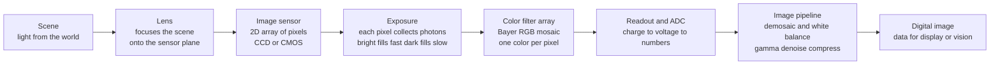

# 📷 Cameras, Sensors, and Digital Imaging

> [!abstract] TL;DR
> A digital camera turns catching light into data. A lens focuses the scene onto an **image sensor** — a 2D grid of millions of tiny light-buckets (**pixels**), each a photodetector that piles up **charge** in proportion to the photons it catches during the **exposure**. The two sensor technologies are **CCD** (charge marched off-chip serially, historically pristine) and **CMOS** (per-pixel readout, now dominant — cheap, fast, low-power, in every phone). A pixel only *counts* photons; it is colorblind, so a **Bayer** mosaic of red/green/blue filters gives each pixel one color and software **demosaics** the rest. The whole craft — **resolution**, **noise** (shot noise $\propto\sqrt N$), **dynamic range**, and the aperture–shutter–ISO **exposure triangle** — is about how well those buckets collect light and how the **imaging pipeline** (ADC → demosaic → white balance → gamma → denoise → JPEG) turns photon counts into a photograph. It is the applied, ubiquitous face of optical imaging: the eyes of phones, telescopes, microscopes, machine vision, and self-driving cars.

---

## Intuition

**Analogy:** A digital camera is a **bucket brigade for light**. A lens focuses the scene onto a grid of millions of tiny light-buckets — the pixels. During the exposure each bucket collects photons: bright spots fill up fast, dark spots slowly. Then the camera reads out how full each bucket is and turns those numbers into an image.

But a bucket only *counts* photons — it is colorblind. To see color, engineers cover the pixels with a checkerboard of red, green, and blue filters (the **Bayer pattern**) so each pixel measures just one color, and the camera cleverly interpolates the rest. The entire art of photography — exposure, dynamic range, noise in the shadows, sharpness — comes down to how well those buckets collect and count light, and how the electronics and software turn photon counts into a photograph. From the phone in your pocket to the Hubble telescope to a self-driving car's vision, digital imaging is how we turned *catching light* into *data*.

---

## How It Works

### Core mechanics

1. **The lens forms the optical image.** A multi-element lens (the physics of *Lenses_Mirrors_and_Imaging*) projects a real, inverted image of the scene onto the flat sensor plane. Everything downstream is only as good as this optical image — resolution is capped by the lens and by **diffraction**, not just by pixel count.
2. **The sensor is a 2D array of pixels.** Each pixel is a **photodetector** (usually a silicon photodiode) that converts incident photons into electrons via the photoelectric effect. Bigger pixels catch more light per exposure (less noise) but at fixed sensor size mean fewer of them (lower resolution) — the first fundamental trade.
3. **Exposure = collecting charge.** During the shutter's open interval each pixel accumulates electrons roughly linearly with light $\times$ time, up to its **full-well capacity**. Exceeding full well **saturates** the pixel and **clips** the highlight to pure white.
4. **Color via the Bayer filter.** A **color filter array** — the Bayer mosaic, with **two green** filters per red and blue (mimicking the eye's peak sensitivity to green) — sits over the pixels so each records one color channel only.
5. **Readout and digitization.** The accumulated charge is converted to a voltage and then to a number by an **analog-to-digital converter (ADC)**. CCDs shift charge serially to one shared amplifier; CMOS sensors amplify and digitize per column/pixel — the reason CMOS is fast and low-power.
6. **Demosaic and process.** The single-color-per-pixel mosaic is interpolated (**demosaicing**) into a full RGB image, then run through **white balance**, **gamma**, **noise reduction**, sharpening, and **compression** (JPEG) — or saved as **RAW** for later processing.
7. **Computational photography.** Modern cameras fuse *many* frames: multi-exposure **HDR** and **night mode**, computational **bokeh**, and **super-resolution** — where software, not just optics, makes the picture.



---

## Key Concepts

### Secondary — the working picture
- **Pixels are light-buckets.** More megapixels = finer detail, but only if the lens can actually resolve it. A blurry lens on a 100 MP sensor still gives a blurry photo.
- **Exposure has three knobs — the exposure triangle.** **Aperture** (how wide the lens opening is: more light *and* shallower depth of field), **shutter speed** (how long the buckets collect: more light *and* more motion blur), and **ISO** (electronic gain: brighter *and* noisier). Change one, compensate with another.
- **Why shadows look noisy and highlights blow out.** Dark buckets catch few photons, so random photon arrivals show up as grain; over-bright buckets overflow (saturate) and clip to featureless white.
- **Sensors are colorblind.** Color comes from the red/green/blue Bayer filter grid plus interpolation, not from the silicon itself.
- **RAW vs JPEG.** RAW keeps the sensor's original numbers (more editing room); JPEG is the camera's finished, compressed interpretation.

### Undergraduate — the quantitative sensor
- **Photon-to-electron chain.** Signal in electrons $S = \eta\,\Phi\,t$ where $\eta$ is **quantum efficiency**, $\Phi$ the photon flux, $t$ the integration time — linear until **full-well** $Q_{\max}$.
- **Noise sources.** **Shot noise** from Poisson photon statistics, $\sigma_{\text{shot}}=\sqrt{S}$ (irreducible, set by light itself); **read noise** $\sigma_{\text{read}}$ (electronics, floor in the dark); **dark current** / thermal noise (grows with temperature and time). Added in quadrature: $\sigma = \sqrt{S + \sigma_{\text{read}}^2 + \sigma_{\text{dark}}^2}$.
- **Signal-to-noise ratio.** $\text{SNR} = \dfrac{S}{\sqrt{S+\sigma_{\text{read}}^2}}$. In bright light SNR $\to \sqrt S$ (shot-limited); in the dark SNR $\to S/\sigma_{\text{read}}$ (read-limited). This is *why* doubling exposure only improves SNR by $\sqrt 2$ in the highlights.
- **Dynamic range.** $\text{DR} = 20\log_{10}\!\big(Q_{\max}/\sigma_{\text{read}}\big)$ dB — the ratio of the brightest recordable signal to the noise floor. **HDR** imaging brackets exposures and merges them to exceed a single frame's DR.
- **Sampling and aliasing.** The pixel grid **samples** the continuous optical image; spatial frequencies above the pixel **Nyquist** limit fold back as **moiré** and false color. The Bayer mosaic subsamples color *worse* than luminance, so fine repetitive textures produce colored fringes (see *Sampling_Theorem*).
- **CCD vs CMOS.** CCD: near-perfect charge transfer, uniform, low-noise, but power-hungry and slow. CMOS: active pixel with per-pixel/column amplifiers → fast, cheap, low-power, integrable with logic — now dominant in phones, DSLRs, and scientific back-illuminated (BSI) sensors.

### Graduate — the design and frontier layer
- **Photon transfer curve (PTC).** Plotting noise variance vs mean signal recovers **gain** (electrons per ADU), read noise, and full well from measurements — the standard sensor-characterization tool (Janesick).
- **Fixed-pattern noise and PRNU.** Pixel-to-pixel offset (dark) and gain (photo-response) non-uniformities; corrected by **flat-fielding** and dark subtraction, critical in scientific and astronomical imaging.
- **Shutter architecture.** **Global shutter** exposes all pixels simultaneously (no distortion, needs per-pixel storage); **rolling shutter** reads rows sequentially (cheaper, but skews fast motion and flickers under pulsed LEDs).
- **Demosaicing quality.** Beyond bilinear: edge-directed and frequency-domain algorithms reduce zippering and false color; joint demosaic-plus-denoise deep nets now run on-device.
- **Beyond Bayer.** **Foveon** stacks three photodiodes per location exploiting wavelength-dependent silicon absorption depth; **3-CCD** splits color with a prism onto three sensors; **quad-Bayer** / dual-conversion-gain pixels trade resolution for HDR and low light.
- **Computational photography as a system.** Burst alignment + merge (Google HDR+), learned ISPs, and **super-resolution** exploit sub-pixel handshake between frames — the smartphone camera "revolution" is mostly algorithms wrapped around a small sensor.
- **Specialized sensors.** **IR/thermal** (InGaAs, microbolometers), **event cameras** (per-pixel asynchronous brightness-change spikes, microsecond latency, huge DR), **SPAD** single-photon arrays for LiDAR and low light. All rest on semiconductor detector physics (see *Semiconductors_Intrinsic_and_Extrinsic*).

---

## Python Demo

```python
# Digital-imaging fundamentals, two experiments:
#  (a) SAMPLING + BAYER + DEMOSAIC: subsample a color scene into an RGGB
#      color-filter mosaic (one color per pixel), then interpolate ("demosaic")
#      back to full RGB -- and watch fine detail alias into moire / false color.
#  (b) EXPOSURE / NOISE / DYNAMIC RANGE: a pixel's response vs light, the
#      shot-noise floor (sqrt(N)) + read noise, full-well saturation (clipped
#      highlights), and the resulting SNR and dynamic range.
import numpy as np
import matplotlib.pyplot as plt

rng = np.random.default_rng(0)

# ------------------------------------------------------------------
# A tiny 'same'-size 2D convolution (no scipy) for bilinear demosaic
# ------------------------------------------------------------------
def convolve2d(img, k):
    kh, kw = k.shape
    ph, pw = kh // 2, kw // 2
    p = np.pad(img, ((ph, ph), (pw, pw)), mode="reflect")
    out = np.zeros_like(img, dtype=float)
    for i in range(kh):
        for j in range(kw):
            out += k[i, j] * p[i:i + img.shape[0], j:j + img.shape[1]]
    return out

# ------------------------------------------------------------------
# (a) Build a colorful "zone plate": rings whose spatial frequency
#     rises toward the edges -> guaranteed aliasing when undersampled.
# ------------------------------------------------------------------
H = W = 256
yy, xx = np.mgrid[0:H, 0:W]
r2 = (xx - W / 2) ** 2 + (yy - H / 2) ** 2
zone = 0.5 + 0.5 * np.cos(r2 / 200.0)          # concentric rings, freq up with radius
scene = np.zeros((H, W, 3))
scene[..., 0] = zone * (0.4 + 0.6 * xx / W)     # R with horizontal gradient
scene[..., 1] = zone * (0.4 + 0.6 * yy / H)     # G with vertical gradient
scene[..., 2] = zone * 0.7                       # B flat
scene = np.clip(scene, 0, 1)

# Bayer RGGB sampling: keep ONE color per pixel
R = np.zeros((H, W)); G = np.zeros((H, W)); B = np.zeros((H, W))
R[0::2, 0::2] = scene[0::2, 0::2, 0]                       # red pixels
G[0::2, 1::2] = scene[0::2, 1::2, 1]                       # green (row-even)
G[1::2, 0::2] = scene[1::2, 0::2, 1]                       # green (row-odd)
B[1::2, 1::2] = scene[1::2, 1::2, 2]                       # blue pixels

# Visualize the raw mosaic in color (each pixel shows only its filter)
mosaic = np.stack([R, G, B], axis=-1)

# Bilinear demosaic: green sits on a quincunx, red/blue on a quarter grid
kG  = np.array([[0, 1, 0], [1, 4, 1], [0, 1, 0]]) / 4.0
kRB = np.array([[1, 2, 1], [2, 4, 2], [1, 2, 1]]) / 4.0
demo = np.clip(np.stack([convolve2d(R, kRB),
                         convolve2d(G, kG),
                         convolve2d(B, kRB)], axis=-1), 0, 1)

# ------------------------------------------------------------------
# (b) Exposure -> collected electrons -> noise -> SNR -> dynamic range
# ------------------------------------------------------------------
QE         = 0.7            # quantum efficiency (electrons per photon)
full_well  = 10000.0       # saturation, electrons
read_noise = 3.0           # read noise, electrons RMS
photons    = np.logspace(0, 5.2, 500)         # incident photons per pixel
signal     = np.minimum(QE * photons, full_well)   # collected e-, clipped at full well
shot       = np.sqrt(signal)                        # Poisson shot noise
total      = np.sqrt(signal + read_noise ** 2)      # shot + read in quadrature
snr        = signal / total
DR_dB      = 20 * np.log10(full_well / read_noise)

# ------------------------------------------------------------------
# Plot everything: top row = imaging/color, bottom row = photometry
# ------------------------------------------------------------------
fig, ax = plt.subplots(2, 3, figsize=(15, 9))

ax[0, 0].imshow(scene);  ax[0, 0].set_title("Original scene (full RGB)")
ax[0, 1].imshow(mosaic); ax[0, 1].set_title("Bayer mosaic (one color / pixel)")
ax[0, 2].imshow(demo);   ax[0, 2].set_title("Demosaiced -> note moire / false color")
for a in ax[0]:
    a.set_xticks([]); a.set_yticks([])

# signal vs exposure (saturation plateau)
ax[1, 0].loglog(photons, signal, lw=2)
ax[1, 0].axhline(full_well, color="crimson", ls="--", label="full well (clip)")
ax[1, 0].set_xlabel("incident photons"); ax[1, 0].set_ylabel("collected electrons")
ax[1, 0].set_title("Pixel response: linear then saturates")
ax[1, 0].legend(); ax[1, 0].grid(alpha=0.3, which="both")

# noise components
ax[1, 1].loglog(signal, shot, lw=2, label="shot noise = sqrt(S)")
ax[1, 1].axhline(read_noise, color="teal", ls="--", label=f"read noise = {read_noise:.0f} e-")
ax[1, 1].loglog(signal, total, lw=2, color="k", label="total noise")
ax[1, 1].set_xlabel("signal (electrons)"); ax[1, 1].set_ylabel("noise (electrons)")
ax[1, 1].set_title("Noise: read-limited (dark) -> shot-limited (bright)")
ax[1, 1].legend(); ax[1, 1].grid(alpha=0.3, which="both")

# SNR and dynamic range
ax[1, 2].loglog(signal, snr, lw=2, color="darkorange")
ax[1, 2].axvline(read_noise ** 2, color="teal", ls=":", label="read = shot crossover")
ax[1, 2].axvline(full_well, color="crimson", ls="--", label="saturation")
ax[1, 2].set_xlabel("signal (electrons)"); ax[1, 2].set_ylabel("SNR")
ax[1, 2].set_title(f"SNR vs signal   |   dynamic range = {DR_dB:.0f} dB")
ax[1, 2].legend(); ax[1, 2].grid(alpha=0.3, which="both")

plt.tight_layout()
plt.savefig("digital_imaging.png", dpi=110)
plt.show()

# ---- console sanity checks ----
print(f"Full well {full_well:.0f} e-, read noise {read_noise:.0f} e-")
print(f"Dynamic range = 20*log10(full_well/read_noise) = {DR_dB:.1f} dB")
print(f"Peak SNR near saturation = {snr.max():.0f}  (~ sqrt(full_well) = {np.sqrt(full_well):.0f})")
```

The top row shows the core color trick: subsampling the scene into a one-color-per-pixel Bayer mosaic and interpolating it back — and the high-frequency rings toward the edges bloom into **moiré and false color**, exactly the aliasing that undersampling produces. The bottom row is the photometric story: signal rises linearly with light until the pixel **saturates** (clipped highlights); noise is **read-limited** in the shadows (flat floor) and **shot-limited** in the light ($\sqrt S$); and **SNR** climbs as $\sqrt S$ until it hits the full-well wall, with the shadow-to-highlight span giving the **dynamic range** in decibels.

---

## Real-World Applications

- **Smartphone cameras** — a tiny back-illuminated CMOS sensor behind a fast lens, rescued by **computational photography**: burst capture, HDR+ merging, learned demosaic/denoise, and computational bokeh put a capable camera in billions of pockets and rewired photography, video, and social media.
- **Scientific and astronomical imaging** — cooled CCD/CMOS arrays (e.g., Hubble's cameras, ground survey telescopes) with deep full wells, flat-fielding, and dark subtraction to chase single photons from faint galaxies; the sensor is literally the telescope's retina.
- **Medical and microscopy imaging** — high-QE, low-noise sCMOS sensors for fluorescence microscopy and digital pathology, where dynamic range and read noise decide what faint structures are visible.
- **Machine vision and industrial inspection** — **global-shutter** CMOS for undistorted images of fast conveyor lines and robotics; frame rate and SNR set inspection speed and reliability.
- **Self-driving cars and robotics** — HDR automotive sensors that survive tunnel-to-sunlight transitions, plus **event cameras** and **SPAD/LiDAR** arrays feeding perception stacks; the raw pixels are the front end of every computer-vision model (see *Image_Representations*).

---

## Common Pitfalls

- **Believing megapixels equal sharpness.** Resolution is bounded by the **lens and diffraction**; past that, extra pixels only sample blur ("empty resolution") while shrinking each pixel and raising noise.
- **Blaming the sensor for "grain" that is really shot noise.** In dim light, noise is dominated by **photon statistics** ($\sqrt N$), not the electronics. The cure is more light (aperture, time, or a bigger pixel), not a "less noisy" ISO.
- **Confusing ISO with true sensitivity.** ISO is post-capture **gain**; cranking it amplifies signal *and* noise. It brightens the preview but cannot add photons that were never caught.
- **Clipping highlights and crushing shadows.** Overexposing past **full well** loses highlight detail irreversibly; underexposing buries the signal in the read-noise floor. "Expose to the right" only up to the saturation edge.
- **Demosaic artifacts on fine textures.** Repetitive patterns (fabrics, roof tiles, resolution charts) beat against the Bayer grid to produce **moiré and false color**; naive bilinear demosaic makes it worse than edge-aware methods.
- **Rolling-shutter surprises.** Fast pans skew, propellers bend, and pulsed LED signs band — because CMOS rows are read sequentially, not all at once. Use a global-shutter sensor when motion or timing matters.
- **Trusting the JPEG as ground truth.** White balance, gamma, sharpening, and compression are irreversible interpretations baked in-camera; for measurement or serious editing, keep the **RAW** electrons.

---

## Related Concepts

- [[Lenses_Mirrors_and_Imaging]] — the optics that form the real image on the sensor plane; its f-number, aperture, and diffraction limit cap what any pixel grid can resolve.
- [[Image_Representations]] — the computer-vision downstream: how the sensor's pixels become tensors, color spaces, and normalized model inputs.
- [[Data_Converters_ADC_and_DAC]] — the analog-to-digital conversion step that turns each pixel's accumulated charge into the numbers of a digital image.
- [[Sampling_Theorem]] — the Nyquist/aliasing theory behind pixel-grid sampling, moiré, and why the Bayer mosaic must not undersample scene detail.
- [[Semiconductors_Intrinsic_and_Extrinsic]] — the silicon photodetector physics (photoelectric conversion, quantum efficiency) underlying every CCD, CMOS, and specialized image sensor.

Sibling notes in this imaging section (build these next): *Optical_Imaging_and_Microscopy* (resolution, NA, and modern microscope design), *Photodetectors_and_Optical_Receivers* (the single-detector physics generalized from one pixel), *Lenses_Mirrors_and_Imaging* (the image-forming optics ahead of the sensor), *Spectroscopy_and_Optical_Analysis* (dispersing light for chemical/color analysis), and *Optical_Sensing_LIDAR_and_Optical_Coherence_Tomography* (active and interferometric imaging that reuse the same detector arrays).

---

## Review Questions

1. **(Secondary)** A phone photo of a distant, dimly lit street looks grainy in the shadows but the streetlights are washed-out white blobs with no detail. Explain, using the bucket-brigade picture, why the *dark* areas are noisy and the *bright* areas lost detail — and name one exposure-triangle knob that helps each problem.
2. **(Undergraduate)** A sensor has full-well capacity 20000 e- and read noise 4 e-. Compute its dynamic range in dB, and find the signal level at which shot noise equals read noise. Below that level, does SNR grow like $S$ or like $\sqrt S$, and why does that make the shadows the noisiest part of the image?
3. **(Graduate)** You photograph a striped fabric and get colored moiré fringes. Trace the cause through (a) the pixel grid's Nyquist limit, (b) the Bayer color subsampling, and (c) the demosaic interpolation. Propose two independent mitigations — one optical/hardware and one algorithmic — and state the cost each imposes on resolution or compute.

---

## Sources

- Nakamura, J. (ed.) *Image Sensors and Signal Processing for Digital Still Cameras.* CRC Press — CCD/CMOS pixel architectures, color filter arrays, and the camera pipeline.
- Saleh, B. E. A. & Teich, M. C. *Fundamentals of Photonics*, 3rd ed. — photodetection, quantum efficiency, and detector noise.
- Szeliski, R. *Computer Vision: Algorithms and Applications*, 2nd ed. — image formation, Bayer demosaicing, and the computational imaging pipeline.
- Janesick, J. R. *Scientific Charge-Coupled Devices.* SPIE Press — the photon transfer curve, full well, read noise, and dynamic range in depth.

---

#optics #image-sensor #digital-imaging #bayer #dynamic-range
