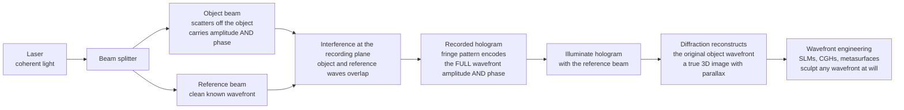

# 🔮 Holography and Wavefront Engineering

> [!abstract] TL;DR
> An ordinary photograph is flat because it records only the **brightness** of light at each point and throws away the **phase** — the information about which direction each ray was travelling and how far it came. **Holography** records *both* by letting light scattered from an object (the **object beam**) interfere with a clean coherent **reference beam**; the fringe pattern that develops secretly encodes the full complex **wavefront** — amplitude *and* phase. Shine the reference beam back through the developed fringes and the original object wavefront is **reborn**, floating in space with true depth and parallax — you can look *around* objects. This is the flagship example of **wavefront engineering**: the art of controlling the shape of a light wave itself. With **spatial light modulators (SLMs)**, **computer-generated holograms (CGH)**, **diffractive/holographic optics**, and **metasurfaces**, we can flatten a distorted beam, turn a Gaussian into any pattern, replace curved lenses with flat films, and build the displays behind augmented reality — mastering a light wave's phase is one of photonics' most practical frontiers.

## Intuition

**Analogy:** Imagine trying to record the surface of a pond so you can perfectly recreate its ripples later. A photograph is like measuring only *how tall* the water is at each point — you lose the crucial fact of which way each ripple was *moving*. The waves it would recreate are dead and frozen; the scene looks flat. Now imagine instead you drop in a second, perfectly regular set of ripples from a known source and photograph the **interference** of the two — the intricate cross-hatched pattern where crests reinforce and troughs cancel. That swirl looks like meaningless noise, but it secretly encodes not just the height of every original ripple but its **direction and timing** too — its *phase*. Send the known regular ripples back through that recorded pattern and the original ripples spring back to life, moving exactly as before.

That is a **hologram**. Ordinary photography keeps only the amplitude (brightness) of the light field and discards the phase, so it collapses a three-dimensional scene onto a flat plane. A hologram interferes the light from an object with a coherent reference wave and records the resulting **fringe pattern**, which captures amplitude *and* phase — the whole wavefront. Re-illuminate it and the object's wavefront is regenerated, so your two eyes and a tilt of your head see genuine depth and parallax, exactly as if the object were still there. More broadly, this is one instance of **wavefront engineering**: once you can record and recreate the shape of a light wave, you can also *design* it from scratch — sculpting a laser beam into any pattern, building paper-thin flat optics, correcting a wavefront distorted by the atmosphere, or driving the holographic combiners of tomorrow's AR glasses.

---

## How It Works

### Core Mechanics

Holography is interference plus diffraction, and it demands a **coherent** source — a laser — so that the object and reference waves keep a stable phase relationship long enough to record.

1. **Split a coherent beam.** A laser is divided into two: an **object beam** that illuminates the scene and scatters toward the recording medium carrying its amplitude and phase, and a **reference beam** — a clean, known wavefront (usually a plane or spherical wave) sent straight to the medium.
2. **Record the interference.** At the recording plane the two complex fields add and the medium (photographic emulsion, photopolymer, or a digital sensor) registers only **intensity**:
   $$I = |O + R|^2 = |O|^2 + |R|^2 + \underbrace{O R^{*}}_{\text{carries } O} + \underbrace{O^{*} R}_{\text{carries } O^{*}}.$$
   The two **cross terms** are the magic: because they multiply the object field by the *known* reference, they preserve the object's full amplitude **and phase** as a real, positive fringe pattern.
3. **Reconstruct by re-illumination.** Shine the reference $R$ back through the developed hologram. The transmitted field is $I \cdot R$, whose term $|R|^2 O \propto O$ **regenerates the original object wavefront** — light diffracts off the fringes to recreate exactly the wave that once came from the object, producing a virtual 3D image with depth and parallax. The other cross term $O^{*}R^2$ creates a conjugate **twin image**.
4. **Off-axis (Leith–Upatnieks) recording.** Tilting the reference beam puts the object information on a spatial-frequency **carrier**, so on reconstruction the real image, the twin image, and the undiffracted zero order fly off in *different directions* and no longer overlap — the trick that made holography practical after Gabor's original in-line scheme.
5. **Thick (volume) holograms.** In a thick emulsion the fringes form 3D Bragg planes with sharp angular and wavelength selectivity, so a **reflection hologram** reconstructs in ordinary white light (each depth picks its own colour) — the basis of security and display holograms.
6. **Going digital.** A sensor can record the hologram and a computer can reconstruct it by numerically propagating the field (**digital holography**), or the hologram can be *computed from scratch* for a desired wavefront (**computer-generated holography, CGH**) and written onto an **SLM** — a pixelated liquid-crystal panel that imprints a programmable phase on a beam. This is where holography becomes **wavefront engineering**: beam shaping, flat diffractive optics, holographic optical tweezers, and adaptive-optics correction.

### Flow / Architecture



---

## Key Concepts

### Secondary Level

- **Why a photo is flat.** Light is a wave. At every point it has a *brightness* (how big the wave is) and a *phase* (where it is in its cycle, which encodes direction and distance travelled). A camera film or sensor reacts only to brightness, so it throws phase away — and with it, all the depth cues. Every viewpoint gets baked into one flat image.
- **What a hologram adds.** A hologram records the **interference pattern** between light from the object and a second "reference" laser beam. That fringed pattern quietly stores the phase too. So when you re-light it, the light comes off in exactly the directions it originally did, and your eyes see a real 3D object you can look around.
- **You need a laser.** Interference fringes only stay put if the light is **coherent** — marching in lockstep. Ordinary lamplight is a jumble of phases, so it washes the fringes out. This is why holography waited for the laser (1960).
- **Everyday holograms.** The shimmering patch on a credit card, banknote, or passport is a mass-produced (embossed) hologram — hard to counterfeit precisely because it stores a full 3D wavefront, not a flat picture.

### Undergraduate Level

**Recording and the cross terms.** With object field $O = |O|e^{i\phi_O}$ and reference $R = |R|e^{i\phi_R}$, the recorded intensity is
$$I = |O|^2 + |R|^2 + 2|O||R|\cos(\phi_O - \phi_R).$$
The cosine term is a **fringe pattern whose contrast holds $|O|$ and whose fringe positions hold the phase $\phi_O$** — the phase you would otherwise lose is now written as a spatial displacement of fringes.

**Reconstruction and the twin image.** Re-illuminating with $R$ gives $t \cdot R \propto I R$. Expanding, $|R|^2 O$ reproduces the object wave (the **virtual image**, seen where the object was), while $O^{*}R^{2}$ is the **conjugate/twin image**. In Gabor's **in-line** geometry these overlap and blur each other; **Leith–Upatnieks off-axis** recording adds a reference tilt $e^{i 2\pi f_c x}$ so the object rides a spatial carrier $f_c$ and the three reconstruction orders separate cleanly in angle.

**Transmission vs reflection, thin vs thick.** A **thin** hologram acts like a diffraction grating (many orders, needs the original wavelength). A **thick/volume** hologram satisfies the **Bragg condition** — only one reconstruction order survives, giving high efficiency and letting **reflection holograms** and **rainbow (Benton) holograms** be viewed in white light. Diffraction efficiency of a volume phase grating follows Kogelnik coupled-wave theory ($\eta = \sin^2(\pi \Delta n\, d / \lambda\cos\theta)$).

**Fourier-optics view.** Because the far-field of a field is its **Fourier transform** (a lens computes it in its focal plane), a **Fourier hologram** records $|\mathcal{F}\{o\} + R|^2$ and reconstructs by another transform — the discrete analog you code with an FFT. This is the bridge from holography to computer-generated holography.

**Spatial light modulators and beam shaping.** An **SLM** is a pixel array of liquid crystal (or micromirrors, DMD) that applies a chosen phase (or amplitude) $\phi(x,y)$ to an incident beam. Choosing $\phi(x,y)$ to be a **blazed grating** steers the beam; a **quadratic (lens) phase** focuses it; a computed **kinoform** turns a Gaussian into a flat-top, ring, or arbitrary pattern. A flat **diffractive optical element (DOE)** bakes such a phase into etched glass permanently.

### Graduate Level

**Phase retrieval — Gerchberg–Saxton.** Designing a *phase-only* CGH for a target far-field pattern is an inverse problem: find SLM phase $\phi$ such that $|\mathcal{F}\{e^{i\phi}\}|^2$ equals the target intensity. The **Gerchberg–Saxton (GS)** algorithm is **alternating projections** between two constraint sets — enforce uniform amplitude in the SLM plane, enforce the target amplitude in the Fourier plane, keeping the retrieved phase each time. It is a nonconvex problem, so GS finds a *local* solution (and leaves speckle); modern variants (weighted-GS, Wirtinger flow, gradient descent through a differentiable propagator) reduce noise and enforce smoothness.

**Space–bandwidth product limits holographic displays.** A hologram's number of resolvable pixels $\times$ its diffraction angle is bounded by the **space–bandwidth product**. The maximum diffraction (and hence viewing) angle is $\theta_{\max} \approx \lambda / 2p$ for pixel pitch $p$; with $p \sim 4\,\mu\text{m}$ SLMs and $\lambda = 0.5\,\mu\text{m}$ you get only $\sim\!\pm 3.6^{\circ}$. A wide-field, wide-viewing-angle dynamic holographic display therefore needs **billions of pixels** — the central engineering wall the field is still climbing, which is why AR headsets use **waveguide holographic combiners** and eye-box tricks rather than full free-space holograms.

**Digital holographic microscopy and quantitative phase.** Recording the complex field lets you extract the object phase $\phi(x,y)$, which equals optical path length $\frac{2\pi}{\lambda}\!\int (n-n_0)\,dz$. This yields **quantitative phase imaging**: label-free maps of cell thickness, refractive index, and dry mass, plus numerical refocusing to *any* depth after a single exposure — impossible for an intensity camera.

**Connection to metasurfaces and adaptive optics.** A **metasurface** is a hardware CGH: sub-wavelength nanostructures imprint a designed spatial phase to make flat metalenses and holographic optics (see the sibling metamaterials note). **Adaptive optics** is real-time wavefront engineering in reverse — a wavefront sensor measures the distortion a turbulent atmosphere (or an aberrated eye) adds, and a deformable mirror or SLM imprints the **conjugate** phase $-\phi_{\text{aberration}}$ to flatten it. Recording, recreating, and correcting a wavefront are three faces of the same idea: **control the phase, and you control the light**.

---

## Python Demo

```python
# Holography & wavefront engineering, two self-contained demonstrations (numpy + matplotlib):
#
#  (a) DIGITAL HOLOGRAM  --  record & reconstruct.
#      Interfere an object wave with an off-axis plane reference wave, record the
#      real-valued intensity fringe pattern I = |O + R|^2, then reconstruct by
#      illuminating with the reference and propagating (an FFT).  The reconstruction
#      shows the REAL image, the TWIN (conjugate) image, and the zero order -- exactly
#      as in Leith-Upatnieks off-axis holography.
#
#  (b) COMPUTER-GENERATED HOLOGRAM / SLM  --  shape a beam into a target pattern.
#      Use the Gerchberg-Saxton phase-retrieval algorithm to design a PHASE-ONLY mask
#      (a "kinoform") that an SLM would display so that a uniform incoming beam is
#      diffracted into a target far-field pattern (here a 4x4 optical-tweezers trap array).

import numpy as np
import matplotlib.pyplot as plt

N = 256
c = N // 2

# =====================================================================
# (a) DIGITAL OFF-AXIS HOLOGRAM: record then reconstruct
# =====================================================================
# Object in the input plane: an asymmetric "F" (so the mirrored twin image is obvious).
obj = np.zeros((N, N))
obj[c-25:c+25, c-13:c-7] = 1.0     # vertical stroke
obj[c-25:c-19, c-13:c+13] = 1.0    # top bar
obj[c-3:c+3,  c-13:c+7]  = 1.0     # middle bar

# Field arriving at the hologram (Fourier) plane -- a lens performs this Fourier transform.
O = np.fft.fftshift(np.fft.fft2(np.fft.ifftshift(obj)))
O = O / np.abs(O).max()            # normalize to reference amplitude scale

# Off-axis reference: a tilted plane wave (point source displaced by x0 pixels).
u = np.arange(N) - c
UX, _ = np.meshgrid(u, u)
x0 = 72                            # off-axis separation -> puts object on a carrier
R = np.exp(-1j * 2 * np.pi * (x0 / N) * UX)

# Recorded hologram = a REAL, POSITIVE intensity fringe pattern (all a sensor can capture).
H = np.abs(O + R) ** 2

# Reconstruct: illuminate the hologram and propagate (inverse transform back to image plane).
recon = np.fft.fftshift(np.fft.ifft2(np.fft.ifftshift(H)))
recon_I = np.abs(recon) ** 2
recon_I /= recon_I.max()

# =====================================================================
# (b) COMPUTER-GENERATED HOLOGRAM via Gerchberg-Saxton (phase retrieval)
# =====================================================================
target = np.zeros((N, N))          # desired far-field pattern: a 4x4 trap array
for dy in (-48, -16, 16, 48):
    for dx in (-48, -16, 16, 48):
        target[c + dy, c + dx] = 1.0
target_amp = np.sqrt(target)

rng = np.random.default_rng(0)
slm_amp = np.ones((N, N))                       # uniform illumination on the SLM
phase = rng.uniform(-np.pi, np.pi, (N, N))      # random starting phase
for _ in range(50):                             # alternating-projections loop
    far = np.fft.fftshift(np.fft.fft2(np.fft.ifftshift(slm_amp * np.exp(1j * phase))))
    far = target_amp * np.exp(1j * np.angle(far))          # enforce target amplitude
    back = np.fft.fftshift(np.fft.ifft2(np.fft.ifftshift(far)))
    phase = np.angle(back)                                  # keep phase only (unit amplitude)

cgh_phase = phase                                # the kinoform the SLM would display
shaped = np.abs(np.fft.fftshift(np.fft.fft2(np.fft.ifftshift(np.exp(1j * cgh_phase))))) ** 2
shaped /= shaped.max()

# =====================================================================
# Plot
# =====================================================================
fig, ax = plt.subplots(2, 3, figsize=(15, 9.5))

ax[0, 0].imshow(obj, cmap="gray"); ax[0, 0].set_title("(a) Object wave (an 'F')")
ax[0, 0].axis("off")

crop = H[c-24:c+24, c-24:c+24]                   # zoom to reveal the fine carrier fringes
ax[0, 1].imshow(crop, cmap="gray")
ax[0, 1].set_title("Recorded hologram: intensity fringes\n(encode amplitude AND phase)")
ax[0, 1].axis("off")

ax[0, 2].imshow(recon_I ** 0.4, cmap="inferno")  # gamma for visibility
ax[0, 2].set_title("Reconstruction: real image + twin + zero order")
ax[0, 2].text(c - x0, c, "real", color="cyan", ha="center", fontsize=9)
ax[0, 2].text(c + x0, c, "twin", color="lime", ha="center", fontsize=9)
ax[0, 2].text(c, c, "0", color="white", ha="center", fontsize=9)
ax[0, 2].axis("off")

ax[1, 0].imshow(target, cmap="gray")
ax[1, 0].set_title("(b) Target far field (4x4 trap array)"); ax[1, 0].axis("off")

im = ax[1, 1].imshow(cgh_phase, cmap="twilight", vmin=-np.pi, vmax=np.pi)
ax[1, 1].set_title("CGH phase mask (kinoform on the SLM)"); ax[1, 1].axis("off")
fig.colorbar(im, ax=ax[1, 1], fraction=0.046, label="phase (rad)")

ax[1, 2].imshow(shaped ** 0.4, cmap="inferno")
ax[1, 2].set_title("Shaped beam: SLM far-field output"); ax[1, 2].axis("off")

plt.tight_layout()
plt.savefig("holography_wavefront_engineering.png", dpi=110)
print("Saved holography_wavefront_engineering.png")

# Quick numeric check of the CGH efficiency into the target spots
in_target = shaped[target > 0].sum()
print(f"Fraction of reconstructed energy landing on the target spots: "
      f"{in_target / shaped.sum():.1%}")
```

Panel (a) shows that the recorded hologram is nothing but a fine fringe pattern — yet reconstructing it regenerates the object wave (the bright "F"), alongside its mirror-image **twin** and the undiffracted zero order, all separated because the reference was off-axis. Panel (b) runs Gerchberg–Saxton to *design* a phase-only mask from scratch; feeding a uniform beam through that mask diffracts it into the requested 4×4 spot array — exactly how a spatial light modulator creates a lattice of optical tweezers or shapes a laser for material processing.

---

## Real-World Applications

- **Security and anti-counterfeiting.** The rainbow holograms embossed on credit cards, banknotes, passports, and product packaging store a full 3D wavefront that is extremely hard to photocopy or forge — the single most widespread use of holography.
- **Augmented and virtual reality.** AR headsets (HoloLens, Magic Leap, and waveguide "smart glasses") use **holographic and diffractive waveguide combiners** to route computer imagery into the eye, and research displays use SLM-based CGH to place virtual objects at true optical depth, easing the vergence–accommodation conflict of stereoscopic 3D.
- **Holographic optical tweezers.** An SLM displaying a computed hologram splits one laser into **dozens of independently steerable traps**, letting biologists and physicists grab and arrange cells, colloids, or single atoms in parallel — the exact task the demo's trap array illustrates.
- **Laser material processing and beam shaping.** Diffractive optics and SLMs turn a Gaussian beam into flat-top, multi-spot, ring, or Bessel profiles for high-throughput welding, cutting, drilling, and additive manufacturing, and generate the donut mode used in STED super-resolution microscopy.
- **Quantitative phase microscopy and metrology.** Digital holographic microscopy records phase to image transparent living cells label-free, measure dry mass, and refocus numerically; the same interferometric wavefront recording underlies optical surface metrology.
- **Holographic data storage and flat optics.** Volume holograms store many pages of data in the same crystal via angle/wavelength multiplexing, and metasurface "hardware CGHs" replace bulky lens stacks with wafer-thin holographic optics for cameras, sensors, and displays.

---

## Common Pitfalls

- **Forgetting you need coherence (a laser).** Holography records *interference*, which requires the object and reference beams to stay phase-correlated over the recording. Path-length differences beyond the source **coherence length**, or vibrations larger than a fraction of a wavelength during exposure, wash the fringes out entirely — hence the granite tables and pulsed lasers of holography labs.
- **Ignoring the twin image.** In-line (Gabor) holograms superimpose the real image on its out-of-focus conjugate twin, blurring both. The fix is **off-axis** recording (a reference tilt) or **phase-shifting** digital holography — do not expect a clean image from a naive in-line setup.
- **Confusing "records the whole wave" with "records everything from every angle."** A hologram captures only the wavefront that actually reached its aperture; its viewing zone (parallax) is limited by the hologram's size and the reference geometry. It is not an omniscient light-field of the scene.
- **Under-sampling the fringes (digital holography).** Off-axis carrier fringes can be very fine; if the sensor pixel pitch does not satisfy **Nyquist** for the interference frequency, the hologram aliases and the reconstruction is corrupted. Match tilt angle to pixel pitch.
- **Expecting a clean, speckle-free CGH from one Gerchberg–Saxton run.** GS solves a **nonconvex** phase-retrieval problem and converges to a local minimum with residual speckle. Use weighted-GS, add an averaging or dithering step, or optimize through a differentiable propagator for smooth, high-uniformity patterns.
- **Overpromising holographic displays.** The **space–bandwidth product** caps a real SLM's viewing angle to a few degrees. A poster-sized, wide-angle, full-color dynamic hologram needs orders of magnitude more pixels than today's panels — which is why current products lean on eye-tracking, waveguide combiners, and small eye-boxes rather than free-space holography.

---

## Related Concepts

Glob-verified cross-vault wikilinks:

- [[Interference_and_Diffraction]] — the physics engine of holography: the fringe pattern is two-beam interference, and reconstruction is diffraction off those fringes; without this the whole scheme is impossible.
- [[Wave_Motion_and_Properties]] — amplitude and phase are the two numbers describing any wave; holography's entire premise is that photography keeps the first and discards the second.
- [[Fourier_Transform]] — Fourier holography and computer-generated holograms rest on the far-field being the Fourier transform of the field; the demo computes both recording and reconstruction with FFTs.
- [[NeRF_and_3DGS]] — the computational cousin of holography: capturing and re-rendering a scene's full **light field** for novel-view synthesis, achieving parallax and depth from data rather than from recorded phase.
- [[Projection_and_Viewing]] — classical 3D graphics *projects* a scene onto a flat 2D image (discarding depth much as a photograph does); holographic and light-field displays instead try to reconstruct the full wavefront so the eye's own focus and parallax return.

Within this Optics and Photonics vault, this note is the wavefront-control capstone of the Imaging and Optical Systems section and connects in prose to several siblings: Wave_Optics_and_Interference supplies the two-beam interference and coherence needed to record a hologram; Diffraction_and_Fourier_Optics provides the diffraction-and-Fourier-transform framework that governs reconstruction and computer-generated holograms; Interferometry_and_Optical_Metrology shares the interferometric recording of phase used in digital holographic microscopy; Adaptive_Optics_and_Telescopes is wavefront engineering in reverse, imprinting a conjugate phase to *undo* distortion; and Metamaterials_and_Photonic_Crystals realizes CGHs in hardware as metasurface flat optics and metalenses.

---

## Review Questions

1. **Secondary:** Your phone camera and a hologram both use light bouncing off a scene, yet only the hologram looks three-dimensional when you tilt it. In plain terms, what specific piece of information does the camera throw away that the hologram keeps, and why does keeping it produce depth and parallax? Why can you not make a hologram with an ordinary flashlight?
2. **Undergraduate:** Starting from $I = |O + R|^2$, expand the recorded intensity and identify which terms carry the object's phase. When you re-illuminate the developed hologram with the reference wave $R$, show which term regenerates the original object wave and which produces the twin image. What does an *off-axis* reference tilt do to these on reconstruction, and why did that make holography practical?
3. **Undergraduate/Graduate:** You want an SLM with $4\,\mu\text{m}$ pixels to build a dynamic holographic display at $\lambda = 0.5\,\mu\text{m}$. Estimate the maximum diffraction (viewing) angle, and explain via the space–bandwidth product why a wide-angle, wall-sized holographic display is so hard. What engineering compromises do current AR headsets make instead?
4. **Graduate:** The Gerchberg–Saxton algorithm designs a phase-only CGH by alternating projections between an SLM-plane amplitude constraint and a Fourier-plane amplitude constraint. Explain why this is a nonconvex problem, what artifact (and why) appears in the reconstructed pattern, and describe one modification that improves pattern uniformity. How is this same wavefront-shaping machinery used, with the *conjugate* phase, in adaptive optics?

---

## Sources

- Goodman, J. W. — *Introduction to Fourier Optics*, 4th ed. (2017), Chapter 9 (Holography)
- Hariharan, P. — *Optical Holography: Principles, Techniques and Applications*, 2nd ed. (Cambridge Univ. Press)
- Saleh, B. E. A. & Teich, M. C. — *Fundamentals of Photonics*, 3rd ed. (2019), holography and spatial light modulators
- Hecht, E. — *Optics*, 5th ed. (2016), Chapter 13 (Modern Optics: Holography)
- Leith, E. N. & Upatnieks, J. — "Reconstructed Wavefronts and Communication Theory," *J. Opt. Soc. Am.* **52**, 1123 (1962)

---

#optics #holography #wavefront #spatial-light-modulator #3D-display
