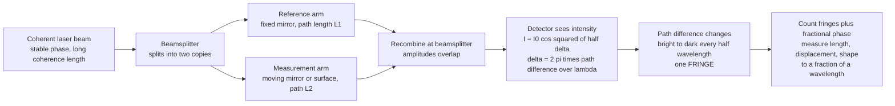

# 📏 Interferometry and Optical Metrology

> [!abstract] TL;DR
> How do you measure a distance a thousand times finer than a bacterium — smaller than a wavelength of light itself? You use light's own wave nature as a ruler with impossibly fine markings. Split a coherent laser beam into two, send them down slightly different **optical paths**, then recombine them: the output brightness depends on their **phase (path-length) difference**, swinging from bright to dark every time one path lengthens by half a wavelength (one **fringe**). By counting fringes you measure length, displacement, and surface shape in units of the wavelength of light — a few hundred nanometers at a time, and far below with sub-fringe phase estimation. This is **interferometry**, the most precise measurement technique humans possess. From testing telescope mirrors to nanometers and defining the **meter**, to fiber-optic **gyroscopes** for navigation, to **LIGO** sensing a mirror move by less than a ten-thousandth the width of a proton when a gravitational wave stretched spacetime — interferometry turns the wave nature of light into unmatched measurement power.

## Intuition

**Analogy:** How do you measure something smaller than a wavelength of light — a distance a thousand times finer than a bacterium? You cannot lay down a ruler; the finest ruler marking humans can machine is still enormously coarse compared to a nanometer. So instead you borrow a ruler that nature already provides with markings finer than anything we could ever engrave: the **crests and troughs of a light wave**, spaced a few hundred nanometers apart.

Here is the trick. Split a single laser beam into two, send them off on slightly different journeys, then bring them back together and let them overlap. If both paths are exactly equal, the two waves arrive crest-on-crest and add up to a bright spot. But lengthen one path by just **half a wavelength** and now crest meets trough — they cancel, and the spot goes **dark**. Lengthen it by another half wavelength and it is bright again. So as you slowly move a mirror, the recombined light cycles bright-dark-bright-dark, one full cycle for every half-wavelength of motion. Count those brightness cycles — the **fringes** — and you have measured a distance in units of the wavelength of light. This is **interferometry**, and it is the most precise thing we know how to do. Its ultimate triumph: **LIGO** heard two black holes collide by measuring a mirror move by less than one ten-thousandth the width of a proton, because a ripple in spacetime itself stretched one arm of a giant interferometer. From testing lens surfaces to defining the meter to hearing the universe, interferometry measures the almost-immeasurable.

---

## How It Works

### Core Mechanics

1. **Split a coherent beam.** A **beamsplitter** divides one laser beam into two identical copies — the "reference" and "measurement" arms. Coherence is essential: the two waves must keep a **stable phase relationship** over the path difference you intend to measure, which is why lasers (coherence lengths of meters to kilometers) replaced lamps. See [[Wave_Optics_and_Interference]] for the coherence budget $\ell_c = \lambda^2/\Delta\lambda$.
2. **Let the paths differ.** Each copy travels its own **optical path length** $n\,d$ (physical distance times refractive index). One arm typically ends on a fixed reference mirror; the other on the thing being measured — a moving mirror, a machined part, a surface under test, or a 4 km evacuated tube.
3. **Recombine and interfere.** The two beams return to the beamsplitter and overlap on a detector. Their amplitudes add, but the detector sees **intensity** $\propto|E_1+E_2|^2$, which contains the interference cross-term. For two equal beams the output is $I = I_0\cos^2(\delta/2)$, where the phase difference $\delta = \tfrac{2\pi}{\lambda}\,\Delta$ is set by the path difference $\Delta$.
4. **Path difference becomes brightness.** In a round-trip (Michelson) geometry, moving the measurement mirror by $\Delta x$ changes the path by $2\Delta x$, so $\delta = \tfrac{4\pi}{\lambda}\Delta x$. The detector runs through **one complete bright-dark fringe for every $\lambda/2$ of mirror travel** — about 316 nm for a red HeNe laser.
5. **Count and interpolate fringes.** Counting whole fringes measures displacement in steps of $\lambda/2 \approx 300$ nm; estimating the **fractional phase** within a fringe (phase-shifting interferometry, quadrature detection) pushes resolution to picometers. Length, displacement, surface figure, refractive index, and vibration all reduce to "how many fringes, and what fraction."
6. **Fight the environment.** Because the ruler is a wavelength, everything that changes an optical path — vibration, air temperature and pressure (which shift $n$), and thermal drift — masks the signal. Real instruments use vibration isolation, vacuum or index compensation, and differential/common-path designs to reject it.

### Flow / Architecture



---

## Key Concepts

### Secondary Level

**The Michelson interferometer — one beamsplitter, two mirrors.** Albert Michelson's 1881 design is the archetype: a beamsplitter sends light to two mirrors and recombines the reflections. Slide one mirror and the detector blinks through fringes — one cycle per half wavelength. This single instrument measures **displacement** (count fringes), **wavelength** (known displacement, count fringes), and famously ran the **Michelson–Morley experiment** (1887), whose null result — no "ether wind" — became the experimental cornerstone of special relativity. The same layout is the heart of both FTIR spectrometers and LIGO.

**A fringe is a unit of half a wavelength.** The central, most important number: mirror motion of $\lambda/2$ = one fringe. For green light ($\lambda = 550$ nm) that is 275 nm per fringe. So the naked instrument already resolves sub-micron motion just by counting, and "which fringe am I on, and how far into it" gives nanometers and below. This is why interferometry, not calipers, defines precision length.

**Surface testing — reading a mirror's shape in bent fringes.** Compare a test surface against a near-perfect reference flat. Where the two surfaces are separated by a slowly varying air gap, you see **fringes that map contour lines of the gap**, each fringe = another half wavelength of separation. A perfectly flat part gives straight, evenly spaced fringes; a bump or dip **bends** the fringes. Opticians have certified lenses and mirrors to a fraction of a wavelength this way for over a century (Newton's rings are the ancestor).

### Undergraduate Level

**The family of interferometers.** Different geometries optimize different measurements:
- **Michelson / Twyman–Green** — round-trip two-beam; displacement, spectroscopy (FTIR), and testing of lenses and mirrors (Twyman–Green is a Michelson with collimated laser light for optical shop testing).
- **Mach–Zehnder** — two separated paths, no retro-reflection; ideal for probing a transparent sample (flow, plasma, a phase object) inserted in one arm, and the workhorse of integrated-photonic modulators.
- **Fabry–Pérot** — two highly reflective parallel mirrors trapping **multiple-beam** interference; its razor-sharp transmission peaks (high **finesse**) make it the tool for precision spectroscopy, laser line narrowing, and optical filters. Resolving power scales with finesse, unlike two-beam devices.
- **Sagnac** — a ring where two beams counter-propagate; the output phase depends on **rotation rate** (Sagnac effect), the basis of fiber-optic and ring-laser **gyroscopes** used in aircraft and spacecraft inertial navigation (see [[Guidance_Navigation_and_Control]]).
- **Fizeau** — common-path surface test comparing a reference and test surface through the same optics, very robust to vibration; the dominant instrument in modern optics manufacturing.
- **Shearing and white-light** — self-referencing (shear a wavefront against a displaced copy) and short-coherence (white light localizes fringes at zero path difference, enabling absolute surface profiling and OCT).

**Phase-shifting interferometry (PSI).** Rather than counting fringes, deliberately step the reference phase (e.g. by $0, \pi/2, \pi, 3\pi/2$ using a piezo-driven mirror) and record an intensity frame at each step. Solving the four-frame equations recovers the **wrapped phase** $\phi(x,y) = \arctan\!\big[(I_4-I_2)/(I_1-I_3)\big]$ at every pixel independently of source brightness. Phase-unwrapping then yields a full surface map to $\lambda/100$ or better. PSI turned interferometry from fringe-reading into quantitative, camera-based **surface metrology**.

**Coherence sets what you can measure.** Fringe **visibility** (contrast) collapses once the arm imbalance exceeds the coherence length $\ell_c = \lambda^2/\Delta\lambda$. This is a double-edged sword: a long-coherence laser measures large displacements, while a deliberately **short-coherence** source (an LED or SLD) makes fringes appear *only* near zero path difference — the principle behind white-light interferometry, coherence-scanning profilometry, and optical coherence tomography (OCT).

### Graduate Level

**Defining the meter and dimensional traceability.** Since 1983 the metre has been defined via the speed of light and the second, and it is **realized** through laser interferometry: a frequency-stabilized laser (often iodine-stabilized HeNe, or an optical-frequency-comb-referenced laser) provides a known $\lambda$, and fringe counting transfers that length to gauge blocks, coordinate-measuring machines, and semiconductor stage positioning. Every nanometer-accurate machine tool and lithography stepper closes its position loop on a laser interferometer. Uncertainty is dominated by knowledge of the **air refractive index** (Edlén equation for $T$, $P$, humidity, $\mathrm{CO_2}$) — which is why the highest accuracy runs in vacuum.

**The sensitivity limit and how LIGO beats it.** The phase readout $\delta = \tfrac{4\pi}{\lambda}\Delta x$ says a displacement of $10^{-19}$ m at $\lambda = 1064$ nm produces a phase change of only $\sim 10^{-12}$ rad — utterly swamped in a single measurement. **LIGO** wins this by stacking gains: (i) **4 km arms** so a spacetime *strain* $h\sim10^{-21}$ yields $\Delta L = hL\sim10^{-18}$ m; (ii) **Fabry–Pérot arm cavities** that fold the light ~300 times, multiplying the accumulated phase; (iii) **power recycling** to hundreds of kW of circulating power, shrinking photon shot noise ($\delta\phi_{\text{shot}}\sim1/\sqrt{N_{\text{photons}}}$); (iv) **squeezed light** to beat the standard quantum limit; and (v) seismic isolation and vacuum. The result senses arm-length differences below $10^{-19}$ m — a passing gravitational wave stretching one arm and squeezing the other (see [[Gravitational_Waves]], [[Spacetime_and_Four_Vectors]], [[Introduction_to_General_Relativity]]).

**Fourier-transform spectroscopy — the interferogram *is* the spectrum.** Scan a Michelson mirror while recording intensity versus path difference $x$: for a broadband source the record is the **autocorrelation** of the light, and its **Fourier transform** is the spectrum $S(\nu)$ (Wiener–Khinchin theorem — see [[Fourier_Transform]]). FTIR spectrometers exploit this to acquire all wavelengths at once (the multiplex/Fellgett advantage), dominating infrared chemical analysis.

**Heterodyne and homodyne detection.** Beating the measurement beam against a frequency-shifted reference (heterodyne, e.g. via an acousto-optic modulator) turns the phase into the **phase of a beat tone** that electronics can track continuously through many fringes with directional (sign-of-motion) sensitivity and picometer resolution — the standard for displacement-measuring interferometers in lithography and precision machining.

---

## Python Demo

```python
# Interferometric measurement, three views:
#   (a) MICHELSON FRINGES: output intensity vs moving-mirror displacement.
#       One full bright-dark cycle per half wavelength of mirror travel;
#       measuring a displacement reduces to counting fringes.
#   (b) SURFACE-TEST INTERFEROGRAM: a Twyman-Green / Fizeau fringe pattern
#       over a nominally flat surface with a small bump -> the fringes BEND
#       where the surface deviates, each fringe = lambda/2 of height change.
#   (c) LIGO-SCALE SENSITIVITY: phase shift vs a tiny arm-length change,
#       showing how a sub-proton displacement maps to a (tiny) measurable phase.
# numpy + matplotlib only, self-contained (no scipy).

import numpy as np
import matplotlib.pyplot as plt

# ---------------------------------------------------------------
# (a) Michelson fringes vs mirror displacement
#     Round trip: path difference = 2*x, so delta = 4*pi*x/lambda
#     I = I0 * cos^2(delta/2) -> one fringe per x = lambda/2
# ---------------------------------------------------------------
lam = 633e-9                      # HeNe red laser wavelength (m)
x = np.linspace(0, 3 * lam, 2000) # mirror displacement (m)
I = np.cos(2 * np.pi * x / lam) ** 2   # I0 = 1 ; = cos^2(2*pi*x/lambda)

# "Measure" an unknown displacement by counting fringes it produces
D = 2.5 * lam                     # a displacement we pretend not to know
n_fringes = 2 * D / lam           # fringes = D / (lambda/2)

# ---------------------------------------------------------------
# (b) Surface-test interferogram (2D): flat reference vs test surface
#     with a Gaussian bump. Double-pass OPD = 2*height. A slight tilt
#     gives straight baseline fringes that BEND over the bump.
# ---------------------------------------------------------------
N = 400
gx = np.linspace(-1, 1, N)
X, Y = np.meshgrid(gx, gx)
bump = 0.9 * lam * np.exp(-((X + 0.15) ** 2 + (Y - 0.1) ** 2) / (2 * 0.18 ** 2))
tilt = 6 * lam * X                 # reference tilt -> baseline straight fringes
opd = 2 * (bump + tilt)            # double-pass optical path difference (m)
interferogram = 0.5 * (1 + np.cos(2 * np.pi * opd / lam))  # fringe intensity

# ---------------------------------------------------------------
# (c) Sensitivity: phase shift vs a tiny arm-length change
#     Single reflection round trip: phase = 4*pi*dL/lambda.
#     LIGO folds light ~F times in a Fabry-Perot cavity -> multiply.
# ---------------------------------------------------------------
lam_ligo = 1064e-9                 # LIGO Nd:YAG wavelength (m)
dL = np.logspace(-21, -12, 400)    # arm-length change (m)
folds = 300                        # effective cavity bounces (phase gain)
phase = folds * 4 * np.pi * dL / lam_ligo   # accumulated phase (rad)

proton_width = 1.7e-15             # m
ligo_disp = 1e-19                  # m, representative LIGO sensitivity
phase_at_ligo = folds * 4 * np.pi * ligo_disp / lam_ligo

# ---------------------------------------------------------------
# Plot
# ---------------------------------------------------------------
fig, ax = plt.subplots(1, 3, figsize=(16.5, 4.4))

# Panel 1: Michelson fringes
ax[0].plot(x / lam, I, lw=1.6, color="crimson")
ax[0].set_title("Michelson fringes: one cycle per half wavelength")
ax[0].set_xlabel("mirror displacement (in units of wavelength)")
ax[0].set_ylabel("output intensity")
ax[0].axvline(D / lam, ls="--", color="k", alpha=0.6)
ax[0].text(D / lam + 0.03, 0.55,
           f"displacement D = {D*1e9:.0f} nm\ncounted = {n_fringes:.1f} fringes",
           fontsize=8)
ax[0].set_xlim(0, 3)

# Panel 2: surface-test interferogram
im = ax[1].imshow(interferogram, cmap="gray", extent=[-1, 1, -1, 1], origin="lower")
ax[1].set_title("Surface test: fringes bend over a bump\neach fringe = half a wavelength of height")
ax[1].set_xlabel("aperture x"); ax[1].set_ylabel("aperture y")

# Panel 3: sensitivity (LIGO-scale)
ax[2].loglog(dL, phase, lw=1.8, color="navy")
ax[2].axvline(proton_width, ls=":", color="green")
ax[2].text(proton_width * 1.2, 1e-6, "proton width\n~1.7e-15 m", fontsize=8, color="green")
ax[2].plot(ligo_disp, phase_at_ligo, "o", color="red")
ax[2].text(ligo_disp * 1.3, phase_at_ligo,
           f"LIGO ~1e-19 m\nphase ~ {phase_at_ligo:.1e} rad", fontsize=8, color="red")
ax[2].set_title("Sensitivity: tiny arm change -> measurable phase")
ax[2].set_xlabel("arm-length change dL (m)")
ax[2].set_ylabel("accumulated phase (rad)")

plt.tight_layout()
plt.savefig("interferometry_metrology.png", dpi=120)
print("Saved interferometry_metrology.png")

# Numeric sanity checks
print(f"One fringe = lambda/2 = {lam/2*1e9:.1f} nm of mirror motion (HeNe 633 nm)")
print(f"Unknown displacement D = {D*1e9:.1f} nm -> {n_fringes:.2f} fringes counted")
print(f"LIGO: dL = 1e-19 m with {folds} folds -> phase = {phase_at_ligo:.2e} rad")
print(f"      (that dL is ~1/{proton_width/ligo_disp:.0f} of a proton width)")
```

Running it prints that one fringe equals 316 nm of HeNe mirror motion, recovers the "unknown" 2.5-fringe displacement by counting, and shows that even a sub-proton arm change yields a definite (if tiny) phase. The three panels give the sinusoidal Michelson fringes, a bent-fringe surface interferogram (the bump literally warps the contour lines), and the log-log sensitivity curve marking the proton width against LIGO's operating point.

---

## Real-World Applications

- **Gravitational-wave astronomy (LIGO/Virgo/KAGRA).** Kilometer-scale Michelson interferometers with Fabry–Pérot arm cavities sense arm-length differences below $10^{-19}$ m, detecting the spacetime strain of merging black holes and neutron stars — interference used as the most sensitive ruler ever built, opening an entirely new astronomy (see [[Gravitational_Waves]]).
- **Dimensional metrology and length standards.** Frequency-stabilized laser interferometers realize the **meter**, calibrate gauge blocks, and drive the position feedback of semiconductor lithography stages and precision machine tools to nanometers — the traceability chain behind modern manufacturing.
- **Optical surface and wavefront testing.** Fizeau and Twyman–Green interferometers with phase-shifting analysis certify telescope mirrors, camera lenses, and silicon wafers to fractions of a wavelength; the same tests shaped (and later corrected) the Hubble mirror and every large-optic system.
- **Fiber-optic and ring-laser gyroscopes.** Sagnac interferometers convert rotation rate into an optical phase, providing inertial navigation for aircraft, ships, and spacecraft with no moving parts (see [[Guidance_Navigation_and_Control]]).
- **Spectroscopy and biomedical imaging.** FTIR spectrometers Fourier-transform a Michelson interferogram into a full infrared spectrum (see [[Fourier_Transform]]), while short-coherence interferometry powers **optical coherence tomography (OCT)**, the micron-resolution 3D imaging standard in ophthalmology.

---

## Common Pitfalls

- **Ignoring the round-trip factor of two.** In a Michelson, mirror motion $\Delta x$ changes the path by $2\Delta x$, so one fringe is $\lambda/2$, not $\lambda$. Forgetting the factor of two halves every displacement measurement.
- **Blowing the coherence budget.** Fringe visibility vanishes once the arm imbalance exceeds $\ell_c = \lambda^2/\Delta\lambda$. "It should interfere but the fringes are gone" almost always means the source was too broadband (or the arms too unequal) — the reason white-light interferometry needs the arms matched to microns.
- **Neglecting the air's refractive index.** The ruler is optical path $n\,d$, and $n_{\text{air}}$ drifts with temperature, pressure, and humidity (Edlén equation). Uncompensated, this dominates the error budget in laboratory-scale interferometry; the highest accuracy demands vacuum or live index correction.
- **Fringe-counting direction ambiguity.** A single-detector fringe count cannot tell forward from backward motion, and miscounts if the target reverses or vibrates through a fringe. Quadrature (two detectors 90 degrees out of phase) or heterodyne detection is required for signed, continuous tracking.
- **Phase wrapping and 2π ambiguity.** Phase-shifting interferometry recovers phase only modulo $2\pi$; steep steps taller than $\lambda/2$ alias unless properly **unwrapped** or measured with multiple wavelengths. Reporting a wrapped map as a true surface is a classic error.
- **Underestimating vibration.** Because the scale is a wavelength, floor vibration and acoustic noise smear fringes over an exposure. Common-path (Fizeau) designs, fast cameras, or active isolation are needed — the reason precision interferometry lives on air-damped tables.

---

## Related Concepts

Glob-verified cross-vault wikilinks:

- [[Interference_and_Diffraction]] — the underlying physics: superposition and path-difference phase are exactly what interferometry exploits as a ruler
- [[Wave_Motion_and_Properties]] — phase, wavelength, and superposition, the raw language of fringe formation
- [[Electromagnetic_Waves_and_Radiation]] — light is the EM wave whose field amplitude interferes and whose intensity $\propto|E|^2$ the detector reads
- [[Fourier_Transform]] — a scanned interferogram Fourier-transforms into a spectrum (FTIR) and links coherence to spectral width (Wiener–Khinchin)
- [[Gravitational_Waves]] — detected by kilometer-scale interferometers sensing sub-proton arm-length changes; interferometry's most spectacular triumph
- [[Spacetime_and_Four_Vectors]] — a gravitational wave is a strain of the spacetime interval that LIGO reads out as a differential arm length
- [[Introduction_to_General_Relativity]] — general relativity predicts the propagating metric ripples that stretch and squeeze LIGO's arms
- [[Guidance_Navigation_and_Control]] — Sagnac fiber-optic and ring-laser gyroscopes use rotation-induced interferometric phase for inertial navigation

Within this Optics and Photonics vault, this note is the measurement counterpart to Wave_Optics_and_Interference (which establishes the fringe physics this ruler relies on) and Spectroscopy_and_Optical_Analysis (FTIR is a scanned Michelson). It sits beside the imaging-systems siblings Optical_Imaging_and_Microscopy (interferometric microscopy and OCT), Holography_and_Wavefront_Engineering (which records interference between object and reference wavefronts), and Adaptive_Optics_and_Telescopes (whose wavefront sensing is interferometric and whose large mirrors are certified by interferometry).

---

## Review Questions

1. **Secondary:** A Michelson interferometer uses green light, $\lambda = 550$ nm. You slowly translate one mirror and count 200 bright-dark cycles. By what distance did the mirror move? Explain why the answer uses $\lambda/2$ per fringe rather than $\lambda$.
2. **Undergraduate:** You must (a) test a telescope mirror's figure to a few nanometers and (b) measure a moving stage's position over 300 mm of travel. Which interferometer geometries and which detection schemes (fringe counting, phase-shifting, heterodyne) would you choose for each, and why does the coherence length of the source matter differently in the two cases?
3. **Graduate:** LIGO must resolve an arm-length change of $\sim10^{-19}$ m at $\lambda = 1064$ nm. Estimate the bare single-pass phase shift this produces, then explain quantitatively how arm length, Fabry–Pérot cavity folding, circulating power (shot noise $\propto 1/\sqrt{N_{\text{photons}}}$), and squeezed light each contribute to making that phase measurable above the noise floor.

---

## Sources

- Hariharan, P. — *Basics of Interferometry*, 2nd ed. (Michelson, Mach–Zehnder, Fabry–Pérot, phase-shifting)
- Malacara, D. — *Optical Shop Testing*, 3rd ed. (Fizeau, Twyman–Green, surface metrology, PSI)
- Hecht, E. — *Optics*, 5th ed., Ch. 9 (interferometers) and Ch. 12 (coherence)
- Born, M. & Wolf, E. — *Principles of Optics*, 7th ed., Ch. 7 (interference, multiple-beam, Fabry–Pérot)

---

#optics #interferometry #metrology #michelson #LIGO
