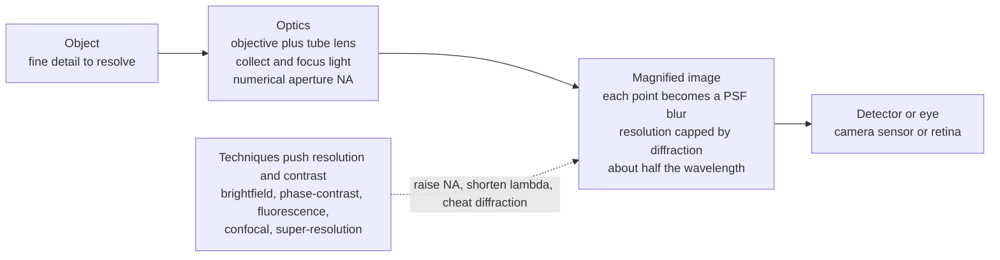

# 🔬 Optical Imaging and Microscopy

> [!abstract] TL;DR
> **Optical imaging** turns light into a faithful, magnified picture of the world; **microscopy** pushes that art to its physical extreme. An imaging system collects light from an object with an **objective lens** and forms an image whose sharpness is set not by the lens quality but by **diffraction**: the image of a single point is a finite blur called the **point-spread function (PSF)**, an **Airy disk**, and the whole image is the object **convolved** with it. This caps resolution at the **Abbe limit** $d \approx \lambda/(2\,\mathrm{NA}) \approx 200$ nm for visible light — two features closer than that merge into one smudge. You beat back the limit with **numerical aperture (NA)** (oil immersion, $\mathrm{NA}\to1.4$) and shorter wavelength (UV, or electrons in electron microscopy), and you win **contrast** with phase-contrast/DIC for transparent cells and **fluorescence** to make specific molecules glow. **Confocal** microscopy adds a pinhole for sharp optical sections and 3D imaging; **multiphoton** reaches deep into tissue. Then the Nobel-winning twist: **super-resolution** (STED, PALM/STORM, SIM) cheats the diffraction limit to localize *single molecules* to a few nanometers — reopening a hidden universe once thought forever blurred.

## Intuition

**Analogy — the microscope cracked open an invisible universe.** For all of history, an entire world sat right under our noses and no eye could see it: living cells, swarming bacteria, the molecular machinery of life. Then a tube with two lenses revealed it, and biology and medicine were never the same. But the microscope hit a hard wall — a wall made of light itself. No matter how flawless the glass, light waves refuse to focus to a point smaller than about half their wavelength. So a conventional light microscope simply *cannot* separate two things closer than roughly **200 nanometers**; anything finer collapses into a single blur, like trying to read fine print through frosted glass. For a century this **diffraction limit** was believed to be an unbreakable law of nature.

The magic of modern microscopy is the century-long arms race to beat that wall. **Fluorescence** makes chosen molecules light up like tagged actors on a dark stage. **Confocal scanning** slices out a single razor-thin optical plane, throwing away the haze from everything above and below. And the Nobel-winning breakthrough — **super-resolution** — cleverly outwits diffraction to pinpoint individual molecules, seeing detail ten times finer than the "unbreakable" limit. Imaging, at bottom, is the art of turning light into an ever-sharper picture of reality, from the everyday photograph all the way down to a single protein.

---

## How It Works

An imaging system is a light-collecting funnel plus a linear filter. The **objective lens** gathers the diverging light from each object point; a **tube lens** (or the eyepiece) refocuses it into a magnified image on a detector or retina. What matters is not just *magnification* (how big) but **resolution** (how fine), and the two are governed by completely different physics.

1. **Light collection and NA.** The objective can only capture rays within a cone of half-angle $\alpha$. The **numerical aperture** $\mathrm{NA}=n\sin\alpha$ (with $n$ the refractive index of the medium between lens and sample) measures both how much light and how much *fine detail* the lens gathers. Higher NA = steeper cone = finer detail, because fine detail lives in light that scatters at steep angles.
2. **The point-spread function.** Because of diffraction at the finite aperture, a single point object does **not** image to a point — it images to a bright central disk ringed by faint halos, the **Airy disk**. This blur is the **PSF**, the system's fundamental "brush stroke."
3. **Image = object ⊛ PSF.** Every object point paints its own PSF; the full image is the object **convolved** with the PSF. In frequency space this multiplies the object's spatial spectrum by the **optical transfer function (OTF)**, which is a hard **low-pass filter** — it deletes all detail above a cutoff frequency. That deletion *is* the resolution limit.
4. **The diffraction limit.** The finest resolvable spacing is the **Abbe limit** $d\approx\lambda/(2\,\mathrm{NA})$ (equivalently the **Rayleigh criterion**, two Airy disks whose peaks sit on each other's first dark ring). For green light and a great objective, $d\approx200$ nm.
5. **Pushing the limit — legitimately.** Raise NA (oil immersion, $n\approx1.5$, $\mathrm{NA}\to1.4$) or shorten $\lambda$ (UV light, or the picometer de Broglie wavelength of **electrons** in electron microscopy, which reaches atomic resolution).
6. **Winning contrast.** Most cells are transparent, so resolution is useless without **contrast**: brightfield with stains, **phase-contrast** and **DIC** turning optical-path differences into visible shading, **darkfield**, and above all **fluorescence** — labeling specific molecules with **fluorophores** that absorb one color and emit a longer one (the **Stokes shift**), isolated by filters.
7. **Beating the limit — cleverly.** **Confocal** rejects out-of-focus light with a pinhole (optical sectioning, 3D). **Super-resolution** (STED, PALM/STORM, SIM) exploits fluorophore switching and nonlinearity to squeeze or localize the glowing spot far below $200$ nm.



---

## Key Concepts

### Secondary Level

- **Magnification is not resolution.** A microscope does two jobs: make things *bigger* and reveal *finer detail*. You can blow an image up as large as you like, but past a point you just get a bigger blur — **empty magnification**. Resolution, not magnification, is the real prize.
- **The diffraction wall (~200 nm).** Light is a wave, and waves cannot be focused to a point smaller than about half their wavelength. Visible light is ~500 nm, so a light microscope cannot separate two dots closer than ~200 nm — the size of many viruses and cell structures. This is a law of physics, not a lens defect.
- **Cells are see-through, so you need contrast.** Living cells are nearly transparent. To see them you either stain them (killing them), use clever tricks like **phase-contrast** that turn invisible thickness differences into shading, or — the biologist's favorite — **fluorescence**: tag one specific molecule with a dye that *glows* under the right color of light, so it lights up against a black background.
- **Why bigger, shorter, cleverer.** You sharpen a microscope three ways: gather light over a wider cone (**oil-immersion** lenses), use shorter-wavelength light (UV, or **electrons** for atomic detail), or use **super-resolution** tricks that dodge the wall entirely.

### Undergraduate Level

**Magnification and numerical aperture.** For an objective of focal length $f_{obj}$ and tube lens $f_{tube}$, transverse magnification is $M = f_{tube}/f_{obj}$. The workhorse quantity, though, is

$$\mathrm{NA} = n\sin\alpha$$

where $\alpha$ is the half-angle of the collection cone and $n$ the immersion medium's index. A dry objective is capped at $\mathrm{NA}<1$; oil immersion ($n\approx1.515$) pushes $\mathrm{NA}$ to $\sim1.4$.

**The resolution limit.** The PSF of a circular aperture is the Airy pattern; two point sources are "just resolved" (Rayleigh) when separated by

$$d_{\text{Rayleigh}} = 0.61\,\frac{\lambda}{\mathrm{NA}}, \qquad\qquad d_{\text{Abbe}} = \frac{\lambda}{2\,\mathrm{NA}}.$$

For $\lambda=520$ nm and $\mathrm{NA}=1.4$: $d_{\text{Abbe}}\approx186$ nm — the famous ~200 nm wall. Halving $\lambda$ or the largest achievable NA both help, but far-field visible light is fundamentally stuck near this value. Axial (depth) resolution is worse, $\sim 2\lambda n/\mathrm{NA}^2$.

**Image formation as a linear system.** The image is $I(\mathbf{r}) = O(\mathbf{r}) \ast \mathrm{PSF}(\mathbf{r})$ — the object convolved with the PSF. In Fourier space, $\tilde I = \tilde O \cdot \mathrm{OTF}$, and the (incoherent) OTF vanishes beyond a cutoff spatial frequency $f_c = 2\,\mathrm{NA}/\lambda$. Everything finer than $1/f_c$ is *gone from the data* — this is the resolution limit restated as a low-pass filter, and it is why raw sharpening cannot recover what diffraction deleted.

**Contrast techniques.**

| Technique | Turns into contrast | Best for |
|-----------|---------------------|----------|
| Brightfield + stain | absorption | fixed, stained samples |
| Phase-contrast | optical-path (phase) shifts | live transparent cells |
| DIC (Nomarski) | gradients of optical path | 3D-relief of live cells |
| Darkfield | scattered light on black | tiny particles, bacteria |
| Fluorescence | molecule-specific emission | labeled proteins, the biology workhorse |

**Fluorescence and confocal.** A fluorophore absorbs at $\lambda_{ex}$ and re-emits at a longer $\lambda_{em}$ (**Stokes shift**); a filter cube ("dichroic") separates the faint emission from the intense excitation. **Confocal** microscopy scans a focused spot and places a **pinhole** in front of the detector conjugate to that spot, physically blocking out-of-focus haze — yielding thin **optical sections** and true 3D stacks. **Multiphoton** microscopy uses femtosecond near-IR pulses so that only the tight focus has high enough intensity to excite the dye, enabling deep-tissue (hundreds of microns) imaging with less scattering and bleaching; **light-sheet** illuminates only the plane being imaged for fast, gentle volumetric imaging.

### Graduate Level

**OTF as pupil autocorrelation.** For incoherent imaging the OTF is the normalized autocorrelation of the pupil function; its support ends at $f_c = 2\,\mathrm{NA}/\lambda$ (coherent imaging cuts at $\mathrm{NA}/\lambda$). The magnitude of the OTF (the MTF) falls smoothly to zero at $f_c$, so contrast degrades *before* the hard cutoff — real resolution depends on both the cutoff and the SNR near it.

**Confocal's edge.** The confocal PSF is the *product* of the illumination and detection PSFs, $\mathrm{PSF}_{conf}=\mathrm{PSF}_{ill}\cdot\mathrm{PSF}_{det}$, which narrows the effective spot by up to $\sqrt2$ laterally and, crucially, adds strong **axial** discrimination (optical sectioning) that a widefield microscope entirely lacks. Sampling must obey **Nyquist**: pixel/voxel spacing $\le$ half the resolution, or you re-lose resolution at the detector.

**Super-resolution — three families, none violating diffraction.**
- **STED (deterministic, targeted).** A doughnut-shaped depletion beam uses stimulated emission to switch off fluorophores everywhere except a sub-diffraction center, shrinking the *effective* PSF: $d \approx \dfrac{\lambda}{2\,\mathrm{NA}\sqrt{1+I/I_{sat}}}$. Crank $I/I_{sat}$ and resolution keeps improving — down to tens of nm.
- **SMLM: PALM / STORM (stochastic, single-molecule).** Only a sparse, random subset of molecules blinks "on" at a time, so each isolated PSF can be fit to find its center with precision $\sigma \approx \mathrm{FWHM}/\sqrt{N}$ ($N$ = photons collected) — nanometers, far below the PSF *width*. Thousands of frames reconstruct the full structure. Resolution is limited by photon budget and labeling density, not by $\lambda$.
- **SIM (patterned, linear ~2×).** A fine illumination grating beats against the sample, folding otherwise-unreachable high frequencies into the passband as **moiré**; computational demixing recovers ~2× resolution. Nonlinear/saturated SIM extends this further.

**Computational imaging and deconvolution.** Since $\tilde I = \tilde O\cdot\mathrm{OTF}$, one can partly invert the blur where the OTF is nonzero: **Wiener** and **Richardson–Lucy** deconvolution sharpen and denoise, but they *amplify noise* near OTF zeros and can hallucinate detail — they recover contrast the system passed weakly, never information the cutoff deleted. Adaptive optics correct aberrations; Fourier ptychography and structured detection extend the effective NA. The **2014 Nobel Prize in Chemistry** (Betzig, Hell, Moerner) crowned super-resolved fluorescence microscopy.

---

## Python Demo

```python
# Optical imaging & the diffraction limit, with numpy + matplotlib:
#   (a) POINT-SPREAD FUNCTION (Airy disk) = image of a single point; a bigger
#       aperture (higher NA) or shorter wavelength gives a NARROWER PSF.
#   (b) RESOLUTION LIMIT: two point sources merge into one blob once they are
#       closer than ~ the Airy radius (Abbe/Rayleigh: d ~ lambda / (2*NA)).
#   (c) IMAGE FORMATION = convolution of the object with the PSF (blurring):
#       coarse bars survive, sub-limit fine bars wash out to gray.
#   (d) SUPER-RESOLUTION: localizing a single bright emitter to a precision far
#       below the PSF width -- how PALM/STORM beat the diffraction limit.
import numpy as np
import matplotlib.pyplot as plt
from matplotlib.patches import Circle

rng = np.random.default_rng(0)

# ---- diffraction-limited PSF: |FT{circular pupil}|^2 (an Airy disk) ----
#      NA is proportional to the pupil radius; bigger pupil -> narrower PSF.
def airy_psf(N, pupil_frac):
    g = np.linspace(-1, 1, N)
    X, Y = np.meshgrid(g, g)
    pupil = (np.hypot(X, Y) < pupil_frac).astype(float)
    amp = np.fft.fftshift(np.fft.fft2(np.fft.ifftshift(pupil)))
    psf = np.abs(amp) ** 2
    return psf / psf.sum()

N = 256
c = N // 2
psf_lowNA  = airy_psf(N, 0.08)   # small aperture -> wide PSF  -> coarse resolution
psf_highNA = airy_psf(N, 0.16)   # larger aperture -> narrow PSF -> finer resolution

# Airy first-zero radius of the high-NA PSF = our "resolution limit" in pixels
line = psf_highNA[c, c:]                      # radial profile outward from center
res_px = int(np.argmax(np.diff(line) > 0)) + 1  # first index where profile stops falling

# ---- two point sources separated below / at / above the resolution limit ----
def two_points(psf, sep):
    a = np.roll(psf, -(sep // 2), axis=1)
    b = np.roll(psf,  sep - sep // 2, axis=1)
    img = a + b
    return img / img.max()

seps = [max(2, int(0.6 * res_px)), int(1.0 * res_px), int(1.7 * res_px)]
labels = ["closer than limit -> unresolved",
          "at the limit -> just resolved",
          "beyond limit -> resolved"]

# ---- image formation as convolution: a bar target through the microscope ----
def convolve_fft(obj, psf):
    O = np.fft.fft2(obj)
    H = np.fft.fft2(np.fft.ifftshift(psf))
    return np.real(np.fft.ifft2(O * H))

obj = np.zeros((N, N))
for x in range(30, 120, 16):          # COARSE bars (spacing > limit) -> survive
    obj[50:206, x:x + 4] = 1.0
for x in range(150, 235, 6):          # FINE bars (spacing < limit) -> wash out
    obj[50:206, x:x + 2] = 1.0
blurred = convolve_fft(obj, psf_highNA)

# ---- super-resolution: localize ONE emitter far below the PSF width ----
w = 18
crop = psf_highNA[c - w:c + w, c - w:c + w].copy()
crop /= crop.sum()
yy, xx = np.mgrid[0:2 * w, 0:2 * w]
true_c = (2 * w - 1) / 2.0
photons, bg = 800.0, 0.5
errs = []
for _ in range(3000):
    frame = rng.poisson(photons * crop + bg)      # shot-noise-limited emitter image
    tot = frame.sum()
    cx = (frame * xx).sum() / tot                  # intensity-weighted centroid
    cy = (frame * yy).sum() / tot
    errs.append([cx - true_c, cy - true_c])
errs = np.array(errs)
loc_std = errs.std(axis=0).mean()

# ============================ plots ============================
fig, ax = plt.subplots(2, 3, figsize=(15, 9))

# (a) the PSF (Airy disk), log scale
im = ax[0, 0].imshow(np.log10(psf_highNA[c - 40:c + 40, c - 40:c + 40] + 1e-9),
                     cmap="inferno")
ax[0, 0].set_title("(a) PSF: image of a single point (Airy disk)")
ax[0, 0].set_xlabel("pixels"); ax[0, 0].set_ylabel("pixels")
fig.colorbar(im, ax=ax[0, 0], label="log10 intensity")

# (b) higher NA -> narrower PSF -> finer resolution
r = np.arange(60)
ax[0, 1].plot(r, psf_lowNA[c, c:c + 60] / psf_lowNA[c, c], "C0", lw=2,
              label="low NA  (wide PSF)")
ax[0, 1].plot(r, psf_highNA[c, c:c + 60] / psf_highNA[c, c], "C3", lw=2,
              label="high NA (narrow PSF)")
ax[0, 1].axvline(res_px, ls=":", color="k", alpha=0.7)
ax[0, 1].text(res_px + 1, 0.6, f"Airy radius\n= {res_px} px", fontsize=8)
ax[0, 1].set_title("(b) Higher NA / shorter lambda -> narrower PSF")
ax[0, 1].set_xlabel("radius (pixels)"); ax[0, 1].set_ylabel("intensity (norm.)")
ax[0, 1].legend(fontsize=8)

# (c) two points merging: below / at / above the diffraction limit
for sep, lab, off in zip(seps, labels, [2.2, 1.1, 0.0]):
    prof = two_points(psf_highNA, sep)[c, c - 30:c + 30]
    ax[0, 2].plot(np.arange(-30, 30), prof + off, lw=2,
                  label=f"sep={sep}px: {lab}")
ax[0, 2].set_title("(c) Two point sources vs the resolution limit")
ax[0, 2].set_xlabel("pixels"); ax[0, 2].set_ylabel("intensity (offset)")
ax[0, 2].legend(fontsize=7, loc="upper right")

# (d) object: a bar resolution target
ax[1, 0].imshow(obj, cmap="gray")
ax[1, 0].set_title("(d) Object: coarse bars | fine bars")
ax[1, 0].set_xticks([]); ax[1, 0].set_yticks([])

# (e) image = object convolved with PSF: fine bars wash out
ax[1, 1].imshow(blurred, cmap="gray")
ax[1, 1].set_title("(e) Image = object * PSF: sub-limit detail lost")
ax[1, 1].set_xticks([]); ax[1, 1].set_yticks([])

# (f) super-resolution: localization scatter << PSF width
ax[1, 2].scatter(errs[:, 0], errs[:, 1], s=3, alpha=0.25, color="C2",
                 label=f"localizations (std={loc_std:.2f} px)")
ax[1, 2].add_patch(Circle((0, 0), res_px, fill=False, color="C3", lw=2,
                          label=f"PSF Airy radius = {res_px} px"))
ax[1, 2].set_xlim(-res_px * 1.3, res_px * 1.3)
ax[1, 2].set_ylim(-res_px * 1.3, res_px * 1.3)
ax[1, 2].set_aspect("equal")
ax[1, 2].set_title("(f) Super-resolution: localize below the PSF")
ax[1, 2].set_xlabel("x error (px)"); ax[1, 2].set_ylabel("y error (px)")
ax[1, 2].legend(fontsize=7, loc="upper right")

plt.tight_layout()
plt.savefig("optical_imaging_and_microscopy.png", dpi=110)
print("Saved optical_imaging_and_microscopy.png")

# ---- Abbe limit for real objectives: d ~ lambda / (2*NA) ----
print("\nAbbe resolution limit  d = lambda / (2*NA):")
for lam_nm, NA in [(550, 0.25), (550, 0.65), (550, 1.4), (400, 1.4), (250, 1.4)]:
    d = (lam_nm * 1e-9) / (2 * NA)
    print(f"  lambda={lam_nm:3d} nm, NA={NA:>4}:  d = {d*1e9:6.1f} nm")
print(f"\nSuper-resolution: single-emitter localization std = {loc_std:.2f} px, "
      f"vs PSF Airy radius = {res_px} px  ->  ~{res_px/loc_std:.0f}x below the limit")
```

Panel (a) renders the **Airy-disk PSF**, the image of a lone point. Panel (b) shows a higher-NA system produces a *narrower* PSF (finer resolution), with the Airy radius that defines the limit marked. Panel (c) is the heart of it: two point sources at `0.6×`, `1.0×`, and `1.7×` the limit — closer than the limit they merge into one hump (unresolvable), at the limit a dip appears, beyond it they cleanly separate. Panels (d)–(e) show **image formation as convolution**: coarse bars pass through, but fine bars spaced below the limit wash out to featureless gray — information the OTF deleted. Panel (f) demonstrates **super-resolution**: a *single* bright emitter, though blurred across the whole Airy disk, is localized by its centroid to a scatter far tighter than the PSF — the trick behind PALM/STORM.

---

## Real-World Applications

> **Fluorescence microscopy — the workhorse of cell biology.** Tagging a protein with **GFP** or an antibody-linked dye makes it glow against a black field, letting biologists watch specific molecules in living cells. Nearly every modern cell-biology paper rests on fluorescence; the entire discipline of visualizing the **cytoskeleton**, organelles, and signaling proteins depends on it.

> **Confocal and multiphoton in neuroscience.** **Confocal** microscopes build 3D reconstructions of thick specimens by optical sectioning, imaging neurons and tissue architecture in depth. **Multiphoton** microscopy, using femtosecond lasers, penetrates hundreds of microns into living brain to record **calcium-imaging** activity of neurons in behaving animals — impossible with widefield light.

> **Super-resolution mapping of molecular machines.** **STED**, **PALM/STORM**, and **SIM** resolve structures once hopelessly blurred: the ring architecture of the **nuclear pore complex**, the nanoscale organization of synapses, and the periodic spectrin skeleton of axons — features 20–50 nm across, an order of magnitude below the classical limit (Nobel Prize, Chemistry 2014).

> **Electron microscopy and cryo-EM.** When even UV is too coarse, switch photons for **electrons**, whose picometer de Broglie wavelength shatters the optical limit to reach near-atomic resolution — imaging nanomaterials, semiconductor devices, and, via **cryo-EM**, the 3D structures of proteins and viruses that reshaped structural biology.

> **Industry and medicine.** Automated **digital pathology** scans stained tissue slides for cancer diagnosis; semiconductor fabs use high-NA and short-wavelength inspection to find nanometer defects; and the same imaging-chain principles — NA, PSF, contrast, sampling — govern every camera, endoscope, and telescope ever built.

---

## Common Pitfalls

- **Confusing magnification with resolution.** Cranking magnification past what NA supports gives **empty magnification** — a bigger blur, not more detail. Resolution is set by $\lambda$ and NA, full stop; magnification just matches that resolution to the detector's pixels.
- **"Super-resolution breaks the diffraction limit of light."** It does not. The *collected* light is still diffraction-limited; STED shrinks the *effective* emitting spot by switching molecules off, and PALM/STORM *localize* well-separated single emitters over time. Diffraction is dodged by fluorophore photophysics and sparsity, never repealed.
- **Under-sampling the image (violating Nyquist).** A microscope may resolve 200 nm, but if the camera pixels correspond to 300 nm at the sample you throw that resolution away at the detector. Pixel spacing must be $\le$ half the optical resolution.
- **Ignoring the immersion medium.** A 1.3-NA oil objective used *dry* (or with a coverslip mismatch) never reaches its rated NA — the steep, high-information rays are lost to total internal reflection. NA depends on $n\sin\alpha$; the medium is part of the lens.
- **Confusing resolution with localization precision.** A single molecule can be *localized* to a few nm, yet **two** overlapping molecules closer than ~200 nm still cannot be *resolved* unless they blink at different times. Localization precision ($\propto 1/\sqrt{N_{photons}}$) and resolution (separating two things) are different quantities.
- **Over-trusting deconvolution.** Deconvolution restores contrast the OTF passed *weakly*, but amplifies noise near OTF zeros and can invent detail. It cannot recover spatial frequencies above the cutoff — that information was never recorded.
- **Photobleaching and phototoxicity.** Fluorophores fade and intense light damages live cells; super-resolution and long time-lapses are especially demanding, forcing a constant trade among resolution, speed, and sample health.

---

## Related Concepts

Cross-vault, Glob-verified links:

- [[Interference_and_Diffraction]] — the physics-vault source of the diffraction that *sets* the resolution limit: the Airy pattern, the Rayleigh criterion, and $\theta=1.22\,\lambda/D$ that this note applies to microscopy as $d=\lambda/2\mathrm{NA}$.
- [[Fourier_Transform]] — the OTF is the Fourier-domain description of imaging; the PSF and OTF are a Fourier-transform pair, and the diffraction cutoff is a low-pass filter in frequency space.
- [[CT_Convolution]] — image formation *is* the convolution of the object with the PSF; the mathematical operation at the core of every imaging system.
- [[Impulse_Response]] — the PSF is precisely the optical system's impulse response; the OTF is its frequency response, making a microscope a 2D linear shift-invariant system.
- [[DFT_and_FFT]] — the discrete transform used in the Python demo to synthesize the Airy PSF and perform image-forming convolution numerically.
- [[Image_Representations]] — the discrete, computational side: 2D spatial-frequency content, sampling, and the deconvolution/restoration that recover contrast the microscope passed weakly.
- [[CNN_Architectures]] — convolution as the building block of both optical imaging and modern learned image restoration, denoising, and super-resolution reconstruction.
- [[The_Cell_Theory_and_Cell_Types]] — the cells and organelles the microscope first revealed; the biology that optical imaging exists to see.
- [[The_Cytoskeleton_and_Cell_Motility]] — a canonical fluorescence and super-resolution target: actin and microtubule networks imaged molecule by molecule.
- [[Nanoscale_Physics_and_Quantum_Confinement]] — the sub-200 nm world beyond the optical limit, where electron microscopy and super-resolution take over.
- [[X_Ray_Diffraction_and_Braggs_Law]] — the characterization companion: shorter-wavelength (X-ray, electron) probes push resolution to the atomic scale, exactly the "shorten $\lambda$" strategy generalized.

This is the opening note of the **Imaging & Optical Systems** section (S05). It grounds the sibling notes that follow: *Lenses_Mirrors_and_Imaging* supplies the ray-optics of image formation and magnification that precedes diffraction; *Diffraction_and_Fourier_Optics* derives the Airy disk, PSF, and OTF this note applies; *Cameras_Sensors_and_Digital_Imaging* carries the same NA/PSF/sampling chain into detectors and photography; *Adaptive_Optics_and_Telescopes* fights aberration and atmosphere to reach the diffraction limit at the other end of the size scale; and *Biophotonics_and_Optics_in_Medicine* takes fluorescence, confocal, and multiphoton imaging into living tissue and the clinic.

---

## Review Questions

1. **(Secondary)** A microscope maker claims their new instrument magnifies 5000× and can therefore see individual proteins ~5 nm across. Why is this claim physically impossible for a normal light microscope, what ~200 nm wall stops it, and name one modern trick that gets around the wall.
2. **(Undergraduate)** An oil-immersion objective has $\mathrm{NA}=1.4$ and you image with green light $\lambda=520$ nm. Compute the Abbe resolution $d=\lambda/2\mathrm{NA}$. How does it change if you switch to a dry objective with $\mathrm{NA}=0.65$, or to $\lambda=400$ nm violet? What is the largest camera pixel size (at the sample) that still satisfies Nyquist for the $\mathrm{NA}=1.4$ case?
3. **(Graduate)** Contrast **STED**, **PALM/STORM**, and **SIM**: which is deterministic vs stochastic vs patterned, roughly what resolution each reaches, and explain in one sentence each why none violates the diffraction limit of the collected light. Separately, explain via the effective PSF $\mathrm{PSF}_{ill}\cdot\mathrm{PSF}_{det}$ why a confocal pinhole gives optical sectioning that widefield microscopy cannot.

---

## Sources

- Murphy, D. B. & Davidson, M. W. — *Fundamentals of Light Microscopy and Electronic Imaging*, 2nd ed. (Wiley, 2012) — contrast methods, resolution, digital imaging.
- Hecht, E. — *Optics*, 5th ed. (2016), Ch. 5–6, 10–11 — imaging, apertures, diffraction, and the resolution limit.
- Mertz, J. — *Introduction to Optical Microscopy*, 2nd ed. (Cambridge, 2019) — PSF/OTF, fluorescence, confocal, multiphoton, and super-resolution.
- Pawley, J. B. (ed.) — *Handbook of Biological Confocal Microscopy*, 3rd ed. (Springer, 2006) — the definitive reference on confocal optical sectioning.
- The Nobel Prize in Chemistry 2014 — Eric Betzig, Stefan Hell, William Moerner, "for the development of super-resolved fluorescence microscopy."

---

#optics #microscopy #diffraction-limit #fluorescence #super-resolution
