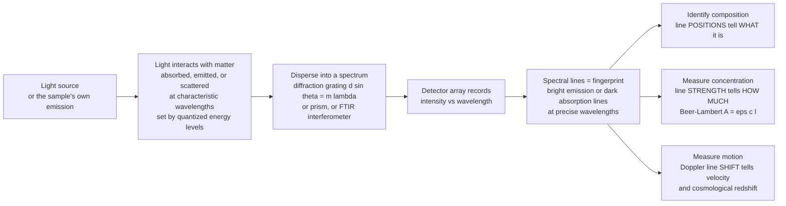

# 🌈 Spectroscopy and Optical Analysis

> [!abstract] TL;DR
> **Spectroscopy** reads the secret barcode that every substance writes into light. Atoms and molecules absorb, emit, and scatter light only at **characteristic wavelengths** fixed by their **quantized energy levels** (electronic, vibrational, rotational). Spread a material's light into a **spectrum** (intensity vs wavelength) with a **diffraction grating** ($d\sin\theta = m\lambda$) or prism, and you find sharp **bright emission lines** or **dark absorption lines** at precise colours — a **fingerprint** that reveals *what a substance is*. The *strength* of a line reveals *how much* is there (the **Beer–Lambert law**, $A=\varepsilon c\ell$), and any **Doppler shift** of the lines reveals *how fast it moves* — the same trick that measures blood flow, breath alcohol, and the **cosmological redshift** that told us the universe is expanding. Non-contact and remote, spectroscopy is arguably science's single most powerful analytical tool, connecting optics to chemistry, astronomy, and medicine: it is how we know the composition of stars we can never visit.

## Intuition

**Analogy:** Every substance has a secret barcode written in light. Pass sunlight through a prism and you get a smooth rainbow — but look closely at the light from a *specific* material (a glowing gas, a chemical in solution, a distant star) and the rainbow is **not smooth**. It is scored with sharp bright lines or dark gaps at exact colours, always the *same* colours for the *same* substance. Sodium always burns the same two yellow lines; hydrogen always shows its red, blue-green, and violet ladder. Those lines are a **fingerprint**: no two elements share the same pattern, because the pattern is set by the specific "rungs" of energy inside their atoms.

The astonishing payoff is that you never have to touch the thing. Spread the light, read the lines, and matter *confesses its identity* — even from across the galaxy, because a star's light carries its fingerprint intact across the cosmos. Read the *brightness* of the lines and it confesses *how much* of each ingredient it holds. Watch the lines slide toward red or blue and it confesses its *motion*. Spectroscopy turns a plain beam of light into a chemical and physical detective.

---

## How It Works

The core loop is always the same: **light interacts with matter → disperse the light into a spectrum → detect intensity versus wavelength → read the lines → identify, quantify, and clock the source.**

1. **Interaction sets the wavelengths.** Quantum mechanics restricts an atom or molecule to a discrete ladder of energy levels. A photon is only absorbed or emitted when its energy exactly bridges two levels: $\Delta E = h\nu = hc/\lambda$. Big electronic jumps land in the **UV–visible**; smaller molecular *vibrations* land in the **infrared**; tiny *rotations* land in the microwave. Because the ladder is unique to each species, so is the set of allowed wavelengths — the fingerprint. Light can also be **scattered inelastically** (Raman), gaining or losing exactly one vibrational quantum.
2. **A source (or the sample itself) provides the light.** In **absorption** you shine a broadband beam *through* the sample and look for the wavelengths it removes (dark lines). In **emission** the sample *is* the source — excited by heat, flame, plasma, spark, or a laser — and glows only at its own lines. In **fluorescence/Raman** you illuminate and collect the re-emitted or scattered light.
3. **A disperser fans the light out by wavelength.** A **diffraction grating** sends each wavelength to a different angle via the grating equation $d\sin\theta = m\lambda$ — the heart of the spectrometer (a prism does the same job through dispersion). This physically separates the colours in space.
4. **A detector array records intensity vs wavelength.** A CCD or photodiode array captures the whole dispersed spectrum at once. The result is a plot of brightness against wavelength — the raw spectrum.
5. **Read the lines.** *Positions* of the lines → **composition** (which species). *Depths/heights* of the lines → **concentration** (via Beer–Lambert). *Widths* → temperature, pressure, and dynamics. *Shifts* → **motion** (Doppler velocity and redshift).
6. **Fourier-transform variant.** Instead of a grating, an **FTIR** spectrometer uses a scanning **interferometer**: it records an interferogram versus mirror position and takes its Fourier transform to recover the spectrum — winning throughput and multiplex advantages in the infrared.



---

## Key Concepts

### Secondary Level

- **A spectrum** is light spread into its component colours (wavelengths), plotted as brightness versus colour. White light gives a smooth rainbow; a pure substance gives a *patterned* one.
- **Emission lines** are bright colours a hot substance gives *off* (neon signs, sodium street lamps, fireworks). **Absorption lines** are the *dark gaps* left behind when a substance filters out those same colours from light passing through it.
- **Fingerprint principle:** each element and molecule has its own fixed set of lines, so the pattern identifies the substance without any chemistry — just light. This is how we know **what stars are made of** even though we can never visit them: their light carries the fingerprint to us.
- **How much?** The more of a coloured substance is dissolved in a sample, the more of its light it absorbs. Measuring that absorption tells you the **concentration** — the idea behind a breathalyzer and a pulse oximeter.

### Undergraduate Level

**Line positions from quantized levels**

$$\Delta E = E_2 - E_1 = h\nu = \frac{hc}{\lambda}$$

For hydrogen the Balmer series ($n\to 2$) gives the visible lines via $\tfrac{1}{\lambda}=R_H\left(\tfrac{1}{2^2}-\tfrac{1}{n^2}\right)$: H-α 656.3 nm, H-β 486.1 nm, and so on. Electronic transitions → UV–Vis; vibrational → IR; rotational → microwave.

**Grating dispersion and resolving power**

$$d\sin\theta = m\lambda, \qquad R = \frac{\lambda}{\Delta\lambda} = mN$$

$N$ illuminated grooves at order $m$ set how finely two nearby wavelengths can be split — tie this straight to [[Interference_and_Diffraction]].

**Beer–Lambert law (quantitative analysis)**

$$A = -\log_{10}\!\frac{I}{I_0} = \varepsilon\, c\, \ell$$

Absorbance $A$ is *linear* in concentration $c$ (molar absorptivity $\varepsilon$, path length $\ell$). Build a calibration line, then read unknown concentrations off it — the workhorse of analytical labs.

**Doppler shift (motion)**

$$\frac{\Delta\lambda}{\lambda_0} = \frac{v}{c} \quad (v \ll c)$$

A line from a source receding at $v$ is red-shifted; approaching, blue-shifted. Measuring $\Delta\lambda$ yields the line-of-sight velocity.

**Emission, fluorescence, and Raman.** Emission comes from de-excitation; **fluorescence** re-emits at longer wavelength after absorption; **Raman** scattering is *inelastic* — scattered light is shifted by exactly a vibrational quantum (Stokes down-shift, anti-Stokes up-shift), giving a vibrational fingerprint even in water and through glass (connect to [[Nonlinear_Optics]]).

### Graduate Level

- **Line shapes and broadening.** A real line has finite width: **natural** (lifetime → Lorentzian), **Doppler/thermal** (velocity distribution → Gaussian, width $\propto\sqrt{T/M}$), and **collisional/pressure** broadening; their convolution is the **Voigt profile**. Line width thus encodes temperature, pressure, and dynamics, not just identity.
- **Transition strengths.** Whether a line appears at all is governed by **selection rules** and the **transition dipole moment**; intensities relate to the **Einstein coefficients** $A_{21}, B_{12}, B_{21}$ and level populations (Boltzmann/Saha). This underlies the astrophysical **curve of growth** linking a line's **equivalent width** to **column density**.
- **Fourier-transform spectroscopy (FTIR).** A Michelson interferometer records an interferogram $I(x)$ versus mirror displacement; the spectrum is $S(\nu)=\mathcal{F}\{I(x)\}$. Wins the **Fellgett** (multiplex) and **Jacquinot** (throughput) advantages over scanning-slit dispersion in the IR.
- **Laser and high-resolution methods.** **Cavity ring-down** (decay-time absorption for trace gases), **Doppler-free saturation** spectroscopy, **frequency-comb** spectroscopy, and **LIDAR/DIAL** for atmospheric remote sensing exploit laser coherence and narrow linewidth for extreme sensitivity and resolution.
- **Relativistic and cosmological Doppler.** For large speeds, $1+z = \dfrac{\lambda_\text{obs}}{\lambda_\text{emit}} = \sqrt{\dfrac{1+\beta}{1-\beta}}$; on cosmic scales the **redshift** $z$ is stretching of space itself, giving Hubble's law $v = H_0 D$ — see [[The_Expanding_Universe_and_Hubbles_Law]].
- **Spectrometer design trade space.** Resolution ($R=mN$) versus **throughput/étendue** versus signal-to-noise; blaze angle and grating efficiency, order overlap (needing cross-dispersers/echelle), and detector read noise all constrain a real instrument.

---

## Python Demo

```python
# Spectroscopy: reading matter's fingerprint written in light.
#   (a) EMISSION vs ABSORPTION spectra  -> characteristic spectral LINES (the fingerprint)
#   (b) A diffraction GRATING disperses light by wavelength: d sin(theta) = m * lambda
#   (c) BEER-LAMBERT law A = eps * c * l  -> quantitative concentration (linear)
#   (d) DOPPLER shift of a line -> velocity / cosmological redshift
# Requires only numpy + matplotlib.

import numpy as np
import matplotlib.pyplot as plt

rng = np.random.default_rng(0)

# ---------------------------------------------------------------- shared
wl = np.linspace(380.0, 720.0, 4000)          # visible band, nanometres
line_width = 0.9                               # nm, instrumental line width

# A tiny "element" with four characteristic lines (nm) and relative strengths
line_centers = np.array([486.1, 546.1, 589.0, 656.3])   # H-beta, Hg, Na-D, H-alpha
line_amps    = np.array([0.70,  0.60,  0.85,  1.00])

def spectrum_of_lines(wl, centers, amps, width):
    s = np.zeros_like(wl)
    for c, a in zip(centers, amps):
        s += a * np.exp(-0.5 * ((wl - c) / width) ** 2)
    return s

# ---------------------------------------------------------------- (a) lines
emission = spectrum_of_lines(wl, line_centers, line_amps, line_width)
emission += 0.01 * rng.standard_normal(wl.size)          # detector noise

continuum  = 1.0 - 0.0011 * (wl - 380.0)                 # smooth (blackbody-ish) slope
absorption = continuum - 0.75 * spectrum_of_lines(wl, line_centers, line_amps, line_width)

# ---------------------------------------------------------------- (b) grating
grooves_per_mm = 600.0
d_nm = 1.0e6 / grooves_per_mm                             # groove spacing in nm (~1667 nm)
wl_g = np.linspace(380.0, 720.0, 400)
theta_m = {}
for m in (1, 2):
    arg = m * wl_g / d_nm
    valid = arg <= 1.0                                   # only real diffraction angles
    theta_m[m] = (wl_g[valid], np.degrees(np.arcsin(arg[valid])))

# ---------------------------------------------------------------- (c) Beer-Lambert
eps, path = 8000.0, 1.0                                   # L/(mol*cm), cm
conc = np.linspace(0.0, 1.0e-4, 12)                      # mol/L
A_true = eps * path * conc
A_meas = A_true + 0.02 * rng.standard_normal(conc.size)  # noisy "measurements"
slope, intercept = np.polyfit(conc, A_meas, 1)           # calibration fit

# ---------------------------------------------------------------- (d) Doppler
c_light = 299792.458                                     # km/s
rest = 656.3                                             # H-alpha rest wavelength (nm)
v = 3000.0                                               # km/s recession
z = v / c_light
shifted = rest * (1.0 + z)                               # red-shifted wavelength
wl_d = np.linspace(654.0, 662.0, 2000)
rest_line = np.exp(-0.5 * ((wl_d - rest)    / 0.35) ** 2)
red_line  = np.exp(-0.5 * ((wl_d - shifted) / 0.35) ** 2)

# ---------------------------------------------------------------- plot
fig, ax = plt.subplots(2, 2, figsize=(13, 9))

# (a) emission + absorption fingerprint
ax[0, 0].plot(wl, emission, color="crimson", lw=1.0, label="emission (bright lines)")
ax[0, 0].plot(wl, absorption, color="navy", lw=1.0, label="absorption (dark dips)")
for c in line_centers:
    ax[0, 0].axvline(c, color="grey", ls=":", lw=0.7)
ax[0, 0].set_title("(a) Spectral lines = fingerprint of a substance")
ax[0, 0].set_xlabel("wavelength (nm)"); ax[0, 0].set_ylabel("intensity (arb.)")
ax[0, 0].legend(fontsize=8)

# (b) grating dispersion
for m, (w, th) in theta_m.items():
    ax[0, 1].plot(w, th, lw=2, label=f"order m = {m}")
ax[0, 1].set_title("(b) Grating disperses light:  d sin(theta) = m*lambda")
ax[0, 1].set_xlabel("wavelength (nm)"); ax[0, 1].set_ylabel("diffraction angle (deg)")
ax[0, 1].legend(fontsize=8)

# (c) Beer-Lambert calibration
ax[1, 0].plot(conc * 1e6, A_true, "k-", lw=1.5, label="A = eps*c*l (ideal)")
ax[1, 0].plot(conc * 1e6, A_meas, "o", color="teal", ms=6, label="measurements")
ax[1, 0].plot(conc * 1e6, slope * conc + intercept, "r--", lw=1.2, label="linear fit")
ax[1, 0].set_title("(c) Beer-Lambert: absorbance is linear in concentration")
ax[1, 0].set_xlabel("concentration (micromol/L)"); ax[1, 0].set_ylabel("absorbance A")
ax[1, 0].legend(fontsize=8)

# (d) Doppler shift
ax[1, 1].plot(wl_d, rest_line, color="black", lw=1.8, label=f"rest line {rest:.1f} nm")
ax[1, 1].plot(wl_d, red_line,  color="red",   lw=1.8,
              label=f"shifted {shifted:.2f} nm  (v={v:.0f} km/s, z={z:.4f})")
ax[1, 1].annotate("", xy=(shifted, 1.05), xytext=(rest, 1.05),
                  arrowprops=dict(arrowstyle="->", color="red"))
ax[1, 1].set_title("(d) Doppler shift -> velocity / redshift")
ax[1, 1].set_xlabel("wavelength (nm)"); ax[1, 1].set_ylabel("intensity (arb.)")
ax[1, 1].legend(fontsize=8)

plt.tight_layout()
plt.savefig("spectroscopy_demo.png", dpi=120)
print(f"Balmer H-alpha rest = {rest} nm; recession {v} km/s -> z = {z:.4f}, "
      f"observed = {shifted:.2f} nm")
print(f"Grating d = {d_nm:.1f} nm; first-order angle at 589 nm = "
      f"{np.degrees(np.arcsin(589.0/d_nm)):.2f} deg")
print(f"Beer-Lambert fit slope = {slope:.1f} L/(mol*cm)  (true eps*l = {eps*path:.1f})")
```

Panel (a) shows the same four transitions appearing as **bright emission lines** and as **dark absorption dips** on a continuum — identical *positions* (the fingerprint), opposite *sign*. Panel (b) shows the grating fanning each wavelength to its own angle, steeper in second order. Panel (c) recovers $\varepsilon\ell$ from the slope of a noisy calibration — quantitative analysis in one line of algebra. Panel (d) slides H-α from 656.3 nm to ~656.9 nm for a 3000 km/s recession, the very measurement that built Hubble's law.

---

## Real-World Applications

> **Astronomy — the composition and motion of the cosmos.** We know what stars and galaxies are made of *only* through their spectra: absorption lines in starlight name the elements (helium was discovered in the Sun's spectrum before it was found on Earth), line ratios give temperature and pressure, and Doppler **redshift** of galaxy lines is the direct evidence that the universe is expanding. Spectrographs bolted to telescopes even read the atmospheres of transiting exoplanets.

> **Medicine.** **Pulse oximetry** compares red and infrared absorption to read blood-oxygen saturation non-invasively; blood analyzers, capnography, and tissue **Raman/fluorescence** probes identify molecules in situ.

> **Chemistry, pharma, and forensics.** UV–Vis and FTIR confirm identity and purity; **Raman** identifies unknown powders through sealed bags (airport and police field kits); GC-MS and LC-MS couple separation to detection for trace analysis. Beer–Lambert underpins routine concentration assays.

> **Environmental and remote sensing.** Satellite and ground **DIAL/LIDAR** map ozone, CO₂, methane, and aerosols by their absorption fingerprints; **cavity ring-down** analyzers detect trace gases at parts-per-billion. A roadside **breathalyzer** measures ethanol by IR absorption.

> **Industry.** In-line NIR and Raman drive real-time quality control in food, semiconductors, plastics, and pharmaceuticals — non-contact, fast, and specific.

---

## Common Pitfalls

- **Confusing emission and absorption origin.** Both mark the *same* transition wavelengths; a hot rarefied gas *emits* its lines, while the same gas in front of a hotter continuum *absorbs* them (Kirchhoff's laws). Reading one as the other inverts your interpretation.
- **Beer–Lambert breakdown at high concentration.** $A=\varepsilon c\ell$ is only linear while the sample is dilute and the light monochromatic. Chemical aggregation, high absorbance ($A\gtrsim 1$–2), and **stray light** flatten the calibration — always work inside the validated linear range.
- **Ignoring resolution vs throughput.** A high-$R$ grating that splits fine lines also passes less light (worse SNR). Chasing resolution you cannot photon-afford yields noisy, useless spectra; match $R=mN$ to the physics you need.
- **Redshift confusions.** Doppler (motion), gravitational, and cosmological redshift are physically distinct. On cosmic scales $z$ is *space stretching*, not a literal velocity; naively applying $v=cz$ at large $z$ is wrong (use the relativistic/cosmological form).
- **Skipping wavelength and baseline calibration.** An uncalibrated wavelength axis mis-identifies species; an unsubtracted sloping continuum or fluorescence background distorts line depths and ruins quantification.
- **Overlapping lines and matrix effects.** Blends, spectral interferences, and sample-matrix absorption/scattering masquerade as real features. Deconvolution, internal standards, and reference spectra are essential — not optional.

---

## Related Concepts

- [[UV_Vis_and_IR_Spectroscopy]] — the chemistry-lab view of the same absorption methods and the Beer–Lambert law this note frames optically.
- [[Molecular_Spectroscopy_and_Symmetry]] — how quantized vibrational/rotational levels and selection rules set which lines appear.
- [[Atomic_Models_and_Spectroscopy]] — the quantum origin of line *positions*: energy levels and the Bohr/Rydberg picture behind the fingerprint.
- [[Interference_and_Diffraction]] — the wave physics of the diffraction grating ($d\sin\theta=m\lambda$) that disperses the spectrum.
- [[Nonlinear_Optics]] — Raman and other inelastic-scattering processes that add vibrational fingerprints beyond simple absorption/emission.
- [[Light_and_Astronomical_Spectroscopy]] — spectroscopy applied to stars and galaxies for composition, temperature, and velocity.
- [[The_Expanding_Universe_and_Hubbles_Law]] — the cosmological redshift of spectral lines that revealed cosmic expansion.

Within this section, spectroscopy sits alongside its optical-systems siblings: **Diffraction_and_Fourier_Optics** supplies the grating and resolving-power theory; **Interferometry_and_Optical_Metrology** underlies Fourier-transform (FTIR) spectrometers; **Optical_Imaging_and_Microscopy** pairs with spectroscopy in hyperspectral and Raman imaging; **Optical_Sensing_LIDAR_and_Optical_Coherence_Tomography** applies spectral fingerprints to remote and depth-resolved sensing; and **Biophotonics_and_Optics_in_Medicine** uses absorption/fluorescence spectroscopy for diagnostics such as pulse oximetry. Beyond optics, **Mass_Spectrometry** and **NMR_Spectroscopy** (with **Chromatography** for separation) complete the analytical toolkit with non-optical fingerprints.

---

## Review Questions

1. **(Secondary)** A neon sign and a distant star both show sharp lines when their light is spread into a spectrum, but the star's lines are *dark* while the neon's are *bright*. Explain the difference in plain terms, and say what the *positions* of the lines tell you in each case.
2. **(Undergraduate)** A 600 lines/mm grating is used at first order. (a) Using $d\sin\theta=m\lambda$, at what angle does the sodium-D line (589 nm) appear? (b) A solution gives absorbance $A=0.60$ in a 1 cm cell with $\varepsilon = 1.2\times10^{4}\ \mathrm{L\,mol^{-1}\,cm^{-1}}$ — what is its concentration? (c) Its H-α line is observed at 657.6 nm instead of 656.3 nm; estimate the line-of-sight velocity.
3. **(Graduate)** You must detect a trace atmospheric gas at parts-per-billion whose absorption line sits inside a crowded, pressure-broadened band. Discuss how line-shape (Doppler vs collisional broadening), spectrometer resolution vs throughput, and technique choice (grating vs FTIR vs cavity ring-down or DIAL LIDAR) trade off, and justify which instrument you would build and why.

---

## Sources

- Hollas, J. M. *Modern Spectroscopy*, 4th ed. Wiley.
- Skoog, Holler & Crouch. *Principles of Instrumental Analysis*, 7th ed. Cengage.
- Demtröder, W. *Laser Spectroscopy: Basic Principles*. Springer.
- Saleh, B. E. A. & Teich, M. C. *Fundamentals of Photonics*, 3rd ed. Wiley.

---

#optics #spectroscopy #spectral-lines #beer-lambert #diffraction-grating
