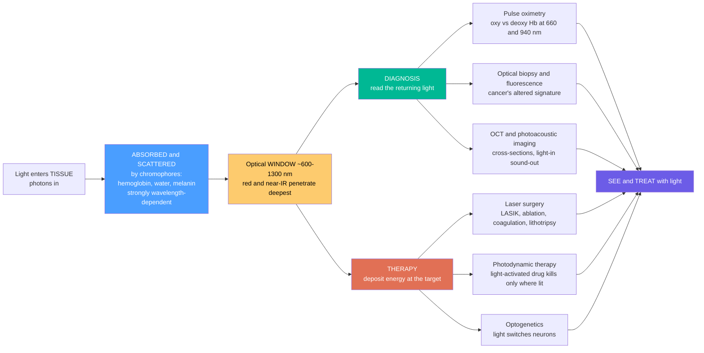

# 🩺 Biophotonics and Optics in Medicine

> [!abstract] TL;DR
> **Biophotonics** is the marriage of light and life — using photons to **diagnose** and **treat** disease. Everything follows from one fact: different tissues and molecules **absorb** and **scatter** light differently, and those interactions are strongly **wavelength-dependent**. Hemoglobin, water, and melanin each have their own absorption signature, and their combined effect opens an **optical window** (~600–1300 nm, red/near-IR) where light penetrates tissue deepest. Read the light that comes *back* and you get **diagnosis**: a **pulse oximeter** reads blood-oxygen from the differential red/IR absorption of oxy- vs deoxy-hemoglobin, **optical biopsy** and **fluorescence imaging** spot cancer's altered signature, and **OCT** takes cross-sections of the retina. Turn the intensity *up* and light becomes a **scalpel**: pick a wavelength the target tissue absorbs and a laser cuts, ablates, or coagulates exactly where you aim — **LASIK**, retinal photocoagulation, tumor ablation, lithotripsy, dermatology. Light can even be the *drug* — **photodynamic therapy** activates a photosensitizer to kill cancer only where illuminated, and **optogenetics** switches individual neurons with light. Gentle, precise, often non-invasive: biophotonics is one of optics' most humane frontiers.

## Intuition

**Analogy — light is medicine's gentlest and most powerful tool: it can SEE inside the body, IDENTIFY disease, and even CUT and HEAL, all with a beam.** Because different tissues and molecules absorb and scatter light differently, shining light on the body and *reading what comes back* reveals what is underneath — that is exactly how a **pulse oximeter** clipped to your finger measures blood oxygen (oxygenated and deoxygenated blood absorb red and infrared light differently), and how an **optical biopsy** spots cancer by its altered light signature. No needle, no incision — just light in, light out.

Now turn the intensity up and the same beam becomes a **scalpel**. A laser tuned to the color that water, blood, or pigment absorbs deposits its energy *exactly* where you aim it — letting surgeons reshape a cornea (LASIK), seal bleeding vessels, shatter kidney stones, or vaporize a tumor with precision, little bleeding, and no blade. And light can be *therapeutic* in a subtler way: **photodynamic therapy** uses a light-activated drug that becomes toxic **only where the light shines**, killing cancer cells and sparing everything in the dark. See with light, identify with light, cut and heal with light — that is biophotonics: turning photons into diagnosis and treatment.

---

## How It Works

The whole field pivots on one hinge — **how a photon interacts with living tissue** — and then splits into two branches that use that interaction in opposite directions.

1. **Light meets tissue.** When a beam enters tissue, two things happen. It is **absorbed** by *chromophores* — hemoglobin (strongly in blue/green, and differently for oxy vs deoxy forms), **water** (strongly in the infrared beyond ~1300 nm), and **melanin** (strongly in UV/blue) — and it is **scattered** by the countless refractive-index boundaries of cells and fibers. Absorption removes photons (turning light into heat, fluorescence, or chemistry); scattering just redirects them.
2. **These interactions define the "optical window."** Below ~600 nm, hemoglobin and melanin absorb heavily and scattering is strong, so light barely penetrates. Beyond ~1300 nm, water absorption climbs steeply. In between — the red / near-infrared **therapeutic window (~600–1300 nm)** — tissue is at its most *transparent*, and light reaches millimeters to centimeters deep. This window is why so much of medical optics lives in the red and near-IR.
3. **Branch A — DIAGNOSIS: read the returning light.** Because each molecule and tissue state has a distinct absorption/scattering/fluorescence signature, the light that comes back is *information*. Measure absorption at two wavelengths → **pulse oximetry** (oxygen saturation). Collect fluorescence or scattered spectra → **optical biopsy** (healthy vs malignant tissue). Time-gate or interfere the returning light → **OCT** cross-sections. Convert absorbed light into ultrasound → **photoacoustic imaging** (light-in, sound-out) for deep, high-contrast pictures.
4. **Branch B — THERAPY: deposit energy where it is absorbed.** Now the goal is the *opposite* of transparency — you *choose a wavelength the target absorbs strongly* so energy dumps precisely there (**selective photothermal absorption**). Water-absorbed wavelengths (Er:YAG 2940 nm, CO₂ 10 600 nm) vaporize thin surface layers for clean cutting; hemoglobin-absorbed green (532 nm) coagulates vessels; UV excimer (193 nm) photo-ablates corneal tissue for **LASIK**. Or add a **photosensitizer** drug and use light merely as a trigger — **photodynamic therapy**. Or use light as a *signal*, not a hammer — **optogenetics** flips light-gated ion channels in neurons.
5. **Same physics, two directions.** Diagnosis exploits the *window* (get light in and out with minimal disturbance); therapy exploits *absorption* (dump energy at a chosen depth and chromophore). Choosing the wavelength is choosing whether — and where — light will pass through, image, or destroy.



---

## Key Concepts

### Secondary Level

- **Light interacts with the body differently depending on its color.** Some colors pass through tissue easily; others are soaked up (absorbed) right at the surface. That single fact is what makes light useful in medicine.
- **Reading light to diagnose — the pulse oximeter.** The clip on your finger shines **red** and **infrared** light through it. Oxygen-rich blood and oxygen-poor blood absorb these two colors by *different* amounts, so by comparing how much of each color gets through, the device calculates your **blood-oxygen level** — no needle needed. This was a bedside lifesaver during COVID.
- **The "window" where light gets deepest.** Blood and skin pigment block blue and green light; water blocks far-infrared. But **red and near-infrared** light (~600–1300 nm) slips through tissue best — this "optical window" is why red light glows through your fingertips.
- **Light as a scalpel.** A strong laser tuned to a color the tissue absorbs can **cut, seal, or vaporize** exactly where it is pointed — reshaping the eye (LASIK), stopping bleeding, removing tattoos, shattering kidney stones — with little bleeding and no blade.
- **Light as a targeted drug.** In **photodynamic therapy**, a patient takes a harmless light-sensitive drug; shining light on a tumor "switches it on" *only there*, killing the cancer while sparing healthy tissue in the dark.

### Undergraduate Level

**Light–tissue interaction is the foundation.** As a beam travels a depth $z$, its intensity falls by absorption and scattering. The absorption coefficient $\mu_a(\lambda)$ is a weighted sum of chromophore contributions — mainly oxy-hemoglobin, deoxy-hemoglobin, water, and melanin — each with its own spectrum:

$$\mu_a(\lambda) = \sum_i c_i\,\varepsilon_i(\lambda)$$

Scattering $\mu_s(\lambda)$ (with anisotropy $g$, giving the *reduced* scattering $\mu_s' = \mu_s(1-g)$) generally *falls* with wavelength. In the diffusion regime the effective attenuation is

$$\mu_{\text{eff}}(\lambda) = \sqrt{3\,\mu_a\,(\mu_a + \mu_s')}, \qquad \delta = \frac{1}{\mu_{\text{eff}}}$$

where $\delta$ is the **penetration depth**. Plotting $\delta$ vs $\lambda$ produces the **therapeutic window**: shallow in the blue (Hb + melanin + scattering), deepest in the red/NIR, shallow again in the IR (water).

**Pulse oximetry — the two-wavelength trick.** Oxy-hemoglobin (HbO₂) and deoxy-hemoglobin (Hb) have *different* absorption spectra that **cross at an isosbestic point near ~800 nm**. In the **red (~660 nm)**, deoxy-Hb absorbs far more than oxy-Hb; in the **near-IR (~940 nm)**, oxy-Hb absorbs slightly more. The oximeter measures the *pulsatile* (arterial) absorption at both wavelengths and forms the ratio

$$R = \frac{(A_\text{AC}/A_\text{DC})_{660}}{(A_\text{AC}/A_\text{DC})_{940}}$$

Using only the *pulsating* component isolates arterial blood from skin, bone, and venous blood. $R$ is a monotonic function of arterial oxygen saturation $\mathrm{SpO_2}$ (empirically calibrated): $R \approx 0.4$ → ~100 %, $R \approx 1.0$ → ~85 %, $R \approx 3.4$ → 0 %.

**Selective photothermolysis** governs therapy. Choose a wavelength (and pulse duration shorter than the target's **thermal relaxation time**) so energy is confined to the intended chromophore — melanin for hair/tattoo removal, oxy-hemoglobin (532 nm) for vascular lesions, water (2940 / 10 600 nm) for tissue ablation. Match the *color* to the *target*, and you spare everything else.

**Diagnostic modalities** built on these principles: **OCT** (low-coherence interferometry for micron-scale cross-sections — routine in ophthalmology), **fluorescence and autofluorescence imaging** and **optical biopsy** (cancer alters tissue fluorescence and scattering), **diffuse optical imaging** (functional brain/breast imaging in the NIR), **photoacoustic imaging** (absorbed pulses launch ultrasound — optical contrast at ultrasound depth), and **flow cytometry** (laser-interrogated cells one at a time).

### Graduate Level

- **Radiative transport, not just Beer–Lambert.** In highly scattering tissue, simple exponential attenuation fails; photon transport is governed by the **radiative transfer equation**, usually solved via the **diffusion approximation** (valid when $\mu_s' \gg \mu_a$) or **Monte Carlo** photon simulation. The diffusion length and the boundary conditions set how deep and how blurred a signal is — the reason deep optical imaging trades resolution for penetration.
- **Chromophore unmixing and quantitative spectroscopy.** Multi-wavelength measurements invert $\mu_a(\lambda)=\sum c_i \varepsilon_i(\lambda)$ to recover concentrations of HbO₂, Hb (hence **total hemoglobin** and **tissue oxygen saturation** $\mathrm{StO_2}$), water, and lipid — the basis of **near-infrared spectroscopy (NIRS)**, **functional NIRS (fNIRS)** brain imaging, and photoacoustic oximetry. Scattering must be modeled (e.g., a power-law $\mu_s' = a\lambda^{-b}$) or it corrupts the fit.
- **Laser–tissue interaction regimes** scale with irradiance and exposure time (the classic Boulnois map): **photochemical** (low power, long time → PDT, biostimulation), **photothermal** (coagulation → vaporization → carbonization as temperature rises), **photoablation** (UV excimer breaking molecular bonds with minimal heat — the mechanism of LASIK), **plasma-induced ablation**, and **photodisruption** (ultrashort pulses creating optical breakdown — femtosecond LASIK flap cutting, posterior capsulotomy). Pulse duration relative to **thermal** and **stress confinement** times decides collateral damage.
- **Photodynamic therapy dosimetry.** Efficacy depends on the triad *photosensitizer concentration × local light fluence × tissue oxygen*. The excited sensitizer transfers energy to ground-state triplet O₂, generating cytotoxic **singlet oxygen** ($^1O_2$); its short diffusion range confines damage to nanometers, but the therapy is **oxygen-limited** — hypoxic tumor cores resist it, and light delivery deep in tissue is bounded by the optical window.
- **OCT physics.** Axial resolution is set by the source **coherence length** $l_c \approx \frac{2\ln 2}{\pi}\frac{\lambda_0^2}{\Delta\lambda}$ — *broader* bandwidth gives *finer* depth resolution (independent of the focusing that sets lateral resolution). **Spectral-domain / swept-source** OCT recovers the full depth profile from one interferometric spectrum by Fourier transform, giving the sensitivity and speed that made OCT a clinical standard.
- **Photoacoustics** couples optical absorption to acoustic detection: an absorbed nanosecond pulse causes thermoelastic expansion and a pressure wave detected by ultrasound transducers — **optical contrast (e.g., hemoglobin) at ultrasonic resolution and depth**, escaping the optical diffusion limit.
- **Optogenetics** (a research revolution, Deisseroth et al.) expresses light-gated ion channels (**channelrhodopsin**, halorhodopsin) in specific neurons, so **blue/yellow light pulses** can excite or silence defined cells on millisecond timescales — turning light into a precise control signal for the nervous system, with fiber-optic and micro-LED delivery deep in the brain.

---

## Python Demo

```python
# Optics in medicine, three panels:
#   (a) HEMOGLOBIN ABSORPTION: molar extinction of oxy- vs deoxy-hemoglobin vs
#       wavelength -> the physical basis of PULSE OXIMETRY (red 660 & IR 940 nm),
#       with the isosbestic crossing near ~800 nm.
#   (b) PULSE-OXIMETER PRINCIPLE: the two-wavelength ratio R is a monotonic
#       function of arterial oxygen saturation SpO2 -> the calibration idea.
#   (c) OPTICAL / THERAPEUTIC WINDOW: tissue penetration depth vs wavelength,
#       showing where lasers reach deep vs are absorbed at the surface.
# Requires only numpy + matplotlib.  Extinction values are representative.

import numpy as np
import matplotlib.pyplot as plt

# ------------------------------------------------------------------ (a) Hb spectra
# Representative molar extinction (cm^-1 / M) at anchor wavelengths (Prahl-style).
wl_anchor = np.array([600, 640, 660, 700, 760, 800, 840, 900, 940, 980, 1000])
eps_HbO2  = np.array([3200, 610, 320,  290,  586,  816, 1022, 1198, 1214, 1225, 1100])
eps_Hb    = np.array([14677,4884,3227, 1794, 1548, 816,  692,  704,  693,  710,  740])

wl = np.linspace(600, 1000, 800)
HbO2 = np.interp(wl, wl_anchor, eps_HbO2)   # smooth curves for plotting
Hb   = np.interp(wl, wl_anchor, eps_Hb)

# ------------------------------------------------------------------ (b) oximetry
# Effective tissue absorption at each wavelength is a blend of oxy/deoxy Hb.
e660_O, e660_D = 320.0,  3227.0     # extinction at 660 nm (red)
e940_O, e940_D = 1214.0, 693.0      # extinction at 940 nm (near-IR)
SpO2 = np.linspace(0.50, 1.00, 200)             # oxygen saturation fraction
mu660 = SpO2 * e660_O + (1 - SpO2) * e660_D     # red absorption
mu940 = SpO2 * e940_O + (1 - SpO2) * e940_D     # IR  absorption
R = mu660 / mu940                                # the pulse-oximeter ratio

# ------------------------------------------------------------------ (c) window
wl2 = np.linspace(400, 1600, 1400)               # nm
# absorption (cm^-1), illustrative sum of chromophores
mu_a_blood = 4.0 * np.exp(-(wl2 - 400) / 65.0)                     # Hb: strong in blue
mu_a_water = 0.002 * np.exp((wl2 - 700) / 180.0) \
             + 25.0 * np.exp(-0.5 * ((wl2 - 1450) / 60.0) ** 2)    # water: strong in IR
mu_a = 0.02 + mu_a_blood + mu_a_water
mu_s = 20.0 * (wl2 / 500.0) ** (-1.2)                              # reduced scattering
mu_eff = np.sqrt(3.0 * mu_a * (mu_a + mu_s))                       # diffusion approx
penetration_mm = 10.0 / mu_eff                                    # 1/mu_eff, cm -> mm

fig, ax = plt.subplots(1, 3, figsize=(18, 5.4))

# --- (a) hemoglobin absorption ---
ax[0].plot(wl, HbO2, color="crimson", lw=2, label="HbO2 (oxygenated)")
ax[0].plot(wl, Hb,   color="navy",    lw=2, label="Hb (deoxygenated)")
for x, c in [(660, "red"), (940, "darkred")]:
    ax[0].axvline(x, color=c, ls="--", lw=1.2)
    ax[0].annotate(f"{x} nm", (x, 3600), color=c, fontsize=9, ha="center")
ax[0].axvline(800, color="grey", ls=":", lw=1.0)
ax[0].annotate("isosbestic ~800 nm", (800, 2000), color="grey",
               fontsize=8, rotation=90, va="center")
ax[0].set_yscale("log")
ax[0].set_xlabel("wavelength  [nm]")
ax[0].set_ylabel("molar extinction  [cm^-1 / M]  (log)")
ax[0].set_title("(a) Hemoglobin absorption:\nbasis of pulse oximetry")
ax[0].legend(fontsize=9)
ax[0].grid(True, which="both", alpha=0.25)

# --- (b) pulse-oximeter calibration curve ---
ax[1].plot(SpO2 * 100, R, color="teal", lw=2.5)
for s in (1.00, 0.90, 0.85, 0.70):
    r = (s*e660_O+(1-s)*e660_D) / (s*e940_O+(1-s)*e940_D)
    ax[1].scatter(s*100, r, s=60, color="crimson", zorder=5)
    ax[1].annotate(f"SpO2={s*100:.0f}%\nR={r:.2f}", (s*100, r),
                   textcoords="offset points", xytext=(-8, 8), fontsize=8)
ax[1].set_xlabel("arterial oxygen saturation  SpO2  [percent]")
ax[1].set_ylabel("red/IR absorption ratio  R")
ax[1].set_title("(b) Pulse-oximeter principle:\nR falls as SpO2 rises")
ax[1].invert_xaxis()
ax[1].grid(True, alpha=0.25)

# --- (c) optical / therapeutic window ---
ax[2].plot(wl2, penetration_mm, color="darkgreen", lw=2)
ax[2].axvspan(600, 1300, color="lightgreen", alpha=0.30,
              label="optical window ~600-1300 nm")
for x, name, col in [(532, "532 nm KTP\n(vessels)", "green"),
                     (800, "800 nm diode", "firebrick"),
                     (1064, "1064 nm Nd:YAG", "purple")]:
    ax[2].axvline(x, color=col, ls="--", lw=1.1)
    ax[2].annotate(name, (x, 0.5), color=col, fontsize=8,
                   rotation=90, va="bottom", ha="right")
ax[2].set_yscale("log")
ax[2].set_xlabel("wavelength  [nm]")
ax[2].set_ylabel("penetration depth  [mm]  (log)")
ax[2].set_title("(c) Optical window:\nred/NIR reaches deepest")
ax[2].legend(fontsize=8, loc="upper right")
ax[2].grid(True, which="both", alpha=0.25)

plt.tight_layout()
plt.savefig("biophotonics_medicine.png", dpi=120)
plt.show()

# ---------------- numerical readouts ----------------
for s in (1.00, 0.90, 0.70):
    r = (s*e660_O+(1-s)*e660_D) / (s*e940_O+(1-s)*e940_D)
    print(f"SpO2 = {s*100:5.1f}%  ->  red/IR ratio R = {r:.3f}")
peak = wl2[np.argmax(penetration_mm)]
print(f"Deepest penetration near {peak:.0f} nm  "
      f"(max ~{penetration_mm.max():.1f} mm) -- the therapeutic window")
# -> R rises from ~0.26 (100% oxygenated) toward ~1.1 (70%): the calibration slope.
# -> Penetration peaks in the red/NIR (~700-1000 nm); it collapses in the blue
#    (blood+scattering) and again past ~1300 nm (water) -- the optical window.
```

Panel **(a)** is the physical heart of the pulse oximeter: oxy- and deoxy-hemoglobin have clearly *different* absorption spectra that **cross near 800 nm** (the isosbestic point). At **660 nm** deoxy-Hb absorbs almost ten times more than oxy-Hb, while at **940 nm** the order flips — so a *pair* of wavelengths is enough to disentangle the two. Panel **(b)** turns that into the measurement: the red/IR ratio $R$ is a smooth, monotonic function of $\mathrm{SpO_2}$, rising from ~0.26 at 100 % saturation toward ~1.1 at 70 % — the calibration curve baked into every finger clip. Panel **(c)** is the **optical (therapeutic) window**: penetration depth collapses in the blue (hemoglobin, melanin, and heavy scattering) and again beyond ~1300 nm (water), peaking in the red/near-IR — the reason diagnostic light and deep-acting lasers cluster there, while water- or pigment-absorbed wavelengths (Er:YAG 2940 nm, CO₂ 10 600 nm — off the right edge) are ideal *surface* scalpels precisely because they *do not* penetrate.

---

## Real-World Applications

> **Pulse oximetry — the ubiquitous bedside sensor.** The finger clip in every hospital, ambulance, and home reads blood-oxygen saturation non-invasively and continuously from the differential red/IR absorption of oxy- vs deoxy-hemoglobin. Cheap, painless, and instant, it became a frontline triage and monitoring tool during the COVID-19 pandemic and is arguably biophotonics' most widespread success.

> **Optical Coherence Tomography (OCT) — routine tissue cross-sections.** OCT gives micron-resolution, cross-sectional "optical ultrasound" of tissue using low-coherence interferometry in the near-IR window. It is *standard of care* in ophthalmology (retinal layers, glaucoma, macular degeneration) and increasingly used in intravascular imaging (coronary plaques) and dermatology. (Covered in depth in the sibling note *Optical_Sensing_LIDAR_and_Optical_Coherence_Tomography*.)

> **Laser surgery — cutting and healing with light.** Choosing a wavelength the target tissue absorbs turns a laser into a precise, low-bleeding scalpel: **excimer (193 nm)** photo-ablation reshapes the cornea in **LASIK**; **frequency-doubled Nd:YAG (532 nm)** coagulates retinal and vascular lesions; **Ho:YAG / Nd:YAG** perform **lithotripsy** (shattering kidney stones) and tumor ablation; **CO₂ and Er:YAG** vaporize thin tissue layers in dermatology, aesthetics, and dentistry. (The wavelength-per-job logic is detailed in the sibling note *Types_of_Lasers*.)

> **Fluorescence-guided surgery and optical biopsy — seeing cancer.** Fluorescent probes (e.g., 5-ALA-induced protoporphyrin, indocyanine green) or tissue autofluorescence light up tumor margins in real time during surgery, while spectroscopic **optical biopsy** distinguishes malignant from healthy tissue by its altered absorption, scattering, and fluorescence — a needle-free complement to histology. (Cellular-scale imaging is covered in the sibling note *Optical_Imaging_and_Microscopy*, and tissue diagnostic spectroscopy in *Spectroscopy_and_Optical_Analysis*.)

> **Photodynamic therapy (PDT) — light-triggered, targeted treatment.** A systemic or topical **photosensitizer** is inert until illuminated; light of the right wavelength generates cytotoxic singlet oxygen that kills tumor or diseased cells *only where the beam falls* — used for skin cancers, esophageal and lung tumors, and age-related macular degeneration, with minimal systemic toxicity.

> **Photobiomodulation and optogenetics.** Low-level red/NIR light therapy is used for wound healing and pain, while **optogenetics** — light-controlled neurons via channelrhodopsin — has transformed neuroscience research, letting scientists switch defined brain circuits on and off with millisecond light pulses delivered through optical fibers. **Fiber-optic endoscopes** thread light and imaging deep inside the body for minimally invasive diagnosis and laser delivery. (Related manipulation of cells with focused light is covered in the sibling note *Optical_Trapping_and_Manipulation*.)

---

## Common Pitfalls

- **Assuming light travels through tissue in a straight line.** Tissue is a *strong scatterer*, not a clear medium — most photons are redirected many times before absorption. Beyond a few hundred microns, simple Beer–Lambert attenuation fails and you must use diffusion or Monte Carlo transport; this is why deep optical imaging is inherently blurry and depth-limited.
- **Trusting pulse oximetry blindly.** It reports *saturation*, not oxygen *content* or *delivery*: it can read a comfortable 98 % in profound anemia or in **carbon monoxide poisoning** (carboxyhemoglobin masquerades as oxy-Hb), and it fails with poor perfusion, motion, nail polish, or intravenous dyes. Skin pigmentation can bias standard two-wavelength devices — a documented equity concern. It measures the *pulsatile* signal, so it needs a pulse.
- **Ignoring the isosbestic point.** Near ~800 nm oxy- and deoxy-Hb absorb *equally*, so a device operating there is blind to saturation. Oximeters deliberately straddle this point (660 vs 940 nm) precisely to maximize the difference; picking wavelengths too close to 800 nm destroys sensitivity.
- **Choosing the wrong wavelength for therapy.** Coupling to the *target* tissue is everything. Green 532 nm is absorbed by hemoglobin (great for vessels, useless for clear cornea); CO₂ 10 600 nm is devoured by water (great surface scalpel, no depth); NIR passes deep (good for reaching subsurface targets, poor for thin ablation). The wrong color either does nothing or damages the wrong layer.
- **Neglecting thermal confinement in laser surgery.** Selective photothermolysis works only if the pulse is *shorter* than the target's thermal relaxation time; too long, and heat diffuses into surrounding tissue causing scarring and collateral damage. Power alone is not the knob — pulse duration and repetition rate matter as much.
- **Forgetting PDT is oxygen-limited.** No local oxygen, no singlet oxygen, no effect — hypoxic tumor cores resist PDT, and rapid illumination can *deplete* tissue oxygen faster than it is replenished. Dosimetry must balance photosensitizer, light fluence, *and* oxygenation, and light delivery is bounded by the optical window.
- **Underestimating laser safety in medicine.** Invisible IR surgical and aiming beams give no blink reflex; stray reflections from instruments can injure the eye at a distance. Medical laser use demands wavelength-specific eyewear, controlled areas, and hazard-class discipline.

---

## Related Concepts

**Within this vault (Optics and Photonics):**

- [[Optics_and_Photonics_Overview]] — the parent map of the field; this note is the biomedical application of the whole toolkit, using light–matter interaction, lasers, imaging, and spectroscopy to see and treat inside the body.

**Physics foundations (why tissue absorbs certain colors):**

- [[Atomic_Models_and_Spectroscopy]] — the quantized energy levels that make absorption *wavelength-selective*; the same physics that gives hemoglobin, water, and melanin their distinct signatures underlies every diagnostic and therapeutic wavelength choice here.

**Health and medicine (the clinical destination):**

- [[Biomarkers_and_Measuring_Health]] — pulse oximetry, optical biopsy, and NIRS are non-invasive *optical biomarkers*; this note supplies the light-based instruments behind bedside and wearable health measurement.

**Neuroscience (light to image and control the brain):**

- [[Neuroimaging_Methods]] — functional near-infrared spectroscopy (fNIRS) and diffuse optical imaging are the biophotonic members of the neuroimaging family, exploiting the same hemoglobin-absorption contrast as pulse oximetry.
- [[Visual_System_and_Visual_Cortex]] — OCT of the retina and laser retinal photocoagulation act directly on the eye's optics and photoreceptors that this note's imaging and surgical tools target and treat.

**Biology (the tissue and cells light interrogates):**

- [[The_Cell_Theory_and_Cell_Types]] — optical microscopy, fluorescence imaging, and flow cytometry read cells one at a time; the cell structures described here are exactly what biophotonic imaging resolves and what PDT and lasers act upon.

*Sibling notes in this section and vault (prose-referenced above): Optical_Sensing_LIDAR_and_Optical_Coherence_Tomography (OCT depth imaging), Optical_Imaging_and_Microscopy (cellular and fluorescence imaging), Spectroscopy_and_Optical_Analysis (tissue diagnostic spectroscopy and the absorption/Beer–Lambert basis of oximetry), Types_of_Lasers (the wavelength-per-procedure logic of surgical lasers), and Optical_Trapping_and_Manipulation (focused light acting on cells).*

---

## Review Questions

1. **(Secondary)** A pulse oximeter clipped to your finger shines *two* colors of light — red and infrared — through it, not just one. Explain in plain terms why *two* colors are needed to measure blood-oxygen level, and why red light can glow through your fingertip while blue light cannot.
2. **(Undergraduate)** (a) Using the idea of the "optical window," explain why diagnostic tools like OCT and near-infrared spectroscopy operate around 700–1000 nm, while a CO₂ surgical laser (10 600 nm) and an excimer laser (193 nm) are used as precise *surface* scalpels. (b) An oximeter measures a red/IR absorption ratio of about $R \approx 1$. Using the fact that deoxy-Hb dominates absorption at 660 nm and the two forms are comparable at 940 nm, is the patient's saturation closer to 100 % or 85 %, and why? (c) Why must the device use only the *pulsatile* part of the signal?
3. **(Graduate)** You are designing a treatment for a solid tumor 8 mm below the skin. Compare **laser thermal ablation** and **photodynamic therapy** for this case: discuss how the optical window and scattering limit light delivery at depth, how selective photothermolysis (wavelength and pulse duration vs thermal relaxation time) constrains the laser option, and how photosensitizer concentration, local fluence, and **tissue oxygenation** jointly limit PDT. Which physical constraint is most likely to make either approach fail at 8 mm, and how would you mitigate it?

---

## Sources

- Prasad, P. N. — *Introduction to Biophotonics* (Wiley) — comprehensive foundation of light–tissue interaction, diagnostics, and therapy.
- Boas, D. A., Pitris, C. & Ramanujam, N. (eds.) — *Handbook of Biomedical Optics* (CRC Press) — authoritative reference on tissue optics, imaging, and spectroscopy.
- Niemz, M. H. — *Laser–Tissue Interactions: Fundamentals and Applications*, 4th ed. (Springer) — the interaction regimes behind laser surgery, ablation, and PDT.
- Vo-Dinh, T. (ed.) — *Biomedical Photonics Handbook*, 2nd ed. (CRC Press) — broad survey of clinical and research biophotonics.
- Wang, L. V. & Wu, H. — *Biomedical Optics: Principles and Imaging* (Wiley) — photon transport, diffusion theory, OCT, and photoacoustic imaging.

---

#optics #biophotonics #pulse-oximetry #laser-surgery #medical-imaging
