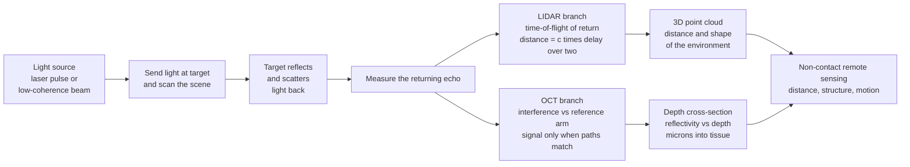

# 🛰️ Optical Sensing, LIDAR, and Optical Coherence Tomography

> [!abstract] TL;DR
> Optical sensing turns light into a **non-contact tape measure**. Fire a laser pulse at something and time how long the echo takes to come back — since light's speed $c$ is known, the round-trip delay gives distance, $d = c\,\Delta t/2$. Do this millions of times a second while scanning, and you build a 3D **point cloud** of everything around you: that is **LIDAR**, the spinning eye of self-driving cars and the tool that maps forests, cities, and ruins hidden under jungle canopy. Push the same echo idea to microscopic scales using light's **wave** nature and you get **OCT (optical coherence tomography)** — a low-coherence interferometer that sees **microns** below a surface, painting cross-sections of living tissue, so your eye doctor can now image the layers of your retina in seconds, non-invasively (a "light ultrasound"). One family of ideas — measure distance and internal structure by the way light returns — spans autonomous driving, Earth mapping, and modern medical imaging.

---

## Intuition

**Analogy:** Light can be a **tape measure, a radar, and a probe** all at once — sensing the world without ever touching it. The simplest version: bounce a laser pulse off a wall and time how long the echo takes to return. Light travels about 30 cm every nanosecond, at a speed we know to nine digits, so the stopwatch reading *is* a distance measurement. Sweep the beam across a scene, take a range reading in every direction, and the collection of returns becomes a precise 3D map — a **point cloud** — of the room, the road, or an entire landscape.

Now shrink the ruler. Instead of a wall metres away, aim at the layers *inside* your eye, microns apart. A stopwatch can never resolve picosecond echoes from structures that close — but light's **wave** nature can. Split a beam into a reference path and a sample path; they only produce visible interference fringes when the two path lengths match to within a hair's breadth (the **coherence length**). Scan the reference and the fringes light up exactly at the depth of each reflecting layer — you have read off internal structure micron by micron. That is **OCT**, and it is why an optometrist can photograph the cross-section of your retina, painlessly, in seconds. From the self-driving car "seeing" the road in 3D to the clinic imaging living tissue, optical sensing is photonics turned into a remote, precise measuring instrument.

---

## How It Works

### Core Mechanics

1. **Send light at the target.** A source emits either a short **laser pulse** (pulsed time-of-flight), a frequency-modulated continuous wave (FMCW), or a broadband **low-coherence** beam (OCT). Coherence, power, and pulse width are chosen for the job.
2. **Light reflects or scatters back.** The target returns a small fraction of the light — a specular reflection from a hard surface (LIDAR) or diffuse backscatter from each internal interface (OCT). What comes back carries the target's *distance* encoded in **delay** and its *velocity* encoded in **Doppler** frequency shift.
3. **Measure the echo.** LIDAR clocks the round-trip **time-of-flight**: $d = c\,\Delta t / 2$ (the factor 2 because the light travels there *and* back). FMCW LIDAR instead measures a **beat frequency** between the returned and outgoing chirps, giving range *and* radial velocity at once. OCT measures **interference**: the sample return beats against a reference arm, and a signal appears only when their path lengths match to within the coherence length.
4. **Scan to build structure.** Steering the beam — spinning mirror, MEMS micro-mirror, or solid-state **optical phased array** — sweeps the single-point range measurement into a full picture: a 3D **point cloud** (LIDAR) or a depth reflectivity profile (an OCT **A-scan**) stacked laterally into a cross-sectional **B-scan**.
5. **Resolution comes from the source.** LIDAR **range resolution** is set by the pulse width or modulation bandwidth ($\Delta z \approx c\,\tau/2$): shorter pulses resolve closer-spaced targets. OCT **axial resolution** is set by the *optical bandwidth* of the source ($\Delta z \approx 0.44\,\lambda^2/\Delta\lambda$): broader spectrum, shorter coherence length, finer depth slices — micrometres.

### Flow / Architecture



---

## Key Concepts

### Secondary — the working picture
- **Echo timing is distance.** Light's speed is fixed and known, so timing the return of a pulse *is* measuring how far away something is. Halve the round-trip time and multiply by $c$.
- **LIDAR is optical radar.** Same idea as radar or a bat's sonar, but with laser light instead of radio or sound — so it is far more precise and can draw a fine-grained 3D picture.
- **A point cloud is a 3D dot-map.** Every direction the laser looks gives one distance; millions of these dots together outline the road, the building, or the forest in three dimensions.
- **OCT is a "light ultrasound".** Ultrasound uses sound echoes to see inside the body; OCT uses light echoes to see the first millimetre of tissue in far finer, micron detail — perfect for the transparent eye.
- **Non-contact and fast.** Nothing touches the target and nothing is injected; a car maps its surroundings, or a clinic images a retina, in a fraction of a second.

### Undergraduate — the quantitative sensor
- **Time-of-flight ranging.** $d = c\,\Delta t/2$. Timing to 1 ns gives $\approx 15$ cm; picosecond electronics reach millimetres. Precision is ultimately limited by timing jitter and photon shot noise, so returns are averaged over many pulses.
- **Range resolution.** Two targets are separable only if their echoes do not overlap: $\Delta z \approx c\,\tau/2$ for a pulse of width $\tau$, or $\Delta z = c/(2B)$ for modulation bandwidth $B$. A 1 ns pulse resolves $\sim 15$ cm; a 1 GHz chirp resolves $\sim 15$ cm as well — resolution follows bandwidth.
- **FMCW and Doppler.** A linear frequency chirp reflected from a moving target returns shifted in both delay and frequency; mixing recovers a **beat** whose value gives range and whose Doppler component gives radial **velocity** — coherent LIDAR measures both simultaneously and rejects interfering sunlight.
- **The LIDAR link budget.** Returned power falls with range: $P_r \propto P_t\,\rho\,A/R^2$ for a diffuse (Lambertian) target of reflectivity $\rho$, aperture $A$. Long range therefore needs more transmit power, bigger apertures, or single-photon (SPAD) detectors.
- **OCT as low-coherence interferometry.** Backscatter from the sample interferes with a reference beam; fringe contrast survives only within the **coherence length** $\ell_c = \lambda^2/\Delta\lambda$. Axial resolution (round trip) is $\Delta z \approx 0.44\,\lambda^2/\Delta\lambda$ — *independent of the focusing optics*, unlike lateral resolution which follows the numerical aperture.
- **Scanning geometry.** An **A-scan** is reflectivity vs depth at one point; sweeping the beam laterally stacks A-scans into a 2D **B-scan** cross-section, and a raster of B-scans forms a 3D volume.

### Graduate — the design and frontier layer
- **Time-domain vs Fourier-domain OCT.** Time-domain OCT mechanically scans the reference mirror (slow). **Fourier-domain OCT** — spectral-domain (a spectrometer + line camera) or **swept-source** (a rapidly tunable laser) — captures the whole depth profile in one shot by Fourier-transforming the interference spectrum, a $\sim$100–1000$\times$ sensitivity and speed gain that made clinical OCT routine.
- **Sensitivity advantage.** Fourier-domain OCT integrates all depths simultaneously, giving a signal-to-noise gain proportional to the number of resolved depth points — the theoretical basis (Leitgeb, de Boer, Choma, 2003) behind modern MHz A-scan rates.
- **Coherent (FMCW) vs direct-detection LIDAR.** Direct detection times the pulse envelope; **coherent** LIDAR beats the return against a local oscillator, reaching near shot-noise-limited sensitivity, immunity to ambient light and cross-talk, and simultaneous velocity — the architecture behind many "next-gen" automotive chips.
- **Beam steering roadmap.** Spinning polygon and mechanical scanners give wide field but are bulky; **MEMS micro-mirrors** shrink them; **optical phased arrays** and focal-plane switch arrays promise fully **solid-state chip LIDAR** with no moving parts, steered purely by phase — the cost/reliability holy grail.
- **Flash vs scanning.** Flash LIDAR floods the scene and reads a 2D SPAD/APD array (no scanning, full frame, shorter range); scanning concentrates power per point (longer range, sequential). The trade mirrors global-shutter vs rolling-shutter imaging.
- **Resolution decoupling in OCT.** Axial resolution depends only on source bandwidth; lateral resolution on the objective's NA and the confocal beam waist — so one can have micron depth slices with modest lateral optics, the reason OCT excels at *layered* tissue.
- **Multipath, MPI, and speckle.** LIDAR suffers multi-path and retro-reflector blooming; OCT battles **speckle** from coherent scattering and **multiple scattering** that limits penetration to $\sim$1–2 mm in tissue — mitigated by angular/frequency compounding and, increasingly, learned denoising.

---

## Python Demo

```python
# Optical sensing, two experiments:
#  (a) LIDAR TIME-OF-FLIGHT + RANGE RESOLUTION + POINT CLOUD:
#      - distance = c * t / 2 from the echo delay
#      - range resolution ~ c * tau / 2 set by the pulse width
#      - a scanning LIDAR ray-casts a simple 2D scene into a point cloud
#  (b) OCT DEPTH SCAN (A-scan):
#      - a low-coherence interferometer: fringes appear only where the
#        reference and sample path lengths match to within the coherence
#        length -> reflectivity vs DEPTH, with micron axial resolution
#        set by the source optical bandwidth (broad band = sharp layers)
# numpy + matplotlib only, self-contained (no scipy).

import numpy as np
import matplotlib.pyplot as plt

c = 2.99792458e8          # speed of light, m/s

# =================================================================
# (a1) TIME-OF-FLIGHT: a transmitted pulse and its delayed echo
# =================================================================
tau = 1.0e-9                          # pulse width, 1 ns
t = np.linspace(0, 260e-9, 6000)      # time axis, s
def pulse(t0):                        # Gaussian pulse centred at t0
    return np.exp(-((t - t0) / tau) ** 2)

d_target = 30.0                       # true target range, m
t_echo = 2 * d_target / c             # round-trip delay
tx = pulse(2e-9)                      # outgoing pulse near t=0
rx = 0.35 * pulse(2e-9 + t_echo)      # attenuated echo
d_measured = c * t_echo / 2           # recover range from the delay

# =================================================================
# (a2) RANGE RESOLUTION: two targets, resolved vs merged echoes
# =================================================================
dz_res = c * tau / 2                  # theoretical range resolution
tt = np.linspace(0, 12e-9, 4000)
def two_echoes(dR):                   # two targets separated by dR metres
    t1, t2 = 2 * 3.0 / c, 2 * (3.0 + dR) / c
    g = lambda t0: np.exp(-((tt - t0) / tau) ** 2)
    return g(t1) + g(t2)
far  = two_echoes(0.60)               # separation >> dz_res -> two peaks
near = two_echoes(0.08)               # separation << dz_res -> one blob

# =================================================================
# (a3) SCANNING LIDAR -> 2D POINT CLOUD via ray casting
# =================================================================
def ray_segment(o, d, a, b):
    """Distance along ray o+t*d to segment a->b, or inf."""
    e = b - a; w = a - o
    det = e[0] * d[1] - e[1] * d[0]
    if abs(det) < 1e-12:
        return np.inf
    t_hit = (e[0] * w[1] - e[1] * w[0]) / det   # along the ray
    s_hit = (d[0] * w[1] - d[1] * w[0]) / det   # along the segment
    return t_hit if (t_hit >= 0 and 0.0 <= s_hit <= 1.0) else np.inf

def ray_circle(o, d, cen, r):
    """Distance along unit ray to circle, or inf."""
    oc = o - cen
    b = 2 * (oc[0] * d[0] + oc[1] * d[1])
    cc = oc[0] ** 2 + oc[1] ** 2 - r ** 2
    disc = b * b - 4 * cc
    if disc < 0:
        return np.inf
    sq = np.sqrt(disc)
    for t_hit in ((-b - sq) / 2, (-b + sq) / 2):
        if t_hit >= 0:
            return t_hit
    return np.inf

rng = np.random.default_rng(0)
origin = np.array([3.0, 4.0])                       # LIDAR position (m)
# Scene: a 10 x 8 room + one interior wall + one round pillar
walls = [(np.array([0, 0.]), np.array([10, 0.])),
         (np.array([10, 0.]), np.array([10, 8.])),
         (np.array([10, 8.]), np.array([0, 8.])),
         (np.array([0, 8.]), np.array([0, 0.])),
         (np.array([5, 1.]), np.array([5, 3.]))]     # interior wall
pillar_c, pillar_r = np.array([7.0, 5.5]), 1.1

angles = np.linspace(0, 2 * np.pi, 720, endpoint=False)
pts, rngs = [], []
for a in angles:
    d = np.array([np.cos(a), np.sin(a)])
    hits = [ray_segment(origin, d, p, q) for (p, q) in walls]
    hits.append(ray_circle(origin, d, pillar_c, pillar_r))
    R = min(hits)
    if np.isfinite(R):
        R += rng.normal(0, 0.02)                    # 2 cm ranging noise
        pts.append(origin + R * d)
        rngs.append(R)
pts = np.array(pts); rngs = np.array(rngs)

# =================================================================
# (b) OCT A-SCAN: low-coherence interferometry -> reflectivity vs depth
# =================================================================
lam0 = 1300e-9                        # centre wavelength (common OCT band)
k0 = 2 * np.pi / lam0
z = np.linspace(0, 400e-6, 8000)      # depth, metres (0..400 microns)

# A layered sample (retina-like boundaries) with depth attenuation
layer_z = np.array([40, 110, 175, 250, 320]) * 1e-6
layer_r = np.array([1.0, 0.8, 0.9, 0.6, 0.7])
layer_r = layer_r * np.exp(-layer_z / 300e-6)       # deeper -> weaker

def a_scan(d_lambda):
    """Complex low-coherence interferogram; |.| is the demodulated A-scan."""
    dz = 0.44 * lam0 ** 2 / d_lambda                # axial resolution (FWHM)
    w = dz / (2 * np.sqrt(np.log(2)))               # Gaussian sigma
    A = np.zeros_like(z, dtype=complex)
    for zk, rk in zip(layer_z, layer_r):
        env = np.exp(-((z - zk) / w) ** 2)          # coherence envelope
        A += rk * env * np.exp(1j * 2 * k0 * (z - zk))
    return dz, A

dz_broad, A_broad = a_scan(100e-9)    # broad band -> sharp, resolved layers
dz_narrow, A_nrw = a_scan(25e-9)      # narrow band -> broad, merging layers

# =================================================================
# PLOT
# =================================================================
fig, ax = plt.subplots(2, 2, figsize=(14, 9))

# (a1) time-of-flight
ax[0, 0].plot(t * 1e9, tx, lw=1.6, label="transmitted pulse")
ax[0, 0].plot(t * 1e9, rx, lw=1.6, color="crimson", label="received echo")
ax[0, 0].axvline(t_echo * 1e9, color="grey", ls=":")
ax[0, 0].set_title(f"LIDAR time-of-flight: delay {t_echo*1e9:.0f} ns "
                   f"-> range {d_measured:.1f} m")
ax[0, 0].set_xlabel("time (ns)"); ax[0, 0].set_ylabel("amplitude")
ax[0, 0].legend(fontsize=8)

# (a2) range resolution
ax[0, 1].plot(tt * 1e9, far, lw=1.6, label="dR = 0.60 m (resolved)")
ax[0, 1].plot(tt * 1e9, near, lw=1.6, color="darkorange",
              label="dR = 0.08 m (merged)")
ax[0, 1].set_title(f"Range resolution ~ c*tau/2 = {dz_res*100:.0f} cm "
                   f"(tau = {tau*1e9:.0f} ns)")
ax[0, 1].set_xlabel("echo time (ns)"); ax[0, 1].set_ylabel("return")
ax[0, 1].legend(fontsize=8)

# (a3) point cloud
sc = ax[1, 0].scatter(pts[:, 0], pts[:, 1], c=rngs, s=8, cmap="viridis")
ax[1, 0].plot(origin[0], origin[1], "r*", ms=14, label="LIDAR")
ax[1, 0].set_title("Scanning LIDAR point cloud (2D range map)")
ax[1, 0].set_xlabel("x (m)"); ax[1, 0].set_ylabel("y (m)")
ax[1, 0].set_aspect("equal"); ax[1, 0].legend(fontsize=8)
fig.colorbar(sc, ax=ax[1, 0], label="range (m)")

# (b) OCT A-scan
ax[1, 1].plot(z * 1e6, np.abs(A_broad), lw=1.8,
              label=f"broad band -> {dz_broad*1e6:.1f} um res")
ax[1, 1].plot(z * 1e6, np.abs(A_nrw), lw=1.4, color="grey", alpha=0.8,
              label=f"narrow band -> {dz_narrow*1e6:.1f} um res")
for zk in layer_z:
    ax[1, 1].axvline(zk * 1e6, color="crimson", ls=":", lw=0.8)
ax[1, 1].set_title("OCT A-scan: reflectivity vs DEPTH (layer echoes)")
ax[1, 1].set_xlabel("depth (microns)"); ax[1, 1].set_ylabel("backscatter |signal|")
ax[1, 1].legend(fontsize=8)

plt.tight_layout()
plt.savefig("optical_sensing_lidar_oct.png", dpi=110)
plt.show()

# ---- console sanity checks ----
print(f"LIDAR: echo delay {t_echo*1e9:.1f} ns -> range = c*t/2 = {d_measured:.2f} m")
print(f"LIDAR: pulse tau = {tau*1e9:.0f} ns -> range resolution = {dz_res*100:.1f} cm")
print(f"OCT  : broad band 100 nm -> axial resolution = {dz_broad*1e6:.1f} microns")
print(f"OCT  : narrow band  25 nm -> axial resolution = {dz_narrow*1e6:.1f} microns")
```

The top row is the LIDAR ranging story: a transmitted pulse and its echo separated by exactly $2d/c$, which inverts to the target range, and a range-resolution panel where two targets farther apart than $c\tau/2$ give two clean echoes while a closer pair **merges into one blob** — resolution is set by pulse width. The bottom-left panel ray-casts a simple room into a **point cloud**, the 2D analogue of what a spinning car LIDAR builds in 3D. The bottom-right panel is the OCT **A-scan**: the demodulated low-coherence interferogram peaks at each layer boundary, and the broad-bandwidth source resolves all five layers with $\sim$7 micron slices while the narrow-band source smears them together — proving axial resolution follows $\lambda^2/\Delta\lambda$, not the lens.

---

## Real-World Applications

- **Autonomous vehicles and robotics.** Spinning and solid-state LIDAR give self-driving cars and delivery robots a dense, direct 3D **point cloud** of the road — obstacles, curbs, and pedestrians measured to centimetres regardless of lighting. The returns feed the perception and mapping stack (see [[Robot_Perception_and_Sensor_Fusion]] and [[Simultaneous_Localization_and_Mapping]]), fused with camera and radar data for redundancy.
- **Ophthalmology — the flagship of OCT.** Spectral-domain and swept-source OCT image the **retina's layers** non-invasively in seconds, making it the most-performed eye scan in the world for diagnosing macular degeneration, diabetic retinopathy, and glaucoma — a routine, painless "light biopsy" (a diagnostic complement to biomarkers, see [[Biomarkers_and_Measuring_Health]]).
- **Aerial and satellite mapping.** Airborne LIDAR builds high-resolution **topographic** and **forest-canopy** models; because a few laser shots penetrate gaps in vegetation, it famously **reveals ancient cities and ruins hidden under jungle** (Maya, Angkor) and maps floodplains, power lines, and coastlines.
- **Drones and aerospace autonomy.** Compact LIDAR provides terrain-relative navigation, obstacle avoidance, and landing guidance for unmanned aircraft and spacecraft descent — a ranging sensor in the guidance loop (see [[Unmanned_Aircraft_and_Autonomy]] and [[Guidance_Navigation_and_Control]]).
- **Cardiology, dermatology, and dentistry.** Intravascular OCT images coronary artery walls and stents at micron scale; OCT also profiles skin lesions and dental structures — anywhere a micron-resolution, millimetre-deep cross-section of tissue is diagnostic.
- **Industrial and fibre-optic sensing.** Laser rangefinders, LIDAR-based volume scanning, Doppler velocimetry (LDV), and time-of-flight depth cameras (the ancestors of gesture/AR sensors), plus **distributed fibre sensors** that read strain and temperature along kilometres of cable for pipelines, bridges, and perimeter security.

---

## Common Pitfalls

- **Forgetting the factor of two.** Time-of-flight measures the *round trip*; distance is $c\,\Delta t/2$, not $c\,\Delta t$. Dropping the 2 doubles every range.
- **Confusing range resolution with range accuracy.** Averaging many pulses can locate a *single* target to sub-millimetre **accuracy**, but two nearby targets are only **resolved** if separated by more than $c\tau/2$ (or $c/2B$). Precision and resolution are different budgets.
- **Assuming OCT axial resolution needs a better lens.** In OCT, axial resolution is set purely by the source **bandwidth** ($\lambda^2/\Delta\lambda$); the objective's NA sets only *lateral* resolution. Buying a sharper lens will not thin your depth slices — a broader-band source will.
- **Ignoring coherence in OCT.** Signal exists only where reference and sample paths match to within the coherence length. A long-coherence (narrowband) laser gives fringes everywhere and *no* depth gating — OCT deliberately needs a **low-coherence** (broadband) source.
- **Over-trusting LIDAR on hard targets.** Retro-reflectors bloom, wet or black surfaces reflect too little, rain/fog/snow scatter the beam, and specular glass returns almost nothing — which is exactly why autonomous stacks **fuse** LIDAR with camera and radar rather than trusting one sensor.
- **Eye-safety and power budget.** Return power falls as $1/R^2$; the temptation is to crank transmit power, but wavelength and exposure are constrained by **eye safety** (a reason 1550 nm and single-photon detection are popular for long range).
- **Speckle and multiple scattering in OCT.** Coherent backscatter produces grainy **speckle**, and multiply-scattered photons blur depth beyond $\sim$1–2 mm in tissue — treating raw OCT as a clean photograph misreads both artefacts.

---

## Related Concepts

Glob-verified cross-vault wikilinks:

- [[Wave_Optics_and_Interference]] — the coherence and interference physics OCT is built on; low-coherence interferometry is exactly the two-beam interference of this note with a *short* coherence length
- [[Laser_Physics_and_Stimulated_Emission]] — the coherent, monochromatic (LIDAR) or broadband (OCT) laser sources that make optical sensing possible
- [[Ultrafast_and_Pulsed_Lasers]] — short pulses set LIDAR range resolution and provide the broad bandwidth for high-resolution OCT
- [[Robot_Perception_and_Sensor_Fusion]] — LIDAR is a primary perception sensor, fused with cameras and radar into a single world model
- [[Simultaneous_Localization_and_Mapping]] — LIDAR point clouds are a workhorse input to SLAM, building maps while localizing the robot
- [[Point_Cloud_Processing]] — the computer-vision pipeline that turns raw LIDAR returns into segmented, classified 3D objects
- [[Depth_Estimation_Deep]] — the learned-vision alternative and complement to LIDAR's direct geometric depth measurement
- [[Unmanned_Aircraft_and_Autonomy]] — LIDAR for drone terrain mapping, obstacle avoidance, and autonomous navigation
- [[Guidance_Navigation_and_Control]] — laser ranging and LIDAR as sensors inside the navigation and landing loop
- [[Biomarkers_and_Measuring_Health]] — OCT as a non-invasive imaging biomarker, complementing molecular and physiological measures of health

Sibling notes in this Optics and Photonics vault (referenced in prose here): *Interferometry_and_Optical_Metrology* (the precision-interferometry foundation OCT specializes), *Spectroscopy_and_Optical_Analysis* (the chemical-composition side of optical sensing, and the spectrometer at the heart of spectral-domain OCT), *Biophotonics_and_Optics_in_Medicine* (the broader medical-optics context of OCT), *Cameras_Sensors_and_Digital_Imaging* (the SPAD/APD detector arrays LIDAR and flash systems read out), and *Photodetectors_and_Optical_Receivers* (the single-detector physics behind every optical-sensing receiver).

---

## Review Questions

1. **(Secondary)** A LIDAR fires a pulse and detects its echo 400 ns later. How far away is the target, and why must you divide the round-trip time by two? If the same LIDAR is used to map a forest, explain in words how a single distance reading in each direction becomes a 3D map.
2. **(Undergraduate)** An OCT system uses a 1300 nm source with a 100 nm bandwidth. Estimate its axial resolution from $\Delta z \approx 0.44\,\lambda^2/\Delta\lambda$. If you swap in a 40 nm source at the same wavelength, does depth resolution get better or worse, and why does the objective lens's numerical aperture *not* enter this calculation?
3. **(Graduate)** You must design a long-range automotive LIDAR that also reports the closing speed of other vehicles and rejects bright sunlight and cross-talk from other cars' LIDARs. Argue for **coherent FMCW** over direct-detection pulsed time-of-flight: address velocity measurement, shot-noise-limited sensitivity, ambient-light immunity, and the cost of the required source coherence and beam-steering (mechanical vs MEMS vs optical phased array).

---

## Sources

- McManamon, P. F. — *Field Guide to Lidar.* SPIE Press — time-of-flight and coherent LIDAR, beam steering, and system link budgets.
- Drexler, W. & Fujimoto, J. G. (eds.) — *Optical Coherence Tomography: Technology and Applications*, 2nd ed. Springer — time-domain, spectral-domain, and swept-source OCT with clinical applications.
- Saleh, B. E. A. & Teich, M. C. — *Fundamentals of Photonics*, 3rd ed. — coherence, interferometry, detection, and the optics underlying both LIDAR and OCT.
- Amann, M.-C., Bosch, T., Lescure, M., Myllylä, R. & Rioux, M. — "Laser ranging: a critical review of usual techniques for distance measurement." *Optical Engineering* 40(1), 2001 — a foundational review of pulsed, phase-shift, and FMCW ranging.

---

#optics #lidar #OCT #optical-sensing #time-of-flight
