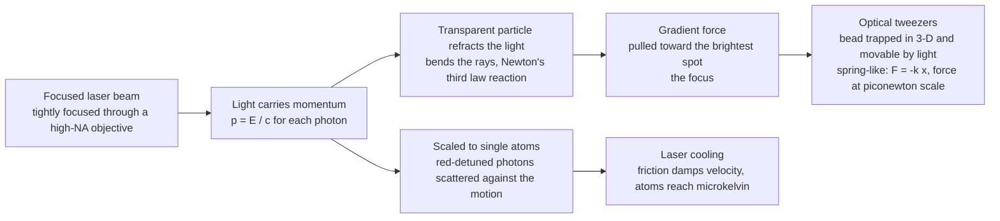

# 🔬 Optical Trapping and Manipulation

> [!abstract] TL;DR
> Light is weightless, yet every photon carries **momentum** ($p = E/c$), so a beam pushes on matter. Focus a laser tightly enough and that momentum becomes a set of invisible fingers: a transparent micron-sized bead refracts the light and, by Newton's third law, is dragged **into the brightest spot** — the focus — and held there in mid-water, gripped by nothing but light. These **optical tweezers** (Arthur Ashkin, Nobel Prize 2018) grab a single living cell, a bacterium, or one molecule of DNA without ever touching it, and the trap behaves like a tiny **spring** whose stiffness converts nanometer displacements into **piconewton** force readouts — enough to weigh the tug of a single motor protein. Scaled down to individual **atoms**, the same photon momentum becomes a refrigerator: an atom flying toward a red-detuned laser preferentially absorbs counter-propagating photons that sap its motion (**Doppler / laser cooling**, Nobel 1997), chilling gases to a **millionth of a degree** above absolute zero — the basis of atomic clocks, Bose–Einstein condensates, and neutral-atom quantum computers.

---

## Intuition

**Analogy — a tractor beam made of light.** Imagine trying to hold a grain of sand suspended in a drop of water without touching it. Sound impossible? Now shine a tightly focused flashlight of unimaginable brightness at it. Light seems weightless — it has no mass — but it is not without *push*. Every photon carries **momentum**, and when you bend that momentum, something has to push back. Focus a laser to a needle-sharp point, drop in a transparent glass bead, and the bead is not blown away as you might expect: it is sucked **into** the brightest spot and pinned there, hovering in space, held by an invisible grip. That is a real-life tractor beam, and it is the everyday reality of an **optical tweezers**.

Why *into* the light rather than away? A transparent bead is a tiny lens. As laser rays pass through it they **bend**, and bending light means changing its momentum. By Newton's third law the bead feels an equal and opposite kick — and when the beam is brightest at the center, the net kick always points **toward the focus**. Pull the bead a little to one side and the imbalance grows, tugging it back like a stretched spring. Push the same idea down to the scale of a single **atom** and light stops being a hand and becomes a brake: an atom rushing toward a laser tuned just below its resonance sees the light Doppler-shifted *onto* resonance, drinks in photons that are all flying the opposite way, and each absorbed photon's momentum nudges the atom to a halt. Do this from every direction and the atom is mired in **optical molasses**, cooled to a whisper above absolute zero. Light does not merely illuminate matter; focused and tuned, it becomes fingers, tweezers, and a refrigerator for the quantum world.

---

## How It Works

### Core Mechanics

1. **Light carries momentum.** A photon of energy $E = h\nu$ carries momentum $p = E/c = h/\lambda$. When matter absorbs, reflects, or refracts light, momentum is exchanged, so **light exerts a force**. Two force families matter for trapping: the **scattering (radiation-pressure) force** that pushes *along* the beam, and the **gradient force** that pulls *toward higher intensity*.
2. **The scattering force pushes forward.** Absorbed or scattered photons transfer their forward momentum to the particle, giving a force $F_{\text{scat}} = \dfrac{n_m P_{\text{scat}}}{c}$ in the propagation direction. On its own this force just blows particles down the beam — it is the enemy that a stable trap must overcome.
3. **The gradient force pulls toward the light.** In a *non-uniform* field, a dielectric particle acts as an induced dipole ($\mathbf{p} = \alpha \mathbf{E}$) and is drawn up the intensity gradient: $\mathbf{F}_{\text{grad}} = \tfrac{1}{2}\alpha \nabla \langle E^2\rangle \propto \nabla I$. A **tightly focused** beam has a steep 3-D intensity peak at the focus, so the gradient force pulls the particle inward from every direction.
4. **A 3-D trap = gradient force beats scattering force.** Stable trapping requires the backward axial component of the gradient force (toward the focus) to exceed the forward scattering force. This demands a *high numerical aperture* objective (steeply converging rays) and a particle whose refractive index exceeds the surrounding medium ($n_p > n_m$). The particle sits **slightly downstream** of the geometric focus, where the two forces balance.
5. **The trap is a spring.** Near the center the restoring force is nearly linear: $F \approx -k\,x$, defining the **trap stiffness** $k$ (typically $0.001$–$1$ pN/nm). The trap is therefore a harmonic potential well $U(x) \approx \tfrac12 k x^2$. Measure the bead's displacement $x$ (to nanometers, via a quadrant photodiode) and you read out force $F = k x$ to **piconewton** precision — a force transducer for single molecules.
6. **Laser cooling — the atomic cousin.** For a free atom there is no bead to refract, but photon momentum still bites. Tune two counter-propagating lasers *below* the atomic resonance (**red detuning**). A moving atom sees the beam it moves *into* Doppler-shifted **up** toward resonance (scatters more) and the beam it moves *away from* shifted **down** (scatters less). The imbalance yields a velocity-opposing force $F \approx -\alpha v$ — a **friction** that damps motion in all three dimensions: **optical molasses**.
7. **From molasses to microkelvin and qubits.** Adding a magnetic quadrupole field makes the force position-dependent too — a **magneto-optical trap (MOT)** that both cools and confines. Further stages (sub-Doppler, evaporative) reach nanokelvin and **Bose–Einstein condensation**. Arrays of tightly focused optical tweezers can each hold a *single* neutral atom, forming the qubit registers of modern neutral-atom quantum computers.

### Flow / Architecture



---

## Key Concepts

### Secondary Level

**Light can push — and even pull.** Light has no mass, but it carries **momentum**, so it can shove things. Sunlight pushes comet tails away from the Sun; a solar sail rides that push through space. This is **radiation pressure**. The surprise is that light can also *pull* a tiny transparent object **toward** the brightest part of a beam.

**Why a bead gets sucked into the focus.** A clear microscopic bead is a little lens. When laser light shines through it, the rays **bend**. Bending light means giving it a sideways momentum kick, and by Newton's law of action–reaction the bead gets kicked the *other* way — always back toward the brightest spot. Focus the laser to a sharp point and the bead is trapped there, floating, held by light alone. This is an **optical tweezers**, and its inventor Arthur Ashkin won the 2018 **Nobel Prize**.

**Holding life without touching it.** Because the grip is made of light, not metal, optical tweezers can hold a **single living cell**, a swimming **bacterium**, or one strand of **DNA** — gently, sterilely, never crushing them. Better still, the trap acts like a soft spring: pull the bead a bit and it pulls back. By watching how far it moves, scientists measure forces as tiny as a single **motor protein** taking a step along a cell's internal railways.

**Cooling atoms with light.** Point lasers at an atom from all sides and tune them *just below* the atom's color. An atom flying toward one laser runs into more photons and gets slowed, like running into a headwind of light. From every direction the atom is braked — **laser cooling** — reaching a temperature a *millionth of a degree* above the coldest possible. This is how the world's most accurate clocks and the coldest matter in the universe are made.

### Undergraduate Level

**Two force regimes.** The physics depends on the particle size relative to the wavelength $\lambda$.
- **Rayleigh regime** ($d \ll \lambda$, e.g. nanoparticles, atoms): treat the particle as a point dipole. The **gradient force** $\mathbf{F}_{\text{grad}} = \tfrac{1}{2}\alpha\,\nabla\langle E^2\rangle$ scales with the intensity gradient and the polarizability $\alpha \propto d^3\!\left(\tfrac{m^2-1}{m^2+2}\right)$, where $m = n_p/n_m$. The **scattering force** $F_{\text{scat}} \propto d^6/\lambda^4$ (Rayleigh scattering) pushes along $\mathbf{k}$.
- **Mie / ray-optics regime** ($d \gg \lambda$, e.g. micron beads): trace rays through the bead. Refraction changes each ray's momentum; the reaction force sums to a net pull toward the focus. Stable 3-D trapping needs the axial gradient force to beat the forward scattering force, which is why a **high-NA** objective (large convergence angle) is essential.

**Trap stiffness and force calibration.** Near equilibrium $U(x) \approx \tfrac12 k_x x^2$, so the bead is a damped harmonic oscillator in a viscous fluid. Stiffness is measured three classic ways:
- **Equipartition:** $\tfrac12 k_x \langle x^2\rangle = \tfrac12 k_B T \Rightarrow k_x = k_B T / \langle x^2\rangle$.
- **Power spectrum:** the thermal position noise is Lorentzian with corner frequency $f_c = k_x /(2\pi\gamma)$, where $\gamma = 6\pi\eta a$ is the Stokes drag on a bead of radius $a$.
- **Drag force:** apply a known Stokes drag and measure the displacement, $k_x = F_{\text{drag}}/x$.
Once $k_x$ is known, **every** subsequent displacement is a calibrated force: $F = k_x x$, routinely resolving $\sim 0.1$–$100$ pN.

**Doppler cooling force.** For a two-level atom in two counter-propagating beams each of saturation $s_0 = I/I_{\text{sat}}$ and detuning $\delta = \omega_L - \omega_0 < 0$, the scattering rate of one beam is
$$R_\pm = \frac{\Gamma}{2}\,\frac{s_0}{1 + s_0 + \left(2(\delta \mp k v)/\Gamma\right)^2},$$
and the net force is $F = \hbar k (R_+ - R_-)$. Expanding for small $v$ gives a **friction force** $F \approx -\alpha v$ with damping coefficient
$$\alpha = -\,\hbar k^2\,\frac{4 s_0\,(2\delta/\Gamma)}{\left(1 + s_0 + (2\delta/\Gamma)^2\right)^2},$$
positive (cooling) only for **red detuning** ($\delta<0$). Maximum photon momentum kick per scatter, $\hbar k$, gives a huge deceleration — for rubidium the scattering force $\hbar k\Gamma/2 \sim 10^{-20}$ N produces accelerations of $\sim 10^4\,g$.

**The Doppler limit.** Cooling fights heating from the *random* recoil of spontaneously emitted photons (a momentum random walk). Balancing friction against this diffusion sets a floor, the **Doppler temperature** $k_B T_D = \hbar\Gamma/2$ (minimized at $\delta = -\Gamma/2$) — about $140\ \mu$K for Rb. Sub-Doppler mechanisms (Sisyphus/polarization-gradient cooling) beat this limit, reaching microkelvin, and evaporative cooling in a trap reaches nanokelvin BEC.

### Graduate Level

**Full electromagnetic force — the Maxwell stress tensor.** The rigorous optical force on any particle is the surface integral of the time-averaged **Maxwell stress tensor** $\langle\mathbf{T}\rangle$ over an enclosing surface, $\mathbf{F} = \oint \langle\mathbf{T}\rangle\cdot d\mathbf{A}$. For a Rayleigh dipole this reduces to $\mathbf{F} = \tfrac14\text{Re}(\alpha)\nabla|E|^2 + \tfrac{\sigma}{c}\langle\mathbf{S}\rangle + \dots$, cleanly separating the **conservative gradient** term (real part of polarizability, the trapping force) from the **dissipative scattering** term (radiation pressure) and a spin-curl term. The imaginary part of $\alpha$ (absorption/scattering) always feeds momentum into the beam direction — the fundamental reason a pure standing gradient can trap but a traveling wave heats.

**Angular momentum: spanners and optical torque.** Light carries **spin angular momentum** ($\pm\hbar$ per photon for circular polarization) and **orbital angular momentum** ($\ell\hbar$ per photon for a Laguerre–Gaussian vortex beam). Transferring these to a birefringent or absorbing particle exerts a **torque**, spinning trapped microrotors — an "optical spanner." OAM beams create **doughnut** traps that confine *low-index* or reflecting particles in the dark center.

**Holographic and structured traps.** A **spatial light modulator (SLM)** imprints a computer-generated hologram on the beam's phase, splitting one laser into **hundreds of independently steerable traps** (holographic optical tweezers). The same technology builds defect-free arrays of single atoms by "rearranging" stochastically loaded tweezers — the assembly step for neutral-atom quantum processors. This ties directly to Fourier/wavefront engineering: the trap pattern is the Fourier transform of the SLM phase.

**Single-molecule biophysics.** The killer application. Tether a DNA molecule between a trapped bead and a surface (or a second trap in a **dual-trap** dumbbell) and you can:
- **Stretch DNA/RNA** and read the entropic-elastic force–extension curve (worm-like-chain), watching the $\sim65$ pN overstretching transition.
- **Watch molecular motors step:** kinesin and myosin move in discrete $\sim8$ nm and $\sim36$ nm steps, with **stall forces** of $\sim5$–7 pN measured directly as $F = k x$; RNA polymerase transcribes against tension one base at a time.
- **Unfold single proteins and nucleic-acid hairpins**, resolving folding intermediates and free-energy landscapes via Jarzynski/Crooks fluctuation theorems.
Force resolution reaches **sub-piconewton** and position resolution **sub-nanometer**, limited by thermal (Brownian) noise, drift, and detection bandwidth.

**Cold-atom frontier.** Beyond the MOT, **far-off-resonant traps (FORTs)** and **optical lattices** (interfering beams forming a periodic gradient-force potential) hold neutral atoms with negligible scattering, enabling **quantum simulation** of Hubbard models. **Optical-tweezer arrays** trap single atoms at programmable sites; Rydberg interactions then entangle them into qubits and quantum simulators — a photonics-to-quantum-computing bridge. Laser-cooled atoms in optical lattice clocks are today's most accurate timekeepers ($\sim 10^{-18}$ fractional uncertainty), underpinning GPS and tests of fundamental physics.

---

## Python Demo

```python
# Optical forces, visualized with numpy + matplotlib:
#   (a) OPTICAL TWEEZERS TRAP  -- gradient (restoring) force vs bead displacement:
#         nearly LINEAR near the focus (an "optical spring", stiffness k),
#         rolling off beyond the beam waist. The harmonic potential well U(x)
#         turns nm displacements into pN force readouts (single-molecule sensing).
#   (b) LASER COOLING  -- net Doppler force vs atom velocity for two counter-
#         propagating red-detuned beams: a FRICTION that damps motion (optical
#         molasses), plus the single-beam RADIATION-PRESSURE (scattering) force.
import numpy as np
import matplotlib.pyplot as plt

# ==================================================================
# (a) OPTICAL TWEEZERS: gradient force + harmonic potential well
#     Gaussian trap potential  U(x) = -U0 * exp(-2 x^2 / w^2)
#     Gradient force  F(x) = -dU/dx = -U0 * (4 x / w^2) * exp(-2 x^2 / w^2)
#     Near x=0:  F ~ -k x  with trap stiffness  k = 4 U0 / w^2.
# ==================================================================
w  = 400.0                      # characteristic trap radius (nm), ~ beam waist
U0 = 3200.0                     # trap depth (pN*nm)   [1 pN*nm = 1e-21 J ~ 240 kT]
k  = 4.0 * U0 / w**2            # trap stiffness -> 0.08 pN/nm

x  = np.linspace(-1200, 1200, 1200)          # bead displacement from focus (nm)
F  = -U0 * (4.0 * x / w**2) * np.exp(-2.0 * x**2 / w**2)   # gradient force (pN)
U  = -U0 * np.exp(-2.0 * x**2 / w**2)         # true Gaussian well (pN*nm)
U_harm = 0.5 * k * x**2 - U0                  # harmonic approx near center

F_lin = -k * x                                # ideal spring (for comparison)

# Example single-molecule force readout: a kinesin motor pulls the bead off-center
x_motor = 60.0                                # measured displacement (nm)
F_motor = k * x_motor                         # inferred force (pN) ~ kinesin stall

# ==================================================================
# (b) LASER COOLING: Doppler force from two counter-propagating beams
#     Scattering rate of one beam:
#         R(det) = (Gamma/2) * s0 / (1 + s0 + (2*det/Gamma)^2)
#     Atom moving at v sees beam(+x): delta - k v ,  beam(-x): delta + k v.
#     Net force  F = hbar*k*(R+ - R-)  ->  friction  F ~ -alpha v near v=0.
# ==================================================================
hbar  = 1.054571e-34
lam   = 780e-9                  # rubidium D2 line (m)
kL    = 2.0 * np.pi / lam       # wavenumber
Gamma = 2.0 * np.pi * 6.07e6    # natural linewidth (rad/s)
s0    = 2.0                     # saturation parameter I/I_sat
delta = -Gamma                  # red detuning by one linewidth (cooling)

v = np.linspace(-12.0, 12.0, 1500)           # atom velocity (m/s)
def scatter_rate(det):
    return (Gamma / 2.0) * s0 / (1.0 + s0 + (2.0 * det / Gamma) ** 2)

F_unit = hbar * kL * Gamma                    # natural force scale (~3e-20 N)
F_plus  =  hbar * kL * scatter_rate(delta - kL * v)   # +x beam pushes +x
F_minus = -hbar * kL * scatter_rate(delta + kL * v)   # -x beam pushes -x
F_net   = (F_plus + F_minus) / F_unit                 # net (in units of hbar k Gamma)
F_press = (hbar * kL * scatter_rate(delta - kL * v)) / F_unit  # single-beam pressure

# ==================================================================
# Plot
# ==================================================================
fig, ax = plt.subplots(2, 2, figsize=(11, 9))

# (a1) gradient (restoring) force vs displacement -- the "optical spring"
ax[0, 0].plot(x, F, lw=2, color="tab:blue", label="gradient force F(x)")
ax[0, 0].plot(x, F_lin, "--", color="grey", label=f"linear spring  k={k:.3f} pN/nm")
ax[0, 0].axhline(0, color="k", lw=0.8); ax[0, 0].axvline(0, color="k", lw=0.8)
ax[0, 0].axvspan(-w/2, w/2, color="gold", alpha=0.15, label="~linear region")
ax[0, 0].set_title("Optical tweezers: restoring force (an optical spring)")
ax[0, 0].set_xlabel("bead displacement from focus  x (nm)")
ax[0, 0].set_ylabel("optical force  F (pN)")
ax[0, 0].legend(fontsize=8); ax[0, 0].grid(alpha=0.3)

# (a2) harmonic potential well + pN force readout
ax[0, 1].plot(x, U, lw=2, color="tab:red", label="true Gaussian well U(x)")
ax[0, 1].plot(x, U_harm, "--", color="grey", label="harmonic approx 0.5 k x^2")
ax[0, 1].plot([x_motor], [-U0 + 0.5*k*x_motor**2], "ko")
ax[0, 1].annotate(f"kinesin pulls bead {x_motor:.0f} nm\n-> F = k x = {F_motor:.1f} pN",
                  xy=(x_motor, -U0 + 0.5*k*x_motor**2),
                  xytext=(250, -1600), fontsize=8,
                  arrowprops=dict(arrowstyle="->"))
ax[0, 1].set_ylim(-U0*1.15, 200)
ax[0, 1].set_title("Harmonic trap well: nm displacement -> pN force")
ax[0, 1].set_xlabel("bead displacement  x (nm)")
ax[0, 1].set_ylabel("potential energy  U (pN*nm)")
ax[0, 1].legend(fontsize=8); ax[0, 1].grid(alpha=0.3)

# (b1) laser cooling: net Doppler force -> friction (optical molasses)
ax[1, 0].plot(v, F_net, lw=2, color="tab:green", label="net two-beam force")
ax[1, 0].plot(v, F_plus / F_unit, ":", color="tab:blue", alpha=0.8, label="+x beam")
ax[1, 0].plot(v, F_minus / F_unit, ":", color="tab:orange", alpha=0.8, label="-x beam")
ax[1, 0].axhline(0, color="k", lw=0.8); ax[1, 0].axvline(0, color="k", lw=0.8)
# friction slope near v = 0
sl = np.gradient(F_net, v)[len(v)//2]
ax[1, 0].plot(v, sl * v, "--", color="crimson", alpha=0.7,
              label="friction  F ~ -alpha v")
ax[1, 0].set_ylim(-0.6, 0.6)
ax[1, 0].set_title("Laser cooling: velocity-damping friction force")
ax[1, 0].set_xlabel("atom velocity  v (m/s)")
ax[1, 0].set_ylabel("force  F / (hbar k Gamma)")
ax[1, 0].legend(fontsize=8); ax[1, 0].grid(alpha=0.3)

# (b2) single-beam radiation-pressure (scattering) force vs velocity
ax[1, 1].plot(v, F_press, lw=2, color="tab:purple", label="scattering force (+x beam)")
v_res = delta / kL                            # resonance shifted onto atom
ax[1, 1].axvline(v_res, ls=":", color="k", alpha=0.6,
                 label=f"resonance at v = delta/k = {v_res:.1f} m/s")
ax[1, 1].set_title("Radiation pressure: single-beam scattering force")
ax[1, 1].set_xlabel("atom velocity  v (m/s)")
ax[1, 1].set_ylabel("force  F / (hbar k Gamma)")
ax[1, 1].legend(fontsize=8); ax[1, 1].grid(alpha=0.3)

plt.tight_layout()
plt.show()

# Numeric sanity checks
print(f"Trap stiffness         k = {k:.3f} pN/nm")
print(f"Force at x = {x_motor:.0f} nm    F = {F_motor:.2f} pN  (~ kinesin stall force)")
print(f"Max scattering force   hbar*k*Gamma/2 = {0.5*F_unit:.2e} N")
a_Rb = 0.5 * F_unit / 1.443e-25               # Rb mass ~ 1.443e-25 kg
print(f"Peak deceleration (Rb) = {a_Rb:.2e} m/s^2  = {a_Rb/9.81:.1e} g")
print(f"Doppler friction slope near v=0: {sl:.3f} (units hbar k Gamma per m/s)")
```

Panel (a1) is the **optical spring**: near the focus the gradient force is almost perfectly linear ($F \approx -kx$, shaded region), so the trap is a Hookean spring of stiffness $k$; beyond the beam waist the force peaks and then *falls off* — the trap has a finite capture range and escape force. Panel (a2) shows the matching **harmonic potential well**, and marks how a $60$ nm displacement caused by a kinesin motor is read out directly as a $\sim5$ pN force — exactly the regime of single-molecule biophysics. Panel (b1) is **laser cooling** made visible: the two red-detuned beams (dotted) individually push outward, but their *difference* is a steep, velocity-opposing **friction** near $v=0$ (dashed line) — the essence of optical molasses. Panel (b2) shows a single beam's **radiation-pressure** (scattering) force, a Lorentzian in velocity peaked where the Doppler shift brings the atom onto resonance.

---

## Real-World Applications

> **Single-molecule biophysics (the Nobel application).** Dual-trap optical tweezers hold a single **DNA** molecule by beads at each end, then stretch it to read its force–extension curve, or let **kinesin** and **myosin** motors walk a bead along a filament while the trap reports each $\sim8$ nm step and the $\sim5$–7 pN stall force. RNA polymerase transcription, ribosome translocation, and protein (un)folding have all been watched **one molecule at a time** — a whole field that optical trapping created, honored by Ashkin's 2018 Nobel Prize.

> **Living-cell and micro-object manipulation.** Because the grip is non-contact and sterile, tweezers sort and position **living cells and bacteria**, hold and orient them for microscopy, measure the mechanical stiffness of a red blood cell, and perform micro-assembly. Holographic tweezers driven by an **SLM** juggle hundreds of particles at once, building 3-D micro-structures and studying colloidal self-assembly and hydrodynamic coupling.

> **Atomic clocks and GPS.** **Laser-cooled** atoms move so slowly that their spectral lines are exquisitely sharp and free of Doppler broadening. Cesium fountain and optical-lattice clocks built on this principle keep time to $\sim 10^{-16}$–$10^{-18}$ — the definition of the second and the timing backbone of **GPS**, telecom synchronization, and financial timestamps. Slow atoms also enable atom interferometers that sense gravity and rotation.

> **Ultracold quantum matter and neutral-atom computers.** Laser cooling to microkelvin, then evaporative cooling to nanokelvin, produces **Bose–Einstein condensates** — matter in a single quantum state. Arrays of optical-tweezer traps each holding **one atom** are rearranged into defect-free lattices and entangled via Rydberg interactions, forming the qubit registers of leading neutral-atom quantum computers and analog quantum simulators.

---

## Common Pitfalls

- **"Radiation pressure does the trapping."** It is the opposite — the forward **scattering/radiation-pressure force** *destabilizes* an optical trap by blowing the particle down the beam. Stable 3-D trapping comes from the **gradient force** overcoming it, which is why a loosely focused beam or a highly absorbing particle cannot be trapped. You need a tight, high-NA focus so the backward axial gradient force wins.
- **"Any focused laser traps any particle."** Trapping needs the particle index to exceed the medium ($n_p > n_m$); low-index or reflecting/absorbing particles are *pushed out* of a bright focus and require a doughnut (dark-center) beam instead. Metallic and strongly absorbing particles heat and are dominated by scattering/photophoretic forces.
- **Forgetting to calibrate the trap.** A raw displacement is meaningless until the **stiffness** $k$ is measured (equipartition, power-spectrum corner frequency, or drag force). $k$ depends on laser power, beam quality, bead size, and index, so it must be recalibrated per condition. Reporting force $F=kx$ with a stale or wrong $k$ is the most common single-molecule error.
- **Thermal (Brownian) noise sets the floor.** A trapped bead jitters by $\langle x^2\rangle = k_B T/k$; smaller stiffness gives more sensitive force reads but noisier position, and vice versa. You cannot beat this thermal limit by averaging faster than the trap's corner frequency — bandwidth and noise trade off directly.
- **"Blue-detuned lasers cool atoms too."** Doppler cooling requires **red detuning** ($\delta<0$); blue detuning ($\delta>0$) gives *anti-damping* (heating). The sign of the friction coefficient $\alpha$ flips with the sign of $\delta$ — a classic exam trap.
- **Assuming cooling has no floor.** Doppler cooling is limited by photon-recoil heating to $T_D = \hbar\Gamma/2k_B$ (hundreds of $\mu$K). Reaching microkelvin and below needs **sub-Doppler** (Sisyphus/polarization-gradient) mechanisms, and BEC needs **evaporative** cooling in a conservative trap where scattering is switched off.
- **Optical power heats samples.** The very intensity that traps can cook a biological sample or induce convection; near-IR wavelengths ($\sim1064$ nm) are chosen precisely because water and cells absorb weakly there. Ignoring local heating corrupts delicate force and rate measurements.

---

## Related Concepts

This is a frontier note in the **Quantum & Frontier Photonics** section (S06), and it deliberately sits between optics, biology, and quantum physics. Its optics siblings supply the machinery it depends on: *Laser_Physics_and_Stimulated_Emission* provides the coherent, single-mode, tunable laser that every trap and cooling scheme requires; *Optical_Imaging_and_Microscopy* supplies the high-NA objective and the very microscope that focuses the trap and images the sample; *Holography_and_Wavefront_Engineering* (with its SLMs) is what turns one beam into hundreds of holographic traps and structured/vortex beams for optical spanners; *Quantum_Optics_and_Photons* recasts the photon momentum and scattering used here at the quantized-field level; and *Biophotonics_and_Optics_in_Medicine* is where the same non-contact light-as-tool philosophy meets the clinic. (Siblings are referenced in prose per house style.)

Cross-vault, Glob-verified notes:

- [[Laser_Cooling_and_Trapping]] — the Physics/AMO companion that goes deeper on Doppler and sub-Doppler cooling, magneto-optical traps, and the road to Bose–Einstein condensation; this note is the photonics-framed, tweezers-first entry point.
- [[Quantum_Optics_and_Cavity_QED]] — photon momentum, absorption, and spontaneous emission as processes of the *quantized* electromagnetic field, the recoil that ultimately sets the Doppler cooling limit.
- [[Newtons_Laws_and_Kinematics]] — momentum ($p=E/c$) and Newton's third law are the whole engine: refraction changes light's momentum, so the particle feels the reaction force.
- [[The_Cytoskeleton_and_Cell_Motility]] — the biology on the other end of the tweezers: kinesin, myosin, and cytoskeletal filaments whose piconewton step forces optical traps were built to measure.
- [[Neutral_Atoms_and_Topological_Qubits]] — optical-tweezer arrays of single laser-cooled neutral atoms are the qubit registers this note's techniques directly enable.
- [[Trapped_Ion_Quantum_Computers]] — the sibling platform where laser cooling immobilizes ions in electromagnetic traps for quantum logic, sharing the photon-momentum cooling physics.

---

## Review Questions

1. **(Secondary)** A transparent bead is dropped into a tightly focused laser beam and, instead of being blown away, it gets pulled *into* the brightest spot and held there. In your own words, using the idea that light carries momentum and that a bead bends light like a lens, explain why the bead is trapped rather than pushed out. Why can this "tractor beam" hold a living cell without harming it?
2. **(Undergraduate)** An optical trap is calibrated to a stiffness $k = 0.05$ pN/nm. (a) A kinesin motor pulls the trapped bead $110$ nm off center before stalling — what force did it exert? (b) Explain two independent ways you could have measured $k$ from the bead's Brownian motion alone. (c) Why does making the trap *stiffer* improve force accuracy but *worsen* position resolution?
3. **(Graduate)** Starting from the two-beam scattering-rate expression, derive the small-velocity friction force $F \approx -\alpha v$ and show that cooling requires red detuning ($\delta<0$). Then explain what physical process prevents cooling below the Doppler limit $T_D = \hbar\Gamma/2k_B$, and outline how a magneto-optical trap adds *spatial* confinement to the *velocity* damping of optical molasses.

---

## Sources

- Ashkin, A. — "Acceleration and Trapping of Particles by Radiation Pressure," *Phys. Rev. Lett.* **24**, 156 (1970); and *Optical Trapping and Manipulation of Neutral Particles Using Lasers* (World Scientific, 2006) — the founding work and Nobel-recognized synthesis.
- Neuman, K. C. & Block, S. M. — "Optical trapping," *Review of Scientific Instruments* **75**, 2787 (2004) — the definitive practical review of tweezer physics, calibration, and single-molecule use.
- Metcalf, H. J. & van der Straten, P. — *Laser Cooling and Trapping* (Springer, 1999) — Doppler and sub-Doppler cooling, MOTs, optical molasses, and the Doppler limit.
- Saleh, B. E. A. & Teich, M. C. — *Fundamentals of Photonics*, 3rd ed. (Wiley) — radiation pressure, gradient forces, and photon momentum in a photonics framework.
- Chu, S. — "The Manipulation of Neutral Particles," Nobel Lecture, *Rev. Mod. Phys.* **70**, 685 (1998) — first-hand account of laser cooling and atom trapping.

---

#optics #optical-tweezers #laser-cooling #radiation-pressure #single-molecule
