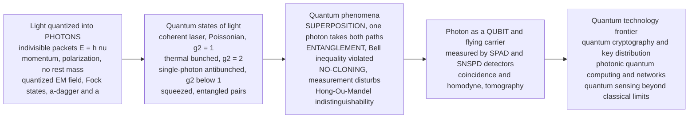

# ⚛️ Quantum Optics and Photons

> [!abstract] TL;DR
> Light is not an infinitely divisible wave — it is **granular**, made of indivisible energy packets called **photons** ($E = h\nu$, momentum $p = h/\lambda$, spin/polarization, no rest mass). **Quantum optics** is the physics of light treated as photons and the strange behavior that follows: the electromagnetic field is quantized into **Fock (number) states** $|n\rangle$ built with creation/annihilation operators $\hat{a}^\dagger, \hat{a}$. Different sources emit different **quantum states of light** — the near-classical **coherent state** of a laser (Poissonian photon statistics, $g^{(2)}(0)=1$), **thermal** light (bunched, super-Poissonian, $g^{(2)}(0)=2$), and genuinely **nonclassical** light: **single-photon** states (antibunched, $g^{(2)}(0)<1$), **squeezed** light (noise pushed below the shot-noise limit in one quadrature — used to boost LIGO), and **entangled photon pairs** from parametric down-conversion. From these follow the deepest quantum phenomena — **superposition** (one photon exploring both arms of an interferometer and interfering with itself), **entanglement** (correlated photons that violate a **Bell inequality**, disproving local hidden variables), the **no-cloning theorem** and measurement disturbance, and **Hong-Ou-Mandel** two-photon interference. These are not curiosities: photons are ideal **flying qubits**, and quantum optics is the enabling science for provably secure **quantum cryptography**, photonic **quantum computing**, quantum networks, and **quantum sensing** beyond classical limits.

## Intuition

**Analogy:** Take a light source and turn it down — dimmer, and dimmer, and dimmer. You might expect the light to fade smoothly into a faint continuous glow, like water pressure easing to a trickle. It does not. Below a certain point the smoothness breaks: a sensitive detector stops reading a steady level and instead starts to **click** — individual, separated events, like the first raindrops of a storm hitting a tin roof one at a time. Each click is one **photon**, an indivisible packet of light. You never catch half a click. Light is ultimately **grainy**.

And at this single-grain level, light behaves in ways that shatter everyday intuition. Send **one** photon toward a fork with two paths and it does not pick a road — it explores **both** at once and then interferes *with itself*, landing only where the two ghostly versions add up. Make **two** photons in the right way and they become **entangled**: measure one and you instantly know something about the other, even if it is on the far side of the galaxy — the correlation Einstein derided as "spooky action at a distance." And you cannot photocopy an unknown photon's state, nor even peek at it without disturbing it. In classical engineering these would be catastrophic bugs. In quantum optics they are **features** we now weaponize: unbreakable **quantum cryptography** (an eavesdropper *must* leave fingerprints), quantum computers that compute with interference, and sensors that see below the noise floor of any classical instrument. Quantum optics is the cleanest playground in all of physics — the arena where the weirdest predictions of quantum mechanics are tested with the least ambiguity, using the humble photon.

---

## How It Works

### Core Mechanics

1. **Light is quantized into photons.** A mode of the electromagnetic field of frequency $\nu$ can only hold energy in integer multiples of $h\nu$: zero photons, one, two, .... A single photon carries energy $E = h\nu = \hbar\omega$, momentum $p = h/\lambda$, an intrinsic angular momentum expressed as **polarization** (or orbital angular momentum), and has **no rest mass**. You cannot have 1.5 photons in a mode — the granularity is exact and is the reason a dim source clicks rather than dims smoothly.
2. **The field is a set of quantum oscillators.** Each mode is mathematically a **quantum harmonic oscillator**. Its energy ladder is the **Fock (number) state** $|n\rangle$, and photons are added or removed by the **creation/annihilation** operators, $\hat{a}^\dagger|n\rangle=\sqrt{n+1}\,|n+1\rangle$ and $\hat{a}|n\rangle=\sqrt{n}\,|n-1\rangle$. Even the **vacuum** $|0\rangle$ is not truly empty — it retains zero-point energy $\tfrac12\hbar\omega$ and **vacuum fluctuations** that seed spontaneous emission and set the ultimate noise floor of optical measurement.
3. **Sources emit different quantum states.** The **coherent state** $|\alpha\rangle$ (eigenstate of $\hat{a}$) is the closest quantum analogue of a classical wave — it is what a laser far above threshold emits, with **Poissonian** photon statistics ($\langle n\rangle = |\alpha|^2$, variance $=\langle n\rangle$). **Thermal** light (a bulb, sunlight) has **super-Poissonian**, *bunched* statistics — photons tend to arrive in clumps. **Nonclassical** light has no classical wave description at all: **single-photon** states arrive one at a time (*antibunched*), and **squeezed** states beat the vacuum noise in one quadrature at the expense of the other.
4. **The second-order correlation $g^{(2)}(0)$ is the fingerprint.** Split a beam on a detector pair and ask: given a click now, how likely is a second click at delay $\tau$? The normalized coincidence rate $g^{(2)}(\tau)=\langle \hat{a}^\dagger\hat{a}^\dagger\hat{a}\hat{a}\rangle/\langle \hat{a}^\dagger\hat{a}\rangle^2$ at zero delay classifies the light: **thermal** $g^{(2)}(0)=2$ (bunched), **coherent** $g^{(2)}(0)=1$ (random), and **single-photon** $g^{(2)}(0)<1$, ideally $0$ (**antibunched** — one photon cannot split to trigger two detectors at once). $g^{(2)}(0)<1$ is impossible for any classical field: it is *the* experimental signature of quantum light.
5. **Superposition makes a lone photon interfere with itself.** A photon at a **50/50 beam splitter** enters the superposition $\tfrac{1}{\sqrt2}(|\text{transmitted}\rangle + i|\text{reflected}\rangle)$ — it takes both paths. Recombine the paths in an interferometer and the single photon lands with a probability set by the *phase difference* between paths, exhibiting interference fringes even though only one photon is ever present. Which-path information destroys the fringes; this is complementarity in its purest form.
6. **Entanglement correlates photons beyond any classical bound.** **Spontaneous parametric down-conversion** in a nonlinear crystal splits one pump photon into a **signal-idler pair** that can be polarization-entangled, e.g. $|\Phi^+\rangle=\tfrac{1}{\sqrt2}(|HH\rangle+|VV\rangle)$. Neither photon has a definite polarization until measured, yet their outcomes are perfectly correlated. Measuring at relative analyzer angle $\theta$ gives correlation $E(\theta)=\cos 2\theta$ — a curve that violates the **Bell/CHSH inequality** ($|S|\le 2$ for any local-hidden-variable theory), reaching $S=2\sqrt2$. Nature is not locally realistic.
7. **No-cloning and measurement disturbance secure information.** The **no-cloning theorem** forbids copying an unknown quantum state, and measuring a photon in the wrong basis irreversibly disturbs it. An eavesdropper on a stream of single photons therefore *cannot* silently copy them and *must* introduce detectable errors — the physical basis of provably secure **quantum key distribution**.
8. **Detection is single-photon counting.** Modern **single-photon detectors** — silicon/InGaAs single-photon avalanche diodes (SPADs) and near-unity-efficiency **superconducting nanowire** detectors (SNSPDs) — register individual photons and enable photon-number and **coincidence** counting. **Homodyne detection** mixes the signal with a strong local oscillator to measure field quadratures, and **quantum-state tomography** reconstructs the full state (e.g. the Wigner function) from many such measurements.

### Flow / Architecture



---

## Key Concepts

### Secondary Level

**A photon is a grain of light.** In 1905 Einstein explained the **photoelectric effect** by proposing that light of frequency $\nu$ comes in packets of energy $E = h\nu$. Blue photons carry more energy than red ones; brighter light means *more* photons, not bigger ones. This is why very dim light **clicks** on a good detector — you are hearing individual photons land. A photon has no mass, always travels at $c$, and carries a tiny push (momentum) that can nudge atoms — the basis of laser cooling and solar sails.

**Wave and particle at once.** A single photon in a two-path experiment produces an *interference pattern* if you let both paths stay open — behaving like a wave — but is always **detected** as one whole click at one place — behaving like a particle. It is not secretly one or the other; it is genuinely quantum, described by a probability amplitude that can add and cancel. The moment you force it to reveal which path it took, the wave-like fringes vanish.

**Spooky pairs.** Two photons can be born **entangled** — like a pair of magic coins that always land the same way when flipped, no matter how far apart. Neither coin decides its result until it is flipped, yet they always agree. Careful experiments (Bell tests, honored by the **2022 Nobel Prize**) prove this correlation is too strong to be explained by any "hidden instructions" the photons carried from birth. Entanglement is real, and we now use it as a resource.

### Undergraduate Level

**The quantized field and photon statistics.** Each field mode is a quantum oscillator with Hamiltonian $\hat{H}=\hbar\omega(\hat{a}^\dagger\hat{a}+\tfrac12)$ and number states $|n\rangle$. A **coherent state** $|\alpha\rangle=e^{-|\alpha|^2/2}\sum_n \frac{\alpha^n}{\sqrt{n!}}|n\rangle$ has **Poissonian** photon number, $P(n)=e^{-\bar n}\bar n^{\,n}/n!$ with variance $\sigma^2=\bar n$ (Fano factor $F=\sigma^2/\bar n = 1$) — the "shot noise" of a laser. **Thermal** light follows the Bose-Einstein distribution $P(n)=\bar n^{\,n}/(1+\bar n)^{n+1}$ with $\sigma^2=\bar n+\bar n^2$ ($F>1$, super-Poissonian). A **Fock state** $|1\rangle$ has exactly one photon, zero variance ($F=0$, **sub-Poissonian**). The **second-order coherence** $g^{(2)}(0)=\frac{\langle n(n-1)\rangle}{\langle n\rangle^2}$ collapses this to one number: $2$ (thermal, bunched), $1$ (coherent), $0$ (single photon, antibunched). Only quantum light achieves $g^{(2)}(0)<1$.

**The beam splitter as a two-mode unitary.** A lossless 50/50 beam splitter transforms input modes as $\hat{a}_{\text{out}}=\tfrac{1}{\sqrt2}(\hat{a}_1+\hat{a}_2)$, $\hat{b}_{\text{out}}=\tfrac{1}{\sqrt2}(\hat{a}_1-\hat{a}_2)$. A single photon entering one port emerges in a **superposition** of both output paths — the elementary building block of interferometers, and, cascaded, of linear-optical quantum circuits. Send *two identical* photons into the two input ports and something purely quantum happens: **Hong-Ou-Mandel** interference makes them always exit **together** (the coincidence rate dips to zero), a direct test of photon **indistinguishability**.

**Bell inequalities in one page.** For the entangled pair $|\Phi^+\rangle$, the joint outcome correlation at analyzer angles $a$ and $b$ is $E(a,b)=\cos\!\big(2(a-b)\big)$. Any **local hidden variable** theory must obey the CHSH bound $S=|E(a,b)-E(a,b')+E(a',b)+E(a',b')|\le 2$. Quantum mechanics predicts, at the optimal angles, $S=2\sqrt2\approx 2.83$. Real photon experiments measure $S>2$ by dozens of standard deviations, closing the "detection" and "locality" loopholes (2015 onward) — see [[Entanglement_and_Bell_States]].

**Detecting and the photoelectric heritage.** Photodetection is fundamentally the photoelectric effect at the single-quantum level (see [[Photoelectric_Effect_and_Compton]]): a photon liberates a carrier that is avalanche-amplified (SPAD) or breaks a superconducting nanowire's Cooper pairs (SNSPD, efficiencies $>95\%$, timing jitter $<20$ ps). Photon-number-resolving and coincidence counting turn these clicks into the raw data of quantum optics.

### Graduate Level

**Coherent, squeezed, and the quadrature picture.** Write the field in quadratures $\hat{X}_1,\hat{X}_2$ with $[\hat{X}_1,\hat{X}_2]=i/2$, so $\Delta X_1\,\Delta X_2\ge 1/4$. Coherent and vacuum states are **minimum-uncertainty** with equal noise in both quadratures ($\Delta X_1=\Delta X_2=1/2$). A **squeezed state** redistributes this noise: $\Delta X_1<1/2$ at the cost of $\Delta X_2>1/2$, pushing the measured noise **below the shot-noise limit** in the squeezed quadrature. Squeezing is generated by the same $\chi^{(2)}$/$\chi^{(3)}$ nonlinear interactions that make down-conversion (parametric amplification of the vacuum). Since 2019, **squeezed light injected into LIGO/Virgo** reduces quantum noise and measurably increases the gravitational-wave detection rate — a graduate-level idea now doing frontline astronomy.

**Down-conversion and the biphoton.** Spontaneous parametric down-conversion (SPDC) in a non-centrosymmetric crystal implements $\hat{H}_{\text{int}}\propto \hat{a}_p\hat{a}_s^\dagger\hat{a}_i^\dagger + \text{h.c.}$, converting one pump photon into an energy- and momentum-correlated **signal-idler** pair ($\omega_p=\omega_s+\omega_i$, $\vec k_p=\vec k_s+\vec k_i$). Type-II phase matching yields **polarization entanglement**; detecting the idler **heralds** a single signal photon. SPDC is the standard tabletop source of both **heralded single photons** and **entangled pairs**. The photonics framing ties directly to the nonlinear-optics of the crystal (referenced below) and complements the field-theoretic treatment in [[Quantum_Optics_and_Cavity_QED]].

**Cavity QED and the strong-coupling limit.** Trap a single mode in a high-finesse cavity and couple it to one atom (or artificial atom): the **Jaynes-Cummings** Hamiltonian $\hat{H}=\hbar\omega\hat{a}^\dagger\hat{a}+\tfrac12\hbar\omega_0\hat{\sigma}_z+\hbar g(\hat{a}\hat{\sigma}_+ + \hat{a}^\dagger\hat{\sigma}_-)$ produces **vacuum Rabi splitting** $2g$ and collapse-and-revival of Rabi oscillations when $g$ exceeds cavity and atomic decay ($g>\kappa,\gamma$, the strong-coupling regime). Cavity/circuit QED gives deterministic single-photon sources, photon-photon gates, and atom-photon entanglement — the hardware substrate of quantum networks.

**Why photons are the chosen carriers.** Photons barely interact with their environment (long coherence, low decoherence), travel at $c$ through fiber and free space, and carry qubits in polarization, path, time-bin, or frequency. That makes them ideal **flying qubits** for [[Quantum_Key_Distribution_and_BB84]] (already commercial), for measurement-based and [[Photonic_Quantum_Computing]] (linear optics + measurement, KLM protocol), for quantum repeaters that will stitch together a quantum internet, and for quantum-enhanced metrology (squeezing and NOON states beating the standard quantum limit). No-cloning — see [[Measurement_and_the_No_Cloning_Theorem]] — is simultaneously why you cannot amplify a qubit like a classical signal and why eavesdropping is detectable.

---

## Python Demo

```python
# Quantum optics signatures of light-as-photons, two panels of physics:
#
#   (a) SINGLE-PHOTON STATISTICS: photon-number distributions P(n) for three
#       light sources at the SAME mean photon number:
#         - coherent  (laser)          -> Poissonian,      Fano F = 1, g2(0) = 1
#         - thermal   (bulb/sun)       -> Bose-Einstein,   F > 1 (bunched), g2(0) = 2
#         - single-photon Fock |1>     -> sub-Poissonian,  F = 0 (antibunched), g2(0) = 0
#       g2(0) < 1 is IMPOSSIBLE for any classical field: the fingerprint of quantum light.
#
#   (b) ENTANGLED PHOTONS vs a CLASSICAL BOUND: the polarization correlation
#       E(theta) = cos(2 theta) for the Bell state (HH + VV)/sqrt(2), compared to
#       the best local-hidden-variable (classical) line, and the CHSH parameter
#       S(phi) = 3 cos(2 phi) - cos(6 phi) which exceeds the classical limit 2,
#       peaking at Tsirelson's bound 2*sqrt(2) ~ 2.83 -> Bell inequality VIOLATED.
#
# numpy + matplotlib only (self-contained, no scipy).

import numpy as np
import matplotlib.pyplot as plt

# ---------------------------------------------------------------
# (a) Photon-number distributions at a common mean photon number
# ---------------------------------------------------------------
nbar = 2.0                                   # same mean for coherent & thermal
n    = np.arange(0, 12)                       # photon numbers to plot

def factorial(k):                             # small integer factorials
    return np.array([np.math.factorial(int(i)) for i in k], dtype=float)

P_coh  = np.exp(-nbar) * nbar**n / factorial(n)        # Poissonian (coherent/laser)
P_th   = nbar**n / (1.0 + nbar)**(n + 1)               # Bose-Einstein (thermal)
P_fock = (n == 1).astype(float)                        # single-photon Fock |1>

# Fano factor F = Var/mean  (F=1 Poisson, F>1 bunched, F<1 antibunched)
def fano(P):
    m  = np.sum(n * P)
    m2 = np.sum(n**2 * P)
    return (m2 - m**2) / m
F_coh, F_th, F_fock = fano(P_coh), fano(P_th), 0.0

# g2(0) = <n(n-1)>/<n>^2
def g2_zero(P):
    m  = np.sum(n * P)
    nn = np.sum(n * (n - 1) * P)
    return nn / m**2
g2 = {"thermal": g2_zero(P_th), "coherent": g2_zero(P_coh), "single-photon": 0.0}

# ---------------------------------------------------------------
# (b) Entangled-photon correlations vs the classical (Bell) bound
# ---------------------------------------------------------------
theta = np.linspace(0, np.pi / 2, 400)        # relative analyzer angle
E_quantum   = np.cos(2 * theta)               # Bell-state prediction
E_classical = 1.0 - 4.0 * theta / np.pi       # best local-realistic line (endpoints match)

phi = np.linspace(0, np.pi / 4, 400)          # scan CHSH angle setting
S   = 3.0 * np.cos(2 * phi) - np.cos(6 * phi) # CHSH parameter for these settings
S_max     = S.max()
phi_max   = phi[np.argmax(S)]
tsirelson = 2.0 * np.sqrt(2.0)                # 2.828..., quantum maximum

# ---------------------------------------------------------------
# Plot: 2 x 2 grid
# ---------------------------------------------------------------
fig, ax = plt.subplots(2, 2, figsize=(14, 9))
w = 0.27

# Panel (0,0): photon-number distributions
ax[0, 0].bar(n - w, P_th,   w, color="C3", label=f"thermal  (F={F_th:.1f}, bunched)")
ax[0, 0].bar(n,      P_coh,  w, color="C0", label=f"coherent (F={F_coh:.1f}, Poisson)")
ax[0, 0].bar(n + w,  P_fock, w, color="C2", label="single-photon |1> (F=0)")
ax[0, 0].set_xlabel("photon number n")
ax[0, 0].set_ylabel("probability P(n)")
ax[0, 0].set_title("(a) Photon statistics at equal mean: laser vs bulb vs single photon")
ax[0, 0].set_xticks(n)
ax[0, 0].legend(fontsize=8)

# Panel (0,1): g2(0) bar chart with the classical/quantum boundary
labels = list(g2.keys())
vals   = [g2[k] for k in labels]
colors = ["C3", "C0", "C2"]
bars   = ax[0, 1].bar(labels, vals, color=colors)
ax[0, 1].axhline(1.0, ls="--", color="k", lw=1.5)
ax[0, 1].text(2.4, 1.03, "g2(0) = 1 boundary", ha="right", fontsize=8)
ax[0, 1].axhspan(0, 1.0, color="C2", alpha=0.08)
ax[0, 1].text(0.0, 0.45, "antibunched\nQUANTUM light\ng2(0) < 1", fontsize=9, color="C2", ha="center")
for b, v in zip(bars, vals):
    ax[0, 1].annotate(f"{v:.2f}", (b.get_x() + b.get_width() / 2, v),
                      textcoords="offset points", xytext=(0, 4), ha="center", fontsize=9)
ax[0, 1].set_ylabel("second-order coherence g2(0)")
ax[0, 1].set_ylim(0, 2.3)
ax[0, 1].set_title("(a') g2(0): only quantum light dips below 1")

# Panel (1,0): entangled correlation vs classical line
ax[1, 0].plot(np.degrees(theta), E_quantum, lw=2, color="C4",
              label="quantum entangled: cos(2 theta)")
ax[1, 0].plot(np.degrees(theta), E_classical, "k--", lw=1.5,
              label="best classical (local realistic)")
ax[1, 0].axhline(0, color="gray", lw=0.6)
ax[1, 0].fill_between(np.degrees(theta), E_quantum, E_classical,
                      where=(E_quantum > E_classical), color="C4", alpha=0.15)
ax[1, 0].set_xlabel("relative analyzer angle theta (degrees)")
ax[1, 0].set_ylabel("correlation E(theta)")
ax[1, 0].set_title("(b) Entangled photons correlate more strongly than any classical model")
ax[1, 0].legend(fontsize=8)

# Panel (1,1): CHSH parameter exceeding the classical bound
ax[1, 1].plot(np.degrees(phi), S, lw=2, color="C1", label="CHSH S(phi)")
ax[1, 1].axhline(2.0, ls="--", color="k", lw=1.5, label="classical bound S = 2")
ax[1, 1].axhline(tsirelson, ls=":", color="C3", lw=1.5,
                 label=f"Tsirelson 2 sqrt2 = {tsirelson:.2f}")
ax[1, 1].fill_between(np.degrees(phi), 2.0, S, where=(S > 2.0), color="C1", alpha=0.15)
ax[1, 1].plot(np.degrees(phi_max), S_max, "o", color="C3", ms=7)
ax[1, 1].annotate("Bell inequality\nVIOLATED", (np.degrees(phi_max), S_max),
                  textcoords="offset points", xytext=(-70, -5), fontsize=9, color="C3")
ax[1, 1].set_xlabel("measurement-setting angle phi (degrees)")
ax[1, 1].set_ylabel("CHSH parameter S")
ax[1, 1].set_title("(b') S climbs past 2 to 2 sqrt2: local hidden variables ruled out")
ax[1, 1].legend(fontsize=8, loc="lower center")

plt.tight_layout()
plt.savefig("quantum_optics_and_photons.png", dpi=120)
print("Saved quantum_optics_and_photons.png")

# Numeric sanity checks
print(f"g2(0):  thermal={g2['thermal']:.2f}  coherent={g2['coherent']:.2f}  single={g2['single-photon']:.2f}")
print(f"Fano :  thermal={F_th:.2f}  coherent={F_coh:.2f}  single={F_fock:.2f}")
print(f"CHSH max S = {S_max:.4f} at phi = {np.degrees(phi_max):.1f} deg  (classical bound 2.0)")
```

Running it prints the three telltale $g^{(2)}(0)$ values (thermal $\approx 2$, coherent $=1$, single-photon $=0$), confirms the Fano factors (bunched $>1$, Poissonian $=1$, antibunched $=0$), and reports a maximum CHSH parameter of $\approx 2.83$ — comfortably above the classical bound of $2$. The four panels show the photon-number distributions side by side, the $g^{(2)}(0)$ bars crossing (or not) the quantum boundary, the entangled correlation curve rising above the best classical line, and the CHSH parameter climbing to Tsirelson's bound where the Bell inequality is violated.

---

## Real-World Applications

- **Quantum key distribution (already commercial).** BB84 and entanglement-based (E91) protocols encode key bits on single photons; no-cloning plus measurement disturbance guarantee that any eavesdropper injects detectable errors. Fiber and satellite QKD (China's Micius demonstrated entanglement-based keys over 1,200 km) and commercial systems from ID Quantique and Toshiba secure banking and government links today. See [[Quantum_Key_Distribution_and_BB84]].
- **Photonic quantum computing.** Photons are room-temperature flying qubits; linear-optical schemes (KLM), measurement-based cluster states, and Gaussian **boson sampling** (Jiuzhang, Xanadu's Borealis) use single-photon and squeezed sources with SNSPD detection to demonstrate quantum computational advantage. See [[Photonic_Quantum_Computing]].
- **Squeezed light for gravitational-wave astronomy.** LIGO and Virgo inject squeezed vacuum to push measurement noise below the shot-noise limit, increasing the observed neutron-star and black-hole merger rate — nonclassical light doing everyday astronomy since 2019.
- **Quantum sensing and metrology.** Entangled and squeezed states beat the standard quantum limit in interferometry, magnetometry, and optical clocks; quantum-enhanced and "ghost" imaging, plus single-photon LIDAR, extract images at photon-starved light levels for biology and remote sensing.
- **Foundations and entangled-photon sources.** Down-conversion sources power the Bell tests (2022 Nobel Prize to Clauser, Aspect, Zeilinger) that experimentally rule out local realism, and seed quantum-network testbeds and quantum repeater research.

---

## Common Pitfalls

- **Thinking "photon" means a tiny billiard ball.** A photon is an excitation of a delocalized field mode, not a localized bullet with a well-defined position and trajectory. Talking about "where the photon is" between emission and detection leads to paradoxes; think in terms of amplitudes and modes, and only speak of localization at detection.
- **Confusing dim classical light with single photons.** Attenuating a laser to $\langle n\rangle \ll 1$ per pulse gives *mostly* vacuum with occasional photons, but the photon number is still **Poissonian** with $g^{(2)}(0)=1$ — it is *not* antibunched. A true single-photon source needs a two-level emitter or heralded down-conversion; only $g^{(2)}(0)<1$ proves it.
- **Believing entanglement sends signals.** Measuring one photon "instantly affects" its partner's statistics, but each party alone sees only random outcomes; the correlation is visible only after classically comparing results. **No-signaling** holds — entanglement cannot transmit information faster than light, so it does not violate relativity.
- **Assuming interference means many photons interacting.** Single-photon interference is a lone photon interfering with **itself** across superposed paths, not photons colliding. Conversely, Hong-Ou-Mandel interference is a genuinely *two*-photon effect with no single-photon analogue — do not conflate the two.
- **Ignoring loss and indistinguishability.** Photon loss, detector inefficiency, and partial distinguishability degrade $g^{(2)}$ measurements, HOM visibility, and Bell violations. Early Bell tests had detection/locality loopholes; only loophole-free experiments (2015+) are conclusive. Real quantum-optics engineering lives or dies on collection efficiency and photon indistinguishability.

---

## Related Concepts

Glob-verified cross-vault wikilinks:

- [[Quantum_Optics_and_Cavity_QED]] — the physics-vault companion: quantized field, Fock/coherent/squeezed states, the Jaynes-Cummings model and cavity strong coupling that this photonics note frames from the light-source side
- [[Wave_Particle_Duality_and_Uncertainty]] — the foundational quantum principle that a photon is both wave (self-interference) and particle (single clicks), governed by the uncertainty relation between conjugate observables
- [[Photoelectric_Effect_and_Compton]] — Einstein's photon hypothesis ($E=h\nu$) and Compton scattering (photon momentum) are the historical proofs that light is granular; single-photon detection is the photoelectric effect at the one-quantum level
- [[Entanglement_and_Bell_States]] — the quantum-computing treatment of Bell states, CHSH inequalities, and the correlations that entangled photon pairs realize experimentally
- [[Measurement_and_the_No_Cloning_Theorem]] — no-cloning and measurement disturbance, the twin theorems that make photon states uncopyable and eavesdropping detectable
- [[Photonic_Quantum_Computing]] — photons as qubits: linear-optical, measurement-based, and boson-sampling architectures built on single-photon and squeezed light
- [[Quantum_Key_Distribution_and_BB84]] — the flagship application: turning no-cloning and single-photon states into provably secure communication
- [[Cryptography/05_Advanced_Cryptography/Post_Quantum_Cryptography|Post_Quantum_Cryptography]] — the complementary defensive response to quantum computers; QKD provides physics-based security while post-quantum cryptography hardens classical algorithms (path-qualified to resolve a basename collision)

Within this Optics and Photonics vault, this S06 opener sets up its sibling notes in prose: the vault entry Optics_and_Photonics_Overview (where photons first appear); Nonlinear_Optics (spontaneous parametric down-conversion is the workhorse entangled- and single-photon source); Quantum_Photonics_and_Photonic_Computing (the next note, on photonic qubits and quantum information hardware); Photodetectors_and_Optical_Receivers (the SPAD and superconducting-nanowire single-photon detectors that make photon counting possible); and The_Reach_and_Future_of_Optics_and_Photonics (where quantum technology anchors the field's frontier).

---

## Review Questions

1. **Secondary:** If you turn a light source down far enough, a sensitive detector stops registering a smooth dimming glow and instead produces separated "clicks." What does each click represent, and what does this tell you about the fundamental nature of light? Why can you never detect "half a click"?
2. **Undergraduate:** You measure the second-order correlation of three sources and obtain $g^{(2)}(0)$ values of $2.0$, $1.0$, and $0.05$. (a) Identify each source (thermal, coherent/laser, single-photon) and justify from the photon statistics. (b) A colleague attenuates a laser to an average of $0.01$ photons per pulse and claims it is now a single-photon source. Using $g^{(2)}(0)$, explain why they are wrong.
3. **Graduate:** For the entangled state $|\Phi^+\rangle=\tfrac{1}{\sqrt2}(|HH\rangle+|VV\rangle)$ the correlation is $E(a,b)=\cos\!\big(2(a-b)\big)$. (a) Write the CHSH quantity $S$ and find analyzer angles that yield $S=2\sqrt2$. (b) Explain why $|S|\le 2$ for any local hidden variable theory, and what a measured $S>2$ implies about reality. (c) Connect this to the no-cloning theorem: why does the same physics that violates Bell's inequality also make quantum key distribution secure, and why does it *not* permit faster-than-light signaling?

---

## Sources

- Fox, M. — *Quantum Optics: An Introduction* (Oxford University Press) — accessible undergraduate treatment of photons, photon statistics, single-photon sources, and $g^{(2)}$
- Loudon, R. — *The Quantum Theory of Light*, 3rd ed. (Oxford University Press) — the classic on the quantized field, coherence, and photon detection
- Gerry, C. & Knight, P. — *Introductory Quantum Optics* (Cambridge University Press) — coherent/squeezed states, beam splitters, entanglement, cavity QED
- Saleh, B. E. A. & Teich, M. C. — *Fundamentals of Photonics*, 3rd ed. (Wiley), Ch. 12-13 (photon optics and quantum states of light)

---

#optics #quantum-optics #photons #entanglement #single-photon
