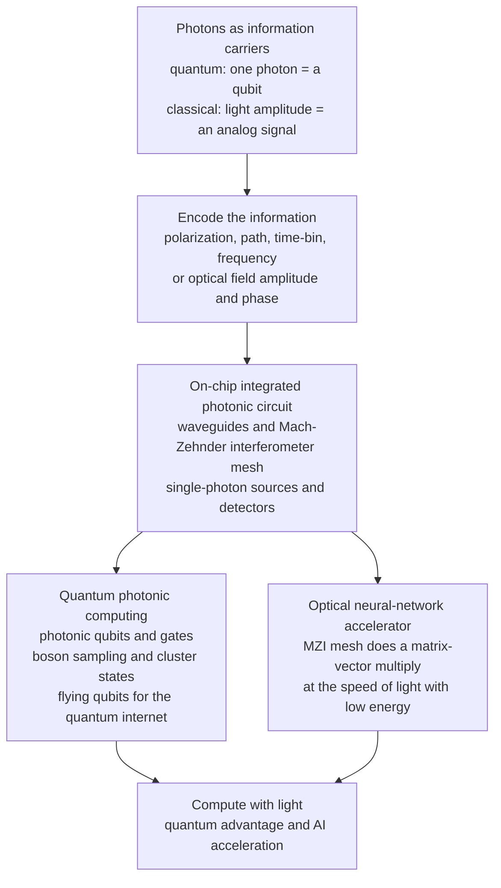

# 🔮 Quantum Photonics and Photonic Computing

> [!abstract] TL;DR
> What if you computed not with electricity, but with **light**? Photons carry two entirely different superpowers into computing, and this note takes the **optics view** of both (the [[Photonic_Quantum_Computing|quantum-computing vault]] gives the complementary quantum-information view). **Superpower one — quantum:** a single photon can *be* a **qubit** (its polarization, path, time-bin, or frequency holding a superposition), it barely interacts with its environment (so it stays coherent even at **room temperature**), and it naturally *flies* down a fibre — the ideal **flying qubit** for a quantum network. The price is that photons also barely interact with *each other*, so two-qubit gates are hard, solved by **measurement-induced nonlinearity** in linear optics (the **KLM** scheme) and by **cluster-state** and **continuous-variable** architectures; a non-universal cousin, **boson sampling**, is classically intractable and drove the Jiuzhang quantum-advantage demonstrations. **Superpower two — classical/analog:** because light beams pass *through* each other without interfering and a mesh of **Mach-Zehnder interferometers** can perform a **matrix-vector multiply at the speed of light**, you can run the linear algebra at the heart of deep learning **optically** — an **optical neural-network accelerator** that is potentially far faster and cooler than electronic chips. Both dreams run on the same **integrated (silicon) photonic** chips. Harnessing light to compute — quantumly *and* classically — sits at two of the defining frontiers of the field: the coming **quantum internet** and a possible **optical accelerator for the AI era**.

---

## Intuition

**Analogy — two very different reasons light is a computer's dream substance.** Picture two engineers standing at the same optical bench, both wanting to compute with the laser beam in front of them, but for opposite reasons.

The first engineer is a **quantum** enthusiast. She wants a qubit that never forgets — one that holds its delicate superposition without being ruined by heat, noise, or a jostling crowd. A photon is exactly that: a particle of light so aloof that the outside world passes right through it, leaving its quantum state pristine at room temperature. And because that same photon flies down a glass fibre at light speed, the qubit that *computes* is also the qubit that *travels* — perfect for wiring together a quantum internet. Her only frustration is the flip side of the gift: photons are *so* aloof that they ignore each other too, so making two of them "talk" (a two-qubit gate) takes ingenuity.

The second engineer is an **AI** enthusiast, and he loves light for the opposite reason. He *wants* beams that pass through each other without colliding, because that lets him send many signals through the same space at once — massive parallelism for free. He also knows a secret from wave optics: a simple arrangement of splitters and phase shifters can **add and mix light amplitudes automatically**, and adding-and-mixing weighted numbers is exactly a **matrix multiplication** — the single operation that dominates every neural network. A lens even performs a Fourier transform instantly, at the speed of light, using no power at all. So he dreams of doing the crushing linear algebra of deep learning **with photons instead of transistors**, faster and cooler.

Both engineers are building the *same* thing: a programmable **photonic chip**. Photonic computing is the frontier where the ultimate speed and the quantum weirdness of light are harnessed to compute — powering both the coming quantum internet and a possible optical accelerator for the AI era.

---

## How It Works

### Core Mechanics

**A. Photons as qubits — the quantum path.**

1. **Encode the qubit in a degree of freedom of one photon.** A single photon offers four natural qubit "coordinates": **polarization** ($|H\rangle,|V\rangle$), **path / dual-rail** (which of two waveguides), **time-bin** (early vs late arrival), and **frequency** (two colours). Path is natural on chips; time-bin and polarization survive long fibre runs.
2. **Single-qubit gates are trivial.** A **beam splitter** mixes two modes and a **phase shifter** delays one — together they realize *any* single-qubit rotation with near-unity fidelity, no cryogenics required. Photonics has the best single-qubit gates of any platform.
3. **Two-qubit gates are the hard part.** Entangling gates need one photon's presence to change another's fate — an optical **nonlinearity**. Natural nonlinearities are astronomically weak at the single-photon level, so linear optics manufactures an *effective* one by **measurement**: entangle data photons with ancillas, then detect the ancillas; a particular detector click **heralds** that the desired gate fired (the **KLM** scheme). The gates are therefore **probabilistic**, rescued at scale by **multiplexing** and by **measurement-based (cluster-state)** and **continuous-variable squeezed-light** architectures.
4. **Boson sampling — advantage without universality.** Inject $n$ indistinguishable photons into an $m$-mode interferometer and sample where they come out. The output probabilities are **permanents** of complex matrices (a #P-hard quantity), so no classical computer can efficiently reproduce the samples — a clean route to **quantum advantage** demonstrated by USTC's Jiuzhang.
5. **Flying qubits and the quantum internet.** Because the computing qubit *is* a telecom photon, photonics is the one platform where "compute" and "communicate" use the same object — the substrate for teleportation, **quantum repeaters**, and the quantum internet.

**B. Photons as analog signals — the classical/optical path.**

6. **A Mach-Zehnder mesh is a matrix.** A **Mach-Zehnder interferometer (MZI)** — two beam splitters with two programmable phase shifters — is a fully tunable $2\times2$ **unitary**. Tile MZIs across adjacent optical modes (a **Reck** or **Clements** mesh) and the whole device implements an arbitrary $N\times N$ **unitary** $U$. Send in a vector of optical **amplitudes** and the light comes out as $U\mathbf{x}$ — a complete **matrix-vector multiply performed passively, at light speed**.
7. **A full weight matrix via SVD.** Any real weight matrix factorizes as $W = U\Sigma V^{\dagger}$ (singular-value decomposition): realize $V^{\dagger}$ and $U$ as two MZI meshes and the diagonal $\Sigma$ as single-mode **attenuators/modulators**. One optical pass computes the entire linear layer of a neural network — the design of Shen *et al.*'s coherent nanophotonic circuit.
8. **Fourier transforms and convolution for free.** A lens (or an on-chip star coupler) performs a **Fourier transform** at the speed of light, turning convolutions — the backbone of vision networks — into cheap optical operations. Reservoir and analog-optical schemes exploit the same "compute-by-propagation" idea.
9. **The nonlinearity gap.** Optics does the *linear* algebra beautifully but neural networks also need a **nonlinear activation**; supplying an efficient optical nonlinearity (or converting to electronics between layers) is the field's central engineering tension, alongside **precision** and **data conversion** (electrical-to-optical and back).

**C. The shared platform.** Both paths are built on **integrated (silicon) photonics**: programmable meshes of waveguides, interferometers, single-photon sources, and detectors on one CMOS-compatible chip — the same hardware serves quantum qubits *and* the AI matrix engine.

### Flow / Architecture



---

## Key Concepts

### Secondary Level

- **Computing with light instead of electricity.** Photonic computing does its arithmetic with beams of light rather than currents in wires. Light travels faster, wastes less heat, and many beams can share the same space at once, so certain calculations can be done very fast and very efficiently.
- **A photon can be a qubit.** A single particle of light can carry a quantum bit — its "spin direction" (polarization) or "which pipe it is in" (path) can be in a blend of both answers at once. Because light ignores its surroundings, this quantum blend survives even at room temperature, and the photon can be shot down a glass fibre to another computer.
- **Why light is great and annoying for quantum computing.** The good news: photons are almost impossible to disturb, so they make superb, long-lasting, *flying* qubits. The annoying news: photons ignore *each other* too, so making two of them interact — needed for real computation — takes a clever trick: you **measure** some of them, and the act of measuring forces the rest to become linked.
- **Light doing multiplication.** A neural network is mostly one operation repeated billions of times: multiplying a table of numbers by a list of numbers (a matrix by a vector). A little maze of light-splitters and delays can do that entire multiplication **automatically, in one flash of light**, because interfering beams naturally add up. That is the promise of an optical neural network.
- **Why it matters.** Two of the most exciting frontiers in technology meet here: a future **quantum internet** carried by photons, and **faster, cooler AI chips** that compute with light instead of transistors.

### Undergraduate Level

- **The four photonic qubit encodings.** Polarization ($|H\rangle,|V\rangle$), dual-rail path, time-bin, and frequency are interconvertible physical realizations of the same [[Qubits_and_the_Bloch_Sphere|Bloch-sphere]] qubit; passive optics rotate the state vector. Chips favour path; long-distance links favour time-bin/polarization.
- **Beam splitter + phase shifter = SU(2).** A phase shifter is a $Z$-rotation and a beam splitter an $X/Y$-rotation; cascading them realizes any single-qubit unitary. This is why photonic **single-qubit** gates are near-perfect and cryogenics-free.
- **The KLM idea in one line.** Universal quantum computing is possible with **linear optics + single-photon sources + detectors + feed-forward**: measurement is a nonlinear projection, so a heralded detector outcome enacts an effective entangling gate — at the cost of **probabilistic**, ancilla-hungry gates.
- **Boson sampling and permanents.** For $n$ photons in an $m$-mode unitary $U$, the amplitude of an output configuration is the **permanent** of an $n\times n$ submatrix of $U$; probabilities are $|\mathrm{Per}|^2$. Because computing permanents is #P-hard, sampling the distribution is classically intractable — a non-universal path to advantage (see [[Quantum_Supremacy_and_Advantage]]).
- **The MZI mesh as a programmable unitary.** A $2\times2$ MZI $T(\theta,\phi)$ (two 50:50 splitters, two phases) spans all of $U(2)$; the **Reck** (triangular) and **Clements** (rectangular, lower-loss, balanced) decompositions tile $\binom{N}{2}$ such cells to realize *any* $N\times N$ unitary. Programming the phases programs the matrix.
- **From unitary to weight matrix.** A general linear layer $W$ is realized by **SVD** $W=U\Sigma V^{\dagger}$: two MZI meshes for the unitaries and single-mode **attenuators** for the singular values $\Sigma$. The forward pass $\mathbf{y}=W\mathbf{x}$ becomes one optical propagation — the coherent optical neural network of Shen *et al.*
- **The Fourier "free lunch."** A lens computes a 2-D Fourier transform of the field in its focal plane instantly and passively; convolutions (multiplications in Fourier space) are therefore cheap in optics, motivating optical convolutional and correlator architectures.

### Graduate Level

- **Second-quantized mesh action.** A passive linear network maps mode operators $\hat a_j^{\dagger}\to\sum_k U_{jk}\hat a_k^{\dagger}$ with $U\in U(m)$. For Fock inputs the transition amplitudes are **permanents** of submatrices of $U$ (Aaronson–Arkhipov), and the permanent's #P-hardness plus anticoncentration and hiding arguments underpin the classical intractability of boson sampling; **Gaussian boson sampling** (squeezed inputs) generalizes this to hafnians and is the Jiuzhang/Borealis route.
- **KLM resource scaling.** The heralded gate success probabilities ($1/16$ for the original beam-splitter CNOT), the $n^2/(n+1)^2$ scaling of the nonlinear-sign (NS) gate, and **gate teleportation** that pushes success toward one with polynomially many ancillas — traded for a large photon-resource overhead that motivates offline **cluster-state** preparation and **fusion-based** computation.
- **Loss as the dominant error.** Unlike matter qubits dominated by decoherence, photonic systems are dominated by **photon loss** and detector inefficiency; thresholds are stated in loss/erasure terms, and **temporal/spatial multiplexing** converts non-deterministic heralded sources and gates into effectively deterministic ones.
- **Mesh unitarity, calibration, and precision.** Real MZI meshes suffer from beam-splitter imbalance, phase-shifter crosstalk, thermal drift, and finite bit-depth phase control; **in-situ training** and self-configuring/self-calibrating meshes (Hughes, Miller) mitigate hardware error. The achievable matrix **precision** ($\sim$4–8 effective bits) and the energy/latency of **DAC/ADC** conversion set the real speedup versus digital accelerators.
- **The activation problem.** MZI meshes give only *linear* (unitary $\times$ diagonal $\times$ unitary) maps; universal deep networks require a **nonlinear activation** between layers, supplied by opto-electronic conversion, saturable absorbers, or emerging all-optical nonlinearities. Coherent detection and homodyne readout couple the optical layer back to electronics.
- **Continuous-variable and measurement-based photonics.** CV cluster states from squeezed modes with homodyne measurement (Xanadu), Gaussian-circuit simulability (Gottesman–Knill analog), and non-Gaussian "magic" (cubic-phase/GKP) states for universality and fault tolerance; the one-way model of Raussendorf–Briegel adapted to photons via fusion of small resource states.
- **Integrated-quantum-photonic scaling.** On-chip heralded single-photon sources (spontaneous four-wave mixing / parametric down-conversion), fast reconfigurable phase shifters, low-loss silicon-nitride routing, and superconducting-nanowire detectors converge toward large programmable interferometers — the same silicon platform, discussed as Integrated Photonics and Silicon Photonics, that hosts the classical optical-AI mesh.

---

## Python Demo

```python
# COMPUTING WITH LIGHT -- the same interferometer MESH, two modes of use:
#   (a) CLASSICAL / OPTICAL-AI: a mesh of Mach-Zehnder interferometers (MZIs)
#       is a programmable UNITARY.  Feeding it a vector of optical AMPLITUDES
#       computes  x_out = U @ x_in  -- a matrix-vector multiply done by light,
#       the linear core of a coherent optical neural network (Shen et al.).
#   (b) QUANTUM: feed SINGLE PHOTONS (not classical light) into the SAME kind
#       of interferometer -> BOSON SAMPLING.  Output probabilities are
#       |Permanent(submatrix)|^2 -- a #P-hard quantity no classical computer
#       can efficiently sample.  Quantum interference (|Per U|^2) reshapes the
#       distribution versus classical distinguishable particles (Per |U|^2).
# numpy + matplotlib only (self-contained; permanent via Ryser's formula).

import numpy as np
import matplotlib.pyplot as plt
from itertools import combinations

rng = np.random.default_rng(7)

# =====================================================================
# (a) OPTICAL MATRIX-VECTOR MULTIPLY with a Mach-Zehnder INTERFEROMETER MESH
# =====================================================================
def mzi(theta, phi):
    """One 2x2 MZI cell: BS - internal phase(theta) - BS - external phase(phi).
       Spans all of U(2), so it is a fully programmable 2x2 unitary."""
    BS    = (1/np.sqrt(2)) * np.array([[1, 1j], [1j, 1]], dtype=complex)
    P_int = np.array([[np.exp(1j*theta), 0], [0, 1]], dtype=complex)
    P_ext = np.array([[np.exp(1j*phi),   0], [0, 1]], dtype=complex)
    return BS @ P_int @ BS @ P_ext

def embed(block2, k, N):
    """Place a 2x2 cell on adjacent optical modes (k, k+1) in an N-mode circuit."""
    M = np.eye(N, dtype=complex)
    M[k:k+2, k:k+2] = block2
    return M

N = 6                                    # six optical modes (waveguides)
U_mesh = np.eye(N, dtype=complex)
for layer in range(N):                   # N layers -> universal Clements mesh
    start = 0 if layer % 2 == 0 else 1
    for k in range(start, N - 1, 2):
        U_mesh = embed(mzi(rng.uniform(0, 2*np.pi),
                           rng.uniform(0, 2*np.pi)), k, N) @ U_mesh

# Input optical amplitudes (a small wavepacket across the modes), then propagate.
x_in = np.array([1.0, 0.6, 0.0, 0.0, 0.3, 0.0], dtype=complex)
x_in = x_in / np.linalg.norm(x_in)
x_out_optics = U_mesh @ x_in             # what the LIGHT computes
x_out_matmul = np.dot(U_mesh, x_in)      # ordinary matrix multiply -- identical
unitary_err  = np.max(np.abs(U_mesh.conj().T @ U_mesh - np.eye(N)))

# =====================================================================
# (b) BOSON SAMPLING through a Haar-random interferometer
# =====================================================================
def permanent(A):
    """Permanent of a square matrix via Ryser's formula (no scipy)."""
    n = A.shape[0]
    total = 0.0 + 0.0j
    for k in range(1, n + 1):
        for cols in combinations(range(n), k):
            total += (-1)**k * np.prod(A[:, cols].sum(axis=1))
    return total * (-1)**n

def haar_unitary(m, rng):
    """A Haar-random m x m unitary via QR of a complex Gaussian matrix."""
    z = (rng.standard_normal((m, m)) + 1j*rng.standard_normal((m, m))) / np.sqrt(2)
    q, r = np.linalg.qr(z)
    return q * (np.diag(r) / np.abs(np.diag(r)))

m, n = 6, 3                               # 3 indistinguishable photons, 6 modes
U = haar_unitary(m, rng)
in_modes = list(range(n))                 # photons enter modes 0, 1, 2

configs, p_quantum, p_classical = [], [], []
for out_modes in combinations(range(m), n):        # collision-free outputs
    sub = U[np.ix_(in_modes, out_modes)]
    p_quantum.append(abs(permanent(sub))**2)            # indistinguishable photons
    p_classical.append(permanent(np.abs(sub)**2).real)  # distinguishable particles
    configs.append("".join(str(i) for i in out_modes))

p_quantum   = np.array(p_quantum);   p_quantum   /= p_quantum.sum()
p_classical = np.array(p_classical); p_classical /= p_classical.sum()

# =====================================================================
# Plot: implemented matrix | matrix-vector multiply by light | boson sampling
# =====================================================================
fig, ax = plt.subplots(1, 3, figsize=(17, 5.2))

im = ax[0].imshow(np.abs(U_mesh), cmap="viridis", vmin=0)
ax[0].set_title("(a) MZI mesh = a programmed matrix\n|U| implemented by the interferometer mesh")
ax[0].set_xlabel("input mode"); ax[0].set_ylabel("output mode")
fig.colorbar(im, ax=ax[0], fraction=0.046, pad=0.04, label="|U| entry")

idx = np.arange(N)
ax[1].bar(idx - 0.2, np.abs(x_in),         width=0.4, color="#1f77b4", label="input |x_in|")
ax[1].bar(idx + 0.2, np.abs(x_out_optics), width=0.4, color="#c00000", label="output |U x| by light")
ax[1].plot(idx, np.abs(x_out_matmul), "k_", ms=16, mew=2.5, label="numpy matmul (identical)")
ax[1].set_title("(a) Matrix-vector multiply by light\noptical mesh output == U @ x_in")
ax[1].set_xlabel("optical mode"); ax[1].set_ylabel("amplitude magnitude")
ax[1].legend(fontsize=8)

xb = np.arange(len(configs))
ax[2].bar(xb - 0.2, p_quantum,   width=0.4, color="#8000c0", label="quantum |Per U|^2  (hard)")
ax[2].bar(xb + 0.2, p_classical, width=0.4, color="#999999", label="classical Per|U|^2")
ax[2].set_title("(b) Boson sampling: 3 photons, 6 modes\nquantum interference reshapes the distribution")
ax[2].set_xlabel("output configuration (occupied modes)")
ax[2].set_ylabel("probability (collision-free sector)")
ax[2].set_xticks(xb); ax[2].set_xticklabels(configs, rotation=90, fontsize=6)
ax[2].legend(fontsize=8)

plt.tight_layout()
plt.savefig("quantum_photonics_and_photonic_computing.png", dpi=120)
plt.show()

# ---- Numerical readout ----
print(f"(a) mesh unitarity error       = {unitary_err:.2e}   (the mesh IS a unitary matrix)")
print(f"(a) optics vs numpy matmul err = {np.max(np.abs(x_out_optics - x_out_matmul)):.2e}")
print(f"(b) most-likely photon output  = modes {configs[int(np.argmax(p_quantum))]},  "
      f"P = {p_quantum.max():.3f}")
print(f"(b) max |P_quantum - P_classical| = {np.max(np.abs(p_quantum - p_classical)):.3f}"
      f"   <- interference, the source of classical hardness")
```

**What the demo shows.** Panel **(a)** builds a real Clements mesh out of individual $2\times2$ **MZI** cells and confirms the whole thing is a **unitary matrix** (unitarity error $\sim10^{-15}$). Feeding in a vector of optical amplitudes, the light comes out as $U\mathbf{x}$ — the heatmap is the *matrix the mesh implements*, and the bar chart shows the optical output landing exactly on `numpy`'s matrix multiply: **the interferometer mesh has performed a matrix-vector multiply, passively, at the speed of light** — the linear core of a coherent optical neural network (a full weight matrix adds a diagonal of attenuators and a second mesh, $W=U\Sigma V^{\dagger}$). Panel **(b)** feeds *single photons* into the same kind of interferometer: each output probability is $|\mathrm{Per}|^2$ of a submatrix (Ryser's formula), and comparing the **quantum** distribution to the **classical** distinguishable-particle one ($\mathrm{Per}|U|^2$) exposes exactly where multi-photon **interference** reshapes the outcomes — the reshaping that makes the distribution a **#P-hard**, classically-unsamplable object. One chip, two frontiers: analog AI math when you inject classical light, quantum advantage when you inject photons.

---

## Real-World Applications

- **Optical neural-network accelerators (MZI meshes).** Shen *et al.*'s coherent nanophotonic processor ran a vowel-classification network with its matrix multiplies done in silicon-photonic MZI meshes; startups (**Lightmatter**, **Lightelligence**, **Luminous**) and research groups are building programmable photonic tensor cores to accelerate the linear algebra of deep learning at low energy-per-MAC and high bandwidth.
- **Photonic in-memory / wavelength-multiplexed matrix engines.** Beyond MZI meshes, **microring** weight banks and **phase-change** photonic crossbars perform multiply-accumulate across many wavelengths in parallel (wavelength-division multiplexing), targeting the memory-bandwidth wall that throttles electronic AI chips.
- **Boson-sampling quantum advantage.** USTC's **Jiuzhang** (Gaussian boson sampling with squeezed light through a large interferometer) and Xanadu's **Borealis** sampled distributions a classical supercomputer would need aeons to reproduce — photonic, room-temperature demonstrations of computational advantage complementary to superconducting processors (see [[Quantum_Supremacy_and_Advantage]]).
- **Fault-tolerant photonic quantum computing.** **PsiQuantum** builds silicon-photonic chips in a commercial foundry, betting a **fusion-based** architecture scales single photons to a million-qubit fault-tolerant machine; **Xanadu** pursues continuous-variable cluster states — both detailed in the [[Photonic_Quantum_Computing|photonic quantum computing]] note.
- **The quantum internet and repeaters.** Because the computing qubit is a telecom photon, integrated quantum photonics supplies the entangled-photon sources, Bell-state measurements, and low-loss routing for entanglement distribution and quantum repeaters (see [[The_Quantum_Internet]]).
- **Optical Fourier processors and correlators.** Free-space and on-chip optical Fourier transforms drive real-time pattern recognition, coherent optical correlators, and analog signal processing where a lens does in one pass what a digital FFT does in many operations.

---

## Common Pitfalls

- **"Optical computing replaces electronic computing wholesale."** It does not — optics excels at *linear, parallel, analog* operations (matrix multiply, Fourier transform, routing) but is poor at logic, memory, and precise nonlinearity. Real systems are **hybrid opto-electronic**, using light for the linear algebra and electronics for control, memory, and activations.
- **"The MZI mesh is the whole neural network."** A mesh implements only the **linear** layer ($U\Sigma V^{\dagger}$). Deep learning needs a **nonlinear activation** between layers; supplying an efficient optical (or opto-electronic) nonlinearity is a first-class unsolved problem, not a detail.
- **"Analog optics is infinitely precise, so it beats digital easily."** Analog photonics is limited by beam-splitter imbalance, thermal drift, phase-shifter crosstalk, and finite DAC/ADC bit-depth to roughly **4–8 effective bits**. The real win requires the **electrical-to-optical and optical-to-electrical conversion** energy and latency not to swamp the optical speedup.
- **"Photons don't interact, so quantum computing with them is impossible."** KLM proved the opposite: you never need a direct photon-photon force — **measurement plus feed-forward** manufactures an effective nonlinearity. The cost is probabilistic gates and ancilla overhead, addressed by multiplexing and cluster states.
- **"Room-temperature photonics means it is the easy platform."** The cryostat moves, it does not vanish: superconducting-nanowire single-photon detectors are cold, and the brutal challenges become **near-deterministic single-photon sources**, **near-unity detector efficiency**, and above all **photon loss** — the number-one photonic error.
- **"Boson sampling is a universal quantum computer."** It is deliberately **non-universal** — it cannot run Shor's or Grover's algorithm. Its sole purpose is to be classically hard, making it a clean vehicle for *advantage demonstrations*, not general computation.
- **"Boson-sampling hardness is just about counting photons."** The hardness is specifically the **permanent / multi-photon interference**: distinguishable particles give $\mathrm{Per}|U|^2$ (classically easy), while indistinguishable photons give $|\mathrm{Per}\,U|^2$. Lose indistinguishability (impure or distinguishable photons) and the interference — and the hardness — washes out.

---

## Related Concepts

Glob-verified wikilinks (cross-vault):

- [[Photonic_Quantum_Computing]] — the quantum-computing-vault companion to this note; it develops KLM, cluster states, Hong-Ou-Mandel interference, and fusion-based computing in depth, while this note frames the same physics from the **optics** side and adds the classical optical-AI half.
- [[Quantum_Computing_Overview]] — the broader map of qubits, gates, and algorithms into which photonic qubits and boson sampling fit as one hardware platform among many.
- [[The_Quantum_Internet]] — flying photonic qubits are the carriers of quantum communication; the same photon that runs a gate travels the network, making photonics the natural quantum-internet substrate.
- [[Quantum_Supremacy_and_Advantage]] — boson sampling (Jiuzhang, Borealis) is the photonic route to demonstrating classically intractable computation, the "hard distribution" this note's demo constructs.
- [[Qubits_and_the_Bloch_Sphere]] — polarization, path, time-bin, and frequency are just different physical coordinates on the same Bloch sphere; beam splitters and phase shifters rotate the state vector on it.
- [[Quantum_Optics_and_Cavity_QED]] — the Physics-vault foundation of single-photon states, mode operators, and light-matter coupling that photonic sources, detectors, and interference exploit.
- [[Neural_Network_Basics]] — the matrix-vector multiplies and layered linear algebra that dominate deep learning, and that an MZI-mesh optical accelerator is designed to perform with light.
- [[Quantum_Machine_Learning]] — the intersection where photonic quantum processors and classical optical accelerators both meet machine learning, from a quantum-information angle.
- [[Photonics_and_Optoelectronics]] — the Electrical-Engineering companion on the light sources, modulators, waveguides, and detectors that are the physical building blocks of any photonic computer.

Within this Optics and Photonics vault, this note is the computing capstone of Pillar 6 (Quantum and Frontier Photonics). It connects in prose to the sibling notes Quantum_Optics_and_Photons (the single-photon and quantized-field physics underpinning photonic qubits), Integrated_Photonics_and_Silicon_Photonics (the on-chip silicon platform of waveguides and MZI meshes that hosts both the quantum and the optical-AI processor), Optical_Modulators_and_Switches (the phase shifters and Mach-Zehnder modulators that are the programmable elements of every mesh), Metamaterials_and_Photonic_Crystals (nanostructured light-control and photonic-crystal cavities as alternative computing and single-photon-source substrates), and The_Reach_and_Future_of_Optics_and_Photonics (where photonic computing sits among the field's defining frontiers).

---

## Review Questions

1. **(Secondary)** Explain, in your own words and without equations, the *two different* reasons a photon is attractive for computing: one that helps build a **quantum** computer and one that helps build a **faster AI** chip. Why does the very property that makes photons wonderful quantum qubits (they ignore their surroundings) also make two-qubit gates hard?
2. **(Undergraduate)** A programmable mesh of Mach-Zehnder interferometers implements an $N\times N$ **unitary** matrix. (a) Explain how a single $2\times2$ MZI acts as a tunable unitary and why tiling many of them (Reck/Clements) can realize *any* unitary. (b) A neural-network weight matrix is generally *not* unitary — describe how the singular-value decomposition $W=U\Sigma V^{\dagger}$ lets you build it from two meshes plus attenuators. (c) Name one thing the mesh *cannot* do that a real neural network still needs, and how a practical optical accelerator supplies it.
3. **(Graduate)** In boson sampling, the amplitude for a given output of $n$ photons through an $m$-mode interferometer $U$ is the **permanent** of an $n\times n$ submatrix of $U$. (a) Contrast the output distribution for *indistinguishable* photons ($|\mathrm{Per}\,U|^2$) with that for *distinguishable* particles ($\mathrm{Per}\,|U|^2$), and explain physically where the difference comes from. (b) Why does the permanent's #P-hardness, together with photon indistinguishability, make the task classically intractable yet still **non-universal**? (c) What single experimental imperfection most directly destroys the quantum hardness, and why?

---

## Sources

- Kok, P. & Lovett, B. W. — *Introduction to Optical Quantum Information Processing* (Cambridge Univ. Press) — photonic qubits, linear-optical gates, KLM, and cluster-state photonic computing.
- Saleh, B. E. A. & Teich, M. C. — *Fundamentals of Photonics*, 3rd ed. (Wiley) — interference, interferometers, Fourier optics, and the photonic device physics behind the mesh.
- O'Brien, J. L., Furusawa, A. & Vuckovic, J. — "Photonic quantum technologies," *Nature Photonics* **3**, 687–695 (2009) — review of photonic quantum computing, communication, and integrated quantum photonics.
- Shen, Y. et al. — "Deep learning with coherent nanophotonic circuits," *Nature Photonics* **11**, 441–446 (2017) — the MZI-mesh optical neural network that performs matrix multiplication with light.
- Clements, W. R. et al. — "Optimal design for universal multiport interferometers," *Optica* **3**, 1460–1465 (2016) — the rectangular MZI-mesh decomposition realizing any unitary (with Reck et al., *Phys. Rev. Lett.* **73**, 58, 1994).

---

#optics #quantum-photonics #photonic-computing #optical-neural-network #boson-sampling
