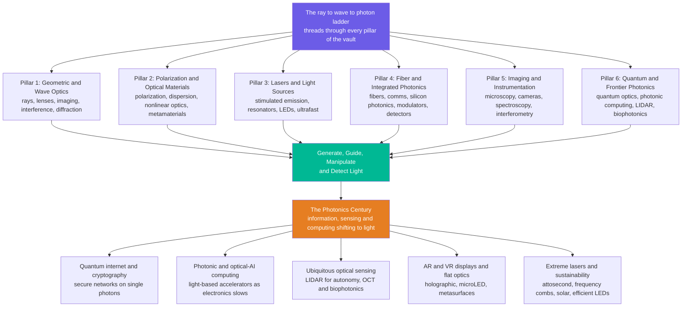

# 🔮 The Reach and Future of Optics and Photonics

> [!abstract] TL;DR
> **Optics and photonics is the science and technology of light** — and this capstone zooms all the way out to show how the vault's **six interlocking pillars** fit into humanity's oldest and most far-reaching relationship with light. From the first lens and telescope that *extended our sight*, to Newton's prism, to Maxwell revealing light as an **electromagnetic wave**, to Einstein's **photon**, to the laser and the optical fiber that wired the planet, light has always been both how we *understand* the universe and how we *build* the future. The six pillars — **(1) geometric and wave optics**, **(2) polarization and optical materials**, **(3) lasers and light sources**, **(4) fiber and integrated photonics**, **(5) imaging and instrumentation**, and **(6) quantum and frontier photonics** — all funnel into one mission (**generate, guide, manipulate, and detect light**) and all reach toward the same frontier: a **quantum internet** running on single photons, **photonic and optical-AI computing** for when electronics slows, **ubiquitous optical sensing** (LIDAR, OCT, biophotonics), **flat metasurface optics and AR/VR displays**, and **extreme lasers** (attosecond science, frequency combs, optical clocks). The honest message: "the photonics century" is not hype — as the electron slows, more and more of information, sensing, and computing is shifting onto the **photon**, and the photonic engineer is the one who harnesses light across the entire ray→wave→photon spectrum to build it.

---

## Intuition

**Analogy — humanity's relationship with light traces the whole arc of science and technology.** Everything you have ever seen arrived at your eye as light; nearly everything you send to a friend on another continent leaves as light too. The story of civilization understanding and then *commanding* light is, to a startling degree, the story of science itself. It begins with the **lens and the telescope**, which extended our sight outward to the moons of Jupiter and inward to the cell — the first time a tool made a human see something no unaided eye ever could. It runs through **Newton's prism** splitting white light into the rainbow, through **Maxwell** proving that light *is* an electromagnetic wave riding at speed $c$, through **Einstein's photon** that showed light also comes in indivisible packets. It arrives at the **laser** — coherent light on demand — and the **optical fiber**, a hair-thin thread of glass that today carries essentially all of the world's data across the ocean floor. And it is still being written, right now, in **quantum photonics** and **light-powered AI**.

This note is the culmination of the vault. Every earlier note pulled one thread of that story — [[Geometric_Optics_and_Ray_Tracing|rays]] and [[Lenses_Mirrors_and_Imaging|lenses]], [[Wave_Optics_and_Interference|interference]] and [[Diffraction_and_Fourier_Optics|diffraction]], [[Polarization_of_Light|polarization]] and [[Nonlinear_Optics|nonlinear optics]], [[Laser_Physics_and_Stimulated_Emission|stimulated emission]], [[Optical_Fibers_and_Waveguides|fibers]], [[Optical_Imaging_and_Microscopy|microscopy]], and the quantum frontier. Here we weave them into a single fabric and cast it forward. The reason so much reach rests on one subject is that it flows from a single **ladder of three pictures** — light as **rays** (straight lines that bend: enough for lenses and telescopes), as **waves** (interference and diffraction: color and resolution limits), and as **photons** (quantized packets $E = h\nu$: lasers, LEDs, and quantum bits). That ray→wave→photon ladder threads through all six pillars, and where it points next is a world where an internet runs entirely on light and eventually on *single photons*, computers calculate with beams, sensors see in the dark and inside the body, displays paint 3D worlds, and quantum machines harness light's deepest strangeness. Light has always been how we understand the universe and, increasingly, how we build the future.

---

## How It Works

### Core Mechanics

Understand optics and photonics as **six pillars standing on one ladder, converging into one activity, then reaching toward one frontier**. The ladder (ray → wave → photon) never changes — it is the physics of light itself. The six pillars are the sub-disciplines this vault is organized around. The convergence is that every real photonic system must **generate, guide, manipulate, and detect** light at once. And the frontier is what happens when those pillars fuse with computing, quantum information, medicine, and sustainability — the "photonics century."

1. **Pillar 1 — Geometric & Wave Optics: the foundations.** Light as rays that reflect and [[Reflection_Refraction_and_Fermats_Principle|refract]] ([[Geometric_Optics_and_Ray_Tracing]]), forming images through [[Lenses_Mirrors_and_Imaging|lenses and mirrors]] — then light as waves that add and cancel ([[Wave_Optics_and_Interference]]) and bend around apertures ([[Diffraction_and_Fourier_Optics]], which also sets the resolution limit of *every* instrument). This pillar is the workhorse of everyday optics, from eyeglasses to telescopes.

2. **Pillar 2 — Polarization & Optical Materials: controlling light in matter.** Light is a *vector* wave ([[Polarization_of_Light]]) whose speed depends on wavelength ([[Dispersion_and_Optical_Properties_of_Materials]]) and on crystal direction ([[Crystal_Optics_and_Birefringence]]). Push the intensity up and materials respond nonlinearly ([[Nonlinear_Optics]] — green laser pointers, frequency combs); engineer the structure at the wavelength scale and you get [[Thin_Films_and_Optical_Coatings|coatings]] and [[Metamaterials_and_Photonic_Crystals|metamaterials]] that bend light in ways nature never offered.

3. **Pillar 3 — Lasers & Light Sources: generating coherent light.** The heart of photonics: [[Laser_Physics_and_Stimulated_Emission|stimulated emission and population inversion]] shaped by [[Laser_Resonators_and_Gaussian_Beams|resonators into Gaussian beams]], realized across [[Types_of_Lasers|every laser family]] and the electrically driven [[Semiconductor_Light_Sources_LEDs_and_Laser_Diodes|LEDs and laser diodes]] that light our screens and rooms — pushed to extremes by [[Ultrafast_and_Pulsed_Lasers|femtosecond pulses]] and boosted by [[Optical_Amplifiers_and_Gain_Media|optical amplifiers]].

4. **Pillar 4 — Fiber & Integrated Photonics: guiding and processing light.** Light trapped by total internal reflection in [[Optical_Fibers_and_Waveguides|fibers and waveguides]] carries the internet ([[Fiber_Optic_Communication]]), stacked many colors deep by [[Wavelength_Division_Multiplexing_and_Networks|wavelength-division multiplexing]], encoded by [[Optical_Modulators_and_Switches|modulators]], caught by [[Photodetectors_and_Optical_Receivers|photodetectors]], and increasingly shrunk onto chips ([[Integrated_Photonics_and_Silicon_Photonics]]) — optics manufactured like microelectronics.

5. **Pillar 5 — Imaging & Instrumentation: seeing and measuring with light.** Turning light into *information about the world*: [[Optical_Imaging_and_Microscopy|microscopy]], the [[Cameras_Sensors_and_Digital_Imaging|cameras and sensors]] in every pocket, [[Spectroscopy_and_Optical_Analysis|spectroscopy]] that reads the composition of stars and molecules, and [[Interferometry_and_Optical_Metrology|interferometry]] that measures distance to a fraction of a wavelength — plus holography and the adaptive optics that sharpen the great telescopes.

6. **Pillar 6 — Quantum & Frontier Photonics: the cutting edge.** Where the ladder reaches its top rung: quantum optics and single photons, photonic computing, LIDAR and optical coherence tomography, biophotonics and optical trapping — the frontier this very capstone opens onto.

**The convergence.** No real photonic system lives in one pillar. A fiber-optic link is a *laser* (Pillar 3) launching light into a *waveguide* (Pillar 4), whose *dispersion and nonlinearity in the material* (Pillar 2) must be managed, detected by a *photodiode* whose *wave-optics* sensitivity (Pillar 1) sets the noise floor — and its next generation will carry *single-photon quantum keys* (Pillar 6). The photonic engineer's real skill is integrating pillars into a working whole.

**The frontier — the photonics century.** Bolt the ladder to modern computing, quantum information, and the climate imperative and the field is redrawn: the **quantum internet** and quantum cryptography (secure networks on single photons), **photonic and optical-AI computing** (light-based accelerators for AI as electronics slows, plus photonic quantum computers), **ubiquitous optical sensing** (LIDAR for autonomy, OCT and biophotonics in medicine), **silicon photonics** scaling optics like chips, **metasurfaces and flat optics** shrinking cameras, advanced **AR/VR and microLED displays**, **extreme lasers** (attosecond science, fusion, frequency combs, optical clocks), and light for **sustainability** (efficient LEDs, solar).

### Flow / Architecture



---

## Key Concepts

### Secondary Level

- **Optics is the science of light; photonics is the technology of putting light to work.** Optics explains *why* a rainbow forms and how a lens makes an image; photonics builds the lasers, fibers, LEDs, and cameras that use light for a job.
- **Light extended our senses first.** The telescope let us see the cosmos and the microscope the microscopic — the earliest example of light-based technology reshaping what humans could know.
- **Three ways to picture light.** As *rays* (straight lines that bend — lenses and telescopes), as *waves* (that ripple and interfere — color and sharpness limits), and as *photons* (tiny packets of energy — lasers, LEDs, solar cells). Each picture is right for a different job.
- **Light already runs your world.** The internet travels as light in glass fibers; your phone camera, TV screen, barcode scanner, and fiber broadband are all photonics. The next wave is light for computing, secure networks, and medical imaging.
- **The "photonics century."** Just as the 20th century ran on the electron (electronics), more and more of the 21st is running on the photon — because light is fast, carries huge amounts of information, and wastes little energy.

### Undergraduate Level

- **The ray → wave → photon ladder unifies the vault.** Ray optics is the short-wavelength limit of wave optics ([[Diffraction_and_Fourier_Optics|diffraction]] vanishes as $\lambda \to 0$); wave optics is the many-photon limit of quantum optics. You reach for the deepest picture the problem demands and no deeper.
- **Five parameters describe any light field.** Its **wavelength/frequency** (position on the spectrum), its **speed** $v = c/n$ in matter, its **energy per photon** $E = h\nu$, its **polarization**, and its **coherence** — the property (born of [[Laser_Physics_and_Stimulated_Emission|stimulated emission]]) that separates a laser from a light bulb.
- **Guiding light is why the internet exists.** Total internal reflection traps light in [[Optical_Fibers_and_Waveguides|glass fibers]]; silica is most transparent near **1550 nm** (loss ~0.2 dB/km), and [[Wavelength_Division_Multiplexing_and_Networks|WDM]] stacks dozens of wavelengths to push tens of terabits per second down a single fiber ([[Fiber_Optic_Communication]]).
- **Resolution is set by the wave, not the zoom.** The [[Diffraction_and_Fourier_Optics|diffraction limit]] $d \approx \lambda/(2\,\mathrm{NA})$ caps every microscope and telescope — the reason optics chases shorter wavelengths and high numerical aperture, and why EUV lithography prints chips with 13.5 nm light.
- **Light is a laboratory *and* a tool.** [[Spectroscopy_and_Optical_Analysis|Spectroscopy]] reads chemical fingerprints from starlight and blood; [[Interferometry_and_Optical_Metrology|interferometry]] measures gravitational waves and machine parts to sub-wavelength precision; lasers cut steel and reshape corneas.

### Graduate Level

- **Everything descends from Maxwell and quantization.** Classical optics — the Fresnel equations, propagation, [[Polarization_of_Light|Jones/Mueller calculus]], [[Diffraction_and_Fourier_Optics|Fourier diffraction]] — is Maxwell's equations in different regimes; quantum optics adds field quantization (coherent, squeezed, and Fock states), giving single photons, entanglement, and the sub-shot-noise metrology that will underpin the frontier.
- **The frontier, concretely — (1) the quantum internet.** Quantum key distribution and entanglement distribution over fiber and free space promise networks whose security rests on physics (no-cloning), not on computational hardness — links this vault to [[The_Quantum_Internet]] and post-quantum security.
- **(2) Photonic and optical-AI computing.** As transistor scaling slows and interconnects dominate energy budgets, optics moves *inside* the computer: [[Integrated_Photonics_and_Silicon_Photonics|silicon-photonic]] links between chips, and photonic matrix-multiply accelerators that perform the linear algebra of neural networks at the speed of light with near-zero switching energy — plus [[Photonic_Quantum_Computing|photonic quantum computers]] that use interfering single photons as qubits.
- **(3) Ubiquitous optical sensing.** LIDAR gives autonomy a 3D world model; optical coherence tomography and biophotonics image tissue in vivo; frequency combs and optical clocks redefine time and enable trace-gas and environmental sensing — the sensing layer of the physical world.
- **(4) Flat optics and extreme light.** [[Metamaterials_and_Photonic_Crystals|Metasurfaces]] replace curved glass with nanostructured flats, shrinking cameras and enabling AR/VR; [[Ultrafast_and_Pulsed_Lasers|attosecond and petawatt lasers]] open strong-field and attosecond science, laser fusion, and precision machining.
- **The honest synthesis.** From the ancient lens to the quantum photon, light has been humanity's tool for *seeing, understanding, and connecting*. As information, sensing, and computing increasingly shift onto the photon, photonics is a **defining enabling technology of the century** — and the optical scientist and photonic engineer are the ones who harness light across the ray–wave–photon spectrum to build the sensing, communicating, imaging, and computing systems of the future.

---

## Python Demo

```python
# "Optics & Photonics in one figure" — a four-panel synthesis dashboard that
# recalls the whole vault, one pillar per panel, and points at the future:
#
#   (a) WAVE OPTICS  -> double-slit interference under a single-slit envelope
#                       ("how light interferes and diffracts" — Pillar 1)
#   (b) LASERS       -> laser output-vs-pump threshold curve
#                       ("generating coherent light" — Pillar 3)
#   (c) FIBER        -> silica attenuation vs wavelength, the 1550 nm window
#                       ("guiding light with minimal loss" — Pillar 4)
#   (d) THE FUTURE   -> exponential growth of fiber transmission capacity
#                       ("the photonics century" — the frontier)
#
# Requires: numpy, matplotlib   (stylized models; illustrative, not lab-exact)
import numpy as np
import matplotlib.pyplot as plt

# =====================================================================
# (a) WAVE OPTICS  ->  Young's double slit with single-slit diffraction envelope
#     I(theta) = cos^2(pi d sin/lam) * [sin(beta)/beta]^2,  beta = pi a sin/lam
# =====================================================================
lam = 650e-9                     # red light [m]
d   = 25e-6                      # slit separation [m]
a   = 6e-6                       # slit width [m]
L   = 1.0                        # screen distance [m]
theta = np.linspace(-0.08, 0.08, 3000)          # small angle [rad]
x_mm  = L * theta * 1e3                          # screen position [mm]
gamma = np.pi * d * np.sin(theta) / lam
beta  = np.pi * a * np.sin(theta) / lam
envelope = np.sinc(beta / np.pi)**2              # np.sinc(z)=sin(pi z)/(pi z)
I_fringe = np.cos(gamma)**2 * envelope

# =====================================================================
# (b) LASERS  ->  output power vs pump power (threshold behaviour)
#     below threshold: tiny spontaneous glow; above: linear slope efficiency
# =====================================================================
P_pump = np.linspace(0.0, 10.0, 500)             # pump power [arb]
P_th   = 3.0                                      # laser threshold
slope  = 0.55                                     # slope efficiency
P_out  = np.where(P_pump > P_th, slope * (P_pump - P_th), 0.0)
P_out += 0.02 * (P_pump / (P_pump.max()))         # faint sub-threshold LED-like floor

# =====================================================================
# (c) FIBER  ->  silica attenuation vs wavelength (stylized 3-window model)
#     Rayleigh ~ 1/lam^4  +  infrared tail  +  the OH "water" absorption peak
# =====================================================================
lam_nm   = np.linspace(1200.0, 1700.0, 600)
rayleigh = 1.2 * (1000.0 / lam_nm)**4             # short-wavelength scattering
ir_tail  = 0.03 * np.exp((lam_nm - 1500.0) / 45.0)  # long-wavelength IR absorption
oh_peak  = 0.55 * np.exp(-((lam_nm - 1383.0) / 10.0)**2)  # water-OH peak
loss     = rayleigh + ir_tail + oh_peak           # total loss [dB/km]

# =====================================================================
# (d) THE FUTURE  ->  fiber transmission capacity vs year (exponential trend)
#     roughly 10x every ~5.5 years — an optics analogue of Moore's law
# =====================================================================
year = np.arange(1980, 2031)
cap_Gbps = 0.045 * 10.0**((year - 1980) / 5.5)    # per-fiber capacity [Gb/s]

# --------------------------- console summary ---------------------------
print("=== Optics & Photonics in one figure ===")
print(f"(a) WAVE   central fringe at x=0 mm; envelope 1st zero near "
      f"x ~= {L*np.degrees(0)+1e3*L*(lam/a):.1f} mm")
print("(b) LASER  threshold at pump = {:.1f}; slope efficiency = {:.2f}".format(P_th, slope))
print("(c) FIBER  minimum loss ~= {:.2f} dB/km near lambda = {:.0f} nm".format(
    loss.min(), lam_nm[np.argmin(loss)]))
print("(d) FUTURE capacity:  1980 ~= {:.3f} Gb/s  ->  2020 ~= {:,.0f} Gb/s".format(
    cap_Gbps[0], cap_Gbps[year == 2020][0]))

# ------------------------------- plotting ------------------------------
fig, ax = plt.subplots(2, 2, figsize=(14, 10))
fig.suptitle("Optics & Photonics in One Figure: the Vault's Four Threads",
             fontsize=15, fontweight="bold")

# (a) double-slit interference
ax[0, 0].plot(x_mm, I_fringe, color="#4a9eff", lw=1.4, label="two-slit fringes")
ax[0, 0].plot(x_mm, envelope, color="#d62728", lw=2, ls="--", label="single-slit envelope")
ax[0, 0].set_title("(a) WAVE OPTICS: double-slit interference  ->  Pillar 1")
ax[0, 0].set_xlabel("position on screen [mm]")
ax[0, 0].set_ylabel("relative intensity")
ax[0, 0].legend(fontsize=8); ax[0, 0].grid(alpha=0.3)

# (b) laser threshold
ax[0, 1].plot(P_pump, P_out, color="#6c5ce7", lw=2.5)
ax[0, 1].axvline(P_th, color="gray", ls="--", lw=1)
ax[0, 1].text(P_th + 0.15, 0.2, "threshold", fontsize=8, color="gray")
ax[0, 1].annotate("spontaneous\n(below threshold)", xy=(1.4, 0.05),
                  xytext=(0.4, 1.6), fontsize=8,
                  arrowprops=dict(arrowstyle="->", color="gray"))
ax[0, 1].annotate("stimulated / coherent\n(above threshold)", xy=(7.5, slope*(7.5-P_th)),
                  xytext=(4.0, 1.2), fontsize=8,
                  arrowprops=dict(arrowstyle="->", color="#6c5ce7"))
ax[0, 1].set_title("(b) LASERS: output vs pump threshold  ->  Pillar 3")
ax[0, 1].set_xlabel("pump power [arb]")
ax[0, 1].set_ylabel("laser output power [arb]")
ax[0, 1].grid(alpha=0.3)

# (c) fiber attenuation
ax[1, 0].plot(lam_nm, loss, color="#00b894", lw=2.5)
ax[1, 0].axvline(1310, color="#1f77b4", ls=":", lw=1.5)
ax[1, 0].axvline(1550, color="red", ls="--", lw=1.5)
ax[1, 0].text(1300, loss.max()*0.85, "1310 nm\n(2nd window)", fontsize=8,
              color="#1f77b4", ha="right")
ax[1, 0].text(1560, loss.max()*0.55, "1550 nm\n(min loss, C-band)", fontsize=8, color="red")
ax[1, 0].text(1383, 0.6, "OH water\npeak", fontsize=8, color="gray", ha="center")
ax[1, 0].set_title("(c) FIBER: attenuation vs wavelength  ->  Pillar 4")
ax[1, 0].set_xlabel("wavelength [nm]")
ax[1, 0].set_ylabel("loss [dB/km]")
ax[1, 0].set_ylim(0, min(loss.max()*1.05, 1.2)); ax[1, 0].grid(alpha=0.3)

# (d) capacity growth (semilog)
ax[1, 1].semilogy(year, cap_Gbps, color="#e67e22", lw=2.5, marker="o", ms=3)
for yr, lbl in [(1980, "single wavelength"), (1995, "EDFA + WDM"),
                (2010, "coherent detection"), (2025, "space-division")]:
    yv = cap_Gbps[year == yr][0]
    ax[1, 1].annotate(lbl, xy=(yr, yv), xytext=(yr-2, yv*6), fontsize=7,
                      arrowprops=dict(arrowstyle="->", color="gray"))
ax[1, 1].set_title("(d) THE FUTURE: fiber capacity growth  ->  the photonics century")
ax[1, 1].set_xlabel("year")
ax[1, 1].set_ylabel("per-fiber capacity [Gb/s]")
ax[1, 1].grid(alpha=0.3, which="both")

plt.tight_layout(rect=[0, 0, 1, 0.95])
plt.show()
```

Each panel is a whole section of the vault compressed to one curve. **(a)** the two-slit fringes riding under a single-slit envelope recall Pillar 1 — [[Wave_Optics_and_Interference|interference]] and [[Diffraction_and_Fourier_Optics|diffraction]] as *one* phenomenon, and the reason every instrument has a resolution limit. **(b)** the kinked output-vs-pump curve recalls Pillar 3 — below the [[Laser_Physics_and_Stimulated_Emission|laser threshold]] there is only a faint spontaneous glow, and above it the coherent beam turns on with a sharp slope efficiency. **(c)** the U-shaped loss curve recalls Pillar 4 — silica's Rayleigh scattering falling as $1/\lambda^4$ meets the rising infrared tail, leaving the famous low-loss **1550 nm** window (and the residual OH "water" peak) that made [[Fiber_Optic_Communication|global fiber communication]] possible. **(d)** the exponential climb of per-fiber capacity recalls the future — an optics analogue of Moore's law, each jump (EDFA + WDM, coherent detection, space-division multiplexing) a chapter of the photonics century. Four curves, four threads, one figure: the vault at a glance.

---

## Real-World Applications

> **Example — a transatlantic fiber link is the whole vault in one system.** A [[Semiconductor_Light_Sources_LEDs_and_Laser_Diodes|distributed-feedback laser diode]] (Pillar 3) generates a pure 1550 nm carrier; an [[Optical_Modulators_and_Switches|electro-optic modulator]] (Pillar 4) stamps data onto it; dozens of wavelengths are stacked by [[Wavelength_Division_Multiplexing_and_Networks|WDM]] and launched into an [[Optical_Fibers_and_Waveguides|optical fiber]] whose [[Dispersion_and_Optical_Properties_of_Materials|dispersion]] and [[Nonlinear_Optics|nonlinearity]] (Pillar 2) must be carefully managed. Every ~80 km an [[Optical_Amplifiers_and_Gain_Media|erbium-doped fiber amplifier]] boosts the signal; at the far shore a [[Photodetectors_and_Optical_Receivers|coherent receiver]] whose sensitivity is set by [[Wave_Optics_and_Interference|wave-optics]] noise limits (Pillar 1) recovers the bits. The next generation will carry [[The_Quantum_Internet|single-photon quantum keys]] (Pillar 6) alongside the classical channels. Six pillars, one cable on the ocean floor.

- **The internet runs on light.** Nearly all long-haul and undersea data crosses the planet as infrared pulses in glass — the single largest deployment of photonics on Earth ([[Fiber_Optic_Communication]], [[Wavelength_Division_Multiplexing_and_Networks]]).
- **Vision and imaging everywhere.** [[Cameras_Sensors_and_Digital_Imaging|Cameras]] in every pocket, [[Optical_Imaging_and_Microscopy|microscopes]] resolving single molecules, telescopes with adaptive optics probing exoplanets, and OCT scanning retinas non-invasively — light turned into information about the world.
- **Manufacturing and medicine.** Lasers cut, weld, and mark; LASIK reshapes the cornea; EUV photolithography (13.5 nm light) prints the nanometer features of every advanced chip; biophotonics images and treats tissue.
- **Sensing and autonomy.** LIDAR gives self-driving cars a 3D map, [[Spectroscopy_and_Optical_Analysis|spectroscopy]] fingerprints molecules from stars to blood, and [[Interferometry_and_Optical_Metrology|interferometers]] measure gravitational waves and machine parts to sub-wavelength precision.
- **Displays, lighting, and energy.** [[Semiconductor_Light_Sources_LEDs_and_Laser_Diodes|LEDs and OLEDs]] convert electricity straight into efficient light; [[Polarization_of_Light|polarization]] switches every LCD pixel; solar photovoltaics harvest photons at planetary scale.
- **The quantum and computing frontier.** [[Photonic_Quantum_Computing|Photonic quantum computers]], quantum key distribution, [[Integrated_Photonics_and_Silicon_Photonics|silicon-photonic]] chip-to-chip links, and optical AI accelerators tie optics to the emerging information stack.

---

## Common Pitfalls

- **"Optics is a finished, classical subject."** The single most damaging misconception. The *foundations* (Maxwell, the photon) are settled; the *field* is exploding — quantum photonics, silicon photonics, metasurfaces, optical computing, and biophotonics are all optics being actively reinvented. A discipline defined by "the science and technology of light" cannot be finished while we keep finding new things to do with light.
- **Treating the six pillars as separate silos.** Students learn ray optics, waves, lasers, fibers, imaging, and quantum optics as separate courses and imagine real systems live in one box. They never do — a fiber link is sources + materials + waveguides + detectors + (soon) quantum, all at once. The engineer's value is precisely in *interlocking* the pillars.
- **Confusing "optics" with "photonics."** Optics is the *science* of light (rays, waves, photons, and their interaction with matter); photonics is the *technology* that generates, guides, and detects light for information and energy. Most of this vault is both, but the words are not synonyms — and conflating them hides the science-to-engineering translation that is the whole point.
- **Believing the photon simply "replaces" the electron.** Photonics is not a wholesale swap for electronics — it wins where electrons are weak (long-distance links, bandwidth, parallel matrix math, low-loss interconnect) and loses where electrons are strong (dense logic, memory, cheap switching). The future is *hybrid* electronic-photonic systems, not a coup. Overselling "all-optical everything" is the classic hype trap.
- **Mistaking a lab record for a deployed reality.** Petabit-per-second fibers, room-temperature photonic quantum advantage, and terahertz optical clocks make headlines from single experiments. The honest frontier distinguishes a hero-experiment demonstration from a manufacturable, standardized, cost-effective product — the gap between them is where most of the real engineering (and the next decade) lives.
- **Forgetting the diffraction limit and coherence when dreaming.** Every "just make it sharper / smaller / faster" idea eventually hits the wave nature of light ($d \approx \lambda/2\mathrm{NA}$) and the demands of coherence. Frontier proposals that ignore these physical ceilings — super-resolution "for free," lensless miracles, noiseless single-photon links — are usually reinventing a limit rather than beating it.

---

## Related Concepts

**The vault hub and the ray → wave → photon ladder**
- [[Optics_and_Photonics_Overview]] — the entry note this capstone closes; the three-pictures ladder and six-pillar map in full.

**Pillar 1 — Geometric & Wave Optics (the foundations)**
- [[Geometric_Optics_and_Ray_Tracing]] — rays as the workhorse of everyday optics.
- [[Reflection_Refraction_and_Fermats_Principle]] — how light bends and the principle underneath it.
- [[Lenses_Mirrors_and_Imaging]] — image formation, from the eye to the telescope.
- [[Wave_Optics_and_Interference]] — the interference panel of the demo.
- [[Diffraction_and_Fourier_Optics]] — diffraction and the resolution limit of every instrument.

**Pillar 2 — Polarization & Optical Materials (controlling light in matter)**
- [[Polarization_of_Light]] — light's vector nature; LCDs, sunglasses, fiber links.
- [[Dispersion_and_Optical_Properties_of_Materials]] — wavelength-dependent speed; prisms and chromatic effects.
- [[Crystal_Optics_and_Birefringence]] — direction-dependent optics in crystals.
- [[Nonlinear_Optics]] — high-intensity effects; frequency doubling and combs.
- [[Thin_Films_and_Optical_Coatings]] — interference engineered into mirrors and filters.
- [[Metamaterials_and_Photonic_Crystals]] — sub-wavelength structuring; the metasurface future.

**Pillar 3 — Lasers & Light Sources (generating coherent light)**
- [[Laser_Physics_and_Stimulated_Emission]] — the threshold panel of the demo; population inversion and gain.
- [[Laser_Resonators_and_Gaussian_Beams]] — cavities and the beams they shape.
- [[Types_of_Lasers]] — the laser families across the spectrum.
- [[Semiconductor_Light_Sources_LEDs_and_Laser_Diodes]] — electrically driven light for comms, lighting, and displays.
- [[Ultrafast_and_Pulsed_Lasers]] — femtosecond and attosecond extremes.
- [[Optical_Amplifiers_and_Gain_Media]] — the EDFAs that make long-haul fiber possible.

**Pillar 4 — Fiber & Integrated Photonics (guiding & processing light)**
- [[Optical_Fibers_and_Waveguides]] — total internal reflection and guided modes.
- [[Fiber_Optic_Communication]] — the attenuation panel of the demo; the internet's backbone.
- [[Wavelength_Division_Multiplexing_and_Networks]] — stacking colors for terabit capacity.
- [[Optical_Modulators_and_Switches]] — stamping data onto light.
- [[Photodetectors_and_Optical_Receivers]] — catching photons and reading bits.
- [[Integrated_Photonics_and_Silicon_Photonics]] — optics manufactured like microchips.

**Pillar 5 — Imaging & Instrumentation (seeing & measuring with light)**
- [[Optical_Imaging_and_Microscopy]] — resolving the microscopic world.
- [[Cameras_Sensors_and_Digital_Imaging]] — the sensor in every pocket.
- [[Spectroscopy_and_Optical_Analysis]] — reading composition from color.
- [[Interferometry_and_Optical_Metrology]] — sub-wavelength measurement of distance and shape.

**Pillar 6 — Quantum & Frontier Photonics, and cross-vault capstones**
- [[Photonic_Quantum_Computing]] — single photons as qubits; the flagship of frontier photonics.
- [[The_Quantum_Internet]] — networks whose security rests on the no-cloning theorem.
- [[Quantum_Computing_Overview]] — the broader quantum-information context photonic hardware plugs into.
- [[Quantum_Optics_and_Cavity_QED]] — the physics-vault foundation of quantized light and light–matter coupling.
- [[Photonics_and_Optoelectronics]] — the electrical-engineering view of light-based devices and links.
- [[Geometric_and_Wave_Optics]] — the physics-vault treatment of the same ray-and-wave foundations.
- [[The_Reach_and_Future_of_Mechanical_Engineering]] — the sibling-discipline capstone; the same "enduring core, shifting frontier, engineer-as-integrator" arc.

*Sibling notes still to be built in this pillar (Section 06): Quantum_Optics_and_Photons, Quantum_Photonics_and_Photonic_Computing, Optical_Sensing_LIDAR_and_Optical_Coherence_Tomography, Biophotonics_and_Optics_in_Medicine, and Optical_Trapping_and_Manipulation — plus Holography_and_Wavefront_Engineering and Adaptive_Optics_and_Telescopes in Section 05.*

---

## Review Questions

**Secondary**
1. The note says humanity's relationship with light "traces the whole arc of science and technology." Pick three inventions from the story — say the telescope, the laser, and the optical fiber — and for each, describe in one sentence what new thing it let people *do* that they could not before. Why is the internet an example of "the photonics century"?

**Undergraduate**
2. Choose one everyday photonic system (a fiber broadband link, a phone camera, or a barcode scanner) and show how it simultaneously involves *at least three* of the vault's six pillars. For each pillar, name the governing idea and one specific note from this vault that covers it. Then explain why studying the pillars separately is only a learning convenience, not how photonics is actually engineered.

**Graduate**
3. Argue for and against the claim that "photonics is replacing electronics." In your answer, distinguish the tasks where light genuinely wins (long-distance links, bandwidth, parallel matrix multiplication, low-loss interconnect) from those where electrons remain superior (dense logic, memory, cheap switching), explain concretely how a *hybrid* electronic-photonic system divides the labor, and defend a position on where — quantum internet, optical AI accelerators, or ubiquitous optical sensing — photonics will have its largest impact this century and why.

---

## Sources

- Saleh, B. E. A. & Teich, M. C. — *Fundamentals of Photonics*, 3rd ed. (Wiley, 2019) — the canonical photonics reference spanning beams, lasers, fibers, detectors, and quantum optics.
- Hecht, E. — *Optics*, 5th ed. (Pearson, 2017) — the standard text uniting geometrical, wave, and modern optics.
- Born, M. & Wolf, E. — *Principles of Optics*, 7th ed. (Cambridge University Press, 1999) — the rigorous electromagnetic-theory treatise on classical optics.
- National Research Council — *Optics and Photonics: Essential Technologies for Our Nation* (National Academies Press, 2013) — the forward-looking U.S. photonics roadmap on light as a critical enabling technology.
- Agrawal, G. P. — *Fiber-Optic Communication Systems*, 4th ed. (Wiley, 2010) — the reference behind the capacity-growth and fiber-loss threads.

---

#optics #photonics #capstone #quantum-internet #future
