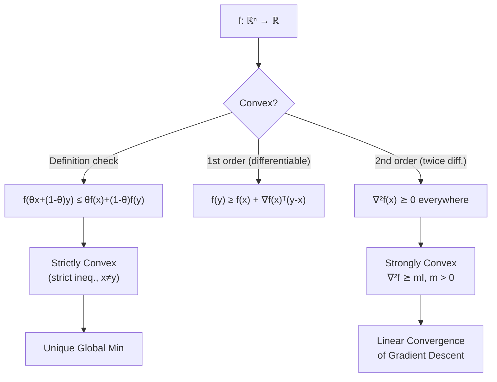

# 📈 Convex Functions

> [!abstract] TL;DR
> A function is convex if its graph "curves upward" — formally, the chord between any two points lies above the graph. The first-order condition says the tangent plane is a global underestimator; the second-order condition says the Hessian is positive semidefinite. Strong convexity (quadratic lower bound) is what gives gradient-based algorithms their linear convergence rate guarantees.

## Intuition — analogy FIRST

Think of a bowl: no matter where you place a marble inside it, it rolls to the bottom. That is convexity. A bowl with bumps inside it (like a mountain range) is non-convex — the marble might get trapped in a valley. The key insight is that for a convex bowl, the tangent plane at any point lies entirely below the bowl's surface — so the gradient always points away from the minimum, giving you a reliable descent direction.

---

## How It Works



## Key Concepts / Details

### Formal Definition

$f: \mathbb{R}^n \to \mathbb{R}$ is **convex** if $\text{dom}(f)$ is a convex set and for all $x, y \in \text{dom}(f)$, $\theta \in [0,1]$:

$$f(\theta x + (1-\theta)y) \leq \theta f(x) + (1-\theta)f(y)$$

### First-Order Condition (Differentiable $f$)

$f$ is convex if and only if $\text{dom}(f)$ is convex and for all $x, y \in \text{dom}(f)$:

$$f(y) \geq f(x) + \nabla f(x)^\top (y - x)$$

The tangent plane (first-order Taylor approximation) is a **global underestimator**. This is the property that makes gradient descent sensible: the gradient at $x^*$ is zero, so the tangent plane is flat — and it lies below $f$ everywhere, confirming $x^*$ is a global minimum.

### Second-Order Condition (Twice Differentiable $f$)

$f$ is convex if and only if for all $x \in \text{dom}(f)$:

$$\nabla^2 f(x) \succeq 0 \quad \text{(positive semidefinite Hessian)}$$

### Strict, Strong, and Quasi-Convexity

| Class | Condition | Implication |
|-------|-----------|-------------|
| Convex | $\nabla^2 f \succeq 0$ | Global min exists (if coercive) |
| Strictly convex | Strict ineq. in definition for $x \neq y$ | Unique global minimizer |
| Strongly convex ($m > 0$) | $\nabla^2 f \succeq mI$ (equiv: $f - \frac{m}{2}\|x\|^2$ convex) | Linear convergence for GD |
| Quasi-convex | Sublevel sets $\{x \mid f(x) \leq \alpha\}$ are convex | Local min is global, not vice versa |

**Strongly convex** with parameter $m > 0$ means:

$$f(y) \geq f(x) + \nabla f(x)^\top (y-x) + \frac{m}{2}\|y-x\|^2$$

This gives a **quadratic lower bound** — the function curves up at least as fast as a parabola. Equivalent to $\nabla^2 f(x) \succeq mI$ for all $x$.

### Jensen's Inequality

For convex $f$ and random variable $X$:

$$f\!\left(\mathbb{E}[X]\right) \leq \mathbb{E}[f(X)]$$

Proof: apply the first-order condition with $y = \mathbb{E}[X]$ and integrate. See [[Jensen_and_Inequalities]] for applications.

### Common Convex and Concave Functions

| Function | Domain | Convex / Concave? |
|----------|--------|-------------------|
| $\|x\|_p$ for $p \geq 1$ | $\mathbb{R}^n$ | Convex |
| $x^2$, $x^{2k}$ | $\mathbb{R}$ | Convex |
| $e^{ax}$ | $\mathbb{R}$ | Convex |
| $-\log x$ | $\mathbb{R}_{++}$ | Convex |
| $x \log x$ | $\mathbb{R}_{++}$ | Convex |
| $\max(x_1, \ldots, x_n)$ | $\mathbb{R}^n$ | Convex |
| $\log\!\sum_i e^{x_i}$ (log-sum-exp) | $\mathbb{R}^n$ | Convex |
| $x^\top A x$ for $A \succeq 0$ | $\mathbb{R}^n$ | Convex |
| $\log x$ | $\mathbb{R}_{++}$ | Concave |
| $\sqrt{x}$ | $\mathbb{R}_{+}$ | Concave |
| $-\sum p_i \log p_i$ (entropy) | Simplex | Concave |
| $\sin x$ | $\mathbb{R}$ | Neither |

### Operations Preserving Convexity

- **Nonneg weighted sum**: $\sum_i w_i f_i$ with $w_i \geq 0$
- **Affine composition**: $f(Ax + b)$ is convex if $f$ is convex
- **Pointwise max**: $\sup_{\alpha \in \mathcal{A}} f_\alpha(x)$ (used to define support functions)
- **Composition** $g(f(x))$: convex if $g$ convex nondecreasing and $f$ convex, or $g$ convex nonincreasing and $f$ concave
- **Partial minimization**: $g(x) = \inf_y f(x,y)$ is convex if $f$ is convex (very useful in duality)

### Python: Verifying Convexity via Second-Order Condition

```python
import numpy as np

def check_convexity_second_order(hessian_fn, x_samples):
    """
    Check if ∇²f(x) ⪰ 0 at all sample points.
    hessian_fn: callable(x) -> ndarray (n x n Hessian matrix)
    x_samples: list of points to check
    Returns: (is_convex, min_eigenvalue_seen)
    """
    min_eig = float('inf')
    for x in x_samples:
        H = hessian_fn(x)
        eigvals = np.linalg.eigvalsh(H)  # symmetric matrix eigenvalues
        min_eig = min(min_eig, eigvals.min())
    return min_eig >= -1e-8, min_eig  # small tolerance for numerics

# Example 1: f(x) = x^2 (convex, Hessian = 2)
hess_quadratic = lambda x: np.array([[2.0]])
samples_1d = [np.array([v]) for v in np.linspace(-5, 5, 20)]
convex, min_ev = check_convexity_second_order(hess_quadratic, samples_1d)
print(f"x^2 convex: {convex}, min eigenvalue: {min_ev:.4f}")  # True, 2.0

# Example 2: f(x,y) = x^2 + xy + y^2 (PSD Hessian?)
def hess_quadratic_2d(x):
    # f = x^2 + xy + y^2, Hessian = [[2, 1], [1, 2]]
    return np.array([[2.0, 1.0], [1.0, 2.0]])

samples_2d = [np.random.randn(2) for _ in range(20)]
convex2, min_ev2 = check_convexity_second_order(hess_quadratic_2d, samples_2d)
print(f"x^2+xy+y^2 convex: {convex2}, min eigenvalue: {min_ev2:.4f}")  # True, 1.0

# Example 3: f(x,y) = x^2 - y^2 (saddle point, indefinite Hessian)
def hess_saddle(x):
    return np.array([[2.0, 0.0], [0.0, -2.0]])

convex3, min_ev3 = check_convexity_second_order(hess_saddle, samples_2d)
print(f"x^2 - y^2 convex: {convex3}, min eigenvalue: {min_ev3:.4f}")  # False, -2.0
```

## Real-World Notes

- The cross-entropy loss $-\sum y_i \log \hat{p}_i$ is convex in the logit parameters (for softmax output), enabling globally optimal logistic regression.
- Strong convexity with parameter $m$ and $L$-smoothness together give gradient descent a convergence rate of $(1 - m/L)^k$ — the **condition number** $L/m$ governs speed.
- Neural network losses are highly non-convex, which is why deep learning requires tricks like momentum, learning-rate schedules, and batch normalization.
- The log-sum-exp function $\log \sum e^{x_i}$ is both convex and a smooth approximation to $\max$, widely used in probabilistic models (log-partition function).
- Convexity of the KL divergence (in joint distribution) is the reason EM algorithm decreases KL at each step.

## Common Pitfalls

- Confusing **strictly convex** ($\nabla^2 f \succ 0$) with **strongly convex** ($\nabla^2 f \succeq mI$) — strictly convex does not imply strongly convex (e.g., $e^{-x}$ is strictly convex but not strongly convex on $\mathbb{R}$).
- Forgetting that $\nabla^2 f \succeq 0$ is sufficient but the condition is at all $x$ in $\text{dom}(f)$, not just at the optimum.
- Assuming composition of convex functions is convex — it requires monotonicity conditions on the outer function.
- Treating quasi-convex as convex — quasi-convex functions can have local minima that aren't global.
- Ignoring domain convexity in the definition — $f(x) = 1/x$ has $f'' > 0$ on $(0,\infty)$ and is convex there, but is not defined on all of $\mathbb{R}$.

## Related Concepts

- [[Convex_Sets]] — epigraph characterization: $f$ is convex iff $\text{epi}(f)$ is a convex set
- [[Optimality_Conditions]] — first-order optimality derives from the tangent-plane underestimator property
- [[Jensen_and_Inequalities]] — Jensen's inequality is the probabilistic restatement of convexity
- [[Duality_Theory]] — convexity of the dual function follows from pointwise infimum of affine functions

## Review Questions

1. Prove that $f(x) = \log(\sum_{i=1}^n e^{x_i})$ is convex by computing its Hessian and showing it is PSD.
2. What is the difference between a strictly convex and a strongly convex function? Give an example of each and one that is strictly but not strongly convex.
3. Show that the pointwise maximum of finitely many convex functions is convex.

## Sources

- Boyd, S. & Vandenberghe, L. — *Convex Optimization* (2004), Chapter 3
- Nesterov, Y. — *Lectures on Convex Optimization* (2018), Chapter 1
- Nocedal, J. & Wright, S. — *Numerical Optimization* (2006), Appendix A

#optimization #convex-fundamentals #beginner
