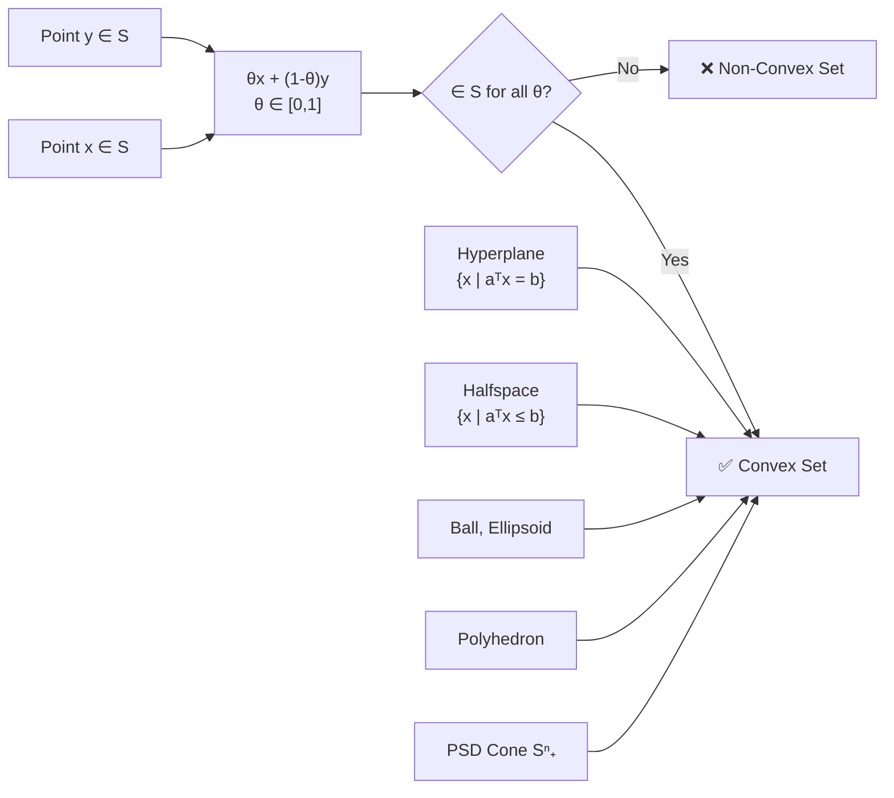

# 🔷 Convex Sets

> [!abstract] TL;DR
> A set is convex if the line segment between any two points in it stays entirely inside it. This single geometric property unlocks powerful theorems — supporting and separating hyperplanes — that form the backbone of duality theory and optimality conditions. Convex sets are closed under intersection and affine maps, making them composable building blocks for feasible regions.

## Intuition — analogy FIRST

Imagine a city where every pair of buildings is connected by a straight road that never leaves city limits. That is a convex city. A city with a hole in the middle (like a donut-shaped park) is non-convex — two buildings on opposite sides of the hole require a path that exits the "line segment" between them. Optimization on convex domains is tractable for exactly this reason: you can always move in a straight line toward the optimum without leaving the feasible region.

---

## How It Works



## Key Concepts / Details

### Formal Definition

A set $S \subseteq \mathbb{R}^n$ is **convex** if for all $x, y \in S$ and $\theta \in [0,1]$:

$$\theta x + (1-\theta)y \in S$$

Equivalently, $S$ contains every convex combination of its points.

### Common Convex Sets

| Set | Definition | Notes |
|-----|------------|-------|
| Hyperplane | $\{x \mid a^\top x = b\}$ | Both convex and affine |
| Halfspace | $\{x \mid a^\top x \leq b\}$ | Closed halfspace; fundamental building block |
| Euclidean ball | $\{x \mid \|x - x_c\|_2 \leq r\}$ | Also written $B(x_c, r)$ |
| Ellipsoid | $\{x \mid (x-x_c)^\top P^{-1}(x-x_c) \leq 1\}$, $P \succ 0$ | Generalization of ball |
| Polyhedron | $\{x \mid Ax \leq b, Cx = d\}$ | Finite intersection of halfspaces |
| Norm ball | $\{x \mid \|x\|_p \leq 1\}$ for any $p \geq 1$ | Non-convex for $p < 1$ |
| PSD cone $\mathbb{S}^n_+$ | $\{X \in \mathbb{S}^n \mid X \succeq 0\}$ | Key for SDP |

### Operations Preserving Convexity

- **Intersection**: if $S_1, S_2$ convex, then $S_1 \cap S_2$ convex (arbitrary intersections)
- **Affine image**: $f(S) = \{f(x) \mid x \in S\}$ where $f(x) = Ax+b$ is convex
- **Affine preimage**: $f^{-1}(S) = \{x \mid f(x) \in S\}$ with $f$ affine is convex
- **Perspective map**: $P(x,t) = x/t$ preserves convexity
- **Cartesian product**: $S_1 \times S_2$ is convex if both factors are

### Convex Hull

The **convex hull** of a set $S$, denoted $\text{conv}(S)$, is the smallest convex set containing $S$:

$$\text{conv}(S) = \left\{\sum_{i=1}^k \theta_i x_i \;\Bigg|\; x_i \in S,\; \theta_i \geq 0,\; \sum \theta_i = 1 \right\}$$

**Carathéodory's theorem**: Any point in $\text{conv}(S) \subseteq \mathbb{R}^n$ can be expressed as a convex combination of at most $n+1$ points from $S$.

### Cones

$C$ is a **cone** if $x \in C \Rightarrow \alpha x \in C$ for all $\alpha \geq 0$. A **convex cone** is both convex and a cone.

| Cone | Definition | Application |
|------|------------|-------------|
| Nonneg orthant $\mathbb{R}^n_+$ | $\{x \mid x_i \geq 0\}$ | LP constraints |
| Second-order cone (SOC) | $\{(x,t) \mid \|x\|_2 \leq t\}$ | SOCP |
| PSD cone $\mathbb{S}^n_+$ | $\{X \mid X \succeq 0\}$ | SDP |
| Exponential cone | $\{(x,y,z) \mid ye^{x/y} \leq z, y>0\}$ | Entropy programs |

### Hyperplane Theorems

**Supporting hyperplane theorem**: If $x_0$ is on the boundary of a convex set $C$, then there exists $a \neq 0$ such that:
$$a^\top x \leq a^\top x_0 \quad \forall x \in C$$

**Separating hyperplane theorem**: If $C$ and $D$ are disjoint convex sets, there exists $a \neq 0$, $b$ such that:
$$a^\top x \leq b \;\; \forall x \in C \quad \text{and} \quad a^\top x \geq b \;\; \forall x \in D$$

### Python: Checking Convexity by Sampling

```python
import numpy as np

def is_convex_set_sampled(membership_fn, n_samples=1000, dim=2, seed=42):
    """
    Approximate convexity check: sample pairs of points in the set,
    verify midpoints are also in the set.
    membership_fn: callable(x) -> bool
    """
    rng = np.random.default_rng(seed)
    points_in_set = []

    # Generate candidate points and keep those in the set
    candidates = rng.uniform(-3, 3, size=(5000, dim))
    for p in candidates:
        if membership_fn(p):
            points_in_set.append(p)
        if len(points_in_set) >= n_samples:
            break

    if len(points_in_set) < 2:
        return True  # trivially convex

    # Check random pairs
    violations = 0
    for _ in range(n_samples):
        i, j = rng.integers(0, len(points_in_set), size=2)
        x, y = points_in_set[i], points_in_set[j]
        theta = rng.uniform(0, 1)
        midpoint = theta * x + (1 - theta) * y
        if not membership_fn(midpoint):
            violations += 1

    return violations == 0, violations

# Example: unit L2 ball (convex)
ball = lambda x: np.linalg.norm(x) <= 1.0
print("L2 ball convex:", is_convex_set_sampled(ball))

# Example: annulus {x | 0.5 <= ||x|| <= 1} (non-convex)
annulus = lambda x: 0.5 <= np.linalg.norm(x) <= 1.0
print("Annulus convex:", is_convex_set_sampled(annulus))
```

## Real-World Notes

- Feasible regions of linear programs are polyhedra — convex sets — which is why simplex and interior point methods work globally.
- Constraint sets in support vector machines are intersections of halfspaces; convexity guarantees the QP has a unique solution.
- The PSD cone $\mathbb{S}^n_+$ is the feasible region for semidefinite programs (SDP), enabling convex relaxations of combinatorial problems.
- Convexity is NOT closed under union — the union of two convex sets is generally not convex. This is why OR constraints break convexity.
- The perspective map preserving convexity is the foundation of projective transformations used in computer vision homographies.

## Common Pitfalls

- Confusing **convex** with **connected** — a set can be path-connected but not convex (e.g., an L-shaped region).
- Forgetting that the **empty set** and **singleton** are trivially convex — useful edge cases in proofs.
- Assuming union preserves convexity — it does NOT. Only intersection does (among the basic set operations).
- Thinking the norm ball is non-convex for $p < 1$ — the $\ell_p$ "ball" for $0 < p < 1$ is actually star-shaped but not convex.
- Overlooking that affine subspaces (hyperplanes) are convex — they are, and they are the boundary case between open and closed halfspaces.

## Related Concepts

- [[Convex_Functions]] — functions whose epigraphs are convex sets
- [[Duality_Theory]] — separating hyperplane theorem is the geometric foundation of duality
- [[Optimality_Conditions]] — supporting hyperplane at optimum gives KKT conditions
- [[Jensen_and_Inequalities]] — Jensen requires a convex function over a convex domain

## Review Questions

1. Prove that the intersection of an arbitrary collection of convex sets is convex. Where does the proof fail for unions?
2. Show that the set $\{(x, t) \mid \|x\|_2 \leq t\}$ (the second-order cone) is a convex cone.
3. State the separating hyperplane theorem. Why does it fail when the sets are not convex? Give a counterexample.

## Sources

- Boyd, S. & Vandenberghe, L. — *Convex Optimization* (2004), Chapter 2
- Rockafellar, R.T. — *Convex Analysis* (1970)
- Bertsekas, D. — *Convex Optimization Theory* (2009), Chapter 1

#optimization #convex-fundamentals #beginner
