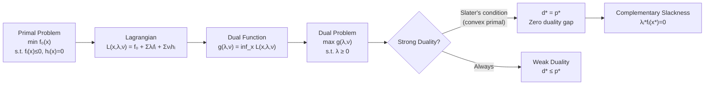

# ⚖️ Duality Theory

> [!abstract] TL;DR
> The Lagrangian converts a constrained optimization problem into an unconstrained one by penalizing constraint violations — the dual function is its worst-case lower bound on the primal objective. Strong duality (zero gap between primal and dual optima) holds for convex problems satisfying Slater's condition, and complementary slackness reveals which constraints are active at the solution. Dual variables are the shadow prices of relaxing constraints.

## Intuition — analogy FIRST

Imagine you are a factory manager (primal problem: minimize cost subject to resource constraints). A regulator offers to buy any unused resources from you at prices $\lambda_i$ per unit. Now you can "sell" the resources instead of using them, and the regulator's pricing creates a Lagrangian trade-off. The dual problem asks: what prices should the regulator set to maximize revenue while always giving you at least as good a deal as solving the original problem? If prices are set fairly (Slater's condition holds), the regulator's best revenue exactly equals your minimum cost — that is strong duality.

---

## How It Works



## Key Concepts / Details

### The Primal Problem

Standard form of the primal optimization problem:

$$\begin{aligned}
\text{minimize} \quad & f_0(x) \\
\text{subject to} \quad & f_i(x) \leq 0, \quad i = 1, \ldots, m \\
& h_i(x) = 0, \quad i = 1, \ldots, p
\end{aligned}$$

Optimal value: $p^* = \inf\{f_0(x) \mid f_i(x) \leq 0,\, h_i(x) = 0\}$

### The Lagrangian

$$L(x, \lambda, \nu) = f_0(x) + \sum_{i=1}^m \lambda_i f_i(x) + \sum_{i=1}^p \nu_i h_i(x)$$

- $\lambda \in \mathbb{R}^m$, $\lambda \geq 0$: **dual variables** / Lagrange multipliers for inequality constraints
- $\nu \in \mathbb{R}^p$ (unrestricted): multipliers for equality constraints
- For feasible $x$ and $\lambda \geq 0$: $L(x,\lambda,\nu) \leq f_0(x)$ (since $\lambda_i f_i(x) \leq 0$ and $\nu_i h_i(x) = 0$)

### The Dual Function

$$g(\lambda, \nu) = \inf_{x \in \mathcal{D}} L(x, \lambda, \nu)$$

**Key properties**:
1. **Always concave** (pointwise infimum of affine functions in $(\lambda,\nu)$), even if the primal is non-convex
2. **Lower bound on $p^*$**: for any $\lambda \geq 0$ and any $\nu$: $g(\lambda, \nu) \leq p^*$

### Weak and Strong Duality

| Property | Statement | When it holds |
|----------|-----------|---------------|
| **Weak duality** | $d^* \leq p^*$ | Always (any optimization problem) |
| **Strong duality** | $d^* = p^*$ (zero duality gap) | Convex primal + Slater's condition |
| **Duality gap** | $p^* - d^* \geq 0$ | Defined as this quantity |

**Slater's condition**: There exists a strictly feasible point $\hat{x} \in \text{relint}(\mathcal{D})$ with $f_i(\hat{x}) < 0$ for all $i$ (strict inequality for inequality constraints; equalities must still hold). For convex problems, Slater's condition is sufficient for strong duality.

### Complementary Slackness

At primal-dual optimality $(x^*, \lambda^*, \nu^*)$ under strong duality:

$$\lambda_i^* f_i(x^*) = 0 \quad \forall i = 1, \ldots, m$$

This means for each constraint:
- Either the constraint is **active**: $f_i(x^*) = 0$ (constraint is tight), or
- The multiplier is **zero**: $\lambda_i^* = 0$ (constraint is not binding)

**Interpretation**: You only "pay" for constraints you are bumping up against.

### KKT Conditions (Preview)

For convex primal under strong duality, the KKT conditions are necessary and sufficient:

$$\begin{aligned}
\nabla f_0(x^*) + \sum_i \lambda_i^* \nabla f_i(x^*) + \sum_i \nu_i^* \nabla h_i(x^*) &= 0 \quad \text{(stationarity)} \\
f_i(x^*) &\leq 0 \quad \text{(primal feasibility)} \\
h_i(x^*) &= 0 \quad \text{(primal feasibility)} \\
\lambda_i^* &\geq 0 \quad \text{(dual feasibility)} \\
\lambda_i^* f_i(x^*) &= 0 \quad \text{(complementary slackness)}
\end{aligned}$$

### Economic Interpretation

$\lambda_i^*$ is the **shadow price** (marginal value) of relaxing constraint $i$:
$$\frac{\partial p^*}{\partial b_i} \approx -\lambda_i^* \quad \text{(for constraint } f_i(x) \leq b_i\text{)}$$

Doubling a resource with positive shadow price improves the objective by $\approx \lambda_i^*$ per unit.

### Geometric Interpretation

The dual function $g(\lambda, \nu)$ represents a family of **supporting hyperplanes** to the epigraph of $f_0$ restricted to the feasible set. Strong duality says the tightest supporting hyperplane is tangent at $p^*$.

### Python: Setting Up and Solving a QP and Its Dual

```python
import numpy as np
from scipy.optimize import minimize, LinearConstraint

# Primal QP: minimize (1/2)xᵀPx + qᵀx  s.t. Ax ≤ b
# P = [[2,0],[0,4]], q = [-4, -6], A = [[1,1]], b = [3]
# i.e.: min x1^2 + 2x2^2 - 4x1 - 6x2  s.t. x1 + x2 <= 3

P = np.array([[2.0, 0.0], [0.0, 4.0]])
q = np.array([-4.0, -6.0])
A = np.array([[1.0, 1.0]])
b = np.array([3.0])

def primal_obj(x):
    return 0.5 * x @ P @ x + q @ x

def primal_grad(x):
    return P @ x + q

constraint = LinearConstraint(A, lb=-np.inf, ub=b)
result = minimize(primal_obj, x0=np.zeros(2), jac=primal_grad,
                  constraints=constraint, method='SLSQP')
x_star = result.x
p_star = result.fun
print(f"Primal solution: x* = {x_star}, p* = {p_star:.4f}")

# Lagrangian: L(x, λ) = (1/2)xᵀPx + qᵀx + λ(Ax - b)
# Dual function: g(λ) = inf_x L(x, λ)
# Minimizing over x: Px + q + Aᵀλ = 0 → x(λ) = -P⁻¹(q + Aᵀλ)
# g(λ) = -(1/2)(q + Aᵀλ)ᵀ P⁻¹ (q + Aᵀλ) - bᵀλ

def dual_fn(lam):
    lam = np.atleast_1d(lam)
    r = q + A.T @ lam          # = q + Aᵀλ
    P_inv_r = np.linalg.solve(P, r)
    return 0.5 * r @ P_inv_r - b @ lam  # negate for minimization

# Maximize g(λ) s.t. λ >= 0  (dual problem)
dual_result = minimize(lambda l: -dual_fn(l), x0=np.array([0.0]),
                       bounds=[(0, None)], method='L-BFGS-B')
lam_star = dual_result.x
d_star = dual_fn(lam_star)

print(f"Dual solution: λ* = {lam_star}, d* = {d_star:.4f}")
print(f"Duality gap: {p_star - d_star:.6f}")  # Should be ~0 (strong duality)

# Complementary slackness check
constraint_value = A @ x_star - b
print(f"Constraint value Ax*-b = {constraint_value}")
print(f"λ*(Ax*-b) = {lam_star * constraint_value}")  # Should be ~0
```

## Real-World Notes

- SVM training is solved via its dual: the primal maximizes margin, the dual finds support vectors (points with $\lambda_i > 0$). The dual is often smaller dimensional.
- LP duality is used in economics to price resources (shadow prices) and in operations research to certify optimality without solving the primal.
- The dual of a max-flow problem is a min-cut problem (max-flow min-cut theorem) — a direct consequence of LP strong duality.
- Interior point methods solve primal and dual simultaneously, using the duality gap $p^* - d^*$ as a stopping criterion.
- Duality is used to prove convergence of ADMM (alternating direction method of multipliers) — the algorithm minimizes the augmented Lagrangian.

## Common Pitfalls

- Forgetting $\lambda \geq 0$ in the dual problem — equality constraint multipliers $\nu$ are unrestricted in sign.
- Assuming strong duality holds automatically for convex problems — Slater's condition (or another constraint qualification) is required.
- Confusing the duality gap $p^* - d^* \geq 0$ with $d^* - p^*$ — the gap is always non-negative (primal $\geq$ dual).
- Treating the dual function as the dual problem — the dual function $g(\lambda, \nu)$ is just the objective; the dual problem is maximizing $g$ over $\lambda \geq 0$.
- Overlooking complementary slackness as a diagnostic: if $\lambda_i^* > 0$ then $f_i(x^*) = 0$ must hold exactly — useful for checking solver output.

## Related Concepts

- [[Convex_Sets]] — separating hyperplane theorem is the geometric foundation of weak duality
- [[Convex_Functions]] — dual function is always concave (pointwise infimum of affines)
- [[Optimality_Conditions]] — KKT conditions combine primal optimality with dual feasibility
- [[Jensen_and_Inequalities]] — convexity of primal ensures tractability; Jensen underlies many dual bound derivations

## Review Questions

1. Prove weak duality: show that $g(\lambda, \nu) \leq p^*$ for all $\lambda \geq 0$ and all $\nu$.
2. State Slater's condition. Give an example of a convex problem where strong duality fails without it.
3. In the QP example above, identify which constraint is active at $x^*$ using complementary slackness. What does $\lambda^* > 0$ tell you about the optimal solution?

## Sources

- Boyd, S. & Vandenberghe, L. — *Convex Optimization* (2004), Chapter 5
- Bertsekas, D. — *Nonlinear Programming* (3rd ed., 2016), Chapter 6
- Nocedal, J. & Wright, S. — *Numerical Optimization* (2006), Chapter 12

#optimization #convex-fundamentals #advanced
