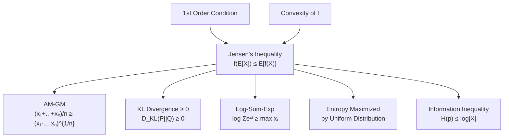

# 📊 Jensen's Inequality and Key Inequalities

> [!abstract] TL;DR
> Jensen's inequality — $f(\mathbb{E}[X]) \leq \mathbb{E}[f(X)]$ for convex $f$ — is the probabilistic face of convexity and generates most of the fundamental inequalities in analysis, probability, and information theory. From AM-GM to KL divergence non-negativity to log-sum-exp being a soft maximum, Jensen is the engine that connects convex functions to bounds that appear throughout machine learning and statistics.

## Intuition — analogy FIRST

Imagine a trampoline (a convex surface). If you place a heavy ball at the average position of several point masses distributed on the trampoline, the ball sinks below the average height of the point masses. That is Jensen: the function value at the average is below the average of function values. For a concave surface (like a bowl turned upside down), the opposite holds — the ball rises above. This one geometric fact cascades into virtually every classical inequality.

---

## How It Works



## Key Concepts / Details

### Jensen's Inequality: Statement and Proof

**Theorem**: If $f$ is convex and $X$ is a random variable with $\mathbb{E}[|X|] < \infty$, then:
$$f\!\left(\mathbb{E}[X]\right) \leq \mathbb{E}[f(X)]$$

For concave $f$, the inequality reverses: $f(\mathbb{E}[X]) \geq \mathbb{E}[f(X)]$.

**Proof** (via first-order condition): Let $\mu = \mathbb{E}[X]$. Since $f$ is convex, for all $x$:
$$f(x) \geq f(\mu) + f'(\mu)(x - \mu)$$
Taking expectation of both sides:
$$\mathbb{E}[f(X)] \geq f(\mu) + f'(\mu)(\mathbb{E}[X] - \mu) = f(\mu) = f(\mathbb{E}[X]) \quad \square$$

**Discrete form**: For $x_1, \ldots, x_n$ and weights $\theta_i \geq 0$, $\sum \theta_i = 1$:
$$f\!\left(\sum_i \theta_i x_i\right) \leq \sum_i \theta_i f(x_i)$$

### Application 1: AM-GM Inequality

The **arithmetic mean – geometric mean inequality**:
$$\frac{x_1 + \cdots + x_n}{n} \geq (x_1 \cdot x_2 \cdots x_n)^{1/n} \quad (x_i > 0)$$

**Proof via Jensen**: Apply Jensen to the concave function $f(x) = \log x$ with uniform weights $\theta_i = 1/n$:
$$\log\!\left(\frac{\sum x_i}{n}\right) \geq \frac{1}{n}\sum \log x_i = \frac{1}{n} \log\!\left(\prod x_i\right) = \log\!\left(\prod x_i\right)^{1/n}$$
Since $\log$ is increasing, AM $\geq$ GM. $\square$

### Application 2: Log-Sum-Exp as Soft Maximum

The **log-sum-exp** function:
$$\text{LSE}(x) = \log\!\left(\sum_{i=1}^n e^{x_i}\right)$$

**Properties**:
- Convex (Hessian is PSD)
- $\text{LSE}(x) \geq \max_i x_i$ (soft maximum): since $e^{x_j} \leq \sum_i e^{x_i}$ gives $x_j \leq \text{LSE}(x)$
- $\text{LSE}(x) \leq \max_i x_i + \log n$ (tight approximation for large spreads)

**Jensen connection**: The softmax probabilities $p_i = e^{x_i}/\sum_j e^{x_j}$ are a probability distribution, and:
$$\text{LSE}(x) = \log \mathbb{E}_{i \sim p}[e^{x_i} / p_i] \geq \mathbb{E}_{i \sim p}[\log(e^{x_i}/p_i)]$$

### Application 3: KL Divergence is Non-Negative

The **KL divergence** (relative entropy):
$$D_{\text{KL}}(P \| Q) = \mathbb{E}_P\!\left[\log \frac{P(X)}{Q(X)}\right] = \sum_x P(x) \log \frac{P(x)}{Q(x)} \geq 0$$

**Proof via Jensen**: $-\log$ is convex. Apply Jensen to $-\log(Q(X)/P(X))$ under measure $P$:
$$D_{\text{KL}}(P\|Q) = \mathbb{E}_P[-\log(Q/P)] \geq -\log\!\left(\mathbb{E}_P[Q(X)/P(X)]\right) = -\log(1) = 0 \quad \square$$

Equality holds iff $P = Q$.

### Application 4: Entropy Maximized by Uniform

For discrete $X$ on $|\mathcal{X}|$ outcomes, entropy $H(p) = -\sum p_i \log p_i$ satisfies:
$$H(p) \leq \log |\mathcal{X}|$$
with equality iff $p$ is uniform.

**Proof**: $D_{\text{KL}}(P \| U) \geq 0$ where $U$ is uniform (each probability $1/|\mathcal{X}|$):
$$\sum p_i \log(p_i \cdot |\mathcal{X}|) \geq 0 \;\Rightarrow\; \sum p_i \log p_i \geq -\log|\mathcal{X}| \;\Rightarrow\; H(p) \leq \log|\mathcal{X}|$$

### Young's Inequality

For $a, b \geq 0$ and conjugate exponents $p, q > 1$ with $\tfrac{1}{p} + \tfrac{1}{q} = 1$:
$$ab \leq \frac{a^p}{p} + \frac{b^q}{q}$$

**Proof**: Apply Jensen to $f(t) = e^t$ (convex) with weights $1/p, 1/q$:
$$e^{\frac{\log a^p}{p} + \frac{\log b^q}{q}} \leq \frac{1}{p}e^{\log a^p} + \frac{1}{q}e^{\log b^q} = \frac{a^p}{p} + \frac{b^q}{q}$$

The left side equals $ab$. $\square$ Young's inequality yields Hölder's and, by integration, Minkowski's inequality.

### Norm Inequalities and Optimization Implications

For $x \in \mathbb{R}^n$:
$$\|x\|_\infty \leq \|x\|_2 \leq \|x\|_1 \leq \sqrt{n}\|x\|_2 \leq n\|x\|_\infty$$

| Inequality | Optimization implication |
|------------|--------------------------|
| $\|x\|_1 \geq \|x\|_2$ | L1 ball is smaller: tighter sparsity constraints |
| $\|x\|_2^2 \leq \|x\|_1^2$ | L2 regularization penalizes large gradients less |
| Cauchy-Schwarz: $|a^\top b| \leq \|a\|_2\|b\|_2$ | Gradient convergence bounds |

### Lipschitz Continuity and Smoothness

- $f$ is **$L$-Lipschitz**: $|f(x) - f(y)| \leq L\|x-y\|$ for all $x, y$
- $f$ is **$L$-smooth**: $\|\nabla f(x) - \nabla f(y)\| \leq L\|x-y\|$ (Lipschitz gradient)
- Strong convexity with $m$ + $L$-smoothness: condition number $\kappa = L/m$ governs convergence rate $\mathcal{O}((1-1/\kappa)^k)$

**Jensen connection**: For $L$-smooth convex $f$:
$$f(y) \leq f(x) + \nabla f(x)^\top(y-x) + \frac{L}{2}\|y-x\|^2$$
This is an **upper bound** counterpart to the lower bound from convexity — together they "sandwich" $f$.

### Python: Demonstrating Jensen's Four Applications

```python
import numpy as np

rng = np.random.default_rng(42)

# --- Application 1: AM-GM ---
x = rng.uniform(0.1, 5.0, size=10)
am = x.mean()
gm = np.exp(np.log(x).mean())  # geometric mean via log trick
print(f"AM = {am:.4f}, GM = {gm:.4f}, AM >= GM: {am >= gm - 1e-10}")

# --- Application 2: Log-Sum-Exp >= max ---
scores = rng.randn(8)
lse = np.log(np.sum(np.exp(scores)))
max_score = scores.max()
print(f"LSE = {lse:.4f}, max = {max_score:.4f}, LSE >= max: {lse >= max_score - 1e-10}")

# --- Application 3: KL Divergence >= 0 ---
def kl_divergence(p, q):
    # Add small epsilon to avoid log(0)
    eps = 1e-12
    p, q = np.asarray(p) + eps, np.asarray(q) + eps
    p, q = p / p.sum(), q / q.sum()  # normalize
    return np.sum(p * np.log(p / q))

p = rng.dirichlet(np.ones(6))  # random distribution
q = rng.dirichlet(np.ones(6))  # another distribution
uniform = np.ones(6) / 6
print(f"KL(P||Q) = {kl_divergence(p, q):.4f} (>= 0: {kl_divergence(p, q) >= 0})")
print(f"KL(P||P) = {kl_divergence(p, p):.6f} (should be ~0)")

# --- Application 4: Entropy <= log|X| ---
def entropy(p):
    eps = 1e-12
    p = np.asarray(p) + eps
    p = p / p.sum()
    return -np.sum(p * np.log(p))

n = 6
H_p = entropy(p)
H_max = np.log(n)
H_uniform = entropy(uniform)
print(f"H(p) = {H_p:.4f}, H(uniform) = {H_uniform:.4f}, log|X| = {H_max:.4f}")
print(f"H(p) <= log|X|: {H_p <= H_max + 1e-10}")
print(f"H(uniform) = log|X|: {abs(H_uniform - H_max) < 1e-10}")

# --- Jensen directly: f(E[X]) <= E[f(X)] for f = exp (convex) ---
X = rng.randn(10000)
f = np.exp
lhs = f(np.mean(X))          # f(E[X])
rhs = np.mean(f(X))          # E[f(X)]
print(f"\nJensen for exp: f(E[X]) = {lhs:.4f}, E[f(X)] = {rhs:.4f}, LHS <= RHS: {lhs <= rhs}")
```

## Real-World Notes

- Log-sum-exp is the **log-partition function** in statistical physics and probabilistic graphical models; computing it stably requires the "log-sum-exp trick" (subtract max before exponentiating).
- KL divergence non-negativity is used to prove that EM (Expectation-Maximization) increases the log-likelihood at each step: the E-step minimizes KL, the M-step maximizes the lower bound.
- Jensen's inequality explains why the expected log-likelihood is always $\leq$ the log of the expected likelihood — the basis of the ELBO in variational inference.
- AM-GM is used in optimization to bound products by sums, enabling telescoping arguments in convergence proofs.
- Lipschitz constants and smoothness parameters appear in every convergence rate theorem for first-order methods (gradient descent, SGD, Adam).

## Common Pitfalls

- Applying Jensen with the wrong direction — Jensen gives $f(\mathbb{E}) \leq \mathbb{E}[f]$ for **convex** $f$; for **concave** $f$ (like $\log$) the inequality reverses.
- Forgetting integrability conditions — Jensen requires $\mathbb{E}[|X|] < \infty$ and the expectation to be in the domain of $f$.
- Confusing KL divergence asymmetry — $D_{\text{KL}}(P\|Q) \neq D_{\text{KL}}(Q\|P)$ in general; only the non-negativity of both is guaranteed.
- Misusing AM-GM on negative numbers — the inequality requires $x_i > 0$ (the geometric mean is undefined otherwise).
- Treating $L$-smooth as $L$-Lipschitz — smoothness is a condition on the gradient, not the function value; a smooth function can still grow unboundedly.

## Related Concepts

- [[Convex_Functions]] — Jensen is the probabilistic restatement of the chord-above-graph property
- [[Optimality_Conditions]] — sublevel sets and coercivity connect to the distribution of function values Jensen controls
- [[Duality_Theory]] — the dual function's concavity follows from Jensen applied to the infimum representation
- [[Convex_Sets]] — norm balls and their relationships are governed by the norm inequalities here

## Review Questions

1. Prove Jensen's inequality for the discrete case using only the definition of convexity (chord-above-graph). Then show it implies $D_{\text{KL}}(P\|Q) \geq 0$.
2. Show that $\log\text{-sum-exp}(x_1, \ldots, x_n) \geq \max_i x_i$ directly (without Jensen). What tightening bound holds?
3. State and prove Young's inequality using Jensen applied to $e^t$. Which pair of Hölder conjugates gives Cauchy-Schwarz?

## Sources

- Boyd, S. & Vandenberghe, L. — *Convex Optimization* (2004), Section 3.1
- Cover, T. & Thomas, J. — *Elements of Information Theory* (2006), Chapter 2
- Nesterov, Y. — *Lectures on Convex Optimization* (2018), Section 1.2

#optimization #convex-fundamentals #intermediate
