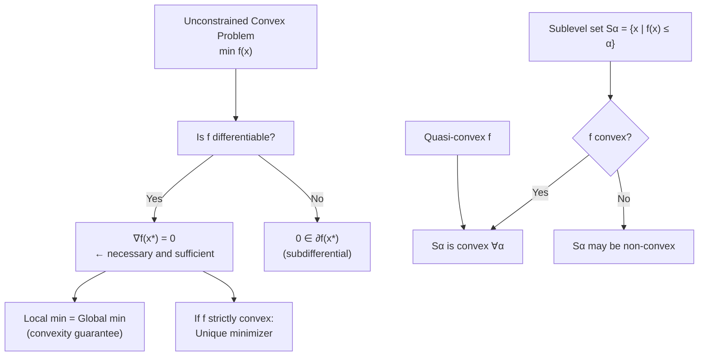

# 🎯 Optimality Conditions

> [!abstract] TL;DR
> For an unconstrained convex problem, a point is globally optimal if and only if its gradient is zero — any local minimum is automatically global. Sublevel sets of convex functions are convex, and their nested structure forms elliptical contours that guide gradient descent. The epigraph connects function convexity to set convexity, unifying analytic and geometric views.

## Intuition — analogy FIRST

Think of tightening a rubber band around a hill on a topographic map. For a convex mountain (like a perfect volcanic cone), the rubber band at each height forms a perfect oval — those are the sublevel sets. The lowest possible height where the band can sit (the valley floor) is the unique global minimum, and the rubber band shrinks to a point there. For a non-convex landscape with multiple valleys, the band might snap around the wrong peak — that is a local, not global, minimum.

---

## How It Works



## Key Concepts / Details

### Unconstrained Optimality

For **differentiable** $f$:

- $x^*$ is a **global minimum** of convex $f$ $\Leftrightarrow$ $\nabla f(x^*) = 0$
- $x^*$ is a **strict local minimum** $\Leftrightarrow$ $\nabla f(x^*) = 0$ AND $\nabla^2 f(x^*) \succ 0$

**Proof** of the first-order characterization: By the first-order condition for convex $f$:
$$f(y) \geq f(x^*) + \nabla f(x^*)^\top (y - x^*)$$
If $\nabla f(x^*) = 0$, then $f(y) \geq f(x^*)$ for all $y$ — so $x^*$ is a global minimum. Conversely, if $x^*$ is a local min, then by definition all directional derivatives are $\geq 0$, which for a differentiable function forces $\nabla f(x^*) = 0$.

**Derivation via directional derivative**: The directional derivative of $f$ at $x^*$ in direction $d$ is:
$$\nabla f(x^*)^\top d \geq 0 \quad \forall d \in \mathbb{R}^n$$
This can only hold for all directions $d$ and $-d$ simultaneously if $\nabla f(x^*) = 0$.

### Sublevel Sets

The **$\alpha$-sublevel set** of $f$ is:
$$S_\alpha = \{x \in \text{dom}(f) \mid f(x) \leq \alpha\}$$

**Theorem**: If $f$ is convex, every sublevel set $S_\alpha$ is convex.

**Proof**: Take $x, y \in S_\alpha$ (so $f(x) \leq \alpha$, $f(y) \leq \alpha$) and $\theta \in [0,1]$:
$$f(\theta x + (1-\theta)y) \leq \theta f(x) + (1-\theta)f(y) \leq \theta\alpha + (1-\theta)\alpha = \alpha$$
So $\theta x + (1-\theta)y \in S_\alpha$. $\square$

> The converse is FALSE — convex sublevel sets do not imply convex function. That is exactly quasi-convexity.

### Quasi-Convex Functions

$f$ is **quasi-convex** if all sublevel sets $S_\alpha$ are convex. Equivalently:
$$f(\theta x + (1-\theta)y) \leq \max(f(x), f(y)) \quad \forall x,y,\, \theta \in [0,1]$$

| Class | Sublevel sets | Global min = Local min? | Unique min? |
|-------|---------------|------------------------|-------------|
| Convex | Convex | Yes | Not always |
| Strictly convex | Convex | Yes | Yes |
| Quasi-convex | Convex | Yes (for unimodal) | Not guaranteed |
| Non-convex | May be non-convex | No | No |

**Examples of quasi-convex (but not convex) functions**:
- $\log x$ (actually concave, but all sub-level sets $\{x \mid \log x \leq c\}$ are convex rays)
- $\lfloor x \rfloor$ (floor function): sublevel sets are half-lines
- $f(x,y) = x \cdot y$ on $\mathbb{R}^2_{++}$: quasi-convex but not convex

### Epigraph

The **epigraph** of $f$ is:
$$\text{epi}(f) = \{(x, t) \in \mathbb{R}^{n+1} \mid f(x) \leq t\}$$

**Fundamental theorem**: $f$ is convex $\Leftrightarrow$ $\text{epi}(f)$ is a convex set.

This bridges analytic (function) and geometric (set) views of convexity. Minimizing $f$ is equivalent to finding the lowest point of $\text{epi}(f)$.

### Local vs Global Minima

For **convex $f$**: every local minimum is a global minimum.

**Proof by contradiction**: Suppose $x^*$ is a local min but not global. Then $\exists y$ with $f(y) < f(x^*)$. For small $\delta > 0$, consider $z = (1-\delta)x^* + \delta y$:
$$f(z) \leq (1-\delta)f(x^*) + \delta f(y) < f(x^*)$$
But $z$ is arbitrarily close to $x^*$ for small $\delta$ — contradicting $x^*$ being a local min. $\square$

For **strictly convex $f$**: the global minimizer is unique (if it exists).

### Coercivity and Existence of Minimum

$f$ is **coercive** if $f(x) \to \infty$ as $\|x\| \to \infty$.

**Weierstrass theorem (continuous version)**: A continuous coercive function on $\mathbb{R}^n$ attains its minimum.

> Coercivity rules out unbounded descent — e.g., $f(x) = e^{-x}$ on $\mathbb{R}$ is convex but has infimum 0, never attained.

### Python: Finding Minimum and Verifying First-Order Conditions

```python
import numpy as np
from scipy.optimize import minimize

# f(x) = (x1 - 2)^2 + (x2 + 1)^2: strongly convex, minimum at (2, -1)
def f(x):
    return (x[0] - 2)**2 + (x[1] + 1)**2

def grad_f(x):
    return np.array([2*(x[0] - 2), 2*(x[1] + 1)])

# Minimize using scipy
result = minimize(f, x0=np.array([0.0, 0.0]), jac=grad_f, method='L-BFGS-B')
x_star = result.x
print(f"Minimizer: {x_star}")          # [2. -1.]
print(f"Min value: {result.fun:.6f}")  # 0.000000

# Verify first-order condition: ∇f(x*) = 0
grad_at_opt = grad_f(x_star)
print(f"∇f(x*) = {grad_at_opt}")      # [0. 0.] ✓

# Verify sublevel sets are convex by checking two points in S_{alpha}
alpha = 5.0
x1, x2 = np.array([0.0, 0.0]), np.array([4.0, -2.0])
assert f(x1) <= alpha and f(x2) <= alpha  # both in sublevel set
for theta in np.linspace(0, 1, 10):
    z = theta * x1 + (1 - theta) * x2
    assert f(z) <= alpha + 1e-9, f"Sublevel set not convex at theta={theta:.2f}!"
print("Sublevel set convexity verified ✓")
```

## Real-World Notes

- In machine learning, training loss surfaces are rarely convex, but verifying gradient norm $\|\nabla f\| \approx 0$ is the universal stopping criterion — inherited from convex theory.
- Quasi-convexity enables **bisection methods** for optimization: if $f$ is quasi-convex and you can evaluate $f(x) \leq \alpha$, binary search on $\alpha$ converges in $O(\log(1/\epsilon))$ iterations.
- Sublevel set geometry explains why gradient descent with too large a step can "skip over" the minimum — the iterate leaves the compact sublevel set.
- Coercivity is implicitly assumed in neural network training: weight decay (L2 regularization) makes the loss coercive, guaranteeing a minimizer exists.
- The epigraph perspective is used in reformulating problems: minimizing $\max_i f_i(x)$ is equivalent to $\min t$ subject to $f_i(x) \leq t$, lifting to a higher-dimensional convex problem.

## Common Pitfalls

- Forgetting that $\nabla f(x^*) = 0$ is **sufficient for global** minimum only when $f$ is **convex** — for non-convex $f$ it is only a necessary condition (might be saddle or local min).
- Assuming convex sublevel sets imply convex function — quasi-convexity is strictly weaker than convexity.
- Confusing the epigraph with the graph — the epigraph is the region **above** the graph (including the graph itself), not just the graph.
- Overlooking coercivity — an unbounded domain can have a convex function with no minimizer (infimum not attained).
- Misapplying the global min = local min theorem — it requires the **objective** to be convex; the **domain** being convex alone is not enough.

## Related Concepts

- [[Convex_Functions]] — second-order condition and strong convexity determine the rate of descent
- [[Convex_Sets]] — sublevel sets are convex sets; their geometry determines convergence paths
- [[Duality_Theory]] — optimality conditions generalize to constrained problems via KKT multipliers
- [[Jensen_and_Inequalities]] — quasi-convexity and sublevel sets appear in information-theoretic inequalities

## Review Questions

1. Prove that any local minimum of a convex function is a global minimum. Where does the proof break for non-convex functions?
2. Give an example of a quasi-convex function on $\mathbb{R}$ that is not convex. Verify that its sublevel sets are convex.
3. State the relationship between the epigraph of $f$ and convexity of $f$. How does this unify the analytic and geometric definitions?

## Sources

- Boyd, S. & Vandenberghe, L. — *Convex Optimization* (2004), Chapters 3–4
- Rockafellar, R.T. — *Convex Analysis* (1970), Chapters 1–3
- Bertsekas, D. — *Nonlinear Programming* (3rd ed., 2016), Chapter 1

#optimization #convex-fundamentals #intermediate
