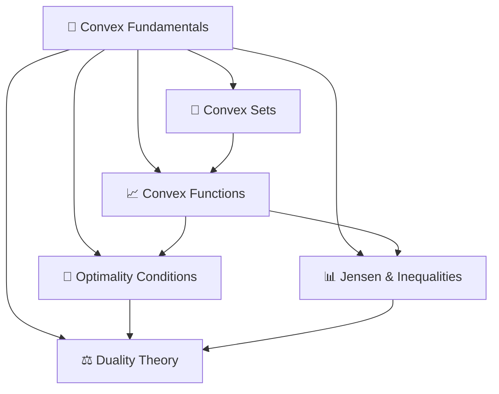

# 📐 MOC — Convex Optimization Fundamentals

> [!abstract] Section Overview
> Convex optimization is the most tractable class of optimization — any local minimum is a global minimum, and efficient algorithms with polynomial-time guarantees exist. This section builds the mathematical foundations: convex sets (characterized by the "line segment" property), convex functions (characterized by Jensen's inequality and second-order conditions), important subclasses (strictly convex, strongly convex, quasi-convex), and the fundamental geometric theorems (supporting hyperplane, separating hyperplane) that underpin duality and KKT theory. These concepts are prerequisites for understanding WHY gradient-based algorithms converge and when optimization problems are tractable.

---

## Concept Map

---

## Learning Path

Work through these notes in order — each builds on the previous:

1. [[Convex_Sets]] — Start here: the geometry of feasible regions, hyperplanes, cones, and key theorems
2. [[Convex_Functions]] — The analytic heart: definitions, first/second-order conditions, strong/strict convexity
3. [[Jensen_and_Inequalities]] — Jensen's inequality and the classical inequalities that appear everywhere in proofs
4. [[Optimality_Conditions]] — When is a point optimal? Sublevel sets, quasi-convexity, epigraphs, coercivity
5. [[Duality_Theory]] — Lagrangians, dual functions, weak/strong duality, complementary slackness

---

## All Notes in This Section

| Note | Difficulty | What You'll Learn |
|------|------------|-------------------|
| [[Convex_Sets]] | Beginner | Set definitions, operations preserving convexity, hyperplane theorems, cones |
| [[Convex_Functions]] | Beginner | First/second-order conditions, strong/strict convexity, Jensen's inequality |
| [[Jensen_and_Inequalities]] | Intermediate | Jensen's inequality proofs and applications: AM-GM, KL divergence, norm inequalities |
| [[Optimality_Conditions]] | Intermediate | Sublevel sets, quasi-convexity, epigraph, local vs global minima, coercivity |
| [[Duality_Theory]] | Advanced | Lagrangian, dual function, weak/strong duality, Slater's condition, shadow prices |

---

## Key Questions This Section Answers

1. Why does gradient descent find the global minimum for convex problems but not in general?
2. What makes the positive semidefinite cone a convex cone, and why does it matter for SDP?
3. When does strong duality hold, and what is Slater's condition intuitively?
4. How does Jensen's inequality imply KL divergence is non-negative?
5. What is the difference between strictly convex, strongly convex, and quasi-convex functions?

---

## Related Sections

- Up to master MOC: [[_MOC_Optimization_Master]]
- Next section (algorithms): [[_MOC_Unconstrained]]
- After that (KKT, constraints): [[_MOC_Constrained]]

---

#MOC #optimization #convex-fundamentals
