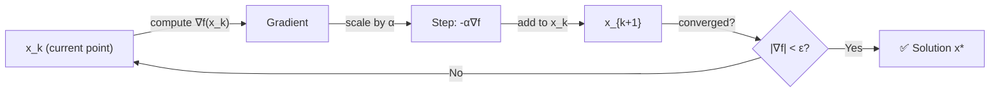

# 📉 Gradient Descent

> [!abstract] TL;DR
> Gradient descent iteratively moves a point in the direction of steepest descent — the negative gradient — by a step size α. For convex L-smooth functions it converges sublinearly at O(1/k); for strongly convex functions it converges linearly. It is the backbone of nearly all large-scale machine learning optimization.

## Intuition — analogy FIRST

Imagine you are blindfolded on a hilly landscape and want to reach the lowest valley. At each step, you feel the slope under your feet and step in the direction that goes downhill fastest. The step size α controls how bold each move is — too large and you overshoot the valley; too small and you inch along forever. Gradient descent does exactly this in the space of parameters.

---

## How It Works



**Update Rule**

$$x_{k+1} = x_k - \alpha \nabla f(x_k)$$

where α > 0 is the **step size** (learning rate).

---

## Key Concepts / Details

### Convergence Rates

| Problem Class | Rate | Bound |
|--------------|------|-------|
| Convex + L-smooth | Sublinear O(1/k) | f(x_k) - f* ≤ \|\|x_0-x*\|\|² / (2αk) |
| Strongly convex (m) + L-smooth | Linear O(ρᵏ) | \|\|x_k-x*\|\|² ≤ (1-2αmL/(m+L))ᵏ \|\|x_0-x*\|\|² |
| Non-convex | To stationary point | \|\|∇f(x_k)\|\|² → 0 |

**Condition number** κ = L/m drives linear convergence: ρ ≈ 1 - 2/(κ+1) with optimal α=2/(m+L).

### Optimal Step Size (Descent Lemma)

For an L-smooth function (∇f is L-Lipschitz), the **descent lemma** gives:

$$f(x - \tfrac{1}{L}\nabla f(x)) \leq f(x) - \frac{\|\nabla f(x)\|^2}{2L}$$

Setting α = 1/L guarantees sufficient decrease at every step. This is the canonical choice.

### Gradient Flow (Continuous Time)

As α→0, gradient descent becomes the **gradient flow ODE**:

$$\dot{x}(t) = -\nabla f(x(t))$$

Lyapunov function V(t) = f(x(t)) - f* decreases monotonically along trajectories.

### Variants

| Variant | Batch Size | Noise | Use Case |
|---------|-----------|-------|----------|
| Full-batch GD | All n | None | Small datasets, convex |
| Mini-batch SGD | B << n | Stochastic | Deep learning |
| Stochastic GD | 1 | High | Online learning |

### Python Implementation

```python
import numpy as np

def gradient_descent(f, grad_f, x0, alpha=0.01, max_iter=1000, tol=1e-6):
    """
    Vanilla gradient descent.
    f      : objective function
    grad_f : gradient of f
    x0     : starting point (np.ndarray)
    alpha  : step size
    """
    x = x0.copy().astype(float)
    history = [f(x)]

    for k in range(max_iter):
        g = grad_f(x)
        x = x - alpha * g
        history.append(f(x))
        if np.linalg.norm(g) < tol:
            print(f"Converged at iteration {k+1}")
            break

    return x, history


# --- Example: quadratic f(x) = 0.5 * x^T Q x - b^T x ---
Q = np.array([[4.0, 0.0], [0.0, 1.0]])   # condition number = 4
b = np.array([1.0, 2.0])

f      = lambda x: 0.5 * x @ Q @ x - b @ x
grad_f = lambda x: Q @ x - b

x_star = np.linalg.solve(Q, b)           # analytical solution
L = np.linalg.eigvalsh(Q).max()          # Lipschitz constant

x_opt, hist = gradient_descent(f, grad_f, np.zeros(2), alpha=1/L)
print(f"Solution: {x_opt}, True: {x_star}")
print(f"Final gap: {hist[-1] - f(x_star):.2e}")
```

---

## Real-World Notes

- Neural network training uses mini-batch SGD (or Adam, which adapts α per-parameter); full-batch GD is impractical at scale.
- Logistic regression on large datasets is trained with gradient descent; sklearn uses L-BFGS or SAG by default.
- Feature normalization (zero mean, unit variance) dramatically reduces κ and speeds convergence.
- Gradient clipping in deep learning prevents exploding gradients — a practical substitute for step size control.
- The momentum variant (Heavy Ball / Nesterov) improves convergence from O(1/k) to O(1/k²) on convex problems.

---

## Common Pitfalls

- **Step size too large**: oscillates or diverges; α > 2/L can cause f to increase each step.
- **Step size too small**: converges eventually but impractically slow; gradient norms are small near solution.
- **Ill-conditioned problem** (κ >> 1): zig-zag convergence on elongated level sets; preconditioning or Newton's method is needed.
- **Not normalizing features**: each feature has different scale → effectively different α per dimension → poor convergence.
- **Stopping too early on non-convex problems**: gradient near zero does not guarantee a global minimum, only stationarity.

---

## Related Concepts

- [[Newtons_Method]] — second-order method; same direction but rescaled by Hessian inverse for quadratic convergence
- [[Line_Search]] — automatic step size selection via Armijo/Wolfe conditions
- [[Quasi_Newton]] — BFGS approximates the Hessian to get superlinear convergence at O(n²) cost
- [[_MOC_Unconstrained|Section MOC]] — overview of all unconstrained methods

---

## Review Questions

1. Derive the convergence bound f(x_k) - f* ≤ ||x_0-x*||²/(2αk) for gradient descent on a convex L-smooth function. What property of f is used at each step?
2. Why does a large condition number κ = L/m cause gradient descent to zig-zag? How does the convergence rate ρ ≈ (κ-1)/(κ+1) relate to this?
3. Explain the descent lemma. Under what condition does setting α=1/L guarantee that f does not increase?

---

## Sources

- Boyd & Vandenberghe, *Convex Optimization*, §9.3
- Nocedal & Wright, *Numerical Optimization*, Ch. 3
- Bubeck, *Convex Optimization: Algorithms and Complexity*, §3.1

#optimization #unconstrained #beginner
