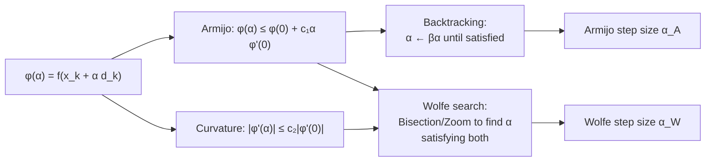

# 🔍 Line Search

> [!abstract] TL;DR
> Line search automatically selects the step size αₖ along a descent direction dₖ. Backtracking (Armijo rule) ensures sufficient decrease by shrinking α until f decreases enough. The stronger Wolfe conditions add a curvature requirement that prevents α from being unnecessarily small — this is essential for quasi-Newton methods where the curvature condition sₖᵀyₖ > 0 must hold.

## Intuition — analogy FIRST

You are descending a mountain along a chosen ridge (direction dₖ). Line search asks: how far should you walk along that ridge before stopping? Too far and you climb up the other side; too short and you waste the step. The Armijo rule ensures you reach a ledge at least as low as what the gradient predicts; the Wolfe curvature condition also ensures you did not stop too early (the slope must have reduced enough). Together they define an "acceptable interval" for α.

---

## How It Works



Define the one-dimensional function:

$$\varphi(\alpha) = f(x_k + \alpha d_k), \quad \varphi'(\alpha) = \nabla f(x_k + \alpha d_k)^\top d_k$$

---

## Key Concepts / Details

### Exact Line Search

$$\alpha_k = \arg\min_{\alpha > 0} f(x_k + \alpha d_k)$$

Exact for quadratics: closed-form α* = -∇f(x)ᵀd / (dᵀHd). For general f, requires solving a 1D optimization — rarely worth it.

### Backtracking (Armijo Rule)

Start with α = 1, multiply by β ∈ (0,1) until:

$$f(x_k + \alpha d_k) \leq f(x_k) + c\,\alpha\,\nabla f(x_k)^\top d_k$$

- c ∈ (0,1) typically 0.01–0.1; β ∈ (0,1) typically 0.5.
- Only requires function evaluations (no gradient at new point).
- Guarantees descent for any descent direction (∇f(x)ᵀdₖ < 0).
- Does **not** prevent α from being too small — not safe for quasi-Newton.

### Wolfe Conditions (Strong)

**Condition 1 — Sufficient decrease (Armijo)**:

$$f(x_k + \alpha d_k) \leq f(x_k) + c_1\,\alpha\,\nabla f(x_k)^\top d_k, \quad c_1 \in (0,1)$$

**Condition 2 — Curvature condition**:

$$|\nabla f(x_k + \alpha d_k)^\top d_k| \leq c_2\,|\nabla f(x_k)^\top d_k|, \quad c_2 \in (c_1, 1)$$

Curvature condition ensures: slope at new point is not too steep (α not too small). Typical: c₁ = 10⁻⁴, c₂ = 0.9 (GD/Newton) or c₂ = 0.1 (CG).

**Wolfe guarantee for BFGS**: the curvature condition implies sₖᵀyₖ = sₖᵀ(∇f(xₖ₊₁)-∇f(xₖ)) > 0 → Hₖ₊₁ positive definite.

### Goldstein Conditions

Two-sided bound:

$$f(x_k) + (1-c)\alpha\varphi'(0) \leq f(x_k+\alpha d_k) \leq f(x_k) + c\alpha\varphi'(0)$$

Simpler to implement than Wolfe but may exclude the Newton step α=1 for quasi-Newton.

### Zoom / Bisection Algorithm (for Wolfe)

1. Find bracketing interval [α_lo, α_hi] where an acceptable point exists.
2. Zoom: interpolate (cubic) within [α_lo, α_hi] to find trial α_j.
3. Check Wolfe conditions; update bracket and repeat.
4. Terminates in a bounded number of iterations for smooth f.

### Step Size Schedules (SGD context)

| Schedule | Formula | Notes |
|----------|---------|-------|
| Fixed | α_k = α | Requires tuning; diverges if too large |
| 1/k decay | α_k = α₀/k | Convergent for SGD (Robbins-Monro) |
| 1/√k | α_k = α₀/√k | Weaker decay; common in SGD theory |
| Cosine annealing | α_k = α_min + ½(α_max-α_min)(1+cos(kπ/T)) | Common in deep learning |
| Warmup + decay | Linear ramp then decay | Standard for transformers |

### Comparison

| Strategy | Function Evals | Gradient Evals | Safe for QN? | Notes |
|----------|---------------|---------------|-------------|-------|
| Exact | Many | Many | Yes | Only practical for quadratics |
| Armijo (backtracking) | Few | None (new point) | No | Simple; sufficient for GD/Newton |
| Wolfe | Moderate | 1+ | Yes | Required for BFGS |
| Goldstein | Moderate | 1+ | Partial | May exclude Newton step |

### Python: Backtracking Line Search

```python
import numpy as np

def backtracking_line_search(f, x, d, grad_x, alpha=1.0, beta=0.5, c=0.01):
    """
    Armijo backtracking line search.
    f      : objective function
    x      : current point
    d      : descent direction (must satisfy grad_x @ d < 0)
    grad_x : ∇f(x) (pre-computed)
    Returns: accepted step size alpha
    """
    assert grad_x @ d < 0, "d must be a descent direction"
    f_x = f(x)
    slope = grad_x @ d   # negative number

    while f(x + alpha * d) > f_x + c * alpha * slope:
        alpha *= beta

    return alpha


# --- Demo: gradient descent on Rosenbrock ---
def rosenbrock(x):
    return (1 - x[0])**2 + 100*(x[1] - x[0]**2)**2

def grad_rosenbrock(x):
    return np.array([
        -2*(1 - x[0]) - 400*x[0]*(x[1] - x[0]**2),
         200*(x[1] - x[0]**2)
    ])

x = np.array([-1.5, 0.5])
history = [rosenbrock(x)]

for _ in range(5000):
    g = grad_rosenbrock(x)
    if np.linalg.norm(g) < 1e-6:
        break
    d = -g    # steepest descent
    alpha = backtracking_line_search(rosenbrock, x, d, g)
    x = x + alpha * d
    history.append(rosenbrock(x))

print(f"Solution: {x}, f*={history[-1]:.2e}, iters={len(history)-1}")
```

---

## Real-World Notes

- SciPy's `minimize` uses the strong Wolfe conditions via `line_search_wolfe2` internally for L-BFGS-B and CG methods.
- Deep learning frameworks do not use line search per iteration — the cost of an extra forward pass outweighs benefits for noisy mini-batch gradients; fixed/scheduled α is preferred.
- In interior-point methods, the step size is limited by the requirement to stay in the feasible interior; a modified backtracking applies.
- Sufficient decrease alone does not guarantee convergence of quasi-Newton — Wolfe is non-negotiable for BFGS.
- The Zoom algorithm from Nocedal & Wright §3.5 is the standard production implementation.

---

## Common Pitfalls

- **Using Armijo alone with BFGS**: sₖᵀyₖ may be negative → indefinite Hessian update → divergence.
- **c₁ too large** (e.g., 0.5): too restrictive; almost no α passes the test, causing excessive shrinkage.
- **β too small** (e.g., 0.1): aggressive shrinkage wastes good step sizes; β = 0.5 is robust.
- **Initial α ≠ 1 for Newton/quasi-Newton**: the unit step α=1 should always be tried first; it recovers fast local convergence.
- **Line search in noisy settings**: stochastic gradients make the Armijo condition unreliable; use fixed schedules or variance-reduced methods instead.

---

## Related Concepts

- [[Gradient_Descent]] — line search determines the step size in each GD iteration
- [[Newtons_Method]] — damped Newton uses backtracking; pure Newton uses α=1
- [[Quasi_Newton]] — Wolfe conditions are required to maintain BFGS positive definiteness
- [[Trust_Region]] — the alternative framework: jointly chooses direction and step inside a ball
- [[_MOC_Unconstrained|Section MOC]] — overview of all unconstrained methods

---

## Review Questions

1. State the Armijo sufficient decrease condition. Why does it guarantee that f(xₖ₊₁) < f(xₖ) as long as dₖ is a descent direction?
2. Why is the Wolfe curvature condition necessary for BFGS but not for gradient descent? Trace through how its violation breaks the BFGS update.
3. Describe the Zoom algorithm in 3 steps. What invariant does the bracketing interval [α_lo, α_hi] maintain throughout?

---

## Sources

- Nocedal & Wright, *Numerical Optimization*, Ch. 3
- Boyd & Vandenberghe, *Convex Optimization*, §9.2 (backtracking)
- Wolfe, P. (1969), "Convergence conditions for ascent methods"

#optimization #unconstrained #intermediate
