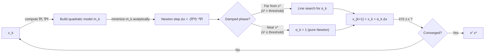

# 🔢 Newton's Method

> [!abstract] TL;DR
> Newton's method minimizes f by locally fitting a quadratic model (second-order Taylor expansion) and stepping to its minimum. This gives quadratic convergence near the solution — the number of correct digits doubles each iteration — but at the cost of computing and inverting the n×n Hessian (O(n³) per step). The Newton decrement λ²/2 provides a tight, affine-invariant stopping criterion.

## Intuition — analogy FIRST

Gradient descent uses only the slope of the terrain (first derivative). Newton's method also uses the curvature (second derivative). Imagine walking downhill: gradient descent always takes a fixed-length stride regardless of terrain shape, while Newton's method stretches its stride on flat plains and shortens it in narrow ravines. On a pure quadratic bowl, a single Newton step lands exactly at the minimum.

---

## How It Works



**Update Rule** (derived from 2nd-order Taylor expansion of f at x_k):

$$x_{k+1} = x_k - [\nabla^2 f(x_k)]^{-1}\, \nabla f(x_k)$$

---

## Key Concepts / Details

### Derivation from Taylor Expansion

Second-order Taylor model around x_k:

$$m_k(x_k + \Delta x) \approx f(x_k) + \nabla f(x_k)^\top \Delta x + \tfrac{1}{2}\Delta x^\top \nabla^2 f(x_k)\, \Delta x$$

Minimizing over Δx: set derivative to zero →

$$\nabla^2 f(x_k)\,\Delta x = -\nabla f(x_k) \implies \Delta x_\text{nt} = -[\nabla^2 f(x_k)]^{-1}\nabla f(x_k)$$

### Newton Decrement

$$\lambda(x)^2 = \nabla f(x)^\top [\nabla^2 f(x)]^{-1} \nabla f(x)$$

- Equals ||Δx_nt||²_{∇²f(x)} (squared Hessian norm of the Newton step).
- Provides a tight estimate of the suboptimality gap: f(x) - f* ≈ λ²/2.
- **Stopping criterion**: halt when λ²/2 ≤ ε; affine-invariant, unlike ||∇f||.

### Convergence Phases

| Phase | Condition | Behavior |
|-------|-----------|----------|
| Damped Newton | λ(x) > η (far from x*) | Linear decrease; use backtracking |
| Pure Newton | λ(x) ≤ η (local region) | Quadratic convergence |

**Quadratic convergence** (local):

$$\|x_{k+1} - x^*\| \leq C\,\|x_k - x^*\|^2$$

where C = (L_H / 2m) with L_H the Lipschitz constant of ∇²f and m the strong convexity constant. Each correct digit doubles each iteration.

### Affine Invariance

Newton's method is invariant to linear transformations of variables: if y = Ax, the iterates in y-space correspond exactly to iterates in x-space. Gradient descent is NOT affine-invariant — its convergence depends on the condition number κ = L/m of the Hessian.

### Newton Step as Hessian-Norm Steepest Descent

$$\Delta x_\text{nt} = \arg\min_{\|v\|_{\nabla^2 f(x)} \leq 1} \nabla f(x)^\top v$$

The Newton step is the steepest descent direction in the Hessian-induced norm ||v||_H = √(vᵀHv).

### Modified Newton (Indefinite Hessian)

When ∇²f is indefinite (non-convex region), add a diagonal shift:

$$(\nabla^2 f(x_k) + \tau I)\,\Delta x = -\nabla f(x_k), \quad \tau \geq 0$$

Choose τ via modified Cholesky factorization so the shifted matrix is positive definite.

### Cost Comparison

| Method | Cost per Iter | Convergence | Memory |
|--------|--------------|-------------|--------|
| Gradient Descent | O(n) | Linear (strongly cvx) | O(n) |
| Newton's Method | O(n³) | Quadratic (local) | O(n²) |
| L-BFGS | O(mn) | Superlinear | O(mn) |

### Python Implementation

```python
import numpy as np

def newton_method(f, grad_f, hess_f, x0, max_iter=50, tol=1e-8):
    """
    Newton's method with backtracking line search.
    Uses Newton decrement as stopping criterion.
    """
    x = x0.copy().astype(float)
    history = [f(x)]

    for k in range(max_iter):
        g = grad_f(x)
        H = hess_f(x)

        # Newton step: solve H * dx = -g
        dx = np.linalg.solve(H, -g)

        # Newton decrement squared
        lam2 = -g @ dx           # = g^T H^{-1} g (since dx = -H^{-1}g)

        if lam2 / 2 <= tol:
            print(f"Converged at iteration {k+1}, λ²/2 = {lam2/2:.2e}")
            break

        # Backtracking line search (Armijo)
        alpha, beta, c = 1.0, 0.5, 0.01
        while f(x + alpha * dx) > f(x) + c * alpha * g @ dx:
            alpha *= beta

        x = x + alpha * dx
        history.append(f(x))

    return x, history


# --- Example: log-sum-exp (smooth convex) ---
def log_sum_exp(x):
    return np.log(np.sum(np.exp(x)))

def grad_lse(x):
    e = np.exp(x)
    return e / e.sum()

def hess_lse(x):
    p = np.exp(x) / np.exp(x).sum()
    return np.diag(p) - np.outer(p, p)

np.random.seed(0)
x0 = np.random.randn(5)
x_opt, hist = newton_method(log_sum_exp, grad_lse, hess_lse, x0)
print(f"Iterations: {len(hist)-1}")
print(f"Final f value: {hist[-1]:.6f}")
```

---

## Real-World Notes

- Newton's method is standard for small-to-medium scale convex optimization (n < ~10,000) in operations research and statistics.
- Trust region methods (Levenberg-Marquardt) are the practical variant for nonlinear least squares.
- In interior-point methods, each barrier function iteration is a Newton step on a modified objective.
- For logistic regression with n~thousands, full Newton's method is competitive; for n~millions, L-BFGS or SGD dominate.
- The Newton decrement provides a certificate of near-optimality — rare in first-order methods.

---

## Common Pitfalls

- **Indefinite Hessian**: in non-convex regions, the raw Newton step may ascend; use modified Cholesky or add regularization.
- **Singular Hessian**: at saddle points or flat regions, [∇²f]⁻¹ is undefined; perturbation or L-BFGS is safer.
- **O(n³) cost**: for large n, forming and factoring the Hessian is prohibitive; switch to quasi-Newton.
- **Slow damped phase**: far from the solution, Newton + backtracking may take many small steps; gradient descent or L-BFGS often faster globally.
- **Quadratic convergence is local**: the fast phase only kicks in once x_k is close to x*; the convergence basin may be small.

---

## Related Concepts

- [[Gradient_Descent]] — first-order baseline; Newton extends it with curvature information
- [[Quasi_Newton]] — BFGS/L-BFGS approximate the Hessian to avoid O(n³) cost
- [[Trust_Region]] — alternative to damped Newton; jointly chooses step and direction within a ball
- [[Line_Search]] — provides the Armijo/Wolfe conditions used in the damped Newton phase
- [[_MOC_Unconstrained|Section MOC]] — overview of all unconstrained methods

---

## Review Questions

1. Derive the Newton step from the second-order Taylor expansion of f. Under what conditions does the resulting system have a unique solution?
2. What is the Newton decrement λ(x)² and why is λ²/2 ≤ ε a better stopping criterion than ||∇f|| ≤ ε?
3. Explain why Newton's method is affine-invariant but gradient descent is not. What practical implication does this have for feature scaling?

---

## Sources

- Boyd & Vandenberghe, *Convex Optimization*, §9.5–9.6
- Nocedal & Wright, *Numerical Optimization*, Ch. 3
- Bertsekas, *Nonlinear Programming*, §1.3

#optimization #unconstrained #intermediate
