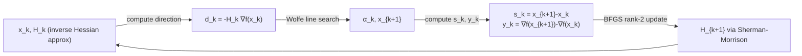

# ⚡ Quasi-Newton Methods

> [!abstract] TL;DR
> Quasi-Newton methods build an approximation Bₖ ≈ ∇²f(xₖ) from gradient differences, avoiding the O(n³) cost of explicit Hessian computation. BFGS achieves superlinear convergence (between linear and quadratic) at O(n²) cost per iteration. L-BFGS stores only the last m vector pairs to reduce memory to O(mn), making it the standard large-scale unconstrained optimizer.

## Intuition — analogy FIRST

Imagine driving through a mountain pass in fog: you cannot see the full curvature of the road (the Hessian), but you remember the last few turns and how the road curved between them (gradient differences). Quasi-Newton methods use this gradient history to build a running estimate of the terrain's curvature — good enough for near-quadratic convergence, without measuring every second derivative explicitly.

---

## How It Works



**Search Direction** (using inverse Hessian approximation Hₖ = Bₖ⁻¹):

$$d_k = -H_k \nabla f(x_k), \quad x_{k+1} = x_k + \alpha_k d_k$$

---

## Key Concepts / Details

### Secant Condition

The key constraint on Bₖ₊₁ is that it matches the observed curvature:

$$B_{k+1} s_k = y_k$$

where sₖ = xₖ₊₁ - xₖ (step) and yₖ = ∇f(xₖ₊₁) - ∇f(xₖ) (gradient change).

This ensures Bₖ₊₁ reproduces the true Hessian action along the most recent direction. Since Bₖ₊₁ is under-determined (n² unknowns, n equations), BFGS picks the update closest to Bₖ in the Frobenius norm.

### BFGS Update Formula

**Hessian approximation Bₖ₊₁** (rank-2 update):

$$B_{k+1} = B_k - \frac{B_k s_k s_k^\top B_k}{s_k^\top B_k s_k} + \frac{y_k y_k^\top}{y_k^\top s_k}$$

**Inverse Hessian Hₖ₊₁ = Bₖ₊₁⁻¹** (via Sherman-Morrison-Woodbury):

$$H_{k+1} = \Bigl(I - \rho_k s_k y_k^\top\Bigr) H_k \Bigl(I - \rho_k y_k s_k^\top\Bigr) + \rho_k s_k s_k^\top, \quad \rho_k = \frac{1}{y_k^\top s_k}$$

**Positive definiteness** maintained if curvature condition sₖᵀyₖ > 0 holds (guaranteed by Wolfe line search).

### BFGS Convergence

- **Global**: converges for strongly convex f with Wolfe line search.
- **Local**: superlinear convergence — the ratio ||x_{k+1}-x*|| / ||x_k-x*|| → 0 (better than linear, not as fast as quadratic).
- Each iteration costs O(n²) for the matrix-vector product Hₖ∇f.

### L-BFGS: Limited-Memory BFGS

Instead of storing Hₖ explicitly (O(n²) memory), L-BFGS stores the last m pairs {sₖ, yₖ}:

**Two-loop recursion** to compute Hₖ∇f without forming Hₖ:

```
Algorithm L-BFGS two-loop recursion:
  Input: g = ∇f(x_k), pairs {(s_i, y_i)} for i = k-m,...,k-1
  q ← g
  for i = k-1, ..., k-m:
      α_i ← ρ_i * s_i^T q
      q   ← q - α_i * y_i
  r ← H_0 * q    (H_0 = γ_k I, scaled identity)
  for i = k-m, ..., k-1:
      β   ← ρ_i * y_i^T r
      r   ← r + s_i * (α_i - β)
  return r   (= H_k g)
```

Memory: O(mn) instead of O(n²). Typical m ∈ {5, 10, 20}.

### Method Comparison

| Method | Cost/Iter | Convergence | Memory | Use Case |
|--------|-----------|-------------|--------|----------|
| Gradient Descent | O(n) | Linear (str. cvx) | O(n) | Large-scale, noisy |
| BFGS | O(n²) | Superlinear | O(n²) | n ≲ 10,000 |
| L-BFGS | O(mn) | Superlinear | O(mn) | n ≫ 10,000 |
| Newton | O(n³) | Quadratic (local) | O(n²) | n ≲ 1,000 |

### Other Quasi-Newton Updates

| Method | Formula | Property |
|--------|---------|----------|
| SR1 (Symmetric Rank-1) | Bₖ₊₁ = Bₖ + (y-Bs)(y-Bs)ᵀ/(y-Bs)ᵀs | Simple; no PD guarantee |
| DFP (Davidon-Fletcher-Powell) | Dual of BFGS | Historically first; inferior in practice |
| Broyden class | Convex combo of BFGS & DFP | Parametric family |

### Python: L-BFGS Two-Loop Recursion

```python
import numpy as np

def lbfgs(f, grad_f, x0, m=10, max_iter=200, tol=1e-6):
    """L-BFGS with Wolfe line search (simplified backtracking version)."""
    x = x0.copy().astype(float)
    g = grad_f(x)
    ss, ys, rhos = [], [], []
    history = [f(x)]

    for k in range(max_iter):
        if np.linalg.norm(g) < tol:
            print(f"Converged at iter {k}, ||g||={np.linalg.norm(g):.2e}")
            break

        # Two-loop recursion
        q = g.copy()
        alphas = []
        for s, y, rho in zip(reversed(ss), reversed(ys), reversed(rhos)):
            a = rho * s @ q
            alphas.append(a)
            q -= a * y
        # Scale initial Hessian
        if ss:
            gamma = ss[-1] @ ys[-1] / (ys[-1] @ ys[-1])
        else:
            gamma = 1.0
        r = gamma * q
        for s, y, rho, a in zip(ss, ys, rhos, reversed(alphas)):
            b = rho * y @ r
            r += s * (a - b)
        d = -r   # search direction

        # Backtracking line search
        alpha, beta, c = 1.0, 0.5, 1e-4
        f_x = f(x)
        while f(x + alpha * d) > f_x + c * alpha * (g @ d):
            alpha *= beta

        x_new = x + alpha * d
        g_new = grad_f(x_new)
        s = x_new - x
        y = g_new - g
        if y @ s > 0:           # curvature condition
            ss.append(s.copy())
            ys.append(y.copy())
            rhos.append(1.0 / (y @ s))
            if len(ss) > m:
                ss.pop(0); ys.pop(0); rhos.pop(0)

        x, g = x_new, g_new
        history.append(f(x))

    return x, history


# Test on Rosenbrock: f(x,y) = (1-x)^2 + 100(y-x^2)^2
f  = lambda x: (1-x[0])**2 + 100*(x[1]-x[0]**2)**2
gf = lambda x: np.array([
    -2*(1-x[0]) - 400*x[0]*(x[1]-x[0]**2),
     200*(x[1]-x[0]**2)
])
x_opt, hist = lbfgs(f, gf, np.array([-1.0, 1.0]))
print(f"Solution: {x_opt}, f*={hist[-1]:.2e}")
```

---

## Real-World Notes

- `scipy.optimize.minimize(method='L-BFGS-B')` is the default workhorse for smooth, bounded optimization in Python.
- PyTorch's `torch.optim.LBFGS` implements L-BFGS for small-scale neural networks or fine-tuning.
- L-BFGS underlies many natural language processing optimization routines (CRF training, etc.).
- In practice m=10 recovers nearly all the benefit of full BFGS, even for n~millions.
- BFGS with Wolfe line search is the default in many NLP solvers (e.g., in MATLAB's `fminunc`).

---

## Common Pitfalls

- **Curvature condition violation** (sₖᵀyₖ ≤ 0): Hₖ₊₁ becomes indefinite; skip the update or use damped BFGS.
- **Poor initial scaling**: H₀ = I performs poorly if f is badly scaled; the γₖ scaling step in L-BFGS helps significantly.
- **Stochastic gradients**: BFGS assumes exact gradients; noisy gradients from mini-batches destroy curvature estimates. Use Adam/SGD for stochastic settings.
- **Too small m in L-BFGS**: m < 3 loses significant curvature information; m=5 is a safe minimum.
- **Ignoring Wolfe conditions**: Armijo alone does not guarantee sₖᵀyₖ > 0; the curvature condition in Wolfe ensures positive definiteness is maintained.

---

## Related Concepts

- [[Newtons_Method]] — L-BFGS is the practical large-scale substitute for Newton
- [[Line_Search]] — Wolfe conditions are essential for BFGS positive definiteness
- [[Gradient_Descent]] — first-order baseline that L-BFGS improves upon
- [[_MOC_Unconstrained|Section MOC]] — overview of all unconstrained methods

---

## Review Questions

1. State the secant condition Bₖ₊₁sₖ = yₖ. How does it encode curvature information, and how many degrees of freedom remain in Bₖ₊₁ after imposing it?
2. Explain the L-BFGS two-loop recursion in words. Why does it give the same result as applying Hₖ to ∇f without storing Hₖ explicitly?
3. Why must the Wolfe curvature condition be used (rather than just Armijo) in BFGS, and what goes wrong if sₖᵀyₖ ≤ 0?

---

## Sources

- Nocedal & Wright, *Numerical Optimization*, Ch. 6–7
- Liu & Nocedal (1989), "On the limited memory BFGS method for large scale optimization"
- Broyden (1970), "The convergence of a class of double-rank minimization algorithms"

#optimization #unconstrained #intermediate
