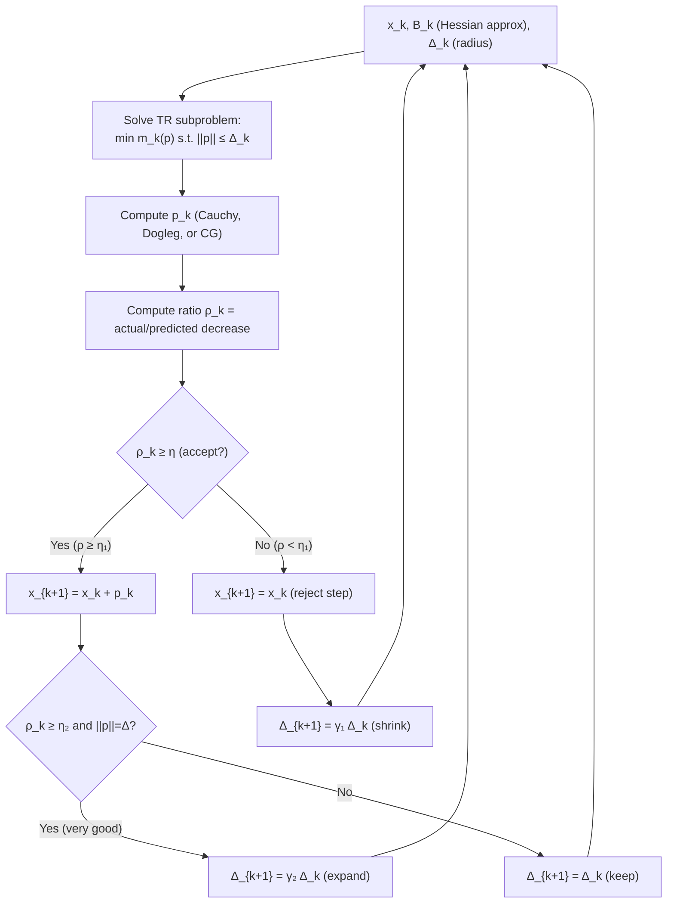
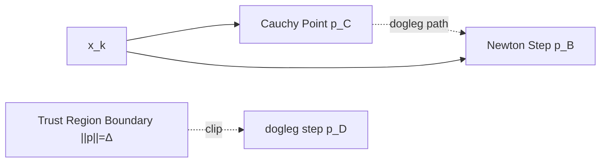

# 🎯 Trust Region Methods

> [!abstract] TL;DR
> Trust region methods jointly choose a step direction and length by minimizing a local quadratic model mₖ(p) inside a ball ||p|| ≤ Δ (the "trust region"). The radius Δ is adapted based on how well the model predicted the actual function decrease. This makes trust region methods more robust than line search near indefinite Hessians, singular regions, and in nonlinear least squares (Levenberg-Marquardt).

## Intuition — analogy FIRST

Line search first picks a direction, then decides how far to go. Trust region does it backwards: it defines a neighborhood within which the quadratic model is trusted to be accurate, then finds the best move within that neighborhood. Think of it as "I trust my map within a 10-mile radius; I'll take the best route inside that region, then reassess." After each step, if the map was accurate (actual decrease ≈ predicted decrease), expand the trusted region; if not, shrink it.

---

## How It Works



**Trust Region Subproblem**:

$$\min_{p \in \mathbb{R}^n} m_k(p) = f(x_k) + \nabla f(x_k)^\top p + \tfrac{1}{2} p^\top B_k p \quad \text{s.t.} \quad \|p\| \leq \Delta_k$$

---

## Key Concepts / Details

### Quality Ratio

$$\rho_k = \frac{f(x_k) - f(x_k + p_k)}{m_k(0) - m_k(p_k)}$$

- Numerator: **actual** reduction in f.
- Denominator: **predicted** reduction by the quadratic model.
- ρ ≈ 1: model excellent → expand Δ; ρ < 0: model failed → shrink Δ; 0 < ρ < η₁: accept step but keep Δ.

Typical thresholds: η₁ = 0.1 (accept), η₂ = 0.9 (expand), γ₁ = 0.25, γ₂ = 2.

### Solving the TR Subproblem (Exact)

Via Lagrange multipliers, the solution satisfies:

$$(B_k + \lambda I)\, p = -\nabla f(x_k), \quad \lambda \geq 0$$

with λ chosen so either:
- **Easy case**: λ = 0 and ||p_B|| ≤ Δ (unconstrained Newton step inside ball).
- **Hard case**: λ > 0 and ||p|| = Δ (boundary solution).

For the hard case, λ is found by root-finding on ||p(λ)|| = Δ (secular equation), e.g., by bisection.

### Cauchy Point

The **Cauchy point** p_C is the gradient descent step clipped to the trust region boundary:

$$p_C = -\tau_k \frac{\Delta_k}{\|\nabla f(x_k)\|} \nabla f(x_k)$$

where τₖ ∈ (0,1] accounts for negative curvature. Any solver must achieve at least Cauchy decrease to guarantee global convergence.

### Dogleg Method

Interpolates between the Cauchy point and the full Newton step:

$$p(\tau) = \begin{cases} \tau p_C, & 0 \leq \tau \leq 1 \\ p_C + (\tau-1)(p_B - p_C), & 1 \leq \tau \leq 2 \end{cases}$$

where p_B = -B_k⁻¹∇f(x_k) is the Newton step. Find τ so ||p(τ)|| = Δ (one-dimensional root). No iterative solve needed — cost is O(n²).



### Steihaug-CG (Large Scale)

For large n where B_k is given implicitly, run conjugate gradients (CG) on (Bₖ+λI)p = -∇f until:
1. CG iterates hit the trust region boundary → clip and return.
2. A negative curvature direction is encountered → move to boundary along that direction.
3. CG converges inside the ball.

Cost: O(n) per CG iteration; O(kn) for k CG steps. Ideal for large-scale TR with matrix-free Hessian.

### Levenberg-Marquardt (Nonlinear Least Squares)

For f(x) = ½||r(x)||²:

- Gauss-Newton Hessian approximation: Bₖ = JᵀJ (J = Jacobian of r).
- TR subproblem becomes: (JᵀJ + λI)p = -Jᵀr(x_k).
- λ plays the role of the trust region Lagrange multiplier: large λ → gradient descent; small λ → Gauss-Newton.
- Extremely robust for curve fitting, bundle adjustment, SLAM.

### Line Search vs Trust Region

| Aspect | Line Search | Trust Region |
|--------|------------|-------------|
| Direction first, then step | Yes | No (joint) |
| Handles indefinite Hessian | Needs modification | Natural (via λ) |
| Guarantees decrease | With Armijo | By construction (ρ > η) |
| Step rejection | Rare (just small α) | Explicit (ρ < η₁) |
| Complexity | O(n) – O(n²)/iter | O(n²) – O(n³)/iter |
| Best for | Smooth well-conditioned | Ill-conditioned, NLS |

### Python: Trust Region with Dogleg (2D Example)

```python
import numpy as np

def dogleg_step(g, B, Delta):
    """Compute dogleg step for trust region subproblem."""
    # Full Newton step
    try:
        p_B = np.linalg.solve(B, -g)
    except np.linalg.LinAlgError:
        p_B = None

    # Cauchy step direction and scale
    gBg = g @ B @ g
    if gBg > 0:
        tau_C = min(1.0, (g @ g)**1.5 / (Delta * gBg))
        p_C = -tau_C * (Delta / np.linalg.norm(g)) * g
    else:
        p_C = -Delta / np.linalg.norm(g) * g

    if p_B is None or np.linalg.norm(p_B) >= Delta:
        return p_C  # stay on Cauchy direction

    if np.linalg.norm(p_B) <= Delta:
        return p_B  # Newton step inside ball

    # Interpolate: p_C + t*(p_B - p_C), find t so ||p||=Delta
    d = p_B - p_C
    a = d @ d
    b = 2 * p_C @ d
    c = p_C @ p_C - Delta**2
    t = (-b + np.sqrt(b**2 - 4*a*c)) / (2*a)
    return p_C + t * d


def trust_region(f, grad_f, hess_f, x0, Delta0=1.0, max_iter=100, tol=1e-6):
    x = x0.copy().astype(float)
    Delta = Delta0
    history = [f(x)]
    eta1, eta2 = 0.1, 0.9

    for k in range(max_iter):
        g = grad_f(x)
        if np.linalg.norm(g) < tol:
            print(f"Converged at iter {k+1}")
            break
        B = hess_f(x)

        p = dogleg_step(g, B, Delta)

        f_x = f(x)
        actual   = f_x - f(x + p)
        predicted = -(g @ p + 0.5 * p @ B @ p)
        rho = actual / predicted if abs(predicted) > 1e-14 else 0.0

        if rho >= eta1:
            x = x + p          # accept step

        # Update trust region radius
        if rho < eta1:
            Delta *= 0.25
        elif rho >= eta2 and abs(np.linalg.norm(p) - Delta) < 1e-10:
            Delta = min(2*Delta, 10.0)

        history.append(f(x))

    return x, history


# Test: Rosenbrock
f  = lambda x: (1-x[0])**2 + 100*(x[1]-x[0]**2)**2
gf = lambda x: np.array([
    -2*(1-x[0]) - 400*x[0]*(x[1]-x[0]**2),
     200*(x[1]-x[0]**2)])
hf = lambda x: np.array([
    [2 - 400*(x[1]-x[0]**2) + 800*x[0]**2, -400*x[0]],
    [-400*x[0],  200.0]])

x_opt, hist = trust_region(f, gf, hf, np.array([-1.0, 1.0]))
print(f"Solution: {x_opt}, f*={hist[-1]:.2e}")
```

---

## Real-World Notes

- Levenberg-Marquardt is the standard method for nonlinear least squares (scipy.optimize.least_squares, ceres-solver in robotics).
- Bundle adjustment in computer vision (3D reconstruction) uses large-scale TR with sparse Jacobians and Steihaug-CG.
- Trust region methods handle indefinite Hessians naturally — valuable in non-convex training of neural networks (though too expensive for large n).
- The ratio ρₖ provides a built-in diagnostic: consistently low ρ signals the model quality is poor (wrong B, strong nonlinearity).
- TRLIB and GALAHAD implement production-quality trust region solvers with sophisticated subproblem solvers.

---

## Common Pitfalls

- **Δ₀ too large**: first step uses the unconstrained Newton step, which may be far from valid; start with Δ₀ = 0.1–1 and let the method adapt.
- **Not verifying Cauchy decrease**: any approximate TR subproblem solver must achieve at least Cauchy decrease, or global convergence proofs break.
- **Hard case** (∇f in null space of B+λI): the secular equation has no root near the boundary; requires special handling (see Nocedal & Wright §4.3).
- **Expensive subproblem**: exact TR solution costs O(n³); for large n, use Steihaug-CG or dogleg.
- **Levenberg-Marquardt with rank-deficient J**: JᵀJ is singular; the λI regularization saves the system but must be large enough.

---

## Related Concepts

- [[Newtons_Method]] — TR extends Newton by constraining the step to a ball; LM ≈ regularized Newton on NLS
- [[Line_Search]] — the alternative framework; line search is simpler but less robust near singularities
- [[Quasi_Newton]] — TR can use a BFGS Hessian approximation instead of the true Hessian
- [[_MOC_Unconstrained|Section MOC]] — overview of all unconstrained methods

---

## Review Questions

1. Define the trust region ratio ρₖ. What does ρₖ ≈ 1 vs ρₖ ≈ 0 vs ρₖ < 0 each signal about the quadratic model quality?
2. Describe the dogleg path in terms of the Cauchy point and Newton step. When does the dogleg step lie on the boundary of the trust region vs in the interior?
3. In Levenberg-Marquardt, what is the role of the regularization parameter λ? How does it interpolate between gradient descent (λ → ∞) and Gauss-Newton (λ → 0)?

---

## Sources

- Nocedal & Wright, *Numerical Optimization*, Ch. 4
- Conn, Gould & Toint, *Trust Region Methods* (SIAM, 2000)
- Marquardt (1963), "An algorithm for least-squares estimation of nonlinear parameters"

#optimization #unconstrained #advanced
